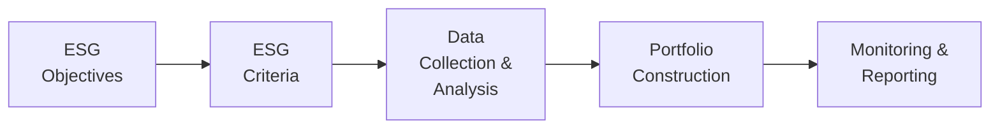

## Overview

It’s probably no surprise that many institutional investors—think endowments, foundations, and pension funds—are getting more serious about ESG (Environmental, Social, and Governance) considerations. In fact, I remember back when a friend who managed a small foundation told me, “Well, donors are asking us to detail both financial returns and social outcomes. We can’t just ignore that.” And honestly, that sentiment seems to be echoing across boardrooms everywhere.

This section will guide you through a structured overview of how to incorporate ESG factors into portfolios while juggling other constraints. We’ll talk about frameworks for systematic ESG evaluation, discuss how to reconcile potential conflicts with return objectives, and examine the broader constraints that come with institutional investing—like philanthropic rules, donor restrictions, or local regulatory guidelines. We’ll finish by briefly covering how to track ESG progress, engage with companies, and measure performance despite ever-present data challenges.

## ESG Integration in Institutional Context

Institutional investors, such as college endowments or large philanthropic foundations, hold a unique place in the market. They aren’t just hunting for alpha; they must also align their strategies with long-term obligations, philanthropic missions, and stakeholder interests. This means ESG is rarely a purely guilt-driven initiative. Instead, ESG can lower long-term risks, resolve stakeholder demands, and help achieve the moral or mission-oriented goals an institution sets for itself.

• Pressure from Stakeholders: Boards, students, donors, and other benefactors frequently raise concerns about how capital is invested. Some folks are particularly worried about environmental impact, others about labor standards, corporate accountability, or involvement in certain industries like tobacco or fossil fuels. Institutions have to be ready to respond and show robust, systematic approaches to address those concerns.

• Reputational Risks and Opportunities: ESG integration can reduce reputational risk by avoiding controversial investments. Conversely, well-designed ESG strategies can highlight the institution’s moral leadership—always a nice plus when raising funds or simply staying in good standing with the community.

## Key ESG Frameworks for Institutional Portfolios

Getting practical: How do you actually fold ESG considerations into your investment process? Let’s outline a few widely used frameworks:

• Negative Screening: Perhaps the simplest approach, negative screening is about excluding companies or entire sectors that don’t meet certain ESG standards—like divesting from tobacco or weapons manufacturers. Easy to explain, but can reduce diversification if you’re not careful.

• Best-in-Class Selection: Instead of excluding entire sectors, pick companies that are top ESG performers within their industries. For instance, you might still invest in an oil major, but only if that company is recognized as an industry leader in reducing emissions and improving transparency.

• ESG Scoring: Some large institutional investors rely on proprietary or third-party ESG scores to rank investments. The portfolio manager might tilt exposures to companies with higher ESG ratings, gradually shifting exposure away from those with lower ESG ratings.

• Shareholder Engagement: Another track is to keep your shares but push for changes. You can influence corporate policies by voting your proxies or participating in shareholder initiatives. This approach can be powerful if you have enough clout (and a seat at the table).

A typical integrated ESG process might look this way:

These steps ensure a feedback loop—refining the ESG process over time as data, stakeholder priorities, and investment opportunities evolve.

## Balancing ESG Objectives with Return Goals

It’s easy to assume that ESG-friendly portfolios automatically lag when certain big sectors are excluded, but the performance question is more nuanced. Some institutions worry that excluding swaths of the market—like fossil fuels—will reduce returns. Others argue that high ESG performers face fewer legal or reputational risks, potentially boosting performance. In practice, the outcomes vary, and it’s essential to:

• Conduct Thorough Risk-Return Analysis: Evaluate if the ESG overlay decreases diversification. Are you generally overweighting or underweighting certain industries? Are potential alpha sources compromised by restricting certain sectors?

• Scenario Testing: Test how your screened portfolio stands up in different macro environments. For instance, if energy stocks spike, a climate-friendly endowment with no energy holdings might fall behind.

• Time Horizon: Missions of endowments often stretch across decades—not just a single quarter or year. A longer time frame might be beneficial for ESG strategies, especially if the institution invests in forward-thinking companies primed for regulatory changes or shifting consumer preferences.

In short, institutions must weigh short-term trade-offs in returns against the longer-term benefits of risk mitigation and mission alignment.

## The Divestment Debate and Liquidity Concerns

Divestment from specific industries—like fossil fuels or private prison operators—has been a hot topic. Yes, divestment may appear straightforward: Sell what you don’t like and invest in something else. But the real stories in portfolio management are rarely so neat:

• Diversification: Divestment reduces your investable universe. That can be okay if your portfolio is large and has plenty of alternative opportunities, but watch for heavier exposures in other sectors that might inadvertently increase total portfolio volatility.

• Liquidity: Some endowments hold assets that trade infrequently, especially in private markets. Exiting a private equity fund with fossil-fuel investments on short notice can amplify liquidity risk and might even force fire sales in suboptimal conditions.

• Long-Term Impact: Critics sometimes note that divestment might not actually change company behavior if other investors happily pick up the shares. In such cases, active engagement might be more impactful. From an institutional viewpoint, it’s essential to articulate a clear rationale for divestment that aligns with your stated objectives.

## Other Constraints Affecting Institutional Portfolios

ESG is important, but it’s only one piece of a broader puzzle. Institutions face numerous other constraints that can shape portfolio decisions:

• Legal and Regulatory Restrictions: In many jurisdictions, certain investments are off-limits to specific types of nonprofits or pension funds—like derivative usage constraints, limitations on leverage, or region-specific rules about certain resource investments.

• Donor Instructions: Some donors specifically state how funds should be invested—or perhaps how they should not be invested. You might see instructions that the portfolio avoids “sin stocks” such as alcohol or gambling-related businesses, or invests only in “impactful microfinance.”

• Mission Alignment: Many universities or religious-affiliated institutions want their entire investment strategy to reflect their mission or faith-based values. Think of healthcare systems that refuse to invest in tobacco or alcoholic beverages, or religious groups that prohibit investments in certain industries for ethical reasons.

• Unique Philanthropic Objectives: Named endowments or scholarships might come with special terms from the donors. Perhaps a portion of the returns must be channeled to a specific department, or the fund can only invest in local community initiatives. Managing these constraints across multiple named funds can be a logistical challenge but is critical to fulfilling donor expectations.

## Data and Measurement Challenges

Integrating ESG data into your usual performance tracking can feel like you’re piecing together a puzzle in the dark—there’s no complete, standardized reporting system. ESG ratings from Provider A might significantly differ from those of Provider B. So how do you handle it?

• Multiple Data Providers: Consider using more than one ESG rating provider to construct a blended or consensus view. This helps reduce provider-specific biases.

• Proprietary Scoring Models: Some institutions build their own scoring frameworks, pulling raw data from multiple sources. This can be resource-intensive, but it also provides consistency and transparency if done well.

• Real-Time Monitoring: ESG issues can evolve quickly. You might build or purchase systems that alert you to big corporate controversies—like workplace scandals or environmental spills—so you’re able to reassess holdings in real time.

• Verification and Consistency: Encourage investee companies to adopt widely recognized reporting frameworks like the Global Reporting Initiative (GRI). The more standardization we see, the better the ESG data quality will become.

## Tracking ESG Progress and Active Engagement

There’s no point in adopting ESG screens or best-in-class strategies if you never measure progress. Some institutions issue annual “impact reports,” summarizing how well they performed on financial metrics and whether they hit their ESG goals. Typical approaches include:

• Proprietary vs. Third-Party Ratings: Some managers track portfolio-level ESG scores from third parties and see how these evolve—like if the portfolio’s average “environmental score” has improved year over year.

• Shareholder Engagement Outcomes: Summarize any proposals you sponsored or voted for, the response from companies, and subsequent changes in corporate policy.

• Impact Benchmarks: For institutions that want more direct social or environmental impact, define specific impact indicators—for instance, reductions in carbon footprint or improvements in workforce diversity across the portfolio.

## Best Practices and Common Pitfalls

• Best Practices:
  – Define Clear Objectives: Before implementing ESG or any constraints, confirm your mission and stakeholder expectations.  
  – Start Small: If you’re overwhelmed, start with one or two screens or a small portion of the portfolio allocated to ESG overlays.  
  – Engage Stakeholders: Continually communicate with the board, donors, or beneficiaries. They want to see not just results but the strategic thinking behind them.  
  – Document Everything: Keep rigorous records of how ESG data is used to select or exclude investments. This helps defend your decisions if performance dips.

• Pitfalls:
  – Overly Restrictive Screens: If you exclude too many sectors, you may hamper returns and even run afoul of fiduciary duties.  
  – Chasing Headlines: Reacting to every negative news story can lead to unnecessary churn and higher transaction costs.  
  – Inconsistent Data: Relying on just one rating provider can skew your portfolio. Try to validate data across multiple sources.  
  – Neglecting Reserves or Cash Pools: Sometimes institutions focus only on the endowment’s “investment portfolio,” ignoring short-term instruments. ESG integration can apply to many asset classes, so watch out for overlooked areas that could mismatch your mission messaging.

## Exam Tips: Integrating ESG Constraints

For the CFA® exam, they typically test knowledge of how ESG modifies the risk/return trade-off, the processes for screening or engagement, and the interplay between portfolio constraints. They might present a scenario where a board demands fossil-fuel divestment, or a major donor demands new screening criteria. Here are some final pointers:

• Show the Logic: For constructed-response questions, emphasize why certain ESG approaches might conflict with diversification or risk objectives, and how you’d measure or mitigate that.  
• Discuss Implementation Details: Mention methods like negative screening or best-in-class. Show you can evaluate the pros and cons.  
• Remember Other Constraints: Keep in mind regulatory restrictions, mission statements, and donor constraints. The exam loves seeing how well you can juggle real-world complexities.

Stay calm, answer systematically, and always relate the rationale back to broader portfolio objectives and fiduciary responsibilities.

## References

• “ESG Integration Frameworks” by CFA Institute:  
  https://www.cfainstitute.org/en/research/esg

• “Sustainable Investing: Revolutions in Theory and Practice,” by Herman Bril, Georg Kell, and Andreas Rasche.

• Global Reporting Initiative (GRI):  
  https://www.globalreporting.org

• Additional reading in the CFA® Institute’s official curriculum on ESG considerations in investment analysis.

--------------------------------------------------------------------------------

## ESG Integration and Constraints: Sample Exam Questions



### 1. Which of the following is an example of a negative screening approach to ESG integration?

- [x] Excluding companies involved in tobacco from the portfolio.
- [ ] Overweighting companies with the highest carbon reduction targets.
- [ ] Allocating more capital to companies with strong corporate governance scores.
- [ ] Evaluating companies based on their net-zero commitments.

> **Explanation:** Negative screening refers to excluding specific companies or sectors from the investable universe due to ESG concerns, such as tobacco, weapons, or fossil fuels.

### 2. An institution is assessing the potential effect of divesting from the fossil-fuel sector. Which statement is correct?  
- [x] Divestment could reduce diversification and expose the portfolio to short-term tracking error.
- [ ] Divestment has no impact on the portfolio’s reputational standing.
- [ ] Divestment guarantees improved portfolio performance.
- [ ] Divestment is always a violation of fiduciary duty.

> **Explanation:** Divesting from a sector like fossil fuels can create diversification challenges and introduce tracking error to the portfolio. It does not guarantee improved returns nor necessarily violate fiduciary duty.

### 3. In best-in-class ESG investing, the institution:  
- [ ] Excludes all companies from certain industries to avoid any negative impact.  
- [ ] Divests from any holdings that rank below average on ESG.  
- [x] Invests in industry leaders with superior ESG metrics, even if the industry is controversial.  
- [ ] Requires all portfolio companies to hit specific greenhouse gas targets.

> **Explanation:** A best-in-class approach invests in industry leaders within all sectors, focusing on their relative ESG performance compared to peers.

### 4. A major donor imposes a constraint that no endowment funds may ever be invested in alcohol-related businesses. Which of the following must the asset manager address first?

- [x] Adjust the investment policy statement and screening criteria to reflect this constraint.
- [ ] Ignore the donor’s request as it conflicts with achieving maximum returns.
- [ ] Enhance corporate governance by actively engaging with alcohol companies.
- [ ] Increase concentration in alcohol stocks to offset future regulatory changes.

> **Explanation:** The asset manager must comply with donor-imposed directives, typically by updating the investment policy statement and screening out restricted investments.

### 5. Which of the following is a potential risk of using ESG ratings from a single provider?  
- [x] Biased or inconsistent data may skew the portfolio’s exposures.
- [ ] Simpler risk management practices.
- [x] Stronger alignment with multiple stakeholder interests.
- [ ] Improved liquidity in portfolio construction.

> **Explanation:** Ratings from a single data provider may contain biases that lead to suboptimal ESG assessments. While it simplifies the process, it can reduce accuracy and hamper stakeholder alignment.

### 6. The institution decides to implement shareholder engagement rather than divestment. What is the primary goal of this approach?  
- [x] Influence corporate behavior through voting rights and direct dialogue.
- [ ] Avoid potential fiduciary violations by ignoring negative ESG factors.
- [ ] Automatically raise the portfolio’s ESG score.
- [ ] Eliminate the presence of high-ESG-risk companies from the portfolio.

> **Explanation:** Shareholder engagement leverages ownership stakes and voting rights to push for corporate improvements, rather than exiting the investment entirely.

### 7. Which of the following would most likely be included under “Other Constraints” for an institutional portfolio?  
- [x] Donor-imposed restrictions for named endowments.
- [ ] Availability of multiple third-party ESG data providers.
- [x] Automatic rebalancing triggers for market volatility.
- [ ] The daily settlement times for currency hedges.

> **Explanation:** Donor-imposed restrictions, philanthropic objectives, and regulatory limits are typically mentioned as “other constraints” in the investment policy statement. Rebalancing triggers and daily settlement times are considerations, but not usually classified as “other constraints” in the philanthropic sense.

### 8. In ESG integration, scenario analysis is particularly useful for:  
- [x] Evaluating the impact of market events on portfolios with significant ESG restrictions.
- [ ] Eliminating the need for an investment policy statement.
- [ ] Ensuring maximum short-term alpha generation.
- [ ] Selecting only large-cap stocks.

> **Explanation:** Scenario analysis helps institutions understand how ESG restrictions and exposures might respond in different market conditions, highlighting potential vulnerabilities or opportunities.

### 9. One benefit of maintaining a proprietary ESG scoring system is:  
- [x] Greater flexibility and transparency in how ESG criteria are weighted.
- [ ] Guaranteed alignment with all major third-party ESG data providers.
- [ ] Elimination of data inconsistencies and resource constraints.
- [ ] Automatic compliance with all applicable regulations.

> **Explanation:** A proprietary scoring system can tailor ESG weighting to the institution’s objectives and provide transparency, though it does not eliminate data challenges or guarantee regulatory compliance.

### 10. When facing stakeholder pressure to adopt negative screenings, a prudent step is to:  
- [x] Evaluate the short‐term and long‐term implications to ensure alignment with fiduciary duties.  
- [ ] Immediately divest from all flagged industries to avoid reputational harm.  
- [ ] Delegate the decision to a single data provider.  
- [ ] Focus only on environmental factors, ignoring social or governance ones.  

> **Explanation:** A measured approach includes assessing the potential impact of screenings on risk, returns, and diversification. Hasty, broad-sweeping decisions might conflict with the manager’s fiduciary responsibilities.


