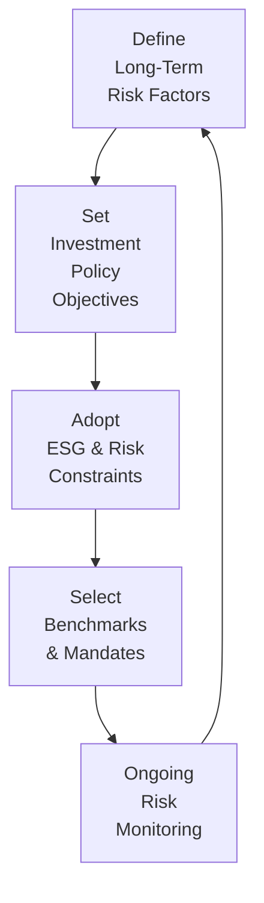
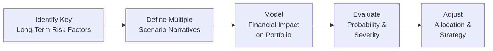

## Introduction and Overview

I remember chatting about 10 years ago with a colleague who casually brushed aside looming environmental risks. “Climate risk? That’s years down the road,” he said. Well, you know what? That “years down the road” arrived a whole lot sooner than many expected, and ignoring it led to some painful portfolio losses. This personal anecdote underscores a broader reality: long-term risk factors, whether demographic changes or technological disruptors, have a habit of sneaking up on institutional investors who keep their gaze locked on the short term. 

In institutional portfolio management, addressing long-term risk factors is not just a nice-to-have—it’s actually part of our obligation under fiduciary responsibilities to protect and grow assets on behalf of our beneficiaries. So in this section, we’ll explore how big-picture trends (like climate change, shifting consumer behavior, and demographic evolutions) can alter your investment strategy if you’re overseeing a large institutional portfolio. We’ll also talk about why ignoring these risks (or being dangerously slow to respond) can lead to stranded assets, or worse, a breach of your fiduciary duty.

Below, we’ll walk you through an overview of the key long-term risk factors, how to integrate them into your policy, and the regulatory backdrop that keeps all of us on track. Let’s dive in.

## Identifying and Evaluating Long‑Term Risks

Institutional portfolios typically span decades. A pension fund might aim to pay out benefits over a 30- or 40-year horizon, while endowments tend to invest in perpetuity. This timeline means that cyclical market trends are only one piece of the puzzle. We also need to monitor secular (i.e., long-lasting) changes that can shift entire sectors and economies.

• Climate Change and Environmental Risks  
  Climate change can dramatically heighten asset price volatility. Companies that rely on fossil fuels may grapple with stranded assets if regulation or market sentiment suddenly cuts their value. Meanwhile, water scarcity, severe weather events, and new environmental regulations can affect supply chains and operating costs.  

• Technological Disruption  
  Consider the swift rise of artificial intelligence (AI). Do you recall how quickly entire industries had to adapt? If you invest in manufacturing or services that can be automated, you risk seeing huge chunks of your portfolio losing relevance if they don’t evolve fast enough.  

• Demographic Shifts  
  Aging populations can reshape consumer demand. Meanwhile, emerging market demographics—like a growing middle class in certain countries—might open new investment opportunities. These are not short-term ripples but multi-decade undercurrents.  

• Secular Changes in Consumer Behavior  
  Consumer trends don’t always revolve solely around technology. They also relate to cultural values. For instance, a shift to plant-based diets or preferences for sustainable products can cause entire supply chains to be reconfigured. Companies that fail to anticipate these shifts risk obsolescence.

### The Cost of Ignoring These Risks

Why should you care? First, ignoring long-term risks can erode portfolio value. The stranded-asset phenomenon is perhaps the starkest example: if you hold stocks in traditional energy companies locked into big fossil fuel projects, those reserves may never come out of the ground if regulatory frameworks tighten or popular demand for alternatives soars. 

Second, underperformance becomes a real threat if your portfolio is perpetually on the back foot, divesting too late or missing the wave of new growth areas. Third, from a fiduciary perspective, ignoring these risk factors can lead to allegations of negligence or breach of duty if beneficiaries argue that you failed to consider material risks.

## Integrating Long-Term Risks into Fiduciary Responsibilities

Fiduciary duty generally includes loyalty and prudence—meaning you act in the best interests of beneficiaries with the care and diligence of a prudent professional. Incorporating long-term risk considerations is part and parcel of that prudence. Let’s break down a few best practices:

• Comprehensive Risk Assessment  
  Map out potential vulnerabilities, from regulatory risk in heavy-carbon sectors to technology obsolescence. Do this in an evidence-based way, engaging your research teams to produce forward-looking analyses and employing stress tests.

• Alignment with Stakeholder Risk Tolerance  
  Some beneficiaries are more risk averse than others. For instance, a large pension plan serving public employees has to balance its moral obligations, regulatory constraints, and public scrutiny. Another might serve only high-net-worth individuals comfortable with concentrated bets. Align your analyses with each group’s tolerance for long-term risk.

• Delegation and Oversight  
  Even if you use external asset managers for specialized mandates (like green energy or emerging technologies), you cannot outsource your duty to oversee them. Uphold strong governance structures that demand transparency on how they manage environmental, social, and governance (ESG) risks.

## Regulatory and Statutory Requirements

Depending on your jurisdiction, you might face minimum coverage ratios (for pensions), standard discount rates for liability calculations, or constraints on asset allocations (like limits on illiquid assets). IFRS or local GAAP standards might also shape how these liabilities and assets appear on the balance sheet—or how your coverage ratio is calculated.

Certain regions have begun implementing climate-related financial disclosures that require institutions to measure and report their portfolio’s climate-related exposures. If you manage a pension fund, you might have regulators insisting on climate scenario testing or requiring you to show sensitivity analyses. The bar is rising on transparency, and ignoring that reality can bring regulatory sanctions or negative publicity.

## Developing Investment Policies That Reflect Fiduciary Responsibilities

An investment policy statement (IPS) is the keystone of fiduciary compliance. When addressing long-term risks, focus on clarity:

• Primary Objectives  
  Write explicitly about risk mitigation for secular disruptions. This ensures that everyone from the board of trustees to external managers understands your stance.

• Constraints  
  If you face rules about investing in certain “excluded” industries (like high-carbon assets or controversial weapons), state them transparently. Outline permissible deviation ranges in key risk factors, whether it’s carbon intensity or sector exposure.

• Performance Targets and Benchmarks  
  Incorporate forward-looking return assumptions that factor in potential disruptions. For instance, you might apply a discount or risk premium for industries vulnerable to climate regulation.

Below is a simple conceptual overview of how an institutional investor might integrate climate risk into the IPS. This diagram is purely illustrative:

In this loop, you define the risk factors, set top-level objectives in the investment policy, adopt constraints, choose benchmarks and mandates (like low-carbon indices or technology funds), and continuously monitor. Then you refine the definitions over time based on what you learn.

## Governance Policies and Best Practices

Even the best strategies falter without robust governance policies. Typically, you should:

• Review Board Composition  
  Ensure board members or trustees bring perspectives on long-term risks. If nobody on your board understands climate, technology, or demographic data, you risk a blind spot.

• Regular Training  
  So, let’s say you have someone who’s great at reading short-term market signals. That’s fantastic. But they might be clueless when it comes to advanced scenario modeling or climate risk. Provide educational sessions—maybe quarterly or annually—so trustees can ask the right questions and remain aligned with fiduciary principles.

• Document Decision Processes  
  Regulatory bodies appreciate robust paper trails. Show your work. If you decide to maintain exposure to a certain sector with known risk factors, keep records of your rationale, the stress tests you performed, and the long-term cost-benefit analysis you used.

## Scenario Planning and Advanced Risk Modeling

One effective way to incorporate these big-picture risks is scenario planning. Instead of fixating on the “most likely” scenario, examine multiple possibilities—like a rapid shift away from fossil fuels, or emerging technologies that disrupt entire transportation systems. Build these “what if” scenarios into your portfolio risk models. 

Here’s a simplified example for scenario planning:

1. Identify Key Drivers: e.g., carbon tax adoption, aging populations, AI breakthroughs.  
2. Develop Plausible Future States: mild carbon taxes vs. aggressive adoption; slow vs. fast AI disruption.  
3. Map Out Portfolio Outcomes: measure how each scenario might affect various asset classes or sectors.  
4. Assign Probabilities: though uncertain, even a rough weighting can guide resource allocation.  
5. Decide on Adjustments: rebalance, shift sector allocations, or invest in hedging instruments.  

In practice, you may incorporate advanced metrics like the carbon footprint of each portfolio holding or rely on third-party providers for ESG data. You might also use factor-based models that track intangible assets like brand loyalty and innovation capacity to gauge how quickly a firm can adapt to technological upheaval.

## Communicating with Stakeholders

Don’t forget: effective communication with beneficiaries, board members, and other stakeholders is part of fulfilling fiduciary duty. Your carefully designed scenario analysis might not do much good if no one understands or supports it. 

• Board and Trustee Education  
  Conduct annual or semiannual “masterclass” sessions where external experts walk through the complex dynamics of climate science, AI disruptions, or demographic transitions.

• Reporting and Transparency  
  Provide easy-to-understand (yet sufficiently detailed) reporting on how the portfolio fares under different long-term risk scenarios. Don’t bury these analyses in footnotes; highlight them as part of your continuing risk management narrative.

• Open Dialogue  
  Beneficiaries with strong convictions—like philanthropic endowments or certain faith-based institutions—may want to see explicit integration of these convictions. Aligning with them fosters trust and ensures strategic coherence in the long run.

## Practical Example: Stranded Asset Risk in Fossil Fuels

Imagine you manage a large pension fund heavily invested in traditional energy companies—specifically, coal and oil. Let’s say your analysis indicates that regulators worldwide might impose much stricter carbon emission constraints within the next decade.  

If those constraints become reality, a significant portion of the proven reserves of these companies could become “unburnable” or simply too expensive to exploit. The result? A steep devaluation in your equity holdings. By proactively shifting part of your allocation to renewable energy providers or investing in sector-agnostic infrastructures (e.g., power grid modernization), you reduce your fund’s exposure to that potential stranded-asset risk.

In practice, you might forecast:

• Best-Case Scenario: Very mild regulations. You retain above-average returns from fossil fuel holdings.  
• Base-Case Scenario: Moderate regulations. Some write-downs, but the sector remains viable if technologies like Carbon Capture and Storage scale up.  
• Worst-Case Scenario: Aggressive regulations and popular backlash. Massive reserves become stranded, and your holdings drop drastically in value.

Factoring these scenarios into your total portfolio strategy helps you meet your fiduciary responsibilities by not allowing short-term gains to overshadow massive potential long-term losses.

## Conclusion and Exam Tips

Addressing long-term risk factors means balancing complex, intergenerational challenges with your duty to preserve and grow capital. By explicitly recognizing threats like climate, technology disruption, or demographic shifts in your policies, you’ll position your institutional portfolio to adapt to (and ideally benefit from) dramatic transformations on the horizon.

In exam contexts, expect scenario-based or essay-style questions that require you to recommend policies, frameworks, or asset allocation changes in light of big-picture disruptions. Here are a few tips:

• Emphasize Fiduciary Frameworks: Examiners often check whether candidates apply concepts of loyalty and prudence.  
• Integrate ESG and Climate: These are hot topics. Show how you might run a scenario test or integrate environmental data into portfolio decisions.  
• Show Calculation and Reasoning: In item sets, you might be given data on a portfolio’s carbon intensity or some measure of demographic shift. Demonstrate your process for adjusting risk models, not just your final answer.  
• Remember the Regulatory Angle: Some exam questions will incorporate constraints like minimum funding ratios or restrictions on certain exposures.

Ultimately, understanding that fiduciary responsibilities extend far beyond near-term returns is what distinguishes a high-level institutional manager. The best managers factor in secular risks, build robust governance frameworks, and maintain open communication channels with stakeholders—fulfilling the timeless duty to act in beneficiaries’ best interests, both now and far into the future.

## References and Further Reading

1. Mennis, Greg, et al. “Crisis Management for Institutional Investors.”  
   (Provides frameworks for addressing long-term risk and liability management in institutional contexts.)

2. Sharpe, William. “The Sharpe Ratio.”  
   (Covers key aspects of measuring risk-adjusted returns, relevant when structuring portfolios under fiduciary duties.)

3. “Fiduciary Duty in the 21st Century,” a UN PRI report  
   (Available at: https://www.unpri.org — essential reading for understanding how fiduciary obligations evolve to include ESG considerations.)

4. IFRS and Local GAAP Guidance  
   (Refer to the pension and liability sections for coverage ratio calculations and disclosure standards.)

5. CFA Institute Code of Ethics and Standards of Professional Conduct  
   (Core requirement for all CFA charterholders; highlights the ethical underpinnings of fiduciary responsibilities.)

--------------------------------------------------------------------------------

## Test Your Knowledge: Addressing Long‑Term Risk Factors and Fiduciary Responsibilities



### Which of the following risks is most commonly associated with climate change when analyzing long-term investment horizons?

- [ ] Supply chain automation risk
- [x] Stranded-asset risk
- [ ] Manager selection risk
- [ ] Momentum risk

> **Explanation:** Climate change regulations can impose stricter limits on carbon emissions, potentially leaving fossil-fuel reserves stranded. This is a well-documented risk for traditional energy companies.

### When considering demographic shifts, which factor often comes into play for institutional portfolios?

- [x] Changes in consumption patterns due to an aging population
- [ ] Fractional share trading for retail investors
- [ ] Impact of decentralized finance tokens on liquidity
- [ ] Reduced volatility in emerging market debt

> **Explanation:** An aging population can affect many dimensions of capital markets: healthcare, consumer spending, workforce participation rates, and asset valuations, thus influencing long-term portfolio strategy.

### According to fiduciary duty, institutional managers must:

- [ ] Pursue maximum short-term returns, regardless of long-term risk.
- [ ] Focus solely on near-term liquidity requirements.
- [x] Act with loyalty and prudence in the best interest of beneficiaries.
- [ ] Allocate heavily to high-risk technology stocks to capture growth.

> **Explanation:** Loyalty and prudence form the core of fiduciary responsibility. Managers must consider both short-term and long-term risks to fulfill these obligations.

### Stranded assets typically refer to:

- [ ] Assets with perpetual growth potential.
- [ ] Assets that are unaffected by interest rate changes.
- [ ] Fully insured assets in AAA-rated securitizations.
- [x] Assets that are prematurely devalued due to external pressures, such as regulation.

> **Explanation:** Stranded assets are those subject to unanticipated write-downs or devaluations—for example, carbon-heavy assets after environmental regulations are tightened.

### Which best describes a first step in scenario planning for long-term risk integration?

- [ ] Immediately deciding to divest from all fossil fuels
- [ ] Hiring one single manager to handle all risk analysis
- [ ] Establishing advanced algorithmic trading systems
- [x] Identifying key drivers of future uncertainty

> **Explanation:** Scenario planning begins with identifying the major long-term risk drivers—like environmental regulations, demographic changes, or technological disruptions.

### What is a primary benefit of including scenario analyses in pension fund oversight?

- [x] They allow the fund to forecast how different regulatory or market events might affect liabilities and assets over time.
- [ ] They provide definite predictions of the next recession date.
- [ ] They eliminate the need for external specialists.
- [ ] They automatically improve short-term performance.

> **Explanation:** Scenario analyses are helpful for exploring the implications of various plausible futures. This aids in robust long-term planning, although they do not guarantee short-term performance improvements.

### One reason to ensure board members have expertise in ESG or climate science is:

- [x] They can better evaluate portfolio risks associated with environmental outcomes.
- [ ] They must personally calculate daily portfolio valuations.
- [x] They can translate best practices from other industries into investment decisions.
- [ ] They reduce trading costs.

> **Explanation:** Proper board composition can foster informed discussions about ESG-related and climate-related risks. Expertise in these areas helps align the entire governance structure with long-term considerations.

### What is a prudent measure for aligning investment policy with long-term risk considerations?

- [x] Explicitly stating secular risk management in the IPS objectives
- [ ] Outsourcing the entire risk advisory function to one third-party vendor
- [ ] Avoiding quarterly performance reviews altogether
- [ ] Allocating the entire portfolio to derivatives

> **Explanation:** Building risk management explicitly into the IPS ensures that all stakeholders understand how secular risks fit into fiduciary responsibilities.

### Why is transparency important when reporting scenario-planning outcomes to trustees?

- [ ] It allows trustees to fully delegate all responsibilities.
- [ ] It reduces the likelihood of fines for daily trade limit breaches.
- [x] It helps trustees make informed decisions on whether portfolio shifts are warranted.
- [ ] It displays compliance with short-term momentum-based regulations.

> **Explanation:** Trustees must understand the rationale behind any decisions, especially regarding complex, long-term risks and scenario outcomes. Transparency fosters accountability and informed governance.

### Stress-testing a portfolio’s carbon intensity against aggressive climate regulations can:

- [x] Reveal potential vulnerabilities to stranded assets.
- [ ] Eliminate interest rate risk entirely.
- [ ] Guarantee outperformance in all market cycles.
- [ ] Replace the need for strategic asset allocation reviews.

> **Explanation:** Carbon-related stress tests help identify vulnerabilities under stricter climate regulations. They cannot, however, remove all forms of risk or guarantee universal outperformance.


