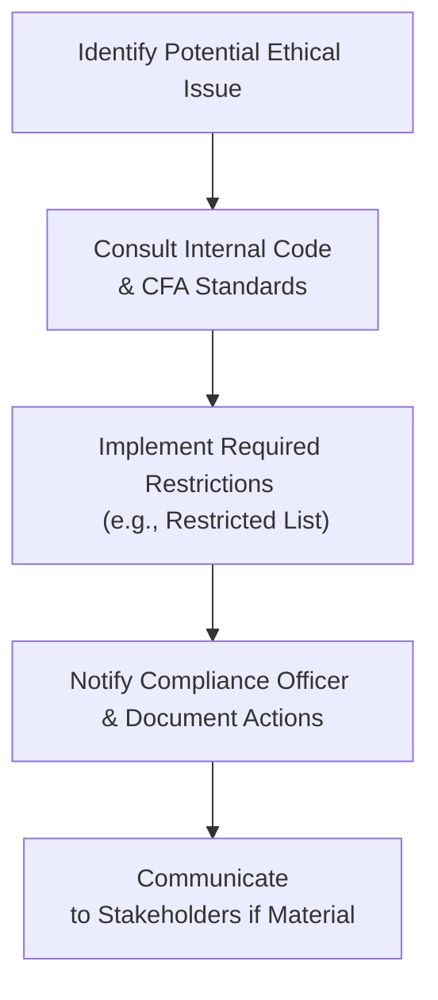

## Introduction

Trying to make proper investment decisions in an institutional setting can be mind-boggling sometimes, right? You’ve got so many stakeholders to please, fiduciary duties to fulfill, and more guidelines, regulations, and ethical codes than you can shake a stick at—particularly when we bring in the CFA Institute Code of Ethics and Standards of Professional Conduct. This section explores how institutions can integrate these ethical imperatives into their daily operations, from handling material nonpublic information (MNPI) to building robust processes for hiring and firing external portfolio managers. We’ll also look at the ever-present challenges with conflicts of interest, personal trading, and, of course, the ongoing need for transparency and training. I’ll even share a brief personal anecdote or two about how I learned the hard way to be absolutely meticulous about documentation.

Throughout this discussion, let’s keep it slightly informal—like we’re chatting over coffee—and explore how brilliant (and sometimes nerve-wracking) it can be to uphold the highest professional standards in the institutional world.

## Integrating the CFA Institute Code and Standards at the Institutional Level

Institutions typically serve multiple stakeholders: donors, pensioners, boards, or even entire communities. Because of this complexity, robust ethics policies become crucial for safeguarding trust. The CFA Institute Code of Ethics sets out fundamental principles such as honesty, integrity, diligence, and respect for the client’s best interests. The Standards of Professional Conduct then drill down into detailed rules about conflicts of interest, loyalty, prudence, care, and the fair treatment of clients.

In an institutional context, these principles often translate into:

• Loyalty, Prudence, and Care: The governing board or investment committee has a fiduciary obligation to put client (or beneficiary) interests first.  
• Conflicts of Interest: Institutions must identify, disclose, and manage any conflicts—whether they involve personal investments of staff or relationships with external managers whose agendas might not perfectly align with the institution’s.  
• Fair Dealing: All clients, sub-funds, or investor classes within the institution should be treated fairly; no special favoritism or selective disclosure.  

Think about it this way: if you’re entrusted with managing the retirement assets of thousands of employees, the last thing you want is a scandal around poor disclosure or hidden manager relationships. Aside from harming returns, it can wreck the institution’s reputation.

## Handling Material Nonpublic Information (MNPI)

Material Nonpublic Information, often shortened to MNPI, is basically that piece of news that can significantly move the market but hasn’t yet been made public. Holding or using MNPI can create huge compliance headaches—both legally and ethically. Under the CFA Institute Standards, using MNPI for trading or personal gain is a clear no-go.

In an institutional setting, employees often rub shoulders at conferences or might have personal connections to executives. Imagine you’re at a biotech symposium, and the CFO of a big pharmaceutical firm “accidentally” mentions that they’re seconds away from releasing ground-breaking trial data. You’ve just stumbled onto MNPI. So how do you handle it?

1. Immediately restrict trading in that security until the information becomes public or is otherwise no longer material.  
2. Escalate the information to a compliance officer or to whomever your institutional policy says is responsible.  
3. Document your actions to show you were fully transparent and took immediate steps to prevent misuse of the information.  

Many institutions create “restricted lists,” codes requiring employees or staff to refrain from trading certain securities. They also require staff to complete training on how to spot MNPI and what to do if it drops on your lap. 

## Managing Conflicts of Interest

The bigger an institution, the more potential conflicts of interest. Conflicts can arise when members of the investment committee have personal stakes in a fund, or maybe when an employee receives external gifts or attends lavish conferences sponsored by a manager wanting more of the institution’s business.

Here’s a personal anecdote: I once knew an investment committee member—great person—who also happened to own a consulting firm. He found himself inadvertently nudging the institution to hire a manager that used his consultancy’s services, hoping to build a good relationship for future business. It wasn’t malicious; it was just a misalignment of interest. But oh my, you can imagine the headache for compliance. The solution was a set of rigorous independence protocols: recusal from the process, robust documentation of every hire recommendation, and a thorough check to ensure the manager was best-in-class.

The CFA Institute Standards recommend that institutions:

• Disclose all personal relationships that might create real or perceived conflicts.  
• Prohibit employees or committee members from voting on or influencing decisions in which they have a personal stake.  
• Proactively adopt a gifts and entertainment policy with strict monetary thresholds.  

Another distinction is ensuring that no staff or affiliated party has a direct personal interest in the outcome of a particular investment unless it is fully disclosed and approved.

## Governance and Due Diligence Protocol for Manager Evaluation

Even well-intentioned committees can slip up if they lack well-defined processes. Picture it: an investment committee receives a glowing recommendation for a real estate fund from a well-known alumnus. The yield looks awesome, but guess what—nobody scrutinized the cost structure or the possible conflicts. A key piece of prudent governance is thorough due diligence.

Typical components of an institutional due diligence approach include:

• Thorough Questionnaires: Request official documents, performance track records, and details on fee structures and prior regulatory actions.  
• On-Site Visits: Conduct interviews with a manager’s team to ensure alignment of investment philosophy and process.  
• Reference Checks: Contact references, prior clients, or other institutional investors using that manager.  
• Ongoing Review: Keep an eye on managers regularly. Don’t just hire and forget.  

Crafting a due diligence policy that explicitly references the CFA Code and Standards fosters consistent, objective, and fair evaluation of all potential managers. This helps avoid undue influence, personal biases, or external pressure from, say, a trustee who just happens to be the manager’s cousin.

## Personal Trading Policies

Another sensitive spot: personal trading. Institutions that manage, say, a university endowment or a pension fund often require staff and decision-makers to pre-clear personal trades. Why? Because we must avoid front-running (buying or selling securities ahead of an institutional trade) or acting on MNPI.

Common practice is a short list of steps:

• Pre-Clearance: Staff must get compliance sign-off to ensure their trades are not in conflict with institutional activities.  
• Restricted List: Maintain a dynamic list of securities that staff cannot trade.  
• Reporting: Regular, mandatory personal holding reports from staff.  
• Blackout Periods: Specific windows during which no one at the institution can trade certain securities (e.g., around earnings).  

These policies protect the individuals too. If a staff member can show they consistently followed the rules, they’re less likely to be accused of impropriety later on.  

## Ongoing Training and Documentation

Yikes—compliance can feel like a never-ending list of forms, but it’s crucial. The CFA Institute Standards encourage continuous education: staff members should fully understand ethical business practices, relevant local regulations, and internal policies.

Many institutions create an internal code of ethics that references the CFA Code and Standards as the baseline. This internal code clarifies:

• The roles and responsibilities of the investment committee, staff, and outside consultants.  
• Procedures for scenario analyses—like a hypothetical leak of MNPI or a breach of personal trading rules.  
• Documentation requirements, so all decisions are well-justified and publicly defensible.  

Periodic training—maybe every quarter or at least annually—helps staff remain aware. People change jobs, roles evolve, and new financial products keep popping up. Without ongoing education, best intentions can get buried under daily tasks.

## Transparent Disclosure and Communication

Ethics is not just about checking boxes; it’s also about building trust. If stakeholders don’t trust your processes or think you’re hiding fees, you’ve already lost half the battle. Institutions should strive for:

• Clear Fee Structures: Outline all fees, from management and performance fees to transaction costs.  
• Performance Reporting: Show returns in a consistent manner, referencing globally accepted performance standards such as GIPS (Global Investment Performance Standards).  
• ESG Considerations: If the institution claims certain ESG (Environmental, Social, and Governance) approaches, you want to confirm that the portfolio truly reflects those values, and that your reporting is transparent about any constraints or trade-offs.  
• Conflict Disclosures: Any time you suspect a potential or actual conflict, proactively disclose it if it materially impacts the institution or stakeholders.  

Institutions that prioritize transparency naturally build stronger relationships with their board, beneficiaries, or donors.

## Regulatory Compliance and Global Considerations

Different jurisdictions have variable regulations. For instance, privacy requirements in the EU might differ from those in North America or Asia. Meanwhile, obligations for public pension plans may be more stringent than for private foundations. The CFA Institute Code and Standards effectively provide a global baseline—kind of a moral compass that can be used alongside local laws.

A strong practice is to map local regulations to your institution’s compliance structure so you don’t find yourself in a puzzle of overlapping or conflicting rules. You might also:

• Perform an annual or semi-annual compliance audit with external experts.  
• Review new or updated regulations and assess their impact on existing investment policies.  
• Revisit manager agreements to ensure external providers also stay compliant.  

## Visualizing a Standard Compliance Process

Below is a sample Mermaid diagram illustrating a straightforward institutional compliance process:

This visual gives a big-picture sense of the flow. Real-life scenarios are often more complex and involve multiple committees or sign-off layers, but the underlying principles remain the same: identify, check the rules, restrict or rectify, document, and communicate.

## Concluding Thoughts

In institutional portfolio management, applying the CFA Institute Code and Standards is all about consistency and trust. Institutions must safeguard the interests of their beneficiaries above all else, remain transparent in their disclosures, tackle conflicts of interest head-on, and ensure that everyone—from the board of directors down to staff interns—knows and embraces ethical duties.

I remember a time when I first served on an investment committee: all the compliance talk felt like overkill. But once you see how quickly reputations can vanish under ethical lapses, you realize these guidelines provide structure and protect both the institution and the people it serves.

Put simply, do the right thing, keep it documented, and always be ready to show your work. You might still encounter tough calls—especially concerning MNPI or tricky conflicts—but following the Code and Standards provides an unwavering moral and professional anchor.

## Best Practices for the Exam

• Understand how to apply each section of the Code and Standards to real-life institutional settings.  
• Memorize key definitions (e.g., MNPI, fiduciary duty) but focus more on how to interpret them in scenarios.  
• Practice writing out the “next steps” an institutional manager should take when confronted with an ethical dilemma.  
• Familiarize yourself with the typical components of a compliance program, including restricted lists, personal trading guidelines, and pre-clearance procedures.  
• Expect scenario-based essay questions: you may see a situation describing an institutional manager faced with a conflict or access to MNPI, and you must show how the manager should respond under the CFA Institute Standards.  

## References and Further Reading

• [CFA Institute Code of Ethics and Standards of Professional Conduct](https://www.cfainstitute.org/ethics-standards)  
• Asset Manager Code by CFA Institute (Comprehensive framework for asset management firms)  
• Handbook of Institutions and Ethics (Organizational best practices and governance strategies)  

• For more on ESG integration in an institutional context, see Chapter 2.7.  
• For comprehensive discussions on risk and governance frameworks, see the broader coverage in Chapter 7 of this text.  

## Test Your Knowledge: Applying the CFA Code and Standards for Institutional Investors



### Which of the following is the most appropriate first step an institutional investment committee member should take upon receiving potential MNPI?

- [x] Consult the institution’s compliance officer and restrict trading in the affected securities.
- [ ] Discuss the information with a close friend at another firm to evaluate its significance.
- [ ] Immediately execute trades to capitalize on the potential returns.
- [ ] Request a bonus from the management team for “sourcing” this critical data.

> **Explanation:** The CFA Institute Standards prohibit using or passing along MNPI. The correct protocol is to restrict trading and consult compliance immediately.

### When an institutional manager sits on the board of a company in which the institution invests, what is the most critical factor to ensure compliance with the Code and Standards?

- [ ] The manager must disclose the conflict of interest only if asked.
- [x] The manager must publicly disclose the conflict to the institution and recuse themselves from relevant decisions.
- [ ] The manager must hire an external counsel but can continue full participation in decisions.
- [ ] There is no conflict of interest by default, so no action is necessary.

> **Explanation:** Board membership in a portfolio holding presents a conflict. The manager must disclose it and recuse themselves from related decisions per Standards regarding conflicts of interest.

### Which action best aligns with the principle of loyalty and prudence within an institutional setting?

- [x] Incorporating a standardized due diligence process that objectively assesses all investment opportunities.
- [ ] Selecting managers based on personal relationships for expedited deals.
- [ ] Accepting lavish gifts from a fund being considered for the portfolio.
- [ ] Forbidding thorough documentation to maintain confidentiality.

> **Explanation:** Loyalty and prudence require consistent, objective, and well-documented decision-making processes.

### An institutional research analyst inadvertently learns that a biotech client is about to receive FDA approval for a groundbreaking drug. According to the Code and Standards, the best immediate approach is to:

- [ ] Advise the portfolio manager to quickly buy before the news goes public.
- [ ] Share the information in a private chat group with other analysts.
- [x] Document the information, inform compliance, and place the security on a restricted list.
- [ ] Abstain from all further research into the biotech sector.

> **Explanation:** Trading on MNPI or sharing it with others is a violation. The proper approach is to document, inform compliance, and restrict trading.

### Which measure can best mitigate conflicts of interest regarding personal trading by institutional staff?

- [x] Implementing a pre-clearance system and restricted lists.
- [ ] Encouraging staff to trade using unmonitored personal accounts.
- [ ] Mandating staff to only buy securities that the institution is actively selling.
- [x] Requiring zero personal trading for all employees.

> **Explanation:** Having a pre-clearance system safeguards against front-running or insider misuse, while restricted lists help ensure compliance. Some institutions also adopt a zero-trade policy for certain staff, but that can be overly restrictive. Pre-clearance remains a best practice.

### Which policy is most essential for maintaining fairness in manager hiring and firing decisions within an institutional context?

- [x] A structured due diligence questionnaire and documented selection process.
- [ ] Permanent exclusivity agreements with managers who provided the best gifts.
- [ ] Informal procedures that prioritize managers recommended by personal acquaintances.
- [ ] Hiring managers based on past personal favors.

> **Explanation:** Objectivity and documentation are vital to ensure fair dealing and uphold loyalty, prudence, and care.

### In which situation should a conflict of interest be disclosed to stakeholders?

- [x] When the potential conflict is material enough to impact decision-making or client outcomes.
- [ ] Only when it fails to comply with local regulatory requirements.
- [x] If the staff member holds a significant position in a company that the institution invests in.
- [ ] Conflicts of interest never need to be disclosed unless a regulator specifically requests it.

> **Explanation:** Any conflict or potential conflict that could materially affect investment decisions or performance must be openly disclosed. This includes personal ties, board membership, or any significant holding in a relevant investment.

### According to the CFA Institute Standards, how should an institution respond if one of its portfolio managers is found to have misused MNPI?

- [x] Conduct an internal investigation, document findings, notify relevant authorities if appropriate, and enforce consequences consistently.
- [ ] Do nothing; it’s purely an individual’s responsibility.
- [ ] Immediately terminate the entire investment committee.
- [ ] Actively cover up the situation to protect the institution’s reputation.

> **Explanation:** The Standards require institutions to investigate possible misconduct, document actions taken, and involve the authorities if necessary. Transparency and consistent enforcement are paramount.

### What is a primary reason to enforce a strict gifts and entertainment policy?

- [x] Avoid undue influence and favoritism in the institution’s decision-making.
- [ ] Discourage employees from attending useful networking events.
- [ ] Ensure that all personal relationships remain hidden.
- [ ] Prevent career development for junior analysts.

> **Explanation:** A gifts and entertainment policy ensures ethical boundaries are respected, preventing questionable influence or favoritism that might compromise decision-making.

### The principle of transparency in fee structures means:

- [x] Institutions should clearly disclose all performance fees, management fees, and other costs to relevant stakeholders.
- [ ] Institutions may hide transaction costs to appear more competitive.
- [ ] Fees should only be revealed upon external audit requests.
- [ ] It is optional, depending on the size of the fund.

> **Explanation:** Transparency mandates proactive disclosure of all fees to stakeholders. Hiding or obscuring them violates the Standards of Professional Conduct focused on fair dealing and full disclosure.


