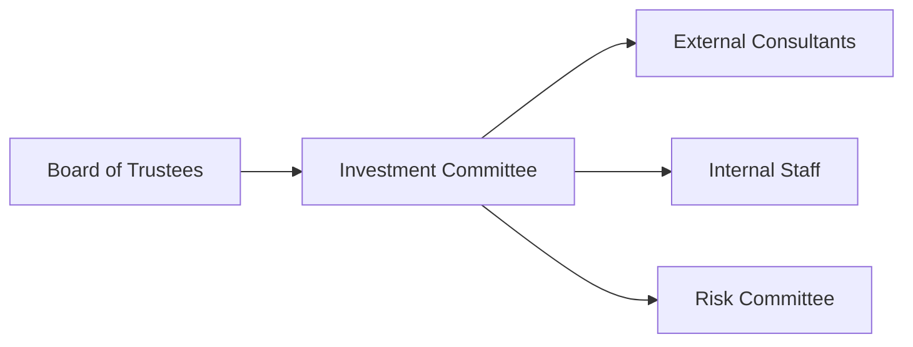

## Overview

Stakeholder communication and governance processes often sound like dry administrative tasks—until you’ve sat in a board meeting where trustees, donors, and beneficiaries all want different things, at different times, sometimes with varying levels of urgency. In my experience, it’s like juggling a dozen tennis balls while riding a unicycle. And yet, this juggling act is absolutely crucial for institutional portfolio management. Communication, governance checks, and role clarity not only keep everyone on the same page but also ensure the institution’s investment strategy aligns with long-term goals. 

In this section of our Case Study in Portfolio Management for institutional clients (see other sections under Chapter 7 for additional context on risk, liquidity, and derivatives), we’ll look at who your main stakeholders are, how to communicate effectively with them, and how to design a governance structure that makes sense. We’ll also share some personal anecdotes from real-world governance headaches and how to avoid (or at least mitigate) them. 

## Identifying Key Stakeholders

A stakeholder is any person or entity that has an interest in, or is affected by, the institution’s investment actions. Each stakeholder group has unique objectives, visions of success, visitation frequencies (i.e., how often they want to see performance reports or hold calls), and reporting preferences. You might have encountered a trustee who only wants a brief annual update, while a donor with philanthropic passions insists on monthly performance data and a deep dive into each ESG factor. Let’s break it down:

• Trustees or Board Members: Oversee the overall mission fulfillment and policy adherence. Often need strategic-level updates—think big-picture metrics.  
• Donors: Provide the institution with inflows of capital. They might care about moral or philanthropic alignment, focusing on how the portfolio’s strategy supports the overall mission.  
• Regulators: Interested in compliance. Their communication requirements revolve around statutory filings, annual or semiannual reports, and proof of adherence to investment policy statements.  
• Beneficiaries: End users (e.g., scholarship recipients, pensioners) who may require periodic reassurances that the portfolio can meet its obligations and that the institution is fiscally sound.

Below is a simple illustration mapping each stakeholder group to their primary objectives and communication frequencies:

| Stakeholder Group | Primary Objective                              | Typical Communication Frequency | Reporting Format            |
|-------------------|------------------------------------------------|---------------------------------|-----------------------------|
| Trustees/Board    | Oversight, Long-term policy compliance         | Quarterly board meetings        | High-level dashboards       |
| Donors            | Mission alignment, Impact reporting            | Weekly to annual (varies)       | ESG reports, philanthropic updates |
| Regulators        | Legal compliance, Transparency                 | Annually or semiannually        | Formal regulatory filings   |
| Beneficiaries     | Future benefit security, Stability of funding  | Periodically (on demand)        | Simplified summary of current status |

There’s no one-size-fits-all approach, so the best practice is to keep a flexible framework that can scale up or down. 

## Mapping Stakeholder Objectives

If you’ve worked with a philanthropic foundation, you know how weighed down an institution can become if the board or donors have misaligned goals. Maybe the board prioritizes preserving capital, while a major donor wants aggressive growth to fund national expansions. Mapping stakeholder objectives means clarifying each group’s:

• Return targets and risk tolerance  
• ESG preferences and constraints  
• Time horizon (short-term vs. long-term)  
• Liquidity needs (monthly redemption? annual distribution?)  

This is essential because it’s easy to fail if you don’t articulate and reconcile these objectives in the initial stages. Furthermore, do not assume that everyone shares the same time horizon or risk appetite just because they’re part of the same organization. A new trustee might champion a more conservative approach, while a longtime trustee might be comfortable with the established strategy. 

## Constructing an Effective Governance Structure

Governance structure refers to the system that defines how decisions are made, approved, and monitored within an institution. It involves committees, reporting lines, and approval authorities. And it’s easy to get confused, especially if you’re dealing with a complicated hierarchy. 

A well-defined governance structure typically includes:

• Board of Trustees (or equivalent governing body): Provides final approvals on budget, major policy changes, investment policy statements, and large-scale re-allocations.  
• Investment Committee: A specialized group responsible for evaluating investment opportunities, overseeing portfolio performance, and making strategic recommendations to the board.  
• External Consultants: Provide specialized expertise (e.g., risk modeling, private equity valuations, ESG consulting).  
• Internal Staff: Handle day-to-day operations, portfolio rebalancing, compliance checks, and routine analysis.  
• Risk Committee: Focused on identifying, measuring, and monitoring risk. Typically includes committee members plus representatives from risk management, compliance, and sometimes external auditors.

Below is a simple mermaid diagram demonstrating a typical governance structure for an institutional investor:

In this diagram, the Board of Trustees delegates investment oversight to the Investment Committee, which works closely with External Consultants, Internal Staff, and the Risk Committee. Clarity of each party’s responsibilities helps prevent the dreaded “too many cooks in the kitchen” scenario where everyone believes they have the final say.  

### Best Practices

• Define each entity’s role and authority in an official governance policy document.  
• Avoid overlapping mandates—e.g., if the Risk Committee can veto strategic changes, ensure that’s spelled out and consistent with the Investment Committee’s role.  
• Keep lines of communication straightforward: Board → Investment Committee → Staff.

### Common Pitfalls

• Ambiguous or competing mandates leading to slow decision-making.  
• Lack of accountability if roles are not clearly defined.  
• Excessive reliance on external consultants may erode internal expertise over time.

## Board Engagement and Approvals

Board engagement is the level and manner in which trustees or board members participate in investment policy decisions. Appropriate engagement ensures that everyone is on the same page about broad strategy, risk profile, and future objectives. In practice, you might see:

• Structured meeting calendars, often quarterly, to review:  
  – Portfolio performance vs. benchmarks  
  – Asset allocation changes  
  – Best- and worst-case scenarios (stress testing)  
  – Compliance and governance updates  
• Annual (or semiannual) deep dives on strategic direction:  
  – Potential expansions into new asset classes (private credit, frontier markets, etc.)  
  – Possible realignment of ESG policies or climate risk considerations  

One neat trick is to have “board dashboards,” a concise one-page overview summarizing the portfolio’s key metrics, performance drivers, and risk posture. This fosters transparent communication while respecting the board’s time constraints. 

## Transparent and Targeted Communication

Transparency is paramount. When stakeholders are in the dark, they act on assumptions, which can lead to misunderstandings and even panicked decisions. Tailor your communications:

• For Trustees & Board: Emphasize macro-level trends, alignment with long-term strategy, performance vs. policy benchmarks, major risk exposures, and any changes in asset allocation or investment policy.  
• For Regulatory Bodies: Highlight compliance with laws, adherence to investment guidelines, and properly filed documents.  
• For Donors: Show how the portfolio’s performance supports the mission, with specific examples that highlight short- and long-term impact. Offer ESG updates, especially if philanthropic giving is tied to impact investing.  
• For Beneficiaries: Provide simpler performance updates and clarify how their future benefits are safeguarded.

Along similar lines, your staff and committees need more detailed, granular data: performance attribution, factor exposures, scenario analyses, rebalancing triggers, or compliance checklists. The idea is to let each stakeholder see the forest if they want, or the trees if they need. 

## Communication Tools and Dashboards

Communication can be greatly enhanced by thoughtful visualizations and concise summaries. Here are some notes on effective tools:

• Summary Reports: A short executive summary followed by a handful of charts or bullet points on current portfolio status, top gainers/losers, and forward-looking concerns.  
• Interactive Dashboards: Online portals or analytics platforms that let authorized stakeholders drill down into performance by asset class, geography, or sector.  
• Automated Alerts: Real-time or periodic email/SMS notifications triggered if certain thresholds are breached (e.g., liquidity below a certain percentage, realized volatility above a threshold).  
• Stress Test Visuals: Bar charts or heat maps showing how the portfolio performs under different historical or hypothetical market scenarios (e.g., rapid interest rate hikes, sovereign debt crises, or commodity price shocks).

Be mindful that some trustees or donors might be less comfortable with complex dashboards. Consider a simplified version for key decision-makers who just want the gist. Meanwhile, the investment team or risk committee can feast on more intricate analytics.

## Handling Volatility and Managing Expectations

When markets get crazy and volatility spikes (e.g., a sudden geopolitical shock or a global pandemic), all eyes turn to you. How you communicate during these times can determine whether your stakeholders keep trusting the process or bail out prematurely. Periodic—and calm—updates go a long way:  

• Emphasize long-term objectives and the role of volatility within a strategic context.  
• Provide a sense of historical perspective—sometimes showing that “we expected drawdowns of 15% in our worst-case scenario, and we’ve planned for this” can help keep anxious donors or trustees reassured.  
• Highlight risk buffers or contingency plans: lines of credit, rebalancing from more liquid to less liquid assets, or adjusting distributions.

This approach demonstrates that you’re not ignoring short-term turmoil, but also that you’ve prepared for it in advance. A consistent message that “volatility is part of the game, and we have a plan,” resonates more positively than radio silence.

## Continuously Refining Governance Processes

Governance isn’t a “set it and forget it” matter. It evolves. There are always new regulations, updated best practices, and fresh internal feedback from committees or staff. So incorporate periodic audits of your governance processes:

• Annual or biennial governance review: Are roles and responsibilities still clear? Are they effective?  
• Feedback loops: Ask committee members if they feel the communication frequency is adequate.  
• Benchmarking: Compare your structure and policies against peer institutions or recognized best practices.  
• Regulatory evolutions: If a new law requires additional risk disclosures, integrate that requirement seamlessly into your existing processes.

An adaptive governance process can catch misalignments early, ensuring the institution continues to progress toward its long-term goals without a meltdown caused by oversight or outdated protocols.

## Practical Example: Institutional Endowment

Picture an endowment for a midsize university. The Board of Trustees, including prominent alumni, sets broad investment guidelines: inflation plus a margin to preserve purchasing power for future generations. They delegate day-to-day oversight to the Investment Committee, which hires an external consultant for specialized alternative investments. 

When the university decides to issue scholarships for underserved communities, donors come forward with additional funds earmarked for socially responsible investments. The governance structure ensures that the Risk Committee reviews these new funds for alignment with the overall ESG guidelines. Meanwhile, the staff provides monthly performance dashboards to donors, focusing on how their capital is being allocated to mission-driven projects. 

Every quarter, the Board meets to review a high-level summary of the endowment’s performance, ensure compliance, and confirm that the portfolio is on track to meet its payout commitments. Trustees might also consult with the Investment Committee regarding possible expansions into green bonds or new venture capital funds. This cycle repeats, with updates and governance processes refined as the environment, regulations, or mission demands change.

## Exam Tips

• In a constructed-response question, you may be asked to outline a governance structure and explain how you’d handle role overlap or communication breakdowns. Provide a clearly labeled governance chart and reference specific stakeholder communication flows.  
• On an item set question, be prepared to identify common pitfalls in stakeholder communication—like insufficient transparency or conflicting mandates—and propose solutions to address them.  
• Familiarize yourself with best practices for board reporting—such as which metrics you’d highlight in a one-page dashboard.  
• Expect to discuss how you’d manage stakeholder expectations during market crises, including referencing risk buffers, scenario analysis, or disclaimers from the investment policy statement.  
• Time management is crucial: If you need to convey your governance structure in a single exam page, craft a concise, bullet-pointed overview.

## References and Further Reading

• “Governing an Endowment: The Board’s Role and Responsibilities,” NACUBO.  
• Schleifer, Andrei, and Robert W. Vishny. “A Survey of Corporate Governance.” This paper forms a theoretical cornerstone for understanding how governance structures—like those in corporate settings—can be adapted for institutional investors.  
• Clark, Gordon L., et al. “Institutional Investors in Global Markets.” Explores communication practices and governance imperatives in a global context, useful for cross-border institutional considerations.  

Remember: A strong governance process that emphasizes transparency and accessible communication isn’t just “nice to have.” It is an essential pillar for long-term success of any institutional portfolio.

--------------------------------------------------------------------------------

## Test Your Knowledge: Stakeholder Communication and Governance Quiz



### A governance structure for an institutional investment portfolio is best described as:
- [ ] A strictly hierarchical system where external consultants have final decisional authority.
- [ ] A loose arrangement of stakeholders without formal roles or responsibilities.
- [x] A defined system of decision-making, approval, and monitoring spanning the board, committees, staff, and external consultants.
- [ ] A series of ad hoc committees with no set reporting lines.

> **Explanation:** A governance structure is a well-defined framework that outlines how decisions are made, approved, and monitored. It ensures clarity about who does what and prevents decision overlap.

### Which stakeholder group typically focuses on legal compliance and transparency in an institutional setting?
- [ ] Donors
- [ ] Board of Trustees
- [x] Regulators
- [ ] Beneficiaries

> **Explanation:** Regulators primarily demand legal compliance and transparency, requiring timely filing of specific reports and adherence to regulations.

### An annual governance review in an institutional setting helps:
- [x] Ensure roles and responsibilities remain relevant and clear over time.
- [ ] Eliminate the need for further internal audits in the future.
- [ ] Replace the board’s quarterly performance reviews.
- [ ] Finalize the annual donation drive structure.

> **Explanation:** A governance review ensures that as policies, stakeholders, and regulations change, the institution’s governance processes adapt to remain effective.

### What is the primary reason to communicate stress test results to stakeholders during market volatility?
- [ ] To show that the portfolio might fail in extreme scenarios.
- [x] To reassure them that contingency measures and strategic planning are in place.
- [ ] To demonstrate disregard for market circumstances.
- [ ] To contradict the institution’s investment policy statement.

> **Explanation:** Stress test results highlight the portfolio’s resilience (or vulnerabilities) and the strategies in place to manage extreme events. This transparency helps maintain trust.

### Which of the following does NOT describe a best practice in stakeholder communication?
- [ ] Tailoring different levels of detail for different audiences.
- [ ] Providing timely, transparent updates in line with each stakeholder’s needs.
- [x] Using highly technical charts for all stakeholder groups, regardless of expertise.
- [ ] Emphasizing both short-term performance and long-term strategy alignment.

> **Explanation:** Not every group needs the same level of technical information. Overwhelming some stakeholders can lead to confusion and frustration.

### An effective Investment Committee typically:
- [x] Advises on investment strategy, monitors portfolio performance, and recommends changes to the board.
- [ ] Operates above the board of trustees in final decision-making.
- [ ] Has no interaction with external consultants.
- [ ] Is responsible only for risk compliance reviews and not strategy.

> **Explanation:** The Investment Committee is a specialized body that focuses on strategy, performance oversight, and formulating recommendations for board approval.

### In times of high market volatility, frequent communication with donors regarding performance:
- [x] Can help manage expectations by reiterating long-term objectives and risk buffers.
- [ ] Should only occur if the portfolio goes below a certain threshold.
- [x] Might be supplemented with additional data on ESG or mission alignment if relevant.
- [ ] Is always discouraged to avoid panic.

> **Explanation:** Transparent and more frequent updates can reassure donors of a well-thought-out approach, especially if they value specific constraints like ESG alignment.

### A well-designed board dashboard typically includes:
- [x] Key performance indicators, major asset class returns, and strategic allocation breakdown.
- [ ] Detailed line-by-line security analysis for each holding.
- [ ] Full historical returns over decades for each asset manager.
- [ ] Cost basis for all assets in the portfolio with daily updates.

> **Explanation:** Board dashboards are concise summaries presenting key performance drivers and risk indicators, enabling effective oversight without overwhelming detail.

### When developing a governance structure, it is crucial to ensure:
- [x] Roles are non-overlapping, and accountability is clearly assigned.
- [ ] The same person chairs both the board of trustees and the investment committee.
- [ ] Risk committees and investment committees share identical mandates.
- [ ] External auditors have the final say in every allocation decision.

> **Explanation:** Clear roles with distinct responsibilities and accountability are essential to an efficient governance structure. Overlapping mandates create confusion and can cause delays.

### A “stakeholder” in the context of institutional portfolio management is:
- [x] Any entity or person who has an interest or is affected by investment actions.
- [ ] Exclusively the board members who make decisions.
- [ ] Solely the portfolio managers on staff.
- [ ] Limited to donors only.

> **Explanation:** Stakeholders range from donors to beneficiaries to regulators—anyone whose interests are connected to the institution’s investment outcomes.


