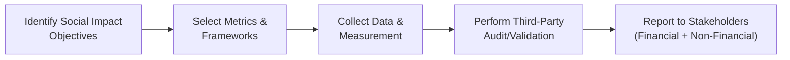

## Overview

Measuring and reporting on social impact objectives can feel a bit like juggling multiple balls in the air. You’ve got the financial performance side, the social or environmental metrics side, and then you have multiple stakeholders—like donors, board members, or community representatives—who each demand transparency and clarity. Over the years, I’ve seen organizations grapple with how to communicate that, yes, they’re generating returns, but also meaningfully improving people’s lives. You might be thinking, “So, how do I even start measuring whether I’m making a difference?” Well, that’s exactly what we’ll explore here. We’ll walk through common approaches and frameworks, ways to communicate results without falling into “greenwashing,” and some real-world tips. Let’s jump in.

## Identifying Social and Environmental Objectives

The first step is understanding precisely what you care about. Some institutions want to see more women in leadership roles at the companies they invest in. Others focus on fighting climate change or supporting underserved communities with access to financial services. The point is to articulate these objectives in a way that lines up with your mission. Once your mission is clear, you can translate that into measurable goals.

It might help to break down larger goals—say, “promote community development”—into smaller measurable targets, such as “create 500 affordable housing units in the next five years” or “fund microfinance opportunities for 3,000 female entrepreneurs.” Clarity here saves a lot of headaches down the road. If these goals align with a broader organizational mission (e.g., a foundation’s push to improve social equality in a specific region), you’re more likely to keep everyone on the same page.

## Selecting Impact Measurement Frameworks

So, how do you measure all this social good? Thankfully, we’re not alone in figuring this out. Global bodies like the Global Impact Investing Network (GIIN) and the Impact Management Project have spent years developing standardized metrics to ensure that results are consistent and comparable. You’ll often hear about IRIS+ (developed by GIIN), which is essentially a library of standardized measures. Some frameworks also align with the UN Sustainable Development Goals (SDGs). These frameworks help simplify data collection and reporting so you don’t end up with a hodgepodge of one-off metrics.

Below is a simplified visual outline of the process for measuring and reporting on social impact:

In the diagram above, you see the basic steps: you clearly define what you want to achieve, choose a measurement system, collect and validate data, and then communicate it. It’s a cycle you return to periodically to refine your parameters and ensure you remain mission-aligned.

## Building an Impact-Centric Reporting Template

Once you’ve selected the metrics that speak to your goals, you’re ready to draft a proper reporting template. A good reporting template weaves the financial and the non-financial side together:

• Financial Metrics: These could include the standard stuff any investor wants to see: total return, net asset value, expense ratios, and risk measures like standard deviation or Value at Risk (VaR).  
• Social Impact Metrics: For instance, if your mission is to promote female entrepreneurship, you may track “number of businesses founded by women” or “percentage of women in the portfolio’s executive roles.”  
• Environmental Impact Metrics: If climate solutions are your jam, you might monitor “carbon emission reductions,” “renewable energy capacity added,” or “water usage saved.”  

The key is to piece them together in one neat narrative. You might highlight each theme or pillar the fund or institution focuses on—like “Community Development,” “Climate Solutions,” “Diversity and Inclusion”—and under each theme, provide both qualitative and quantitative data. Put that in a sleek dashboard or summary table, and suddenly you’ve got a compelling story to tell that resonates with both the numbers people and the hearts-and-minds crowd.

## Data Collection and Validation

Collecting data for social impact can be tricky. You often rely on the portfolio companies’ internal nudge—like, “Um, can you please share your statistics on staff composition, carbon footprint, or hours of volunteer work?” If you’re dealing with a wide range of investees, it helps to define consistent data submission forms. The goal is to reduce confusion: one standard form for all relevant portfolio companies can significantly cut down the chaos.

But let’s not forget validation. Greenwashing is a real risk. Imagine if an energy company invests in a single wind farm and then calls itself a “climate champion.” That’s where external audits come in. Many institutional investors prefer out-of-house validation—third-party attestation or specialized consulting firms that can verify the metrics and confirm you’re indeed cutting carbon emissions or supporting minority-owned businesses. This step is important not only for authenticity but also for letting stakeholders trust the numbers.

## Balancing Social Goals with Financial Returns

I’m sure you’ve heard the question: “Do I have to sacrifice returns to achieve social good?” Well, sometimes the answer is yes, but not always. Some institutional investors are perfectly okay accepting a lower return (concessionary returns) if it means meeting philanthropic or socially driven mandates. Others believe strongly in the possibility of market-rate or even above-market returns in impact-focused projects—especially those in growth sectors like clean tech or sustainable agriculture.

The important bit is to be transparent about these trade-offs. If your investment committee or donors expect a certain IRR, highlight potential lower (or higher) returns that might come with your social strategy. This ensures everyone understands the relationship between making an impact and generating the financial performance they’ve come to expect.

## A Quick Numeric Example

Let’s say your foundation invests $5 million in a climate-focused private equity fund. The fund invests in green building technology and solar energy installations, aiming for two main goals:

• Financial Return: Target IRR of 10–12% over six years  
• Social/Environmental Target: Reduction of 50,000 metric tons of CO₂ annually by year five  

When you review annual reports, you see that in Year 2, the IRR sits at around 8%. The fund is behind on the financial target, but it’s already prevented 20,000 metric tons of CO₂ from being emitted. The question is: do you want the manage­ment team to shift resources to more profitable but less “green” projects, or do you give them some leeway to keep the carbon savings on track? It’s a dance between the two objectives—and how you manage that trade-off (and how you report it) is part of your duty to your stakeholders.

## Reputational Benefits and Greenwashing Risks

Reporting social impact can do wonders for an institution’s brand. Founders, community members, and donors love seeing tangible progress. However, if you oversimplify or exaggerate achievements, you risk accusations of greenwashing. Communicating your progress—nuanced, with all the bumps in the road—actually enhances credibility. People appreciate altruistic goals, but they also prefer honest admissions about challenges encountered.

For instance, maybe you discovered that your supply chain partner isn’t as eco-friendly as anticipated, so you’ve decided to press them for better practices or shift to a new supplier. Sharing that in your annual report might feel embarrassing, but it is also more genuine—and it shows you take accountability. So, ironically, shining a light on your missteps can build stronger trust than ignoring them.

## Ensuring Consistency and Comparability

One major pitfall is collecting data that changes definitions midstream. For example, if you track the “number of full-time employees (FTEs) hired in low-income communities,” stick to a consistent definition of “low-income.” Align that with well-known benchmarks like the U.S. Department of Housing and Urban Development’s guidelines or relevant local authorities. This approach ensures your data is reliable and can be compared year to year or even across the industry.

Reputable third-party certifications—like B Corp or Fair Trade labeling—offer an additional layer of consistency. You can say, “By the way, these results were validated by an external standard that’s widely recognized.” It helps avoid confusion, especially if you have a global donor or investor base.

## Reporting to Stakeholders

Periodic presentations or written reports keep stakeholders in the loop. Let’s say your board meets quarterly; you might give them a curated version of the financial and impact metrics each quarter, but once a year, you roll out a big, comprehensive “impact report.” For donors, a glossy but data-rich annual publication could be what resonates. If you’re an endowment, you might highlight how your investment strategy supports the academic institution’s broader mission—perhaps scholarship distribution for deserving students or improved local community support programs.

Pro tip: keep it visually engaging. Think charts, infographics, and real-life stories from the beneficiaries. If you funded a local homeless shelter, feature a short anecdote about one resident’s journey. It’s not only the facts and figures that matter—stories bring those numbers to life.

## Case Study Example: Community Development Endowment Portfolio

Imagine an endowment that sets out to create job opportunities in underprivileged neighborhoods as part of its social mandate. Here’s a simplified approach:

• The endowment invests in a private equity fund focused on small businesses in low-income areas.  
• They adopt IRIS+ metrics, such as “Number of Jobs Supported” (OI8869) and “Client Individuals: Low Income” (PI7158).  
• Each portfolio company submits annual data in a standardized format.  
• A third-party social audit validates the data.  
• The endowment integrates these results into quarterly performance reviews, comparing them to job creation targets.  
• At year’s end, the endowment’s “Social Performance Dashboard” is published to donors, summarizing both return on investment (ROI) and the newly created job opportunities.  

This example stresses how one might embed social considerations into the typical institutional portfolio construction and review cycle—tying together financial results and real-world progress.

## Conclusion and Practical Best Practices

• Be crystal clear about the social or environmental objectives.  
• Pick a consistent and recognized measurement framework—IRIS+, SDGs, or something relevant to your institution’s mission.  
• Combine financial and impact metrics in a unified report.  
• Check the data—use external validation to avoid greenwashing.  
• Acknowledge trade-offs; highlight if returns are concessionary or on par with market expectations.  
• Communicate regularly with stakeholders, telling authentic stories along the way.

As you’re preparing for your CFA Level III exam, especially in scenario-based questions referencing case studies of institutional portfolios, remember the overlap of fiduciary responsibilities and social objectives. You might see an item set that demands clarifying how to measure greenhouse gas reductions or how to allocate a risk budget to an impact strategy. Stay flexible, draw upon recognized frameworks, and reflect on the Curriculum’s emphasis on consistent, transparent disclosures (see the connections with Chapter 7.1 on Asset Allocation Review for an Institutional Investor and Chapter 7.6 on the Code and Standards for fiduciary responsibilities).

## Exam Tips

• Be prepared to illustrate how you’d select social metrics aligned with an institution’s mission.  
• Show you grasp the tension between achieving market returns versus addressing pressing social issues.  
• Demonstrate knowledge of frameworks like IRIS+ or the UN SDGs.  
• Cite potential pitfalls: data inconsistencies, greenwashing, or the reputational risk from incorrect reporting.  
• Lean on real examples (like a climate-themed fund or a microfinance initiative) to highlight measurement strategies.

## Glossary

**Impact Investing:** Investing with the intention to generate measurable social or environmental impact alongside financial returns.

**Social Metrics/Measurement Frameworks:** Standardized sets of metrics (e.g., IRIS+ by GIIN) that help quantify social and environmental performance and enable comparisons across investments.

**Greenwashing:** Providing misleading or unsubstantiated claims about how a company’s products or processes are more socially responsible or environmentally sound than they are in reality.

## References & Further Reading

• “The Impact Management Project” (IMP):  
  https://impactmanagementproject.com  
  (An essential framework source for identifying, measuring, and managing impact.)

• Brest, Paul, and Kelly Born. “When Can Impact Investing Create Real Impact?”  
  (A foundational discussion on how impact investing can translate into measurable change.)

• “GIIN (Global Impact Investing Network)” resources:  
  https://thegiin.org  
  (Guidance on IRIS+ metrics and real-world case studies.)

• Chapter 7 of this text, particularly sections 7.1 on Asset Allocation Review and 7.6 on Application of Code and Standards, offers additional context on integrating diverse objectives (including non-financial) into an institutional portfolio.

## Test Your Knowledge: Measuring and Reporting on Social Impact Objectives



### Which of the following best describes greenwashing?

- [ ] A form of investing that disregards traditional financial returns
- [x] Misleading claims that products or processes are more sustainable than they actually are
- [ ] A set of standardized frameworks for measuring social impact
- [ ] The process of divesting from environmentally harmful industries

> **Explanation:** Greenwashing is when organizations inaccurately position themselves as environmentally or socially responsible, often through misleading marketing or reporting.  

### What is the primary benefit of using a standardized framework like IRIS+ for impact measurement?

- [ ] It eliminates all risk of data inconsistencies
- [x] It offers consistent metrics that allow comparability across different investments
- [ ] It ensures all impact investments have the same level of financial returns
- [ ] It exclusively focuses on environmental impact

> **Explanation:** Standardized frameworks such as IRIS+ provide well-defined metrics, enabling investors to compare data across different firms and projects with greater accuracy and consistency.

### When an institution accepts lower returns in exchange for high social or environmental benefits, this practice is referred to as:

- [x] Concessionary returns
- [ ] Fiduciary duty
- [ ] Market-based returns
- [ ] Standardized yields

> **Explanation:** Concessionary returns imply that the investor is prioritizing social or environmental impact over attaining purely market-level financial returns.

### Which of the following is a key reason to use independent third-party audits for social impact metrics?

- [ ] To comply with federal tax regulations
- [ ] To avoid tracking any environmental metrics
- [ ] To guarantee all projects will be successful
- [x] To validate the authenticity of reported impact data

> **Explanation:** Third-party audits help confirm that social or environmental metrics are accurate, mitigating the risk of overstatement or greenwashing.  

### In social impact reporting, which part of the report typically encompasses financial performance data?

- [ ] The footnotes section exclusively
- [ ] The forward-looking mission statement
- [x] The integrated performance statements that show returns and social metrics
- [ ] Greenwashing disclaimers

> **Explanation:** Combining social and financial performance in one integrated section helps stakeholders see how closely impact outcomes correlate with financial performance.

### According to the text, a reputational benefit of measuring and reporting social impact objectives is:

- [x] Enhanced trust and credibility among donors, board members, and the community
- [ ] Reduced need for audits and transparency
- [ ] Guaranteed higher financial returns across all projects
- [ ] Complete elimination of stakeholder monitoring

> **Explanation:** A strong social impact report can boost an institution’s reputation, enabling stakeholders to see tangible evidence of mission fulfillment.

### A key factor in selecting impact metrics is:

- [ ] Ensuring every metric meets an IRR threshold of 10%
- [ ] Randomly changing metrics year to year
- [x] Aligning metrics directly to specific organizational mission goals
- [ ] Only using environmental metrics, ignoring social factors

> **Explanation:** The chosen metrics must directly reflect and measure the institution’s articulated objectives, ensuring mission alignment.

### Why should organizations standardize the definition of “low-income” for job creation metrics?

- [ ] It’s more convenient for external auditors
- [x] To maintain consistency and comparability when analyzing changes over time
- [ ] To eliminate the need for unique metrics in different geographic regions
- [ ] To conform to derivatives trading requirements

> **Explanation:** Using consistent definitions ensures that the metrics used remain comparable across different reporting periods and investments, thereby increasing transparency and reliability.

### When reporting results to stakeholders, which approach can strengthen credibility?

- [x] Acknowledging challenges or setbacks openly
- [ ] Concealing any shortfall in social progress to maintain public image
- [ ] Highlighting only activities that meet or exceed projected returns
- [ ] Limiting communication to strict financial metrics

> **Explanation:** Being honest about both the successes and the pitfalls helps maintain stakeholder trust and prevents reputational damage from unrealistic or misleading claims.

### Institutions integrating impact investments into their portfolio must always sacrifice financial returns.

- [ ] True
- [x] False

> **Explanation:** While some impact investments may involve concessionary returns, many can be competitive or even outperform market expectations, depending on the sector and strategy.


