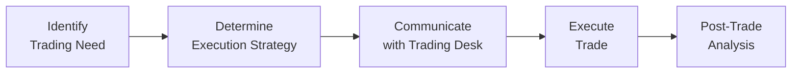

## Introduction

Sometimes when we think about portfolio management, we focus on big-picture topics like strategic asset allocation or advanced security selection. Then we pause, realize, and—frankly—get a little surprised by just how crucial trade execution is to our overall performance. After all, you can craft the perfect portfolio strategy, but if your execution is clumsy or inefficient, you might lose out on those precious basis points that separate a mediocre result from an outstanding one.

In this section, we’ll walk through the fundamentals of trading and execution from the perspective of a portfolio manager. We’ll address how decisions about when and where to place trades can have a real impact on performance. We’ll also talk about how you can maintain secrecy (or anonymity) so your competitors don’t sniff out your plans. And, we’ll dig into explicit costs (like commissions) and implicit costs (like the dreaded “market impact”) that can sneak up on you if you’re not careful.

## Crafting an Execution Strategy

An execution strategy is essentially the plan for how you enter or exit positions without inadvertently telegraphing your intentions or moving the market unfavorably. As a portfolio manager, you’re balancing the need for timely execution, minimal transaction costs, and alignment with ever-shifting portfolio objectives or risk constraints. 

You might, for instance, consider using algorithmic trading, placing limit orders, or working with a specialized broker to place your trades over a set period. The right approach depends on many factors: the urgency of your trade, the size of the order, the liquidity of the security, and your market outlook. In some cases, you don’t have time to dribble out trades over days and might choose a more aggressive style, accepting the possibility of higher costs in exchange for immediate fills.

Below is a simple illustration of how a portfolio manager typically sequences the trade process. Starting from identifying the need to rebalance or initiate a position, we move through the planning stage (where you pick the execution strategy) all the way to post-trade analysis and measuring outcomes.

## Balancing Conflicting Objectives

• Minimizing costs vs. timely execution: You want to reduce market impact and broker fees, but you also need to fill the order quickly if it’s an urgent trade (like adjusting an out-of-line factor tilt from Chapter 2).  

• Maintaining portfolio exposures vs. risk controls: If you’re running an equity portfolio with strict sector exposures, you must execute trades in a way that preserves these weights. Meanwhile, you’re juggling sharp intraday volatility that might undermine your careful sector bets if you wait too long.

• Keeping the market in the dark vs. getting the trade done: If you reveal too much size or urgency, counterparties might front-run your orders. But being too slow can create opportunity cost. This push-and-pull is especially critical with large blocks of stock or in illiquid markets.

## Larger Orders and Illiquid Instruments

When you place large orders in a small or illiquid market, the fragility of the order book can wreak havoc on your trade. I once saw a manager attempt to offload a massive position in a mid-cap stock in two quick trades, only to see the market drop precipitously after the first move. The manager’s second trade was executed at a wider spread, magnifying cost. 

To mitigate these risks:
• Break your orders into smaller pieces (a technique sometimes known as slicing).  
• Use algorithms designed for block trades, such as Volume-Weighted Average Price (VWAP) or Implementation Shortfall algorithms.  
• Combine short-term price forecasting with real-time market data to adapt the strategy on the fly.

## Costs of Trading: Explicit vs. Implicit

Transaction costs are made of two major components:

1. **Explicit Costs:** These are easy to pinpoint. Commissions and fees—like exchange membership dues, clearing fees, or prime brokerage charges—are explicit. Depending on the region, these costs might include stamp duties or financial transaction taxes, too.  

2. **Implicit Costs:** These are trickier. Implicit costs include:  
   • **Bid-Ask Spread:** The difference between the price at which you can buy and the price at which you can sell.  
   • **Market Impact:** Every large trade can move the price against you—especially with more illiquid securities.  
   • **Opportunity Cost:** If you wait too long or are forced to move slowly, you might miss a better price.  

### A Brief Look at Implementation Shortfall

Implementation Shortfall is a popular measure of trading effectiveness. At a high level, it compares the difference between a hypothetical “paper portfolio” (where we assume you could execute instantly at the price you observed when making the decision) vs. the actual results after transaction costs and market movement. In a simple form:


\text{Implementation Shortfall (\%)} = \frac{(\text{Decision Price} - \text{Execution Price})}{\text{Decision Price}} \times 100


If “Execution Price” is higher than “Decision Price” for a buy order, you can see how the shortfall can rise. We’ll specifically tackle Implementation Shortfall benchmarks and calculations in Section 8.2, but remember that measuring it is a critical aspect of post-trade analysis.

## The Significance of Anonymity

If you let the market know that a large portfolio manager (or a big fund) is buying thousands of shares, your counterparty might step in front of your order to profit from the shift in demand. Maintaining anonymity makes it less likely that others can exploit your positions or trade around your flows. Tools such as dark pools or crossing networks can help match larger orders away from the public order book. However, you’ll want to keep an eye on the trade-off: sometimes these pools aren’t super-liquid, so the fill rates can be low or partial.

## Internal Trading Desks vs. Outsourced Brokers

You can either maintain an in-house (internal) trading desk or outsource your trades to external brokers:

• **Internal Trading Desks:** More control over execution, direct alignment with your portfolio strategy, can integrate real-time risk checks and share knowledge across the business immediately. But maintaining a trading desk is costly, requiring technology, regulatory compliance, and specialized staff.

• **External Brokers:** You might tap into a broker’s scale, advanced algorithms, and market presence. But you could face conflicts of interest or layered costs. Also, outsourced brokers may not prioritize your trades the way dedicated in-house traders would, especially if you’re a smaller client.

The choice might even be a hybrid: maintaining a small in-house team for high-touch or specialized trades and allocating simpler or lower-touch orders to external brokers. 

## Communication and the Role of the Trader

It’s critical to communicate clear instructions to your traders:  
• **Exact Price Range and Limits:** If you only want to buy below $50 a share, you must mention a limit price.  
• **Timing Constraints:** “I need this position by close of business” or “We can work this order over the next week.”  
• **Urgency and Risk Profile:** Is it something you “must have” for a factor-based trade (see Chapter 2) or is it part of a routine rebalancing?  

Traders will usually want to know your rationale and the spirit of the trade. That allows them to pick the best strategies—possibly employing limit orders, algorithmic slices, or dark pool crosses. If this communication fails, the mismatch can lead to incomplete fills, excessive trading costs, or missing out on time-sensitive market opportunities.

## Post-Trade Analysis and Execution Benchmarks

Measuring the success of your execution is as important as the execution itself:

• **VWAP (Volume-Weighted Average Price):** Compares trade execution to the average trading price over a specified period weighted by volume.  
• **Implementation Shortfall:** We touched on this earlier. Essentially measures the difference between the “paper” decision price and actual execution outcomes.  
• **Reference to Market Open or Close:** You may compare your execution price to the closing price if you’re targeting end-of-day rebalancing.  

Post-trade analysis helps you refine strategies, track the effectiveness of different brokers, and elevate your desk’s performance. If you find consistent underperformance versus a benchmark like VWAP, you might reevaluate how or when you execute your orders.

## Integrating Risk Management and Real-Time Data

If you recall from Chapter 3, risk budgeting is basically deciding which strategies or positions can carry a certain level of volatility or potential drawdowns. Well, that risk budgeting concept is just as relevant in the trading process itself. Real-time data feeds and analytics are vital because markets can shift quickly and blow up your risk thresholds if you accumulate a big position at the worst possible moment.

• **Risk Budget Read-Through:** Whenever an order is partially filled, your exposures are in flux. You should have tools in place to see if partial fills have left you under- or over-hedged or incorrectly exposed to certain factors or sectors.  
• **Dynamic Adjustments:** If you see liquidity evaporating or volatility spiking, your real-time data might push you to pause or break your order into smaller chunks.  

## Technology’s Role

In today’s markets, technology can make or break you. High-speed connectivity, advanced algorithms, big-data analytics for real-time signals, and dynamic risk overlays have all become mainstream. Gone are the days when you’d call your broker on the phone and do a single block trade. Sure, phone-based trades can still be part of the playbook for specialized deals, but algorithms and direct market access are now everyday companions for the modern portfolio manager.

Of course, technology is not a panacea. Costs for advanced solutions can be steep, and you need the right internal talent to use them. Also, new technology can introduce operational risk if systems fail or if you can’t interpret the data quickly enough.

## Best Practices and Pitfalls

• **Best Practices:**  
  1. Conduct thorough pre-trade planning.  
  2. Maintain strong relationships (and service-level agreements) with brokers.  
  3. Monitor trades in real time, watch for slippage or unusual liquidity changes.  
  4. Analyze post-trade results to benchmark your execution.  
  5. Integrate your trading strategies with portfolio-level risk exposures.

• **Common Pitfalls:**  
  1. Dismissing the importance of market impact for “less liquid” names.  
  2. Providing unclear guidance to your traders, resulting in suboptimal fills.  
  3. Overreliance on a single algorithm or broker.  
  4. Failing to keep track of partial fills, leaving your intended portfolio exposures off-target.  
  5. Neglecting anonymity in illiquid or high-profile trades.

## Conclusion and Exam Relevance

When you’re answering CFA Level III questions, keep in mind how trade execution strategies can affect realized performance and risk levels. Examiners often present scenario-based questions that require you to decide between different methods (like using VWAP vs. crossing networks), or to discuss how explicit and implicit costs might creep into (and reduce) your alpha. Expect to see the interplay between controlling transaction costs and achieving the necessary exposures within a portfolio’s risk budget.

In the real world, the success of your trades will hinge on how well you navigate complexities like liquidity constraints, short-term volatility, broker relationships, and advanced analytics. The ability not only to pick the right securities, but also to get them into (and out of) your portfolio seamlessly, is critical for preserving the alpha you’ve worked so hard to generate.

## References and Further Reading

• Harris, L. (2003). “Trading and Exchanges: Market Microstructure for Practitioners.” Oxford University Press.  
• Pinedo, M. & Polansky, D. (2023). “Fundamentals of Trading in Financial Markets.”  
• CFA Institute. (2022). “Execution Considerations” [Article].  
• Kissell, R. (2013). “The Science of Algorithmic Trading and Portfolio Management.” Academic Press.

## Test Your Knowledge: Trading and Execution Strategies



### Which of the following is considered an explicit trading cost?

- [x] Commissions 
- [ ] Price slippage
- [ ] Bid-ask spread
- [ ] Market impact

> **Explanation:** Commissions are a direct, out-of-pocket fee paid to brokers or exchanges and are recognized as an explicit cost. Bid-ask spreads, price slippage, and market impact are examples of implicit costs.

### A portfolio manager decides to quickly sell a large block of an illiquid stock. What is the primary risk in this scenario?

- [ ] Reduced broker commissions
- [x] Significant market impact
- [ ] Higher internal desk costs
- [ ] Lower transaction taxes

> **Explanation:** Selling a large block of an illiquid stock can cause noticeable price movements in the market, leading to a higher market impact cost.

### Which best describes the opportunity cost in trading?

- [ ] The commission paid per share
- [ ] The difference between the bid and the ask price
- [x] The cost of missing a favorable price due to delayed execution
- [ ] The fee for using an algorithmic trading platform

> **Explanation:** Opportunity cost arises when a delay in executing a trade leads to losing a more favorable price, thereby creating a gap between the intended and actual trade price.

### For a portfolio manager managing an active equity strategy, choosing between in-house trading desks and outsourced brokers primarily depends on:

- [x] Cost structure, control, and complexity of trades
- [ ] The number of active positions in the portfolio
- [ ] Regional market regulations only
- [ ] Strict avoidance of technology integration

> **Explanation:** The trade-off between cost, control, and operational complexity (e.g., specialized staff, technology) is key when deciding whether to maintain an internal desk or outsource to brokers.

### During post-trade analysis, a manager identifies consistent underperformance against a VWAP benchmark. Which of the following is an appropriate response?

- [x] Reevaluate execution algorithms or timing
- [x] Consider negotiating lower commissions
- [ ] Increase order sizes immediately
- [ ] Avoid using limit orders

> **Explanation:** A manager could adjust the timing or type of execution algorithms and also look at negotiating more favorable commission structures. Simply increasing order sizes might worsen market impact, and avoiding limit orders entirely could risk adverse executions.

### What is the primary benefit of maintaining anonymity during large trades?

- [x] Reduced likelihood of front-running or unfavorable price moves
- [ ] Guaranteed execution at the mid-point of bid and ask
- [ ] Zero commissions and fees
- [ ] Faster settlements

> **Explanation:** Anonymity to hide large trades from public view diminishes the possibility of other market participants pushing the price against the trade.

### Which of the following is an example of using real-time data to adjust a trade?

- [x] Pausing execution when liquidity drops significantly
- [ ] Setting a limit order price the night before
- [ ] Relying on a single fill-or-kill order
- [ ] Ignoring intraday volatility

> **Explanation:** Using real-time data allows the manager to respond to changing conditions, such as decreased liquidity, to minimize cost and market impact. Static or “one-shot” approaches are riskier if conditions change.

### A portfolio manager instructs a trader to prioritize minimizing the price impact over speed of execution. Which approach is most consistent with that goal?

- [x] Slicing orders via an algorithmic strategy
- [ ] Executing through a market order at once
- [ ] Disclosing the order size on social media
- [ ] Submitting an immediate-or-cancel order

> **Explanation:** An algorithmic strategy that slices orders into smaller parts over time usually aims to reduce market impact, whereas executing a large order all at once can trigger big price moves.

### What is the effect of ignoring partial fills on a large buy order in a highly volatile market?

- [x] The manager may end up with unintended portfolio exposures
- [ ] The manager saves on explicit costs like commissions
- [ ] It simplifies post-trade analysis
- [ ] It allows unlimited risk budgeting

> **Explanation:** Failing to track partial fills can lead to unplanned exposures—some shares might be filled under different conditions, altering the portfolio’s risk profile without the manager’s immediate awareness.

### A portfolio manager compares the initial decision price of a trade to the actual execution price to quantify Implementation Shortfall. Is this statement true or false?

- [x] True
- [ ] False

> **Explanation:** Yes, Implementation Shortfall examines the slippage between what the manager initially intended to achieve (decision price) vs. the actual execution price, including both explicit and implicit costs.


