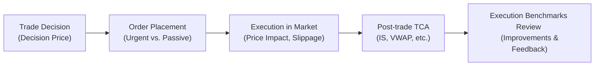

## Execution Benchmarks and Why They Matter
Execution benchmarks are essentially yardsticks that let you evaluate the effectiveness of a trade once it’s completed. You might hear folks on the trading desk say something like, “Darn, we missed the VWAP by a mile,” which typically means the trade was more expensive than the day’s volume-weighted average price. In practical terms, benchmarks are a way for investors, portfolio managers, and traders to see if they did well (got a good price) or if there’s room for improvement (incurred too much cost or slippage).

Working with benchmarks is key for managing execution costs. Think about it this way: if you believe you can get a price close to the day’s VWAP, but you end up with a price significantly higher, you’ve incurred extra cost. That cost might come from poor timing, a fast-moving market, or an overly urgent order that impacts the stock price.

Common benchmarks include:  
• Volume-Weighted Average Price (VWAP)  
• Time-Weighted Average Price (TWAP)  
• Closing Price  
• Implementation Shortfall (also called slippage)

Selecting which benchmark best fits your strategy is crucial. For instance, suppose you’re trading at the close because that’s when the stock is most liquid for your huge order. In that scenario, you’d probably compare your execution price to the closing price. Or, say you want to measure performance relative to the price at the moment you decided to trade—Implementation Shortfall is your friend because it captures all the little slices of cost from the moment you formed the idea to the moment you fill the order.

## The Essentials of Transaction Cost Analysis
Transaction Cost Analysis (TCA) is a discipline—some might say an art and a science—that looks under the hood of your trading process to find out just how much those little fees, market impacts, and inefficiencies are costing you. Sure, you might pay a low commission rate, but if your trades constantly push the price in an unfavorable direction, that effect can be more expensive than commissions themselves.

TCA has two broad categories of costs:

• Explicit costs: These are easy to see—commissions, transaction fees, taxes, etc.  
• Implicit costs: This can be trickier—think of slippage, market impact, and opportunity cost.  

Imagine you put in a large order on a less liquid stock. The minute that order hits the market, other participants may see it, and the price might start rising before you get fully filled. The difference between your initial target price and your final average fill price is part of your implicit cost. TCA aims to parse these cost components so you can fine-tune your trading plan in the future.

## Implementation Shortfall: The Nuts and Bolts
Implementation Shortfall (IS) is a fancy name for something that deeply resonates with everyday traders: the difference between the “decision price” (the price when you decided to buy or sell) and the actual “average execution price.” In other words, how far off did you end up from your ideal scenario?

Mathematically, you might see Implementation Shortfall expressed in a few ways. One simplified version is:


\text{IS} = \frac{(P_\text{exec} - P_\text{decision}) \times Q}{P_\text{decision} \times Q} \times 100\%


Where:  
• \\( P_\text{exec} \\) is the average execution price.  
• \\( P_\text{decision} \\) is the decision (or benchmark) price.  
• \\( Q \\) is the number of shares traded.  

In percentage terms, this formula says: “How big was the price gap between the execution and the decision point, relative to that decision price?”

Fund managers care about IS because it captures almost everything that can go astray between your bright idea and your final fill. Think about it in steps:

• You decide to buy a stock at \$100, but you wait an hour to place the order, and the price has drifted up to \$101 (delay cost).  
• Then your large order pushes the market further to \$101.50 (market impact).  
• If the stock runs away even more before your entire order is filled, or if you miss part of your intended purchase altogether, that’s additional opportunity cost.  

All these factors get baked into IS. This approach keeps you honest about how effective your trade execution truly is, from the moment you made the call to buy or sell.

## Breaking Down Implementation Shortfall into Components
It’s often useful to break IS into subcomponents. That’s because if you just see a big difference between the decision price and your final average price, you might wonder, “Where did we go wrong?” By labeling the costs, you can pinpoint the weak links:

• Delay Cost  
• Market Impact Cost  
• Opportunity Cost (Missed Trade)  

Delay cost accounts for the price moves between the time you make the decision and the time you begin executing. Market impact cost refers to the adverse price moves caused by your trading itself—particularly relevant for large or urgent orders. Finally, opportunity cost typically arises if the price moves away so fast that you choose not to complete the trade (or you only get partially filled).

When you roll these components together, you see exactly how your well-intentioned plan turned into final execution. If there’s a big chunk of cost in the market impact category, maybe your order-splitting strategy needs work. If you notice consistent delay cost, perhaps your desk is taking too long to start executing after the portfolio manager’s decision.

## Using Multiple Benchmarks: A Holistic Perspective
Just using one benchmark might not reveal the whole story. An institutional manager might monitor VWAP throughout the day to see if the average fill beats or lags that measure. At the same time, they’ll look at Implementation Shortfall to shine a light on the difference from the pre-trade reference price.

• VWAP can help you see if you did better or worse than the average price over the day (volume-adjusted).  
• IS pinpoints how much your decision to delay or how your trade size might have impacted price.  

If you discover you regularly beat VWAP but keep running a large Implementation Shortfall, it might mean you’re executing well relative to the overall day’s liquidity—but your pre-trade strategy might be off. Conversely, if your VWAP is consistently worse but your IS is tight, you may have a style of execution that’s quick but not great at capturing routine intraday price advantages. Each benchmark focuses on slightly different aspects of trade performance.

## The Role of Benchmark Alignment
It’s super important to choose the right benchmark for each trade. Picture a small-cap stock with thin liquidity. Using VWAP as a benchmark might be misleading if your own trades make up a huge chunk of the day’s volume, because you can literally become the VWAP. That might feel like an A+ day until you realize you still moved the price up by 5%. In that case, Implementation Shortfall might be a more meaningful measure.

Or consider an index fund reconstitution. If your goal is to hold exactly the index weight by the close of trading, your target might be the Closing Price. If you deviate too much from that closing price, your tracking error to the index can balloon. So the choice of benchmark depends heavily on your investing objective and constraints:

• Long-Term Investor Avoiding Big Price Moves → VWAP or TWAP  
• End-of-Day Liquidity Oriented → Closing Price  
• Minimize All Costs from Decision to Execution → Implementation Shortfall  

## Real-World TCA Use Cases
It’s not just about performance bragging rights. TCA has become a regulatory and compliance tool, especially for big institutions. For instance, you might need to show clients—or the compliance department—that you’re achieving “best execution” as mandated by policy. TCA helps prove it. You can run daily or monthly TCA reports and see how actual fills lined up against the chosen benchmarks.

When I first started digging into TCA, I was overwhelmed by all the charts and metrics. I remember one study where the average slippage on certain mid-cap names was nearly triple what the desk had anticipated. That insight led to changes in the algorithms we used, especially for large block trades in illiquid names. We began slicing orders dynamically based on real-time quotes and volume, eventually bringing that slippage closer to our initial estimates.

## Tools and Techniques
Nowadays, sophisticated analytics platforms offer pre-trade TCA modules that simulate potential market impact and show you a predicted Implementation Shortfall if you trade too quickly versus too slowly. You might choose to “drip feed” your order throughout the day or break the order into smaller child orders to minimize the visibility of your size. The system can then track your actual execution in real time and provide a post-trade TCA summary.

Here’s a simplified visual of how TCA might flow:

This loop of analysis and feedback fosters continuous improvement—if you see that your urgent orders are generating too much market impact, you might shift to more patient algorithms. Or if you see you are incurring large missed-opportunity costs, you might accelerate your trading to ensure more shares get filled when the market is favorable.

## Best Practices and Pitfalls
• Always define your objectives upfront. Are you trying to replicate an index weight at the close? Or do you simply want the best average price possible during the day?  
• Don’t rely solely on one benchmark across all trades. Different benchmarks serve different purposes.  
• Watch your order size relative to market liquidity. Even the best algorithms can’t hide a truly massive order in a shallow pool.  
• Continuously monitor and refine your TCA approach. Market conditions evolve, and your trading strategies should too.  

A common pitfall is ignoring the interplay between speed and cost. If you’re too concerned about speed, you can blow out the market impact cost. If you’re too slow, you might rack up delay or opportunity costs. Another pitfall is failing to capture the entire life cycle of the trade. For instance, if your not-yet-submitted trades consistently see negative price drift, that’s a hidden cost that might remain invisible unless you measure from the moment the investment committee says “go.”

## Final Thoughts
As markets become more electronically driven and data-savvy, the days of blindly placing orders without considering benchmarks are mostly gone. Institutional investors, asset managers, and even major broker-dealers use TCA to keep a tight lid on costs. Implementation Shortfall is one of the best ways to align actual trading results with your original plan, shining a spotlight on inefficiencies and helping you tweak your strategy over time.

By selecting appropriate benchmarks—whether VWAP, TWAP, Closing Price, or Implementation Shortfall—and dissecting each cost component, you’ll be able to demonstrate best execution, refine your trading systems, and maintain a disciplined approach to portfolio management. And remember, the best traders never stand still: they watch their TCA metrics like a hawk, ready to evolve their process with the ever-changing market environment.

## Further Reading
• Kissell, R. & Glantz, M. (2008). “Optimal Trading Strategies: Quantitative Approaches for Managing Market Impact and Trading Risk.”  
• CFA Institute. (2021). “Measuring and Managing Transaction Costs” [Webinar].  
• Konishi, M. & Dattatreya, R. (2020). “Frontiers of Transaction Cost Analysis for Institutional Investors.”

## Exam Tips
• Be ready to describe the different benchmarks (VWAP, TWAP, Closing Price, etc.) and how they relate to specific trading objectives.  
• Practice breaking down Implementation Shortfall into its subcomponents if a question asks for a cost attribution.  
• Expect scenario-based vignettes that test your ability to choose the right benchmark for different market conditions or investment objectives.  
• Know how to discuss best execution in the context of TCA and relevant regulatory standards.  
• Time management is key: Implementation Shortfall calculations and TCA examples can be data-intensive. Quickly identify the relevant data points and stay organized.

--------------------------------------------------------------------------------

## Test Your Knowledge: Execution Benchmarks, TCA, and Implementation Shortfall



### Which statement best describes the purpose of a trading benchmark like VWAP?

- [ ] It represents the simple average of trade prices over a specified time.
- [x] It indicates the day's price level based on how many shares trade at each price point.
- [ ] It is identical to the Implementation Shortfall measure.
- [ ] It is solely used for measuring delay costs.

> **Explanation:** Volume-Weighted Average Price (VWAP) is calculated by weighting each traded price by the volume executed at that price, providing a measure of a security’s average trading price throughout the day.

### When implementing Transaction Cost Analysis (TCA), which of the following is an implicit cost?

- [ ] Broker commissions
- [ ] Exchange fees
- [x] Market impact
- [ ] Tax on securities transactions

> **Explanation:** Implicit costs refer to hidden or indirect expenses in trading. Market impact is an example of an implicit cost, whereas commissions, exchange fees, and taxes are explicit.

### Which of the following is the primary goal of Implementation Shortfall?

- [ ] To compare an order’s execution price to the simple average of intraday prices.
- [x] To measure the total cost of deviating from the decision price, including delay and market impact.
- [ ] To assess how closely one’s trades match the closing price.
- [ ] To calculate transaction taxes on high-volume orders.

> **Explanation:** Implementation Shortfall focuses on the difference between the ideal (decision) price and the actual execution price, capturing delay, market impact, and opportunity costs.

### A large order is placed in a thinly traded stock, causing the stock’s price to climb before the entire trade is completed. This price movement caused by the trade itself is best classified as:

- [ ] Opportunity cost
- [x] Market impact cost
- [ ] Delay cost
- [ ] Commission fee

> **Explanation:** When the trade itself causes an adverse price movement, it is referred to as market impact cost.

### Which benchmark is most appropriate if the goal is to track an index that calculates its official closing price for fund valuations?

- [ ] VWAP
- [ ] TWAP
- [x] Closing Price
- [ ] Implementation Shortfall

> **Explanation:** If the objective is to align with a fund or index valuation at the close, using the closing price as the benchmark is most relevant.

### An investor finds that although they consistently beat VWAP, their Implementation Shortfall is large. Which situation could this likely indicate?

- [x] Their trading strategy is good at matching the intraday volume profile but suffers from significant delay cost before trades start.
- [ ] They are trading illiquid stocks at the close of market.
- [ ] They have extremely high commissions but low market impact.
- [ ] They are missing all trades and incurring high opportunity costs.

> **Explanation:** Consistently beating VWAP yet showing large Implementation Shortfall could imply that the initial decision-to-trade price is outdated and that trades are initiated too late, creating a large delay cost.

### What is a key advantage of using multiple benchmarks (e.g., VWAP, IS) for evaluating trade execution?

- [ ] It guarantees that you will always pay the best possible price.
- [ ] It eliminates explicit costs from your trading.
- [x] It offers a more comprehensive view of execution quality by capturing different aspects of performance.
- [ ] It locks in fixed transaction costs regardless of market conditions.

> **Explanation:** Multiple benchmarks capture different dimensions of trading performance, giving a more nuanced perspective on both intraday price profiles and the decision-to-trade reference.

### Which of the following is a potential downside of relying solely on VWAP as your trading benchmark?

- [x] Large orders can skew the VWAP itself if they represent a significant portion of daily volume.
- [ ] It captures opportunity costs more accurately than Implementation Shortfall.
- [ ] It disregards the time horizon for completing the order.
- [ ] It excludes all liquidity considerations.

> **Explanation:** When an order constitutes a large fraction of total daily volume in a relatively illiquid security, you can effectively “become” the VWAP, which may diminish its usefulness as a measure.

### Suppose an investment manager wants to ensure minimal difference between the price at which they decided to trade and the final fill price. Which benchmark is most fitting?

- [ ] VWAP
- [ ] TWAP
- [ ] Closing Price
- [x] Implementation Shortfall

> **Explanation:** Implementation Shortfall is designed to measure how much cost is incurred from the time a trade decision is made to when execution is completed (or missed).

### True or False: Transaction Cost Analysis is only concerned with explicit costs like commissions and taxes.

- [x] True
- [ ] False

> **Explanation:** Actually, this statement is false because TCA also involves measuring implicit costs such as market impact, delay, and opportunity cost. Hence, the correct answer is False (the statement is not correct).


