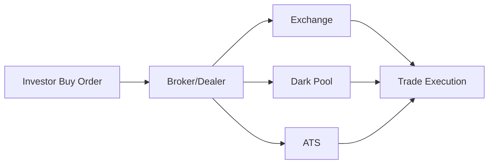
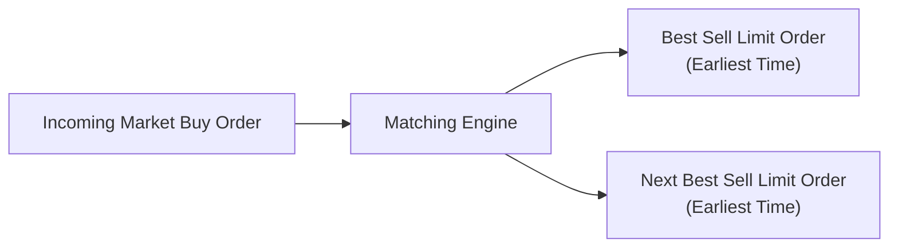

## Introduction
I still remember the first time I tried to execute a large order in a thinly traded small-cap stock. It seemed simple enough: place a limit order, get filled at my price—end of story, right? Well, it wasn't so simple. The minute I put my order into the market, the quote spread widened, the price moved away from me, and there went my plan for a quick, efficient trade. That eye-opening experience introduced me to the nuances of market microstructure.

Market microstructure deals with the “plumbing” of how securities are traded. It explores how trades occur, how orders match, and how exchange rules affect everything from liquidity to bid–ask spreads. For prospective CFA charterholders, understanding market microstructure is essential for designing and implementing effective trading strategies. After all, you don’t just want to pick the “right” investment—you also want to get it executed at the best possible price.

Below, we’ll delve into order book mechanics, venue types, market fragmentation, regulatory frameworks, and how all of these factors come together to shape order execution. We’ll also explore how this material might show up on the CFA Level III exam, and we’ll close with practical tips for integration into your everyday portfolio management processes.

## Understanding Market Microstructure
Market microstructure is the study of how the design of trading platforms and rules affects price formation and trade execution. It’s not just about academic theory—it’s about real-world concerns like slippage, liquidity, hidden orders, dark pools, and regulatory constraints.

It may seem a bit abstract, but once you start thinking about how traders and automated market makers operate—how they queue up orders and how quickly they respond to signals—you begin to see why it matters. For example, if you place a market order to buy shares of a company with a volatile stock price, the ultimate fill price can be dramatically different from your expected quote if the market maker adjusts quotes the second your order hits.

A thorough understanding of market microstructure allows you to anticipate when a large order might spook the market, how you might slice your trades to minimize footprint, or why certain venues may be more cost-effective. And for many securities, especially those that are less liquid, microstructure insights can help keep you from overpaying—or from letting a good buy slip away.

## Key Elements of Market Microstructure

### Order Types
The types of orders you place can significantly influence your execution outcomes. The most common include:

• Market orders: With these, you’re saying, “I want this trade now at the best available price.” These guarantee execution but not price.  
• Limit orders: You’re declaring a specific price at which you’re willing to buy or sell. You get price certainty but not execution certainty.  
• Stop orders: Often used for stop-loss or trigger conditions, these become market orders once a certain price level is reached.  
• Iceberg or hidden orders: Here, only part of the order is displayed publicly, reducing market impact by hiding your true size.

Depending on the venue’s rules, there can be variations, such as pegged orders (which key off the best bid or best offer) or discretionary orders that provide some flexibility. Each type has its own pros and cons. A market order, for instance, is straightforward and gets you in or out quickly, but you might pay a high transaction cost if there’s not enough liquidity.

### Order Book Structure
The order book is essentially the ledger that tracks where buyers and sellers line up. It contains the best bid and offer (the “top of book”), along with deeper layers of remaining orders at various price points. Depth can be crucial for large orders: if you want to buy 10,000 shares but the top of the book only has 2,000 shares available at your limit, you’ll need to sweep multiple price levels.

• Depth: Indicates available volume at each price level in the book.  
• Spread: The difference between the best bid and best ask price.  
• Hidden Orders: Sometimes, the displayed order book doesn’t tell the whole story because some orders are not shown.

The priority rules used for matching can differ among venues: some use strict price-time priority, while others might use pro-rata matching. In price-time priority, whoever placed the order first at the best price is first in line. Under pro-rata, a large order may be proportionally filled together with other orders at the same price level.

### A Quick Example of Priority
Say you have two limit sell orders at $30.10. Trader A placed 600 shares in the market at 9:00:05 AM, and Trader B placed 400 shares at 9:00:07 AM. If a buy order arrives that can only fill 500 shares, under strict price-time priority, Trader A’s order gets filled up to 500 shares first. Trader B’s shares do not fill at all. Under a pro-rata distribution, Trader A would fill 300 shares (60% of that 500) and Trader B would fill 200 shares (40% of that 500).

This difference can be material for large institutional trades—knowing how the matching engine works can help you place your orders more effectively.

## Different Trading Venues
Execution quality also depends on which venue you choose. There was a time when equities primarily traded on a single local exchange. But now, liquidity can be split among many players: major stock exchanges, alternative trading systems (ATS), and private exchanges like dark pools.

### Traditional Stock Exchanges
Traditional stock exchanges (e.g., the New York Stock Exchange or London Stock Exchange) are often the focal point for price discovery. Many have designated market makers or specialists whose job is to maintain orderly markets, but the specifics differ depending on the exchange’s rules. Exchanges are typically governed by strict regulations, have transparent order books, and publish trade data in real-time. 

### Dark Pools
Dark pools (also called private trading venues) allow large trades to occur away from the public eye to reduce market impact. They don’t show their order books publicly, and trades often happen at or around the midpoint of the national best bid and offer (NBBO). This can be great for institutional investors looking to trade big blocks without spooking the market. However, there’s a risk of information leakage—some participants in dark pools might glean insights about large hidden orders—and there can be less liquidity than on a traditional exchange. Sometimes, you also get unfavorable fills if there’s insufficient matching interest.

### Alternative Trading Systems (ATS)
ATS platforms resemble exchanges but are regulated differently. They could be crossing networks or other private matching engines. Some ATS cater to specific strategies or certain types of investors. Fees and matching rules vary significantly. It’s therefore important to review an ATS’s track record before routing a big trade there.

### A Mermaid Diagram of Trading Venues
Below is a simple visualization of how trades might route through different venues:

This diagram oversimplifies how real order routing works (where you might have multiple brokers, or the broker uses smart order routing to ping multiple venues simultaneously), but it shows the basic flow of orders to various execution points.

## Over-the-Counter (OTC) Markets
When we talk about trading venues, we often focus on listed equities. But many fixed-income securities, derivatives, and other instruments trade over the counter (OTC). In OTC markets:

• There’s no centralized order book.  
• Transactions occur directly between counterparties (e.g., phone or electronic messaging).  
• Prices might not be publicly visible until after the trade (if at all).  

For institutional investors looking to take a large position in a corporate bond, the OTC market structure can offer greater customization, but it also might mean less transparency. Dealers in these markets quote prices based on their inventories and risk tolerance, so terms can vary from one dealer to another.

OTC also introduces the notion of counterparty risk. A robust clearing mechanism or central counterparty can mitigate that risk, but many instruments (like certain types of derivatives) are still subject to private negotiation with less standardized terms. Regulators increasingly push for more transparency in OTC markets—leading to centralized clearing of standardized swaps, for example—but the level of transparency isn’t usually the same as on listed exchanges.

## Fragmentation and Smart Order Routing
Liquidity fragmentation occurs because trades can happen in multiple places. Picture a big institutional order that might need to source liquidity from the NYSE, NASDAQ, multiple dark pools, and one or two ATS simultaneously. It’s like searching across several grocery stores to find the best produce. This fragmentation complicates your life when you’re trying to ensure best execution.

Smart order routers (SORs) attempt to address this by algorithmically scanning different venues to find the best quotes. They consider:

• Available bids and offers.  
• Expected price improvement.  
• Fee structures: some exchanges charge taker fees while paying makers a rebate.  
• Probability of fill: how likely you are to execute your trade in each venue.  

This is a big deal when you’re placing large or repeated orders. Without a good SOR, you might end up “leaving money on the table” by sending all your trades to a single venue even if other venues offer better pricing or more liquidity. That said, advanced order routing technology can be costly and is more relevant for active managers or very large institutions with high volume flows.

## Regulatory and Clearing Frameworks
Each venue’s regulatory environment influences everything from transaction costs to the reliability of settlement. Exchanges must meet certain requirements for transparency, fair access, and trade reporting. Dark pools and ATS typically comply with somewhat different, often less stringent, regulatory rules but still must provide post-trade transparency (depending on jurisdiction). 

OTC markets are a bit more private. The exact regulatory environment there can vary widely, especially if it involves cross-border derivatives or emerging markets. A clearinghouse or central counterparty (CCP) typically handles settlement risk for standardized contracts, but bilateral trades might have their own negotiation terms.

From your perspective as a portfolio manager, the interplay of regulation, clearing, and capital requirements can significantly influence where you choose to trade. For instance, in some markets you might prefer an exchange to reduce settlement risk, or you might turn to an OTC dealer you trust if you need specialized terms that an exchange can’t provide.

## Designing Your Execution Strategy
Now, let’s talk about how all this ties into your actual trade decisions. If you’re about to make a large equity purchase, you’d presumably want minimal market impact and a favorable price. One approach might be to:

• Use an algorithmic execution strategy (like VWAP or TWAP) that breaks your large order into smaller slices.  
• Route those slices across multiple venues—some might go to a dark pool to minimize signaling, some might go to the primary exchange to tap transparent liquidity, and maybe some get posted as limit orders on a high-volume ATS.  
• Monitor fill rates and pricing in real-time.  

If it’s a very illiquid security with occasional block liquidity, you might rely more on negotiated block trades in a dark pool or even direct on-exchange crossing sessions if available. If it’s an OTC product like a high-yield bond, you might call multiple dealers to see who gives the best quote. Of course, you can also weigh trade-offs: maybe you’ll pay a slightly higher price in exchange for immediate certainty of fill.

Smart order routing technology can do a lot of this automatically, but it pays to understand how the system is making decisions. If one venue historically offers better fills, you might prioritize it. On the other hand, if you suspect that venue might have “toxic flow” or front-running participants, you might avoid it or trade in smaller increments.

## Example: Implementation Shortfall
Implementation shortfall, or slippage, is the difference between the price at which you decide to trade and the final execution price (plus any fees). It’s a comprehensive measure of transaction costs, encompassing both explicit fees and implicit costs like market impact or delay.

One way to quantify the market impact is to look at the “effective spread.” The approach is:

$$
\text{Effective Spread} = 2 \times \left|\text{Execution Price} - \text{Midpoint of Quote at Order Receipt}\right|.
$$

If your execution price is way off the quote midpoint, your effective spread is large, suggesting you might have incurred high market impact or liquidity costs. By comparing your trades’ effective spreads across different venues, you can spot which venue generally yields lower cost.

## A Deeper Look at Matching Engines
Let’s say you decide to post a large limit order in a limit order book that uses price-time priority. Your order sits in the queue. Meanwhile, 15 other participants also place buy orders. Where do you stand? Well, that depends on how quickly you entered your order relative to others and your price. 

Here’s a small diagram showing how orders match in a simplified exchange. The order book is aggregated, price–time priority is used, and partial fills occur as incoming orders match existing orders:

If the incoming buy order’s size is large, it might fill the entire best sell limit and keep “walking up” the limit order book, leading to greater price impact. And that’s precisely why you might split your order or consider a dark venue—so you don’t reveal your entire hand.

## Challenges and Pitfalls
It all sounds logical, but oh boy, there are pitfalls:

• Information leakage in dark pools: Some participants may glean insights from your large orders.  
• Fragmentation complexity: Overly complicated routing might increase transaction costs if you’re paying multiple venue fees.  
• Slippage from volatility: Even if liquidity looks good, a fast-moving market can make your fill prices less favorable.  
• Regulatory mismatch: If you’re trading cross-border, compliance can become a real headache.

On the exam, you might see scenario-based questions that ask you to choose the most appropriate venue and order type. For instance, “You have 500,000 shares to buy in a thinly traded small-cap stock that historically sees 20,000 shares daily volume—what helps minimize market impact?” The correct response might include using dark pools or carefully placed iceberg limit orders.

## Personal Thoughts and Best Practices
From personal trial-and-error, I’ve found that stepping lightly in illiquid markets often pays off. Rather than placing one big chunk, dribbling out smaller slices with limit orders can reduce the shock to the system. It also helps to keep a watchful eye on volume spikes or daily liquidity patterns—maybe execution is cheaper in the first 30 minutes of the trading day after an overnight news cycle. 

Remember that you can’t universally say “dark pools are better” or “exchanges are better.” It depends on your trade size, urgency, liquidity needs, and the specific microstructure of that security. If you must fill right away, a market order might be your route. If you can’t stomach a high price or want to maintain anonymity for a giant block, maybe consider a dark pool or hidden limit order.

## Conclusion and Exam Tips
Market microstructure isn’t just a theoretical curiosity. Whether you’re trading equities, bonds, or derivatives, you need to know the rules of the trading game. Different venues have different micro-mechanics that affect how your trades get executed, how much slippage you face, and how you can minimize your market footprint. 

For the CFA Level III exam, you’ll likely see item-set or scenario-based questions tying microstructure concepts to real-world portfolio decisions. You might have to identify the best order type or the right venue for a specific situation. Practice understanding:

• The differences among venue types (exchange, ATS, dark pool, OTC).  
• How order type affects trades (limit, market, stop, iceberg).  
• Potential trade-offs in cost, speed, and certainty of execution.  
• The significance of price-time vs. pro-rata priority.  
• The importance of fragmentation and smart order routing.

You might also encounter essay questions about how to structure trades during periods of volatility, or how to incorporate microstructure considerations when building a large position in an illiquid security.

Stay aware of best execution requirements and keep an eye on regulatory changes—these can have major implications on trading costs and strategy. And be sure to review the official CFA curriculum’s material on microstructure to see how it relates to transaction cost analysis, performance evaluation, and fiduciary responsibilities.

## References and Further Reading
• O’Hara, M. (1997). “Market Microstructure Theory.” Wiley.  
• Madhavan, A. (2000). “Market Microstructure: A Survey.” Journal of Financial Markets, 3(3), 205-258.  
• CFA Institute. (2020). “Dark Pools, Fragmentation, and Market Integrity.”  
• Official CFA Program Curriculum, Level III: Sections on Execution, Trading Costs, and Market Microstructure.  

## Final Exam Tips
• Always consider liquidity. A mismatch between order size and available liquidity can cause major slippage.  
• Know how each trading venue differs in terms of transparency, fees, and anonymity.  
• Understand how different order types get filled, especially in price-time priority systems.  
• Don’t forget about hidden costs such as delays, partial fills, or missed opportunities.  
• Practice a few numeric examples of transaction cost analysis (effective spread, implementation shortfall). They frequently appear in item sets.  

By internalizing these insights, you’ll be poised to tackle CFA Level III questions related to trade strategy and execution with confidence.

---

## Test Your Knowledge: Market Microstructure and Trading Venue Selection



### Which order type guarantees execution but not price?  
- [ ] Limit order  
- [x] Market order  
- [ ] Stop order  
- [ ] Pegged order  

> **Explanation:** A market order executes immediately at the best available price, which guarantees execution, but the price received may drift from the quoted price depending on liquidity.

### A trader wants to sell a large block of shares without revealing the total size of the order. Which order type is most useful for this objective?  
- [ ] Standard limit order  
- [x] Iceberg (hidden) order  
- [ ] Market order  
- [ ] Market-if-touched order  

> **Explanation:** An iceberg order hides much of the trade size in the order book, exposing only a small portion. This approach seeks to reduce market impact.

### Why might an institutional investor choose to trade in a dark pool?  
- [ ] To guarantee instant fill at the best quoted price  
- [x] To limit the market impact of large block trades  
- [ ] To obtain higher transparency of the order book  
- [ ] Because dark pools allow only algorithmic trading strategies  

> **Explanation:** Dark pools allow large trades to be executed with limited visibility, often reducing price impact associated with big orders.

### In a pro-rata matching system, which factor affects partial fills in a limit order book?  
- [ ] The time an order arrived  
- [ ] Whether an order is a market or limit order  
- [x] The size of the order relative to others at the same price  
- [ ] The exchange’s daily volume  

> **Explanation:** Pro-rata systems distribute incoming trade volume proportionally among existing orders at that price level, weighted by their order size.

### What is the main function of smart order routing (SOR)?  
- [ ] To speed up settlement after a trade  
- [x] To determine the best venue or venues to execute a trade  
- [ ] To block high-frequency traders from receiving your orders  
- [ ] To ensure trades remain hidden from public view  

> **Explanation:** Smart order routers attempt to locate the most favorable execution across multiple venues based on factors like liquidity, fees, and fill probability.

### Which best describes OTC markets?  
- [ ] They always use a central limit order book  
- [ ] They are subject to the strictest regulatory reporting standards  
- [x] Continuous negotiations occur directly between counterparties  
- [ ] Trades are automatically matched instantaneously  

> **Explanation:** OTC (Over-the-Counter) markets facilitate direct transactions between dealers and counterparties without a centralized exchange order book, often with bespoke terms and less transparency.

### If you want to minimize slippage when buying a large position, which strategy is generally effective?  
- [ ] Place a single market order for the entire amount  
- [x] Break up the order into smaller pieces and use algorithmic execution  
- [ ] Delay the order indefinitely to observe prices  
- [ ] Use a stop order to automatically trigger at lower prices  

> **Explanation:** Splitting a large trade into smaller slices via an algorithm (like TWAP or VWAP) can reduce immediate market impact and slippage.

### Which matching rule establishes that orders at the same price are prioritized based on who arrived first?  
- [x] Price-time priority  
- [ ] Pro-rata matching  
- [ ] Section 103.1 priority  
- [ ] Random assignment  

> **Explanation:** Price-time priority positions an order in the queue by price first and, for orders at the same price, by arrival time.

### Which venue is likely to provide the highest transparency of bids and offers?  
- [x] A major stock exchange  
- [ ] A dark pool  
- [ ] A private crossing network  
- [ ] An OTC market  

> **Explanation:** Exchanges generally have the most transparent real-time order books and price data, whereas dark pools, crossing networks, and OTC markets offer limited public disclosure.

### A large order sweeps multiple price levels in the book. This scenario indicates:  
- [x] High market impact  
- [ ] Perfectly efficient markets  
- [ ] The use of hidden orders  
- [ ] A guaranteed fill at the midpoint  

> **Explanation:** Sweeping multiple levels means taking out all available liquidity at each price, causing a noticeable movement (impact) on the stock’s price.


