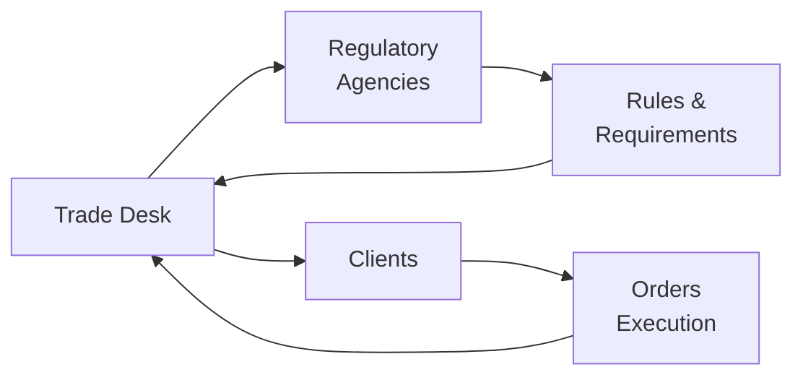

Overview  
It’s funny—when I first walked onto a trade desk, I thought it would look like a scene from a Hollywood movie: telephones ringing off the hook, people frantically shouting orders, reams of paper flying about. Some days, it can feel that way, especially around big market announcements. But behind the hustle and bustle, trade desks operate in a tightly controlled environment shaped by comprehensive regulations. And for good reason: if trading activity isn’t handled properly, it can cause serious damage to investors, institutions, and the entire financial system.  

Trade desks intersect with many regulatory frameworks across jurisdictions. Whether you’re looking at MiFID II in Europe, Reg NMS in the U.S., or local rules in other regions, there’s a common thread: ensuring fairness, transparency, and the protection of client interests. So let’s explore why these regulatory expectations matter, how to implement best practices, and what it all means for day-to-day operation.

Global Regulatory Landscape  
The financial world might look diverse on the surface, but you’ll find many similarities in regulatory structures. Most regimes focus on transparency, market integrity, and investor protection. For instance, global standards typically require:  
• Order transparency: ensuring that participants can see quotes and trades, preventing hidden or discriminatory practices.  
• Fair access: no preference for certain clients or participants at the expense of others.  
• Market surveillance: constant monitoring for suspicious patterns like spoofing, front-running, or insider trading.  

Regulations like the EU’s MiFID II and the U.S.’s Reg NMS highlight these aims. Let's break down a couple of the marquee frameworks:

U.S. Regulatory Focus: Reg NMS  
Regulation National Market System (Reg NMS) in the United States mandates that brokers route equity orders to the market center with the best price. In practice, that means no ignoring lower offers or higher bids just because your firm might have a relationship with another venue. It also aims to level the playing field for smaller exchanges and Alternative Trading Systems (ATS), mitigating the risk of big monopolistic market centers dominating flow.  

European Regulatory Requirements: MiFID II  
MiFID II has really tightened the screws on transparency and record-keeping in Europe. It requires reporting of trade details—from price to the exact time and venue—promotes “unbundling” of research costs from transaction fees, and mandates that firms ensure best execution for clients. MiFID II also insists on strong product governance, so that investment products truly suit end investors.  

In both cases, the objective is the same: provide the best terms for clients and keep markets free from manipulative behavior.  

Importance of Record-Keeping and Post-Trade Reporting  
Record-keeping can feel tedious, but regulators see it as a big deal. Trust me, a buddy of mine once handled a massive client order without properly documenting the source of market quotes—and let’s just say it was an expensive lesson. Adequate records allow regulators to reconstruct what happened in any given trade, which helps them spot potential abuses.  
• Order details: timestamps, order size, side of the trade (buy/sell), limit or market order type.  
• Execution venues: which exchange or trading platform was used, and at what time.  
• Communication logs: phone calls, electronic messages, internal chat transcripts.  

Post-trade reporting plays a similar role but focuses on after-the-fact transparency—basically letting everyone know trades occurred, at what price, and in what volume. MiFID II’s post-trade reporting obligations, for example, aim to reduce the informational disadvantage smaller investors often face.  

Maintaining Compliance Policies: Preventing Front-Running and Insider Trading  
No one wants to get dinged for unethical or illegal trading practices, so it’s crucial to bake compliance into your firm’s culture. Formal policies should tackle front-running, insider trading, and other shady behaviors from multiple angles.  
• Confidentiality walls: also known as Chinese Walls, these safeguard non-public information about large potential trades.  
• Restricted lists: certain securities may be off-limits to personnel if the firm has insider knowledge.  
• Code-of-conduct training: employees should recognize suspect behaviors (like quickly canceling large orders to manipulate prices, known as “spoofing”) and speak up if they spot them.  

Firms with strong compliance cultures often set up oversight committees that handle periodic reviews. These committees might look at trade blotters, focusing on large or unusual transactions. Not only does this help them catch missteps early, but it also fosters a sense of accountability that echoes through the whole organization.  

Principal Trading vs. Agency Trading: Addressing Conflicts of Interest  
One of the trickiest areas for any trade desk is managing potential conflicts of interest—particularly if the firm trades on behalf of clients and for its own book. A conflict of interest arises if the firm stands to benefit by trading against its client. Should we put client orders first, or fill the firm’s proprietary trades first? The correct answer, from a regulatory standpoint, is straightforward: Always place client interests above your own. But practically, it can get complicated. That’s why well-designed compliance frameworks:  
• Set up separate desks or physical separation for agency and principal trading.  
• Create robust rules to prevent proprietary desks from piggybacking on client order flow.  
• Require thorough disclosures and disclaimers to clients about potential conflicts.  

In many jurisdictions, regulators keep a close eye on “best execution” standards because a firm that trades both ways may route less favorable trades to the client. Demonstrating compliance with best-execution requirements becomes essential.

Technology Governance and Kill Switches  
Modern trade desks depend on electronic systems and complex algorithms to manage the flow of orders, especially during times of high velocity. But technology is a double-edged sword: it can improve efficiency or amplify mistakes in seconds. To prevent catastrophic events such as a runaway algorithm, many regulations and best practices call for:  
• Robust system testing: verifying that all algos function properly in both normal and stressed market conditions.  
• Real-time monitoring: immediate escalation if the system behaves erratically.  
• Kill switches or circuit breakers: a quick way to shut down all trading in a crisis and protect both the firm and the broader market.  

Traders sometimes worry about kill switches because halting all trading can be expensive. But ignoring a glitching algorithm can be much worse.  

Real-Time Trade Surveillance and Market Abuse Detection  
Spoofing, layering, short squeezes—bad actors have an entire playbook of manipulative tactics. Regulators want to make sure every legit participant does their part to keep markets clean. Hence, implementing real-time surveillance is a must. Let’s say your system flags a possible layering scheme: multiple large orders are placed at different price levels and then canceled as soon as the price starts moving in the desired direction. If your system picks this up automatically, compliance staff can investigate quickly.  

Institutional trade desks typically work with sophisticated software solutions or in-house data analytics that track patterns, unusual order sequences, or repeat behavioral signals. If a suspicious pattern appears, compliance or risk management teams will investigate, ensuring that trades comply with relevant laws.  

Risk Management Frameworks and Operational Controls  
When you think about a trade desk, you might focus on execution risk—like not getting the fill you need. But that’s just one part of the puzzle. A robust risk management framework addresses:  
• Operational risk: technology failures, erroneous trades, manual mistakes.  
• Legal risk: regulatory non-compliance, potential lawsuits from clients.  
• Financial risk: large losses from market moves, inadequate collateral management, or credit defaults from counterparties.  

A trade desk must maintain effective checks and balances:  
• Segregation of duties: the person setting up the trades shouldn’t necessarily be the one confirming them.  
• Pre-trade risk limits: not letting a single trader exceed position thresholds.  
• Daily reconciliations: verifying that trade records match the statements from exchanges, brokers, or custodians.  

If your firm trades derivatives or engages heavily in structured products, these checks are even more important.  

Practical Case Example – A Large Institutional Trade  
Imagine you work at a multinational investment firm. A big pension fund client wants to unload a massive block of equity. You receive the order at 9:00 AM, mark it as sensitive, and route it through your algorithmic system. Meanwhile, your proprietary trading desk has identified the same equity as overvalued—and they want to short it.  
• Conflict-of-interest policies require them to hold off on that short until your client’s block trade is at least partially executed (or fully disclosed).  
• The compliance team monitors communications. If a conversation reveals that the proprietary desk had advanced knowledge of the block trade, red flags pop up.  
• You finalize the block order, achieving best execution by working across multiple venues, abiding by Reg NMS guidelines in the U.S. or the aggregator function in Europe under MiFID II.  
• After the trade is done, you post-trade report to maintain transparency and record all data for potential audits.  

This scenario hits almost every point: conflict-of-interest management, best execution, compliance oversight, and record-keeping.  

Due Diligence on Counterparties and Collateral Management  
Just like you don’t want to lend your car to someone who’s a reckless driver, you probably don’t want to rely on a counterparty with questionable credit or a history of default. Robust due diligence means:  
• Checking the counterparty’s financial health, credit rating, or regulatory history.  
• Ensuring you have collateral arrangements in place—like margin requirements—in case the deal goes south.  
• Updating your assessment regularly. Markets shift quickly, and a once-stable counterparty could face liquidity issues.  

Regular Internal Audits and External Reviews  
Even the best-run desks can drift off course without regular checkups. Internal audits examine compliance with protocols and identify potential weak spots. External reviews by regulators or independent consultants provide even greater transparency. While these processes can feel time-consuming, they serve as strong deterrents against negligence and misconduct. It’s much better to unveil small compliance gaps during an internal audit than wait for a major regulatory intervention.  

Visual Overview of Regulatory and Best Practice Interactions  

In this diagram, the trade desk interacts closely with regulatory agencies, obeying rules and requirements while providing execution services to clients. Regulators set guidelines, clients provide orders, and the desk is at the hub, ensuring compliance at each step.

Common Pitfalls  
• Inadequate training: If traders fail to grasp the significance of certain rules (like front-running or layering), they may unwittingly break them.  
• Poor documentation: Incomplete or disorganized records can lead to big regulatory fines or hamper an internal investigation.  
• Over-reliance on algorithms: Automated systems are powerful but can malfunction or be manipulated.  
• Lax conflict-of-interest policies: Mixing proprietary trading and client trading without strict protocols invites regulatory scrutiny.  

Conclusion  
Managing a trade desk isn’t just about speed, technology, or market savvy—though those are vital. It’s also about weaving regulatory obligations and ethical considerations into the entire trading workflow. Whether you’re navigating MiFID II in Europe or Reg NMS in the U.S., the core themes remain consistent: treat clients fairly, mitigate conflicts, report trades promptly, and monitor for suspicious activity. By following robust compliance procedures, leveraging real-time surveillance, and promoting a culture of integrity, trade desks can thrive. The payback? Fewer regulatory run-ins, steady client loyalty, and a secure reputation in the market.

References & Further Exploration  
• CFA Institute. (2022). “Ethics and Regulation in Trading Practices.”  
• Degryse, H., de Jong, F., & van Kervel, V. (2021). “Regulatory Changes and Their Impact on Equity Markets.”  
• SEC (2021). “Regulation NMS: Rulemaking and Guidance” (Official SEC Website).  
• European Securities and Markets Authority (ESMA) Documentation on MiFID II.  
• CFA Program Curriculum, 2022/2023 texts on Execution and Market Microstructure.  

Final Exam Tips  
• Watch for scenario-based questions describing potential conflicts between a firm’s proprietary trades and client orders. Demonstrate that you understand how to apply regulatory rules in practice.  
• Practice writing short essay responses that outline how a trade desk might detect spoofing or layering. Use the exact compliance language and refer to real-time surveillance systems.  
• When you see the phrase “best execution,” think orchestrated compliance—price, speed, liquidity, and total cost. Show you can weigh these factors holistically rather than focusing on just one.  
• Conflicts of interest are a big theme under the CFA Institute Code and Standards. Incorporate standard references—particularly Standard VI(B): Priority of Transactions.  
• Time management. On the CFA Level III exam, these trade strategy and regulatory topics could appear in item sets or short-answer questions. Organize your thoughts and provide direct, concise answers.

## Test Your Knowledge of Regulatory Considerations and Best Practices in Trade Desk Management



### A trade desk faces which primary risk from inadequate record-keeping and reporting under MiFID II?  
- [ ] Reputational risk only  
- [x] Regulatory penalties and inability to demonstrate best execution  
- [ ] Excessive technology costs  
- [ ] Automatic suspension from the exchange  

> **Explanation:** Under MiFID II, record-keeping and post-trade reporting are critical. Inadequate documentation can result in regulatory fines and inability to demonstrate proper best-execution protocols.

### Which of the following best describes a kill switch in electronic trading?  
- [ ] An automated system that initiates random market orders  
- [x] A safety measure allowing immediate halt of all trading when abnormal activity is detected  
- [ ] A function that reroutes trades to dark pools  
- [ ] A device that monitors phone lines for insider trading  

> **Explanation:** A kill switch is designed to shut down trading algorithms or systems at once if dangerous or unexpected conditions arise.

### Under Reg NMS, the primary objective is to:  
- [x] Ensure brokers route equity orders to the market center offering the best price  
- [ ] Regulate foreign exchange trades  
- [ ] Discourage high-frequency trading  
- [ ] Eliminate broker-dealer conflicts entirely  

> **Explanation:** Reg NMS focuses on providing best price executions in U.S. equity markets, mandating that broker-dealers find the best quotes for clients.

### Layering involves:  
- [ ] Using multiple brokers for best execution  
- [x] Placing multiple orders at various prices and quickly canceling them to manipulate market perception  
- [ ] Analyzing layered charts to predict price movements  
- [ ] Splitting a large order into smaller ones for stealth execution  

> **Explanation:** Layering is a deceptive practice where traders place and quickly remove orders to create a misleading impression of supply or demand.

### If a firm trades as both principal and agent on the same securities, regulators are particularly attentive to:  
- [x] Conflicts of interest and best-execution practices  
- [ ] The firm’s total revenue  
- [x] The firm’s daily position limits  
- [ ] Whether the CEO approves each trade  

> **Explanation:** When a single firm is on both sides (principal and agency), it opens the door for conflicts of interest and potential misallocation. Regulators want robust policies ensuring client interests come first.

### Which best practice helps prevent front-running by employees?  
- [x] Implementing strict information barriers and restricted lists  
- [ ] Asking employees to only trade on personal accounts  
- [ ] Placing large orders after market close  
- [ ] Outsourcing the compliance function to an external vendor  

> **Explanation:** Front-running usually occurs when employees use client information to place trades in advance. Strong internal barriers and restricted lists help avoid this issue.

### In the context of trading desks, “real-time surveillance” refers to:  
- [ ] Filing monthly regulatory reports  
- [x] Continual monitoring of trades and orders to spot potential manipulative behaviors instantly  
- [ ] Observing only large trades at the end of the day  
- [ ] Checking positions against daily VaR limits  

> **Explanation:** Real-time surveillance uses technology to flag suspicious orders or trades, providing instant alerts for follow-up.

### The concept of “best execution” under MiFID II includes:  
- [x] Price, cost, speed, and likelihood of execution  
- [ ] Only achieving the highest possible price for the client’s order  
- [ ] Meeting daily volume targets  
- [ ] None of the above  

> **Explanation:** MiFID II considers multiple factors for best execution, including price, cost, speed, and the overall likelihood of completing the trade effectively.

### A robust risk management framework for a trade desk would typically:  
- [x] Segregate duties and set pre-trade limits  
- [ ] Eliminate all technology solutions  
- [ ] Ensure only large trades are monitored  
- [ ] Merge proprietary and client desks for simplified management  

> **Explanation:** Combining well-defined responsibilities, pre-trade limits, and robust technology oversight are essential in a strong risk management framework.

### True or False: Under MiFID II, firms do not need to disclose research costs separately from transaction fees.  
- [ ] True  
- [x] False  

> **Explanation:** MiFID II introduced the concept of unbundling, which means research costs must be separated from execution costs to ensure transparency.


