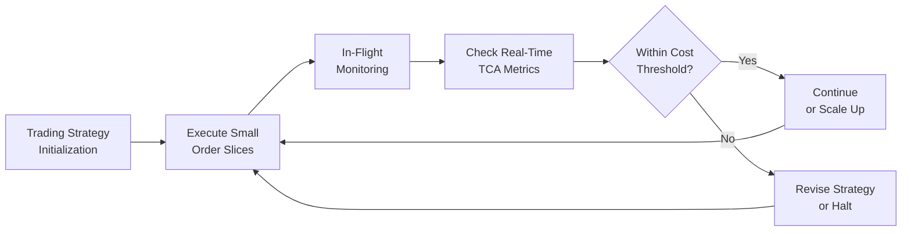

## Introduction

In high-frequency trading (HFT) environments, transaction costs tend to creep up on you before you even notice—especially when trades are happening in microseconds. Now, I remember the first time I visited a trading firm that specialized in HFT. It was a bit overwhelming, with giant monitors, blinking lights on servers, and quants pacing around anxiously with coffee cups. The rapid pace—where thousands upon thousands of trades might be executed every minute—creates unique pressures on measuring and managing transaction costs in real (or near-real) time.

From a CFA curriculum perspective, the goal is not just to see “How fast can we trade?” but also “Which combination of speed and cost minimization leads to optimal execution?” This interplay affects risk, portfolio performance, and—ultimately—alpha. This section explores the complexities, the tools, and the best practices for monitoring transaction costs in high-frequency environments. We’ll also look at how to handle data, slice orders, minimize market impact, and keep an eye on potential anomalies or manipulative market behavior.

## Real-Time and In-Flight TCA

Most of us are used to transaction cost analysis (TCA) that happens post-trade—sort of like receiving a receipt for your grocery purchase after the fact. In HFT, though, waiting until the trade is done might be too late. Real-time TCA or “in-flight” monitoring is basically checking the “receipt” as you shop to see if prices have changed drastically mid-purchase.

• Real-Time TCA: This technique helps you observe slippage, spread, commission, and other costs as new fills arrive.  
• In-Flight Monitoring: Instead of waiting until an order is fully filled, the trading system evaluates partial fills or incremental trades as they happen.

In practical terms, that means you might see your algorithm start trading and realize, “Oh wow, we are losing a lot more on slippage than anticipated in the last few seconds,” and then decide to halt or adjust the strategy on the fly.

### Market Impact and Slippage in HFT

Market impact is the ripple effect your trade has on the price. If you start unloading shares of a less liquid stock at a rapid pace, you might push the price against yourself before you can complete your transaction. In HFT, the window of time is so small that even the slightest shift in supply and demand can erode profits. Slippage, on the other hand, represents the difference between the expected fill price and the actual fill price. With algorithms racing around each other, a mere one- or two-millisecond delay can cause your slippage to balloon in volatile markets.

To keep these costs under control, HFT firms apply sophisticated algorithms that analyze market depth, volume, and volatility in real time. In an environment where the entire trade might last only a fraction of a second, there’s no option for a slow-moving approach to execution: every microsecond truly counts.

## Order Slicing and Strategic Execution

One of the key ways to tame market impact is to break a large trade into smaller “slices.” If you look back at Section 8.2 on Execution Benchmarks and Section 8.3 on Algorithmic Trading, you’ll see the rationale behind the classic trade execution algorithms like VWAP (Volume-Weighted Average Price), TWAP (Time-Weighted Average Price), or more specialized strategies that rely on dynamic real-time signals. The logic is, “If you don’t want to show the market that you have 50,000 shares to sell all at once, trade in incremental steps.”

### Benefits of Order Slicing

• Lower Visibility: By using smaller piece sizes, your trade might look more like typical background volume, reducing the chance that other market participants will detect your large order.  
• Reduced Market Impact: Smaller orders can help prevent the market from moving too sharply in response to your trading.  
• More Timing Flexibility: If you see that the market is shifting in your favor, you can step up your trading pace; if you see it turning on you, you can slow down or pause.

### Pitfalls of Over-Slicing

That said, it’s not always beneficial to slice your order into too many bites. Commissions and fees can add up for each transaction. In some markets, large volumes of extremely small orders might be flagged or lead to higher fees. Plus, if your order slices are so small that it takes too long to execute the full trade, you might be exposing yourself to run the risk of missing the best windows of opportunity.

## Latency Sensitivity

Now, let’s talk about latency. Latency is that tiny delay between when you tell your system to put in an order and when the exchange receives and executes it. In a normal retail context, you might never even see it. But in HFT, a millisecond can be an eternity. If you’re trading in an environment where your competitor has better colocation (i.e., physically closer to the exchange servers) or uses faster data connections, they can front-run your trades, beating your order to the exchange.

• Data Latency: The time it takes market data to travel from the exchange feeds to your trading servers.  
• Order Latency: The time it takes an order to go from your servers back to the exchange.  
• Internal Processing Delays: Even within your own system, slow code or insufficient hardware can add microseconds or milliseconds.

As a result, you must measure transaction costs not just after the fact, but in a manner that acknowledges you’re competing in microsecond increments. If you consistently see your trades executing at worse-than-expected prices, it could mean your system’s latency is severely handicapping your performance.

## In-Flight Monitoring and Automated Adjustments

Monitoring your transaction costs in-flight doesn’t just mean capturing data for analysis. It also involves having the logic in place to adjust your trades if you detect something off. Perhaps your fill prices have drifted by too many ticks. Maybe your partial fills are slipping too far from the midpoint. Or you see that a repeated pattern of partial fills at worse quotes suggests an algorithm or participant is specifically reacting to your order flow.

### A Quick Mermaid Flowchart

Below is a simple representation of how in-flight monitoring interacts with continuous order execution. Notice that at each decision node, the algorithm can adjust or even halt trading depending on real-time TCA feedback.

In many HFT setups, these sorts of decision points happen tens or hundreds of times a second. The system relies on instantaneous feedback loops, so it’s vital that your TCA metrics update in real time. Traditional TCA runs (like a daily batch job) just won’t cut it here.

## Collaboration Between Portfolio Managers, Traders, Quants, and IT

In my experience, one of the biggest headaches in HFT isn’t the math or code—from a purely academic standpoint, generating the algorithm is straightforward enough. The real challenge is communication between the different teams:

• Portfolio Managers: They’re concerned about overall alpha generation, portfolio constraints, and exposures.  
• Traders: They focus on the mechanics of execution, liquidity, and fill ratios.  
• Quantitative Analysts: They build the models for forecast alpha and optimize the order execution logic.  
• IT Specialists: They handle the infrastructure, ensuring minimal hardware and software latency, stable connectivity to exchanges, and robust data capture.

Whenever transaction costs in a high-frequency environment get out of control, or some anomaly appears in execution results, it may not be obvious whether it’s the trading logic or the underlying hardware or maybe the underlying market conditions. If these groups do not work together cohesively, the blame game starts, and solutions get delayed.

## Data Management Protocols and Timestamp Accuracy

Ever tried reconstructing what exactly happened during a meltdown in an HFT shop when your system crashed for 10 seconds? Good luck if your data logs didn’t properly timestamp each trade and partial fill in microsecond detail.

### Key Data-Related Components

• Accurate Timestamps: Regulatory guidelines (e.g., MiFID II in Europe) often require precise timestamping for each trade event. From an execution-quality standpoint, you can’t measure transaction costs properly if you can’t line up your timestamps with the market feed.  
• Unique Order IDs: Ensuring each slice or partial fill is uniquely flagged. This supports granular post-trade analysis, and it also lets you see real-time which order slice is misbehaving.  
• Latency Tracking Logs: By measuring the round-trip time for each order, you can see where latency is introduced, e.g., is it network congestion, exchange gateway, or internal architecture?

High-quality data management ensures that when you see suboptimal results (e.g., repeated partial fills at the worst side of the spread), you can quickly run the forensics. That data can also help prove best execution or compliance with regulations.

## Continuous Strategy Refinements and Risk Controls

People sometimes assume HFT is like plugging in a black-box algo and letting it do its thing forever. Actually, teams often tweak their strategies daily—if not intraday. Why? Because market conditions shift, competitor algorithms adapt, and old patterns get arbitraged away.

• Strategy Refinements: If real-time TCA shows that half your trades run into high slippage in the opening minutes of a market session, you might program the algo to trade more passively at the open.  
• Automated Risk Controls: HFT systems typically have “kill switches” or thresholds. For instance, “If slippage hits X basis points or cumulative losses exceed Y in a short period, shut down or revert to a safer default strategy.”  
• “Proof-of-Life” Checks: Some firms run constant heartbeat checks to ensure the entire system (including data feeds, hardware, software components) is operating within normal parameters. A big spike in latency triggers an alert or partial shutdown.

## Practical Example: A Real-Time TCA Implementation

Let’s walk through a brief example: Suppose a trading firm wants to buy 10,000 shares of a mid-cap stock that trades roughly 200,000 shares a day. That’s not so large that it can’t be done quickly, but not so trivial that the market is super liquid all day long. The firm’s internal alpha model signals a short-term upward movement, so they want to accumulate shares as quickly as possible without paying too much slippage.

1. The trader (or the automated strategy) starts placing small orders of 100–200 shares, analyzing fill quality in real time.  
2. After each partial fill, in-flight TCA calculates effective spread, price impact, and compares the fill price with the real-time quotes.  
3. If the fill quality is consistent with the model’s estimate (say, 2–3 bps of market impact), keep going.  
4. However, if the last few slices are filled at a price that’s drifting 5–6 bps worse than expected, the system might slow down or pause.  
5. The system updates the alpha and execution cost forecasts every second or two, factoring in any new changes to market liquidity.  

Maybe after 2,000 shares are filled, a sudden block trade hits the tape, the spread widens, and the TCA analysis says, “Hey, we’re about to pay too much! Pull back.” The algorithm stops sending new slices temporarily, letting the situation settle.

That’s basically how real-time TCA helps you adapt to changing conditions in a swift manner, whereas old-school TCA would have just told you after the fact, “You overpaid for 10,000 shares.” Not particularly helpful after the damage is done, right?

## Malicious Market Behavior: Watch for Odd Patterns

One sneaky element in HFT is that some participants use “predatory” strategies that detect repeated patterns of small-lot trades and push the price in your face. If your in-flight TCA is good, you might catch on that your partial fills keep intercepting a new wave of orders at higher prices, suggesting someone is front-running or anticipating your next slice. 

When such patterns emerge, robust TCA can trigger an alert: “Possible predatory activity detected.” The system might then randomize slice sizes, shift time intervals, or route to a different venue. Being nimble in this environment can mean the difference between consistent alpha and a strategy that’s easily exploited by others.

## Scalability and Profitability per Trade

In many HFT strategies, the average profit on any single trade is razor thin. At one HFT shop I visited, folks basically described it as “collecting pennies,” but since they traded at scale—thousands or even millions of times leading to a tidy profit. That means:

• Cost Monitoring at Scale: Each fraction of a cent in transaction costs can erode a big chunk of aggregated profits.  
• System Stability: To trade at scale, your monitoring, systems, and data must handle massive throughput without glitching.  
• Repeatable Edge: The real advantage of many HFT approaches is the ability to replicate a small edge often enough that it sums to a robust profit, but only if costs are kept extremely low.

## Best Practices

Below is a condensed list of best practices for monitoring transaction costs in high-frequency environments:

1. Implement Real-Time TCA Tools  
   - Have a dynamic dashboard that updates cost metrics as partial fills occur.  
2. Maintain Accurate Data Logs  
   - Use microsecond timestamps and unique order IDs for robust post-trade analysis.  
3. Use Adaptive Execution Algorithms  
   - Let your strategy dynamically adjust based on TCA feedback (slippage, fill rates).  
4. Enforce Automated Risk Controls  
   - Know exactly when you’ll shut down or modify your approach if costs exceed a preset threshold.  
5. Collaborate Across Teams  
   - Ensure that portfolio managers, traders, quants, and IT folks share knowledge. Also see the principles in Chapter 8.6 on Cross‑Asset Strategies—effective synergy matters.  
6. Manage Trade Sizing  
   - Avoid both extremes: too big (creating large market impact) or too tiny (incurring large commission overhead).  
7. Remember Regulatory Compliance  
   - Keep logs and meet best execution requirements. Must align with the Code and Standards from earlier chapters.  

## Common Pitfalls

• Ignoring Latency: Letting competitor algos front-run you because you didn’t measure the round-trip order time.  
• Over-Slicing: Incurring too many small-lot fees and inadvertently tipping off the market anyway.  
• Over-Optimizing: Tuning your strategy to historical data so precisely that it fails in changing markets.  
• Poor Communication: Having zero real-time communication between quants, traders, and IT, leading to blame-laying rather than cost-limiting solutions.  
• Weak or Nonexistent Kill Switches: Letting an algo rack up large losses because the system never automatically stopped it.

## Exam Tips for CFA Level III

1. Know Your Execution Benchmarks: Understand the difference between VWAP, TWAP, Implementation Shortfall, and other benchmarks.  
2. Emphasize Risk Controls: When constructing a “trading and execution” essay response, mention how your system would automatically limit big drawdowns or excessive transaction costs.  
3. Tie Transaction Costs to Portfolio Performance: Show how slippage and market impact can eat into alpha and how real-time TCA can mitigate that.  
4. Use Practical Examples: On the exam, applying a real-time TCA scenario or referencing how order slicing affects market impact can illustrate your mastery of concepts vividly.  
5. Reference Ethical and Regulatory Implications: HFT can be under intense regulatory scrutiny. Relate it back to the Code and Standards, especially on fairness and best execution.

## References & Further Reading

• Menkveld, A. (2016). “High-Frequency Trading and the New Market Makers.” Journal of Financial Markets.  
• CFA Institute. (2021). “Analyzing Transaction Costs in Real Time” [Workshop].  
• Biais, B., Foucault, T., & Moinas, S. (2015). “Equilibrium Fast Trading.” Journal of Financial Economics.  

• Additional references from earlier chapters on TCA, algorithmic execution, and performance evaluation:  
  – See Section 8.2 (Execution Benchmarks, Transaction Cost Analysis, and Implementation Shortfall).  
  – See Section 8.3 (Algorithmic Trading, Low-Latency Approaches, and Machine Learning) for more on high-speed execution systems.  

---

## Test Your Knowledge: Monitoring Transaction Costs in HFT Environments



### Which of the following best describes the term “in-flight monitoring” in a high-frequency trading context?

- [ ] A retrospective analysis performed on daily trade logs.
- [x] A real-time monitoring process that evaluates trade execution quality as orders are partially filled.
- [ ] A regulatory requirement to preserve order flow data for five years.
- [ ] A method of reversing executed trades if costs exceed a threshold.

> **Explanation:** In-flight monitoring refers to analyzing transaction costs and execution quality as the trade is unfolding, not just once the full order is complete.

### When an HFT strategy “over-slices” an order, which of the following is a primary concern?

- [ ] The strategy will avoid regulatory scrutiny by spreading out trades.
- [x] Commission costs and fees may accumulate significantly.
- [ ] The fill price will always improve due to small-lot trades.
- [ ] Slippage is impossible to calculate.

> **Explanation:** While slicing helps reduce market impact, over-slicing can lead to a large number of individual transactions, resulting in higher fees and diminished net returns.

### Which factor is most critical when comparing the actual fill price to a relevant benchmark in real-time TCA?

- [ ] The firm’s total assets under management.
- [ ] The network capacity of the brokerage firm.
- [x] Latency, because a delay can cause execution at worse quotes.
- [ ] The IFRS standard for classifying securities.

> **Explanation:** Latency can cause significant slippage in HFT, as competing algos may update prices before your order arrives, making it crucial to minimize delays and track them accurately.

### Which best practice helps detect malicious or predatory market behavior during high-frequency trading?

- [x] Continuously monitoring partial fills and comparing them to expected spreads.
- [ ] Relying on static end-of-day TCA reports for insight.
- [ ] Executing trades through only one venue to simplify data.
- [ ] Pausing trading for weeks at a time to review patterns.

> **Explanation:** Real-time or near real-time monitoring of order fills and execution costs allows for early detection of anomalies suggestive of front-running or other predatory tactics.

### Which of the following describes a key trade-off when using order slicing in HFT?

- [ x ] Reducing market impact vs. increasing commission costs.
- [ ] Following MiFID II vs. ignoring local regulations.
- [ ] Using algorithms vs. using manual order entry.
- [ ] Improving alpha vs. failing to record timestamps accurately.

> **Explanation:** Order slicing can help hide trade intentions and reduce market impact, but too many small orders can lead to higher per-transaction fees.

### How does a well-designed kill switch or automated risk control support HFT trading?

- [x] It prevents large losses by halting or readjusting trading when costs exceed thresholds.
- [ ] It automatically doubles the trade size if slippage increases.
- [ ] It informs policymakers of every trade.
- [ ] It replaces real-time TCA entirely.

> **Explanation:** Kill switches are vital to shutting down or significantly scaling back trades once certain risk or cost parameters are exceeded, limiting downside risk.

### What is a common reason high-frequency traders refine their algorithms intraday?

- [ ] To comply with IFRS best practice statements.
- [ ] To comply with strict anti-money-laundering laws.
- [x] Market conditions change quickly, and adjusting optimizes profitability.
- [ ] To reduce the volume of trades for regulatory acceptance.

> **Explanation:** HFT strategies must remain nimble because shifts in volatility, order flow, or competition can erode a once-profitable method. Intraday refinements help adapt to these changes.

### Which data component is most important for reconciling real-time TCA results?

- [ ] Aggregated daily price feeds only.
- [ ] Price-to-book ratios and fundamental data.
- [ ] Soft-dollar arrangements from brokers.
- [x] Accurate timestamps and unique order IDs.

> **Explanation:** Precise timestamps and unique order identifiers allow a trading firm to match partial fills and latencies against exchange data, ensuring reliable real-time TCA.

### In a high-frequency strategy aimed at capturing small profit margins per trade, what practice is essential?

- [x] Executing trades at scale while meticulously minimizing each trade’s costs.
- [ ] Always placing large block orders to signal strength to other market participants.
- [ ] Completely eliminating data logs to reduce system overhead.
- [ ] Relying purely on manual trades for better fill control.

> **Explanation:** HFT strategies often target tiny individual gains that add up over many trades, making each fraction of a cost critical. Scaling up while obsessively monitoring costs is key.

### For HFT in-flight TCA, is it advisable to wait for the full order to execute before making any adjustments?

- [ ] True
- [x] False

> **Explanation:** In high-frequency environments, waiting for the full order to complete can be too late. Real-time adjustments as partial fills come in are critical to optimizing execution costs.


