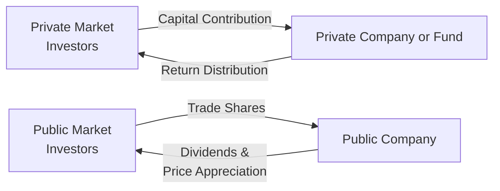

## Introduction

So, you know how people often split “the market” into this big, universal place where stocks trade on screens all day long? In reality, this broad “market” is made up of many different venues, rules, and participants—with the most notable divide between public and private markets. I remember back in my early days, I had a friend who was super excited because she thought “the market” was just about buying Apple shares (public) or, well, not buying them. But it’s so much deeper than that.

Public markets—think major stock exchanges—provide widespread access, daily (often minute-by-minute) pricing, and a heavy dose of regulation. On the other hand, private markets are often about negotiated deals, long lock-up periods, sometimes complex legal structures, and a great deal of nuance in how ownership rights are distributed. Because asset allocation decisions increasingly require an understanding of both public and private components, this section will dive into how these two domains differ and why those differences matter to professional investors (and, well, the rest of us, too).

## Structural Differences

### Negotiated Transactions vs. Centralized Trading

A fundamental distinction is how securities are bought and sold. In public markets, shares of publicly listed companies trade on centralized exchanges such as the New York Stock Exchange (NYSE) or NASDAQ. An investor can simply place a trade order through a broker, and—provided it’s within trading hours—the order might be fulfilled in seconds.

In private markets, transactions are directly negotiated between a limited set of participants or through private placement processes. You might see deals in which company founders negotiate with a few select venture capitalists, or a private fund contacting a limited partner (LP) to raise capital. There’s no public “tape” continuously showing the market clearing price, so you rely on negotiations or last-round financing valuations. As a result, if you hear about a “bidding war” in private markets, it might still be a tad hush-hush, with only a small circle even aware it’s happening.

### Regulatory Oversight

Public markets typically feature stringent regulations. Publicly listed companies are required to file financial statements with regulators (like the SEC in the United States) under strict rules—often IFRS or US GAAP. Penalties for misreporting can be quite severe, which (in theory) bolsters investor confidence in publicly traded stocks. For instance, if you open up a 10-K or an annual financial statement, you’ll see pages of disclosures aimed at ensuring transparency.

Private markets, in contrast, operate under less intense regulatory mandates. Private companies often sidestep the need to file detailed public reports, partly because they’re not selling shares to the general public. Regulations focus more on accredited or institutional investors, assuming these participants can do their own due diligence. That said, recent years have seen increased scrutiny of private funds, subscription credit facilities, and other capital structures (more on these in Chapter 2.8), indicating that regulators are trying to keep pace with private markets’ growth.

### Liquidity Profiles and Holding Periods

In public markets, trading liquidity makes it relatively easy to convert investments to cash. Sure, large-block trades can move the price, but even those can typically be executed in short order. By comparison, private investments typically entail longer holding periods—think five to ten years for many private equity or venture capital funds. This “patient capital” approach fits private markets’ emphasis on strategic, hands-on value creation (mergers, turnarounds, expansions). As a result, an investor can’t quickly exit a position if they want to. Yup, in private deals, you’re often in it for the long haul.

LOCK-UP PERIODS  
Private funds also commonly enforce lock-up periods, meaning investors cannot redeem their investments for a specific time. These structures ensure the fund manager has stable capital to deploy into potentially illiquid ventures. Great if you’re seeking high returns and can handle the illiquidity. Not so great if you suddenly need cash.

### Reporting and Valuation Frequency

Publicly traded securities enjoy (or suffer from, depending on your perspective) real-time or near-real-time pricing. Each trade ticks the price up or down, giving all participants a clear view of the latest market sentiment. In private markets, you often only see formal valuations at specific intervals—maybe quarterly, semi-annually, or even just annually. And those valuations are usually based on models or precedent transactions, which can get hairy when purely objective “market prices” are absent.

For instance, a private equity fund might value its portfolio companies using a discounted cash flow (DCF) or comparable company approach only once a quarter. The rest of the time, the official valuations remain static, which can lead to “smooth” portfolio returns—at least in outward appearance. However, the ultimate realized return can differ significantly from the periodic paper valuations. This is where the famous metrics like internal rate of return (IRR) or multiple on invested capital (MOIC) come into play (more on that in Chapter 1.3). Important to keep in mind that less frequent valuation updates can obscure short-term volatility, which can be a blessing or a curse depending on your investment objectives.

### Corporate Governance Dynamics

Public corporations tend to have a broad shareholder base, which typically leads to a more distributed governance model. Sure, large institutional investors hold sway, but each shareholder might only hold a small fraction of total outstanding shares. Escalating concerns or effecting change can be complex (proxy fights, board negotiations, etc.). Executive teams in public companies often juggle quarterly earnings pressures, short-seller scrutiny, and immediate market reactions.

Privately held businesses, especially those sponsored by private equity or venture capital, usually have concentrated ownership—sometimes just a handful of equity holders. This concentration makes it simpler to enact strategic decisions quickly (albeit with less transparency or input from minority holders). As a result, private investors often exert more direct influence on a firm’s operations, whether it’s overhauling management, pivoting product strategy, or merging with a competitor. It can be powerful: I once saw a private equity sponsor basically greenlight a new business line within a month—something a public company of similar size might never get away with, at least not without shareholder pushback.

So let’s visualize some of these relationships:

In the left portion, private-market investors negotiate deals directly with the company (or a private fund) and eventually receive returns—often years later. On the right side, public-market investors use exchanges to immediately buy and sell shares in a public corporation with continuous price discovery.

## Implications for Portfolio Management

### Allocation and Diversification

From a portfolio construction viewpoint, illiquidity in private assets can either be a risk or a form of discipline, blocking knee-jerk reactions that plague public-market investors. The flip side is that if you need to rebalance or fund client withdrawals quickly, private assets could lock up capital. Many institutional portfolios carve out a separate “illiquid alternatives” bucket to handle these constraints, often aiming for an illiquidity premium as part of the overall return.

### Risk, Return, and Valuation Complexities

Public investments have standard risk measurements—like beta, liquidity risk, etc. Private investments require a deeper look. You’ll run into the question: “How do we measure risk if there’s no frequent pricing?” That’s partly why you see IRR used to measure returns in private equity. But IRR is highly susceptible to the timing and scale of cash flows. Understanding these nuances is vital for effective asset allocation and performance assessment. If you’re comparing an S&P 500 index fund’s performance to a five-year private equity partnership, just be aware that the metrics and the underlying assumptions differ materially.

### Best Practices and Common Pitfalls

• Overestimating Liquidity: Many first-time private market investors underestimate how long their capital will be tied up—and the potential complexity of secondary market exits.  
• Underappreciating Valuation Gaps: A private company’s perceived value can deviate significantly from what an actual exit would yield.  
• Inadequate Governance Checks: While private structures give you more direct influence, it also demands more thorough diligence and consistent oversight to address agency conflicts (explored in Chapter 1.6).  
• Overfocusing on IRR: IRR can be artificially boosted by quick early returns. Use other metrics like TVPI or MOIC to get a fuller picture (stay tuned for Chapter 1.3).  

## Glossary

• Public Equity: Shares of companies that are listed on a public exchange, generally accessible to anyone with a brokerage account.  
• Private Equity: An ownership stake in businesses not listed on regulated public exchanges, often negotiated in private transactions.  
• Regulatory Oversight: The differing frameworks of laws, regulations, and standards that govern public vs. private entities, impacting disclosure and investor protection.  
• Liquidity: The ability to quickly convert an asset into cash without significantly altering its price. Public markets excel in liquidity, whereas private markets do not.  
• Lock-up Period: The timeframe in which investors are prohibited from redeeming or selling their interests in private investments.  

## References and Further Reading

• Damodaran, Aswath. (2012). Investment Valuation: Tools and Techniques for Determining the Value of Any Asset. John Wiley & Sons.  
• Jenkinson, Tim, and Sousa, Miguel. (2015). “Why Public Markets Do Not Allocate Enough Capital to Private Equity.” Journal of Applied Corporate Finance.  
• CFA Institute. (2020). “Alternative Investments: A Primer for Investment Professionals.”  
• Preqin. (2023). “Global Private Capital Reports.” Available at:  
  ┗ <https://www.preqin.com/>

## Exam Tips

• Expect scenario-based questions comparing public-company performance metrics (like EPS growth) to private-market metrics (such as IRR or TVPI).  
• You could see an item set involving an illiquidity constraint, requiring a recommendation about how much to allocate to private equity.  
• Understand how to approach “constructed-response” questions regarding governance trade-offs between private vs. public rails.  
• Watch for references to fees and carried interest in private structures, an integral part of return calculations and alignment of interests (covered in Chapter 2.3).  

--------------------------------------------------------------------------------

## Test Your Knowledge: Private vs. Public Markets Essentials



### Which type of market typically features continuous price discovery?

- [ ] Private markets
- [x] Public markets
- [ ] Both private and public markets
- [ ] Neither private nor public markets

> **Explanation:** Public markets provide continuous trading on centralized exchanges, resulting in near real-time price discovery.

### Investors in private equity funds usually face which of the following?

- [x] Longer lock-up periods, limiting redemptions
- [ ] Strict daily liquidity
- [ ] Real-time valuations
- [ ] Unlimited share redemption benefits

> **Explanation:** Private equity investments typically have lock-up periods that restrict an investor’s ability to redeem shares, reflecting the long-term nature of these investments.

### Which statement best describes regulatory requirements for publicly traded companies compared to private firms?

- [x] Public companies generally face more stringent and frequent disclosure requirements.
- [ ] Public companies can choose when to publish financial statements.
- [ ] Private firms are required to disclose all financial information to the public.
- [ ] Private firms face the same level of oversight as public markets.

> **Explanation:** Public companies file detailed reports with regulators at regular intervals, whereas private firms have fewer mandated disclosures.

### In the context of corporate governance, which is a distinguishing factor between private and public markets?

- [x] Concentrated control among a few insiders in private markets
- [ ] Larger boards of directors in private markets
- [ ] Shareholders in private markets typically outnumber those in public markets
- [ ] None of the above

> **Explanation:** Private market ownership is often concentrated among a small group of investors, allowing for direct and actionable governance.

### Which of the following metrics is most commonly used to evaluate private market investments?

- [x] Internal Rate of Return (IRR)
- [ ] Price-to-Earnings (P/E) ratio
- [x] Total Value to Paid-In (TVPI) multiple
- [ ] Dividend Yield

> **Explanation:** IRR and TVPI are standard private equity performance measures. P/E and dividend yield are more widely used in public equities.

### One characteristic of private market investments is:

- [x] Negotiated deals without centralized exchange
- [ ] Seamless daily trading via brokerage platforms
- [ ] Immediate mark-to-market pricing
- [ ] Equal liquidity to public equities

> **Explanation:** Private investments are usually negotiated deals that do not trade on centralized exchanges, leading to lower liquidity than public equities.

### A key risk for investors in private markets includes:

- [x] Extended holding periods and illiquidity
- [ ] Guaranteed exit within days
- [x] Potential valuation uncertainty
- [ ] Daily mark-to-market volatility

> **Explanation:** Private investments often lock up capital for years, and valuations are typically based on models or periodic appraisals rather than continuous market trades.

### Which of the following is true about lock-up periods?

- [x] They prevent investors from withdrawing capital for a set time.
- [ ] They only apply to public-market mutual funds.
- [ ] They are standardized at 12 months for every private fund.
- [ ] They ensure investors can sell shares frequently.

> **Explanation:** Private funds often stipulate lock-up periods, restricting redemptions for a predefined duration—there’s no single standardized length.

### Which statement best describes liquidity in public markets?

- [x] Shares can be readily bought and sold on exchanges.
- [ ] Investors generally face 5+ year lock-up periods.
- [ ] Prices are updated annually.
- [ ] Liquidity is identical to private markets.

> **Explanation:** Public market shares are typically traded on exchanges, allowing investors to buy or sell quickly at prevailing market prices.

### True or False: Governance in a public company is typically driven by a concentrated group of owners who can make quick decisions without shareholder votes.

- [ ] True
- [x] False

> **Explanation:** Public companies usually have dispersed ownership, which constrains the ability to make rapid changes without broader shareholder participation or proxy activities.


