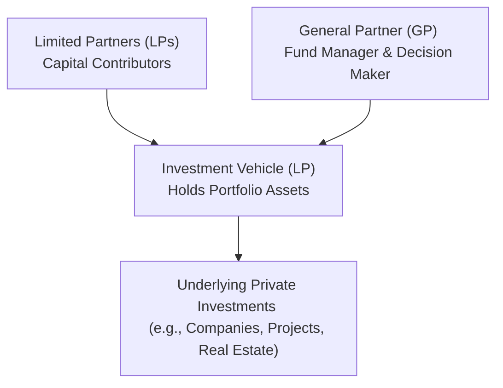
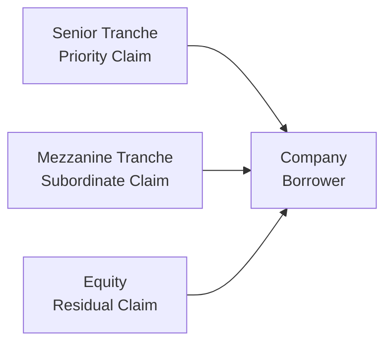

## Overview

Investing in private markets opens up a wide range of opportunities—but also a variety of complexities—that extend beyond those of the public equity and debt spaces. At its heart, private market investing is all about matching capital with privately held companies, real estate properties, or projects. For investors, it offers the possibility of higher returns, unique exposures, and a certain level of control that public markets rarely provide. But let’s face it: the structures, the fees, and the risk-return profiles can get confusing. I remember sitting in a café once with a friend—someone new to private equity—and watching their eyes glaze over when I dropped terms like “limited partnership” and “subscription credit facility.” If you’ve ever felt that way, no worries. It can feel a bit overwhelming at first.

The good news is that, in this section, we’ll walk through the main methods and structures of private investments. We’ll explore the different vehicles and the ways in which private equity, debt, real estate, and infrastructure are commonly held, so that you’ll have a clearer sense of what is actually going on when you invest in these areas.

## Key Private Investment Structures

Private investments can be structured in multiple ways, but the most common organizational forms include Limited Partnerships (LPs), Limited Liability Companies (LLCs), and, in some cases, open-end or closed-end fund models. There are also specialized structures for real estate (e.g., real estate investment trusts or REITs in some jurisdictions) and unique concession agreements for infrastructure. Regardless of the exact form, the core logic remains: pooling investors’ capital while entrusting a management team or sponsor to oversee (and ideally grow) that investment.

### The Limited Partnership Model

The limited partnership is probably the most common structure for private equity funds, private debt funds, and certain types of real estate and infrastructure funds. In an LP structure, you have two primary parties:  
• Limited Partners (LPs), who contribute most of the capital but have limited liability.  
• General Partners (GPs), who manage the fund, implement the strategy, and assume broader liabilities for the fund’s operations.  

Under classic practice, LPs commit capital for a set duration—often around 10 years for private equity—during which investments are made and eventually exited. The GPs call the requested capital (usually in multiple tranches) from the LPs as they find new investment opportunities. Returns and distributions flow back to LPs as the assets are sold or recapitalized, and the GPs usually collect both a management fee (as a percentage of committed or invested capital) and carried interest (a share of the profits above a certain threshold—often referred to as the “hurdle rate”).

Below is a simplified illustration of the LP-GP relationship:

• Limited Partners (LPs): Provide the bulk of the capital. Typically pension funds, endowments, insurance companies, family offices, or high-net-worth individuals.  
• General Partner (GP): Exercises control over investment decisions, portfolio oversight, and overall fund operations.  
• Investment Vehicle: The legal entity that pools money from the LPs, invests in assets, and distributes returns.  

### The LLC (Limited Liability Company)

An LLC structure is another way sponsors can raise capital without forming a traditional LP. LLCs can offer tax advantages similar to LPs (pass-through taxation) and allow for limited liability for the owners, known as members. GPs or managers can organize their fund as an LLC to gain flexibility in governance and distributions. Some sponsors find the LLC structure simpler to set up or more aligned with certain regulatory requirements. But in practice, the operational differences between LLCs and LPs can be subtle.

One personal anecdote: a friend of mine in real estate swears by the LLC format because it allows him to bring in different categories of members (Class A, Class B, etc.) with varying rights. He jokes it’s a near-infinite level of customizing distribution waterfalls. Meanwhile, other folks in private equity prefer the tried-and-tested LP approach, especially because many institutional investors have a systematic preference for LP structures. So it’s all about what’s best for your investor base and strategic goals.

## Private Equity Structures

Private equity structures typically revolve around a closed-end limited partnership. Most funds define a time horizon of 7–10 years, with the possibility of two or three one-year extensions. The life of the fund is divided into key phases:  
• Investment Period: The early years when the GP calls committed capital from LPs to source and execute deals.  
• Harvest Period: Mid-to-later years when portfolio companies are grown, improved, or restructured, eventually leading to exit events such as IPOs, trade sales, or secondary buyouts.  
• Distribution Phase: The point at which the GP liquidates positions and returns proceeds to LPs, net of carried interest and fees.

It’s not uncommon for GPs, especially in smaller funds or niche sectors like venture capital, to create side-car vehicles for co-investment opportunities. This is where select LPs can invest more capital in a specific deal. The overall structure, though, remains very similar: a closed-end fund with limited redemption possibilities until an exit event occurs.

## Private Debt Structures

Private debt can appear in many forms, including senior secured loans, mezzanine financing, direct lending, and unitranche structures. What ties them all together is that they’re typically not traded on a public exchange—so intangible liquidity is, well, often very uncertain.

### Direct Lending Platforms

Direct lending has grown in popularity as banks have scaled back certain types of lending due to regulatory constraints. Many private debt funds (structured as LPs) extend loans directly to companies, especially middle-market or lower-middle-market firms. Investors receive interest income in return. A direct lending fund often uses a closed-end structure as well because the repayment happens over a loan term rather than an on-demand basis.

### Mezzanine Financing

This occupies a risk level between senior debt and common equity. A mezzanine tranche is often subordinated to senior bank loans but ranks above common shares. In some cases, mezzanine debt can include warrants or convertible features, giving investors upside potential if the underlying business performs well. Because mezzanine is higher risk, it typically commands a more substantial coupon and, sometimes, equity-like participation.

### Unitranche Loans

A unitranche facility merges senior and subordinated debt into one blended instrument. The borrower signs a single loan agreement but, behind the scenes, different tranches of investors (or sub-participations) might slice up the risk. From the borrower’s perspective, it’s simpler—one interest rate, one set of terms. From the investors’ standpoint, it can be attractive because it offers a more flexible capital structure and often yields a bit higher than straightforward senior debt.

Below is a high-level diagram illustrating a possible approach to private debt facility layering:

• Senior Tranche enjoys the highest priority of repayment, generally containing fewer risk features.  
• Mezzanine Tranche is structurally subordinated, carrying higher interest or equity kickers.  
• Equity claims remain at the bottom of the capital stack but can benefit from unlimited upside if the equity significantly appreciates.

## Private Real Estate Structures

Real estate is often considered a tangible, stable asset class, but the structures used to invest in it can be quite varied:

• Closed-End Real Estate Funds: Similar to private equity, these funds raise a fixed amount of capital and invest over a defined period. After acquisitions, the fund works on value creation strategies—like renovating or repositioning properties—before eventually liquidating assets.  
• Open-End Real Estate Funds: These funds allow continuous inflows and outflows of capital. They hold a portfolio of properties that investors can buy into or redeem from, subject to liquidity constraints. They are more common with core or core-plus real estate strategies that are relatively lower risk.  
• Joint Ventures: Two or more parties form a partnership to develop or manage a specific property or group of properties. One party might be the capital provider, while the other is the local operator with on-the-ground expertise. Joint ventures typically have a carefully negotiated arrangement of management rights, upside-sharing, and exit provisions.  
• Direct Ownership: Some large institutional investors with the capacity to source and manage properties directly might simply buy real estate assets themselves. This strategy provides maximum control but also carries the greatest requirement for operational resources.

## Private Infrastructure Structures

Infrastructure assets—such as toll roads, airports, power plants, and social infrastructure—often demand large capital outlays and long investment horizons. It’s common for governments to partner with private investors to design, finance, and operate these projects. Thus emerged the public–private partnership (PPP) model, where a government entity awards a concession or contract to a private consortium for a set period. Infrastructure can also be held in private funds or through co-investment structures, much like real estate or private equity.

### Public–Private Partnerships (PPPs)

In a PPP, the government might own the underlying asset (e.g., a highway) while the private operator invests capital, constructs and maintains the facility, and has the right to collect user fees or receive availability payments. These concessions typically last 20–30 years or more. Towards the end of the concession, ownership or control reverts back to the government. For investors, the potential for stable, long-term cash flow is a central attraction, though the political and regulatory risks can be significant.

### Concessionary and Fund-Based Approaches

Sometimes, an infrastructure asset is financed via concession agreements directly negotiated with governmental authorities. Other times, investors (e.g., large pension funds or sovereign wealth funds) pool resources into a private infrastructure fund that invests in multiple projects. The latter approach offers diversification across different infrastructure sectors—transport, utilities, social infrastructure—but still faces illiquidity and long lockup periods.

## Comparing Open-End vs. Closed-End Funds

You’ve likely seen references to open-end and closed-end funds, but what’s the real difference? Here’s a quick rundown:

• Open-End Funds: Continuously accept new capital and allow redemptions, subject to certain protocols. They’re common in more liquid (or relatively more liquid) private market strategies, such as core real estate or certain forms of private credit. Valuations of the underlying assets often guide the fund’s net asset value (NAV), which is periodically updated. However, if too many investors redeem at the same time, the fund might impose gate provisions or redemption queues.  
• Closed-End Funds: Raise a finite amount of capital. LPs commit to the fund, capital is called over a designated drawdown period, and there’s a fixed life of the fund. Distributions typically occur when underlying assets are sold. This model is favored in private equity, venture capital, and mezzanine strategies, where the illiquidity is part of the fundamental design, enabling GPs to manage longer-term projects without the stress of daily inflows or outflows.

## Management Fees, Carried Interest, and Subscription Credit Facilities

One hallmark of private markets is the so-called “2 and 20” fee model: 2% management fee on committed or invested capital and 20% carried interest on profits above a hurdle. Of course, actual numbers can vary. But the concept remains the same in many structures:

• Management Fee: Helps the GPs cover operating costs, salaries, overhead, etc.  
• Carried Interest: Acts as an incentive compensation that aligns GP interests with the success of the investment. If the fund’s internal rate of return (IRR) exceeds a certain threshold (say 8%), the GP shares a portion of the upside.

### Subscription Credit Facilities

Subscription credit facilities (often simply called “subscription lines”) have become more common in private funds. Essentially, the fund secures a revolving line of credit—often with a bank—collateralized by the unused capital commitments of the LPs. This credit line allows the GP to quickly deploy capital for deals without immediately calling capital from the LPs. The GP can then aggregate capital calls at more convenient intervals. From the LP perspective, this can simplify administrative burdens and sometimes enhance the reported IRR (because the capital is drawn down later). However, the incremental cost of borrowing and any potential mismatch of risk are considerations that must be managed.

## Practical Examples and Case Studies

• Private Equity Buyout Fund Example: Suppose a $1 billion buyout fund invests in mid-cap manufacturing companies. The GP invests $50 million into a target, partly financed by debt. Over five years, the GP improves operations, merges it with a complementary competitor, and sells the combined entity for $120 million in net proceeds. The fund recoups $70 million in net gain on that deal, which then is distributed to the LPs and GP according to the carried interest arrangement.  
• Mezzanine Debt Example: A real estate development company needs $20 million in mezz financing to complete a large mixed-use project. A private debt fund invests at a coupon of 10% plus equity warrants. Two years later, the project is refinanced, the mezz debt is repaid, and the warrants are worth $3 million. Total returns for the mezz provider exceed 15% IRR.  
• PPP Infrastructure Deal: A government entity in a developing nation partners with a consortium of private investors to build and operate a new toll road. The concession is awarded for 25 years. The investors inject $200 million in equity, with $300 million in project finance debt. The project collects toll revenues, with a portion dedicated to repaying lenders and providing equity distributions over time.

## Common Pitfalls and Risk Considerations

• Illiquidity: Private investments often come with lock-up periods and limited secondary markets.  
• Valuation Complexity: Assets are not publicly traded, so valuations often rely on financial modeling and third-party appraisals.  
• Misalignment of Interests: If fee structures are opaque or too generous to the GP, it may cause a rift with LPs over time.  
• Regulatory and Political Risk: Infrastructure deals especially can be exposed to shifts in policy or public sentiment.  
• Overuse of Subscription Credit Lines: May inflate reported IRRs and add financial risks if not managed carefully.

## Preparing for the CFA® Level III Exam

It can be easy to get stuck in the technical weeds of private market structures, so keep an eye on the bigger picture. The CFA® Level III exam often expects you to synthesize how these structures tie into broader portfolio management decisions, as well as how they might affect risk and performance measurement. Remember that you could see scenario-based questions testing your knowledge of how distributions are allocated in a private equity waterfall, or how an open-end fund might respond to large redemption requests.

Stay nimble with your knowledge of how management fees and carried interest can affect net returns. Also, be ready for an essay question that explores the role of co-investments, subscription lines, or mezzanine structures in optimizing a client’s portfolio. Reviewing real-world examples and calculating net returns after fees are skill sets that absolutely come into play.

## Conclusion and Key Exam Tips

Methods and structures of private investments can be a bit like building blocks—you choose the best structure (limited partnership, LLC, joint venture, or PPP) for the strategy (private equity, debt, real estate, or infrastructure). Pay attention to the trade-offs in liquidity, control, and governance. Understand how open-end and closed-end funds differ in capital flow. Remember that fees and carried interest are central to aligning interests between GPs and LPs.

If you’re preparing for the exam, I think the following pointers could help:  
• Practice applying the “waterfall” concept in private equity distributions to hypothetical scenarios.  
• Solidify your grasp on capital call mechanics and how subscription credit facilities can distort IRR calculations.  
• Know the differences between senior debt, mezzanine debt, and equity positions in the capital stack.  
• Keep an eye on the big picture: how do these structures fit into an overall portfolio, and how do they affect the risk-return profile?

Understanding these foundational elements of private investment structures sets the stage for deeper conversations on valuation, performance measurement, ESG integration, and more advanced topics you’ll find in subsequent chapters of the CFA® 2025 Level III, Private Markets pathway.

## References

• Metrick, Andrew, and Yasuda, Ayako. (2021). “Venture Capital & the Finance of Innovation.” Oxford University Press.  
• Gompers, Paul, et al. (2016). “Private Equity: Capital Structure and Governance.” Oxford Handbook of Private Equity.  
• Titman, Sheridan, et al. (2015). “Commercial Real Estate Analysis and Investments.” Cengage Learning.  
• Engel, E., Fischer, R., and Galetovic, A. (2014). “The Economics of Public-Private Partnerships: A Basic Guide.” Cambridge University Press.

## Test Your Knowledge: Private Investment Structures Essentials



### Which participant typically manages the daily operations of a limited partnership while bearing more liability?

- [ ] Limited Partner (LP)
- [x] General Partner (GP)
- [ ] Corporate Shareholder
- [ ] Senior Lender

> **Explanation:** In a limited partnership structure, the GP handles day-to-day operations and has more liability, while the LPs provide the capital and assume limited liability.

### Which statement best describes mezzanine financing?

- [ ] A secured form of debt with priority claim
- [x] A subordinated layer of financing with some equity-like features
- [ ] A type of equity security that ranks lowest in repayment
- [ ] A standard bank loan facility with low risk

> **Explanation:** Mezzanine debt sits beneath senior debt in the capital structure and often includes warrants or convertible features, offering both interest income and potential equity upside.

### One advantage of an LLC structure for private investments is:

- [x] The ability to have pass-through taxation similar to partnerships while offering limited liability to owners
- [ ] Guaranteed higher returns
- [ ] Publicly traded securities that offer daily liquidity
- [ ] The elimination of carried interest provisions

> **Explanation:** An LLC offers limited liability and can be structured for pass-through taxation, making it popular for certain private funds. However, performance and liquidity are not guaranteed, and carried interest may still apply.

### Which characteristic distinguishes open-end real estate funds from closed-end real estate funds?

- [x] Open-end funds allow continuous inflows/outflows of capital, whereas closed-end funds have fixed capital commitments
- [ ] Only closed-end funds can invest in commercial real estate
- [ ] Closed-end funds never charge management fees
- [ ] Open-end funds distribute carried interest every quarter

> **Explanation:** The main distinction is how investors can enter or exit. Open-end funds allow inflows and outflows subject to certain conditions, while closed-end funds have a predetermined commitment period and a fixed lifespan.

### In a unitranche loan structure:

- [ ] All debt remains unsecured
- [ ] The borrower issues multiple layers of debt with different servicing requirements
- [x] Senior and subordinated financing are combined into a single loan with a blended rate
- [ ] The lender is replaced by the equity holders for day-to-day operations

> **Explanation:** Unitranche loans consolidate senior and subordinated debt into one agreement with a single interest rate, simplifying the borrower’s liabilities.

### A primary purpose of subscription credit facilities in private funds is:

- [ ] To allow LPs to redeem capital daily
- [x] To bridge short-term capital needs so GPs can quickly close deals before formally calling LP capital
- [ ] To dilute the LPs’ ownership
- [ ] To replace the GP in managing day-to-day investments

> **Explanation:** Subscription lines help private funds act swiftly on deals without immediate capital calls. The facility is typically secured by the LPs’ capital commitments.

### Which key consideration is MOST characteristic of infrastructure investments through PPPs?

- [x] Long-term concessions and potential political/regulatory risks
- [ ] Minimal capital requirements
- [ ] High liquidity and short holding periods
- [ ] Guaranteed returns by the government

> **Explanation:** PPPs commonly involve long-term contracts with significant government oversight and potential political/regulatory uncertainties, often with large required capital outlays.

### What is carried interest?

- [ ] A fixed fee collected from LPs at fund inception
- [ ] A penalty charged when LPs redeem their shares
- [x] A share of profits paid to the GP once returns exceed a certain threshold
- [ ] Another term for interest payments on leveraged loans

> **Explanation:** Carried interest is GP’s share in the fund’s profits, typically realized once the fund meets or exceeds a hurdle rate of return.

### If a real estate joint venture is formed to acquire a property, who typically brings the local expertise?

- [ ] The external auditor
- [x] The operating partner who manages development or property management
- [ ] The limited partner with no day-to-day responsibilities
- [ ] The subscription credit facility lender

> **Explanation:** In most joint ventures, one partner (the operating partner) provides local market knowledge and operational expertise, while the capital partner supplies a larger share of investment capital.

### An investor states: “We want continuous ability to contribute or withdraw capital from our private real estate investment.” Which fund structure is most likely a better fit?

- [x] Open-end fund
- [ ] Closed-end fund
- [ ] Mezzanine financing arrangement
- [ ] Special Purpose Vehicle

> **Explanation:** Open-end funds provide ongoing inflows and outflows, though they still have certain redemption constraints compared to traditional mutual funds. Closed-end funds generally lock investors in until the fund liquidates.


