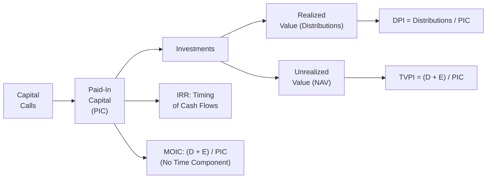

## Introduction and Overview

Private market investors—whether they’re massive pension funds or individuals dipping their toes into venture capital—often rely on specific performance metrics that might look a bit mysterious at first. You’ll hear terms like IRR, MOIC, TVPI, and DPI thrown around at investor conferences. The big question is: which one should you trust to give you a “real” perspective on how well your private investments are doing?

In this article, we’ll explain each of these private market performance metrics, how they’re calculated, and why they matter. We’ll look at practical examples, best practices, and pitfalls so you can feel more confident reading quarterly fund updates or analyzing new private investment opportunities.

Although it may seem daunting at first, these metrics become much clearer once you understand their mechanics. So, let’s start with a quick overview. Suppose you invest $1 million into a young venture capital fund. You might see capital calls happen at different points, distributions trickle in, and an eventual final exit upon liquidation. The question is: once it’s all said and done, how do you measure your actual performance, and which measure is “best” for you?

Well, each metric shines a light on a different aspect of your returns. IRR tries to incorporate the time value of money with all those irregular cash flows. MOIC is a simple ratio that shows how many times your money has multiplied. TVPI merges realized gains and unrealized value to get the total investment value relative to what you put in, and DPI focuses on what has actually been returned to your pocket so far. Let’s break them down carefully.

## The Internal Rate of Return (IRR)

Many seasoned investors swear by IRR because it’s theoretically quite elegant at incorporating the time value of money. If you’ve come across net present value (NPV) before, IRR is the discount rate at which that project’s NPV equals zero. Or, as a formula:


\sum_{t=0}^{T} \frac{C_t}{(1+r)^t} = 0


where:
- \\(C_t\\) is the net cash flow at time \\(t\\).  
- \\(r\\) is the IRR being solved for.  
- \\(T\\) is the total number of periods (often expressed in years or quarters).

### Why IRR Matters

IRR helps you compare private market opportunities with public assets (like stocks and bonds) or even across different private funds. The rationale is that IRR factors in exactly when money goes into the fund and when distributions come out. For example, if Fund A gets you a 30% annualized IRR but it only returned your money at the very end of the fund’s life, that might tell a different story than Fund B with a 25% IRR that’s delivering distributions steadily (i.e., less reinvestment risk and improved cash flow).

When I first encountered IRR years ago, I remember feeling a bit overwhelmed by the concept of “guessing” a discount rate that results in an NPV of zero. But then it occurred to me that we’re basically trying to figure out the effective growth rate equating all future inflows and outflows to the initial cost. Once that clicked, I started thinking: “Oh, so this is about the return that sets my investment’s net present value to break-even.”

### Nuances and Pitfalls of IRR

• Reinvestment Assumption: IRR implicitly assumes that interim cash flows are reinvested at the same IRR. This can be unrealistic or at least optimistic.  
• Manipulation Through Timing: IRR can be “juiced” by quick returns (i.e., an early large distribution can significantly bump your IRR, which might overstate the long-term attractiveness of the investment).  
• Vintage and Duration Comparisons: Comparing two funds that have drastically different investment horizons or drastically different patterns of capital calls and distributions can give misleading IRR comparisons. A shorter-duration investment may give an extremely high IRR but low absolute dollar return.  

One important note for exam day: IRR questions often involve careful counting of cash flows at different times and testing your ability to interpret the result. Private equity managers frequently highlight their IRR in marketing materials, but it’s crucial to understand the assumptions behind that IRR to know if it’s realistic.

## The Multiple on Invested Capital (MOIC)

MOIC is often the friendliest metric for a quick glance. It looks at how many times your original capital has grown. It doesn’t care about when those returns happened—just the ratio of total value (realized plus unrealized) to the capital you contributed.


\text{MOIC} = \frac{\text{Sum of realized proceeds + Unrealized value}}{\text{Total capital invested}}


Let’s say you invested $200,000 in a private company, and years later you have $300,000 in realized proceeds plus the current fair market value of your remaining stake is $200,000. Your total value is $500,000 and your initial investment was $200,000. Your MOIC, in that case, is $500,000 / $200,000 = 2.5×. Not too shabby, right?

### Benefits and Limitations of MOIC

MOIC is extremely straightforward, so it’s a nice “headline number.” If you see a MOIC of 3×, it basically means “we tripled our money,” ignoring how long it took. Well, that leads right to the shortcoming: it doesn’t incorporate the time value of money. Tripling your money in three years is radically different from tripling your money in 10 years—both produce a MOIC of 3×, but the IRRs are very different.

Sometimes, when I talk to friends who just want a quick sense of how a particular investment is doing, MOIC is the first metric they check: “Is it at least above 1×, or is it still underwater?” But for deeper analysis—especially for large, time-sensitive projects—MOIC is usually not enough.

## Total Value to Paid-In Capital (TVPI)

TVPI is basically MOIC from the perspective of limited partners (LPs) in a private fund. It’s often expressed as:


\text{TVPI} = \frac{\text{NAV of fund + Cumulative distributions}}{\text{Paid-In Capital}}


Think of TVPI as a ratio that tries to capture both realized and unrealized value in one number. It’s typically used in the context of a private equity or venture capital fund, where the GP calls capital from LPs over time (the so-called “paid-in capital”). This is the main distinction from a single direct investment: in a fund structure, your capital is usually contributed in multiple installments over the first few years.

### Practical Example

Let’s do a small scenario. You commit \$1,000,000 to a private equity fund. Two years in, the GP has called \$600,000 of that commitment (that’s your paid-in capital, or PIC). The NAV (net asset value) of your share in the fund is \$800,000, and you’ve received \$100,000 in distributions so far.  

Hence:

• Paid-In Capital (PIC) = \$600,000  
• Distributions (D) = \$100,000  
• Net Asset Value (NAV) = \$800,000  

Then:


\text{TVPI} = \frac{\$800,000 + \$100,000}{\$600,000} = \frac{\$900,000}{\$600,000} = 1.5\times


A TVPI of 1.5× means that your total value (both realized and unrealized) is 1.5 times what you’ve put into the fund so far. Again, the key is “what you’ve put in so far.” Some folks get confused if they think, “But my total commitment is \$1 million, so wouldn’t the denominator be \$1 million?” No, TVPI is a function of capital that’s actually been called into the fund.  

### Why Care About TVPI?

• Captures Beta: TVPI is a snapshot capturing how much the investment is “worth” right now (based on fair value) plus what has been paid back, relative to contributed capital.  
• Comprehensive View: Combining interim distributions and the current NAV can show potential exit values if everything works out—and that can be more informative than MOIC alone.  
• Doesn’t Overstate Returns (As Much): IRR might get skewed by a small, early distribution, whereas TVPI is more focused on the ratio of total value to capital that has actually gone in.

## Distributions to Paid-In Capital (DPI)

DPI is the ratio of cumulative distributions (amounts actually returned to you in cash or equivalent) over paid-in capital. If you really want to see “How much real money have I gotten back so far for every dollar I’ve put in?” DPI is the place to look:


\text{DPI} = \frac{\text{Cumulative distributions}}{\text{Paid-In Capital}}


Because private market funds often have a long lifespan, you’ll see GPs report an interim DPI. If a fund is early in its life, the DPI might be near zero because the manager hasn’t exited many (or any) deals yet. If the fund is near the end of its term, the DPI might be significant. But remember, DPI is solely about realized returns—no guesswork or fair values.

### Example Using DPI

Let’s say you have a buyout fund that called \$800,000 of your \$1 million commitment, and it has already exited a few portfolio companies, returning \$400,000 of distributions. Then your DPI is 0.5× at that moment (\$400,000 / \$800,000). 

A year later, the fund sells another asset and gives you an additional \$300,000. Now your total distributions are \$700,000, so your DPI rises to 0.875× (\$700,000 / \$800,000). Eventually, the fund may surpass 1.0× DPI—which means you’ve received back every contributed dollar. Everything beyond 1.0× is pure realized profit (granted, ignoring time value).

From experience, I’ve seen some investors focus heavily on DPI once a fund is 7 or 8 years old. They want to know how much has actually come back, especially if they’re relying on that capital for future obligations.  

## Comparing and Contrasting the Metrics

Sometimes people ask, “If I can only pick one, which metric do I look at?” The short answer: it depends on what you’re trying to measure.

• **IRR**: If you’re worried about the timing of cash flows and want to compare multiple deals or funds on an annualized basis, IRR is your go-to. But keep in mind it can be distorted by early partial exits.  
• **MOIC**: A quick gauge of how much your money has grown in absolute terms, ignoring time. Great for a sound bite, but not so great if you want to compare speed and efficiency of returns.  
• **TVPI**: The GAAP of private fund performance? Possibly. It’s an all-encompassing ratio of the current net asset value plus distributions over paid-in capital. Less sensitive to quick distributions than IRR, but also includes “unrealized” values that could fluctuate.  
• **DPI**: The “cash in the bank” ratio. DPI measures how much actual cash (or stock distributions) you’ve received relative to what you’ve contributed. Perfect for understanding how much money has really made it home thus far.

### Influence of Capital Calls and Distribution Timing

The order and frequency of capital calls and distributions matter a lot. For instance, a fund that calls capital early and invests quickly has more time in the market, which might affect its IRR if the eventual exit is huge. Meanwhile, another fund that calls capital more slowly might show a more moderate IRR early on. As for distributions, a well-timed partial sale can boost IRR significantly even though the majority of capital might still be locked up.

Anyway, it’s important to realize that different GPs can have different strategies, which can alter which metric looks most favorable in the short run. To see the big picture, you’ll want to track multiple metrics over time.

### Common Pitfalls

• **Ignoring Fees**: Always clarify if the IRR or other metrics are gross or net of fees, carried interest, and other fund expenses.  
• **Comparing Incomparable Funds**: A short-horizon, early-exiting buyout fund might inflate IRR compared with a longer horizon venture capital fund.  
• **Overfocus on IRR**: Some funds distribute capital early to boost IRR. That might look great on paper, but if the fund has done so by selling big winners prematurely, the ultimate total return might suffer.  
• **Too Direct a Comparison with Public Markets**: IRR and MOIC were developed with irregular private market cash flows in mind. Public market equivalents exist, but bridging that gap isn’t always straightforward.

## Visualizing Relationships Among Performance Metrics

Below is a simple Mermaid diagram that highlights how these metrics link to each other and to fund cash flows:

• **PIC**: how much capital you’ve put in so far.  
• **Distributions (D)** come out of realized investments.  
• **Unrealized Value (E)** is the net asset value of remaining positions.  
• **DPI** focuses strictly on D relative to PIC.  
• **TVPI** includes both D and E in the numerator.  
• **MOIC** is effectively (D + E) / PIC, but typically used more on a single investment basis.  
• **IRR** concerns the specific timing of calls and distributions.

## Choosing the Right Metric for Your Analysis

Selecting the best tool for performance measurement depends on your perspective:

• **Limited Partner**: Might rely on TVPI and IRR to gauge overall performance, but also keep a close eye on DPI to understand the extent of real capital returned.  
• **General Partner**: Might highlight IRR in marketing, but also show MOIC to demonstrate absolute returns.  
• **Consultant or Investment Committee**: Generally looks at all of these metrics (alongside others like Public Market Equivalent (PME)) when discussing the private portfolio’s success and how it integrates into the broader strategic asset allocation.

At the end of the day, it’s not about which metric is the “best,” but rather which combination gives you the clearest picture for the question you’re trying to answer. 

## Quick Real-World Anecdote

I remember working with a small venture capital firm that was proud of its early IRR in year two—something like 40% net. Investors were super impressed. But the actual distributions were pretty small, so the DPI was less than 0.1×. The GP had sold one early seed-stage winner for quick cash, boosting IRR. Meanwhile, the rest of the portfolio was still illiquid and uncertain. Over time, the IRR gradually decreased to a more moderate figure, while the DPI eventually climbed. That’s a typical scenario showing how IRR can look flashy in the initial years, whereas DPI reveals the real money in your pocket.

## Summary of Best Practices

• Track multiple metrics (IRR, MOIC, TVPI, DPI) to get a holistic view.  
• Pay attention to timing: a quick partial exit can alter IRR and paint a misleading picture.  
• Always ask: are these metrics net of fees, or gross?  
• Understand the stage and strategy of the fund. Early venture might have a big gap between the initial IRR hype and real cash distributions.  
• Compare apples to apples: same vintage, similar sectors, or at least use recognized benchmarks.  
• Maintain skepticism about big IRR claims. Look deeper at the actual distributions and the underlying portfolio valuations.

## Exam Relevance and Tips

From a CFA Level III perspective, you can expect scenario-based questions where you’re provided a series of capital calls, distributions, and end-of-period valuations for a hypothetical private fund. You might have to:

• Calculate IRR using a set of irregular cash flows.  
• Compute MOIC (or a variation thereof) and interpret the result.  
• Determine TVPI and DPI at various points in the fund’s life.  
• Compare performance across multiple funds or question whether a manager’s claim about “super-high IRR” is truly justified.

It’s essential to be clear on (1) reading the question, (2) properly identifying the timing and amounts of cash flows, and (3) not mixing up paid-in capital with total commitments.

On the exam, watch out for time traps. If they say the capital was called at the “end of Year 1” and distributed at the “beginning of Year 3,” you must carefully discount or compound using the appropriate number of periods. Also look for whether the question wants you to interpret net IRR or a gross figure. Mistakes in reading those details can cost you valuable points.

Finally, practice partial computations under pressure. Sometimes you’ll need to quickly approximate an IRR or do a ratio-based approach. Quick mental arithmetic helps when you’re double-checking your approach. And always keep an eye on how the question is framed: “Explain how the difference in capital calls might affect IRR vs. MOIC.” That’s a common discussion point.

## References for Further Study

• Phalippou, Ludovic. (2020). “Private Equity Laid Bare.” CreateSpace Independent Publishing.  
• Jones, Charles M., and Rhodes-Kropf, Matthew. (2003). “The Price of Diversifiable Risk in Venture Capital and Private Equity.” Columbia University.  
• Lerner, Josh, et al. (2020). “Venture Capital, Private Equity, and the Financing of Entrepreneurship.” John Wiley & Sons.  

In addition to these, the official CFA Institute curriculum for Private Markets will give you a solid foundation, especially the sections on alternative investments advanced topics, cost of capital, and performance appraisal methods.

## Test Your Knowledge: Private Market Performance Metrics



### Which metric explicitly accounts for the time value of money when evaluating private investments?

- [ ] MOIC
- [x] IRR
- [ ] DPI
- [ ] TVPI

> **Explanation:** IRR explicitly incorporates the timing of each cash flow by finding the discount rate that sets the net present value of all cash flows to zero.

### What is one potential drawback of using MOIC as the primary metric of performance?

- [ ] It counts realized and unrealized proceeds in the numerator.
- [ ] It is net of fees and carried interest.
- [x] It does not factor in how long it took to achieve returns.
- [ ] It cannot be computed for buyout funds.

> **Explanation:** MOIC is simple and does not include time in its calculation. It could overstate performance if returns take longer to materialize compared to other investments.

### TVPI is used to assess the total value of a fund. Which components are included in the numerator of TVPI?

- [x] The fund’s NAV (unrealized value) plus cumulative distributions
- [ ] Only the fund’s NAV
- [ ] Cumulative paid-in capital plus distributions
- [ ] Management fees net of returns

> **Explanation:** TVPI is calculated by taking the total current value of the fund (unrealized) plus any distributions paid out, all divided by the paid-in capital.

### How does DPI differ from TVPI?

- [x] DPI measures only realized returns, while TVPI also includes unrealized value.
- [ ] TVPI is net of fees, while DPI is always gross of fees.
- [ ] DPI incorporates the time value of money, while TVPI does not.
- [ ] There is no difference between DPI and TVPI.

> **Explanation:** DPI focuses on cash or share distributions that have already been paid out compared to contributed capital, whereas TVPI includes both realized and unrealized value.

### Suppose you contributed $200,000 paid-in capital to a fund that has returned $100,000 in distributions so far. The fund’s net asset value currently stands at $250,000. Which statement is correct?

- [ ] DPI is 0.4×, TVPI is 0.7×
- [ ] DPI is 0.5×, TVPI is 1.0×
- [x] DPI is 0.5×, TVPI is 1.75×
- [ ] DPI is 0.4×, TVPI is 1.75×

> **Explanation:** DPI = 100,000/200,000 = 0.5× (proportion of paid-in capital already returned). TVPI = (100,000 + 250,000)/200,000 = 350,000/200,000 = 1.75×.

### Which statement about IRR is most accurate?

- [ ] It ignores the effect of timing on cash flows.
- [ ] It is equal to the fund’s MOIC raised to 1/n – 1.
- [x] It implicitly assumes that interim cash flows are reinvested at the IRR.
- [ ] It only measures realized cash distributions.

> **Explanation:** IRR calculations assume reinvestment of intermediate cash flows at the IRR itself, which can sometimes be overly optimistic.

### What is a key potential manipulation associated with IRR in a fund marketing context?

- [ ] Funds often understate fees in IRR calculations.
- [x] Funds may return capital early to boost IRR, even if total returns remain modest.
- [ ] Funds exclude unrealized value in IRR calculations.
- [ ] Funds are prohibited from showing IRR until the final close.

> **Explanation:** By returning partial capital quickly, a manager can artificially inflate IRR. This means high early returns do not necessarily indicate superior overall performance.

### If a fund’s TVPI is 1.2× and its DPI is 0.3×, what can be inferred about the unrealized portion of the fund?

- [ ] Unrealized portion must be negative.
- [x] The unrealized portion is responsible for the larger share of TVPI.
- [ ] The investor has already received the majority of the total value.
- [ ] It is not possible to draw any inference about the unrealized portion.

> **Explanation:** Since only 0.3× has been returned (DPI), but total value is 1.2× (TVPI), the unreturned portion (i.e., unrealized or remaining value) makes up 0.9×. That portion must be significant relative to the distributions so far.

### How might a fund manager use MOIC and IRR together in client presentations?

- [ ] Only show MOIC and never show IRR because IRR is misleading.
- [ ] Show IRR at the final close and MOIC throughout the fund’s life.
- [ ] Combine the two metrics into a single ratio for marketing.
- [x] Highlight MOIC to demonstrate absolute return and IRR to account for timing of those returns.

> **Explanation:** Fund managers often showcase MOIC for the total multiple, plus IRR for timing considerations. Each metric can complement the other to create a more complete performance picture.

### True or False: DPI can exceed 1.0× if the fund has returned more dollars to LPs than it has called.

- [x] True
- [ ] False

> **Explanation:** DPI can indeed exceed 1.0× when the fund has fully returned the contributed capital and has gone on to deliver additional realized returns beyond the original amount.


