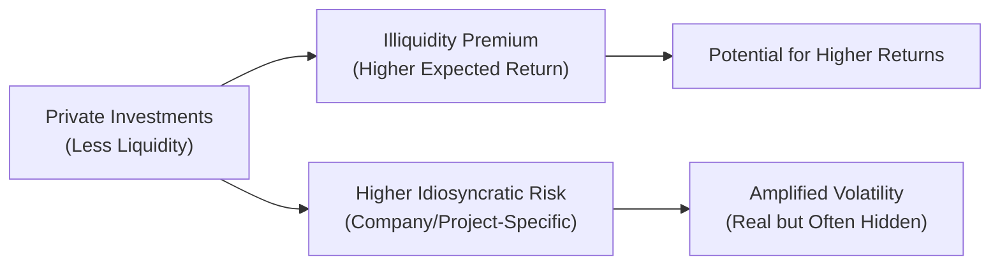

## Positioning Private Markets in the Broader Investment Universe
Imagine you’re chatting with a friend who’s put money into a startup and is excited to talk about doubling (maybe even tripling) that investment. You nod and think, “Well, that’s fantastic—until you realize you can’t get your cash out anytime soon.” That, in a nutshell, captures one of the biggest differences between private and public investments: liquidity. In public markets, you buy a share of Apple or a bond issued by a government, and you can probably sell it tomorrow. But in private markets—be it private equity, private debt, or real estate—you’re often in for a much longer ride.

Now, at the Level III stage, we want to refine these intuitions with more rigorous frameworks. Section 1.4 focuses—sometimes passionately—on why private markets carry higher idiosyncratic risk and less liquidity, but also offer potential for higher returns. It’s closely linked to the risk-return trade-off you learned in earlier levels, yet with a few twists like “illiquidity premiums” and project-specific vulnerabilities.

## Understanding the Illiquidity Premium
The illiquidity premium is the extra return that investors demand for putting their money into an investment they can’t exit easily. If you already brushed up on performance metrics in Section 1.3, you’ll remember how certain measures like IRR bear fruit only after waiting for multiple years. Indeed, private markets often require a multi-year horizon, even a decade or more in some cases. This waiting game typically translates into a premium—higher returns to reward patient capital.

### Where Does This Premium Come From?
• Restricted Access to Capital. Private investments don’t trade on an exchange. So if you need your money urgently, good luck. That’s why they’re called “private.”  
• Longer Holding Periods. A typical private equity or private real estate fund might last 7 to 10 years. Investors have to lock up capital for a very long time, which is fundamentally different from daily liquidity in public markets.  
• Valuation Complexities. Private assets aren’t priced daily. Without continuous price discovery, the opportunity cost (and uncertainty) of holding illiquid assets escalates.

From a purely theoretical angle, if you denote the required return on a private investment as Rᵢ, you can think of it like:

$$
R_i = R_{public} + \text{Illiquidity Premium} + \text{Other Risk Premia} 
$$

Where R₍public₎ might reflect something like a market-competitive return (e.g., an appropriate discount rate or a related public-market benchmark), and additional terms capture the extra sauce for illiquidity, idiosyncratic risk, or other complexities that public markets may not have in the same degree.

## Measuring the (Often Hidden) Idiosyncratic Risk
By “idiosyncratic,” we’re talking about risk that’s unique to an individual investment, such as a single real estate development project’s location or an early-stage startup’s particular technology. Unlike systematic risk (often proxied by market beta), idiosyncratic risk doesn’t get easily washed away in broad public equity or bond indexing strategies.

### Breaking Down Idiosyncratic Risk
• Company-Specific Risk. If you’re investing in a private equity buyout of a struggling widget manufacturer, your fate depends heavily on that single company’s success or failure.  
• Sector/Strategy Risk. Private real estate or infrastructure deals often hinge on local economic conditions or specific project feasibility.  
• Operational Improvements. Private investors frequently try to boost returns by implementing their own operational or strategic changes. That can be super effective—or super risky if it fails.

In public markets, idiosyncratic risk is typically minimized via diversification. But private deals are chunkier. They often require a sizable commitment in one or a small set of deals, making it harder to instantly diversify exposure.

## Leverage: A Double-Edged Sword
You’ve probably heard the phrase, “leverage can amplify returns.” True enough. But, it amplifies losses, too. Many private equity deals or real estate projects load up on debt to get higher equity returns. Yes, it’s exciting to see those returns multiply, but:

• Higher Leverage Ratio → Higher Sensitivity to Downturns. If a recession hits, a heavily leveraged company (or property) may have trouble servicing that debt.  
• Balance Between Debt and Equity. For instance, a 70/30 debt-to-equity ratio can be great in an expanding economy, but any sustained revenue slump can push the entire venture close to default.

Even so, a prudent approach to leverage can elevate returns in stable or growing market conditions. This is especially relevant in private markets, where managers often have creative (and sometimes aggressive) financing strategies. We’ll explore even more about how financing structures intersect with risk in Chapter 2 when discussing GP-LP dynamics and Chapter 4 when covering private debt in depth.

## The Market Beta of Private Investments
Market beta reflects an asset’s sensitivity to overall market movements. In public equities, you can measure beta daily by comparing a stock’s returns to a broad market index. In private markets, it’s trickier because:

• Valuations Are Periodic. Many funds report quarterly or even semi-annually. That lags real economic conditions, sometimes smoothing actual volatility.  
• Strategic Focus May Differ from Public Indices. A private equity fund specializing in, say, niche healthcare technologies might not correlate as much with the overall equity market.  
• Illusions of Low Volatility. Because private valuations aren’t updated daily, a naive correlation analysis might show lower measured volatility. But that doesn’t mean the underlying fundamentals are stable—just that you don’t see price fluctuations every day.

So it’s possible for private investments to exhibit a lower measured (or “reported”) beta, while holding much higher economic risk beneath the surface. This can create the impression they’re less tied to market gyrations. In reality, once you factor in the real economic drivers, the correlation could be more substantial—especially in times of crisis.

## Volatility: Actual vs. Reported
Public markets have continuous price discovery. Private markets, not so much. Some folks joke that “if you never look at the price, the volatility is zero.” But in real life, the variability in outcomes can be huge. With private investments:

1. Mark-to-Market Gaps. You only “see” a new valuation when the manager does an official re-appraisal or when there’s a financing event.  
2. Subjectivity in Appraisals. Real estate might be valued using comparables, discounted cash flow, or the ever-popular “this feels about right.”  
3. Smoothing Effect. Because valuations come less often, short-term fluctuations are masked, leading to artificially low volatility in reported returns.

Remember that from an economic standpoint, volatility is still there. It’s just not measured as frequently. That can mean a private fund’s time series of returns lulls you into believing the investment is less risky than it truly is.

## Persistence of Performance
One fascinating element in private markets is persistence. If a private equity manager launched a fund that strongly outperformed, there’s a reasonable chance their next fund might also beat peers—assuming the same team, strategy, and operational skill remain intact. Conversely, underperformers sometimes keep underperforming. This phenomenon has been well studied in academic work—much of it spurred by Kaplan and Schoar (2005).

### Why Does Persistence Occur?
• Manager Skill. Superior managers develop relationships, deal flow, and sector expertise that are hard for newcomers to replicate.  
• Limited Access. Top-quartile funds are often oversubscribed and might prefer established investors. So top-performing managers can cherry-pick the best investors, further stabilizing (or boosting) result streams.  
• Strategy Continuity. If a strategy works in one cycle, it may work in the next, barring huge macroeconomic or regulatory changes.

Be mindful, though, that no track record is invincible. A manager might deviate from their proven niche or face a drastically different macro climate.

## Macroeconomic Factors That Influence Private Market Returns
Private investments don’t exist in a bubble. Big picture stuff matters:  
• Interest Rates. Cheap credit can supercharge leveraged returns, but rising rates can choke them off.  
• Economic Growth. Buoyant consumption and corporate earnings feed valuations, while downturns can crush them.  
• Policy & Regulation. Corporate tax policy changes or sudden shifts in real estate zoning can flip your investment story overnight.

If you recall Section 1.5 on integrating private investments into Strategic Asset Allocation, the macro climate is a major determinant of how you position your private allocations relative to everything else in your portfolio.

## Practical Example: Distinguishing Private vs. Public Risk
Let’s run through a quick hypothetical. Suppose an institutional investor is comparing two options:

1. Purchasing a publicly traded utility company that yields a steady dividend.  
2. Investing in a private infrastructure project that builds wind farms receiving a locked-in “feed-in tariff” from the government for the next 20 years.

On paper, both are “utility or infrastructure” oriented. The public stock might reflect immediate market sentiment and shift daily with interest rates, investor mood, or sector fundamentals. Meanwhile, the private infrastructure project might appear stable due to its guaranteed offtake agreement. However:

• The public stock is super liquid. If you suddenly have a meltdown and need cash, you can exit tomorrow.  
• The wind farm’s illiquidity is significant; you might need months (or years) to sell your stake. But you’re potentially rewarded with a stable (maybe even outsized) return, courtesy of the illiquidity premium, government subsidies, and lower direct competition.

Which is riskier? It’s not a trivial question. The private project’s day-to-day price never gets posted, so it might look less volatile. But if the government changes energy policy or a new technology disrupts wind power, you might be stuck. The public stock, by contrast, reflects shifting sentiment minute by minute. Over a long horizon, though, either could turn out the winner, depending on operational execution, macro trends, and the complexities described above.

## Illustration via Mermaid Diagram
Below is a simple flowchart that shows the interplay between illiquidity, risk, and potential returns:

The main idea is that the lack of liquidity in private investments can yield a premium if all goes well, but the heightened idiosyncratic risk can also lead to bigger project-level surprises.

## Common Pitfalls and Best Practices
• Overestimating Diversification: Many new entrants to private markets assume that diversifying across multiple funds or deals is straightforward. In reality, the minimum investment thresholds in private deals can be quite large, restricting how easily you spread risk.  
• Misjudging Leverage Impact: Some managers rely heavily on debt. That can drastically reshape the risk profile, especially during economic downturns.  
• Underappreciating Reporting Lags: Because returns aren’t priced daily, you might think your private fund is outperforming or stable when it’s not.  
• Extrapolating Past Performance: Yes, performance persistence exists—but it’s not guaranteed. Even top-quartile managers can stumble when market conditions change.

Safeguards? Well, thorough due diligence (see Section 1.6 on post-investment monitoring and governance), carefully reading the fund’s documentation on its strategy, leverage usage, and potential gating provisions, plus having a healthy dose of skepticism.

## Exam Tips: What to Keep in Mind
At the Level III exam, analyzing the risk-return profile of private investments can be tested in both item set questions and essay-style scenarios. You might be asked to:  
• Compare a private investment’s expected return and volatility with a public benchmark.  
• Identify reasons for “smoothed” volatility in private asset returns.  
• Evaluate whether a certain private market fund’s past performance is likely to persist.  
• Discuss the role of leverage in shaping expected outcomes.  
• Calculate or interpret an illiquidity premium in a hypothetical scenario.

When writing essay answers, be concise. Link the concepts of illiquidity premium, idiosyncratic risk, and timing of cash flows. Also, watch out for any references to the manager’s track record and the macro environment, which frequently show up in real-world (and exam) vignettes.

## References and Further Reading
• Kaplan, Steven N., and Schoar, Antoinette. (2005). “Private Equity Performance: Returns, Persistence, and Capital Flows.” The Journal of Finance.  
• Ang, Andrew. (2014). “Asset Management: A Systematic Approach to Factor Investing.” Oxford University Press.  
• McKinsey & Company. (2021). “Private Markets Annual Review.”  

If you’re eager for more background on how private markets fit into strategic asset allocation, see Section 1.5. For discussions on private equity specifically, you can jump ahead to Chapter 3.  

## Test Your Knowledge: Risk-Return Relations in Private vs. Public Markets



### In private markets, the illiquidity premium primarily refers to:
- [ ] The fee paid by Limited Partners (LPs) to General Partners (GPs).
- [ ] The additional risk-bearing cost from daily volatility in private markets.
- [x] The extra return investors demand for locking up capital over long periods. 
- [ ] The spread between buying and selling partial fund interests.

> **Explanation:** The illiquidity premium is compensation for the inability to freely trade or redeem an investment in the short term.

### Which of the following best illustrates idiosyncratic risk in a private investment?
- [x] A catastrophic product failure in a single venture capital portfolio company.
- [ ] A global recession that lowers public market valuations globally.
- [ ] A rise in market-wide interest rates.
- [ ] Regulatory changes affecting all companies in an entire economy.

> **Explanation:** Idiosyncratic risk is unique to a specific project or investment, such as product failure. Broad economic or market-wide factors are considered systematic risks.

### Why might reported volatility be lower in a private equity fund compared to a public stock index?
- [x] Private funds have periodic or appraised valuation updates that can mask short-term fluctuations.
- [ ] Private companies never experience financial distress.
- [ ] Public markets always have higher risk-adjusted returns.
- [ ] Private equity funds are required to report valuations daily.

> **Explanation:** Private funds are typically valued quarterly, which can understate true volatility.

### Which statement best describes the concept of performance persistence in private equity funds?
- [ ] Underperformers almost always become top performers in subsequent funds.
- [x] Top-quartile managers often exhibit similar performance levels across consecutive funds.
- [ ] New managers regularly outperform established ones due to innovation.
- [ ] Performance is entirely random in private markets.

> **Explanation:** Studies show that top-performing managers can maintain a high level of performance in subsequent funds, partly due to their networks and expertise.

### When comparing a leveraged buyout target to an unleveraged private investment, what is most correct?
- [x] Leverage can enhance upside returns but also intensify downside losses.
- [ ] Leverage always decreases an investment’s idiosyncratic risk.
- [x] Future capital calls are never necessary once initial debt financing is established.
- [ ] Leverage has no effect on cash flow stability.

> **Explanation:** Leverage is a double-edged sword, amplifying both gains and losses.

### How does the lack of continuous price discovery in private markets affect perceived risk?
- [x] It can lead to artificially low observed price volatility.
- [ ] It eliminates all forms of systematic risk.
- [ ] It guarantees higher correlation with public market indices.
- [ ] It has no effect on performance measurement.

> **Explanation:** Because private asset prices are updated infrequently, the reported volatility is lower than the actual underlying risk would suggest.

### Which factor is least likely to increase the illiquidity premium demanded by private market investors?
- [ ] Longer lock-up periods.
- [x] Ability to redeem holdings daily without penalty.
- [ ] Complex valuation methods.
- [ ] Difficult exit strategies.

> **Explanation:** If investors can redeem holdings daily, the asset is not illiquid, so there would be no need for an illiquidity premium.

### What role does operational improvement typically play in private equity’s return generation?
- [x] Enhances a portfolio company’s efficiency and profitability, potentially increasing returns.
- [ ] Merely increases systematic risk without changing fundamentals.
- [ ] Functions only as a minor contributor relative to other factors like “market timing.”
- [ ] Lowers the value of the company by restricting revenue growth.

> **Explanation:** Private equity managers often add value by implementing operational or strategic improvements.

### If a real estate fund exhibits highly smoothed returns, which conclusion is most appropriate?
- [ ] The asset is genuinely risk-free.
- [x] The real volatility may be understated due to appraised valuations.
- [ ] The manager is likely overrated.
- [ ] The property is severely distressed.

> **Explanation:** “Smoothed” returns rarely reflect daily price changes; they can underestimate true volatility.

### True or False: Private market assets always exhibit a lower market beta than public assets.
- [x] True
- [ ] False

> **Explanation:** Due to infrequent pricing and narrower investor bases, private market assets often show a lower “reported” beta, although the true economic sensitivity can be higher than reported figures suggest.


