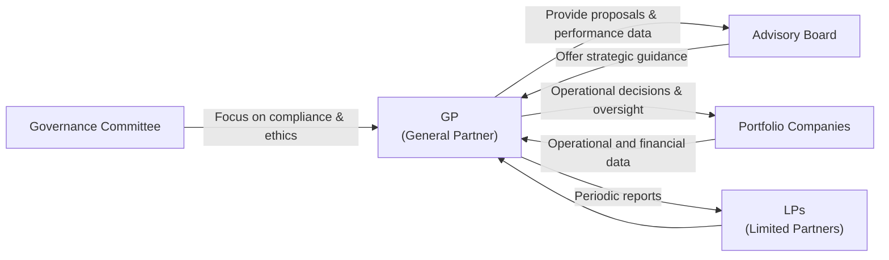

## Overview

Post‑investment monitoring and governance in private markets might sound like the boring side of private investing, often overshadowed by the flashy acquisitions or big headline exits. But, if I’m honest, this is truly where the rubber meets the road. Once you (the Limited Partner, or LP) or the manager (the General Partner, or GP) commit capital to a private asset—be it a leveraged buyout, an infrastructure project, or a real estate venture—the job is far from done. You need a robust system to ensure the investment stays on track, meets return expectations, and doesn’t generate any nasty surprises.

In private markets, transparency is more limited than in public companies subject to continuous reporting requirements. This is exactly why establishing structured—and sometimes stringent—monitoring and reporting processes is so critical. Monitoring isn’t just about preventing bad news; it’s about discovering opportunities to add value. A strong governance framework ensures that all parties—GPs, LPs, and any advisory boards—are well-aligned. Over time, that alignment can lead to better decisions, more growth, and (hopefully) higher returns on capital.

Below, we’ll break down the key elements of post‑investment monitoring and governance, how they work, and how they can create value for private market participants.

## Establishing a Robust Reporting and Monitoring Framework

If you think about it, consistently evaluating a portfolio over the entire holding period is like a regular medical check‑up. You wouldn’t skip every doctor’s appointment, right? In the same way, GPs and LPs must periodically check the “vitals” of their investments:

• Frequency of Reporting: Most private funds issue quarterly updates, accompanied by more comprehensive annual reporting. In some cases—especially if the fund invests in volatile or high‑risk assets—monthly or semi‑annual updates might be required. The point is to provide timely, relevant data that the LPs can analyze.

• Content of Reporting: Traditional metrics include the fund’s IRR (internal rate of return), MOIC (multiple on invested capital), and measures like TVPI (total value to paid-in) and DPI (distributed to paid-in). Operational KPIs (e.g., revenue growth, expense ratios, or occupancy rates in real estate) are also key. This allows LPs and advisory boards to see whether the investee companies (or assets) are meeting expectations.

• Standardization (IFRS/US GAAP): In global private markets, accounting standards vary. Many funds adhere to IFRS or US GAAP, which helps unify reporting and reduce confusion. A GP with multiple funds may produce a uniform set of statements that make cross‑fund comparisons easier for investors.

• Qualitative Updates: In addition to numbers, GPs should share relevant narratives—like new leadership hires, expansions into international markets, or even shifts in corporate strategy. These “soft” updates often give LPs a much better feel for a portfolio company’s direction and potential red flags.

Creating a robust framework ensures that information flows in a predictable manner and fosters trust. As an investor or as a fund sponsor, these updates help you “zoom in” on issues before they become unmanageable. Indeed, many GPs say it’s easier to tackle a small operational glitch today than a major meltdown tomorrow.

## Role of Advisory Boards and Governance Committees

You’ve likely heard of, or even served on, an Advisory Board at some point. Think of these boards as a steering committee that operates between the GP and the broader LP base. Advisory boards are not there to micromanage portfolio companies; rather, they offer strategic advice, mitigate conflicts of interest, and clarify any gray areas in the fund’s operation. This can be exceptionally helpful when a GP needs to extend the fund’s lifespan, sign off on a major related‑party transaction, or manage a complex exit.

Many funds also create a Governance Committee, often a subset of the advisory board (or a distinct body) specially focused on ethical and stewardship standards. This group ensures that the fund’s actions align with relevant regulations, the fund’s governing documents, and the overall best interests of investors. In recent years, as ESG has become more critical, governance committees have played a growing role in vetting green initiatives, monitoring carbon footprints, and ensuring compliance with new environmental policies.

Below is a simple (though hopefully insightful) diagram illustrating how GPs, LPs, Advisory Boards, Governance Committees, and portfolio companies might all interact:

This structure helps ensure a system of checks and balances. The GP runs the day-to-day operations and investments; the advisory board weighs in on strategic, conflict-laden, or extraordinary matters; and the governance committee checks that everything is in line with the fund’s mandate, the letter of the law, and best practices.

## Unusual Events and Escalation Protocols

We all know life can throw a curveball. You might figure out the perfect capital structure and growth path, only to be hit by a macro shock—say, a global pandemic—that rattles entire industries. Or perhaps there’s a leadership crisis at one of the portfolio companies.

Monitoring frameworks should include escalation protocols. Put simply, “When do we pick up the phone?” For instance:

• Financial Distress: If a portfolio company is running dangerously low on cash or has tripped a covenant, the GP might immediately alert the advisory board, convene an extraordinary meeting, and consider a follow-on investment or a restructuring.

• Major Leadership Changes: Consider a scenario where the CEO departs suddenly. Maybe the CFO resigns, too. This might require the GP to call an urgent meeting, share transition plans, and possibly rework financial forecasts.

• Macro Shocks: COVID-19 was a sobering reminder that entire industries (for example, travel and hospitality) can collapse almost overnight. In these scenarios, frequent reviews and deeper operational scrutiny become the norm until conditions stabilize.

These unusual events often create opportunities as well as risks. Private funds with strong governance structures can respond swiftly—injecting new equity, pivoting the company’s strategy, or re-prioritizing capital expenditures. Investors who merely “set it and forget it” may find themselves on the losing end of the equation.

## Board Representation, Protective Covenants, and Veto Rights

In private equity and private credit contexts, GPs and LPs regularly employ several mechanisms—yes, sometimes annoyingly legalistic—to protect their interests:

• Board Representation: Taking a seat (or appointing an observer) on the board of the investee company can be a direct way to monitor strategic and operational decisions. This is especially common in buyout, growth equity, and venture capital deals.

• Protective Covenants: These are contractual provisions limiting or restricting certain actions by the investee—like taking on additional debt, selling assets, or changing key management—without investor approval. In private debt, a covenant might require the borrower to maintain a specific leverage ratio or interest coverage ratio.

• Veto Rights: In some deals, investors can veto major decisions (acquisitions, capital restructurings, etc.). While a veto might sound heavy-handed, it’s part of ensuring that the GP or majority owner doesn’t do anything that drastically alters the original risk profile.

These terms can be a real thorn in the side if you’re unprepared. But, if used judiciously, they form an essential “protective net.” In my own experience, a well-timed veto can keep a company from, say, acquiring a far-flung competitor it isn’t ready to integrate, or from paying out a massive dividend at the expense of working capital.

## Monitoring as a Path to Identifying Follow‑On Investments, Recapitalizations, and Expansions

Next, let’s talk about the positive side—monitoring can help you find new ways to grow. You might see strong traction in a portfolio company’s new product line. So, you suggest additional capital for expansion or R&D. Alternatively, you might discover that a company could benefit from a recapitalization, lowering its overall cost of capital.

Follow-on investments are quite common in venture capital. After seeing early results, you might double down on the winners, where you already have solid relationships with management. By staying in close contact with the company’s financial and operational data, it’s easier to gauge how well your additional capital might be used.

Or consider real estate: you might discover that rental incomes for a multi-family property are well above market comps. That might be your sign to propose an expansion or enhance property amenities (like installing solar panels for an ESG-friendly angle). Effective monitoring ensures that you don’t miss these golden opportunities.

## Practical Example: Monitoring IRR Changes with Follow-On Investments

Here’s a small numeric illustration to see how a follow-on investment might affect IRR calculations—a key gauge for many private equity and venture capital funds.

Suppose a GP invests $10 million in a startup. After three years, the value of the holdings grows to $15 million. The GP sees strong momentum and invests an additional $5 million in Year 3, bringing the total basis to $15 million. By Year 5, the entire stake is sold for $40 million. We can sketch out a simplified IRR timeline:

• Year 0: –$10 million (initial investment)  
• Year 3: –$5 million (follow-on)  
• Year 5: +$40 million (exit)

Using IRR formulas (or a quick IRR function in a spreadsheet), you might find the IRR is quite attractive, but it’s different from the IRR you’d have had without the $5 million follow-on. Having accurate, real-time data about that startup’s growth potential is what gives you the confidence to invest those incremental funds. Without robust monitoring—and real-time or quarterly operational updates—you might completely miss such an opportunity.

A simplified IRR equation can be shown in KaTeX as:


\sum_{t=0}^{T} \frac{C_t}{(1 + r)^{t}} = 0


where \\(C_t\\) is the net cash flow at time \\(t\\), and \\(r\\) is the IRR. Monitoring helps you estimate future cash flows and decide if that \\(\text{follow-on}\\) infusion is likely to provide a strong incremental return.

## Case Study: A “Tiger Team” for Turnaround

Imagine a mid-sized buyout fund invests in a manufacturing company that supplies parts to automotive OEMs. One year in, the auto industry hits a downturn. Demand plummets; the company triggers a debt covenant. Rather than panic, the GP calls a meeting with the advisory board:

• They form a “tiger team” to assess the problem—speaking with top management, reviewing real-time sales data, and analyzing potential new markets (e.g., electric vehicle components).  
• The governance committee is brought in, not because there’s an ethical breach, but to ensure that any drastic operational changes align with the fund’s overall mission.  
• The board decides on a modest follow-on investment to finance a pivot, while also renegotiating covenants with the original lenders.

Through proactive monitoring, the fund avoids a default scenario, and the investee emerges stronger—ultimately generating a respectable exit valuation. This story shows that good monitoring is not just about passively collecting data; it’s about actively using that data to steer the ship.

## Best Practices and Common Pitfalls

• Best Practices:  
  – Regular Communication: Share not just the quantitative data but also candid insights.  
  – Embrace Technology: Many GPs now use dedicated software platforms for analytics and portfolio monitoring.  
  – Early Warning Indicators: Keep an eye on net leverage, monthly revenue trends, staff turnover, or other forward-looking metrics.  
  – Thorough Documentation: Changes in capital structure, major decisions, or covenant waivers should be meticulously documented.

• Common Pitfalls:  
  – Over‑Reliance on Rearview Mirror: Historical financials are important, but by the time you see poor results in the official statements, it might be too late to intervene.  
  – Poorly Defined Roles: If the governance committee, advisory board, or GP have overlapping mandates, confusion can breed inertia.  
  – Absence of Contingency Plans: Surprises happen, and if your monitoring framework doesn’t specify escalation steps, you’ll waste valuable time deciding how to respond under pressure.  
  – Information Overload: More data is not always better. Aim for “meaningful” data points that reflect the health and direction of the underlying investment.

## ESG Integration and Governance

Increasingly, monitoring extends beyond mere financial metrics to also include environmental, social, and governance (ESG) factors. Investors, especially large institutions and those in Europe, frequently demand robust ESG reporting. This might include:

• Carbon Footprint: The portfolio company’s emissions or energy consumption trends.  
• Social Impact: Employee well‑being, inclusion, or broad community considerations.  
• Governance: Board diversity and conflict‑of‑interest policies.

Governance committees often take on these ESG assessments, ensuring that portfolio companies are in compliance with relevant regulations (like the EU Sustainable Finance Disclosure Regulation), while also aligning with the social and environmental values that many LPs now champion.

## Exam Relevance and Tips

In the CFA® Level III exam (especially when discussing private markets), you may encounter scenario-based questions that test your ability to:

• Recommend appropriate governance structures based on a fund’s strategy or the capital structure of a portfolio company.  
• Identify the key metrics that should be included in a post‑investment monitoring report.  
• Determine how a GP might respond to a distressed portfolio investment and propose follow-on investments or re-cap strategies.  
• Evaluate whether certain protective covenants or veto rights are necessary given an investment’s risk profile.  
• Suggest enhancements to existing advisory boards or governance committees in hypothetical case studies.

Be prepared to apply conceptual knowledge to real-world situations—like a question describing a leadership crisis or a missed interest payment—and then propose what escalation protocol or governance mechanism should be triggered.

A straightforward tip: carefully review the relationships between IRR, MOIC, and time horizon in the context of ongoing monitoring. In exam questions, subtle changes (like an early partial exit or a bridging facility) can have a significant effect on these metrics. 

## References and Further Reading

• Jensen, Michael C. (1989). “Eclipse of the Public Corporation.” Harvard Business Review.  
• Lerner, Josh., Hardymon, Felda, and Leamon, Ann. (2012). “Venture Capital and Private Equity: A Casebook.” John Wiley & Sons.  
• European Investment Fund (EIF). (2019). “Private Equity Monitoring and Governance Handbook.”  
• CFA Institute. (most recent). CFA Institute Code of Ethics and Standards of Professional Conduct.  
• IFRS Foundation. (Standards IFRS 7, IFRS 9, IFRS 10), for guidelines on financial reporting and consolidation.

-------------------------------------

## Test Your Knowledge: Post‑Investment Monitoring and Governance Essentials



### Which of the following is a key reason why robust monitoring is essential in private market investments?

- [x] To proactively identify problems and opportunities before they become unmanageable.
- [ ] To eliminate the need for follow-on investments.
- [ ] To avoid having to issue fund reports.
- [ ] To reduce the amount of regulatory oversight by eliminating compliance concerns.

> **Explanation:** Timely and regular monitoring allows GPs and LPs to identify both red flags and potential upside opportunities early, leading to better-informed decision-making and interventions.

### An advisory board primarily:

- [ ] Manages the day-to-day operations of the GP.
- [ ] Replaces the GP’s role in controlling investments.
- [x] Provides oversight, resolves conflicts, and advises on strategic or extraordinary matters.
- [ ] Audits the private fund’s financial statements.

> **Explanation:** Advisory boards do not run daily operations. Instead, they serve as a check-and-balance mechanism for major decisions, conflicts of interest, and strategic moves.

### Which of the following practices is recommended for an effective reporting framework?

- [x] Providing both quantitative metrics (IRR, MOIC) and qualitative updates.
- [ ] Using unstructured, ad-hoc spreadsheets for data sharing.
- [ ] Relying solely on annual financials without interim updates.
- [ ] Eliminating references to IFRS or US GAAP standards.

> **Explanation:** Comprehensive reporting includes key performance metrics and narratives about leadership or operational changes. Standardized accounting references make comparisons more reliable.

### In scenarios of financial distress for a portfolio company, a well-structured governance framework typically:

- [ ] Delays taking any action until the next formal annual meeting.
- [x] Allows for escalation protocols, such as calling an extraordinary advisory board meeting.
- [ ] Eliminates the need for follow-on funding or rescue financing.
- [ ] Immediately dissolves the investment.

> **Explanation:** Having clear escalation paths is crucial; the advisory board and governance committees may convene emergency sessions to consider workouts, additional capital, or restructuring options.

### Protective covenants in private market investments typically:

- [x] Restrict or limit certain actions by the investee company.
- [ ] Charter new products and revenue streams for the company.
- [x] Help ensure specific financial ratios or conditions are maintained.
- [ ] Automatically extend the life of the fund by multiple years.

> **Explanation:** Protective covenants are clauses that restrict a company’s actions—for instance, taking on excessive debt or making certain acquisitions. They can also require the firm to maintain certain financial ratios.

### Board representation is best described as:

- [x] A method for investors to monitor and influence major operational decisions.
- [ ] Replacing the CEO or CFO of the company with a board member.
- [ ] A regulatory requirement in all private market deals.
- [ ] An optional courtesy extended only to minority stakeholders.

> **Explanation:** Securing a seat (or observer rights) on the board allows investors to stay informed and vote on high-level strategic and operational decisions.

### If a GP notices that real-time data shows revenue significantly surpassing forecasts, one likely outcome is:

- [x] The GP may propose a follow-on investment to scale up operations.
- [ ] The GP will ignore the data to avoid over-investing.
- [x] The GP may consider accelerating the timeline for exit with a higher valuation.
- [ ] The GP will automatically veto any expansion to maintain existing ratios.

> **Explanation:** Positive surprises in revenue can spur additional funding for expansion or accelerate exit plans to lock in higher valuations, subject to alignment with overall fund strategy.

### Which of the following is a common pitfall in post-investment monitoring?

- [ ] Employing standardized IFRS or US GAAP statements.
- [x] Relying heavily on historical financials while ignoring leading indicators.
- [ ] Setting early-warning indicators for covenant breaches.
- [ ] Sharing both quantitative and qualitative updates with LPs.

> **Explanation:** Over-reliance on historical information can delay interventions; effective monitoring also focuses on forward-looking data and early-warning triggers.

### ESG considerations in private investments are increasingly important because:

- [x] Investors are demanding robust environmental and social reporting.
- [ ] They only matter if the fund is based in the EU.
- [ ] ESG factors have no impact on a company’s financial performance.
- [ ] They are optional and rarely implemented in modern private funds.

> **Explanation:** ESG integration is becoming mainstream as LPs, regulators, and broader stakeholders push for alignment with sustainability and responsible business practices.

### True or False: A governance committee typically has a specialized focus on ethical standards, compliance, and adherence to the fund’s mandate, separate from day-to-day investment decisions.

- [x] True
- [ ] False

> **Explanation:** Governance committees typically operate alongside or within an advisory board to ensure the fund meets professional standards, adheres to regulations, and maintains alignment with ethical guidelines.


