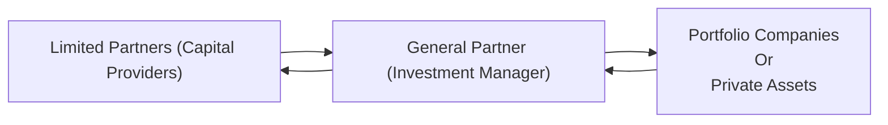
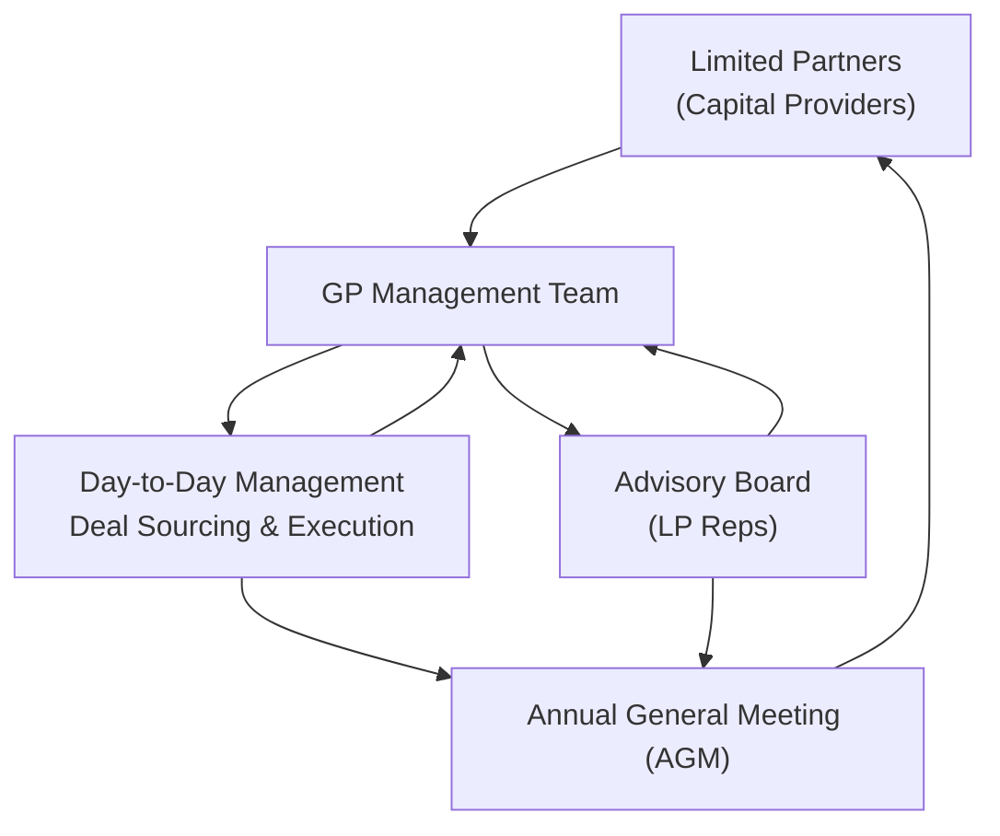

## Introduction

Well, let me tell you a quick story. I was once chatting with a friend who had just started working at a venture capital firm. She kept talking about “LPs” and “GPs,” and I remember thinking, “Wait—aren’t those just fancy abbreviations for the same group of people?” Nope. Not even close. If you’ve ever been curious about how private investment funds actually operate behind the scenes, the difference between General Partners (GPs) and Limited Partners (LPs) is key. These two types of partners are at the heart of private market investing.

GPs manage the fund’s daily operations, identify potential investments, and (hopefully) grow them into successful exits. LPs provide the capital to make all that possible. But, because the LPs must trust the GP to make the best decisions, a system of oversight, fiduciary duties, and structured communication ensures the GP is acting in the fund’s best interest. Let’s dive into those roles, responsibilities, and interactions—along with a few real-world considerations and best practices.

## Overview of the GP-LP Relationship

A private investment fund is generally structured as a limited partnership. At the center of it:

• The GP: This is your “quarterback,” directing the investment strategy and making decisions about where the fund’s money goes.  
• The LPs: These are your “team owners,” contributing the capital and trusting the GP to handle the day-to-day management.

The Limited Partnership Agreement (LPA) governs this relationship. It spells out each party’s rights and obligations, detailing how decisions get made, fees get calculated, and returns get distributed.

Below is a simple visual to help illustrate the flow between GPs, LPs, and investments:

• LPs commit capital to the fund (A → B).  
• The GP invests that capital in portfolio companies or assets (B → C).  
• Value is created and eventually returned to the LPs (C → B → A).

This relationship aims to align incentives. LPs want attractive, risk-adjusted returns; GPs want to demonstrate strong performance and earn carried interest on successful deals. But it’s not always smooth sailing, so systematic checks and governance structures are crucial.

## The General Partner’s Role and Responsibilities

### Identifying Investment Opportunities

GPs scout the market for opportunities based on the agreed investment mandate. They target those opportunities that match the fund’s strategy—whether it’s venture capital for early-stage startups, buyouts of mature companies, or real estate development.

• Market Sourcing: GPs maintain extensive networks, leveraging industry experts, bankers, or co-investors to find potential deals.  
• Due Diligence: Once an opportunity is identified, GPs dive into business models, historical financials, and growth projections. Returns hinge on thorough due diligence.

### Execution and Monitoring

After finding and approving deals (hopefully good ones), GPs ensure that:

• Legal Documents and Structuring: The GP negotiates deal terms, often with lawyers, to finalize purchase or investment agreements.  
• Value Creation Initiatives: For private equity, that might mean repositioning a company, optimizing operations, or adding value through strategic hires.  
• Ongoing Oversight: GPs track each portfolio company’s performance through board participation or regular management meetings. They adjust strategy when needed.

### Capital Calls and Fund Management

GPs issue capital calls to LPs as needed. You could think of it as the GP saying, “Hey, we found a terrific investment. Time to send in 10% of your committed capital.” GPs manage the timing of these calls carefully to avoid idle capital and to ensure enough liquidity for deals on the horizon.

### Fiduciary Duty and Alignment of Interests

GPs have a fiduciary duty to act in the fund’s best interest. This includes:

• Duty of Care: Making careful, well-researched decisions.  
• Duty of Loyalty: Avoiding conflicts of interest and self-dealing.  
• Duty of Good Faith: Acting honestly, transparently, and in line with the LPA.

Violating these duties can result in reputational harm and potential legal action. Because the private market environment is built on long-term relationships, trust is everything. GPs who fail to uphold these duties can find it difficult to raise future funds.

## The Limited Partner’s Role and Responsibilities

### Capital Provision

LPs commit the majority of the fund’s capital. Common LP types include pension funds, endowments, sovereign wealth funds, insurance companies, funds of funds, family offices, and sometimes high-net-worth individuals.

• Commitment Period: LPs pledge capital that can be drawn over a specific time window, typically the fund’s investment horizon.  
• Liquidity Planning: Because GPs can call capital at any time within the commitment period, LPs must plan to meet these calls without jeopardizing their cash flow needs elsewhere.

### Limited Liability and Governance Participation

By definition, LPs are passive investors. They have limited liability—only risking their committed capital—but also limited decision-making authority in day-to-day operations. Instead, their governance role includes:

• Advisory Boards: Some LP representatives may be part of a small advisory board that reviews conflicts of interest, valuation policies, or any deviation from the stated strategy.  
• Annual General Meetings: LPs get updates on portfolio performance, realized exits, pipeline deals, and any changes in market conditions that affect the fund.  
• Voting on Major Actions: LPs may have voting rights over significant matters such as extending the fund’s life, replacing the GP in extreme cases, or approving changes to the investment strategy.

### Oversight and Monitoring

It’s not that LPs have zero control, but it is intentionally limited. To stay informed, LPs typically receive:

• Quarterly and Annual Reports: These contain high-level performance data, portfolio updates, and net asset value calculations.  
• Audited Financial Statements: Annual audits offer independent verification of fund assets.  
• Special Notices: In some cases—like a major event at a portfolio company—a GP may provide additional disclosures or call an interim meeting.

## Key Interactions and Communication Channels

### Capital Calls and Distributions

The GP notifies LPs when it’s time to wire capital to finance an investment or pay off fund expenses. Conversely, when portfolio investments are sold, the proceeds (minus fees and carry) flow back to the LPs. Once a successful exit occurs, you hope to get that sweet distribution check (or wire deposit) in your account.

### Advisory Boards

An advisory board typically deals with:

• Reviewing and Approving Certain Transactions: For example, if the fund wants to invest in a company owned by the GP’s relative, that’s a conflict-of-interest scenario needing oversight.  
• Valuation Practices: The board might offer guidance or sign off on the GP’s valuation methodologies for portfolio companies.  
• Guidance on Strategic Shifts: If market conditions change drastically, the GP may consult the board on whether a pivot in strategy is warranted.

### Annual General Meetings (AGMs)

At the AGM, the GP showcases:

• Health of the Portfolio: Are investments on track? Underperforming?  
• Market Perspective: Any macro or sector-specific trends that could positively or negatively impact portfolio companies?  
• Pipeline of Opportunities: Future deals they’re pursuing, or why they’re passing on certain ones.  
• Future Outlook: Discussion on potential exit routes, upcoming distributions, or investment challenges.

AGMs also foster transparency, helping to build confidence among LPs who might be deciding whether to commit to the GP’s next fund.

## Legal and Regulatory Considerations

### Limited Partnership Agreement (LPA)

The LPA is the go-to document that sets the rules. It spells out:

• Investment Mandate and Restrictions  
• Fee Structure (Management Fee, Carried Interest, Hurdle Rates)  
• Distribution Waterfall (How returns are allocated between the GP and LPs)  
• Fund Governance Mechanisms (Including potential GP removal)  
• Fund Life Cycle (Committed period, investment period, extension options)

### Jurisdictional Variations

Regulations covering private funds can vary quite a bit depending on whether the fund is domiciled in, say, Delaware (U.S.), the Cayman Islands, Luxembourg, or elsewhere. Often, these locales provide favorable legal frameworks for private funds, but they still require:

• Basic Investor Protections  
• Reporting Standards  
• Anti-money laundering and Know-Your-Customer compliance

### Fiduciary and Reporting Obligations

Regulatory bodies such as the U.S. Securities and Exchange Commission (SEC) in the U.S. might require:

• Form ADV Filings & Other Disclosures  
• Performance Reporting under GAAP or IFRS  
• Compliance Procedures for Portfolio Valuation

For instance, the Institutional Limited Partners Association (ILPA) provides widely recognized guidelines for best practices, emphasizing transparency and alignment between GPs and LPs.

## Co-Investments: A Rising Trend

In some situations, particularly larger deals, the GP might offer certain LPs a chance to invest directly alongside the primary fund. Known as co-investments, they can serve as a “win-win” for both sides:

• LP Perspective: Co-investments often come with reduced or no additional management fees or carried interest. If you’re an LP with an appetite for a bigger stake in a particular deal, this can be quite attractive.  
• GP Perspective: Co-investments help secure more capital for larger deals or new initiatives, and it can deepen relationships with key LPs.

Still, co-investments can alter portfolio concentration risk, so GPs need to carefully balance how these opportunities are structured.

## Common Pitfalls and Challenges

### Misalignment of Interests

If the GP is motivated by short-term gains—perhaps to secure carried interest on early exits—there can be tension with LPs who want to maximize long-term returns. It’s important to have well-crafted fee structures and waterfall provisions in place to keep everyone’s eyes on the same prize.

### Limited Transparency

Sometimes, GPs may be reluctant to share full details of investments or valuations (especially if a portfolio company is struggling). This can leave LPs feeling uneasy and opens the door for trust issues. A robust reporting framework can help mitigate these tensions.

### Conflicts of Interest

Complications arise when the GP has multiple funds investing in overlapping deals, or if the GP invests personally in companies that are also in the fund’s pipeline. Advisory boards aim to address such conflicts, but it’s best to have them spelled out in the LPA.

## Best Practices to Enhance the GP-LP Relationship

• Thorough Due Diligence on Both Sides: LPs should evaluate the GP’s track record and alignment with their own risk tolerance. GPs target LPs whose investing horizons and objectives match the fund’s strategy.  
• Clear and Consistent Communication: GPs that maintain trust-worthy relationships with LPs often provide meaningful quarterly updates beyond superficial numbers.  
• Effective Advisory Boards: Fresh perspectives on valuation and strategy can keep the GP in check while giving the LP community a sense of comfort.  
• Aligned Compensation Structures: Fee and carried interest arrangements that incentivize genuine value creation—rather than short-term wins—are essential.

## Diagram: Governance Flow in a Typical Limited Partnership

• The GP (B) manages the fund, sourcing deals and monitoring investments (C).  
• The advisory board (D) may review conflicts and major decisions.  
• Information flows back to the LPs (A) primarily through the AGM (E) and reporting documentation.

## Exam Relevance and Tips

In the CFA® Level III exam context, especially under the Private Markets pathway, you might see scenario-based questions requiring you to:

• Evaluate whether the GP complied with fiduciary duties.  
• Identify potential misalignments or conflicts of interest.  
• Make recommendations on appropriate governance structures or communication policies (advisory boards, distribution waterfalls, etc.).  
• Assess the impact of co-investments on the risk profile of the fund.  

It’s always a good idea to remember the fundamental principle: GPs owe a fiduciary duty to LPs. If you’re asked to spot unethical behavior, that’s a big red flag. Also, be sure to connect the dots between the real-world mechanics (capital calls, distributions, co-investments) and the overarching strategic goals (align interests, foster transparency).

During constructed-response questions, tackle any part that references the LPA or that deals with measuring fund performance using IRR, MOIC, or other metrics. Understand that performance measurement is closely tied to how and when capital is called and returned. Demonstrate not just the formula but also your ability to interpret the results in a multi-year, real-world setting.

## References and Further Reading

• Gilligan, J., & Wright, M. (2020). “Private Equity Demystified” (3rd ed.). London: ICAEW Publishing.  
• Institutional Limited Partners Association (ILPA): https://ilpa.org/  
• Metrick, A., & Yasuda, A. (2011). “Venture Capital and the Finance of Innovation.”

--------------------------------------------------------------------------------

## GP and LP Roles: Test Your Knowledge



### Which statement best describes the fundamental distinction between GPs and LPs in a private investment fund structure?

- [ ] LPs manage daily operations, while GPs provide capital.
- [x] GPs execute investment decisions, while LPs primarily supply the capital.
- [ ] Both GPs and LPs have equal decision-making authority.
- [ ] GPs and LPs share operational duties equally during the commitment period.

> **Explanation:** GPs oversee the fund’s daily operations and investment decisions; LPs provide the majority of the capital but typically do not participate in day-to-day management.

### Which of the following best characterizes the oversight role LPs have in a typical private investment fund?

- [ ] LPs appoint senior management for each portfolio company.
- [x] LPs observe fund compliance and governance mainly through advisory boards and reporting.
- [ ] LPs negotiate terms of each acquisition or capital injection directly.
- [ ] LPs micromanage the GP and frequently overrule major decisions.

> **Explanation:** LPs play a mostly hands-off role but can provide oversight via advisory boards, monitor fund performance through reports, and vote on limited matters like GP replacement or material changes in strategy.

### A GP is experiencing potential conflicts of interest between two funds it manages. Which mechanism is most commonly used to handle such issues?

- [x] Consulting the advisory board composed of LP representatives.
- [ ] Replacing the GP immediately without notice.
- [ ] Filing a lawsuit against the GP.
- [ ] Terminating the fund and selling all portfolio assets immediately.

> **Explanation:** Advisory boards, often made up of LP representatives, are designed to review and resolve conflicts of interest in an orderly manner before drastic steps such as GP removal or fund termination are considered.

### In a scenario where the GP decides to deviate from the initially agreed investment strategy, what is the primary recourse for LPs?

- [ ] LPs must always comply with the GP’s decisions.
- [ ] LPs can veto any changes unilaterally.
- [x] LPs can vote on major strategy changes or consult the advisory board to ensure alignment with the LPA.
- [ ] LPs have no rights or influence on changes to the investment strategy.

> **Explanation:** Significant changes to the investment strategy typically must be approved by the LPs or at least reviewed by the advisory board. The LPA outlines conditions under which strategy changes can be made.

### Which of the following statements about co-investments is true?

- [ ] They allow GPs to bypass advisory boards entirely.
- [x] They enable LPs to invest alongside the main fund, often at reduced or no additional fees.
- [ ] They remove the GP’s fiduciary responsibilities on the co-invested portion.
- [ ] They are always mandatory for every LP in the fund.

> **Explanation:** Co-investments allow LPs to directly participate in a particular deal with the GP, and they typically come with reduced or eliminated additional fees, benefiting both parties when structured properly.

### What is the rationale for having limited liability for LPs in private funds?

- [x] It encourages broader participation by institutional investors who do not want day-to-day operational risk.
- [ ] It ensures LPs can only invest in leveraged buyout transactions.
- [ ] It guarantees zero risk of capital loss for LPs.
- [ ] It makes the GP entirely responsible for the fund’s performance shortfalls.

> **Explanation:** Limited liability means LPs risk only the capital they contribute. It encourages investment by protecting LPs from additional legal or financial exposure beyond their committed capital.

### In which situation would an LP typically have the right to remove a GP?

- [ ] The GP misses a single reporting date by one day.
- [x] The GP consistently breaches fiduciary duties or is found guilty of gross negligence or fraud.
- [ ] The fund underperforms for one quarter.
- [ ] LPs want to reallocate capital to another fund for convenience.

> **Explanation:** While each LPA outlines the specific conditions, removal of the GP usually requires a severe breach of contract or misconduct, such as fraud or gross negligence. Underperformance alone is generally insufficient.

### A GP calls capital from LPs much later than expected in an attempt to time the market. Which LP concern could arise from this strategy?

- [ ] LPs are happy about not deploying their capital earlier.
- [ ] LPs can invest the called capital elsewhere with no obligations to the fund.
- [ ] LPs have more control over GP decisions.
- [x] LPs face uncertainty in cash flow planning and might need to set aside capital for an unknown timing of calls.

> **Explanation:** Unpredictable capital calls can complicate LPs’ liquidity management. They must be ready to supply capital whenever the GP demands it, which can disrupt other investment plans.

### From an LP perspective, which of the following is a major benefit of participating in the advisory board?

- [ ] A guaranteed seat on every portfolio company’s board.
- [x] The ability to provide input on valuations, conflicts of interest, and certain material decisions.
- [ ] Full control over daily decision-making in the fund.
- [ ] Reducing capital contributions to the fund by half.

> **Explanation:** Advisory board participation gives LPs a more hands-on role in monitoring and guiding the GP on critical matters, though it does not grant full operational control.

### Is the GP obligated to act in the fund’s best interest at all times?

- [x] True
- [ ] False

> **Explanation:** Under fiduciary duties such as loyalty, good faith, and care, GPs must always act in the best interest of the fund, placing LP interests over personal gains.


