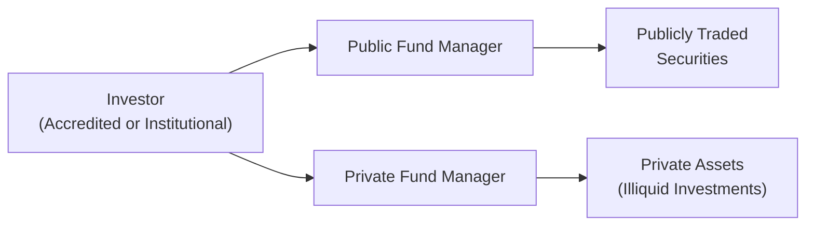

## Introduction
Imagine you’re catching up with an old friend who’s been dabbling in both private equity funds and public mutual funds. They start describing all the different processes, risk profiles, and return expectations of these two worlds. If you’re like me, you might be thinking: “Wait, they both invest money on behalf of clients—so how different could it really be?” Well, trust me, they’re more different than you’d expect. In this section, we’ll unravel key distinctions between private and public fund managers. We’ll talk about how they operate under different timelines, structures, skill sets, compensation models, and regulatory regimes. By the end, you’ll see why that friend of yours might be equally excited (and maybe a bit stressed) running both a private equity fund and a public mutual fund.

## Longer Holding Periods vs. Frequent Market Pricing

### Investment Time Horizons
• Private fund managers, often referred to as General Partners (GPs), typically aim for illiquid, longer-term investments. Think about private equity buyouts, growth equity deals, or real estate properties. The holding period can be five, seven, or even ten years. They’re not rushing to sell because the entire strategy hinges on improving or repositioning the underlying assets.  
• Public fund managers deal primarily in liquid instruments—public equities, exchange-traded fixed-income instruments, or possibly derivatives tracking these markets. Their investment horizon might still be “long” in a theoretical sense, but they face daily public market pricing and far greater liquidity. Whether they hold a position for days or months, the daily (or intraday) fluctuations are relentless.

Let’s say you’re a private equity manager investing in a small but growing manufacturing business. You might need several years to revamp the supply chain, improve operations, and negotiate better distribution channels. Meanwhile, a public equity fund manager looking at a large, widely held industrial corporation can enter and exit that position relatively quickly if market conditions seem unfavorable.

### Liquidity Implications
The difference in time horizon also drives differences in liquidity risk. Private managers maintain positions in assets that can’t be easily sold. If economic conditions worsen or if a portfolio company’s turnaround takes longer than planned, the manager can’t simply click “sell.” It’s more like a “lock the door and keep working” scenario. By contrast, managers of public funds have the luxury (and sometimes the curse) of daily liquidity: they can adjust positions relatively quickly but face the risk of investor redemptions if market sentiment turns sour.

## Fee Structures
There’s an enormous difference in compensation models:

### Private Fund Compensation
• Private managers (GPs) typically earn two layers of fees:
  1. Management Fee: Often 1%–2% of committed or invested capital.  
  2. Carried Interest (Performance Fee): A share of profits (often around 20%) once returns exceed a specified hurdle rate.

From a formula standpoint, carried interest can be expressed simply as:

$$
\text{Carried Interest} = \bigl(\text{Total Profits} - \text{Preferred Return Threshold}\bigr) \times \text{Carry Percentage}
$$

This arrangement aligns private fund managers’ incentives with the fund’s long-term success. If the fund fails to surpass the hurdle, the GP typically earns no carry, though they will still earn the base management fee.

### Public Fund Compensation
• Public managers often rely mostly on an annual management fee: something like 0.5%–2% of the fund’s assets under management (AUM).  
• Performance-based fees do exist in some hedge funds or specialized mutual funds, but they tend to be more heavily regulated and less common than in private vehicles. Retail mutual funds, for instance, rarely feature the “20% carry” structure that’s practically a fixture of private equity.

## Skill Sets and Operational Focus

### Deal Sourcing and Due Diligence
Private fund managers tend to have specialized networks to source deals—whether they’re controlling buyouts, venture capital invests, or structured debt. They’re not just analyzing share price movements; they’re negotiating one-on-one with business owners, visiting factories, talking to potential customers, and sometimes diving in to handle strategic pivots.

Public fund managers, on the other hand, focus on market-based research. They capitalize on publicly available information, earnings releases, and macroeconomic trends to gauge how a company’s shares might be priced in the market. Anyone can buy or sell these shares with the click of a button, so the emphasis is on timely market analysis, broad diversification strategies, or developing a targeted approach such as growth or value investing.

### Hands-On Management vs. Market Analysis
In private equity, the fund manager might literally help hire a new CFO or push for product redesign. Taking an active role in governance and corporate decisions is part of the job. In public markets, it’s usually more about evaluating management from the outside. Public managers may engage in shareholder activism, but this typically represents a minority of public market strategies.

I vividly recall working with a private equity team that discovered the portfolio company’s IT infrastructure was severely outdated. They allocated capital, brought in new leadership, and guided the entire process for about two years. Results soared, and eventually, the company was sold at a premium. That kind of operational intervention is the norm for private fund managers—less so for their public counterparts.

## Risk Profiles
We’ve hinted at risk differences, but let’s dig deeper.

### Liquidity Risk
Private market investments are locked up for years. Limited Partners (LPs) can’t easily redeem like they might in a mutual fund. This lock-up means private funds face less day-to-day redemption pressure but more illiquidity risk.

### Market Risk and Redemption Pressures
Public market managers face the daily swings in market prices and the behavioral impulses of individual and institutional investors. In a market panic, they can experience large redemptions, forcing them to sell assets at inopportune occasions.

### Leverage and Capital Structures
Many private managers (especially in buyouts) rely on significant leverage within their deals. That leverage can amplify returns when everything goes right—but it can also magnify losses if things turn south. Public funds might use margin or derivatives in certain strategies, but it’s typically more transparent and subject to regulatory caps (e.g., limitations from the Investment Company Act of 1940 in the United States, or UCITS directives in the EU).

## Regulatory and Disclosure Frameworks

### Private Funds
• Generally face lighter disclosure requirements since they’re not marketed to the broad public.  
• Must comply with private placement rules and ensure investors qualify as accredited or sophisticated individuals and institutions.  
• In the U.S., they may come under the purview of regulations like the Dodd-Frank Act, requiring registration with the SEC for larger private fund managers, but they still have far fewer ongoing reporting requirements than public funds.

### Public Funds
• Heavily regulated in terms of disclosure, reporting, and transparency.  
• Mutual funds must publish net asset value (NAV) daily, while exchange-traded funds (ETFs) closely track their underlying portfolios intraday.  
• Investor protection rules apply—anyone, not just accredited investors, can invest. Hence, regulators require more robust reporting and transparency.

If you ever compare a private fund’s quarterly partner letter (sometimes just a few well-placed paragraphs about portfolio updates) with a U.S. mutual fund’s public prospectus and annual reports, it’s like comparing a quick text message to a detailed technical manual. There’s less info publicly available about what’s happening inside a private fund, although LPs often receive more in-depth updates and can tap into the GP’s team directly.

## Investor Base and Expectations
Because private funds target accredited or institutional investors, they cater to a different appetite for risk, time horizon, and complexity. Investors know capital is locked in and that returns might be lumpy over time. Conversely, public funds are designed for the ordinary investor seeking liquidity and lower fees. The public fund manager must handle ongoing redemption demands, which can be challenging but also fosters a more liquid environment.

## Practical Example with a Short Case Study

### Case Study: “ZetaTech Ventures” vs. “AlphaEquities Fund”

• ZetaTech Ventures, a hypothetical venture capital fund, invests in early-stage technology companies. Its managers frequently interact with startup founders, help them refine products, connect them with potential clients, and eventually seek a lucrative exit via acquisition or IPO. The fund charges a 1.5% annual management fee on committed capital and 20% carry on profits after an 8% preferred return. They hold these investments for 5–7 years, expecting at least a handful of their portfolio companies to generate major returns.

• AlphaEquities Fund, a public equity mutual fund, invests in globally diversified large-cap stocks. Its managers charge a 1% annual management fee based on average daily assets under management. Performance is measured and published daily; investors can redeem at any time. The manager’s main tasks include analyzing market trends, evaluating corporate earnings, and balancing sector exposure. No “carry” is charged, though the manager might offer a performance-based fee for institutional share classes in some jurisdictions.

In short, ZetaTech Ventures is far more operationally involved, invests in illiquid instruments, and heavily depends on carried interest for upside profits. AlphaEquities, meanwhile, is aiming to outperform a benchmark index while providing daily liquidity to its investor base and abiding by public disclosure requirements.

## Mermaid Diagram: Private vs. Public Manager Flows

This diagram highlights how investor capital flows differently depending on whether it’s allocated to a public fund manager or a private fund manager. The manager then invests in either publicly traded securities or private, illiquid assets. Regulatory oversight and disclosure expectations diverge at each step.

## Common Pitfalls and Best Practices

### Pitfalls
• Not Aligning Investor Lock-Up with Strategy: A mismatch between the investment horizon and investor liquidity needs can lead to stress for a private fund or forced selling in a public fund.  
• Overestimation of Operational Skills: Some private fund managers overestimate their ability to add value. Without real operational expertise, simply injecting capital may not deliver the alpha they expect.  
• Underestimating Market Risk: Public managers can get overly confident when markets are stable. Then, a liquidity crunch or sudden downturn reveals the perils of daily redemption pressures.  
• Failure to Understand Fees: Investors who jump into private funds may not fully grasp the carried interest structure, while some mutual fund investors don’t realize expense ratios can erode returns over time.

### Best Practices
• Conduct Rigorous Due Diligence: Whether private or public, thorough analysis remains essential. The nature of the analysis—deep operational vs. broad market—differs, but rigor is crucial either way.  
• Align Fees with Value: Private funds can justify higher fees if they create operational improvements. Public managers might differentiate themselves by including or omitting performance-based fees, but they must be transparent.  
• Liquidity Management: Private funds should set realistic lock-up terms that match expected investment durations. Public funds should maintain sufficient cash or liquidity lines to handle redemptions smoothly without sacrificing performance.  
• Clear Communication with Investors: Consistent updates on performance, strategy shifts, and market conditions help manage investor expectations. Even in private structures with fewer disclosure requirements, LPs appreciate transparency.

## Exam Tips for CFA® Level III Candidates
• Understand how fee structures (management fee + carry) can create or mitigate principal-agent conflicts in private funds. Compare that to simpler “percentage of AUM” fees in public funds.  
• Be prepared to illustrate how liquidity risk can impact portfolio allocation decisions—especially if representing an institutional client.  
• In constructed-response questions, you might be asked to evaluate a client’s risk tolerance and match them to either private or public funds. Emphasize time horizon, liquidity preference, and return objectives.  
• Know the difference in performance metrics (TVPI, IRR for private investments vs. time-weighted returns for public markets). You could get a question analyzing how each measure might be misleading in certain contexts.  
• Regulations: Keep in mind the broad outlines of IFRS vs. local GAAP for private funds, as well as public disclosure requirements. Don’t forget that private funds aren’t entirely exempt from regulatory oversight; it just differs.  
• Finally, remain aware of potential ethics questions around limited disclosure or conflicts of interest in private funds. Always reference back to the CFA Institute Code of Ethics and Standards of Professional Conduct.

## References and Further Reading
• Kaplan, S. N., & Strömberg, P. (2009). “Leveraged Buyouts and Private Equity.” Journal of Economic Perspectives.  
• CFA Institute (2020). “Handbook on Fundamentals of Alternative Investments.”  
• Preqin: https://www.preqin.com/ for industry data on private vs. public market performance.  

--------------------------------------------------------------------------------------

## Test Your Knowledge: Key Distinctions Between Private and Public Fund Managers



### Which of the following is a key distinction between private and public fund managers?  
- [x] Private fund managers often invest in illiquid assets with long holding periods.
- [ ] Public fund managers never charge any form of performance-based compensation.
- [ ] Private fund managers must disclose their positions publicly on a daily basis.
- [ ] Public fund managers always have lock-up periods exceeding five years.

> **Explanation:** Private fund managers typically focus on illiquid assets and longer holding periods, while public fund managers deal with more liquid investments. Public fund managers can charge performance-based fees (e.g., some hedge funds), but it’s less common or is regulated differently. Lock-up periods are generally associated with private funds, not public ones.

### In a private equity fund structure, a General Partner (GP) typically earns carried interest based on…  
- [ ] The gross investment amount committed by Limited Partners.  
- [x] Profits exceeding a specific hurdle rate or preferred return.  
- [ ] A fixed percentage of the fund’s total AUM, regardless of performance.  
- [ ] Daily fluctuations in the valuations of the underlying companies.  

> **Explanation:** Carried interest in private equity is earned when returns exceed a predefined hurdle or preferred return, aligning manager incentives with successful portfolio performance.  

### One of the primary reasons public fund managers face redemption pressure is that…  
- [x] Investors can withdraw investments on short notice due to fund liquidity.  
- [ ] Public funds are not allowed to invest in any long-term assets.  
- [ ] Public fund managers earn no management fees if investors stay invested.  
- [ ] Public fund managers are not subject to any regulatory constraints.  

> **Explanation:** Public funds typically offer daily liquidity, meaning investors can redeem shares. This creates redemption pressure and potentially forces portfolio managers to liquidate positions under less-than-ideal conditions.

### Compared with public fund managers, private fund managers are more likely to…  
- [ ] Conduct only superficial analysis because the equity is unlisted.  
- [ ] Rely on day-to-day market fluctuations to execute their strategies.  
- [x] Exercise operational influence over portfolio companies and implement changes.  
- [ ] Remain completely detached from corporate governance duties.  

> **Explanation:** Private fund managers often exert direct influence on corporate strategy, hiring, and other operational matters. They focus on long-term value creation by closely engaging in portfolio companies’ day-to-day operations, which is uncommon in most public funds.

### Which statement best describes the fee structure differences between private and public fund managers?  
- [x] Private managers typically charge management fees plus carried interest, while public managers often rely on a percentage of AUM.  
- [ ] Both private and public managers must charge carried interest after surpassing a hurdle rate.  
- [ ] Public fund managers charge management fees only when profits exceed the benchmark.  
- [ ] Private fund managers rely solely on fixed management fees without performance incentives.  

> **Explanation:** Private funds use a two-tier fee structure (management fee + carried interest), whereas public funds more commonly use a single management fee (e.g., a percentage of AUM).

### In terms of regulatory oversight, public funds usually…  
- [x] Disclose more information and follow stringent reporting requirements.  
- [ ] Face no requirement to publish regular financial reports.  
- [ ] Operate completely unregulated by securities authorities.  
- [ ] Restrict their investor base to only accredited or qualified purchasers.  

> **Explanation:** Public funds must adhere to stringent disclosure and reporting regulations, aiming to protect retail investors who can freely invest in these vehicles.

### A pivotal skill that differentiates private fund managers from public fund managers is…  
- [ ] Conducting simple ratio analysis using only publicly available data.  
- [x] Negotiating deal terms directly with businesses and conducting extensive operational due diligence.  
- [ ] Trading quickly in and out of positions in response to market news.  
- [ ] Focusing exclusively on short-term earnings announcements.  

> **Explanation:** Private fund managers usually become deeply involved with businesses, negotiating deal terms, and overseeing strategic or operational improvements.

### One of the risks more commonly associated with private fund managers is…  
- [x] Liquidity risk due to long lock-up periods and illiquid holdings.  
- [ ] Immediate redemptions from retail investors.  
- [ ] Overexposure to high-frequency trading strategies.  
- [ ] High sensitivity to daily price movements in listed securities.  

> **Explanation:** Private fund managers deal with illiquid assets and extended lock-up periods, making liquidity risk a top concern.  

### In managing a distressed private investment, a private fund manager is most likely to…  
- [x] Oversee complex restructurings and negotiations directly with creditors.  
- [ ] Adjust the investment on a daily basis based on real-time price quotes.  
- [ ] Rely on open-market transactions to exit quickly.  
- [ ] Place private portfolio positions on an exchange for immediate sale.  

> **Explanation:** Distressed private investments often involve negotiations, restructurings, and operational turnarounds that require hands-on management, not just quick trading.  

### True or False: Public fund managers generally have more flexibility in implementing significant operational changes within portfolio companies compared to private fund managers.  
- [ ] True  
- [x] False  

> **Explanation:** Private fund managers, particularly in buyouts and venture capital, typically exert greater operational influence. Public fund managers often invest without gaining direct control over operations, except in special activist cases.  


