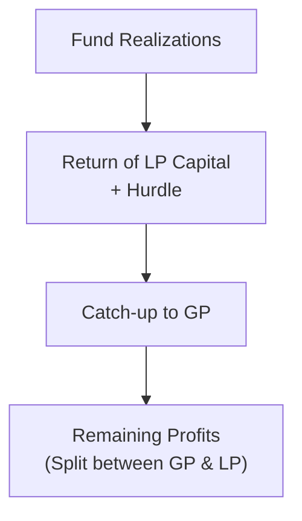

## Importance of Aligning Interests

Alignment of interests is the heartbeat of private markets, fundamentally shaping the relationship between the fund’s managers (General Partners, or GPs) and the investors (Limited Partners, or LPs). If you’ve ever heard someone grumble, “I want to make sure they have skin in the game,” that’s basically what we’re talking about here. GPs are often required to commit their own capital so that they share in both the rewards and the risks—just like LPs. That way, when the fund grows in value, managers and investors celebrate together. And if returns disappoint, well, we share that pain together, too.

This section draws on concepts introduced in Roles, Responsibilities, and Interactions of General Partners and Limited Partners. Let’s take a closer look at the fee structures, carried interest mechanisms, and clawback provisions that help keep everyone motivated and (hopefully) happy in the private investment world.

## Key Components and Mechanics of Fee Structures

It’s no secret that private funds aren’t free to run. GPs need resources to pay their staff, rent, utilities, travel expenses—right down to their daily coffee (though hopefully they’re not putting those cappuccinos on the fund’s tab). The most straightforward way to cover these overheads is through the management fee. While there are plenty of variations, you’ll often see a management fee that hovers around 1–2% per year, typically applied to the fund’s committed capital during the investment period. After the investment period, the fee might shift to a percentage of net invested capital or net asset value.

So, what’s in it for the LPs, who are the ones writing these checks for management fees? Basically, the fee arrangement is supposed to keep the lights on at the GP, supporting day-to-day operations and building a stable platform for identifying and nurturing investments. But it’s also kept in check by the knowledge that a bigger carrot (carried interest) is waiting at the end if deals go well—making sure GPs don’t get complacent about “just collecting fees.”  

### Common Management Fee Models

• Committed Capital Fee: A set percentage multiplied by the initial capital commitments. GPs receive steady and predictable income.  
• Invested Capital Fee: Calculated on the actual amount invested in portfolio companies. This structure can reduce the fee burden when capital is not yet deployed.  
• Hybrid Approach: Some funds use a higher percentage fee on committed capital during the early years, shifting to invested capital later on.

Tying management fees to real economic activity (like the actual amount invested) may encourage GPs to deploy capital responsibly. However, from a GP’s perspective, near-term predictability of fees enables them to maintain high-quality teams and resources.  

## Carried Interest: The Performance Engine

While management fees provide baseline compensation, carried interest (or “carry”) is the real incentive that drives GPs to maximize fund performance. Picture it this way: if management fees are the basic salary that helps ensure the bills are paid, then carried interest is the performance bonus that can lead to eye-popping payouts—provided the fund clears certain return thresholds.

### Mechanics of Carried Interest

Carried interest is typically around 20% of the fund’s profits (can be anywhere from 10–30%, but 20% is a common industry norm). It’s designed to start accruing only after the fund surpasses its hurdle rate (or “preferred return”)—often in the range of 8% per year, although the exact number can vary based on negotiations between GP and LP. In simpler terms, the hurdle rate is the LPs’ guaranteed minimum slice of returns before the GP takes a piece of the action.

It’s actually easier to grasp with a quick example—so here goes:

• Let’s say the fund’s hurdle rate is 8% annually.  
• If the final annualized return ends up being 10%, the GP could earn 20% of that 2% “excess return” above 8%.  
• If the return is a measly 7%, GPs take 0% in carried interest. (Ouch. But that’s the risk.)

### The Catch-Up Provision

Some funds incorporate a “catch-up” provision that quickly redistributes profits to the GP after the hurdle is met, until a specified split (e.g., 80/20 between LPs and GP) is fully reached. Once the catch-up is accomplished, ongoing profit splits revert to the negotiated ratio (often 80/20).

A quick personal anecdote: I remember sitting across the table from the CFO of a mid-market buyout firm. They proudly explained that their catch-up approach “gets them whole” on their portion of the returns sooner, once the LPs are satisfied. It’s a delicate balance: LPs want their preferred return guaranteed, but GPs want an upside that’s not delayed indefinitely.

## Waterfall Structures: How Profits Flow

Seeing how the profits flow—what finance folks call the “waterfall”—can really make or break the GP-LP relationship. The waterfall defines the order in which the fund’s proceeds are distributed. Two common approaches are popularly known as the “American waterfall” and the “European waterfall,” though ironically the usage isn’t strictly bound by geography anymore.

### American Waterfall (Deal-by-Deal)

Under the American waterfall, each realized investment is measured on its own. After the LP recoups its contributed capital for that specific deal plus the hurdle, the GP can start receiving the carried interest from that investment’s gains. This approach tends to benefit GPs earlier in a fund’s life, because they may receive carry from strong early exits, even if later deals perform poorly. Clawback clauses (discussed shortly) typically mitigate the risk to LPs of GPs locking in too much carry based on a handful of winners before subsequent investments falter.

### European Waterfall (Fund-as-a-Whole)

With the European waterfall, the GP typically doesn’t receive any carry until the fund as a whole returns all contributed capital (plus the hurdle) to the LPs. Then, the GP begins splitting excess proceeds with the LP. Naturally, GPs might prefer being paid deal-by-deal rather than waiting until the end of the entire fund. However, the European approach can provide more downside protection to LPs. It also creates a strong incentive for GPs to be certain that overall fund performance is robust, since they don’t see carry until the entire fund proves itself.

### Visualizing a Basic Waterfall

Below is a basic Mermaid diagram illustrating a simplified waterfall scenario. It’s not an all-encompassing representation, but it should help you visualize the flow of funds. Splits, percentages, and rates differ widely in practice, so treat this merely as a conceptual guide:

In the first step, the fund’s realized proceeds go to return LPs’ contributed capital plus the hurdle (A → B). Then, if provided in the agreement, there’s a GP catch-up (B → C). Whatever remains is split according to the agreed ratio (C → D).

## Clawback Provisions: Protecting LPs Against Overpayment

Clawbacks exist to protect LPs from the scenario where GPs receive hefty carried interest on early deals, only to see subsequent investments flop. If negative returns on later deals drag down overall performance, clawback provisions require the GP to repay a portion of previously received carry so that the final profit split matches the originally agreed-upon terms.

Let’s say a GP invests in a few early deals that all produce great returns, awarding them a generous portion of carry. But then, in later years, the fund gets whacked by unexpected market downturns. If the net return dips below the preferred threshold, or if the total carry received exceeds what was outlined in the final calculations, the GP may have to return a portion of that carry to the LPs. This is painful for GPs—imagine having to write a big check back to your investors. But it’s all part of building trust. The LPs know GPs can’t “cash in and run.”

From an operational standpoint, the clawback mechanics can get complicated. Some funds calculate clawback obligations only upon liquidation, while others do interim “true-ups.” The good news is that the more thoroughly all this is documented at the outset, the less drama you’ll have if performance deteriorates.  

## Significance of Hurdle Rates and Preferred Returns

Hurdle rates, also known as “preferred returns,” ensure that LPs receive their baseline return before the GP is rewarded with performance fees. An 8% hurdle is common, though that percentage can jump higher for more specialized strategies or in a hot fundraising environment. Some funds might choose not to have a hurdle rate at all, believing their potential returns are so high that a hurdle only complicates the distribution. But from an LP perspective, having a hurdle is generally a sign of a GP willing to stand behind a certain minimum performance.

### The Math Behind the Hurdle

If you wanted to depict the “profit split above the hurdle” mathematically, you might see something like this:

Let:
• I = Capital Invested by LPs  
• r = Realized net return of the fund  
• H = Hurdle rate per year  
• t = The number of years before exit  

Then the total capital plus hurdle is described by:

( I × (1 + H)^t )

Any profits in excess of this are subject to the carried interest split. In exam scenarios, you’ll want to be comfortable quickly identifying whether the fund has cleared the hurdle, and then how the split is allocated (e.g., 80/20 or 85/15).

## Why Transparency Builds Trust

It might sound obvious, but consistent transparency—through clearly drafted term sheets and regular reporting—is critical for good GP-LP relations. The complicated nature of private market valuations, capital calls, and distributions means that misunderstandings can easily arise. You certainly don’t want your LPs emailing you every two days wondering how you determined last quarter’s valuations or distribution splits. Having each step spelled out helps reduce friction and fosters a lasting partnership.

Transparency is especially relevant to sections like subscription credit facilities (discussed in Subscription Credit Facilities and Capital Calls) and to exit scenarios (see Alternative Exit Routes and Their Impact on Valuation). Because these structures can affect the timing and calculation of distributions, they should be spelled out in “the stack” of legal documents that set forth each party’s rights and obligations.

## Best Practices for Structuring Alignment

• Clarity in Legal Documents: The private fund’s Limited Partnership Agreement (LPA) should articulate every nuance, from the hurdle rate calculation method to how clawbacks are computed and distributed.  
• Regular Audits and Reporting: Frequent third-party audits of valuations and distributions allow LPs to confirm that management fees and carry allocations align with the fund’s terms.  
• Avoid Overly Onerous Conditions: While LPs want robust protections, overly complex or inflexible terms can turn off high-performing GPs. Balance is key.  
• Co-Investment: Encouraging the GP to invest personal capital in the fund (GP co-investment) further aligns incentives and fosters confidence among LPs.

## Common Pitfalls and Challenges

• Overly Generous Early Distributions: GPs with an American waterfall might receive large carry distributions on a handful of early successes, which can turn sour if the rest of the portfolio underperforms. Clawback mechanisms can help, but if not structured properly, LPs might still lose.  
• Complex Waterfall Triggers: If the LPA is riddled with complicated “trigger points,” it can result in confusion, disputes, or worse—legal battles.  
• Hurdle “Reset” Issues: Some funds only apply the hurdle to each investment’s initial cost. If distributions happen early and capital is reinvested, do we reset the hurdle or continue the old hurdle clock? Overlooking such details can lead to heated negotiations later.  
• Tax Considerations: Carried interest can have distinct tax treatments depending on the jurisdiction. Failing to set up the structure in a tax-efficient way can undermine both GP and LP returns.

## Real-World Scenario

Imagine a growth equity fund with a $500 million total commitment. The management fee is 1.5% on committed capital during the first five years (the investment period) and then 1.0% on net invested capital thereafter. A standard 8% hurdle applies, with a 20% carry once the hurdle is cleared.

• In the first few years, the fund invests in a couple of promising technology start-ups. One yields a 25% IRR upon exit; the other yields just 2%. Overall, the fund remains on track to exceed the 8% hurdle.  
• The manager uses an American waterfall, meaning the GP receives carried interest distributions on the profitable exit of the first start-up. However, if future investments later drag the total return below 8%, the GP could be forced to return part of that carry under the clawback provision.  
• Meanwhile, the 1.5% management fee covers the necessary operational and due diligence expenses, supporting the diligence needed to hopefully find more big winners.

This scenario shows how all these features—fees, carry, hurdles, clawback—interact to balance the GP’s entrepreneurial hustle with LPs’ need for protection and fair profit-sharing.

## Critical Exam Tips

From an exam perspective, you’ll likely need to:  
• Identify which waterfall structure is in place (American vs. European), and how that influences the distribution sequence.  
• Demonstrate how to calculate carried interest after addressing the hurdle/catch-up provisions.  
• Understand how clawback is triggered and computed after losses.  
• Comment on the potential conflicts or misalignments that remain, even with these mechanisms in place.  

Of course, it’s probably wise to also remember that in real life, actual distributions can get more complex if the fund has multiple share classes, multiple closings, or if different investor groups have different fee arrangements. But for exam purposes, you’ll typically encounter straightforward data sets, requiring you to carefully interpret the correct formula and waterfall structure.

## References

• Metrick, A., & Yasuda, A. (2010). “The Economics of Private Equity Funds.” Review of Financial Studies.  
• The Institutional Limited Partners Association (ILPA) Guidelines on Best Practices in Risk and Reward Sharing: https://ilpa.org/  
• See also: Chapter 2.1 Roles, Responsibilities, and Interactions of General Partners and Limited Partners, and Chapter 2.8 Subscription Credit Facilities and Capital Calls.

## Test Your Knowledge: Fee Structures, Carry, and Clawbacks



### A private equity fund has a 2% annual management fee based on committed capital during the investment period. Which of the following is a key purpose of this fee structure?

- [ ] It guarantees a minimum 10% return to LPs before GP compensation.
- [x] It provides steady operational funding for the GP.
- [ ] It covers only performance-based compensation for the GP.
- [ ] It eliminates the need for a clawback provision.

> **Explanation:** The management fee provides a source of predictable income for fund operations, including salaries and overhead, regardless of performance.

### A fund has an 8% hurdle rate and offers a 20% carried interest. Which statement best describes the role of the hurdle rate?

- [x] It ensures LPs receive an 8% return before the GP takes any carry.
- [ ] It is the only financial metric used to calculate the fund’s total return.
- [ ] It exempts the GP from clawback obligations.
- [ ] It automatically resets when capital is recycled.

> **Explanation:** The hurdle rate (preferred return) ensures LPs achieve a baseline return (8%) before the GP shares in further profits.

### What is the main difference between an American waterfall and a European waterfall in private equity?

- [ ] American waterfalls require clawbacks, while European waterfalls do not.  
- [x] American waterfalls distribute carry on a deal-by-deal basis, while European waterfalls distribute carry based on overall fund performance.
- [ ] American waterfalls prohibit management fees, while European waterfalls allow them.  
- [ ] American waterfalls always use a catch-up provision, while European waterfalls never do.

> **Explanation:** The American waterfall calculates carry after each realized deal, while the European waterfall waits to ensure the entire fund exceeds the hurdle before distributing carry.

### How does a clawback provision protect LPs?

- [ ] It allows GPs to increase their carried interest in the event of losses.  
- [ ] It eliminates any obligation of GPs to return previously received carry.  
- [x] It requires GPs to return any over-distributed carry if the fund underperforms in later stages.  
- [ ] It sets the management fee percentage for the entire fund.

> **Explanation:** A clawback ensures that if subsequent performance lowers the overall returns below what was anticipated when the GP took carry, the GP must return the excess to LPs.

### Which of the following best describes a “catch-up” provision in a private market fund?

- [ ] A provision that postpones GP’s carried interest until clawback obligations are settled.  
- [ ] A partial forgiveness of management fees by the GP.  
- [ ] A mechanism that requires special distributions to invoiced creditors before LPs.  
- [x] A mechanism allowing the GP to quickly receive a larger share of profits after the LP has received the preferred return.

> **Explanation:** Once the hurdle is met, the GP “catches up” to their agreed profit share, usually up to a target ratio (e.g., 80/20).

### Suppose a venture capital fund with a 10% hurdle rate has realized moderate returns below 10%. How much carry is the GP likely to receive?

- [x] Zero, because the fund didn’t surpass the hurdle rate.  
- [ ] 10% of all realized profits.  
- [ ] 2% of committed capital.  
- [ ] 20% of the amount below 10%.

> **Explanation:** Carried interest only starts accruing after surpassing the hurdle rate, so if the return stays below 10%, the GP typically gets no carry.

### If a GP has received excess carry from positive early exits in a deal-by-deal waterfall, but later exits underperform, what typically happens under a standard clawback clause?

- [x] The GP must repay some carry so total distributions match the original agreement.  
- [ ] The LPs must forfeit the future management fees.  
- [ ] The GP gets to keep all previously earned carry.  
- [ ] The future performance fees are suspended indefinitely.

> **Explanation:** Clawback mandates the GP to return any over-distribution of carry to keep the final split aligned with agreed-upon terms.

### Which factor is most likely to affect the actual dollar amount generated by the “catch-up” provision?

- [ ] The nominal risk-free rate in the GP’s home country.  
- [x] The total profits above the hurdle before the fund reverts to the standard 80/20 split.  
- [ ] The fund’s management fee on committed capital.  
- [ ] The existence of a subscription credit facility.

> **Explanation:** The catch-up defines how profits, above the hurdle, are split until the GP has “caught up” to the defined share of overall gains.

### A GP invests considerable personal capital into the fund alongside LPs. Which best describes this practice?

- [ ] It is called a clawback.  
- [ ] It means the GP is paying the management fee for all LPs.  
- [x] It is co-investment, helping align the GP’s and LPs’ financial interests.  
- [ ] It is a standard form of clawback indemnity only used in distressed funds.

> **Explanation:** When GPs “co-invest” with LPs, they share the same investment risk, encouraging them to make prudent decisions under the same economic interests.

### True or False: The European waterfall typically prohibits the GP from receiving any carry until all contributed capital plus the hurdle are returned to LPs.

- [x] True
- [ ] False

> **Explanation:** Under a European waterfall, the GP does not earn carry until the fund’s overall performance meets the full capital return (plus hurdle) for LPs.


