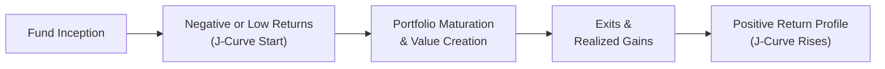
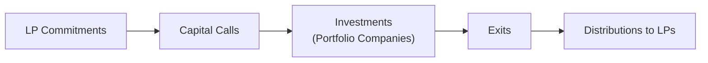

## Introduction

Let’s begin with a scenario that might feel pretty familiar to many Limited Partners (LPs). Imagine you commit capital to a private equity fund—excited about the possibilities, looking forward to real distributions in the coming years, and hoping for a top-quartile IRR. You’ve gathered the fund marketing materials, the track record, and the usual disclaimers. Then, for the first year or two, you see these small red numbers on your statements: negative returns, net of fees, or maybe just a tad above zero. You might even wonder, “Is this fund going to be a flop?” And then, as time goes on, you see a healthier upswing in valuation as portfolio companies mature or exit, eventually generating positive returns. That’s the classic J-curve effect in private market investments. The dramatic difference from public market investing is that nothing here is simple or standardized—performance metrics can be tricky, valuations might only be updated quarterly or annually, and it’s not as though you can just log into a brokerage account to see real-time market quotes.

This discussion takes a deep dive into how LPs assess the performance of private market funds. We’ll break down popular metrics like IRR, TVPI, DPI, and RVPI. We’ll also look at how that pesky J-curve emerges and influences a fund’s reported performance in its early years. Then, we’ll think carefully about the challenges inherent in benchmarking these private funds, where valuations are less frequent, liquidity is scarce, and vintage year effects loom large. Finally, we’ll explore best practices for ongoing monitoring—because the conversation doesn’t end once you’ve written the check. Let’s jump right into the technical side of evaluating these funds, and I promise to keep it fairly conversational along the way.

## Key Performance Metrics

From the perspective of an LP, one of your primary concerns is, “How much do I get back for the capital I’ve put in, and when do I actually get it?” The classic metrics that answer these questions are:

• IRR (Internal Rate of Return)  
• TVPI (Total Value to Paid-In)  
• DPI (Distributed to Paid-In)  
• RVPI (Residual Value to Paid-In)

### IRR (Internal Rate of Return)

The IRR metric might already be familiar from capital budgeting in corporate finance, but in private markets, it has a particular twist—irregular cash flows over time. For each capital call (outflow) and distribution (inflow), the IRR provides the annualized rate of return that yields a net present value of zero.

In more formal terms, you solve for r in:


\sum_{t=0}^{T} \frac{C_t}{(1 + r)^{t}} = 0


where \\( C_t \\) can be negative (capital calls) or positive (distributions). If you’re used to a simpler metric like a holding period return, IRR is more sophisticated because it precisely accounts for the timing and magnitude of each cash flow. 

Keep in mind, though, that IRR can be misleading. If a fund returns capital quickly or employs subscription credit lines to finance early deals (thereby delaying actual capital calls), the IRR can appear inflated. This is especially relevant in private equity buyout funds where leverage is common.

### TVPI (Total Value to Paid-In)

TVPI tells you how many dollars you have “on paper” for every dollar you’ve put in. That total value includes both distributions you’ve already received (cash out of the fund and into your hands) plus the residual (unrealized) value of your share in the portfolio. Formally:


\text{TVPI} = \frac{\text{Distributions} + \text{Residual Value}}{\text{Paid-In Capital}}


This ratio gives a sense of the overall multiple of invested capital. If your TVPI is 1.50x, for example, it means that for every dollar invested, you now have \$1.50 in combined realized and unrealized value.

### DPI (Distributed to Paid-In)

DPI hones in on what has actually been returned to you in cold, hard cash. It’s often viewed as the “realized” portion of returns:


\text{DPI} = \frac{\text{Distributions}}{\text{Paid-In Capital}}


In other words, if your DPI is 0.50x, you’ve only seen half of your invested capital returned. If it’s 1.2x, you’ve recouped your principal plus an additional 20% in realized gains. LPs tend to love watching DPI climb over time, as it’s proof that the fund is able to exit investments successfully.

### RVPI (Residual Value to Paid-In)

Finally, RVPI captures what is still “on the books” and unrealized:


\text{RVPI} = \frac{\text{Residual Value}}{\text{Paid-In Capital}}


This is the part of the fund’s value that is (hopefully) going to become real cash in the future. If your RVPI is 1.20x, it means the fund’s existing investments are currently valued at 120% of total contributions. Of course, that figure is often based on internal GP valuations, potentially audited by third parties, but not tested in the open market until an exit occurs.

In practice, LPs look at a combination of these ratios. For instance, a high TVPI but low DPI might mean that the fund’s valuable holdings haven’t been realized yet, so your returns are still on paper. You’ll track changes in these metrics across time, looking for that upward progression from negative or low IRR in the early years to more robust multiples later.

## The J-Curve Effect

If you’ve ever stressed out about those early negative returns in your private equity statements, well, you’re not alone. The J-curve effect describes how, in the early life of a fund, returns often appear negative or disappointingly low. Management fees get charged from day one. Meanwhile, investments are just beginning, so there are minimal distributions to offset those outflows.

Over time, if the fund invests well, the value of the portfolio companies should rise, and eventually, GP-led exits generate real returns. That’s when IRRs turn positive, and the slope of the J-curve typically surges upwards. It’s kind of like that moment in a marathon where you’ve spent considerable time and energy preparing but haven’t yet hit your stride—when you finally do, it’s a glorious shift in momentum.

Below is a simplified Mermaid diagram illustrating the general shape of the J-Curve across a fund’s lifecycle:

Early in the life of a fund, performance is often weighed down by fees and the unrealized nature of most investments. Some funds never fully recover from this negativity if portfolio companies fail to meet performance targets. But for successful funds, that line arcs upward in an almost J-like shape—hence the name.

## Benchmarking Private Market Performance

One of the trickiest parts of being an LP is figuring out if your fund is performing well relative to others. In the public markets, you might compare your mutual fund’s returns to the S&P 500 or some broad index. But in private equity or venture capital, there are no perfect benchmarks that trade daily. So, we rely on:

• Private market indexes developed by data providers (Preqin, Cambridge Associates, Burgiss, and so on).  
• Peer group comparisons for similar strategies and vintages.  
• Public market equivalent (PME) methodologies to compare your private equity performance with a hypothetical investment in public stocks over the same period.

### Private Equity Indexes and Peer Groups

Data providers like Cambridge Associates and Preqin gather information from numerous funds, normalizing and aggregating the data to report average, top-quartile, median, and bottom-quartile IRRs, TVPIs, or other metrics based on vintage year, fund size, geography, or strategy. However, each data set has partial coverage. Not every GP shares data publicly, so there’s always some selection bias. Further, the “good” funds might be more open to disclosure, while underperforming funds may be less inclined to share details.

### Vintage Year Comparisons

We typically classify funds by the year they first draw down capital—that is, the vintage year. This is crucial for fair comparisons because macroeconomic factors differ across time. If you invested in a 2007 vintage buyout fund right before the financial crisis, your performance might look weaker than a 2010 vintage fund that picked up bargain-priced assets. It’s not entirely an apples-to-apples comparison if you’re just measuring absolute IRR.

### Public Market Equivalent (PME)

Sometimes, LPs run a Public Market Equivalent (PME) analysis, where they replicate the private fund’s cash flows in a public market index. They “buy” into the index whenever the fund calls capital and “sell” from the index whenever the fund distributes capital. This results in an IRR-like measure for the public index “synthetic portfolio,” to see if all the complexity and illiquidity of private equity is actually beating the returns you'd get if you’d just stuck that money into the S&P 500 or another relevant public index. It’s no silver bullet, but it’s a decent reality check. 

## Net-of-Fee Returns, Vintage Year Analysis, and GP Consistency

### Net-of-Fee Returns

As an LP, your real return is always net of fees—management fees, carried interest, transaction costs, and the occasional hidden charges you stumble upon. Funds often quote their gross returns, but you must look closely at net returns, because that’s what hits your pockets. In the private markets, the difference between gross and net can be substantial. Especially if you face performance fees (carried interest) that can run 20% (and sometimes more) of profits above a hurdle rate. 

### Vintage Year Analysis

Vintage year has such an impact on performance that many LPs end up diversifying across multiple vintages. The trick is to smooth out the macro cycles. You look back at net-of-fee IRRs and realized multiples for prior funds in the same vintage cluster to see if your GP is consistently a top-quartile manager. If they’ve performed well in 2008, 2012, and 2016 vintages, maybe they’ve got a repeatable approach. If they had one good fund in 2010 but poor performance in the following cycles, that might be a warning sign.

### GP Performance Consistency

Speaking of GPs, it’s no secret that in private equity—unlike many other asset classes—manager selection can make or break your outcomes. Skilled GPs might have unique sourcing advantages, industry expertise, or operational improvement strategies that lead to repeated success. Others might be more opportunistic or rely on bull markets to exit efficiently. So, you not only measure the performance of the current fund but also check the track record of prior funds from the same GP. Looking for:

• Historical IRRs and multiples in prior vehicles.  
• Changes in team composition (did the star partners leave?).  
• Whether their strategy or sector specialization remains stable and relevant.

Aim to discern whether positive returns reflect the GP’s skill or if they just timed the market well.

## Ongoing Monitoring of Fund Performance

Many folks assume that once you commit capital to a private equity fund, you’re done until the final close years later. But prudent LPs engage in continuous (albeit less frequent) monitoring. This involves:

• Tracking capital calls and distributions—ensuring you meet each call promptly (because missing a capital call can be catastrophic) and analyzing how distributions flow in over time.  
• Reviewing quarterly or annual GP reports—these provide updated valuations, commentary on portfolio companies, exits, and any operational or strategic developments.  
• Benchmarking updates—maybe you recast your IRR or multiples every six months to see if you’re still in line with a relevant peer group or private equity index.  
• Looking for red flags—things like unusual management fee spikes, abrupt changes in portfolio company valuations, limited exit activity over extended periods, or too much reliance on subscription credit lines that obscure short-term IRR.

There’s also the matter of re-ups. GPs often come back to you for their next fund well before the current one is fully realized. You’ll have to decide whether to recommit—usually a sign of trust and confidence in the manager’s skill—based on your ongoing monitoring.

## Common Pitfalls and Best Practices

### Pitfalls

• Over-reliance on IRR. IRR can be distorted by subscription lines of credit or by early partial realizations.  
• Not analyzing net-of-fee returns. Gross returns can look amazing, but it’s the net that you pocket.  
• Ignoring the J-curve. Early negative returns can be normal, but if performance stays negative for too long, that’s a different story.  
• Failing to benchmark properly. You might see what looks like a stellar 15% net IRR, only to find out the average for that vintage is 20%.  
• Chasing top-quartile illusions. Every GP wants to claim they’re “top quartile.” A smart LP looks at consistent multi-fund track records.

### Best Practices

• Diversify across managers, strategies, and vintages. This can reduce the impact of any single macro environment or manager underperformance.  
• Use multiple evaluation metrics. Look at IRR, TVPI, DPI, and RVPI, as well as PME comparisons, to get a full picture.  
• Maintain dialogue with your GP. Be prepared to ask tough questions about valuation methods, exit timelines, and the rationale behind each deal.  
• Keep an eye on capital calls vs. distributions. Monitor distributions especially closely around the time the GP launches a follow-on fund or extension.  
• Engage in thorough due diligence. Past performance is a starting point—dive into the GP’s operational approach, sector focus, team stability, and the consistency of their methods.

## Practical Example: A Distressed Buyout Fund

Let’s consider a hypothetical buyout fund launched in 2018 focusing on distressed industrial companies. Initially, in 2018 and 2019, the fund calls down 25% of the total committed capital, invests it in two heavily leveraged acquisitions, and pays out management fees. By the end of 2019, you’ve got negative net IRR and practically zero distributions. That’s the dreaded J-curve.

Fast forward to 2021: market conditions improve, the GP restructures one of the companies at a decent profit, so they distribute a chunk of capital to LPs. IRR improves from -5% to +8%, purely from that single exit event. Meanwhile, the second company is trending upward in operating performance, so the indicated valuation for your residual share is higher. Now your RVPI is 0.8x (instead of 0.4x the year prior), and your DPI is 0.3x. So you see that you’ve actually got some real money back, and you have decent unrealized value.

If you run a peer comparison or consult an industry benchmark for the 2018 vintage, you might find that the median IRR is around 10% for similar strategies. That means you’re slightly lagging, so you keep a close eye on whether the GP is moving toward more profitable exits. By 2023, if your IRR creeps up to 14% with a DPI of 1.2x and an RVPI of 0.6x, your TVPI is now 1.8x (1.2 + 0.6), which is higher than many peers. In that sense, consistent monitoring has helped you see how the fund’s performance evolves, from initial negative returns to a more comfortable place in the top quartile.

## Diagram: Fund Cash Flow Lifecycle

One helpful way to visualize the money going in and out is with a simple flow diagram, focusing on how contributions (capital calls) eventually turn into distributions:

This simple representation tracks the journey from the LP’s initial commitment, through capital calls and investments, all the way to the exits that ultimately fund the distributions. At each step, the GP’s role is to identify and manage portfolio companies, while the LP’s job is to provide the capital (and undertake performance oversight!). Everyone hopes the final arrow—Distributions to LPs—represents a generous multiple of the original investment.

## Exam Tips

• Practice reading performance tables. In the CFA Level III exam context, you might see a table of partial-year IRRs, TVPIs, DPIs, and asked to interpret them.  
• Understand how subscription credit lines affect IRR. If an item set or essay question describes delayed capital calls through credit facilities, think about the potential for artificially high IRRs and how you’d address that as an LP.  
• Be ready to benchmark. You might need to compare a fund’s performance to a broader or sector-specific index, noting key differences in methodology or vintage year.  
• Watch out for net vs. gross performance confusion. Sometimes exam prompts will specify gross IRR, then ask for net-of-fee returns.  
• Don’t forget the J-curve. A question may present early fund data that looks negative—know how to evaluate whether that’s normal or concerning.

If a question scenario highlights that the fund is in year three, with a negative IRR but strong prospective assets, you might discuss the J-curve dynamic. Or if the scenario references a significantly higher IRR than the peer group, consider how timing of cash flows or use of subscription lines might distort the result.  

At the end of the day, analyzing private market fund performance from an LP perspective is about staying patient, looking at multiple metrics, and actively benchmarking against peers and public market equivalents. There’s no one perfect measure—so use everything in your toolkit to form a well-rounded view of a fund’s trajectory.

## References and Further Reading

• Phalippou, L. (2020). “Private Equity Laid Bare.” Oxford: Oxford University Press.  
• Cambridge Associates: https://www.cambridgeassociates.com/  
• Preqin’s database for private market benchmarks: https://www.preqin.com/  

--------------------------------------------------------------------------------

## Test Your Knowledge: Private Market Fund Performance from an LP Perspective



### Which metric measures only the realized portion of a private market fund’s returns to LPs?
- [ ] TVPI
- [ ] IRR
- [x] DPI
- [ ] RVPI

> **Explanation:** DPI (Distributed to Paid-In) specifically compares the distributions made to LPs against the amount of capital they have contributed. It measures how much of the invested capital has been returned in cash.

### A fund shows a TVPI of 1.5x and a DPI of 0.5x. Which statement is most accurate?
- [x] It indicates that one-third of the fund’s total value has been realized in cash.
- [ ] It indicates the fund is currently losing money on a net-of-fee basis.
- [ ] It implies the fund has used subscription credit lines unfairly.
- [ ] It suggests the fund’s IRR is 15%.

> **Explanation:** TVPI = (Distributions + Residual Value) / Paid-In. If TVPI is 1.5x and DPI is 0.5x, it means the residual (unrealized) portion is 1.0x. So about one-third (0.5x out of 1.5x total) of the total value has been realized in distributions so far.

### How does the J-curve effect typically impact a newly launched private equity fund’s reported performance?
- [ ] Performance is usually flat in the early years.
- [x] Performance is often negative or low early on, then rises as exits occur.
- [ ] It guarantees that vintage year effects will be minimal.
- [ ] It indicates a higher correlation with public market benchmarks.

> **Explanation:** The J-curve phenomenon describes how management fees combined with low initial realizations result in negative or low reported returns in a fund’s early life. Over time, as profitable exits materialize, the returns (IRRs and multiples) tend to rise, creating the J-shaped curve.

### What is a key drawback of using IRR to measure fund performance?
- [x] It can be inflated by the strategic use of subscription credit lines or early distributions.
- [ ] It does not consider the time value of money.
- [ ] It excludes management fees from returns calculations.
- [ ] It only applies to funds that have fully liquidated.

> **Explanation:** IRR is sensitive to the timing of cash flows. The use of subscription credit lines to delay capital calls can artificially boost IRR, because the clock effectively starts later. IRR also can appear higher if distributions occur earlier in the fund’s life.

### When comparing net-of-fee returns across different funds, which factor is most crucial to ensure an apples-to-apples comparison?
- [ ] Similar geographic focus
- [ ] Similar sector exposure
- [x] Same or closely matched vintage year
- [ ] Fund manager’s personal track record

> **Explanation:** Vintage year significantly affects performance because macroeconomic conditions, valuation environments, and market cycles vary by year. Comparing funds from the same or adjacent vintages provides a more accurate basis for performance evaluation.

### In a scenario where a fund has a DPI of 1.0x and an RVPI of 0.5x, what is the fund’s TVPI?
- [ ] 0.5x
- [ ] 1.0x
- [x] 1.5x
- [ ] 2.0x

> **Explanation:** TVPI = DPI + RVPI. So, 1.0x + 0.5x = 1.5x. This means that the total value (realized plus unrealized) stands at 1.5 times the original invested capital.

### What is the main reason an LP might calculate a public market equivalent (PME) for a private equity fund?
- [ ] To forecast future macroeconomic conditions
- [ ] To assess the GP’s track record in other asset classes
- [x] To compare fund performance against a public index using identical cash flow timing
- [ ] To calculate the management fees more accurately

> **Explanation:** A PME model replicates the private fund’s cash flows in a public index, giving LPs a way to see if their private investment outperforms or underperforms a hypothetical public market portfolio with the same timing of capital contributions and distributions.

### If an LP sees a consistently leveraged IRR due to delayed capital calls through subscription credit lines, which metric might offer a more transparent perspective on the fund’s performance?
- [ ] Vintage year alpha
- [ ] Beta analysis
- [x] TVPI
- [ ] Return on assets (ROA)

> **Explanation:** TVPI is less distorted by the timing of cash flows because it reflects the multiple of invested capital at any point in time. IRR can be inflated by delaying capital calls, but TVPI’s ratio-based approach likely gives a clearer snapshot independent of short-term financing strategies.

### What is a common pitfall when relying on peer group data from platforms like Preqin or Cambridge Associates?
- [ ] Their broad coverage of all private funds
- [x] Potential selection bias if not all GPs report their data
- [ ] Excessive standardization of fund metrics
- [ ] Lack of historical performance records

> **Explanation:** While Preqin and Cambridge Associates have extensive databases, not every GP reports data, and some may selectively report when performance is strong. This can skew average or quartile numbers, creating a selection bias.

### A negative IRR in year two of a private equity fund often indicates:
- [x] Early J-curve effects due to fees and limited distributions
- [ ] Managerial incompetence and a failing portfolio
- [ ] Proof that the GP used a subscription credit line poorly
- [ ] A breach of the fund’s partnership agreement

> **Explanation:** It is common for a private equity fund to show negative IRR in the early years because fees are charged while exits and distributions are minimal. This negative “dip” is part of the J-curve effect and doesn’t necessarily signal GP incompetence.


