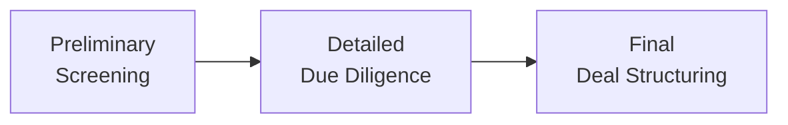

## Introduction

Due diligence and business planning are, frankly, the bedrock of any private investment. They help investors—particularly General Partners (GPs) and Limited Partners (LPs)—answer the big question: “Is this investment truly worth our time, capital, and effort?” When we talk about private markets, we’re often dealing with companies that aren’t subject to the same reporting requirements as publicly traded holdings, so we have to be thorough and, yes, maybe even a bit skeptical. After all, the success of an entire fund can hinge on the quality of these analyses and the subsequent plan for post-investment value creation.

This section explores the intricacies of the due diligence process and outlines how GPs craft business plans that can (hopefully) turn a promising prospect into a solid performer. We’ll look at the motivations behind each step—financial, operational, legal, and even environmental, social, and governance (ESG) considerations—while keeping in mind that every private investment is unique. We’ll also discuss how LPs evaluate a GP’s track record in these areas and how performance incentives can be aligned once the investment closes. 

I remember the very first time I went through a full-blown due diligence for a mid-market manufacturing firm. Let me tell you, it felt like I was rummaging through an entire library of documents, from the target’s financial statements to random shipping logs and even research on the local labor market. But after a while, all those puzzle pieces started forming a coherent picture—a picture that gave us confidence that we’d either make a worthy investment or walk away before it was too late.

## Stages of Due Diligence

When we speak of the “due diligence process,” we’re really breaking it down into three core stages that progress from a high-level overview to a deep-dive investigation:

• Preliminary Screening  
• Detailed Due Diligence (covering financial, operational, legal, and ESG)  
• Final Deal Structuring  

To visualize this:

### Preliminary Screening

This initial screening is often quick and relatively high-level, aiming to weed out investments that are obviously unsuitable. At this stage, GPs might look at top-line financial metrics or even intangible red flags like a questionable leadership team. If the opportunity meets certain criteria—maybe it’s in a priority sector with stable or promising cash flows—then we move on to a more in-depth analysis.

Once upon a time, I saw a screening that lasted a mere 12 hours. The GP noticed the target had a synergy with a portfolio holding, plus the potential for cost-cutting in the supply chain. Preliminary screening done. We moved on!

### Detailed Due Diligence

By this point, you’re making sure everything truly checks out. You’ll see the GP’s deal team, and often several outside experts (legal counsel, accountants, maybe even niche consultants), diving into these main areas:

#### Financial Due Diligence
We’re talking about analyzing audited and unaudited statements, verifying current liabilities, and scrutinizing revenue streams. Teams want to validate historical figures and forecast future projections. Typical questions might include:  
• Are revenue numbers consistent with prior year sales data?  
• What are the prevailing margins, and how do they compare to industry benchmarks?  
• Is there a looming debt covenant that might trigger a default?

In practice, many GPs create dynamic financial modeling templates that allow them to stress-test the target’s financials under best- and worst-case scenarios. They also want to ensure that the target can handle future capital expenditure requirements—especially if the investment thesis involves expansion or product innovation.

#### Operational Due Diligence
From where do raw materials come, and at what cost? How efficient are the factory lines or service processes? How skilled is the workforce, and does management have a track record of adapting to market changes? Operational due diligence is that unglamorous but absolutely vital piece of the puzzle that ensures the business isn’t going to sink from day-to-day inefficiencies.

Sometimes GPs discover huge opportunities here—like a chance to modernize a production line or renegotiate supply contracts. Other times, they find massive red flags, such as poor inventory controls or a management culture resistant to improvement.

#### Legal Due Diligence
We can’t forget about the legal side. Private investment deals normally come with contract reviews, intellectual property checks, possible pending lawsuits, or even complicated ownership structures that can muddy the waters. GPs often engage specialized law firms to verify that the target has the right to sell or license any crucial assets and that no existing covenants (like those from previous financing rounds) will hamper future growth.

One personal highlight? I once worked on a deal with a tech start-up that had four co-founders, each with partial IP rights. Legal due diligence took nearly four months because verifying ownership and ensuring future usage rights was not exactly straightforward. Without that step, the entire deal could have been worthless if the IP was challenged later.

#### ESG Due Diligence
In Chapter 1.7, we touched on ESG considerations, which are quickly becoming a major factor in private market investments. GPs increasingly want to assess a target’s exposure to environmental risks (e.g., carbon footprint), social aspects (e.g., labor practices), and governance structures (e.g., board composition). Even if a target company isn’t a big polluter, it may have supply chain risks or questionable labor standards that could cause reputational harm and hamper exit opportunities down the road.

### Final Deal Structuring

You’ve done the preliminary and detailed reviews, so if everything still looks promising, the GP moves toward final deal structuring. This entails clarifying investment terms, setting equity splits, deciding on debt vs. equity financing, and establishing key covenants. It’s also crucial to incorporate exit clauses—like an agreed-upon timeline to exit via IPO, secondary sale, or strategic buyout—and potential protections (e.g., anti-dilution provisions, liquidation preferences).

Blending the findings from all the due diligence aspects helps the GP tailor the investment agreement. GPs who see high growth potential but also higher risk might negotiate stronger protective covenants or a bigger equity stake to offset that risk. Others might structure deals with stronger management incentives tied directly to well-defined operational or revenue KPIs.

## Evaluating GPs’ Due Diligence Capabilities

From the LP’s vantage point, part of their investment thesis rests on the GP’s ability to navigate rigorous due diligence. How do LPs assess this? They’ll likely examine:  
• The GP’s track record in previous deals: Did the GP identify red flags early and avoid bad investments in the past?  
• The composition of the deal team: Are there seasoned professionals or domain experts?  
• Operational expertise: Does the GP have specialists in supply chain, marketing, or finance who can transform the target post-acquisition?

LPs might also talk to references from the GP’s historical deals—like founders or management teams. If they find out the GP conducts thorough due diligence and actively works with portfolio companies, that’s a sign of a strong potential partnership. If the GP is known to gloss over important checks or rely solely on third parties without “owning” the process, that might be a reason to look elsewhere.

## Crafting the Business Plan

After thorough due diligence, the next big question is, “Okay, so how do we create value?” This is where the business plan comes in. Once GPs identify the target’s strengths, weaknesses, and big opportunities, they outline their strategic vision for the company. Some of the big components:

• Strategic initiatives: Are we launching a new product line or expanding into new markets? Is the plan to merge with a competitor to achieve economies of scale?  
• Milestones: By when do we expect to break into the new market or see cost savings from an operational improvement?  
• Operational KPIs: Think of metrics like revenue growth, EBITDA margin, churn rates, or even something as specific as “average days in inventory.”  
• Management incentives: Linking management bonuses or equity stakes to these KPIs fosters alignment. If the leadership team meets or exceeds the plan, they share in the upside.  
• Expected exit timeline: Ideally includes a realistic assessment of current market conditions, plus an outline of potential buyers or an IPO strategy.

GPs typically refine these plans in collaboration with the existing management team—assuming they’re staying on board after the transaction. Aligning the business plan with the day-to-day realities of the operation helps avoid unrealistic projections. For instance, you can’t just triple sales overnight without the proper marketing budget, expanded manufacturing capacity, or a robust distribution network.

## The Role of Third-Party Advisors

GPs often rely on external experts to dig into specialist areas. Tax accountants spot potential liabilities, for example, especially if the target has complex cross-border operations. Industry consultants can gauge the target’s competitive advantage. And specialized lawyers can address regulatory or intellectual property challenges.

Yes, it involves extra fees. But—trust me on this one—the cost of discovering a hidden liability early can be far preferable to discovering it too late, when it could tank your entire investment.

## Managing Risks and Pitfalls

• Overlooking “soft” factors: You might have rosy Excel projections, but if the management culture can’t adapt or the labor force resists efficiency improvements, you’re in for a bumpy ride.  
• Biased assumptions: GPs can fall into “deal fever”—they really want this deal to happen—even when red flags appear. Encouraging team members to play devil’s advocate can keep everyone grounded.  
• Failure to integrate ESG: Neglecting environmental or social risks can lead to reputational damage, fines, or legal issues.  
• Excessive complexity in deal structure: Overly convoluted capital structures might chase away potential future buyers. If the next investor can’t easily decipher your deal’s intricacies, that might impede an exit.

## Example Scenario

Let’s assume a private equity GP is eyeing a healthcare services company that operates small outpatient clinics. The initial screening shows strong revenue growth, relatively stable cash flows, and favorable demographics. But deep due diligence reveals complications:

• Financial: A large portion of the company’s patients are covered by Medicare, and looming government budget cuts pose a revenue risk.  
• Operational: Patient wait times are longer than average, suggesting an opportunity for GP-led process improvements.  
• Legal: A small lawsuit from a former employee is pending. It might not be material, but it’s something the GP’s legal counsel needs to evaluate.  
• ESG: The clinics have high waste disposal costs, but might also receive grants if they adopt environmentally friendly materials.

Ultimately, the GP structures a deal with specific milestones tied to reducing average patient wait times, exploring revenue diversification (e.g., telehealth), and developing a more sustainable waste disposal process. The business plan sets out a three-year horizon, with the possibility of selling to a larger network of healthcare providers or a strategic private equity buyer specialized in clinics.

## Best Practices and Strategies

• Encourage cross-functional teams to work together. Financial analysts, auditors, operational experts, and legal teams should communicate regularly.  
• Use scenario analysis to test your assumptions—especially for growth projections or cost-reduction strategies.  
• Keep lines of communication open with the target’s management. Actively listen to their concerns or ideas.  
• Document everything. Regulatory bodies and future buyers will want to see a clear due diligence trail.  
• Maintain realistic timelines. Don’t rush the final deal structuring if major questions remain unanswered.

## Exam Tips for CFA Level III Candidates

• Relate due diligence to broader portfolio management themes. For instance, how might the uncovered operational inefficiencies affect portfolio risk and return?  
• Be prepared to demonstrate how each aspect of due diligence influences the final valuation or deal terms in essay-style questions.  
• Remember that the CFA examinations often integrate ethics and professional standards. Think about how a thorough due diligence process can align with the Code and Standards.  
• Expect scenario-based questions: e.g., “A GP discovered a major environmental liability. Should they proceed, renegotiate, or walk away?”  
• In item set questions, you might see partial financial statements combined with operational or legal data. Practice analyzing these data sets holistically.

## References and Further Exploration

• Lajoux, A. R., & Elson, C. M. (2010). “The Art of M&A Due Diligence.” McGraw-Hill.  
• Kaplan, S. N., & Strömberg, P. (2001). “Venture Capitalists as Principals: Contracting, Screening, and Monitoring.” American Economic Review.  
• CFA Institute Official Curriculum, 2025 Edition, especially sections on Private Equity, Alternative Investments, and ESG Integration.  
• Online courses from Coursera or edX on M&A strategy, private equity, due diligence, or ESG integration.  

If you’re curious about how to apply these concepts to real-world deals, it’s helpful to follow specialized blogs or podcasts dedicated to private equity and venture capital—these often share case studies and deal insights that can broaden your perspective.

## Test Your Knowledge: Private Investment Due Diligence and Business Planning Quiz



### Which of the following best describes the primary objective of due diligence in a private investment?

- [ ] To ensure GPs can refinance a deal at par.
- [x] To validate the target’s financial, operational, legal, and ESG risks, and confirm its viability.
- [ ] To reduce management incentives.
- [ ] To maximize immediate exit opportunities.

> **Explanation:** The main goal of due diligence is to uncover risks and verify assumptions about the target’s health and potential so that investors can make an informed decision.

### During detailed due diligence, which area focuses on examining the company’s revenue streams, capital requirements, and historical financial statements?

- [x] Financial due diligence
- [ ] Operational due diligence
- [ ] Legal due diligence
- [ ] ESG due diligence

> **Explanation:** Financial due diligence specifically examines the company’s numbers—like revenues, expenses, historical trends, and financial projections.

### A GP uncovers that the target’s leadership team is highly resistant to change, while the business plan requires significant productivity improvements. What risk does this highlight?

- [ ] Financial leverage risk
- [ ] Accounting fraud risk
- [x] Operational execution risk
- [ ] Sector diversification risk

> **Explanation:** If management is unwilling or unable to adapt to necessary operational changes, the risk lies in failing to execute the planned improvements post-investment.

### Which of the following is most critical if a target firm has patents, trademarks, or tech licenses essential to its business model?

- [ ] Audited financial statements
- [ ] Vendor contract renewal
- [x] Thorough legal due diligence of IP rights
- [ ] Board composition with ESG experts

> **Explanation:** For companies that rely on intellectual property, checking the integrity and ownership of these rights is pivotal in ensuring the investment’s future viability.

### When GPs integrate environmental, social, and governance screening, they are primarily trying to:

- [x] Assess long-term sustainability and mitigate potential reputational and regulatory risks.
- [ ] Lower the cost of capital for the LP.
- [x] Identify hidden opportunities for value creation through improved ESG practices.
- [ ] Guarantee a higher exit multiple.

> **Explanation:** ESG screening helps uncover risks and opportunities linked to sustainability, labor relations, and governance. It does not guarantee a higher exit multiple, but it can reduce potential pitfalls and also uncover value-enhancing opportunities.

### What is one way LPs evaluate a GP’s ability to perform effective due diligence?

- [x] Reviewing the GP’s track record and expertise of the deal team.
- [ ] Checking the final investment committee’s lunch preferences.
- [ ] Randomly sampling the GP’s coworker feedback ratings.
- [ ] Requiring the GP to rearrange the capital structure frequently.

> **Explanation:** LPs frequently look at the GP’s past performance in identifying risks and delivering returns and also the professional background of the deal team members.

### Which of the following factors would be most relevant to highlight in a business plan?

- [x] Key strategic initiatives, KPIs, and an expected timeline for exit.
- [ ] How many slides the final pitch deck contains.
- [x] Planned cost-cutting measures and operational milestones.
- [ ] A single year’s worth of historical revenue data without forward-looking analysis.

> **Explanation:** A solid business plan includes both strategic and operational goals and clear performance metrics, along with an exit strategy. Historical data alone is insufficient.

### Why might GPs rely on external advisors during due diligence?

- [x] To gain specialized expertise in legal, tax, or industry-specific matters.
- [ ] To circumvent compliance with regulations.
- [ ] To shift all accountability if the deal goes wrong.
- [ ] To reduce the complexity of valuation.

> **Explanation:** External advisors provide targeted expertise (e.g., legal, tax, technical) that complements the GP’s own skills, ensuring a thorough review.

### Which of the following is a common pitfall in due diligence?

- [x] Overlooking “soft” cultural or management dynamics that can derail execution.
- [ ] Spending too much time understanding supply chain efficiencies.
- [ ] Using scenario analysis to stress test financial assumptions.
- [ ] Validating revenue streams before finalizing the valuation.

> **Explanation:** An often overlooked but crucial factor is the organizational culture’s willingness to change. This “soft” side of due diligence can make or break the success of an investment.

### True or False: In final deal structuring, GPs should ignore exit clauses and focus solely on immediate returns.

- [x] True
- [ ] False

> **Explanation:** This is actually a trick question. The correct statement is the opposite: GPs should consider exit clauses during final deal structuring. Neglecting future exit paths can severely limit an investment’s flexibility and potential upside.


