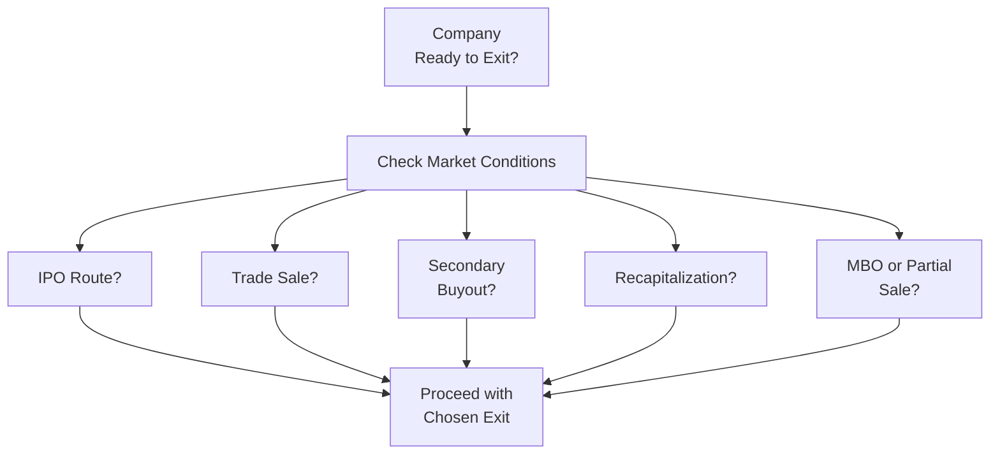
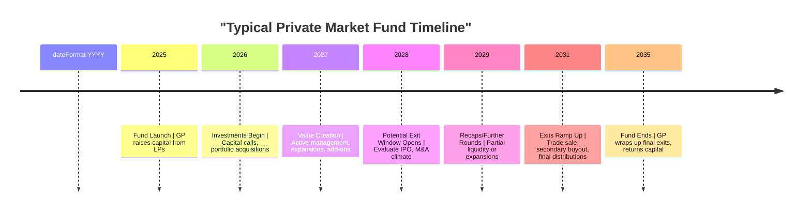

Sometimes, when I chat with friends who aren’t in finance, they’ll ask, “Why don’t private investors just sell their companies like normal businesses?” That’s when I realize how big the knowledge gap is between folks who live and breathe private markets and people on the outside. This section unravels the different exit paths that private equity (PE), venture capital (VC), and other private market investors use to convert illiquid stakes into actual, real money. We’ll walk through strategies like IPOs, trade sales, secondary buyouts, and recapitalizations—plus a few specialized moves like partial sales or management buyouts—and see how each route affects the bottom-line valuation. Along the way, I'll share a few personal reflections (definitely had some “oops” moments in my early years modeling exit options) and keep it slightly informal, but we’ll stick to the serious business of preparing you for the CFA Level III exam.

Exit strategies in the private markets are more than just a final transaction: they are a climax of careful planning starting from the initial investment, involving complex decisions around valuation, timing, regulation, and investor alignment. When you think about it, choosing the right exit route is almost like a puzzle: you juggle market conditions, regulatory constraints, growth prospects, and the company’s fundamentals to arrive at the best outcome for everyone.

Understanding the broad mosaic of exit choices is essential for General Partners (GPs) who manage investments on behalf of Limited Partners (LPs). Indeed, if you read further into discussions on GPs and LPs in other sections of this book, you’ll see how alignment of interests, fee structures, capital calls, and other strategic elements shape exit routes. But for now, let’s focus on exit options themselves and their valuation implications.

Alternative Exit Routes Overview

• Initial Public Offering (IPO)  
• Trade Sale (Strategic Acquisition)  
• Secondary Buyout  
• Recapitalization  
• Specialized Exits (Management Buyouts, Partial Sales, etc.)  

A quick note: you’ll see these routes pop up in various areas of private market investments—especially in private equity (Chapter 3) and private debt (Chapter 4)—because an exit is typically the ultimate chance for investors to realize returns.  

The IPO Path

An IPO is often perceived as the Holy Grail for many private market participants. It can occasionally lead to sky‑high valuations, especially if investor sentiment and market conditions are in a good place. When a private firm goes public, it issues shares on a stock exchange, opening the door for broad investor participation. IPOs can deliver large capital gains and a strong brand boost, but they also bring:

• Regulatory Scrutiny: Ongoing reporting requirements, transparency demands, and higher compliance costs.  
• Pricing Sensitivity: An IPO relies on underwriters who set the price range, often influenced by broader market dynamics and investor appetite.  
• Market Window Risks: If market sentiment is poor or if a rival’s IPO tanks, the valuation at listing could be weaker than anticipated.  

Rose-tinted though they may be, IPOs are famously tricky. One time, I remember modeling out an IPO for a tech-based portfolio company. Everything looked terrific until we realized the ushering in of a tech slump could slash the IPO’s value by nearly half overnight. The lesson? An IPO is always about reading the tea leaves of investor confidence.

From a valuation perspective, an IPO can fetch a premium if the company is seen as a breakout star in a hot sector. But the slightest shift in macroeconomic sentiment or failing to meet another high-flying competitor’s performance results can dramatically reduce that premium. GPs typically weigh the potential for an IPO bump against the risk of delays, volatile pricing, and the complexity of listing.

Trade Sale to Strategic Buyers

A trade sale is selling the portfolio company to a strategic buyer—usually another corporation looking to expand products, enter new markets, or achieve synergies in operations. This route is common in certain industries (like pharmaceuticals or tech) where bigger players always watch for up-and-coming competitors.

The big advantage? Strategic buyers might pay a significant premium if they see immediate synergy opportunities, cost savings, or a chance to corner a certain product niche. The main difference from an IPO is that with a trade sale, you’re handing the company to a specific buyer. This buyer might value intangible aspects like brand, proprietary technology, or distribution channels in ways that the public market wouldn’t. In Chapter 2.5 of this book, we discuss how GPs look for value creation opportunities that might specifically align with these strategic buyers’ needs.

From a valuation standpoint, the synergy argument can lead to a higher multiple. If the synergy potential is great—for instance, cutting overlap in R&D or piggybacking off existing sales networks—the buyer might pay extra. But if the synergy story is weak or if the buyer is cautious, you’ll see more subdued valuations.

Secondary Buyout

A secondary buyout occurs when one private equity firm sells a portfolio company to another PE firm. You might think this is just passing the buck around, but sometimes a company needs a different type of sponsor or a new injection of capital and expertise to continue growing. The second sponsor might have a specialized skill set or synergy within its existing portfolio to carry the company to greater heights.

Valuation in a secondary buyout heavily relies on the new PE firm’s modeling of additional growth or operational improvements. If you’re an LP, there’s a bit of caution here. Sometimes, a secondary buyout may indicate that the prior sponsor has extracted substantial value already—and the next sponsor may be paying near‑peak valuation. Other times, the new sponsor sees a longer runway for expansion and can justify a strong price. Keep your eyes on the underlying business fundamentals, industry growth, and how the new sponsor plans to add value.

Recapitalization

Recapitalization involves restructuring the company’s debt and equity mix. Maybe you add new debt, repay existing investors, or bring in new shareholders—but you don’t fully exit the company. This partial monetization can help GPs and LPs lock in returns while maintaining a slice of the upside. Recaps are especially popular when the company’s cash flows are strong enough to accommodate extra borrowing or if certain equity holders want some liquidity without scuttling the entire investment.

The beauty of a recap is that you might reduce risk by taking some chips off the table. Of course, the trade-off is you add more leverage, which can increase the financial risk for the company. Valuation in a recap scenario depends on the level of leverage, interest rates, credit market conditions, and the company’s projected free cash flow. If the financing environment is favorable (cheap debt, robust investor appetite for yield), recaps can be structured to produce substantial early distributions to LPs.

Specialized Exits: Management Buyouts, Partial Sales, and Beyond

Some companies choose the management buyout (MBO) path. This is when the executive team (often combined with PE sponsors or bank financing) acquires the business from the current owners. It can be a great solution if management has deep conviction in the business and wants to control its destiny, but it also requires management to have, or raise, significant capital. Negotiations can be tricky: the more enthusiastic the management is, the higher the price tag might be. This route demands robust due diligence to avoid conflicts of interest (discussed in Chapter 2.6 on due diligence).

Partial sales, sometimes called a “partial liquidity event,” let investors sell a portion of their holdings. It’s a beneficial tactic if you want to de-risk while staying in the game in hopes of further upside. Your valuation depends on how big a stake you’re selling and the chunk of ownership that remains. If the buyer now controls the business, they might pay a control premium. If it’s a non-controlling stake, the discount could be higher.

Timing and Market Windows

Whether it’s an IPO or trade sale, timing is everything. If you’re launching an IPO in a frothy market with receptive investors, you can land a big premium. If the window slams shut—maybe due to a macroeconomic downturn or negative industry news—valuations dry up. Similarly, trade sales often happen during buoyant M&A cycles, but if the industry is in contraction mode, strategic buyers might pay less or not be interested at all.

This “market window” concept isn’t just about public sentiment; it’s also about your fund’s timeline. Private equity funds and venture capital funds typically have limited lifespans, and GPs need to distribute proceeds to LPs. Sometimes GPs might exit earlier than they’d prefer if the clock is ticking on those fund terms. In other cases, they might hold on for a bit longer if they believe a better window is just around the corner.

Impact on Valuation and Return

Each type of exit exerts a unique influence on valuation:

• IPO: Often carries potential for the highest valuations but also the highest volatility and risk.  
• Trade Sale: Provides a premium if strategic synergies are strong, but buyer interest must be present.  
• Secondary Buyout: Pricing can be fair or high depending on the perceived potential for further enhancements.  
• Recapitalization: Offers partial liquidity at valuations tied to credit market conditions, company health, and future projections.  
• MBO or Partial Sale: Often more niche, with valuations depending on control dynamics, financing availability, and the specific motivations of management or minority holders.  

To visualize the interplay among these exits, let’s look at a simplified decision flow. Obviously, real life is way more complicated—think multiple negotiations, board approvals, and regulatory sign‑offs—but this captures the high‑level perspective:

Take a look at how at each step, you weigh the status of public equity markets, interest rates, potential strategic buyers, or sponsor interest levels. Once you choose the route that best balances your timing and valuation needs, you proceed with negotiations, documentation, and final closure.

Some GPs attempt to keep multiple channels open simultaneously—engaging in parallel negotiations with strategic buyers, exploring an IPO, and considering recaps—because it can improve bargaining power. If a strategic buyer believes you’re also serious about an IPO, they may improve their offer. But that only works if you have the internal resources to run multiple processes at once.  

Common Pitfalls and Best Practices

• Overestimating Synergies: GPs sometimes expect a trade buyer to pay an inflated premium when that synergy narrative isn’t so compelling.  
• Poor Market Timing: Launching an IPO right after a competitor’s disastrous listing or in a sector downturn can sabotage the valuation.  
• Excessive Leverage in Recaps: Taking on too much debt to return capital early can weaken the company’s financial stability.  
• MBO Conflicts of Interest: Management might try to lowball the valuation, so an independent valuation and dedicated M&A advisor can be critical.  
• Rushed Negotiations: Strict fund deadlines sometimes push GPs to accept suboptimal exit terms, hurting longer-term returns.  

If you want to refine these best practices, you might check out Chapter 2.6 on due diligence and business planning. GPs with thorough business plans that project multiple exit scenarios tend to negotiate better valuations.

Emphasizing the Big Picture

In private markets, an exit is not an afterthought: it’s integral to the original investment thesis. You might hear your seatmate at the next PE conference or your colleague at a co-investment opportunity mention how they always have a “well-defined exit plan from day one.” That’s not just talk. Successful GPs map out potential scenarios from the start, keep a pulse on the market, and pivot as conditions change.  

Even if you’re an LP just assessing a GP’s pipeline, you should scrutinize their track record of exits. Do they consistently wait too long and miss the high-valuations window? Do they have a network of strategic buyers that can fetch top dollar? Or do they rely heavily on recaps, raising concerns about overall returns?

Below is a basic timeline diagram that integrates the notion of exit with the broader fund lifecycle. While you might see variations in structure, it nicely illustrates how GPs consider exit windows in the context of capital calls and distributions.

You’ll see that GPs often aim to exit around years 5–7 (although this can vary widely). They might do earlier flips if the environment is hot or hold longer if they see more upside—and, as we’ve discussed, the path they choose can drastically shape the ultimate valuation.

References

• Barber, F., & Goold, M. (2007). “The Strategic Secret of Private Equity.” Harvard Business Review.  
• Arundale, K. (2018). “Raising Venture Capital Finance in Europe.” Kogan Page.

And, of course, consider exploring more in the official CFA Institute readings on private equity, alignment of interests, and performance measurement. These sources shed additional light on how GPs strategize their exit and revolve it around net IRR, total value to paid-in (TVPI), and other metrics that matter for LPs.

Remember: mastering the nuances of these exit routes isn’t just about memorizing definitions. It’s about recognizing the transformative effect a well-chosen exit path can have on the final returns for both GPs and LPs. For the exam, expect scenario-based questions asking you to recommend an exit route given certain market conditions, company structures, or timing constraints.

Below is a short quiz to test your knowledge of these concepts and sharpen your readiness for the Level III exam:

## Test Your Knowledge: Exit Routes and Valuation in Private Markets



### Which exit route is often pursued to capitalize on bullish investor sentiment and can sometimes achieve higher valuations but requires stricter regulatory disclosure?
- [ ] Trade Sale
- [x] IPO
- [ ] Recapitalization
- [ ] Secondary Buyout

> **Explanation:** An IPO leverages public market enthusiasm for potentially higher valuations but entails full disclosure under securities regulations.

### A management buyout (MBO) is most commonly associated with which of the following outcomes?
- [ ] Immediate public listing and secondary share offering
- [ ] Selling the company to a strategic buyer for a premium
- [x] Existing managers acquiring control, typically financed through debt
- [ ] A partial sale to external institutional investors

> **Explanation:** MBOs allow the existing management team to purchase the business. They typically raise external financing but do not engage in a public listing.

### In a trade sale to a strategic buyer, which factor most frequently drives a premium valuation?
- [ ] High lending rates
- [x] Synergy potential between the acquirer and the target
- [ ] Company’s need to increase working capital
- [ ] Reduced investor appetite for IPOs

> **Explanation:** Strategic buyers often pay more if they foresee cost savings, cross-selling, or operational synergies.

### Which statement best describes a secondary buyout?
- [x] It involves selling a portfolio company to another private equity firm.
- [ ] It entails a group of existing managers purchasing the company.
- [ ] It is a partial sale to new minority investors.
- [ ] It mandates an immediate public listing.

> **Explanation:** A secondary buyout is when one private equity firm sells a portfolio company to another PE firm seeking further growth or value creation.

### In a recapitalization, which aspect most directly affects valuation?
- [x] Company’s capacity to service additional debt
- [ ] Corporate governance structure
- [x] Prevailing interest rates and credit market conditions
- [ ] The availability of strategic buyers

> **Explanation:** Recaps rely on debt financing, making interest rates and balance-sheet capacity key considerations in determining how much value can be extracted.

### Which scenario best illustrates the concept of a market window for exits?
- [x] A favorable period for IPOs or M&A sentiments, leading to higher potential exit valuations
- [ ] A time when regulatory authorities clamp down on public listings
- [ ] A slump in leveraged finance
- [ ] A specific fundraising cycle for a new strategy

> **Explanation:** Market windows are short-lived opportunities characterized by optimistic investor sentiment or active M&A.

### Which of the following is least likely to be a reason for pursuing a partial sale?
- [ ] De-risking a portion of the investment
- [ ] Realizing partial liquidity for LPs
- [x] Eliminating all management involvement
- [ ] Retaining some upside potential

> **Explanation:** Partial sales don’t aim to remove management entirely; they are more about liquidity and retaining some stake in the company.

### How might a rushed negotiation to meet a fund’s deadline affect the exit valuation?
- [ ] It guarantees a higher valuation
- [x] It may force acceptance of a lower valuation
- [ ] It reduces risk for both parties
- [ ] It ensures the buyer’s synergy assumptions are divinely correct

> **Explanation:** Time pressure may weaken the seller’s bargaining power, often resulting in a lower valuation.

### What is the primary risk of taking on increased leverage through a recapitalization?
- [ ] More robust equity valuation
- [ ] Enhanced synergy with strategic buyers
- [x] Elevated financial distress if cash flows weaken
- [ ] Automatic extension of the fund lifecycle

> **Explanation:** Additional leverage heightens the risk of financial distress if revenue or cash flow falters.

### True or False: A secondary buyout often involves a strategic buyer intending to fully integrate the target’s operations.
- [ ] True
- [x] False

> **Explanation:** A secondary buyout typically involves another private equity firm, not a strategic buyer that plans to directly integrate operations.


