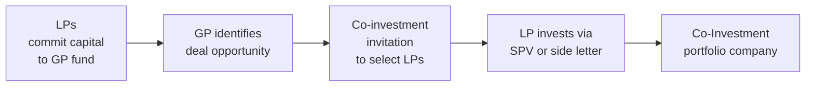

## Introduction to Co-Investments
Co-investments can feel like an adrenaline rush, right? You’re an LP sitting on a solid portfolio, and all of a sudden your General Partner (GP) calls you up: “We have this exclusive opportunity—wanna jump in?” Um, yes, sign me up! But hold on. Co-investments aren’t just about the excitement of going direct; they bring along extra responsibilities, additional due diligence, and often bigger returns if done right. 

In a typical private equity structure, LPs commit capital to a fund, and the GP chooses how that capital is invested. But sometimes, the GP has a compelling deal—perhaps it’s quite large relative to the fund’s size or offers an interesting strategic angle—and invites certain LPs to “co-invest” outside the main fund. This arrangement typically comes with sweeteners: significantly reduced management fees and carried interest (sometimes zero), plus a chance for LPs to gain deeper hands-on exposure. But as we all know from other sections—like in 2.3 on Alignment of Interests—there’s always a trade-off somewhere: complexities, potential conflicts, or additional resource burdens on the LP side. Let’s walk through the key considerations.

## The Rationale Behind Co-Investments
Co-investments can seem like a dream come true for both GPs and LPs. GPs might find themselves dealing with a bigger transaction than anticipated or keen to diversify their fund’s exposure. By calling on select LPs to co-invest, they can essentially spread the deal across multiple parties while preserving fund liquidity. Meanwhile, the LP enjoys an enticing proposition: direct participation (i.e., a single-company stake) and, often, no incremental management fee or carried interest on that co-invested portion.

• LP Benefits  
  – Potential to bolster returns: Co-invest deals can be structured with more favorable economics.  
  – Deeper insight: LPs gain an insider perspective on the target company’s operations.  
  – Enhanced relationship with GPs: By partnering closely with the GP, the LP may receive priority access to future deals.  

• LP Drawbacks  
  – Resource burden: If you’re an LP who wants to do co-investments, you better have an internal team that can perform deeper due diligence.  
  – Concentration risk: A single co-investment might represent a larger stake in one company, so there’s less diversification.  
  – Capacity constraints: The timing for capital calls on co-investments can be unpredictable. Having the bandwidth—both financially and from a staffing perspective—is crucial.  

• GP Benefits  
  – Deal facilitation: Ability to close bigger deals or deals with specialized strategic angles.  
  – Relationship building: Offering co-investments can strengthen ties with key LPs, potentially attracting fresh commitments down the line.  
  – Diversification: The GP might maintain balanced exposure for the main fund while letting co-investors take a larger slice of a given opportunity.  

• GP Drawbacks  
  – Conflict over allocation: GPs must be transparent about how they choose which LPs get co-investment allocations, or they risk tarnishing relationships with non-participants.  
  – Extra oversight: Managing a side vehicle or a special-purpose vehicle (SPV) for multiple co-investors adds complexity.  
  – Regulatory compliance: Navigating distinct legal agreements for co-investments requires more resources and more robust processes.

## Candid Thoughts on Risks and Governance 
If we zoom out, co-investments sound amazing—but you know how reality can be a bit messy. Let’s face it: the GP has a vested interest in offering certain deals to certain LPs (maybe they like big checks, or maybe they prefer LPs who can offer operational or regional expertise). Meanwhile, some LPs might get left out, or might be offered less attractive deals. 

Moreover, once an LP invests, the relationship doesn’t stop there. Effective governance demands clarity on who’s responsible for monitoring the deal’s business strategy, ensuring no corner is cut. That’s where thorough side letter agreements (SLAs) or co-investment SPVs come into play. These SPVs are legal shells designed to house a single investment (or a group of co-investments), limiting liability and keeping the main fund’s assets separate. 

If you recall from Section 2.6 on Due Diligence, it’s not enough for the LP to trust the GP blindly. Before co-investing, the LP should undertake robust due diligence on the target company’s financials, the risk profile, and how it fits within the broader portfolio. So, yeah, the co-investment is “thanks to your GP relationship,” but it also means you’re stepping out of the comfortable realm of the main fund’s blind pool structure. Not everyone can handle that.

## Co-Investment Structures 
From a structural standpoint, co-investments are typically executed through SPVs, or sometimes included as a side-by-side arrangement with the main fund. Here’s a quick snapshot of how things might flow:

• Special-Purpose Vehicle (SPV):  
  – SPVs isolate financial risk.  
  – Typically formed as a separate legal entity with its own governance and documentation.  
  – LP invests in the SPV directly, rather than through the main fund.  

• Side Letter Arrangements:  
  – These can modify or augment particular terms (e.g., no management fees).  
  – Outline co-investment rights and obligations for that LP.  
  – Usually negotiated for committed or prospective co-investment capital.

## Fee and Carry Considerations
Let’s talk about fees—everyone’s favorite subject. The GP typically offers co-investments at a reduced fee structure (sometimes zero management fee, sometimes a lower carried interest percentage). Why do GPs do that? Because they want to sweeten the deal and encourage participation, and because co-investments generally help them close larger transactions.

• Reduced or Zero Management Fee  
  – Big selling point for LPs, as it effectively lowers overall costs.  
  – GPs can recover lost fees through stronger relationships and potentially more deals over time.  

• Reduced or Zero Carried Interest  
  – LP keeps a higher share of the upside.  
  – Note: Some GPs still charge a modest carry on co-investment deals, so terms vary.  

Be careful, though. Just because fees are low doesn’t mean there’s no risk. In Section 2.3, we discussed alignment of interests: a low or zero carry might reduce the GP’s incentive to actively manage that specific co-investment unless processes are well-structured to ensure the GP’s brand reputation (and potential to get future co-investment capital) is on the line.

## LP Resource Requirements
Think you’re ready to dive into co-investments? Well, guess what. You’ll need internal capacity. That means having staff with experience in private equity or specialized sectors (if the co-investment is in, say, real estate, you want real estate specialists on board). Without that expertise, an LP might miss key red flags.

• Due Diligence and Deal Evaluation:  
  – Evaluate the target company’s financial statements, competitive landscape, and growth potential.  
  – Assess synergy with other portfolio holdings or your overall strategic asset allocation (see 1.5 in Chapter 1).  

• Monitoring and Reporting:  
  – Unlike passive fund investments, co-investments often demand ongoing oversight.  
  – Be prepared for board meetings, performance reviews, and direct contact with company management.  

• Legal and Compliance:  
  – Drafting and editing side letters or SPV documentation can be time-consuming.  
  – Regulatory compliance might differ from your usual fund commitments.

## Potential Conflicts and Fair Allocation
From the GP’s perspective, fairly allocating these co-invest deals is key to preserving trust among LPs. If certain LPs consistently get the “unicorn” deals while others are left with the more pedestrian (or borderline problematic) ones, that’s a recipe for tension. Some GPs create formal policies to ensure an equitable distribution of co-invest opportunities, though in practice, relationships, expertise, and speed to commit capital are big deciding factors.

Furthermore, a GP might have an incentive to push challenging deals or higher-risk deals to co-investors, especially if the main fund’s risk budget is already maxed out. So, as an LP, keep your eyes open: confirm the GP is applying consistent underwriting standards on both the main fund and co-investment deals.  

## Performance Measurement and Impact on Portfolio
Just because co-investments often have more favorable fee structures doesn’t automatically guarantee outperformance. A single company can fail and bring the entire co-invested portion to near zero. It’s wise to measure performance metrics, like IRR (internal rate of return) and MOIC (multiple on invested capital), for each co-investment separately. Compare them to the broader private equity benchmarks or relevant sector benchmarks (see 1.3 for more details on private performance metrics).

• IRR can highlight the returns timing for the co-investment.  
• To see how “profitable” you’ve been on your principal, watch MOIC.  
• TVPI (total value to paid-in capital) might also be used to track interim performance.  

Consider maintaining a robust reporting system, so you know how each co-invest is doing versus the main fund. Good data helps you decide if co-investment is consistently adding value to your portfolio or if your resources are better spent elsewhere.

## Best Practices for Successful Co-Investments
1. Strong GP-LP Relationship Management  
   – Ensure open communication channels. You’ll want the GP to call you first for the best deals.  
   – Build trust by consistently responding quickly and performing thorough due diligence.

2. Clear Deal Allocation Policy  
   – GPs should have a transparent framework for deciding which LPs get invited to co-invest.  
   – Comply with any relevant fiduciary guidelines and anti-discrimination considerations.

3. Thorough Due Diligence (Recall from 2.6)  
   – Leverage specialized expertise or third-party consulting to evaluate co-investment opportunities.  
   – Model downside scenarios. Co-investments tend to be single-company exposures, so a meltdown can be painful if not thoroughly assessed.

4. Internal Resource Commitment  
   – Hire or allocate staff who can handle all aspects: financial analysis, legal, and ongoing monitoring.  
   – Provide continuous training, especially for staff who are used to passive investment roles.

5. Proper Documentation  
   – Use side letters or SPV agreements that fully lay out rights, responsibilities, fees (or lack thereof), and exit provisions.  
   – Consider exit scenarios (IPOs, secondary sales, sponsor buybacks) just as you would for the main fund.

## Practical Example: Mid-Market Buyout
Let’s consider a simplified example. Imagine the GP is raising a $1 billion middle-market buyout fund. Midway through the investment period, they find a promising manufacturing company that needs $300 million in total equity. The fund can only deploy $200 million without exceeding its concentration limits. So, the GP offers a $100 million co-investment opportunity to selected LPs with no additional management fee and a modest 5% carried interest (compared to 20% for the main fund). 

An LP who’s done co-investments before seizes the opportunity. They deploy $25 million into the SPV, conduct robust due diligence, and seat one of their operational experts on the target’s board. Over five years, the manufacturing company grows significantly, culminating in a profitable exit with an MOIC of 2.5x for the co-invested portion. Because the co-investment carry was only 5%, the net returns to the LP are much higher than they would have been inside the main fund. However, had the LP not had the operational resources to track that manufacturing company’s performance, they might have overlooked red flags or missed key pivot points.

## Exam Tips and Common Pitfalls
• Time Management in the Exam: Co-investments can pop up as a subtopic in a case study—maybe the portfolio manager is debating whether to accept a co-investment. Show the examiner that you understand the pros and cons and how to incorporate it into the broader portfolio context.  
• Pitfalls: 
  1. Overlooking the resource costs.  
  2. Failing to question the GP’s rationale for offering a particular co-investment.  
  3. Missing the potential misalignment if the GP has too little “skin in the game” on co-investment terms.  
• Action Step: If a question references the conflict of interest in co-investment allocations, highlight the need for allocation policies and disclaimers in side letters or subscription documents.

## References for Further Study
• Weidig, T., & Mathonet, P. Y. (2004). "The Risk Profiles of Private Equity Funds of Funds." The Journal of Alternative Investments.  
• Cambridge Associates Co-Investment Research (https://www.cambridgeassociates.com/) for performance insights.  
• Review Section 2.3 “Alignment of Interests” to explore deeper how fees and carried interest might shape co-investment approaches.  
• Recall Chapter 1.3 “Types and Interpretations of Private Performance Metrics” to revisit IRR, MOIC, DPI, and how they apply to single-deal exposures.

## Test Your Knowledge: Co-Investment Strategies and Considerations Quiz



### In a typical co-investment structure, which advantage often applies to the Limited Partner (LP)?

- [ ] Higher management fees compared to the main fund
- [ ] Zero carried interest but double the base management fee
- [x] Reduced or zero management fees on the co-invested portion
- [ ] No risk of capital loss

> **Explanation:** One of the main attractions of a co-investment opportunity is the reduced or zero management fee for the LP, which can enhance net returns. However, co-investments still carry capital risk.

### What is one major risk for LPs who engage in co-investments?

- [ ] Broader portfolio diversification
- [x] Concentration risk due to single-company exposure
- [ ] No access to board-level information
- [ ] Inability to monitor performance

> **Explanation:** A co-investment often involves a large stake in a single company, which can increase overall concentration risk if that investment underperforms.

### Which approach best helps mitigate a potential conflict of interest in co-investment deals?

- [ ] Setting high carried interest for co-investments
- [x] Having a transparent allocation policy for co-investment opportunities
- [ ] Restricting co-investments only to the largest LPs
- [ ] Offering co-investments only after the fund’s capital is fully utilized

> **Explanation:** A transparent and fair allocation policy can help ensure that the GP does not favor certain LPs unfairly, thus mitigating conflicts of interest.

### Which of the following statements is TRUE regarding co-investment SPVs?

- [ ] They combine the risks and assets of multiple portfolio companies.
- [x] They isolate financial risk for the specific deal or series of deals.
- [ ] They eliminate the need for due diligence.
- [ ] They are legally the same as the main fund.

> **Explanation:** Co-investment SPVs are typically set up as separate legal entities, isolating risk and cash flows tied to that specific deal.

### Which factor is MOST critical for LPs to consider before committing to a co-investment?

- [x] Availability of internal resources for due diligence
- [ ] The possibility of changing the main fund’s manager
- [x] The co-investment’s correlation with existing portfolio companies
- [ ] The location of the GP’s office

> **Explanation:** LPs must ensure they have enough expertise and capacity to conduct thorough due diligence internally, as well as consider how the co-investment fits with their overall portfolio allocation and existing exposures.

### How do co-investment fee arrangements typically differ from standard fund commitments?

- [x] They often have reduced or zero management fees and lower carried interest.
- [ ] They charge more fees to offset operational costs.
- [ ] They do not allow for performance-based carry.
- [ ] They can only be negotiated at the end of the investment period.

> **Explanation:** One of the main enticements for LPs is the reduced fee structure in co-investments, which can materially improve net returns.

### What is a potential drawback for the GP when offering co-investments?

- [x] More administrative complexity and the need for added transparency
- [ ] Reduced fund size or fewer deals
- [x] Inability to align with co-investors
- [ ] Loss of brand reputation

> **Explanation:** While co-investments can facilitate bigger deals, the GP might need more extensive documentation and internal processes to manage co-investment SPVs, plus keep track of multiple co-investors.

### Which of the following is a best practice for an LP engaging in co-investments?

- [ ] Rely solely on the GP’s due diligence since the GP has the biggest stake at risk
- [x] Conduct one’s own thorough due diligence and monitoring
- [ ] Demand carried interest be eliminated for the main fund
- [ ] Negotiate immediate board control over the target company

> **Explanation:** LPs should perform independent due diligence to fully understand the investment’s risk-return profile and continue actively monitoring the co-invested company.

### When measuring co-investment performance separately, which metric(s) could be used?

- [ ] Only the IRR from the main fund
- [ ] Only the GP’s reported net asset value (NAV)
- [x] IRR, MOIC, and TVPI specifically for the co-invested portion
- [ ] Sharpe ratio from public equity markets

> **Explanation:** Using private equity–focused metrics (IRR, MOIC, TVPI) for the specific co-investment yields a clearer picture of how well the direct deal is performing relative to the main fund or other benchmarks.

### True or False: A co-investment arrangement generally involves the LP committing capital to the main fund’s overall portfolio rather than a single company.

- [ ] True
- [x] False

> **Explanation:** By definition, in a co-investment scenario, the LP invests directly in a single-company deal (distinct from the main fund’s blind pool), typically through an SPV or via a side letter agreement.


