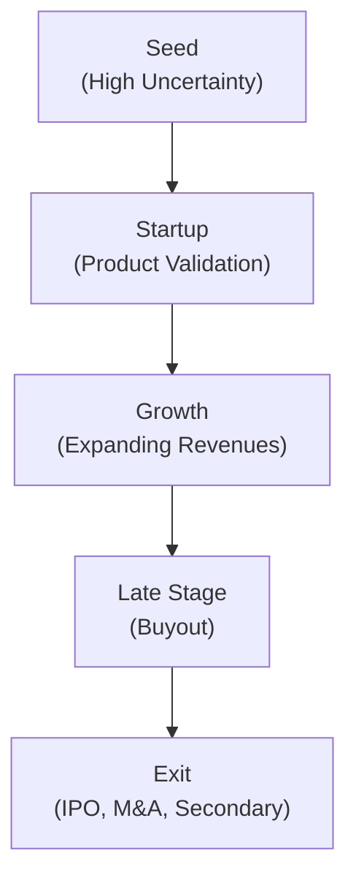
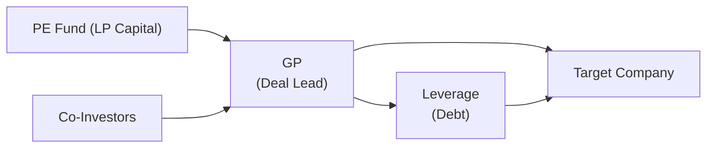
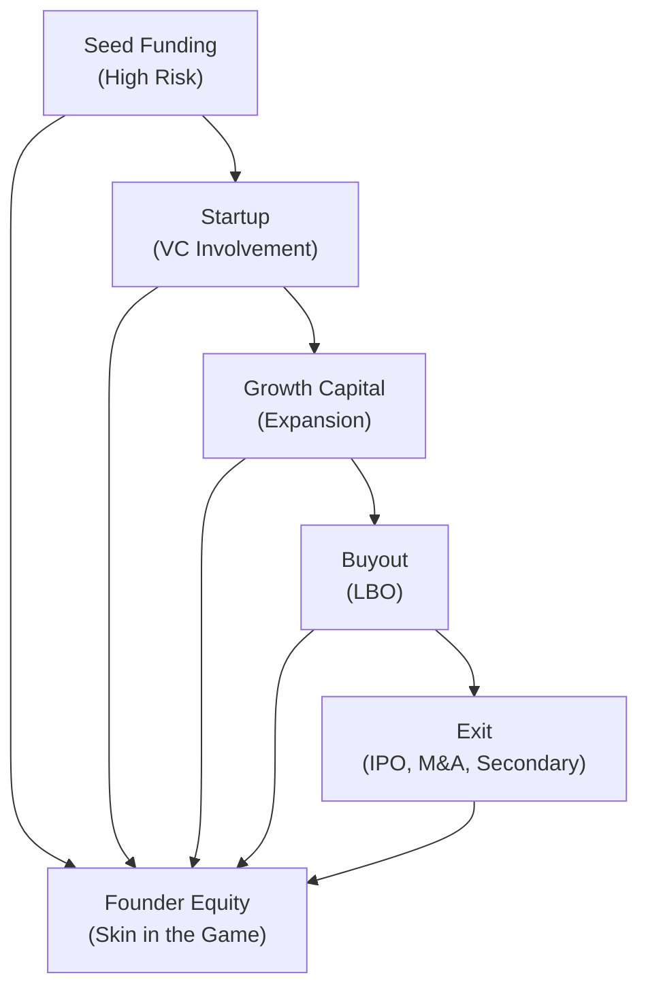

## Introduction

Ever sit down with a friend who’s about to launch their big dream startup, and they excitedly say, “I’ve got my first check from a venture investor!”? Then, a couple of years later, you see them navigate hiring experts, building out new product lines, and—if they’re lucky—celebrating a big buyout offer. Private equity (PE) is kind of like that friend (on an institutional scale). It follows a company’s growth from those shaky but ambitious early days all the way to fully mature operations, offering different forms of capital, expertise, and strategic direction at each step. 

In this section, we’ll explore how private equity strategies are mapped to a company’s path: from the precarious seed stage through bustling growth spurts, right up to the big leagues of buyouts and beyond. We’ll talk about the risks, returns, and investment styles that define each phase, with a few anecdotes and practical takeaways. We’ll even sprinkle in some diagrams and a little math. After all, who doesn’t love a good IRR formula?

## Understanding the Corporate Life Cycle and Private Equity Alignment

Private equity exists in a dynamic interplay with companies at various life stages. Each phase poses distinct risk levels and capital needs, but also unique value-creation opportunities. The broad life cycle stretches across:

• Seed Funding: The earliest stage, typically for entrepreneurs with big ideas, minimal revenue, and lots of uncertainty.  
• Startup Funding: After proving concept viability, companies need capital for product development and initial market entry.  
• Growth Stage: Once a firm has traction, it seeks funds to scale marketing, refine governance, and expand geographically or digitally.  
• Late Stage (Buyout): Established companies with stable cash flows can attract buyout investors aiming to optimize performance.  
• Mezzanine/Structured Capital: A flexible layer of financing that can be employed at various junctures for expansions, acquisitions, or transitions without ceding too much ownership.  

PE investors analyze each phase’s specific risk–return profile and provide not only capital but also operational guidance, governance structures, and strategic insights to keep a company on track.

Below is a simple visual diagram illustrating these stages as a company progresses:

## Early Stage Strategies

It’s often said that early stage (seed and startup) funding is where dreams clash with reality. You might have a company started by two engineers in a garage, heavily reliant on technology or novel business models. 

At this stage, uncertainty is sky-high because the product may still be in prototype. However, the potential payoff can be huge if the startup gains traction. Many venture capital (VC) firms, which are part of the broader private equity ecosystem, specialize in this domain. Their approach involves:

• Intensive Due Diligence on Founders: Does the team have the technical chops, the grit, and the vision to pivot when markets shift?  
• Financial Projections: Often more “art” than science here—forecasts heavily rely on assumptions about market adoption.  
• Operational Support: VCs at the seed or startup stage might provide direct help in hiring the right people, developing a go-to-market strategy, and establishing a basic governance framework.

### Personal Anecdote

I once chatted with a founder who was surprised that their investor asked about personal budgeting habits—“They wanted to see how disciplined I was outside of work,” the founder said. For early-stage companies, backers look for discipline in every aspect of the founder’s life, because it can foreshadow how they’ll handle company finances.

### Risk and Return

Early-stage investments can generate multi-bagger returns if, for instance, the startup becomes a category leader. But the default risk is substantial. The typical phrase tossed around is “nine out of ten startups fail,” though that may differ by industry. But the upside from the one that succeeds can more than compensate for the losses.

For those preparing for the CFA Level III exam, recall that these high-risk assets, which are characterized by negative or near-zero current income, require specialized discount rates to capture their uncertainty. You might see scenario-based exam questions asking you to estimate expected returns for a seed-stage project. The trick is balancing the discount rate with the estimated growth trajectory—both are extremely challenging to pin down.

## Growth Stage Strategies

Once a company has established revenue streams (but still isn’t fully mature), the conversation shifts from survival to scale. Growth-stage investors often help businesses ramp up operations, expand internationally, and refine their product lines. 

These investors perform a thorough analysis of:

• Revenue Trajectory: Are revenues growing at 30% year-over-year or 300%?  
• Market Penetration: Estimated total addressable market (TAM) vs. actual market share.  
• Organizational Maturity: Is the company ready for professional leadership? Are there robust internal controls?  

Growth equity deals typically come with stronger governance requirements. The PE firm may appoint board members, overhaul HR practices, and implement performance metrics. Some of the biggest successes in private equity land come from growth-stage companies that leverage industry tailwinds, particularly in tech, consumer goods, or healthcare.

### Example

Imagine a mid-sized online grocery delivery startup that has proven product–market fit in one major city. A PE growth investor might step in to fund a national expansion, invest in better logistics technology, and hire an executive team to handle complexities of a bigger market footprint. Over the next few years, that might lead to triple or quadruple revenue, setting the stage for either a buyout or a public listing.

Growth-stage investing is still risky—companies might stumble on supply-chain bottlenecks or competition—but the risk is noticeably lower than at the seed or startup stage. Typically, the due diligence here also includes more robust financial modeling.

## Late Stage Strategies (Buyouts)

When we hear the phrase “private equity,” many of us think of leveraged buyouts (LBOs). This is a quintessential late-stage strategy, where mature companies with steady cash flows are acquired—often using a blend of equity from the PE fund and debt from banks or bond markets. 

### How Buyouts Work

In a buyout transaction, the PE firm (a general partner, GP) teams up with limited partners (LPs) and possibly co-investors to form a fund that takes a controlling stake in the target company. Leverage is used to boost potential returns: the more debt is added to the capital structure, the higher the equity returns can be—assuming everything goes right.

But how do we measure “going right”? The IRR (internal rate of return) is the most commonly cited performance metric in private equity, capturing the time-sensitive nature of cash flows. This formula is one you’ve probably seen many times, but here’s a quick refresher in KaTeX:


\text{IRR} = r \quad \text{such that} \quad \sum_{t=0}^{T} \frac{C_t}{(1+r)^t} = 0


Where Cₜ represents the net cash flow at each period t, and T is the final period (often at exit).

Below is a simplified illustration of a buyout’s structure:

### Drivers of Value Creation in Buyouts

• Operational Improvements: Restructuring, cost optimization, boosting revenue drivers (e.g., product cross-selling).  
• Financial Engineering: Utilizing debt to magnify returns. But higher leverage can amplify losses if the company underperforms.  
• Multiple Expansion: PE firms aim to sell the company at a higher valuation multiple than it was acquired for.  
• Governance Overhaul: Installing new executive teams, aligning incentives, and setting performance targets.

## Mezzanine and Structured Capital

Mezzanine financing sits snugly between traditional debt and equity. Companies that don’t want to dilute existing owners but still need capital can tap into mezzanine structures. Under these deals:

• The investor provides funds in exchange for a subordinated loan (with higher interest than senior debt).  
• There may be warrants or conversion features, letting the mezzanine investor convert part of the debt into equity if certain conditions are met.  

You’ll often see mezzanine capital in later stages—maybe a family-owned business aims to expand but doesn’t want to give up control, or a growth-stage firm wants a cash infusion while waiting for a bigger next-round or buyout. 

For the exam, remember that mezzanine also appears in advanced capital structures for buyouts. It’s a layer that provides flexible financing solutions: costlier than senior debt but cheaper than straight-up equity. 

## Macroeconomic, Industry, and Regulatory Considerations

Private equity strategies don’t operate in a vacuum. External factors can shape strategy selection:

• Macroeconomic Cycles: In recessions, early-stage companies might struggle to raise capital (although certain distressed investors emerge). During expansions, buyouts often flourish because leverage is cheap and credit markets are open.  
• Industry Cyclicality: Certain sectors—like energy or real estate—can rotate in and out of favor, affecting how private equity invests across the life cycle.  
• Regulatory Environment: Policy changes, antitrust regulations, or new capital-controls might impact buyout structures or limit certain types of cross-border deals.  

If the central bank tightens monetary policy, interest rates rise. That directly influences leveraged buyouts (cost of debt goes up) and might make some buyouts less attractive. Meanwhile, for an early-stage biotech startup, the cost of capital is always high, but it might get worse if investors become more risk-averse in a tighter economy.

## Continuous Monitoring, Governance, and the Investment Thesis

One core theme in private equity is ongoing monitoring and governance. No matter the life-cycle stage, a well-structured governance framework helps ensure that the original investment thesis remains on track. This can include regular board meetings, key performance indicators (KPIs), and an agreed-upon strategic roadmap. 

• At the startup stage, governance might be less formal, focusing on founder accountability and basic financial oversight.  
• In the growth stage, it’s all about building professional decision-making bodies, implementing clearer policies, and occasionally bringing in a CFO or COO.  
• By the buyout stage, corporate governance is typically robust, with detailed policies, committees, and a strong board overseeing major decisions.

Failing to adapt governance as the company matures is a common pitfall. You might see a scenario question in the CFA exam describing a growth-phase company trying to handle big expansions without a professional process, leading to operational bottlenecks. The question might ask how the private equity sponsor should intervene. The best answer typically involves clarifying lines of authority, implementing new reporting systems, and possibly adding independent board members to bring in external expertise.

## Real-World Illustration

Let’s say you have Company X, a tech startup that initially raised a seed round from a couple of angel investors. Roughly 18 months later, the product is validated in a small niche market, so they pitch to a venture capital fund for a $5 million Series A. With that capital, the founders hire a proper marketing team and—after some real hustle—grow revenues substantially. 

Soon, Company X is featured in industry reports, and its valuation soars. By the time a growth-focused PE fund invests $30 million in Series B, the company has global ambitions. The new investors help them refine their supply chain, introduce enterprise-level governance, and attract top-tier talent. Fast-forward: a bigger, more formal private equity firm then orchestrates a buyout of Company X when it’s hitting $100 million in annual revenue. They use both internal funds and leveraged financing to take the company private, streamline operations, and set the stage for an IPO exit three years later.

## Diagrams for Life-Cycle and Capital Flow

Here’s a simplified flow of how capital and strategic support might evolve:

The node labeled “Founder Equity” (Z) interacts with each stage, signifying that the founders often remain involved (with dilution at each finance round) until the final exit.

## Common Pitfalls and Best Practices

• Over-Leveraging in Buyouts: Borrowing too much can amplify returns, but it also raises the breakeven bar. In an economic downturn or industry slump, that can spell trouble.  
• Underestimating Operational Complexity: Startups might pivot multiple times; buyout candidates might need major restructuring. PE sponsors must plan for these transitions.  
• Ignoring Regulatory Shifts: Whether it’s changes in tax law, labor law, or cross-border regulations, ignoring these can derail post-investment expectations.  
• Failing to Align Incentives: Carried interest clawback provisions and performance-based vesting can help align GPs, LPs, and management teams.  

Best practices revolve around thorough due diligence, scenario analysis, robust financial modeling (especially for the CFA exam, you should be comfortable with analyzing sensitivity in IRRs), and building strong governance from day one.

## Exam Tips: Navigating Private Equity Lifecycle Questions

• Pay attention to the stage of the company in the scenario. The appropriate valuation method and risk assessment differ dramatically from early stage to buyout.  
• Know the major metrics: IRR, TVPI (Total Value to Paid-In), DPI (Distributions to Paid-In), and MOIC (Multiple on Invested Capital). These might appear in a question about performance measurement or in a “recommend the best investment” prompt.  
• Don’t overlook qualitative aspects: The exam often focuses on the role of governance, the alignment of incentives, and broader strategic concerns.  
• Time Management: Essay questions on the Level III exam can be extensive. Quickly identify each stage’s risk–return profile and typical financing structures to respond concisely yet comprehensively.  

## Conclusion

Private equity strategies across the corporate life cycle are like a carefully choreographed dance: each step must be perfectly timed, attuned to the company’s unique rhythm, and flexible enough to pivot when the environment changes. Understanding how seed funding differs from a leveraged buyout—and then layering in macroeconomics, governance, and operational factors—can provide you with the holistic view the CFA Program expects at Level III.

If there’s one takeaway, it’s that private equity isn’t just about throwing money at a company. It’s about tailoring the investment approach, operational support, and strategic oversight to meet a company’s evolving needs over time. That’s exactly why PE is such a powerful force in global markets—and why it plays a critical role in so many investors’ portfolios.

## References and Further Reading

• Feld, B. & Mendelson, J. (latest edition). “Venture Deals.” Wiley.  
• Appelbaum, E. & Batt, R. (2014). “Private Equity at Work.” Russell Sage Foundation.  
• PitchBook and Preqin: Real-time data on private equity deals and performance.  
• CFA Institute Program Curriculum, Level III (Private Investments).  

---

## Test Your Knowledge: Private Equity Strategies Across the Corporate Life Cycle



### Which of the following best characterizes the seed funding stage?

- [ ] Low uncertainty and robust revenue streams
- [x] Minimal or no revenue, high uncertainty, and an unproven business model
- [ ] Moderate revenue and stable cash flows
- [ ] A proven exit path with minimal operational risks

> **Explanation:** Seed funding is typically the earliest investment in a company’s lifecycle when the business model is not yet validated. Revenue is usually minimal or nonexistent, and high uncertainty is the norm.

### What is a distinguishing hallmark of a growth-stage private equity investment?

- [x] Funding an established, rapidly expanding company to scale operations
- [ ] Purchasing a mature company using mostly debt
- [ ] Providing the very first finance to conceptual businesses
- [ ] Offering capital that easily converts to common equity in the event of default

> **Explanation:** Growth equity supports companies that have a proven product and growing revenue; the focus is on scaling, enhancing governance, and expanding market share.

### In a leveraged buyout, why is the use of debt so common?

- [ ] It does not add risk to the target company
- [ ] It never requires interest payments
- [x] It magnifies returns on the equity portion if the company performs well
- [ ] It lowers the cost of capital to near zero

> **Explanation:** Debt is used to amplify returns (sometimes significantly), but this leverage also increases the company’s financial risk.

### Which performance metric focuses on total returns relative to contributed capital, regardless of time?

- [ ] IRR
- [ ] DPI
- [x] MOIC
- [ ] NPV

> **Explanation:** MOIC (Multiple on Invested Capital) compares the total value (realized or unrealized) to the total invested capital, ignoring how long the investment was held.

### In an early-stage investment, which factor tends to be the most important in due diligence?

- [x] The founders’ capability and track record
- [ ] The existing dividend payout ratio
- [x] The discount rate set by the Federal Reserve
- [ ] The firm’s proven five-year financial statements

> **Explanation:** In early-stage deals, investors usually place strong emphasis on founders’ skills, experience, and dedication. There are few or no financial statements to assess.

### Which statement is correct regarding mezzanine financing?

- [ ] It is senior to all debt
- [ ] It includes no possibility of conversion to equity
- [x] It is often subordinated and can include warrants or conversion features
- [ ] It is the first source of equity capital in a startup

> **Explanation:** Mezzanine financing often takes a subordinated position to senior debt, sometimes includes warrants or convertible features, and is priced higher than senior debt but can be less dilutive than pure equity.

### What is the primary advantage of mezzanine financing for a family-owned business?

- [ ] It completely eliminates the need for governance
- [x] It provides capital without requiring large equity dilution
- [ ] It offers risk-free coupon payments
- [ ] It mandates the business go public post-investment

> **Explanation:** Family-owned businesses might prefer mezzanine deals when looking for growth capital but wishing to retain ownership and control.

### During a credit crunch and rising interest rates, which stage of private equity investing is most likely to face challenges from reduced availability of leverage?

- [ ] Seed funding
- [ ] Startup funding
- [ ] Mezzanine investments
- [x] Leveraged buyouts

> **Explanation:** LBOs generally rely heavily on leverage. When credit becomes expensive or less available, buyout transactions become more difficult to finance.

### A private equity fund invests in a mid-stage startup to help it expand product lines and enter new markets. Which key activity is most likely to be part of the investor’s role?

- [ ] Initiating a hostile takeover of the startup
- [x] Providing operational support and strengthening corporate governance
- [ ] Eliminating all management employees
- [ ] Relocating the entire company overseas

> **Explanation:** Growth-stage investors typically bring resources, strategic guidance, and enhanced governance, rather than dismantling management.

### True or False: Private equity investments remain unaffected by macroeconomic conditions due to their long-term focus.

- [ ] True
- [x] False

> **Explanation:** Macroeconomic trends (such as interest rates, credit availability, and economic cycles) greatly influence PE deals, both in early-stage financing and in leveraged buyouts.


