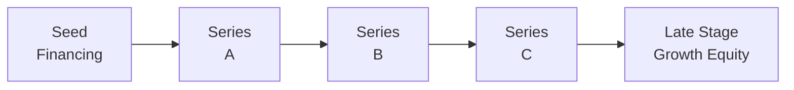

## Overview

Venture Capital (VC) and Growth Equity investments can feel like navigating two distinct galaxies in the private markets universe—one brimming with freshly minted entrepreneurs eager to conquer the world (and maybe still learning to read a basic balance sheet), and the other featuring more established companies poised to scale up for profitable growth. In this section, we’ll discuss how these two investment approaches differ, how they’re structured, and why they matter to you as a potential investor, portfolio manager, or aspiring CFA® charterholder preparing for the Level III exam.

This topic builds on the prior discussion of private equity’s role across the corporate life cycle (see section 3.1) and ties in with broader considerations of risk-return trade-offs, capital structures, and exit strategies. We’ll examine how companies move through multiple funding rounds, from scrappy start-ups raising seed money to later-stage organizations seeking capital injections for global expansion—and highlight the unique nuances that can make or break these deals.

## The Venture Capital Ecosystem

Venture Capital deals typically revolve around early-stage or emerging companies. These businesses usually have:

• Minimal operating history or profitability.  
• A bold vision for a next-generation product or service.  
• Significant uncertainty surrounding revenue growth and market acceptance.

While the risks can be daunting—companies can go belly-up in a matter of months—VC investors hope that a small fraction will achieve “home-run” returns. In many cases, these outsized returns from a handpicked few compensate for the losses of the majority of ventures that didn’t quite take off.

You might see naming conventions like “Seed Round,” “Series A,” “Series B,” and beyond. Each subsequent round typically features higher valuations (ideally), more sophisticated investor rights, and greater scrutiny of the company’s product-market fit, traction, and financial viability. A core aspect of venture capital is the acceptance of uncertainty and willingness to place bets on the founders’ ability to execute an ambitious plan.

### The Role of the Founding Team

In a VC context, the founding team is often the determining factor for funding, especially in the earlier rounds such as Seed or Series A. Investors look for:

• Entrepreneurial grit: Is the team resilient enough to pivot when market conditions or consumer demands shift?  
• Technical expertise: Do they understand the technology (or processes) necessary to deliver their planned solution?  
• Passion and alignment: Do the founders align culturally and strategically with investors’ objectives?  

It’s no surprise that a well-rounded team, often with a track record of previous start-up successes, can secure significantly higher valuations right from the start.

### Rounds of Financing

To visualize the path from raw idea to more established enterprise, the following diagram depicts a simplified journey through a variety of funding stages in venture capital, culminating in possible growth equity investment:

• Seed Financing: Typically used to develop a prototype, conduct market research, or build an initial customer base.  
• Series A: Used for scaling the product and hiring key personnel once the business idea shows some traction.  
• Series B, C, etc.: Progressively larger rounds, with funds aimed at ramping up operations, expanding into new markets, and refining governance structures.

## Growth Equity: Bridging the Gap

Growth Equity invests in relatively mature companies that might already generate revenue in the tens or hundreds of millions yet still need capital to:

• Expand into new geographies.  
• Launch new product lines.  
• Acquire smaller competitors.  
• Streamline operations and boost profitability.

Unlike early-stage VC investments, Growth Equity often emphasizes efficient growth and stable financial performance. Investors in this category usually look for:

• Established product-market fit and consistent revenue.  
• Evidence of a workable scaling plan.  
• Strong management teams with operational track records.

Though the companies are less risky compared to very early-stage start-ups, Growth Equity deals still offer significant upside potential if, say, the (sometimes) mid-market company is on a trajectory to become a global brand.

## Investment Process and Due Diligence

While the fundamental principles of equity investing remain the same—analyzing existing financial statements, forecasting growth, and understanding the competitive space—VC and Growth Equity investors face additional layers of complexity:

• Evaluating the Founding Team (VC) and Management Bench (Growth Equity): In VC, the team’s grit, passion, and vision can be more critical than historical numbers, because—well—there might not be many numbers to crunch. In Growth Equity, you also look at the team’s capacity to handle expansion, manage complexity, and sustain profitability as the business scales.  
• Market Opportunity and Competition: For both VC and Growth Equity, it’s crucial to analyze the total addressable market (TAM) and the competitive dynamics. However, in VC, market sizing can be more speculative, relying on new or unproven technologies. Growth Equity typically deals with more established industries where management can forecast demand with greater confidence.  
• Burn Rate and Runway: Venture-backed companies often have a higher “burn rate”—the speed at which they use available cash. The “runway” is how many months of operations are left before that cash runs out. This factor is critical for projecting when new funding will be needed. Although Growth Equity investments also consider burn rate, the focus is often on stretching capital efficiently to enhance operating leverage rather than pure survival.  
• Historical Financials: Growth Equity typically involves more robust financial statements than you would see with a pre-revenue start-up. Investors look at sales growth, gross margins, and the path to operating profitability.  
• Operational Scalability: Growth Equity investors delve into whether the target firm’s systems can handle a surge in demand. Is the tech infrastructure stable? Is there a plan to manage thousands of new customers instead of just hundreds?

## Typical Deal Structures

Many deals in VC and Growth Equity utilize preferred stock, with rights ensuring that investors get priority on liquidation or exit events. You might spot terms like liquidation preference, anti-dilution provisions, board seats, and protective covenants. These terms help investors manage risk and align incentives with founders:

• Liquidation Preference: Determines that preferred investors get paid first—often their initial investment—before the common shareholders in a liquidity event (such as an acquisition). This can be “1x,” “2x,” or more, indicating the multiple of their original investment they recover in a liquidity scenario.  
• Anti-Dilution Provision: Ensures that if later funding rounds occur at a lower valuation—a “down round”—existing investors won’t see their equity stake excessively diluted. There are different methods, including broad-based weighted-average anti-dilution, which is more common and less punitive to founders than the older “full-ratchet” approach.  
• Board Representation and Protective Rights: Investors often negotiate a seat on the board or at least observer rights. They may also reserve veto power over decisions such as additional financing, major capital expenditures, or leadership changes.  

In Growth Equity, while many of these rights are still utilized, the terms may lean more heavily toward cooperation than control. The target is a business capable of functioning relatively independently, and the Growth Equity partner often steps in to facilitate expansions, acquisitions, or key strategic hires.

> It’s worth remembering that these terms shape the alignment of interests. If you’re the LP (Limited Partner) investing in a VC or Growth Fund, you want to ensure the GP (General Partner) negotiates protective provisions that help mitigate risk while still preserving relationships with strong founding teams.

## Financing Rounds and Valuations

In practice, each new round brings a fresh negotiation on valuation, and with that, potential dilution for the current shareholders. Founders have to weigh the trade-off between raising additional capital to fuel growth and diluting their ownership stake. If the market perceives the company’s progress is below expectations, the next round could be priced below the previous valuation—an event known as a “down round.” This can negatively affect employee morale, hamper the company’s reputation, and trigger anti-dilution clauses that can shift the ownership structure significantly.

Conversely, companies that really deliver on their milestones can see step-ups in valuation as they progress from Series A to B, B to C, and so on—often leading to high expectations for a successful exit, either via IPO or acquisition.

## Exit Pathways

A prime motivation for investors is how (and when) they can eventually exit the investment. Common pathways include:

• Initial Public Offering (IPO): Taking the company public offers a chance for original investors to cash out or partially realize their gains. Historically, IPOs have tended to be a hallmark for venture-backed “unicorns.”  
• Mergers & Acquisitions (M&A): Both large corporations and private equity buyers may acquire VC- or Growth Equity-backed firms to fill product gaps, expand their market presence, or leverage the acquired team’s talent.  
• Secondary Transactions: Later-round investors (or specialized secondary funds) may offer to buy out earlier-stage investors or existing shareholders. This is often used by VCs to lock in returns without waiting for an IPO or M&A event, particularly when the portfolio company remains private longer than originally planned.

## Real-World Example

Consider a software-as-a-service (SaaS) start-up that initially raised a $2 million Seed Round. The founding team had a promising prototype but needed funds to refine technology and land early enterprise customers. After demonstrating strong user retention and an expanding client base, they secure a $10 million Series A at a higher valuation, structured with a 1x liquidation preference. Growth accelerates, but the company is still not generating positive cash flow. By the time Series B arrives, they must raise $30 million to scale up globally. Because their metrics remain strong, they negotiate favorable valuations, preserving founder ownership. If eventually acquired by a tech giant for a hefty premium, the early VC investors benefit from their liquidation preferences plus the capital gains from equity conversion—all part of the standard venture capital playbook.

## Common Pitfalls and Best Practices

• Over-Dilution: Founders who repeatedly raise capital without carefully considering ownership stakes may lose decision-making power—and ownership.  
• Misaligned Interests: Poorly structured liquidation preferences or anti-dilution provisions can cause friction among investors and founders.  
• Poor Governance: Lack of board oversight can lead to mismanagement or strategic drift.  
• Underestimated Burn Rate: Failing to raise enough capital—or setting unrealistic revenue timelines—can quickly drain resources, forcing a fire-sale or shut-down.  
• Overlooked Exit Readiness: Some companies wait too long for a “perfect” IPO window, only to miss the bullish market conditions or get overshadowed by new competitors.

On the bright side, employing robust due diligence, maintaining open lines of communication, aligning incentives, and fostering a healthy board dynamic typically lead to better outcomes. Investors that demonstrate genuine partnership often see improved deal flow from founder networks, reinforcing success in subsequent fund-raising cycles.

## Using a Simple Valuation Approach

While advanced methods (like discounted cash flow or comparable company analysis) often apply, many early-stage valuations rely on negotiations anchored by typical ownership targets and precedent deals. It’s not uncommon to see rough heuristics—like wanting to own a certain percentage for a given round, alongside performance milestones the company must satisfy—to justify the post-money valuation.

Occasionally, you’ll see short-hand approaches or “the rule of thumb method,” especially in seed-stage transactions. With Growth Equity investments, more robust multiples based on EBITDA, revenue, or user metrics become the norm. Here’s a simple representation of post-money valuation:

Let:
• P = pre-money valuation  
• I = amount of new investment  

Then post-money valuation, V, is:

V = P + I

If the investor invests I in return for x% ownership, that implies:

x% = I / V

It’s a straightforward formula, but don’t forget the bigger puzzle—to figure out how P gets decided in the first place, a mix of intangible factors like technology uniqueness, market sentiment, and competitive nature definitely come into play.

## Summary and Best Practices

Venture Capital invests in uncertain but potentially game-changing business ideas; Growth Equity invests in companies with established track records that need considerable capital to expand further. Both involve careful due diligence, structural negotiation, and a clear path to eventual exit.

Well, if you ask me, it’s all about balancing hope and hype with real-world traction. Early-stage deals will revolve more around the founding team’s drive, product differentiation, and just plain hustle, while Growth Equity demands a clearer operational track record, proven market traction, and good prospects for profitable scale.

For CFA Level III candidates, these private equity segments demand an understanding of how to balance a portfolio’s risk and return, how to weigh intangible factors (founder potential, brand recognition, or intangible assets), and how to manage capital structure complexities that can arise from multiple financing rounds.

## Final Exam Tips

• Familiarize yourself with typical VC and Growth Equity term sheets. You could easily see a question testing your understanding of liquidation preferences or anti-dilution clauses.  
• Practice essay/constructed-response questions where you must recommend an action based on incomplete financial projections and intangible considerations, such as team strength or brand potential.  
• Learn to compare and contrast venture capital risk-return profiles against Growth Equity, referencing how these might fit into broader asset allocation strategies (see also section 3.6).  
• Be prepared to analyze the potential impact of subsequent funding rounds, particularly focusing on down rounds, subsequent valuations, and the effects on existing investors.  
• Time management is key: item-set questions might require quick ratio calculations or scenario analysis (e.g., if the exit is higher or lower than expected, how does the liquidation preference affect returns?).  

In short, try to stay nimble, think about real-world complexities, and prepare for scenario-based questions that require you to weigh multiple factors, from market timing to governance considerations.

## References

• Bussgang, J. (2011). Mastering the VC Game. Portfolio/Penguin.  
• National Venture Capital Association (NVCA). Model Legal Documents. https://nvca.org/model-legal-documents/  
• GrowthCap Advisory. Growth Equity Manifesto. https://growthcapadvisory.com/  
• CFA Institute. (2025). CFA® Program Curriculum Level III, Private Markets pathway.

------------------------------------------

## Test Your Knowledge: Venture Capital and Growth Equity Investments



### A venture capitalist is evaluating a start-up that has strong founder credentials but very limited historical data. Which of the following factors is most critical in early due diligence?
- [ ] Tangible asset valuation
- [ ] Detailed five-year financial history
- [x] Quality and track record of the founding team
- [ ] Established profit margins
> **Explanation:** In early-stage venture capital, the founding team’s reputation, skills, and adaptability often outweigh historical financial data or fixed-asset values.

### Which statement best distinguishes Growth Equity from typical Venture Capital?
- [x] Growth Equity focuses on more established companies with revenue traction.
- [ ] Venture Capital typically demands mature, profitable enterprises.
- [ ] Growth Equity usually funds pre-revenue start-ups.
- [ ] Venture Capital invests in stable, dividend-paying entities.
> **Explanation:** Growth Equity typically invests in companies with proven revenue models that need capital to scale, while VC usually concentrates on earlier, riskier stages.

### When a new investment round is priced below the valuation of a previous round, this event is called:
- [ ] A multiple step-up
- [ ] An exit premium
- [x] A down round
- [ ] A conversion event
> **Explanation:** A down round refers to a financing round in which the company's valuation is lower than in any prior round.

### In a typical preferred stock term sheet, a liquidation preference ensures:
- [x] Certain investors are paid first upon a liquidation event
- [ ] Founders maintain their original ownership
- [ ] Common shareholders never get proceeds from an exit
- [ ] Convertible notes automatically convert at a discount
> **Explanation:** A liquidation preference mandates that preferred shareholders receive their invested capital (sometimes with a multiple) before other stakeholders.

### If a company has a 2x liquidation preference for its Series A investors, it means:
- [ ] Investors receive two times the exit proceeds before founders earn anything
- [ ] Investors automatically double their ownership at exit
- [x] Investors recoup twice their original investment amount before common shareholders are paid 
- [ ] Investors get two board seats
> **Explanation:** A 2x liquidation preference gives investors the right to recover double their original investment from exit proceeds before common shareholders participate.

### Which of the following is an advantage of using broad-based weighted-average anti-dilution?
- [x] It is less punitive to founders in the event of a down round
- [ ] It guarantees full ratchet protection for investors
- [ ] It exclusively benefits common shareholders
- [ ] It forbids further capital raises at lower valuations
> **Explanation:** Broad-based weighted-average anti-dilution applies a more balanced formula that includes all shares outstanding, thus limiting the impact on founders compared to a full-ratchet provision.

### A Growth Equity investor is deciding whether to fund a tech company planning to acquire several smaller competitors. Which factor is likely most critical in this decision?
- [ ] The founding team’s personal net worth
- [x] The company’s ability to integrate acquisitions effectively
- [ ] The discount rate in a DCF model
- [ ] The usage of convertible debt structures
> **Explanation:** Growth Equity investors pay particular attention to the firm’s operational and managerial capacity to execute an acquisition strategy smoothly, ensuring value creation is realized.

### Which statement about expansion rounds for late-stage companies is most accurate?
- [x] They often require more sophisticated due diligence focused on scalability and operational efficiency.
- [ ] They only rely on convertible notes.
- [ ] They always have lower valuations than earlier rounds.
- [ ] They preclude any form of liquidation preferences.
> **Explanation:** Late-stage financing typically drills into operational readiness for large-scale growth, requiring more complex due diligence and proven track records.

### What is a common concern when a company repeatedly raises capital?
- [ ] Increased founder salary
- [ ] Immediate IPO constraints
- [x] Excessive dilution of existing shareholders
- [ ] Mandatory stock buybacks
> **Explanation:** Frequent capital raises can lead to significant dilution of ownership for early investors and founders.

### A firm planning an IPO exit might:
- [x] Provide existing shareholders with liquidity via a public offering
- [ ] Acquire shares from other listed companies
- [ ] Convert common equity into debt
- [ ] Avoid any regulatory filings
> **Explanation:** An IPO exit involves listing the company on a public exchange, allowing investors to sell their shares to the public, thus achieving liquidity.


