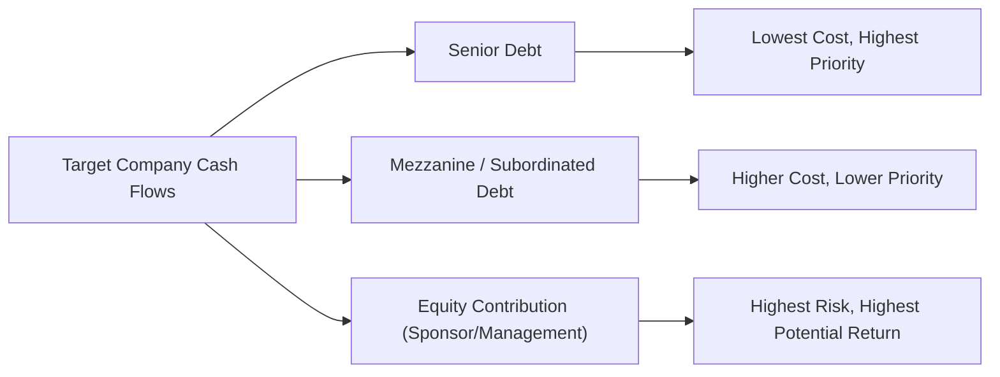

## Overview

Buyout equity investments involve acquiring either a controlling or a significant stake in a company—one that typically has stable, predictable cash flows, a proven business model, and room for operational improvement. The overarching aim? Transform the company’s strategy, operations, and capital structure to generate strong returns for equity holders. 

But what do we really mean by “buyout” in private equity? Most often, “buyouts” are leveraged buyouts (LBOs), where the private equity (PE) sponsor finances a large portion of the purchase price with debt. That borrowed money is then serviced (interest and principal) by the cash flows of the target company. If everything goes according to plan, the debt magnifies the returns on the equity portion of the deal. Of course, with leverage comes added risk, so skillful forecasting, disciplined management, and effective oversight are essential.

I remember the first buyout deal I analyzed early in my career: I was sitting across from a CFO who was pretty excited about the possibilities that leveraging his firm's strong cash flow could bring. But at the same time, you could see the worry in his eyes—debt is a double-edged sword. Use it wisely, and you can supercharge returns; misuse it, and you might sink the entire enterprise. That tension has stayed with me, reminding me that LBOs aren’t just about fancy financial engineering. They’re about achieving a delicate balance between risk and reward, operational improvements, and strategic positioning.

## Key Components of a Leveraged Buyout

In a typical LBO, the private equity sponsor (often called the “financial sponsor”) identifies a target deemed undervalued or sub-optimally managed and attempts to acquire it using a high debt-to-equity ratio. The sponsor’s equity contribution might range from, say, 20% to 40% of the total purchase price—sometimes even less—while banks, bond investors, or alternative credit providers supply the remainder in the form of loans and high-yield bonds.

### Target Company Selection
Most buyout targets possess:
• Stable, predictable, and robust cash flows.  
• A mature business model with potential for cost optimization.  
• Tangible or intangible assets that can serve as collateral.  
• Management teams open to operational and strategic improvements.  

### Use of Leverage
Leverage is front and center in this process. By financing the deal primarily with debt, PE sponsors minimize the upfront equity requirement. Consequently, if the target meets or exceeds performance expectations, the equity holders can earn very high returns. 

Equally important, the target company’s existing assets and future cash flows serve as collateral for the borrowed funds. As interest rates and credit conditions shift dramatically, sponsors must remain vigilant about how the loan’s terms, covenants, and maturity schedule align with the target’s free cash flow.

### Financial Modeling and Forecasting
A sponsor typically builds a detailed financial model to estimate the company’s future free cash flow (FCF). This forecast must be conservative enough to cover interest expenses, principal amortization, and some margin for unexpected downturns. If everything lines up, the model projects an attractive internal rate of return (IRR) for the equity portion of the deal.

## Capital Structure in Buyout Transactions

Constructing the LBO capital structure can sometimes feel like assembling a puzzle. You can combine senior debt, subordinated debt, mezzanine financing, seller notes, high-yield bonds, or other creative financing instruments. How you place each piece depends on the sponsor’s appetite for risk, the target’s cash flow generation, credit market conditions, and the overall investment strategy.

### Senior Debt
Senior term loans and revolving credit facilities often form the foundation of the LBO capital structure. Senior debt tends to be the lowest-cost financing but comes with the strictest covenants and highest collateral claims. Lenders impose financial maintenance covenants (e.g., minimum interest coverage ratios) to manage their risk. 

### Subordinated (Junior) Debt
Below senior debt, we find subordinated debt or mezzanine financing. These loans carry higher interest rates (often with a fixed coupon and possibly an equity kicker). Because they sit behind senior debt in the capital structure, subordinated lenders face higher default risk. In exchange, they seek higher return.

### Equity
Equity from the buyout sponsor and sometimes from management forms the “skin in the game.” This equity portion aligns management and sponsor incentives and serves as the first-loss tranche. If performance falters, equity is wiped out before lenders bear losses.

Below is a simplified diagram (using Mermaid.js) that illustrates the layers of a typical LBO capital structure:

## The Role of Leverage in Value Creation

When an LBO sponsor acquires a mature company by funding a considerable portion of the purchase price with debt, the resulting interest payments reduce taxable income, often resulting in a tax shield. The sponsor also benefits from:

• Enhanced return on equity if operating performance improves (due to less equity in the capital stack).  
• Incentive for management to optimize cash flows—outperformance directly boosts equity returns.  

Leverage alone, though, can’t perform miracles. True value creation rests on additional operational improvements:
• Cutting inefficient costs or restructuring supply chains.  
• Developing new products or markets to grow revenues.  
• Consolidating smaller competitors through “add-on” acquisitions.  
• Overhauling management teams and corporate strategy.

## Management Buyouts (MBOs) and Management Buy-Ins (MBIs)

An MBO occurs when the existing management team acquires a significant (or complete) stake in the company, typically in partnership with a financial sponsor. Since internal managers know the company intimately, they can quickly capitalize on efficiencies or new growth avenues. That said, conflicts of interest can arise if management initiates the buyout while still obligated to serve existing shareholders.

In contrast, an MBI places an external management team in the driver’s seat. This scenario often happens when current management wishes to retire or step aside. The new management might bring fresh operational skill sets and strategic direction.

Both MBOs and MBIs hinge on the assumption that a motivated management team, holding substantial equity, will be laser-focused on maximizing the company’s performance and eventually its exit value.

## Risk and Return Considerations

Relying heavily on debt elevates multiple risk factors:

• Interest Rate Risk: Rising rates lead to higher interest expenses, potentially eroding free cash flow.  
• Refinancing Risk: Market conditions might impede or increase the cost of refinancing when loans mature.  
• Covenant Breaches: Financial covenants can be violated if performance falls below lenders’ thresholds, triggering penalties or even default.  
• Macroeconomic Downturns: A cyclical slowdown or recession could squash revenues and hamper the company’s ability to service debt.  

Additionally, sponsors face equity risk: if the expected cash flows do not materialize, or if the sponsor cannot exit the investment at an attractive valuation multiple, the returns on equity diminish rapidly.

### Example of IRR Calculation in an LBO
Assume a PE sponsor invests $100 million in equity to acquire a company with a total purchase price of $500 million. The rest—$400 million—comes from debt. Over five years, the sponsor focuses on operational improvements, aiming for an eventual sale at $700 million. If the sponsor’s net equity proceeds at exit are $300 million after repaying the debt (the rest of the sale proceeds went to settle the debt and transaction fees), we can approximate the equity IRR.

The equity IRR over five years is:

( (Exit Equity Value / Initial Equity Investment)^(1/n) ) – 1

Where:
• Exit Equity Value = $300 million  
• Initial Equity Investment = $100 million  
• n = 5 years  

Plugging in:  
( (300 / 100)^(1/5) ) – 1 = (3^(0.2)) – 1 ≈ 1.245 – 1 = 24.5%  

So, the sponsor would achieve approximately a 24.5% annualized return on the equity portion.

## The Lifecycle of a Buyout Investment

Once the buyout transaction closes, sponsors shift into value creation mode. Ideally, the sponsor and management team develop a 100-day plan that addresses immediate priorities, whether that might be entering a new geographic market or trimming overhead. Throughout the investment, owners track performance metrics—like EBITDA growth, cost reductions, or revenue synergy from acquisitions—and measure them against the original LBO model.

As time goes on and the debt is partially repaid, the target’s balance sheet might open up capacity for additional financing or a dividend recapitalization, allowing sponsors to “take some chips off the table” via a special dividend. Eventually, the sponsor completes an exit via a secondary buyout, a strategic sale, or an IPO. The timing depends on market conditions, the target’s progress, and the sponsor’s obligations to limited partners (e.g., in a 10-year closed-end fund structure).

## Exit Strategies and Timing

Deciding when and how to exit the investment is just as crucial as the acquisition itself. The main routes include:

• Strategic Sale (M&A): Selling the company to a larger corporation seeking synergies.  
• Secondary Buyout: Another PE firm acquires the target—common in mature private equity ecosystems.  
• IPO: Taking the company public if market conditions are favorable.  
• Dividend Recapitalization: Issuing new debt to fund a shareholder dividend, often as a partial exit.  

Sponsors weigh each option’s pros, cons, and market dynamics. A well-timed exit can drastically improve the sponsor’s final IRR, while a poorly timed one can leave millions on the table—or worse, lock in losses.

## Best Practices and Common Pitfalls

### Best Practices
• Prudent Capital Structure: Avoid excessively high leverage that leaves little margin for error.  
• Robust Due Diligence: Evaluate quality of earnings, cash flow drivers, customer relationships, and industry cycles.  
• Alignment of Interests: Management’s equity stake fosters accountability and entrepreneurial spirit.  
• Operational Expertise: Define a roadmap for growth, cost reduction, or strategic acquisitions.  
• Adaptability: Revisit assumptions regularly, especially in fluctuating interest-rate or commodity environments.

### Common Pitfalls
• Overoptimistic Forecasts: Overstating future EBITDA or ignoring competitive pressures can doom the deal.  
• Covenant Breaches: Inadequate working capital or insufficient cushion on financial covenants strains lender relationships.  
• Excessive Leverage: Too much debt can impede strategic reinvestment, research and development, or critical recruitment.  
• Weak Post-Acquisition Support: Without hands-on operational improvement, the sponsor risks stagnation.

## Illustrative Case Study

Imagine a mid-sized industrial manufacturing firm with $50 million in annual EBITDA and stable, though cyclical, revenues. A PE sponsor identifies an opportunity to streamline the firm’s operations (e.g., automating some manual processes, renegotiating supplier contracts, and trimming redundant product lines).

• Purchase Price: $400 million (8× EBITDA multiple).  
• Financing Mix: $100 million equity from sponsor and management, $300 million debt from a syndicate of banks and mezzanine lenders.  
• Operational Plan: Invest in updated machinery, rationalize product lines, aim to boost EBITDA to $60 million in three years.  

Within two years, the firm repays a portion of the principal from cash flow. By the third year, EBITDA hits $60 million, due in part to increased sales from enhanced product quality. Valuation multiples in the broader market remain steady at around 8×. The sponsor sees an opportunity to exit via a sale to a strategic buyer for $480 million. Part of that sale price covers the remainder of the debt, and the sponsor’s equity stake is worth substantially more than the original $100 million.

Of course, if markets fell into a recession and EBITDA declined, the sponsor might have deferred an exit or explored a dividend recap if credit markets were open and sentiment around cyclicals improved. This underscores the need for flexibility in deal structuring and patience in execution.

## Integration with Other Private Equity Considerations

In practice, buyout strategies dovetail with multiple aspects of private equity:

• Valuation Approaches (see Section 3.4): LBOs rely on discounted cash flow, comparable transactions, and market multiples.  
• Risk and Return Characteristics (see Section 3.5): Highly levered structures can command higher returns but also pose increased risk relative to other private equity segments.  
• Strategic Asset Allocation (see Section 3.6): Institutional investors often include buyout funds in their portfolio for diversification and absolute return potential.  
• ESG and Impact Investing (see Section 3.8): Financing social or environmental improvements can add intangible value and mitigate regulatory or reputational risk.

## Exam Tips

1. Be able to evaluate the effect of leverage on returns and risk. You’ll likely see scenario-based questions about changes in interest costs or the impact of slower-than-projected EBITDA growth.  
2. Practice LBO modeling basics: IRR calculations, coverage ratios, and scenario analyses remain top picks for advanced exam questions.  
3. Remember that operational improvements and strong governance are just as critical as the financial engineering.  
4. Familiarize yourself with different debt tranches and covenant structures (refer to Chapter 4). On the exam, watch for tricky disclaimers in the item sets about covenant thresholds or management’s growth assumptions.  
5. Understand exit strategies—especially how secondary buyouts and IPOs might differ in terms of valuation, speed, and sponsor control.  

## References and Further Reading

• Baker, G. P. & Smith, G. D. (1998). The New Financial Capitalists: Kohlberg Kravis Roberts and the Creation of Corporate Value.  
• Gilligan, J. & Wright, M. (2020). Private Equity Demystified: An Explanatory Guide.  
• CFA Institute. (Latest Edition). CFA Program Curriculum, Level III, Private Equity Readings.  
• Kaplan, S. & Strömberg, P. (2009). Leveraged Buyouts and Private Equity. Journal of Economic Perspectives.  

Below, test your mastery of key buyout equity investment concepts with sample exam questions suited to a Level III candidate.

## Test Your Knowledge of Buyout Equity Investments and Leverage Quiz



### In a leveraged buyout, which best describes the primary rationale for using debt financing?  
- [ ] Minimizing the need for a comprehensive due diligence process.  
- [ ] Allowing sponsors to receive government tax credits.  
- [x] Amplifying equity returns through leveraged exposure.  
- [ ] Eliminating refinancing risk over the holding period.  

> **Explanation:** Debt financing in LBOs maximizes the private equity sponsor’s potential gain on the equity portion by amplifying returns, but it also exposes the deal to greater risk, including repayment and refinancing concerns.

### Debt lenders in an LBO typically require which of the following to protect their interests?  
- [x] Financial covenants tied to leverage and interest coverage ratios.  
- [ ] Immediate conversion of debt to equity in all cases.  
- [ ] No direct claims on company assets.  
- [ ] Zero restrictions on the sponsor’s use of proceeds.  

> **Explanation:** Covenants help ensure the company remains financially sound and within agreed-upon leverage thresholds, offering lenders some protection.

### Which scenario would most likely put a heavily levered buyout at risk of default?  
- [x] A downturn causes a significant drop in the target company’s cash flows.  
- [ ] The private equity sponsor invests additional equity ahead of schedule.  
- [ ] Competitors enter adjacent markets unrelated to the target’s operations.  
- [ ] The target company increases its net operating margins slightly.  

> **Explanation:** When cash flows fall—due to economic or industry downturns—the target may struggle to service debt, eventually leading to possible default or covenant breaches.

### Under which condition might a management buy-in (MBI) be more appropriate than a management buyout (MBO)?  
- [ ] When the existing management team has excess cash to deploy.  
- [x] When entirely new management is believed to possess superior expertise for the firm.  
- [ ] When the current managers have complete ownership of the company.  
- [ ] When lenders refuse to offer any funding.  

> **Explanation:** An MBI occurs when a new external management team acquires control. This route is favored when the sponsor believes the external team’s operational or strategic capabilities can significantly enhance value.

### Which of the following is an advantage of a special dividend recapitalization prior to the final exit?  
- [ ] It increases the likelihood of covenant breaches.  
- [x] It allows the sponsor to return capital to investors without fully selling the company.  
- [ ] It removes debt from the company's balance sheet.  
- [ ] It eliminates the possibility of a future IPO.  

> **Explanation:** Dividend recapitalizations allow sponsors to monetize part of their investment by funding a dividend with new debt, thus returning capital to investors before the ultimate exit event.

### In a traditional LBO model, what best explains the “tax shield” effect?  
- [x] The interest paid on debt is generally tax-deductible, reducing taxable income.  
- [ ] Sponsors receive tax rebates for acquiring distressed assets.  
- [ ] Equity contributions are fully tax-deductible.  
- [ ] The elimination of capital gains taxes upon exit.  

> **Explanation:** Interest expense reduces pre-tax income, so the firm pays less in corporate taxes, creating a beneficial “tax shield.”

### Which risk is specifically associated with a highly leveraged capital structure?  
- [x] Refinancing and covenant default risk if the firm experiences cash flow volatility.  
- [ ] Excess liquidity risk from holding too much cash.  
- [x] Over-allocation of internal equity capital by the sponsor.  
- [ ] Scarcity of operational improvement opportunities.  

> **Explanation:** When leverage is high, even moderate dips in cash flow can jeopardize scheduled debt service requirements or cause covenant breaches.

### What distinguishes mezzanine financing from senior debt in an LBO structure?  
- [x] Higher cost of capital and lower priority in a default scenario.  
- [ ] Likelihood of zero interest payments over the loan life.  
- [ ] It’s fully guaranteed by the sponsor’s personal assets.  
- [ ] No documentation or covenants are required.  

> **Explanation:** Mezzanine debt sits below senior debt in the capital structure, entails higher risk to the lender, and thus commands a higher yield.

### What factor primarily influences the sponsor’s selection of an exit strategy for a buyout?  
- [x] Market conditions and valuation multiples for the target’s industry.  
- [ ] The sponsor’s inability to perform due diligence ahead of time.  
- [ ] The target firm’s philanthropic interests.  
- [ ] Regulatory prerequisites for changing the firm’s name.  

> **Explanation:** Sponsors look for favorable market conditions to sell or take public their portfolio company in order to maximize exit proceeds (and, consequently, returns).

### If the target firm’s free cash flow (FCF) declines significantly post-buyout, which statement is most likely to be true?  
- [x] The sponsor will suffer lower returns and may face covenant breaches.  
- [ ] The senior lenders will automatically convert debt into equity.  
- [ ] The sponsor has no recourse but to complete an IPO immediately.  
- [ ] The target’s valuation will always increase due to reduced tax liabilities.  

> **Explanation:** A material drop in free cash flow impedes timely debt repayments and could trigger covenant violations, reducing equity returns and elevating the possibility of financial distress.


