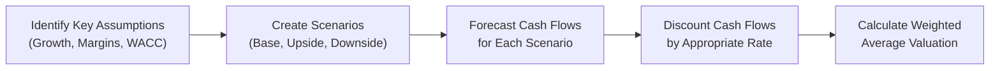

Valuation in private equity—whether you’re looking at early-stage venture capital deals, mid-phase growth equity, or mature buyouts—calls for a blend of art and science. And honestly, sometimes it feels a bit more like art, especially if you’re trying to value a tech startup that has no positive cash flow just yet. I remember a friend telling me about valuing a music-streaming startup, and we spent half the day brainstorming all sorts of “what if” scenarios—because let's face it, the future can look wildly different depending on how customers (or competitors) react.

Below, we’ll explore the primary valuation techniques, adjust them for the unique characteristics of each stage, and share useful examples. By the end, you’ll have a sense of how to back up your numbers confidently—whether you’re trying to pitch new investors, or passing insights along to your team about the risks and rewards in private placements.

## Key Valuation Techniques

Valuation in private equity typically revolves around several core methods:

• Discounted Cash Flow (DCF)  
• The Venture Capital (VC) Method  
• Comparable Company (Comps) Analysis and Precedent Transactions  
• Buyout (Leveraged) Approaches and Capital Structure Effects

We’ll tackle each method, along with the associated practical considerations, so you can see when and why one might be favored over another.

## Discounted Cash Flow in High-Uncertainty Environments

At its core, a DCF boils down to the principle that a business’s worth equals the present value of its future free cash flows. But many new CFOs quickly learn that applying DCF to an early-stage startup can get complicated—like big-time complicated. Traditional DCF calls for projecting future free cash flows over a certain forecast period and then discounting them at the company’s Weighted Average Cost of Capital (WACC). However, in the realm of venture capital, a few wrinkles pop up:

• Revenue is often unpredictable, especially in brand-new markets.  
• Operating margins can swing dramatically while the company perfects its product or service.  
• The discount rate typically includes a premium for early-stage risk.  
• Scenario-based valuations can help assess best-, base-, and worst-case outcomes.

In practice, you might run a DCF under multiple sets of assumptions for revenue growth, operating leverage, and exit multiples. For example, perhaps you foresee (1) a high-growth scenario with successful trademark approvals and wide market adoption, and (2) a moderate scenario with incremental growth, and (3) a meltdown scenario involving regulatory hurdles or strong new entrants. Each scenario comes with its own discount rate or, more commonly, the same discount rate with probability-weighted outcomes.

In formal notation, you might see a probability-weighted DCF approach like:


\text{Valuation} = \sum_{i=1}^{n} \Big( CF_i \times p_i \Big) \times \frac{1}{(1 + r)^i},


where pᵢ is the probability of scenario i, CFᵢ is the expected cash flow in period i under scenario i, r is the appropriate discount rate, and n is the forecast horizon.

## Venture Capital Method

The Venture Capital Method (VC Method) is a streamlined approach that’s often taught in business schools (and, yep, thorough analysis in many Level III CFA prep materials). It’s meant for early-stage companies where you have more intangible potential than actual historic earnings. You typically see a couple of steps:

1. Estimate the exit value of the company at the time of a future liquidity event (e.g., IPO or sale).  
2. Discount that exit value back to the present at the VC’s target return (often 20–70% per year, sometimes even higher for seed or pre-seed deals).  
3. Factor in the ownership stake the investor must hold to achieve their required returns.

The formula for the Post-Money Valuation (PMV) can look like this:


\text{PMV} = \frac{\text{Exit Value at time } t}{(1 + r)^t},


where r is the required return. Then, the Pre-Money Valuation (pre-raise) is:


\text{Pre-Money Valuation} = \text{PMV} - \text{Investment Amount}.


In practice, you see a bit more nuance than this straightforward formula once you include liquidation preferences, vesting schedules, and anti-dilution clauses. But as a baseline, the VC Method gives you a big-picture estimate. Because the discount rate is high, the valuation will often look lower than what you might get from a less risk-focused approach—this is precisely why entrepreneurs sometimes balk at the big equity stake requests from VCs.

## Comparable Company Analysis and Precedent Transactions

When a CFO or investment banker says “Let’s run the comps,” they’re referring to the process of comparing your target company to publicly traded peers or to former acquisitions in the same space. It’s often done with the help of trading multiples or transaction multiples, such as:

• Price/Earnings (P/E)  
• Enterprise Value/EBITDA (EV/EBITDA)  
• Price-to-Sales (P/S), especially relevant when earnings are nonexistent  

### Comparable Company Method

You collect data on a handful of companies similar in size, business model, and growth prospects, then see how the market values them. If, for instance, the median EV/EBITDA ratio for your peer group is 10×, and you believe your target business should have an EBITDA of $10 million next year, then an initial estimate might be an enterprise value of $100 million.

### Precedent Transactions

Precedent transaction analysis looks at acquisitions that have already happened in the sector. Suppose a few companies with similar metrics recently got bought out at around 12× EBITDA. If your target’s fundamentals match one of these sold comp companies, then 12× might be more appropriate—assuming no big shift in industry dynamics or capital markets since those deals went down.

Comps and precedents are useful to “sense-check” your DCF or your VC Method assumptions. After all, if your DCF says the company’s fair value is $500 million yet all the market comps are around $300 million, you owe it to yourself (and your LPs) to check where your forecast might be overly optimistic.

## Buyout-Specific Considerations

Buyout valuations, especially leveraged buyouts (LBOs), introduce some additional complexities. You generally still start with a baseline DCF or a multiple-based approach, but you have to factor in:

• Leveraged Financing: How much debt is being used, and what’s the interest rate?  
• Changes in Ownership: The controlling stake often shifts, plus management might get a slice of equity.  
• Exit Strategy: Usually a sale in 5–7 years, so IRR calculations become central.  

Because the capital structure changes so drastically, the Weighted Average Cost of Capital (WACC) can move around too. Typically, an LBO analysis might say: “We’ll finance 70% of the purchase price with debt, so the equity check is smaller, but we also require a higher equity return given the leverage risk.” In effect, the lack of positive cash flow can sink a deal, so buyout shops typically target mature companies with stable cash flows. If those stable cash flows can comfortably handle high leverage, the equity return can be sizable.

Consider a simplified LBO approach:

1. You estimate the purchase price (enterprise value).  
2. Decide on the capital structure: e.g., 70% debt, 30% equity.  
3. Forecast cash flows, paying attention to the new interest expenses.  
4. Estimate the exit scenario in 5 years and forecast the sale price, typically using a multiple on EBITDA or some other measure.  
5. Compute the Internal Rate of Return (IRR) for the equity holders.

## Term Sheets and Valuation Negotiations

Valuation in private equity is often as much negotiation as it is mathematical model. The final figure you see in a term sheet is the product of:

• Ownership stake: The higher the stake demanded by the new investor, the lower the implied valuation (assuming a set dollar investment).  
• Liquidation preferences: If the investor gets 1×, 2×, or more guaranteed returns before common shareholders, that can reduce the entrepreneur’s effective valuation.  
• Control provisions: Board seats, veto rights, requisites for additional financing, and so on.

Maybe you’ve heard the venture joke: “The more uncertain the future, the more complicated the term sheet.” Investors and founders negotiate on both quantitative and qualitative elements, toggling pieces like anti-dilution protection, convertible notes, warrants, or covenants to shift risk between the parties.

## Sensitivity and Scenario Analysis

Even the best discounted cash flow approach or LBO model is only as good as its assumptions. That’s where sensitivity and scenario analyses come in. Changing discount rates, exit multiples, profit margins, or growth rates can swing valuations by huge amounts. And it’s better to be aware of that now than discover after an IPO attempt that everything hinged on a best-case scenario. 

• Sensitivity Analysis: You might tweak one input at a time—say, the growth rate from 5% to 10%—to see how that changes your final valuation.  
• Scenario Analysis: You combine multiple variations simultaneously, creating best-, base-, and worst-case scenarios, each with assigned probabilities.  

Here’s a simple example in a Mermaid diagram that shows how scenario analysis might feed into an overall valuation:

## Case Example: Early-Stage Tech vs. Buyout

Let’s illustrate with an example—though I’ll keep it relatively high level:

• Early-Stage Tech: You have no earnings but a promising product. A DCF might be very uncertain, so you try a VC method: you expect in 5 years the company could sell for $100 million if everything goes right. You assume a 50% discount rate (yep, that’s high).  
  • PMV = $100 million / (1+0.5)^5 = $100 million / 7.59375 ≈ $13.17 million  
  • If you invest $2 million, the pre-money valuation is $11.17 million. So you own about 18% for that $2 million.  

• Mature Manufacturing Buyout: The company’s stable EBITDA is $40 million. A purchase might be at 7× EBITDA = $280 million enterprise value. The sponsor finances 60% with debt. If the sponsor sells the company in 5 years at 8× EBITDA, and EBITDA has grown to $50 million, that’s a $400 million enterprise value. If the company’s net debt at exit is $140 million, the equity value is $260 million, leading to a nice IRR depending on how much equity was initially invested and the timing of interim cash flows.

The difference in approach is night and day—but the fundamental principle is the same: what is the underlying, risk-adjusted future cash flow (or exit value) of the company?

## Pitfalls, Best Practices, and Ethics

• Over-optimism: Forecasts that are consistently bullish can artificially inflate valuations. You must keep it real (and ethically sound) by challenging your assumptions.  
• Ignoring the Macro Context: High interest rates or a recessionary environment might sharply impact discount rates and multiples.  
• Mixing Methods: Cross-check the results of a DCF with a comps analysis to see if you’re wildly off-base.  
• Adhering to CFA Institute Code of Ethics: Transparency, diligence, and objectivity are paramount when performing valuations. Ensure that your reports fully disclose assumptions, limitations, and potential conflicts of interest.

## Glossary

• Discounted Cash Flow (DCF): A valuation method that calculates present value of future free cash flows.  

• Terminal Value (TV): The value of a business at the end of the forecast period, which is then discounted back to the present.  

• Venture Capital Method: A technique applying a required return (often very high) to estimate a company’s post- and pre-money valuations.  

• Comparable Company Analysis: Valuation approach using valuation multiples of a set of publicly traded “comparable” companies.  

• Precedent Transactions: Valuation technique that uses multiples derived from past acquisitions of similar companies.  

• Sensitivity Analysis: Evaluating how changes in a single variable (e.g., growth rate) affect your valuation.  

• Scenario Analysis: Considering multiple variable changes simultaneously under different scenarios (best, base, worst).  

• Post-Money Valuation: The value of the company immediately after new capital has been invested.

## References and Further Reading

• “Valuation: Measuring and Managing the Value of Companies” by McKinsey & Company  
• “Early-Stage Valuation” by Antonella Puca  

Both texts offer more detail on the nuts and bolts of applying DCF, the VC Method, and the myriad ways to handle risk in an early-stage environment. They’re also handy references to refine your approach to scenario analysis, plus they’ll help you build an in-depth perspective on the interplay of term sheets, capital structures, and buyout negotiations.

It seems like a lot to juggle, right? But the good news is that each valuation approach clarifies a different aspect of the investment. By layering them—in other words, cross-checking DCF with comps or verifying an LBO model with actual market deals—you can walk away feeling more comfortable that your final number is fair, or at least defendable. That’s really the hallmark of effective private equity valuation: a well-defended point of view, plus the humility to see that the future might surprise us all.

## Final Exam Tips

• Beware of getting lost in the numbers—always understand the logic behind them.  
• Start with a baseline approach (often DCF) and then cross-verify with comps or transactions.  
• Don’t ignore capital structures or term sheet nuances, as they affect value distribution.  
• Practice scenario and sensitivity analyses to show you understand how changes in key assumptions affect outcomes.  
• Make sure to interpret results under multiple vantage points (GP vs. LP, management vs. investor).  

Remember, the CFA Level III exam might challenge you to explain your assumptions clearly and interpret results in scenario-based essays or item-set questions. They’ll expect you to know why you used a particular discount rate or multiple, not just how to plug it into a formula.  

---------------------------------------------

## Mastering Valuation in Private Equity: Quiz



### Which statement best describes the use of a scenario-based DCF in early-stage venture capital?

- [ ] It relies purely on historical averages.
- [ ] It ignores probability distributions.
- [x] It incorporates multiple pathways for future cash flows with assigned probabilities.
- [ ] It eliminates the need for discount rates.

> **Explanation:** In an early-stage context, forecasting is highly uncertain. A scenario-based DCF attempts to capture this uncertainty by assigning different probabilities to various potential outcomes.

### Which factor is unique to buyout valuations compared to standard VC valuations?

- [ ] Probability weighting of potential intellectual property issues.
- [ ] The assumption of a zero-discount rate.
- [ ] A lower emphasis on future free cash flows than historical results.
- [x] Significant leverage in financing, impacting capital structure and WACC.

> **Explanation:** Leveraged buyouts (LBOs) typically rely heavily on debt financing, which changes the capital structure and influences the required returns (and WACC).

### When applying the Venture Capital Method, a high target IRR generally leads to:

- [x] A lower post-money valuation.
- [ ] A higher post-money valuation.
- [ ] No effect on the post-money valuation.
- [ ] Direct contraction in the exit multiple.

> **Explanation:** A high target IRR increases the discount factor used to value future cash flows (or exit valuations), which lowers today’s implied valuation.

### Under Comparable Company Analysis, a key assumption is:

- [ ] Comparable firms operate in a different industry to ensure unbiased data.
- [x] The subject company shares similar risk and growth prospects with the comps.
- [ ] Multiples must be below 10× EV/EBITDA.
- [ ] Only free cash flow per share is used as a multiple.

> **Explanation:** Comparable companies should be in the same or a very similar industry, with similar risk and growth characteristics, so that valuation multiples are relevant.

### In a simplified LBO model, which of the following is the most critical element to estimating equity holders’ return?

- [ ] Dividend policy of the target.
- [ ] The subject company’s historical P/E ratio.
- [x] The exit multiple on EBITDA and the debt repayment schedule.
- [ ] Market risk premium and Treasury rates.

> **Explanation:** In an LBO, the ability to pay down debt and the eventual exit multiple have the biggest influence on the equity holders’ IRR.

### Sensitivity analysis differs from scenario analysis primarily by:

- [x] Changing one variable at a time rather than multiple.
- [ ] Disregarding baseline assumptions.
- [ ] Expanding the forecast horizon by at least 10 years.
- [ ] Including a discount for lack of marketability.

> **Explanation:** Sensitivity analysis focuses on tweaking one variable (e.g., growth rate) while holding others fixed, whereas scenario analysis may change multiple variables at once to reflect more holistic futures.

### A key negotiation point in term sheets that affects the effective valuation for founders is:

- [ ] Expectation of best-case financial scenario.
- [x] Liquidation preferences (e.g., 1× vs. 2×).
- [ ] Whether the FDIC insures the capital contribution.
- [ ] Whether to use IFRS or GAAP.

> **Explanation:** Liquidation preferences dictate how proceeds are distributed in an exit scenario—this can dramatically affect the founders’ outcomes, effectively altering valuations.

### Why is the post-money valuation always higher than the pre-money valuation?

- [ ] Because the pre-money valuation reflects the proceeds of the new investment.
- [x] Because the new investment capital is added to arrive at the post-money valuation figure.
- [ ] Because post-money valuation includes a control premium for the VC.
- [ ] Because the discount rate is automatically halved.

> **Explanation:** By definition, the post-money valuation is the pre-money valuation plus the new cash injection.

### Which of the following best captures the interplay between term sheet structure and the use of the VC Method?

- [x] High liquidation preferences can reduce founders’ effective valuations even if the VC Method suggests a certain fair value.
- [ ] The term sheet never alters valuation outcomes.
- [ ] The VC Method requires sign-off by an independent auditor.
- [ ] Term sheets use a negative discount rate if the valuation is too high.

> **Explanation:** Founders might see a certain valuation number from the VC Method, but liquidation preferences and protective provisions can reduce their real share of the exit proceeds.

### Using multiple approaches (DCF, Comps, VC, LBO models) to value a company:

- [x] Allows cross-checking and better defense of valuation conclusions.
- [ ] Confuses investors and makes negotiations impossible.
- [ ] Is forbidden by professional standards.
- [ ] Necessarily doubles the final valuation.

> **Explanation:** Each method has its strengths and weaknesses. Using more than one approach helps confirm or challenge assumptions, resulting in a more robust valuation.


