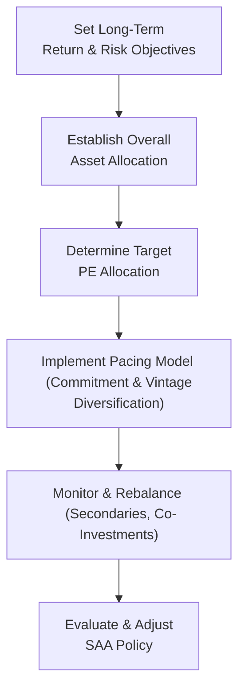

## Overview

I remember chatting with a longtime colleague—he was a CFO at a midsize endowment—who admitted he felt a bit uneasy about his institution’s private equity (PE) allocation. He’d say something like, “Well, you know, it’s great when the numbers finally come in, but in the meantime, it’s like we’re flying half-blind!” That sense of uncertainty about illiquid assets and the timing of capital calls, distributions, and valuations is at the heart of private equity’s role in strategic asset allocation (SAA).

This section explores the challenges and benefits of utilizing private equity within a broader investment portfolio. While we tend to think of equities and bonds as the “bread and butter,” PE can serve as a high-octane booster that potentially improves portfolio returns, albeit at the cost of more complexity, limited liquidity, and a longer time horizon. Let’s walk through why institutions like pension funds, endowments, and insurance companies take that leap, how they decide on an allocation, and what processes help them manage all those moving parts.

## The Unique Role of Private Equity in a Multi-Asset Portfolio

Private equity is often categorized as “higher risk, higher return,” and to be fair, that label usually sticks. But the more subtle point—one that’s especially relevant for SAA—is that private equity returns have relatively low short-term correlation with public markets. This correlation-lag effect can be a powerful diversification tool. Instead of daily mark-to-market swings, PE valuations update sporadically, often lagging economic changes.

At first glance, one might say, “That’s great: My portfolio has less volatility!” But we have to be careful. The lower correlation might partly reflect how private equity valuations aren’t updated in real time, which, in turn, hides some underlying risk. However, for a truly long-term investor, especially one with robust risk tolerance and modest liquidity needs—think large pension funds—this smoother ride can be a valuable complement to public assets.

It’s like having a friend who doesn’t call you every hour. Sure, you still value their friendship, but their updates come more sporadically. And if you’re investing for the long haul, the day-to-day noise just doesn’t matter as much.

## Key Considerations for Incorporating Private Equity

### Illiquidity and Time Horizon

The typical private equity fund can lock up capital for anywhere from 7 to 12 years (or more). During that time, an investor can’t just press a button to offload shares the way they might in public markets. This illiquidity is central to how we think about SAA. If a portfolio requires regular disbursements to beneficiaries, or if the institution has uncertain capital needs, a large private equity allocation might be downright impractical.

Consequently, organizations that can commit money for an extended period—like university endowments with multi-decade obligations—are better able to handle the illiquidity. Their strategic asset allocation often includes a healthy “chunk” of private equity to capture the illiquidity premium. In practice, their boards will set, say, a 20% or 25% target allocation to alternatives (including PE), acknowledging that some capital is off the table for quite a while.

### Limited Transparency and Valuation

Unlike public stocks, which provide daily or even minute-by-minute prices, private equity valuations often follow quarterly updates and incorporate assumptions by the general partner (GP). That can be disconcerting if you’re used to real-time data. In SAA models, we usually plug in expected returns and risk assumptions that reflect historical and forward-looking estimates. But there’s always a measurement issue: we’re never entirely sure if the Net Asset Value (NAV) reported is truly reflective of the underlying portfolio’s market value at any given time.

### Higher Expected Returns and Diversification

Many investors prize private equity for its potential to outperform public equities over the long term. The outperformance can stem from several sources: manager skill, access to unique deals, operational improvements in portfolio companies, and so forth (as discussed in detail in earlier sections of this chapter). When a pension fund or endowment includes private equity in its policy portfolio, the aim is to grab that extra return kicker.

Moreover, because PE’s estimated returns aren’t perfectly correlated with those of public markets on a day-to-day basis, the portfolio’s overall risk-adjusted return can improve. But “risk” is tricky here—like we said, standard deviation might appear lower simply because of the valuation methods. For a long-term investor, though, the occasional lag might be an acceptable trade-off.

## Commitment Pacing and Rebalancing

Commitment pacing is essential for maintaining your target PE exposure over time. Imagine you want to be at a 10% allocation in private equity. If you just drop 10% of your assets into a single vintage of a single fund, that investment will eventually be drawn down, invested, and then returned over several years. If you do nothing else, your allocation will shrink as capital is returned, drifting below 10%. Conversely, if you keep committing new capital every year (or every other year), you create a rolling blend of different vintages that can keep you close to your target allocation.

But, um, life happens. Maybe the public equity portion of your portfolio surges, driving your PE slice below target. Or perhaps your PE funds have performed so well that they push your overall percentage above target. With illiquid assets, you can’t trivially sell or buy more tomorrow to rebalance. Instead, limited partners (LPs) often use the secondary market to sell some of their fund interests (maybe at a discount), or they might want to co-invest in new deals to build up their exposure quickly. Rebalancing with private equity is an art that demands a well-structured pacing model, continuous review of distribution schedules, and close communication with GPs.

### Example of Annual Commitment Pacing

Let’s say an endowment wants to maintain a 15% target allocation to private equity. Based on experience and capital call patterns, they might assume that each fund invests the committed capital over four to five years and returns it (distributions) roughly between year five and year ten. To stay around 15%, they might commit 2% to 3% of the total portfolio to new PE opportunities each year. Over multiple years, this practice builds a pipeline of commitments at different stages of investment and distribution.

In a simplified calculation:

• Target allocation (TA) = 15%  
• Current portfolio size (PS) = \$1 billion (just as an example)  
• Desired new commitments each year = TA × PS × Some proportion to account for how many years it takes for capital to be called, plus some factor for distributions.  

If they anticipate 20% to 25% of their prior commitments being returned per year, they might factor that into deciding how much new capital to commit so that the overall net investment remains near 15%. These are rough guidelines, but actual pacing models are often more detailed, incorporating manager-level data and scenario analyses.

## Governance, Skill, and Manager Selection

Allocating to private equity isn’t just about deciding on a percentage. You also need an investment team or an advisor who can vet general partners, assess fee structures, negotiate terms, and perform ongoing due diligence. Manager selection is a big deal because returns in the private equity world can vary dramatically from top-quartile to bottom-quartile funds. A well-chosen fund might deliver an Internal Rate of Return (IRR) far exceeding public benchmarks, while a poorly chosen one can lag those benchmarks, sometimes by significant margins.

For large institutions, the governance structure typically includes an investment committee that sets (and occasionally updates) the target allocation, as well as a professional staff tasked with selecting GPs, monitoring investments, and making rebalancing recommendations. Smaller investors may rely on a fund of funds (FoF) or an outsourced CIO arrangement to gain exposure without having to build an in-house team.

## Vintage-Year Diversification

When incorporating private equity into SAA, it’s crucial to remember that returns can vary significantly across vintage years. The business cycle, interest rates, and capital market conditions can be especially influential on how well a PE fund does if it’s raising capital or harvesting investments during a particular economic backdrop. To mitigate the timing risk, investors spread their commitments across multiple years (and sometimes different GPs and strategies). That approach is known as vintage-year diversification, and it’s a big reason why consistent annual pacing is recommended.

If, for instance, you committed 100% of your allocation in 2007—right before the global financial crisis—your returns might look underwhelming. But if you commit smaller amounts each year, some portion will get invested in downturns (often leading to bargains) and some in expansions (where exits can be lucrative). Over time, a diversified set of vintages helps reduce performance volatility.

## Scenario Analysis for Optimal Allocation

It’s common to run scenario analyses or Monte Carlo simulations to figure out an allocation to private equity that maximizes expected returns for a given level of risk. You might incorporate various assumptions about:

• Expected returns for each subsector (venture capital, growth equity, buyouts, etc.).  
• Correlation assumptions with public equities, fixed income, and other alternatives.  
• Distribution waterfalls, capital calls, and how those might differ in a recession versus an expansion.  
• Manager skill or alpha.  

By simulating thousands of future paths, the portfolio management team can see how different private equity allocations behave under stress, and they can gauge potential shortfalls if distributions come later than expected or if valuations drop. This helps guide the final strategic asset allocation percentage, ensuring it aligns with the institution’s liquidity needs and risk tolerance.

In equation form, many institutions follow a simplified variance optimization approach, akin to the Markowitz framework but adapted for illiquidity. For a two-asset (public market and private equity) scenario, the portfolio’s expected return and risk might look like:

$$
E(R_{portfolio}) = w \cdot E(R_{PE}) + (1 - w) \cdot E(R_{Public})
$$

$$
\sigma_{portfolio}^2 = w^2 \sigma^2_{PE} + (1 - w)^2 \sigma^2_{Public} + 2 w (1 - w)\rho \sigma_{PE}\sigma_{Public},
$$

where \\( w \\) is the weight in private equity, \\(\rho\\) is the correlation coefficient, \\(\sigma\\) is standard deviation, and \\(E(R)\\) is the expected return. In practice, the correlation used might be lower, but we must remember that correlation is partly a function of the lagged valuations, so extra caution is advised.

## Mermaid Diagram: PE Allocation in a Strategic Asset Allocation Framework

Below is a simple flowchart illustrating how private equity decisions integrate into a broader asset allocation process.

Each arrow represents a step in the decision cycle: from broad objectives, to setting a policy portfolio, to specifying how much you allocate to PE, to designing commitment pacing, monitoring how it plays out, and finally—based on outcomes—refining the long-term strategy.

## Real-World Anecdote and Practical Example

Let’s consider a real-life style scenario with a hypothetical pension fund:

• Assume the pension fund has \$10 billion in total assets.  
• Its SAA specifies 8% to 12% in private equity, driven by a board-approved policy to enhance returns without exceeding certain liquidity and governance constraints.  
• Starting from a lower base of 5% actual PE exposure, the pension decides to commit \$250 million to new PE funds each year for the next five years.  
• Based on historical patterns, the fund expects that each commitment draws capital over about four years, with distributions becoming meaningful from year five onward.  
• By year six or seven, the pension fund aims to arrive comfortably within the 8% to 12% policy range for private equity.  

This approach helps them systematically ramp up the allocation without any single vintage year dominating the returns.

## Best Practices and Common Pitfalls

• Be patient. Private equity is a long-haul ride. It can be 6 or 7 years before you truly know how a particular vintage has performed.  
• Avoid chasing performance by overcommitting after a few strong PE vintage years. Markets shift in cycles, so a disciplined annual pacing is better than reactive investing.  
• Keep your eye on liquidity. Stress-test your portfolio to ensure you can handle tough market conditions when capital calls come in and distributions dry up.  
• Don’t forget manager selection. A strong or weak GP can make or break your results. Thorough due diligence on GPs is critical, as is alignment of interests (carried interest structures, clawback provisions, etc.).  
• Revisit your strategic policy. If your public equity portfolio experiences a massive swing, your PE exposure as a percent of total assets might move outside the target range. That could require either pausing new commitments or tapping secondaries if you need to reduce exposure.

## Exam Tips for CFA Level III Candidates

• Be prepared to explain why private equity can expand the efficient frontier in a multi-asset context, referencing lower correlation (despite valuation nuances) and higher expected returns.  
• Understand how to calculate a target allocation with an annual commitment/pacing schedule, and how that might look on an exam question.  
• Pay attention to the terms “vintage-year diversification,” “manager selection,” and “secondary sales.” These frequently appear in scenario-based questions.  
• In essay questions, be specific about how you’d handle rebalancing challenges when dealing with an illiquid asset like private equity.  
• Be comfortable talking about the trade-off between illiquidity risk and the illiquidity premium. Know how to articulate it in a bullet or two, referencing the plan’s liquidity needs and the time horizon.  

## References and Further Reading

• Campbell, John Y., and Luis M. Viceira, “Strategic Asset Allocation: Portfolio Choice for Long-Term Investors.”  
• Institutional Limited Partners Association (ILPA): Advice on pacing, manager selection, and portfolio construction.  
• CFA Institute Program Curriculum, particularly on alternative asset classes and private equity performance measurement.  
• Global Investment Performance Standards (GIPS) for Private Equity (to understand best practices in performance reporting).  

## Test Your Knowledge: Private Equity in Strategic Asset Allocation



### Which of the following best describes the main rationale for including private equity in a strategic asset allocation?

- [x] Potentially higher long-term returns and lower short-term correlation with public markets
- [ ] More consistent short-term valuations
- [ ] Guaranteed liquidity during market downturns
- [ ] Lower fees than traditional public equity funds

> **Explanation:** PE is favored for its long-horizon potential, higher expected returns, and lower short-term correlation with public markets. However, limited liquidity and higher fees often accompany these benefits.

### Which factor usually presents the greatest challenge when rebalancing a multi-asset portfolio with private equity?

- [ ] High correlation with public markets
- [x] Limited liquidity and long lock-up periods
- [ ] Excessive transparency on valuations
- [ ] Zero management fees

> **Explanation:** The illiquidity and extended commitment periods make it difficult to adjust private equity allocations quickly, creating challenges in rebalancing.

### Which of the following strategies is commonly used to address vintage-year concentration risk?

- [ ] Investing all capital in the same fund each year
- [ ] Terminating private equity investments during recessions
- [x] Committing capital evenly over several consecutive years
- [ ] Avoiding fund managers with top-quartile performance

> **Explanation:** By diversifying commitments across multiple years, investors reduce the impact of any single economic or market cycle on overall returns.

### In most pacing models, how do investors deal with the ongoing capital returned from mature PE funds?

- [ ] They let the allocation shrink permanently.
- [ ] They transfer all returned capital to public equities.
- [ ] They reinvest returned capital immediately into the same fund.
- [x] They plan future commitments to maintain the target allocation.

> **Explanation:** To keep their target allocation, LPs series-commit to new funds, reinvesting some or all of the capital returned from older vintages.

### Which of the following best explains why PE standard deviation of returns might appear artificially lower than that of public equities?

- [x] The valuations are updated infrequently and rely on subjective GP inputs.
- [ ] PE invests only in risk-free government bonds.
- [ ] PE correlations with other assets are always zero.
- [ ] The management teams fix valuations at cost.

> **Explanation:** Private equity relies on periodic or event-driven valuations. This can understate volatility compared to continuously marked public markets.

### What aspect of PE investing tends to enhance expected returns relative to public equities?

- [ ] Absence of competition for attractive deals
- [x] The illiquidity premium, plus manager skill and operational improvements
- [ ] Shorter investment horizons
- [ ] Regulatory mandates for guaranteed minimum returns

> **Explanation:** Private equity is often believed to capture an illiquidity premium, along with potential alpha from active value creation in portfolio companies.

### One key role of secondaries in private equity is to:

- [ ] Lower overall management fees significantly.
- [x] Provide liquidity to LPs that need to adjust allocations.
- [ ] Avoid the need for capital calls.
- [ ] Guarantee vintage-year outperformance.

> **Explanation:** The secondary market allows LPs to buy or sell interests in existing funds, offering a measure of liquidity and helping manage allocation targets.

### From a governance standpoint, which action is most critical before significantly increasing PE allocations?

- [ ] Reducing staff training budgets to save costs
- [x] Ensuring the investment team can conduct effective GP due diligence
- [ ] Leveraging only a single GP to reduce complexity
- [ ] Bypassing the investment committee for quicker approvals

> **Explanation:** Private equity success significantly hinges on GP selection. Having qualified personnel perform robust due diligence is a prerequisite for any expansion in PE exposure.

### Why do many institutions, such as endowments and foundations, often have higher PE allocations than other investors?

- [x] They have longer investment horizons and can tolerate illiquidity.
- [ ] They prefer taking minimal risk on principal.
- [ ] Their returns are primarily driven by daily mark-to-market valuations.
- [ ] They have no influential board or committees.

> **Explanation:** Because of their multi-decade horizons and stable capital base, endowments and foundations can handle the illiquidity and long time frames inherent in private equity.

### Private equity is expected to be illiquid for an extended period. True or False?

- [x] True
- [ ] False

> **Explanation:** Typical PE fund structures lock up capital for 7 to 12 years, making them inherently illiquid compared to public market investments.




