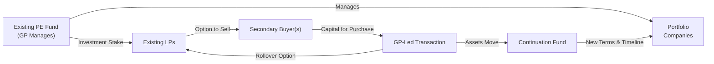

## Introduction and Context

Private equity investments have long been known for their relatively illiquid structures, often requiring a 7–10 year lockup period. This can seem like forever when unexpected financial obligations pop up—think “mid-life roof repairs” on your house, but on a much bigger scale if you’re an LP with substantial commitments. Well, perhaps ironically, we sometimes need money sooner than we expected. That’s where secondary transactions swoop in to save the day. They provide a market for buying or selling existing private equity stakes, offering liquidity to those wanting to exit early and allowing second-hand buyers to access seasoned portfolios. But wait, there’s more: GPs can sometimes orchestrate their own spin on secondaries through GP-led restructurings. Plus, we can’t forget recapitalizations—where new capital structures, or refinancings, might return cash to stakeholders while still retaining some ownership upside.

While all of this may sound technical, it’s extremely important in real life and for the CFA® Level III exam. The key is recognizing how secondaries and recaps change risk, return dynamics, and the way these transactions slot into one’s strategic asset allocation. This section digs into the nuts and bolts of secondary transactions and recapitalizations, providing you with both the big picture and the fine details that advanced investors need.

## Secondary Transactions in Private Equity

It’s often helpful to imagine you’re holding a partial stake in a private equity fund. Maybe you locked in your capital with an expected timeline of a decade, but now your financial situation—or your institution’s asset allocation policies—has changed. Selling your LP stake on the secondary market is one solution. Another scenario: perhaps you want to add to your private equity exposure but prefer a shorter time horizon, so you purchase someone else’s stake that’s a bit more mature.

The secondary market is a marketplace for trading existing private equity fund stakes (the “Secondary Market”). Buyers acquire pre-existing interests, which might already be partially or fully invested. Because these secondary buyers face uncertain exit timelines and have less control or knowledge of the day-one investment decisions, they typically seek a discount on the fund’s net asset value (NAV). But for sellers, even a discounted price can be better than no liquidity at all, especially when that capital can be redeployed elsewhere.

### Why the Secondary Market Matters

• Liquidity: The obvious benefit is liquidity in an otherwise lockup-heavy environment.  
• Active Portfolio Management: Limited partners (LPs) can fine-tune portfolio exposures, mitigate over-commitment risk, or handle blindsided capital calls.  
• Vintage Diversification: By acquiring stakes in older funds, or selling positions nearing the tail end of their fund life, LPs can adjust the vintage composition of their portfolios. Spreading commitments across multiple vintage years (“Vintage Diversification”) can help manage cyclical downturns in any single year.  
• Price Discovery: The secondary market gives signals about the perceived value of older fund stakes. Sure, discounts to NAV are common, but by how much? That depends on broader market conditions, investor sentiment, interest rates, and the underlying portfolio’s performance.

## GP-Led Restructurings and Continuation Funds

Sometimes, it’s not just the LPs who want to do a secondary deal. General Partners (GPs) might see that certain portfolio companies are brimming with potential but need extra time or fresh capital to maximize their value. Maybe the initial fund life is coming to an end. In this scenario, the GP can organize a transaction—commonly referred to as a GP-led restructuring (“GP-Led Restructuring”)—where assets transfer into a new vehicle, called a continuation fund (“Continuation Fund”). This transaction allows existing LPs to choose:

• Roll Over: Stay invested by rolling assets into the continuation vehicle.  
• Cash Out: Sell their holdings for liquidity.  

From the GP’s point of view, it’s a chance to keep managing attractive assets without the pressure of dissolving the fund prematurely. The new continuation fund typically has a fresh timeline, infusion of new capital, and updated terms. These deals are more complex to orchestrate than a normal secondaries transaction, but can benefit both the GP—who sees further upside—and the LPs—who can choose liquidity or keep riding the growth wave.

### Stapled Secondaries

You may come across something called a stapled secondary (“Stapled Secondary”). This is a transaction in which the buyer commits to purchase the existing LP stakes and also commits fresh capital to the GP’s new fund. Think of it like: “I’ll buy your old car, but only if you sell me that brand-new model, too.” From the GP’s perspective, stapled secondaries can be a neat way to secure fresh commitments for their next fund. For buyers, it provides both immediate established exposures and new deals in the pipeline.

## The Mechanics of Discounts, Pricing, and Market Drivers

Because secondaries mostly trade privately, there’s no big public exchange a la NYSE. Transactions typically happen through auctions or negotiated deals. Buyers will examine the portfolio, its distribution history, the assets’ potential for future returns, and the time horizon. If they sense more risk or uncertain exit pathways, they’ll demand steeper discounts. When capital is abundant or the market’s in full “risk-on” mode, discounts might compress significantly.

Imagine a portfolio invested in a handful of growth companies. Let’s say the fund’s reported NAV is $10 million for the stake on the block. The buyer might offer $9 million if they think the actual value is $9.5 million—but they want a margin of safety. If a recession is looming, that margin might be bigger, say an offer of $7 million instead. The difference between the offer and the reported NAV is effectively the discount, and it can fluctuate with market sentiment.

## Recapitalizations: Adjusting Capital Structures

Alright, let’s shift gears for a moment. Recapitalizations (“Recaps”) are a big deal in private equity when a portfolio company refines its capital structure, often adding leverage or refinancing to return proceeds to investors. Dividend recapitalizations (“Dividend Recapitalization”) are a subset of this strategy. The company issues new debt, and that borrowed capital is paid out as a dividend to shareholders. Investors can achieve partial liquidity, continuing to hold shares in the company. But note the trade-off: the company is now significantly more leveraged, which increases “Repayment Risk” if operating cash flow dips.

### Practical Recap Example

Picture a mid-size consumer products company that was acquired by a PE fund three years ago. The fund and management have grown revenues, improved profitability, and gotten the company’s EBITDA to, say, $50 million from $30 million. The sponsor decides it’s time to do a recap and take out a new loan. They get a $300 million loan (just for round numbers), use $100 million to refinance existing debt, and distribute the remaining $200 million as a dividend to the buyout fund’s investors. Suddenly, investors have some liquidity—great news if they’re looking to de-risk. But the company’s leverage ratio might now be 6x or 7x EBITDA, making it more vulnerable to economic downturns or operational hiccups.

## Combining Secondary Transactions and Recaps

It’s not unusual to see these concepts overlap. You might have a GP-led continuation fund that also injects more capital via a leveraged recapitalization. Or an LP might sell a stake in a fund that’s about to do a big recap to crystalize some of its returns early. While it can get complicated, the key is understanding how these maneuvers affect the risk/return balance and how they integrate into your broader portfolio strategy (see also “Private Equity’s Role in Strategic Asset Allocation,” from the earlier sections of Chapter 3).

## Visualizing a Typical GP-Led Secondary

Below is a simplified Mermaid diagram illustrating how a GP-led secondary transaction might flow when moving portfolio assets into a continuation fund:

In this setup:

• Existing LPs can exit by selling to one or more secondary buyers.  
• The GP forms a continuation fund to hold key portfolio companies beyond the original fund’s life.  
• Rollover investors remain in the new vehicle, while exiting LPs gain immediate liquidity.

## Benefits, Risks, and Best Practices

Secondary transactions provide flexibility to LPs, letting them actively manage private equity exposures, but the possible discount is a key risk—especially if the market sours. For GPs, orchestrating a secondary can prolong their involvement in high-potential assets. Yet they face scrutiny: is the deal priced fairly for existing LPs?

For recapitalizations, partial liquidity is the main draw, but it comes with a catch: more debt can mean more trouble if the economy turns. A prudent practice is to carefully weigh the cost of capital and the potential burdens of paying off or rolling debt.

### Common Pitfalls to Avoid

• Over-Leveraging: Dividend recaps are great until they’re not. Too much leverage can hamper company operations and stunt growth.  
• Conflicts of Interest: GP-led secondaries might feature hidden misalignments if not properly structured and disclosed.  
• Timing Mismatches: Selling an LP stake when the market is sour can mean accepting big discounts. Timing is everything.  
• Inadequate Due Diligence: Secondary buyers must carefully evaluate the portfolio’s health. Relying solely on GP-supplied info can lead to nasty surprises.

## Exam Tips and Applications

On the CFA® Level III exam, expect scenario-based questions tying secondaries and recaps to portfolio strategy or risk management. You might see an item set about an LP who wants to de-risk their portfolio or a GP needing more time to exit portfolio companies. Be prepared to:

• Calculate or assess the effect of offering a particular discount on an LP stake.  
• Analyze how adding leverage via a recap changes a portfolio company’s valuation or risk profile.  
• Discuss alignment of interest under GP-led secondary deals.  
• Evaluate the role of recaps in driving partial exits or bridging liquidity needs for the sponsor’s next fund.

Below is a short KaTeX snippet (for demonstration) to illustrate how one might discount a final payoff in a secondary transaction:


\text{Price} = \text{NAV} \times (1 - \text{Discount\%})


If the NAV is \$10 million and the Discount% is 15%, then Price = \$10 million \\(\times\\) (1 – 0.15) = \$8.5 million.

## References for Further Study

• “Secondaries: Investing in the Secondary Market for Private Equity” by Richard Carson.  
• “The Guide to GP-Led Secondary Transactions” by Private Equity International.  
• Chapter 2.6 (“Due Diligence and Business Planning in the Private Investment Process”) and Chapter 3.6 (“Private Equity’s Role in Strategic Asset Allocation”) can provide more insights into performing due diligence and integrating these strategies into a broader portfolio.

## Final Exam Tips

• Understand the motivations and constraints of both LPs and GPs in secondary transactions.  
• Be comfortable evaluating the impact of leverage and recapitalizations on a company’s future growth and potential default risk.  
• Remember to factor in changes to IRR and MOIC from partial exits or capital calls under new fund structures.  
• Practice scenario-based questions that might combine recaps, secondaries, and fund-level decisions.  
• Review the ethical considerations around fair pricing and alignment of interest in GP-led deals.  

By mastering these areas, you’ll feel more confident when the exam throws you curveballs involving complicated secondaries or recap structures. It’s all about keeping your eyes on how liquidity, risk, and return interplay. Good luck, and keep building that knowledge base!

---

## Master Your Knowledge of Secondary Transactions and Recapitalizations



### An LP is looking to exit a private equity fund after five years. Which of the following is the primary advantage of a secondary transaction for the LP?

- [ ] A guaranteed sale at fund NAV
- [ ] Immediate reinvestment opportunities in newly formed private equity funds
- [x] Liquidity in an otherwise illiquid structure
- [ ] Elimination of all transaction fees

> **Explanation:** Secondary transactions offer an LP the chance to exit early and achieve liquidity. Although it may come at a discount, the immediate access to capital is the primary advantage.

### In a GP-led restructuring process, which new entity typically holds the older portfolio assets that require additional time to develop value?

- [ ] The original private equity fund
- [ x ] A continuation fund
- [ ] A sister vehicle funded by previous LPs
- [ ] A mezzanine debt facility

> **Explanation:** GPs often create continuation funds to house existing portfolio companies beyond the original fund’s lifespan, providing LPs with an option to remain invested or exit.

### Which best describes the potential downside of a dividend recapitalization strategy?

- [ ] It completely eliminates existing equity holders’ risk.
- [x] It increases the leverage ratio, thus heightening default risk.
- [ ] It triggers an immediate tax shield, reducing risk.
- [ ] It prevents the company from issuing equity in the future.

> **Explanation:** A dividend recap often adds significant debt to a company’s capital structure, potentially raising default risk if cash flows cannot support the new obligations.

### Suppose a private equity fund stake has a reported NAV of $9 million, but market conditions are weak. A secondary buyer demands a price reflecting a 20% discount. What is the likely purchase price?

- [ ] $5 million
- [x] $7.2 million
- [ ] $8.1 million
- [ ] $9.0 million

> **Explanation:** The simple formula is Price = NAV × (1 – discount). So $9 million × (1 – 0.20) = $7.2 million.

### In a stapled secondary transaction, a buyer typically commits to:

- [ ] Purchasing only older fund interests from one or more sellers.
- [x] Acquiring existing LP interests plus committing capital to the GP’s next fund.
- [ ] Providing debt financing to existing LPs who remain in the fund.
- [ ] Merging two private equity funds managed by the same GP.

> **Explanation:** Stapled secondaries bundle the purchase of existing interests with commitments to the GP’s new or upcoming fund.

### A firm that invests in a $100 million continuation fund is looking for exposure to:

- [x] Existing portfolio companies carried over from a prior fund
- [ ] Newly formed startups funded at seed stage
- [ ] Only publicly listed companies
- [ ] Mid-cap growth funds with no prior track record

> **Explanation:** Continuation funds typically hold assets from a previous fund that still have potential upside but need more time to mature.

### What is usually a key motivation for LPs who engage in vintage-year diversification strategies?

- [x] Smoothing out economic or market cycles across multiple fund launches
- [ ] Avoiding management fees from any single GP
- [x] Minimizing the probability of capital calls from older funds
- [ ] Matching the lockup periods of only the top-performing GPs

> **Explanation:** Spreading commitments across different vintage years helps manage timing risk, as not all funds are as vulnerable to the same downturn at the same moment.

### Which statement about GP-led secondaries is most accurate?

- [x] They can provide liquidity options for existing LPs and extended management of promising assets.
- [ ] They are prohibited in most private equity jurisdictions due to conflicts of interest.
- [ ] They do not require third-party buyers.
- [ ] They exclusively involve mezzanine debt conversions.

> **Explanation:** GP-led secondaries let GPs pursue further value creation in promising portfolio assets beyond the initial fund term, and they also give LPs the choice to roll over or exit.

### Which of the following is least likely a benefit of conducting a secondary sale for an existing LP?

- [x] Eliminating potential tax liabilities from earlier distributions
- [ ] Gaining liquidity in a shorter time
- [ ] Reshaping portfolio allocations
- [ ] Managing lockup constraints

> **Explanation:** Selling in the secondary market does not negate tax obligations from prior distributions; those liabilities have already been incurred.

### A recapitalization that returns proceeds to shareholders without giving up complete ownership is referred to as:

- [x] Dividend recapitalization
- [ ] Mezzanine financing
- [ ] Secondary buyout
- [ ] Continuation bridging

> **Explanation:** A dividend recap involves raising new debt and paying dividends to existing shareholders, effectively shifting risk through increased leverage while retaining ownership stakes.


