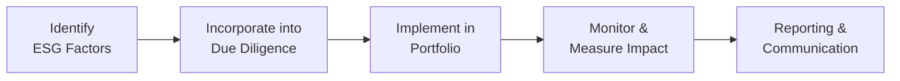

## Introduction and Key Concepts

Over the past decade—and especially in recent years—private equity professionals have broadened their focus beyond traditional metrics like revenue growth, margins, and cash flow. ESG (Environmental, Social, and Governance) factors are no longer just buzzwords. They are part of a robust framework for risk management and potential value creation, a framework demanded by investors, regulators, and the broader public. And let’s be honest, it’s also a question of reputation. Nobody wants to be known as the fund that invests in polluting factories with questionable labor standards, right?

At the same time, impact investing has surged as a distinct (but sometimes overlapping) strategy. It explicitly aims for measurable positive social or environmental results, alongside financial returns. Today, we’re going to explore how both ESG and impact investing fit into the private equity arena, what this means for fund managers (General Partners, or “GPs”) and investors (Limited Partners, or “LPs”), and why it matters for the future of capital markets.

## The Rationale Behind ESG Integration

You might be thinking, “All right, but do these ESG considerations really help a fund’s performance, or is it all talk?” This is a fair question because, until a few years ago, many folks suspected ESG was simply about feel-good marketing. But check this out: companies that do poorly on ESG metrics—like those facing high pollution fines or forced labor controversies—often encounter regulatory crackdowns, consumer boycotts, or supply chain disruptions. This inevitably affects valuation. So from a classic risk management perspective alone, ESG is relevant. 

Moreover, there’s mounting evidence (including from major consultancies and a growing body of academic research) suggesting that well-governed companies with low environmental footprint and strong employee relations often enjoy superior operational efficiencies and brand loyalty over the long haul. So from a purely economic standpoint, it can pay off to integrate ESG considerations.

### An Informal Anecdote

I remember sitting in on an investment committee for a mid-market buyout fund. We were analyzing two potential deals. The first was a promising industrial manufacturer with high margins but questionable disposal of hazardous waste. The second was a slightly more expensive target but with robust, publicly lauded sustainability metrics. The team initially leaned toward the first—“Hey, bigger margins, let’s go for it,” someone said. But after diving deeper, we realized the hazardous-waste risk might lead to costly future fines and reputational damage. The second investment ended up outperforming, aided by new ESG-conscious clients. Honestly, it was a lesson that stuck with me: ESG can make or break the investment thesis.

## The Pillars of ESG

ESG stands for Environmental, Social, and Governance—and yes, each letter covers a wide range of risks and opportunities:

• Environmental: This includes issues like greenhouse gas emissions, natural resource utilization, pollution controls, and climate-change readiness.  
• Social: Think of labor practices, diversity and inclusion, community impact, consumer protection, and product safety.  
• Governance: This dives into board composition, executive compensation, transparency, shareholder rights, and integrity of internal controls.

### Why It Matters for Private Equity

In private equity, GPs typically have more direct control over portfolio companies than most public shareholders do. They can actually influence board appointments, operational strategy, and day-to-day practices. That’s why ESG can be integrated much more proactively in private equity than in public market investing.

## The Role of LPs

LPs—like pension funds, endowments, and family offices—have become more vocal and thorough about requesting ESG details prior to committing capital. Some large institutional LPs have their own ESG policies or even internal teams dedicated to evaluating a GP’s ESG track record. In many cases, they expect alignment with global frameworks such as:

• UN Principles for Responsible Investment (UN PRI)  
• The Sustainability Accounting Standards Board (SASB) standards  
• Task Force on Climate-Related Financial Disclosures (TCFD) recommendations  

They’re not messing around. Some will fully pass on a fund if the GP can’t demonstrate robust ESG integration or ongoing reporting. This push from LPs has accelerated the professionalization of ESG within private equity: from basic negative screening to sophisticated engagement and stewardship.

## Implementation Strategies

ESG integration can look vastly different across funds. Let’s outline a few common approaches:

### 1) Negative Screening

Historically, many investors started with negative screening—basically a big “no” list of sectors or companies they refuse to invest in (like tobacco, firearms, or coal power). This is a relatively straightforward—and, to be blunt, somewhat blunt—instrument that keeps certain controversial investments off the table. However, negative screening alone doesn’t guarantee active improvement at portfolio companies.

### 2) Best-in-Class Selection

Rather than just excluding sectors, a best-in-class approach attempts to identify leading companies within a particular industry. For instance, if a GP invests in the apparel sector, they might find the company with the lowest water usage, best labor standards, or most transparent supply chain management. The idea is to reward—and benefit from—companies that are “ahead of the pack” in ESG performance.

### 3) Active Engagement and Stewardship

This is where private equity can truly shine. Because GPs often have controlling stakes or at least significant influence, they can shape strategy and operations to align with ESG principles. For example, a GP might encourage a portfolio company to:

• Improve energy efficiency of manufacturing facilities  
• Develop more sustainable supply chain relationships  
• Increase board diversity  
• Strengthen data security measures  

This approach shifts ESG from a check-the-box exercise to a driver of operational improvements.

### 4) Thematic or Impact-Focused Investing

A step beyond standard ESG integration, thematic investing targets companies that address specific social or environmental challenges, such as renewable energy, affordable housing, or healthcare access. This approach overlaps heavily with “impact investing,” which we’ll dive into next.

## Impact Investing

Impact investing is all about the so-called “double bottom line”—pursuing measurable, positive social or environmental outcomes, alongside financial returns. While ESG integration may concentrate more on risk mitigation and incremental improvements, impact investing starts with a mission-driven mindset: define social or environmental goals and look for profitable companies that can achieve them.

### Main Characteristics

• Intentionality: The investor specifically intends to create positive impact, not just as a byproduct or side effect of the business.  
• Measurability: Impact investments require a clear set of metrics or KPIs (Key Performance Indicators) to track progress on social or environmental outcomes.  
• Financial Return: While returns can vary, most impact investors still aim for market-rate or close-to-market-rate returns—it’s not philanthropy.  

### Measurement and Reporting

This is often the trickiest part. You might have come across frameworks like IRIS+ (from the Global Impact Investing Network) that outline standardized metrics for various sectors. Another major player is SASB, which includes relevant ESG metrics for different industries. The GP typically chooses or designs relevant KPIs—like “number of low-income patients served” for a healthcare initiative—and then tracks them over the life of the investment.

## Avoiding Greenwashing

Greenwashing is, unfortunately, the practice of labeling an investment as “green” or “impactful” without having substantive basis for that claim. Private equity can be vulnerable here, because the underlying companies are not as publicly visible as listed corporations. Investors, regulators, and NGOs are increasingly watchful, so GPs face reputational (and sometimes legal) consequences if they make misleading statements.

Ensuring transparency and third-party verification—or at least alignment with widely recognized standards—can help protect against allegations of greenwashing.

## ESG in Due Diligence

ESG due diligence revolves around:
1. Identifying potential red flags (e.g., violation of labor laws, severe polluting operations).
2. Assessing how well the target company manages ESG risks and opportunities.  
3. Gauging any “upside potential” from improving ESG factors, such as rebranding or more efficient resource usage.  

A typical due diligence flow might look like this:

GPs can use specialized tools, external consultants, or data providers that estimate carbon footprints and other metrics. The objective is to input the relevant ESG findings into the valuation model—potentially adjusting discount rates if certain risks loom large.

## Post‑Investment Stewardship and Monitoring

Once the deal is closed, the GP’s work continues. Successful integration of ESG doesn’t happen automatically; it requires:

• Clear ESG goals or targets for portfolio companies.  
• Continuous monitoring of ESG metrics (e.g., improved supply chain conditions, board governance changes).  
• Ongoing collaboration with management teams, who might need training or new reporting structures.  

Many GPs incorporate ESG updates into quarterly and annual reporting packages for their LPs. These updates can include achievements (like greenhouse gas reductions), case studies on how ESG spurred revenue growth, or new leadership hires that strengthen governance.

## Exit Considerations

When the time comes to exit, strong ESG performance can be a significant value driver, especially for strategic buyers or public market listings. Buyers increasingly want reassurance that they won’t be inheriting hidden liabilities or reputational hazards. If the GP can testify to a well-documented record of ESG compliance—and perhaps some notable achievements—this can translate into a smoother sale process and, in some cases, a valuation premium.

## Potential Challenges and Pitfalls

• Data Reliability: Especially in private markets, collecting standardized ESG data can be tricky. Companies may not have robust systems in place to gather it.  
• Resource Intensity: ESG engagements require specialized expertise. Smaller PE funds might struggle to dedicate staff solely to ESG tasks.  
• Balancing Act: Achieving financial returns while pushing ambitious ESG or impact goals can sometimes lead to tension between the GP and portfolio company, especially if short-term trade-offs are required.  
• Evolving Regulation: As governments roll out new rules on climate disclosures or labor standards, GPs need to remain agile and up-to-date.

## Practical Example: Energy-Efficient Manufacturing

Let’s consider a hypothetical private equity investment in a mid-size manufacturing firm. During due diligence, the GP notices that the company has out-of-date production equipment with poor energy efficiency. Rather than seeing this as a deal-breaker, the GP invests in new equipment to lower energy consumption, which eventually:

• Limits carbon emissions, satisfying local regulatory guidelines.  
• Reduces monthly utility costs.  
• Improves employee working conditions due to better ventilation.  
• Enhances the firm’s reputation, leading to new clients.

Thanks to these efforts, the GP can tell a compelling story to prospective buyers at exit: not only did the company’s EBITDA improve (energy savings), but it also helped the firm stand out in a sector increasingly concerned about sustainability.

## Impact Investing in Action: Affordable Housing

Imagine a GP launching a fund exclusively focused on affordable housing. The firm acquires properties in underserved regions with tight housing supply. By renovating units, implementing energy-efficient features, and partnering with local nonprofits to provide social services, the GP creates tangible social impact—improved living conditions, job creation, community development—while also earning steady rental yields. 

Such a fund typically tracks specific KPIs, like “number of affordable housing units created” or “occupancy rate among low-income residents.” Over time, strong occupancy and government incentives (like tax credits) support healthy financial returns. This is the classic “double bottom line.”

## Exam Relevance: CFA Level III

For your CFA Level III exam, you might see scenario-based questions that require you to evaluate a private equity fund’s due diligence process, incorporate ESG risks into a valuation model, or weigh whether a proposed investment truly meets an impact mandate. You may also be asked about best practices for measuring and reporting social or environmental performance. Remember to connect the dots between qualitative ESG factors and their potential quantitative repercussions on growth rates, discount rates, or terminal values.

## Final Exam Tips

1. Use Frameworks in Your Answers: If you see a question about ESG due diligence, mention recognized frameworks like UN PRI or reference SASB metrics.  
2. Link Qualitative and Quantitative Data: Demonstrate how ESG factors can affect cost of capital, operating margins, or exit multiples.  
3. Watch for Greenwashing: If a case mentions a GP’s “claims” about sustainability without supporting data, question whether it’s greenwashing.  
4. Provide Concrete Recommendations: The exam often tests your ability to propose actionable solutions.  
5. Time Management in Constructed Responses: Outline relevant ESG concepts quickly, then apply them to the scenario.  

## References and Further Reading

• Rodin, J. & Brandenburg, M. (2014). The Power of Impact Investing.  
• Global Impact Investing Network (GIIN): https://thegiin.org  
• ESG Integration in Private Equity by PRI: https://www.unpri.org/private-equity  
• Sustainability Accounting Standards Board (SASB) Standards: https://www.sasb.org  

----------

## Test Your Knowledge: ESG and Impact Investing in Private Equity



### From an LP perspective, which of the following is most likely an advantage of integrating ESG principles into private equity investments?

- [ ] Minimizing the number of investors in the fund
- [ ] Automatically ensuring higher returns in the short term
- [x] Reducing reputational and regulatory risks associated with portfolio companies
- [ ] Eliminating the need for traditional financial due diligence

> **Explanation:** Integrating ESG often helps mitigate reputational and regulatory risks (such as fines or boycotts), which is valuable for LPs since it protects their capital and image.

### Which best describes the concept of “negative screening” in ESG investing?

- [ ] Selecting only companies that have top ESG scores in all categories
- [ ] Allocating capital predominantly to environmentally themed projects
- [ ] Proactively engaging with management to improve ESG practices
- [x] Excluding companies or industries that fail specific ethical or sustainability criteria

> **Explanation:** Negative screening removes certain investments from the universe based on ESG-related disqualifying factors, such as specific controversies or industries.

### Which statement about impact investing is most accurate?

- [ ] It always seeks below-market returns to deepen impact
- [x] It pursues measurable social or environmental results in tandem with financial returns
- [ ] It only applies to microfinance and small social enterprises
- [ ] It relies solely on philanthropic capital rather than traditional investors

> **Explanation:** Impact investing aims for a “double bottom line,” combining measurable societal or environmental benefits with financial returns.

### A GP is preparing an ESG report for its investors. Which of these actions would likely help avoid accusations of greenwashing?

- [ ] Providing only annual aggregated financial data
- [x] Aligning disclosures with recognized frameworks like SASB or UN PRI
- [ ] Relying on self-generated metrics without third-party references
- [ ] Emphasizing marketing language while withholding data

> **Explanation:** Using a globally recognized and transparent framework helps corroborate a fund’s ESG claims and reduces greenwashing risks.

### Which of the following most accurately characterizes the difference between ESG integration and impact investing?

- [x] ESG integration often focuses on risk mitigation and incremental improvements, while impact investing sets explicit social/environmental targets
- [ ] ESG integration and impact investing are identical approaches
- [ ] ESG integration focuses only on environmental factors, whereas impact investing looks at all ESG components
- [ ] Impact investing generally excludes corporate governance topics

> **Explanation:** ESG integration can center on mitigating risks and improving performance, while impact investing explicitly targets measurable social or environmental outcomes.

### Which best describes the utility of an “active engagement” strategy within private equity ESG implementations?

- [ ] Avoiding direct communication with the portfolio company
- [ ] Waiting for legislation to enforce ESG compliance post-investment
- [x] Using ownership influence to drive operational and governance improvements
- [ ] Performing only superficial checks without long-term follow-up

> **Explanation:** Active engagement implies directly shaping a portfolio company’s ESG practices, from board composition to environmental policies.

### Among the following, which is a primary benefit for a private equity fund that systematically tracks sustainability metrics?

- [x] Identifying operational efficiencies that could increase margin over time
- [ ] Shortening the holding period required by the fund
- [x] Demonstrating tangible progress to potential acquirers at exit
- [ ] Immediately generating regulatory subsidies in all jurisdictions

> **Explanation:** Tracking ESG metrics can uncover cost savings (energy efficiencies, better HR retention, etc.) that boost margins. It also provides data to strengthen the company’s story at exit, potentially enhancing valuation.

### Which practice would enhance ESG due diligence for a proposed acquisition?

- [ ] Disregarding stakeholder interviews
- [ ] Relying solely on internal company documents
- [ ] Outsourcing the entire diligence process without supervision
- [x] Using third-party environmental audits and cross-referencing with public data

> **Explanation:** Engaging reputable third parties (e.g., environmental consultants) supports a more thorough analysis and helps confirm or refute the target’s ESG claims.

### One challenge of measuring social impact for a private equity investment in affordable housing might be:

- [ ] Monitoring basic financial data
- [ ] Accessing thorough environmental metrics
- [x] Determining relevant, standardized KPIs to reflect improved community outcomes
- [ ] Complying with laws on greenhouse gas emissions

> **Explanation:** Social impact often requires tailored metrics that might not be uniformly defined across sectors—e.g., “household energy savings” or “resident satisfaction”—which can be harder to compare or standardize.

### True or False: Integrating ESG factors into private equity portfolios can help mitigate regulatory and reputational risks without compromising investment returns.

- [x] True
- [ ] False

> **Explanation:** Properly managed ESG can reduce certain risks—like fines, lawsuits, or boycotts—while also preserving or potentially enhancing a fund’s financial performance.


