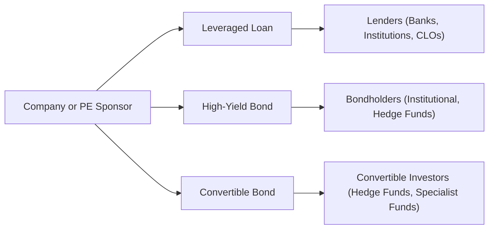
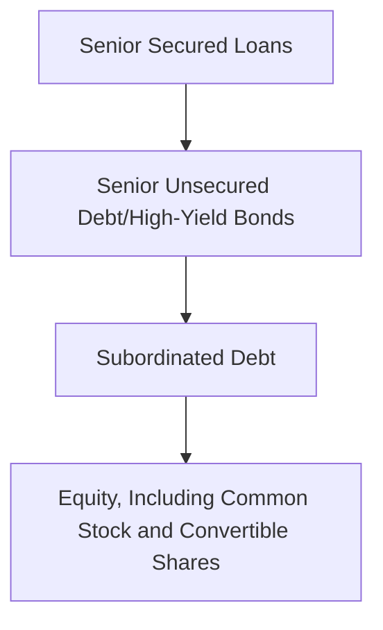

Introduction  
Sometimes when I first explored private debt, I felt like I was stepping into a whole new world of acronyms, credit metrics, and fairly complicated structures. It reminded me of the first time I tried to figure out how a smartphone’s many settings worked—sort of overwhelming! But once you break things down, it’s actually simpler than it looks. In this section, let’s walk through key instruments in private debt—leveraged loans, high‑yield bonds, and convertible bonds—and see why they’re so critical in private markets.  

Leveraged Loans  
A leveraged loan is basically a senior secured loan extended to companies (or private equity sponsors) that already have substantial debt or a sub‑investment-grade rating. The idea is that because these companies carry more risk, lenders demand higher interest rates. These deals are often arranged by large investment banks, then syndicated out to multiple lenders—commonly banks, institutional investors, or even collateralized loan obligation (CLO) vehicles.  

It’s worth mentioning that leveraged loans typically rank high in the capital structure, meaning they can have first claim on assets if something goes wrong. This seniority combined with security interests on assets (like property, plant, or even intangible assets) makes leveraged loans special. Because they’re higher in the repayment pecking order, their recovery rates in default scenarios can be relatively strong, at least compared to other forms of corporate debt.  

But, oh, the paperwork. Leveraged loan documentation demands thorough covenants, including restrictions on additional borrowing, certain minimum interest coverage or leverage ratios, and a host of reporting requirements. Although more flexible than some high-yield bond indentures, these agreements are often actively negotiated to protect lender interests.  

By the way, the main reason private equity sponsors love leveraged loans is that they help finance leveraged buyouts (LBOs) and acquisitions. These sponsors can borrow a chunk with a higher yield (which the sponsor has to pay, of course), but they don’t have to give up equity in the company. The trade-off: The sponsor is now more highly leveraged, which increases the risk of default if cash flows don’t pan out.  

High‑Yield Bonds  
High‑yield bonds—sometimes known as “junk bonds,” though that phrase might sound harsh—are corporate bonds rated below investment grade (think BB+ or below by S&P). Because the risk of default is higher, issuers have to pay a higher coupon. You’ll see yields that are much more attractive than standard investment-grade paper, which is why institutional investors, hedge funds, and even some mutual funds consider them.  

Now, these bonds may be unsecured or second-lien obligations, which means their recovery rate in a default can be lower than that of senior loans. At the same time, they usually include protective covenants, though high-yield bonds often have a bit less stringent restrictions compared to the tighter, maintenance-based covenants seen in many leveraged loans.  

A very important piece of the puzzle is the credit spread. Observers track the extra yield that high‑yield bonds pay over “risk-free” government debt. That spread is super sensitive to the economic environment and default risk sentiment. Whenever the economy wobbles or defaults pick up, high-yield spreads typically widen.  

Market liquidity for high‑yield bonds is generally decent, as trading occurs in a large secondary market. That said, liquidity can dry up quickly during times of stress, so it’s not always the easiest thing to liquidate large positions.  

Convertible Bonds  
Convertible bonds are hybrids: They’re bonds that investors can convert into a specified number of shares in the issuing company. If the equity does really well, investors can share in the upside. If the equity price sinks, well, the investor retains some bond-like protection in principal and coupon (though credit risk is still on the table).  

From an issuer’s perspective, convertibles can be cheaper to issue than standard debt because you can typically “get away” with a lower coupon. Investors accept the lower interest rate because they like the potential for equity upside. Of course, if the bond is converted, the original shareholders can be diluted.  

Valuing a convertible bond can be slightly trickier than valuing a plain vanilla bond. It’s influenced by:  
• The issuer’s credit quality (likelihood of repayment)  
• The equity market’s volatility (higher volatility often means a more valuable conversion option)  
• Prevailing interest rates (affecting the bond’s fixed-income component)  

In practice, a lot of professionals use option pricing models that treat the conversion feature like a call option on the issuer’s stock.  

Comparative Features and Use Cases  
When deciding among leveraged loans, high‑yield bonds, or convertibles, issuers and investors both look at security, coupon cost, flexibility, and potential for upside.  

Security & Priority  
• Leveraged loans: Senior secured status, top of the capital structure.  
• High‑yield bonds: Often unsecured or subordinate; potentially lower recovery in default.  
• Convertibles: Seniority can vary. Some convertible bonds are senior unsecured; others might be subordinated.  

Potential Alpha Generation  
• Leveraged loans: Often used in LBOs or recapitalizations to aim for higher returns based on improved company performance or synergy.  
• High‑yield bonds: Funding expansions, acquisitions, or working capital.  
• Convertibles: Provide growth capital at a lower coupon cost, with equity upside as a sweetener for investors.  

Cost of Capital vs. Flexibility  
• If a sponsor wants to avoid dilution, they might go with leveraged loans or high‑yield bonds.  
• Convertibles can be great for an issuer that expects their stock to rise, because the overall cost of financing can be lower.  

Here’s a high-level look at how these different debt instruments flow from a company or a private equity sponsor to various private debt investors:

Investor Considerations  
When you’re analyzing private debt instruments, the real homework is in the credit analysis. Look at the issuer’s business model, operating performance, economic tailwinds or headwinds, leverage ratios, and so on. Borrowers in below-investment-grade territory often sit on shaky ground if the economy turns south.  

• Market Liquidity:  
  – Leveraged loans can be less liquid than some publicly traded high-yield bonds.  
  – Convertibles sometimes trade based on both bond and equity market conditions, leaving you juggling two different liquidity realities.  

• Duration and Interest Rate Sensitivity:  
  – High‑yield bonds usually have intermediate maturities, so you’ll have some duration risk.  
  – By contrast, leveraged loans often feature floating rates (e.g., tied to LIBOR or SOFR plus a spread), so their interest rate risk is lower—but credit risk is still there.  
  – Convertibles? Their sensitivity depends on which side of the bond/equity continuum they’re leaning. If the stock’s trading well above conversion price, the convertible can behave more like equity.  

• Potential Equity Upside:  
  – Only convertible bonds have that direct equity optionality. Of course, you can always buy an equity stake in a high‑yield issuer separately, but that’s not the same integrated structure.  

Risks and Mitigants  
Default Risk & Recovery Rates  
• Leveraged loans tend to have higher recovery rates, given their senior secured status.  
• High‑yield bonds often lower on the totem pole, leading to less favorable recoveries.  
• Convertibles can be structurally subordinated, but at least if the issuer’s stock skyrockets, that can help mitigate default concerns (assuming they manage to refinance or handle debt obligations responsibly).  

Call Features & Prepayment  
• Many high‑yield bonds come with call provisions, allowing issuers to redeem them early at a premium. This can be great for the issuer if interest rates drop or the issuer’s credit improves. But it’s not so great for the bond investor if the bond gets called away right when yields have fallen.  
• Leveraged loans often allow for prepayments without penalty, giving borrowers some extra flexibility but also causing uncertainty around your expected investment horizon.  

Equity Risk with Convertibles  
• If the stock price plummets, the conversion feature is worthless, so you’re back to bond fundamentals. If the bond itself is below investment grade, that can mean a sizable risk.  
• Issuers can layer on other complexities like caps or forced structures, so it pays to read the fine print.  

Capital Structure Priority Diagram  
Below is a (very) simplified diagram of how different claims may stack up in a typical corporate capital structure (exact details vary by deal).

In a restructuring scenario, senior secured lenders (e.g., leveraged loan holders) often get first crack at the company’s collateral. High‑yield bondholders battle over the unsecured portion, or they might have second-lien status. Subordinated debt stands behind that, and common shareholders—well, they get whatever is left. Convertibles might convert to equity if it benefits them or remain as debt if it doesn’t.  

Practical Workflow  
In practice, a deal doesn’t just materialize overnight. Typically, here’s the process:  
• Underwriting & Syndication:  
  – Investment banks or arranger banks assess the credit, determine risk, and set the price.  
  – They test market appetite among institutional investors and specialty funds.  
• Structuring & Documentation:  
  – For leveraged loans, there might be a credit agreement loaded with maintenance covenants.  
  – For high‑yield bonds, you get an indenture describing covenants, events of default, call provisions, etc.  
  – For convertibles, the deal includes the conversion ratio, conversion price, potential forced conversion triggers, and more.  
• Monitoring & Covenant Compliance:  
  – Lenders keep an eye on the borrower’s performance. If triggers are violated, there can be a restructuring or a default event.  
  – With high‑yield bonds and convertibles, you’ll see periodic credit rating reviews, corporate filings, and equity market performance updates.  

Some might recall from Chapter 2.8 on Subscription Credit Facilities that private equity sponsors often time their capital calls carefully. Those credit facilities and capital calls can interplay with leveraged loans or bond placements, especially in bridging LBO transactions.  

Exam Relevance  
From a CFA® Level III perspective, these topics can show up in portfolio management scenarios, especially if you have to decide how to incorporate private debt allocations into a multi‑asset portfolio. You might see a constructed response question about choosing between offering a company a leveraged loan vs. a high-yield bond or analyzing how a convertible bond’s option feature affects risk and return.  

Conclusion and Final Exam Tips  
When you consider leveraged loans, high‑yield bonds, or convertibles for a private market portfolio, focus on the interplay between credit analysis, structure, and overall market conditions. Keep an eye on liquidity constraints as well—especially for leveraged loans in times of market stress. Also, be sure you truly understand the covenants. Borrowers with heavier covenants can hamper their operational flexibility but provide you, the investor, with more protection.  

For the CFA® Level III exam, remember these tips:  
• In essay questions, clearly demonstrate your knowledge of the capital structure priority. Illustrate how it affects recovery rates or the cost of financing.  
• If asked to evaluate a manager’s decision to invest in leveraged loans or issue high‑yield bonds, carefully analyze interest rates, spreads, and the potential for equity conversion where relevant.  
• With convertible bonds, show that you can break down the bond and equity components. Option pricing can appear, but typically you just need to explain how changing equity volatility or interest rates would shift the convertible’s price.  
• Time management is key. If you’re asked about both credit analysis and structuring in one question, address each in a concise manner and be sure to highlight your reasoning.  

References  
• Fabozzi, F. J. (Ed.). (2011). “Handbook of Fixed Income Securities.” McGraw‑Hill.  
• “Credit Markets and Leveraged Finance,” S&P Global Market Intelligence: https://www.spglobal.com/en/  
• CFA Institute. (2025). “Level III Curriculum Readings on Private Debt.”  

## Test Your Knowledge: Leveraged Loans, High‑Yield Bonds, and Convertible Bonds



### Which statement best describes a leveraged loan in the private debt market?

- [ ] It is a fixed-rate loan only available to companies with investment-grade ratings.  
- [x] It is a senior secured loan to a highly leveraged or sub‑investment-grade borrower.  
- [ ] It is commonly used in short-term trade finance only.  
- [ ] It is a subordinated debenture frequently converted into equity.  

> **Explanation:** A leveraged loan is typically senior, secured, and issued to companies with significant leverage or lower credit ratings.

### Which factor most commonly influences the pricing of high‑yield bonds?

- [ ] Expected dividend payout of the issuer  
- [ ] The yield on short-term T-bills  
- [x] The credit spread over Treasuries and default risk sentiment  
- [ ] Foreign exchange rates  

> **Explanation:** The yield on high‑yield bonds is heavily dependent on credit spreads above risk-free bonds, which vary with default risk sentiment.

### Why might an issuer prefer using convertible bonds over high‑yield bonds?

- [x] The coupon on convertible bonds is often lower, offering cheaper financing.  
- [ ] Convertibles require no disclosure of financial statements.  
- [ ] Convertible bonds involve no equity dilution under any circumstances.  
- [ ] High‑yield bonds are not available to sub‑investment-grade issuers.  

> **Explanation:** Many issuers like convertibles because investors accept a lower coupon in exchange for equity participation, thus lowering the issuer's interest expense.

### Which of the following best describes a risk unique to convertible bonds compared to plain vanilla bonds?

- [ ] Lower coupon rates  
- [ ] Higher default risk  
- [x] Equity risk exposure if the stock price declines  
- [ ] Inability to be refinanced early  

> **Explanation:** With convertibles, the embedded equity option makes the price sensitive to equity risk in addition to credit and interest rate risk.

### In analyzing private debt investments, how does senior secured status commonly impact recovery rates in the event of default?

- [x] Senior secured instruments tend to have higher recovery rates due to priority in claims.  
- [ ] Senior secured instruments always have the same recovery rate as unsecured bonds.  
- [ ] Senior unsecured bonds typically rank above secured loans in the capital structure.  
- [ ] Recovery rates are unaffected by lien status.  

> **Explanation:** Because senior secured loans have a first claim on assets, they tend to experience higher recoveries in defaults.

### Which of the following typically applies to high‑yield bond covenants?

- [ ] They are generally non-existent.  
- [ ] They are always more stringent than leveraged loan covenants.  
- [x] They exist to protect investor interests but may be less restrictive than loan covenants.  
- [ ] They are never used in practice.  

> **Explanation:** High‑yield bond covenants exist but often are less stringent than the maintenance covenants in leveraged loans.

### How do leveraged loans commonly differ from fixed-rate high‑yield bonds in terms of interest rate risk?

- [x] Leveraged loans often pay a floating rate, making them less sensitive to interest rate changes.  
- [ ] Leveraged loans and high‑yield bonds both have fixed coupons.  
- [ ] High‑yield bonds have zero duration.  
- [ ] Leveraged loans always pay a zero coupon.  

> **Explanation:** Many leveraged loans use a floating rate benchmark (e.g., LIBOR or SOFR plus a spread), thus reducing interest rate sensitivity relative to fixed-coupon bonds.

### When market conditions deteriorate and default risk heightens, what typical behavior can be observed in high‑yield bond markets?

- [x] Credit spreads widen significantly.  
- [ ] Credit spreads narrow due to higher demand.  
- [ ] Bond prices generally rise.  
- [ ] Issuers rush to refinance at lower interest rates.  

> **Explanation:** In a risk-off environment, investors demand greater compensation for default risk, causing credit spreads to widen.

### What is a primary disadvantage for early-stage sponsors who choose high‑yield bonds over leveraged loans?

- [ ] They usually have less liquidity.  
- [x] They lock in higher coupon obligations with fewer incurrence-based constraints.  
- [ ] They must concede an ownership stake to bondholders.  
- [ ] They typically require mandatory equity conversion.  

> **Explanation:** High‑yield bonds typically carry higher coupon costs than floating-rate loans, and the covenants may be less flexible but create large fixed interest obligations.

### True or False: A convertible bond’s value is influenced by both the issuer’s credit risk and its underlying equity’s price volatility.

- [x] True  
- [ ] False  

> **Explanation:** Convertible bonds are a hybrid. Their price reflects traditional bond factors (credit risk, interest rates) plus the embedded option on the issuer’s equity (volatility, market sentiment).


