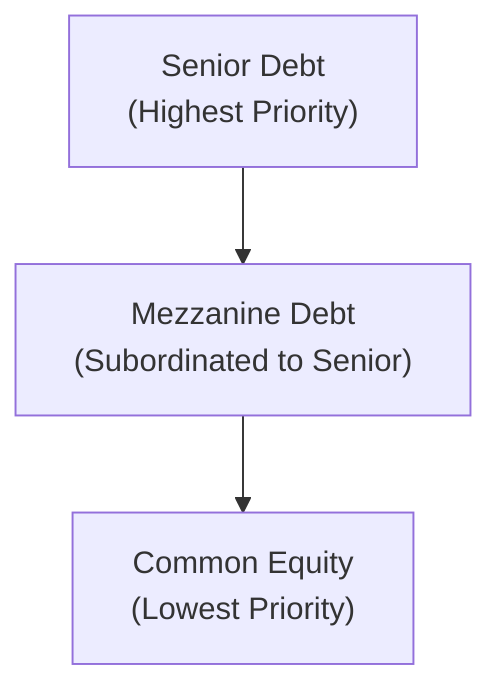

## Introduction

Well, let’s dive right into the world of mezzanine and uni‑tranche debt structures—two fascinating corners of private debt financing that you’ll often encounter in leveraged buyouts, corporate expansions, or recapitalizations. These instruments feel a bit like financial Swiss Army knives: they’re flexible, they’re adaptable, and they can fill those capital gaps when traditional senior lenders say, “Nope, we’re maxed out.” 

I remember chatting with a CFO friend of mine who was stuck between raising expensive equity (which dilutes existing shareholders) and senior debt that didn’t quite provide enough funding for the company’s ambitious growth plan. Enter mezzanine debt, offering the needed push over the finish line without giving away too much ownership. Even though it came with a higher interest rate and extra bells and whistles like warrants, it helped them close the deal quickly and keep control. That’s the sweet spot mezz and uni-tranche solutions can fill.  

Below, we’ll explore how these structures fit into a firm’s capital stack, how they’re priced, and the kind of risks they bring along. We’ll walk through the essential building blocks—things like interest payments, equity kickers, Payment‑in‑Kind (PIK) features—and see how they shape returns for investors. We’ll also throw in a few examples to ground the concepts, plus a simple diagram to help visualize where mezzanine stands in the pecking order of claims. 

## Mezzanine Debt: A Hybrid Financing Option

Mezzanine debt is often described as a hybrid between senior debt and equity. By “hybrid,” we mean it shares some characteristics of both bonds and stocks. Usually, mezzanine investors can collect a cash coupon on their loan, but they may take additional upside via an equity stake (often through warrants or other equity kickers). 

Unlike senior debt, mezzanine is subordinate in priority. This implies that if something goes terribly wrong—like a default or bankruptcy—mezzanine holders are behind the senior folks in line to get repaid, but ahead of common shareholders. Because of this risk, mezzanine debt commands higher yields than traditional senior debt.

### Key Features

• Subordinate Yet Above Equity: Mezzanine sits below senior debt in the capital structure, but stands ahead of preferred or common equity.  
• Blended Return: Offers a combination of fixed interest, PIK interest, and possibly equity warrants.  
• Limited Covenants: Sometimes mezzanine debt is structured with fewer maintenance covenants, focusing on key metrics like leverage ratio or interest coverage.  
• Flexibility: Companies can use it to fill the financing “gap,” supplementing what may be possible with senior debt.  

Here’s a simple visual of a typical capital stack:

In many leveraged buyouts (LBOs), senior lenders often limit their leverage (e.g., up to 4× or 5× EBITDA). If the sponsor wants higher leverage, mezzanine can fill that gap (e.g., from 5× to 6× or 7×). Meanwhile, the company preserves the equity from being overly diluted.

## Uni‑Tranche Facilities: All‑in‑One Financing

A uni‑tranche facility is basically one big loan that lumps together what would have been separate layers of senior and mezzanine financing into a single instrument. So instead of the borrower juggling two sets of lenders (and all the associated negotiations and documentation), they can negotiate one loan with a single group of lenders who accept a blended risk/return profile. 

### Uni‑Tranche Structure and Benefits

• Single Document, Single Rate: Rather than separate senior and mezz coupons, the borrower pays a single blended rate.  
• Simplified Negotiations: Fewer players at the table often translates into faster deal execution.  
• Customized Solutions: An arranger might partition the risk between participants behind the scenes, but for the borrower, it all comes under a single term loan.  
• Flexibility for Growth: Uni‑tranche products may allow additional debt capacity under certain conditions, making them appealing for growth-stage companies or situations where future funding might be needed.

Large private debt funds have popularized uni‑tranche lending. They pool funds from institutional investors seeking yields higher than those available in liquid credit markets but with more downside protection than pure equity.

## Pricing and Return Components

Regardless of whether we’re talking about mezzanine or uni‑tranche, returns and pricing typically revolve around three main components: (1) the cash coupon, (2) Payment‑in‑Kind (PIK) interest, and (3) equity kickers or warrants. 

### 1. Cash Coupon

The cash coupon is the interest the borrower must pay regularly—think monthly, quarterly, or semiannual payments. For mezzanine debt, these rates normally hover above standard senior rates, reflecting the higher risk. For example, while a senior term loan might go at an interest rate of 6–7%, a mezz coupon might be 10–14%. 

### 2. Payment‑in‑Kind (PIK)

Sometimes, all or part of that interest isn’t paid in cash but is instead added to the loan principal, compounding over time. This is called Payment‑in‑Kind (PIK). Borrowers like PIK features because they lower the immediate cash outflows. But keep in mind, they do raise the loan principal over time—so you can end up paying interest on top of interest. It’s a bit like a credit card with deferred interest.  

If the interest rate is r, and you choose to capitalize PIK, the principal for the next period might look like this:

$$
\text{Principal}_{t+1} = \text{Principal}_t \times (1 + r_\text{PIK})
$$

So for instance, if a company has \$10 million in mezzanine debt at 10% interest and half of it (5%) is PIK, then at the end of the first year, the principal outstanding could jump to \$10.5 million.

### 3. Equity Kickers or Warrants

Equity kickers are often the “icing on the cake” for mezzanine investors. They usually come in the form of warrants—options to buy equity in the future at a predetermined strike price. If the company thrives and the equity appreciates, these warrants can be extremely valuable, boosting the lender’s overall returns. If the company stalls or declines, the warrants may be worthless—but at least the mezzanine investor still has claims as a lender.

Here’s a mini example: 

• Principal: \$10 million mezzanine loan.  
• Coupon: 8% cash interest, 4% PIK.  
• Warrants: Represent a 5% equity stake at a designated strike price.  

If the business does well and is eventually sold at a nice valuation, the equity kicker might push the lender’s IRR from the 12% interest yield into the 20% range—or even higher.

## Role in the Capital Structure

Mezzanine (and, by extension, a chunk of the uni‑tranche facility) is specifically designed to fill the leverage gap when senior lenders hit their limit. Companies often prefer mezzanine over issuing new equity because they retain more control and ownership, even though the interest costs are higher than for senior debt.  

At the same time, mezzanine investors enjoy a middle ground: They gain a more predictable income than typical equity holders and might enjoy some of the upside through warrants. Of course, if a default occurs, the mezz lenders rank behind senior secured lenders, so the principal recovery can be significantly lower.

## Investor and Issuer Perspectives

### Investor Perspective

Investors (like private debt funds or specialized mezzanine funds) are attracted by:

• Elevated Returns: Often mid- to high-teens annual returns (or more) when including warrants.  
• Downside Protection: While not as safe as senior debt, it’s safer than being an equity holder.  
• Portfolio Diversification: Mezzanine loans can sit well in a portfolio that balances higher-risk equity with safer fixed-income.  

The big risk, obviously, is subordination. If the company stumbles, the senior lenders get first crack at the assets. Also, if equity valuations do poorly, the warrants might expire worthless, eroding that “extra” piece of the return.

### Issuer Perspective

For the borrower, mezzanine or uni‑tranche financing:

• Preserves Ownership: Avoids that big equity dilution.  
• Flexible Use of Funds: The company can channel these proceeds into expansions, stock buybacks, or acquisitions.  
• Faster Completion: A single uni‑tranche agreement can speed up negotiations and documentation.  

Downside? Higher interest costs than senior loans and occasional equity give‑ups by way of warrants. Over the long haul, those interest obligations can add up, especially with PIK features compounding the principal.

## Key Risks and Considerations

It’s not all roses, of course. Each of these structures carries certain risks:

• Subordination Risk: Mezzanine investors are not first in line during a restructuring or bankruptcy. If the company’s assets are insufficient, mezzanine holders may recoup very little.  
• Refinancing or Liquidity Risk: If the firm cannot refinance or repay the principal at maturity, that’s trouble for everyone involved.  
• Equity Market Downturn: If mezzanine returns rely heavily on equity kickers, a downturn could drastically slash total returns.  
• Covenant-Lite Tendency: Some mezzanine and uni‑tranche facilities come with fewer covenants, giving lenders less control over a faltering borrower.  

One CFO friend once joked that using mezzanine debt is like putting a rocket booster on your car’s engine—it’ll help you go faster, but if something goes wrong, it can get messy in a hurry. In other words, the high-octane nature of mezz and uni‑tranche can magnify both the upside and the downside.

## Practical Example: Putting It All Together

Imagine a private equity sponsor wants to acquire a manufacturing company with \$10 million in EBITDA. Senior lenders are comfortable lending about \$40 million, which is 4× EBITDA, at 7% interest. But the sponsor needs \$55 million total (5.5× EBITDA). 

Instead of raising more equity (which dilutes returns), the sponsor might layer in \$15 million of mezzanine or a uni‑tranche solution that covers the entire \$55 million with a blended coupon. Let’s say they do a uni‑tranche at 10%. The sponsor invests \$20 million in equity. As the new owners scale the business and eventually exit in a few years, the mezz or uni‑tranche providers will hopefully see a robust return. The sponsor retains more equity upside than if they’d issued new shares to another investor.

## Best Practices for Structuring and Monitoring

• Conduct Thorough Due Diligence: Both investors and issuers need to handle robust financial projections, stress tests, and scenario analyses.  
• Negotiate Protective Covenants: Even if it’s covenant‑lite, investors may push for certain triggers around leverage or interest coverage.  
• Balance the Return Profile: Overreliance on PIK can strain future repayment capacity, so it’s crucial to ensure the business generates enough cash for partial interest payments.  
• Align Mezzanine with Equity Incentives: If the mezzanine holder obtains warrants, both parties can share in value creation over time.  

## Frequently Asked Questions

• How do interest rates generally compare between mezzanine and uni‑tranche facilities?  
  → Generally, mezzanine can have a higher “headline” rate than a uni‑tranche because mezz stands behind the senior loan. Uni‑tranche, although it blends senior and junior layers, often yields a rate that’s still cheaper overall than a pure mezz loan.  

• Can mezzanine financing be used for growth capital rather than just leveraged buyouts?  
  → Absolutely. Though mezz is popular in LBOs, it’s also used for expansions, acquisitions, or recapitalizations when companies need more debt than a senior facility will allow.  

• What if the equity kicker never pays off?  
  → Then investors rely mostly on the coupon (cash or PIK) for returns. The equity kicker is often the “potential upside,” but there’s no guarantee it will materialize.

## Exam Tips for Mezzanine and Uni-Tranche Questions

Because these structures can appear in scenario-based questions at Level III, be ready to:

• Demonstrate how mezzanine fits into a firm’s overall capital structure and its effect on leverage ratios.  
• Show that you understand the difference between cash interest and PIK interest, especially how PIK capitalizes unpaid interest into the principal.  
• Illustrate the typical yields and risk trade-offs, especially the role of equity warrants in boosting returns.  
• Identify the pros and cons for both issuers (control, faster deal) and investors (higher yield, but subordinate claim).  
• Calculate or discuss potential IRRs under different exit scenarios for a mezzanine investment.

Remember, exam questions might ask you to compare mezzanine to other forms of financing, or they might test your knowledge of how PIK interest accumulates over time. You might also see prompts requiring you to pick the “best financing option” for a hypothetical takeover scenario, explaining how each alternative meets certain risk, cost, or control objectives.

## References and Further Reading

• Chaplinsky, S. (2009). “Methods of Financing and Theories of Capital Structure.” Darden Business Publishing.  
• Talmor, E. & Vasvari, F. (2011). “International Private Equity.” Wiley.  
• CFA Institute. CFA® Program Curriculum, various readings on Private Equity & Private Debt.  
• Private Company Finance Journal, selected articles on mezzanine structures and risk considerations.  

---

## Test Your Knowledge: Mezzanine and Uni-Tranche Debt Quiz



### Which best describes mezzanine debt's position in the capital stack?

- [ ] Senior to all other forms of debt
- [x] Subordinate to senior debt yet senior to equity
- [ ] Equal priority with common stock
- [ ] Pari passu with senior term loans

> **Explanation:** Mezzanine debt ranks after senior debt but ahead of equity in the event of default or liquidation, so it’s considered a middle layer in the capital structure.

### A key advantage of a uni‑tranche debt facility for borrowers is:

- [x] A single blended coupon for the entire debt
- [ ] A guarantee of lower interest rates than any other form of financing
- [ ] No requirement for paying interest
- [ ] The elimination of subordination risk

> **Explanation:** A uni‑tranche facility combines senior and mezzanine layers into one instrument, simplifying documentation and providing a single blended rate, but it doesn’t necessarily guarantee a lower rate than all other forms of financing.

### Which of the following accurately describes Payment‑in‑Kind (PIK) interest?

- [ ] It’s paid in full at the beginning of the loan
- [x] It’s accrued and capitalized into the outstanding loan balance
- [ ] It’s based on a variable rate determined monthly
- [ ] It cannot ever be converted into equity

> **Explanation:** PIK interest is added to the principal rather than paid in cash. It compounds over the life of the loan.  

### An equity warrant in a mezzanine deal primarily serves to:

- [ ] Fully substitute for the cash coupon
- [x] Grant the lender upside potential if assets appreciate
- [ ] Provide senior lenders with control over equityowners
- [ ] Prevent the need for reports and disclosures

> **Explanation:** Warrants give the mezzanine investor an upside participation if the underlying equity increases in value.

### In a leveraged buyout, mezzanine debt is often used because:

- [x] It can fill the gap when senior lenders’ commitments are insufficient
- [ ] It automatically converts to equity in four years
- [x] It provides higher returns for investors willing to accept subordination
- [ ] It forces equity holders to relinquish control

> **Explanation:** Mezzanine debt can be layered on top of senior debt to provide additional financing without issuing new equity. Because it is subordinate, it bears higher risk and typically offers higher yields.

### One reason why mezzanine debt typically yields higher returns is:

- [x] Increased subordination risk compared to senior debt
- [ ] Government backing similar to treasury bonds
- [ ] Strict covenant protections stronger than bank loans
- [ ] Superior claim to senior secured bonds

> **Explanation:** Mezzanine is riskier because it’s junior to senior debt. Therefore, to entice investors, it generally offers a higher interest rate.

### Which of the following could be a benefit for a company using mezzanine debt instead of issuing more equity?

- [x] Retaining greater ownership and control
- [ ] Lower interest cost than senior bank loans
- [x] Avoiding immediate shareholder dilution
- [ ] Eliminating interest payments through the life of the loan

> **Explanation:** Companies prefer mezzanine in many cases because while debt is more expensive than senior loans, it is usually less dilutive than issuing new equity. It comes with higher interest costs but helps preserve ownership.

### What is a primary function of covenants in a mezzanine or uni‑tranche loan agreement?

- [x] Protect investors by imposing certain financial or operational restrictions
- [ ] Eliminate subordination risk
- [ ] Guarantee a minimum equity valuation
- [ ] Bypass the need for due diligence

> **Explanation:** Covenants help protect the lender’s interests by establishing thresholds or operational constraints. They can trigger remedies if the borrower’s finances deteriorate.

### How might the presence of an equity kicker in a mezzanine deal impact a lender’s potential IRR?

- [x] Increase the potential IRR if the company’s equity value appreciates
- [ ] Eliminate the need for a cash coupon
- [ ] Decrease the potential IRR because it dilutes the borrower’s equity
- [ ] Have no effect on the lender’s IRR

> **Explanation:** If the equity stake (warrants or options) becomes more valuable over time, the lender’s overall return will increase.

### True or False: Uni‑tranche debt structures always exclude equity warrants or other equity-like participation.

- [x] True
- [ ] False

> **Explanation:** Typically, uni‑tranche facilities are structured as a single blended instrument and don’t necessarily include equity warrants. Mezzanine deals often include them, but that’s not strictly part of a uni-tranche facility.


