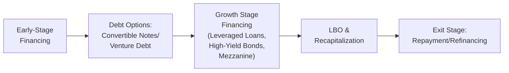

## Introduction
So, let’s talk about debt financing in the private markets world. Sometimes, it seems like everyone’s talking about equity or fancy new fundraising rounds, but many firms—especially those supported by private equity sponsors—rely significantly on borrowed money at some point in their life cycle. I remember once chatting with a founder who was feeling pretty stuck: her startup wasn’t quite ready for major venture capital but needed some immediate funding to cover product development. She ended up using a convertible note, which gave her just enough breathing room to scale without losing too much ownership too early. These real-world scenarios highlight one critical aspect of private markets: the use of debt can vary significantly depending on where a company sits in its own evolution.

Below, we’ll walk step by step through the typical usage of debt—from the earliest stages of a company’s journey through to the final exit. Along the way, we will explore everything from the nature of venture debt to leveraged buyouts and exit financing. You’ll see how each stage brings a unique set of challenges, opportunities, and risks for both borrowers (the companies) and lenders (the investors).

## Early-Stage Financing
Early-stage ventures—especially those in the pre-revenue or just-barely-revenue phase—often lack the validated cash flows and tangible assets that lenders usually love to see. Banks and traditional creditors might hesitate to provide big loans to a startup that has little more than an idea and a few enthusiastic employees. So that’s why, in many cases, pure equity (seed or venture capital) takes center stage. But let’s not forget convertible notes or venture debt—these are instruments that may fill the gap for founders who want to delay diluting their ownership but still need capital to tide them over until the next round of equity.

• Convertible Notes. Think of these basically like short-term loans that can morph into equity when certain milestones or financing events occur. They usually carry lower interest rates than other loan types, but lenders often receive warrants or conversion rights at a discount to a future equity round.

• Venture Debt. If a startup is venture-backed (or about to be), lenders may offer “venture debt” in smaller amounts. This approach usually carries higher interest rates than conventional bank loans, but—compared to typical equity—it may keep the ownership structure more favorable to the founders.

• Limited Collateral. Because early-stage firms often don’t have big factories or a track record of robust recurring revenue, they don’t have as many assets to pledge as collateral. As a result, interest rates are higher, maturity periods are usually short, and covenant structures can be strict (although smaller in scale than major corporate loans).

If you’ve ever tried to finance a brand-new business, you know it can feel like you’re constantly telling lenders, “I promise we’ll grow huge—just give us a chance!” The risk is yes, you might default if your product doesn’t pan out, but if things go well, you can use debt for a short period then convert it or repay it when you reel in that next equity round.

## Growth Stage to Maturity
As the company scales and has more predictable free cash flow, lenders become increasingly willing to break out the checkbook. So, let’s say a firm hits some decent revenue milestones, perhaps is profitable, or at least generating stable top-line growth. At this point, the conversation with potential creditors changes.

• Leveraged Loans. Companies that need to finance expansions, new product lines, or acquisitions may tap into leveraged loans. These often have security interests (in other words, they’re collateralized by the company’s assets) and come with certain covenants—maintenance covenants, incurrence covenants, you name it—to protect lenders if the firm underperforms.

• High-Yield Bonds. For more mature companies or those with strong brand recognition but still carrying higher leverage, high-yield bonds can be issued. These bonds pay a premium coupon to compensate investors for the extra default risk. They typically target institutional buyers—asset managers, hedge funds, and so on. 

• Mezzanine Debt. This gets sandwiched between senior secured debt and equity. Mezzanine debt is riskier, but it could offer the lender equity kickers (e.g., warrants) or higher coupons, which bump up their potential return. It’s also less dilutive than issuing pure equity from the company’s perspective.

• Stable Cash Flows. At this stage, the main reason companies can handle bigger debt burdens is that they have consistent revenue streams. They’re not simply an idea on a napkin. So, it becomes easier to do more complex financing—like floating-rate loans or bond deals with multiple tranches. 

It’s like going from “scrappy startup hustling for seed money” to a more stable business that lenders see as (relatively) safer. And the rates can be more favorable, partly because the firm has proven itself, and partly because big lenders—banks, insurance companies, institutional funds—are less concerned about default.

## LBO and Recapitalization
Let’s shift gears now to private equity sponsors who are doing their thing—buying companies, using leverage to juice returns, rapidly improving operations, and then selling at a higher multiple. If you’ve taken a stroll through the second item in Chapter 3 on buyout equity investments, you already know that LBOs typically involve a heavy load of debt. 

• The LBO Structure. In a leveraged buyout, private equity sponsors might put up just a fraction of the purchase price in equity—but borrow the largest portion from various lenders or by issuing high-yield bonds. The premise is relatively straightforward: if you can finance a deal with, say, 60% or 70% debt, you only need to put in 30% or 40% in equity. Then, if the company grows and you exit at a higher valuation, your equity returns are magnified. Of course, if the business stumbles, the high leverage can work against you.

• Recapitalization Over Time. After acquiring the company, the PE sponsor might refinance or restructure the debt along the way. For instance, if the company’s profits improve, it may issue new tranches at lower interest rates. Alternatively, if times get tough, it might renegotiate the covenants to avoid technical defaults.

• The Debt Evolution. A typical timeline might look like this: the LBO closes with a mix of senior loans, mezzanine financing, and possibly some seller notes. As the company hits milestones—like cost synergies or revenue growth—the sponsor might refinance the mezz to lower-rate senior loans or repay some portion using excess cash flow. 

• Risk-Return from an Investor Perspective. For lenders, LBOs can be attractive or terrifying, depending on how the business is managed. Senior secured loans generally rank first in the capital structure, so they’re safer. Mezzanine debt can offer higher yields but is riskier. Equity holders stand to gain the most—but also could lose everything if the company fails.

## Exit Stage
Eventually, the private sponsors will want to cash out: maybe by selling the business to a strategic acquirer, or by listing shares in an IPO. Debt doesn’t just disappear at exit, though—it either gets refinanced, restructured, or repaid by the new owner or via proceeds from the public market. That means lenders have to think about prepayment risk: if the sponsor decides to pay off a high-yield bond early, that can be good from a credit perspective but can be less ideal if the lender was relying on those coupon payments for yield. 

• Prepayment Risk. High-yield or mezzanine debt often comes with call protection—like call premiums or make-whole provisions—designed to compensate investors if they lose out on expected coupon yields. 

• Capital Structure Changes. If the exit is an IPO, the new public entity might refinance its private debt or retain only a portion of it. If it’s a strategic sale, the acquiring company might replace the entire capital structure with its own. The bottom line: exit events almost always involve changes that can impact lenders in surprise ways—like accelerated repayment or changes to covenants.

• Debt Investor Strategies. Some investors specialize in event-driven opportunities—like anticipating that an LBO or recapitalization might yield a big payoff if the debt is refinanced quickly at a premium. Others might value stable, recurring interest payments and hate prepayments. So the exit stage is a critical point in the life cycle for figuring out whether you get your expected returns—or see them cut short.

## Investor Considerations by Stage
The place of a company in its life cycle determines the type of debt that’s feasible—and changes risk and return. Importantly, investors need to match maturity periods, default tolerances, and structural protections with the borrower’s profile.

• Risk Tolerance. Early-stage debt investing is no joke. The default risk is high, so you’ll often see higher yields or equity kickers. As the company matures, the default risk tends to go down, and interest rates typically decline.

• Risk Mitigation. Senior secured debt, protective covenants, and equity cushions (e.g., sponsors committing a meaningful equity stake) all help reduce the risk to lenders. Especially in LBO scenarios, covenants might track metrics like interest coverage or leverage ratios.

  - For reference, the interest coverage ratio is often defined as:
    
    
    \text{Interest Coverage Ratio} = \frac{\text{EBIT}}{\text{Interest Expense}}
    
    
    This ratio basically indicates how many times over a company can cover its interest expense with its earnings before interest and taxes. A lower ratio signals higher risk to lenders.

• Timing and Liquidity. Early-stage debt can be illiquid if the markets for secondary loan trading are shallow. At the exit stage, debt holders might face the opposite challenge of early repayment. Matching an investment horizon to the company’s life cycle helps reduce nasty surprises.

To put it simply, you wouldn’t give a brand-new driver a high-performance race car with no conditions. In the same way, lenders scrutinize borrowers, carefully structuring terms to align with each specific stage.

## Practical Example
Imagine a small tech startup, “QuantumSense,” focusing on advanced sensor technology. Initially, it raises seed equity from angels. After a year, it needs more runway. Traditional bank loans are off the table because the company has minimal revenue. Instead, it issues convertible notes to raise $2 million, structured to convert into the next equity round at a 20% discount.

Two years later, QuantumSense is generating steady revenue selling sensors to automotive manufacturers. The founders want to build a new production line. They approach a mezzanine lender who offers $5 million in subordinated debt at a 10% coupon, plus warrants for 2% of the company’s equity. This new capital helps the firm ramp up production, get better revenue traction, and eventually position itself for expansion.

A few years on, a private equity sponsor sees an opportunity to take QuantumSense global. The sponsor leads a leveraged buyout with $30 million of senior bank debt, $10 million of mezzanine financing (refinancing the old mezz notes), and $20 million of equity from the sponsor. QuantumSense’s stable contracts with automakers are used as collateral, and the sponsor negotiates an interest coverage covenant that must remain above 2.5×. 

Finally, after four more years of operational improvements, the sponsor sells QuantumSense to a large electronics conglomerate. The senior bank debt is repaid in full upon sale. The mezzanine financing is taken out as well, and each gets a yield plus a small call premium. The PE sponsor sees a strong equity return on exit, thanks to the leverage used along the way. 

## Visualizing the Life Cycle with a Mermaid Diagram
To illustrate how debt financing typically evolves, here’s a simple flowchart:

Each step on the diagram corresponds to different financing needs, structures, and risk-return profiles.

## Best Practices and Common Pitfalls
• Align Debt Maturities with Business Strategy. If your company needs five years to reach profitability, don’t rely on a short-term note that matures in one year. Mismatching timelines often spells disaster.

• Monitor Covenant Headroom. Covenants are there to protect lenders, but they also give the company an incentive to maintain certain financial health metrics. Failing a covenant can trigger defaults, forced repayments, or renegotiations at unfavorable terms.

• Over-Levering. If a sponsor or management gets too ambitious with leverage, the slightest downturn in revenues can cause big problems. Many LBO disasters are the result of overconfidence in the ability to service debt.

• Underestimated Refinancing Risk. Just because you can pay your current obligations doesn’t mean you can easily roll them over later. If credit markets tighten or the company’s performance dips, refinancing can get expensive—or impossible.

## Exam Tips
• Scenario Analysis. For CFA Level III exam questions, be prepared to analyze hypothetical financing scenarios. You might see a question about the appropriate type of debt at a given stage or which covenants best protect the lender in a specific scenario.

• Capital Structure Priorities. Remember that senior secured loans generally have the strongest claim. Mezzanine debt stands behind them but ahead of equity. Understanding these priorities is crucial in default or bankruptcy scenarios.

• Calculations of Return. Be comfortable calculating yield to maturity or total returns when debt is refinanced or prepaid. You might need to apply the concept of call premiums or discounted cash flow to early repayment.

• Ethical Considerations. The CFA Code and Standards emphasize fair dealing and full disclosure. Overly aggressive financial models or ignoring obvious risks to push a debt deal might raise ethical red flags.

## References
• Gaughan, P. (2017). “Mergers, Acquisitions, and Corporate Restructurings.” Wiley.  
• PitchBook Data Inc. (Periodical). “US PE Breakdown.” https://pitchbook.com/  

------------------------------------------------------------------------------------------

## Review of Life Cycle Debt Financing in Private Investments



### Which type of debt is most commonly used in early-stage ventures that lack significant collateral or cash flow?
- [ ] Senior Secured Bank Loan
- [ ] High-Yield Bond
- [x] Convertible Note or Venture Debt
- [ ] Traditional Mortgage

> **Explanation:** Early-stage ventures often turn to convertible notes or venture debt because they lack the collateral or proven revenues required by traditional lenders, making these flexible and higher-risk instruments more suitable.

### Which of the following is the BEST description of mezzanine debt?
- [ ] It ranks senior to all other debt and has the lowest risk
- [ ] It is collateralized by all company assets
- [x] It sits between senior debt and equity, often carrying higher coupons and warrants
- [ ] It is the same as preferred equity

> **Explanation:** Mezzanine debt is generally subordinate to senior secured loans but ranks above equity. It often includes equity kickers (like warrants) and carries higher coupons, reflecting the greater risk.

### In the leveraged buyout (LBO) context, why do private equity sponsors typically use high levels of debt?
- [ ] To punish the target company’s management
- [ ] Because regulatory agencies mandate it
- [x] To amplify returns on their equity investment
- [ ] To avoid paying taxes on debt interest

> **Explanation:** By using debt, sponsors contribute a smaller equity amount, potentially enhancing their returns if the company’s value increases. Of course, higher leverage also heightens risk.

### Which of the following is the biggest concern for lenders during an exit event?
- [ ] High interest rates
- [ ] Stagnant cash flows
- [ ] Non-compliance with IFRS
- [x] Prepayment risk

> **Explanation:** Lenders may be repaid early at exit, which reduces their future coupon income. They often include call premiums to mitigate this risk.

### When a private equity sponsor issues new tranches of lower-rate debt to replace existing higher-rate obligations, this process is referred to as:
- [ ] A credit default swap
- [x] Refinancing
- [ ] Asset securitization
- [ ] Subordination

> **Explanation:** Refinancing involves taking on new, cheaper debt (or otherwise more favorable terms) to replace existing debt and reduce overall interest costs.

### Why is access to traditional bank loans often limited for very early-stage companies?
- [ ] They have higher hopes for growth
- [x] They often have uncertain cash flows and minimal collateral
- [ ] They are already publicly traded
- [ ] They have too many senior bond issuances

> **Explanation:** Early-stage companies typically lack the revenue and collateral banks require, making them too risky under standard guidelines for most traditional bank loans.

### Which of the following best describes an LBO capital structure after the initial financing period?
- [ ] It remains static until final exit
- [x] It can evolve through refinancings and additional tranches as milestones are reached
- [ ] It immediately pays off debt
- [ ] It is replaced entirely with equity

> **Explanation:** LBO sponsors often adjust the capital structure by refinancing or adding new tranches of debt as the business grows and meets financial milestones.

### Which ratio do lenders frequently track as part of maintenance covenants to ensure a company’s ongoing ability to service debt?
- [ ] Debt-to-equity ratio
- [ ] Tax coverage ratio
- [ ] Beta ratio
- [x] Interest coverage ratio

> **Explanation:** The interest coverage ratio (EBIT ÷ Interest Expense) is a common covenant metric to ensure a company can comfortably meet its interest obligations.

### What is one advantage of mezzanine debt from a borrower’s perspective compared to issuing equity?
- [ ] It completely eliminates repayment obligations
- [x] It is less dilutive to the current shareholders
- [ ] It provides the lowest possible interest rate
- [ ] It is always convertible to equity

> **Explanation:** Mezzanine debt can avoid substantial equity dilution, although it carries higher interest rates. Warrants attached to mezzanine debt provide partial equity upside to the lender but do not fully dilute existing shareholders.

### With respect to investor considerations, which statement is TRUE regarding early-stage debt?
- [x] Early-stage debt tends to have higher yields due to elevated default risk
- [ ] Early-stage debt typically carries the lowest interest rates
- [ ] Early-stage debt is highly liquid in secondary markets
- [ ] Early-stage debt never includes equity warrants

> **Explanation:** Because the default risk is higher for early-stage companies (little collateral, uncertain cash flows), lenders will usually demand higher yields and may also request equity warrants.


