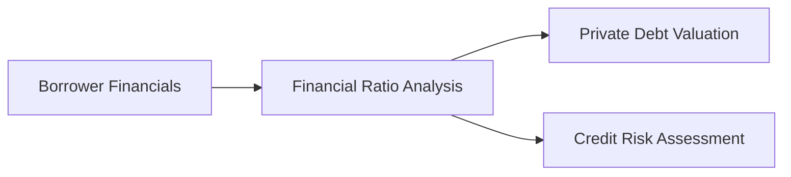

## The Importance of Ratio Analysis

Ever had that moment where you’re flipping through a borrower’s financials and thinking, “Wow, everything looks okay on the surface, but is it really safe to lend them money?” Yup, been there too. In private debt markets, lenders don’t just rely on broad statements like “we’re profitable”—they dive deep to make sure a borrower can, in fact, meet obligations in a variety of scenarios. That’s where financial ratio analysis comes in.

Ratio analysis is like a blueprint for understanding a company’s financial muscle. For private debt investors—whether analyzing leveraged loans, mezzanine financing, or uni‑tranche structures—this tool helps answer big questions: Do they generate enough cash to pay interest in a downturn? Is their balance sheet too stacked with debt? And how sensitive is the business model to margin fluctuations? If you’ve checked out Section 4.1 or 4.2, you’ll recall how different private debt instruments bring unique risk and return profiles. But no matter the instrument, ratio analysis is key to revealing how safe your capital will be when it’s locked away in someone else’s company.

## Common Ratios in Private Debt

Ratios distill mountains of raw data—income statements, balance sheets, cash flow statements—into concise measures of risk and capacity. Below are the most common categories that private debt investors and credit analysts scrutinize.

### Leverage Ratios

Leverage ratios show how the company’s capital structure depends on borrowed funds. Debt/EBITDA or Debt/Equity are typically the rock stars here. They are widely used to see if a firm has bit off more debt than it can chew.

• Debt/EBITDA: For many folks, this is the “go-to” gauge of leverage for private debt deals. EBITDA (Earnings Before Interest, Taxes, Depreciation, and Amortization) is a proxy for operating cash flow, though not a perfect one. If Debt/EBITDA is high—maybe pushing beyond 5x or 6x for a leveraged buyout—the company is leaning heavily on debt. Then lenders know: any downturn in earnings or any bump in interest costs will sour the borrower’s ability to meet obligations.

• Debt/Equity: This ratio shows how much of the company’s finances rely on debt vs. shareholders’ equity. High Debt/Equity means owners haven’t put in as much “skin in the game,” and lenders are taking on relatively more risk. In private markets, an excessive Debt/Equity ratio might lead to steeper interest rates or demands for additional collateral.  

Quick story: I once evaluated a mid-sized manufacturing firm with Debt/Equity of about 0.4x. This looked conservative at first. But once we adjusted for intangible assets, their tangible equity base was so small that the real leverage was closer to 2.0x. Lesson: check the actual quality of equity, not just the line item on the balance sheet.

### Coverage Ratios

Coverage ratios measure how comfortably a company can meet its fixed charges, typically interest. If coverage is wafer-thin, a dip in revenues can quickly escalate into fears of default. Two favorites in private debt:

• Interest Coverage Ratio: Usually calculated as (EBITDA ÷ Interest Expense). You might see variations such as (EBIT ÷ Interest Expense), but EBITDA is often used because it’s closer to a cash flow measure. An interest coverage ratio of 3.0x means the company generates thrice as much EBITDA as needed to pay interest. That might sound safe, but if earnings cycle downward, that 3.0x might become 1.5x faster than you’d think.

• Fixed Charge Coverage Ratio (FCCR): Typically (EBITDA – CapEx) ÷ (Interest + Lease Payments). This ratio adjusts for ongoing capital expenditures and lease expenses, which can be major fixed commitments. Many private creditors view FCCR as a more realistic reflection of the company’s true ability to service mandatory outflows.

### Liquidity Ratios

Even if a company’s capital structure is fine in the long run, sometimes short-term liquidity can be a killer. That’s where the Current Ratio and Quick Ratio step in.

• Current Ratio: (Current Assets ÷ Current Liabilities). Is your borrower able to handle the short-term bills coming due? A ratio below 1.0 can be concerning, although it’s sector-dependent (some industries like retail might have seasonal liquidity fluctuations).

• Quick Ratio: (Cash + Marketable Securities + Receivables) ÷ Current Liabilities. Similar to the Current Ratio, but it strips out inventory and other less liquid assets. This ratio tells you if the company has near-cash to meet near-term obligations—helpful if the business is prone to inventory buildups or if those inventories are illiquid.

### Cash Flow Metrics

We can’t forget about the actual “cash in, cash out” storyline, particularly in private debt deals. 

• Free Cash Flow (FCF): Operating cash flow (CFO) minus capital expenditures (CapEx). This is the holy grail for lenders. If FCF is consistently negative, watch out—where’s the money to pay off your loan going to come from?

• Operating Cash Flow (CFO): Some analysts compare CFO directly to total debt, or CFO to interest expense. A ratio like (CFO ÷ Total Debt) reveals how quickly a firm can theoretically repay its debt out of pure operating cash (assuming no dividends, buybacks, etc.).

## Projections and Sensitivity Analysis

In private markets, you rarely have a wide secondary market to rely on for daily pricing of the borrower’s credit risk. Your analysis has to dig deeper. Projection modeling with scenario analysis is the standard approach. You typically build:

• Base Case: The “most likely” scenario given management’s guidance and your market analysis.  
• Upside Case: A more optimistic forecast if certain growth drivers outperform or if cost efficiencies come faster than expected.  
• Downside Case: Stress test for slower sales, margin compression, or unexpectedly high costs.  

The differences in how your coverage or leverage ratios hold up under these scenarios highlight the margin of safety. If coverage dips below 1.0x in a mild recession scenario, you know the borrower might breach covenants or default under moderate stress.

### Scenario Analysis

Scenario analysis can help you see which assumptions matter most. Change interest rates up by 2%, or reduce revenues by 10%, and recalculate Debt/EBITDA or FCCR. Not so different from wearing multiple hats: “What if shipping costs spike? What if new regulations slow down expansions?” This exercise can identify which triggers send ratios plummeting.

One breezy memory: I recall an energy services firm we were reviewing. Management was confident about stable commodity prices. Our scenario analysis tested a 20% drop in oil prices. Sure enough, that little tweak took their Interest Coverage from a comfortable 4.0x to 1.2x. That changed our entire risk assessment, ironically leading to more stringent covenants.

## Qualitative Factors

The numbers tell an important story, but sometimes the intangible factors behind those numbers are just as critical.

• Management Quality: Do they have a track record of delivering stable margins or, at least, stable expansions? This factor often shows itself in the consistency of reporting, the realism of budgets, and how management responded to prior downturns.  

• Industry Dynamics and Competitive Position: Being in a cyclical or rapidly changing sector can strain the credit if the company can’t adapt. Think about technology disruptions. A centuries-old paper company might have continuously high leverage due to secular decline. Meanwhile, a cutting-edge software firm could pivot quickly but might have intangible-driven valuations that hamper ratio-based analysis.

## Application in Formation of Covenants and Pricing

Private lenders typically structure credit agreements with covenants that revolve around the very ratios we’ve discussed. For instance:

• Maintenance Covenants: “Borrower must maintain Debt/EBITDA below 4.0x at each quarter-end.”  
• Coverage Covenants: “Interest Coverage must remain above 2.5x.”  
• Material Adverse Change (MAC) Clauses: Tied to a combination of ratio triggers and other financial metrics.

When a borrower starts creeping near these limits, they often face a default or need a waiver. As a result, borrowers keep a close eye on these ratios too. In many deals, pricing (i.e., the interest spread) might ratchet up if leverage crosses a certain threshold—giving lenders more compensation for the added risk.

## Diagram: How Financial Ratios Flow Into Private Debt Valuation

Below is a Mermaid diagram illustrating the role of financial ratio analysis in private debt valuation and credit risk:

In a nutshell, you start with the borrower’s financial statements (A). You perform ratio analysis (B). Then, you feed those findings into your valuation model of the private debt instrument (C) and simultaneously assess how likely the borrower is to default (D). Each step depends on the quality and integrity of the step before it.

## Practical Example

Let’s consider a simplified numeric illustration: Suppose you’re evaluating a prospective private debt investment in a mid-market packaging company called BoxCo.

• Operating Income (EBIT): $50 million  
• Depreciation & Amortization: $10 million  
• Interest Expense: $8 million  
• Capital Expenditures: $12 million  
• Lease Payments: $3 million  
• Total Debt: $180 million  
• Equity: $60 million  

From these, you can derive:

• EBITDA = EBIT + Depreciation & Amortization = $50 million + $10 million = $60 million  
• Debt/EBITDA = $180 million / $60 million = 3.0x  
• Debt/Equity = $180 million / $60 million = 3.0x  
• Interest Coverage = EBITDA / Interest Expense = $60 million / $8 million = 7.5x  
• Fixed Charge Coverage = (EBITDA – CapEx) / (Interest + Lease) = ($60 million – $12 million) / ($8 million + $3 million) = $48 million / $11 million ≈ 4.36x  

From just these quick calculations, we see that BoxCo is moderately leveraged at 3.0x but with a good coverage ratio. A 7.5x interest coverage looks healthy. However, if we factor in other potential headwinds—maybe a 20% drop in revenue due to supply chain disruptions—EBIT could shrink, which would weaken those coverage ratios significantly. And that’s exactly why scenario testing is essential.

## Best Practices and Common Pitfalls

• Verify Data Consistency: Don’t just take the borrower’s adjustments to EBITDA at face value. Some companies are extremely generous in labeling charges as “non-recurring.”  
• Mind the Sector Norms: Ratios are relative metrics. A 2.0x Interest Coverage might be acceptable for a stable utility but terrifying for a tech start-up.  
• Allow for Cyclical Swings: If you’re lending to a building materials supplier, you might see big top and bottom line fluctuations. Tailor your covenants and ratio thresholds accordingly.  
• Check Off-Balance Sheet Liabilities: Leases or specific contractual obligations can act like debt. Factor them in your coverage calculations.  
• Revisit Periodically: Ratios can change quickly. Track them quarterly or monthly to catch warning signs.

## Exam Relevance and Strategies

For the CFA Level III 2025 exam, especially on the Private Markets Pathway, there’s a good chance you’ll see scenario-based questions about ratio analysis and covenant structures. For instance, an item set might give you a borrower’s financial statements plus pro forma forecasts if an acquisition closes. You’ll be asked to compute coverage ratios or evaluate if the borrower might trip a covenant. Or in essay (constructed response) format, you could be asked to propose a suitable covenant package based on the borrower’s ratio trends and industry outlook.

When tackling these questions:

• Show your work. In exam settings, partial credit is given for correct formulas, even if your final numeric answer is off.  
• Add context. If the question says the borrower is in an industry with volatile demand, mention that coverage targets should be set higher to create more cushion.  
• Time management. Don’t get bogged down—often, the ratio computations are straightforward, but the interpretation is what the examiners really want to see.

## Final Thoughts

In private debt investing, ratio analysis is more art than science—there are subtle judgments about “true” EBITDA, adequate liquidity, and cyclical booms or busts. But these ratios remain the foundation of credit risk assessment. So sure, get comfortable with the formulas—but equally important is applying them in a dynamic, forward-looking way. That’s where you, as a CFA charterholder, can stand out: bridging the gap between formulaic analysis and real-world nuance.

-----
References and Further Reading:  
• Harris, R. and Raviv, A. (1991). “The Theory of Capital Structure.” The Journal of Finance, 46(1).  
• Damodaran, A. (2012). “Investment Valuation.” Wiley.  
• See also Chapters 4.1 and 4.2 in this text, covering leveraged loans, high-yield bonds, and mezzanine structures.

## Test Your Knowledge: Financial Ratio Analysis for Private Debt Quiz



### Which of the following is the best description of what the Debt/EBITDA ratio measures?

- [ ] The ability of a borrower to meet short-term obligations.  
- [ ] The ratio of total equity to total liabilities.  
- [x] The extent to which a company’s earnings (before non-cash items) cover its debt obligations.  
- [ ] The margin of safety for covering interest payments.  

> **Explanation:** Debt/EBITDA shows how heavily the firm is leveraged relative to its approximate cash-generating capability. It doesn’t measure short-term obligations directly, nor does it indicate cover for interest expenses alone.

### In calculating the Fixed Charge Coverage Ratio (FCCR), which components are typically subtracted from EBITDA to get the numerator?

- [ ] Depreciation and amortization  
- [ ] Interest expense and taxes  
- [x] Capital expenditures  
- [ ] Net working capital changes  

> **Explanation:** A common iteration of FCCR is (EBITDA – CapEx) ÷ (Interest + Lease Payments), which factors in obligatory capital spending and lease expenses to assess the borrower’s ability to cover all fixed charges.

### Why do lenders often perform sensitivity analyses on a borrower’s projected financial statements?

- [x] To understand how changing assumptions about revenues, costs, or interest rates affect coverage and leverage ratios.  
- [ ] To eliminate the impact of cyclical industries.  
- [ ] To adjust the financial statements for one-time charges.  
- [ ] To hide non-recurring items from the analysis.  

> **Explanation:** Sensitivity analysis helps lenders see how adverse changes in key assumptions (e.g., lower revenues) affect the borrower’s capacity to meet debt obligations and maintain acceptable ratios.

### Which statement most accurately characterizes the difference between the Current Ratio and the Quick Ratio?

- [ ] The Quick Ratio includes inventory in its numerator.  
- [x] The Current Ratio considers all current assets, while the Quick Ratio excludes less liquid current assets like inventory.  
- [ ] The Quick Ratio is always higher than the Current Ratio.  
- [ ] They are interchangeable measures of liquidity.  

> **Explanation:** The Quick Ratio is more conservative because it strips out inventory (and sometimes other assets not quickly convertible to cash). Hence, it’s often lower than the Current Ratio.

### A borrower with a Debt/EBITDA of 5.0x and an Interest Coverage Ratio of 2.0x requests additional debt. Which of these points would be the biggest credit-risk concern?

- [x] High leverage may limit the borrower’s cushion if cash flows drop.  
- [ ] The borrower’s intangible assets are growing faster than revenues.  
- [x] Lower coverage indicates less ability to handle higher interest payments.  
- [ ] The borrower is in a non-cyclical industry.  

> **Explanation:** Both high leverage (5.0x) and lower coverage (2.0x) pose immediate red flags to lenders. The company has a reduced margin of safety to handle any downturn or interest rate hike.

### Which of the following is a potential drawback of using EBITDA as the primary measure for debt servicing capacity?

- [x] It excludes certain cash outflows like capital expenditures.  
- [ ] It includes taxes on a cash basis.  
- [ ] It is highly affected by non-cash items like depreciation.  
- [ ] It’s not recognized by IFRS.  

> **Explanation:** EBITDA omits capital expenditures, which can be large, recurring cash outflows. This omission can overstate the borrower’s ability to service debt.

### When might a private debt covenant tied to a Coverage Ratio be more appropriate than a covenant tied solely to Debt/Equity?

- [x] When a lender is particularly concerned about periodic cash flow sufficiency for interest obligations.  
- [ ] When the lender expects the borrower’s equity to remain constant.  
- [x] When the borrower’s industry is capital-intensive with significant fixed charges.  
- [ ] When the borrower only relies on equity markets for financing.  

> **Explanation:** Coverage ratios highlight the firm’s ability to meet fixed periodic payments. They matter especially in situations with high or recurring fixed costs. This captures the periodic debt service profile more accurately than Debt/Equity does.

### A company projects stable EBITDA but also anticipates a significant increase in CapEx to maintain growth. In evaluating credit risk, which ratio is likely to deteriorate the most?

- [ ] Debt/EBITDA  
- [x] Fixed Charge Coverage Ratio (FCCR)  
- [ ] Quick Ratio  
- [ ] Debt/Equity  

> **Explanation:** FCCR factors in capital expenditures (EBITDA – CapEx) in the numerator; thus, higher CapEx reduces the coverage ratio, even if EBITDA remains stable.

### Which of the following best describes the role of periodic ratio monitoring in private debt deals?

- [x] It helps detect early signs of financial stress, giving lenders time to renegotiate or enforce covenants.  
- [ ] It guarantees that the borrower’s chief accountant is adhering to IFRS.  
- [ ] It provides the lender with equity participation in the borrower’s stock.  
- [ ] It eliminates the need for any collateral or personal guarantees.  

> **Explanation:** By regularly monitoring ratios, lenders can spot warning signs, like deteriorating coverage or ballooning leverage, allowing them to work with the borrower on remedial steps or protections.

### True or False: If a borrower’s Debt/EBITDA ratio remains stable, it implies that the borrower’s risk profile has not changed.

- [x] True  
- [ ] False  

> **Explanation:** While the Debt/EBITDA ratio is a key metric, its stability doesn’t automatically mean risk hasn’t changed—one must also consider qualitative factors, industry shifts, liquidity, and the borrower’s ability to handle unexpected events. However, purely from a ratio standpoint, no change in Debt/EBITDA suggests a stable relationship between debt and earnings.


