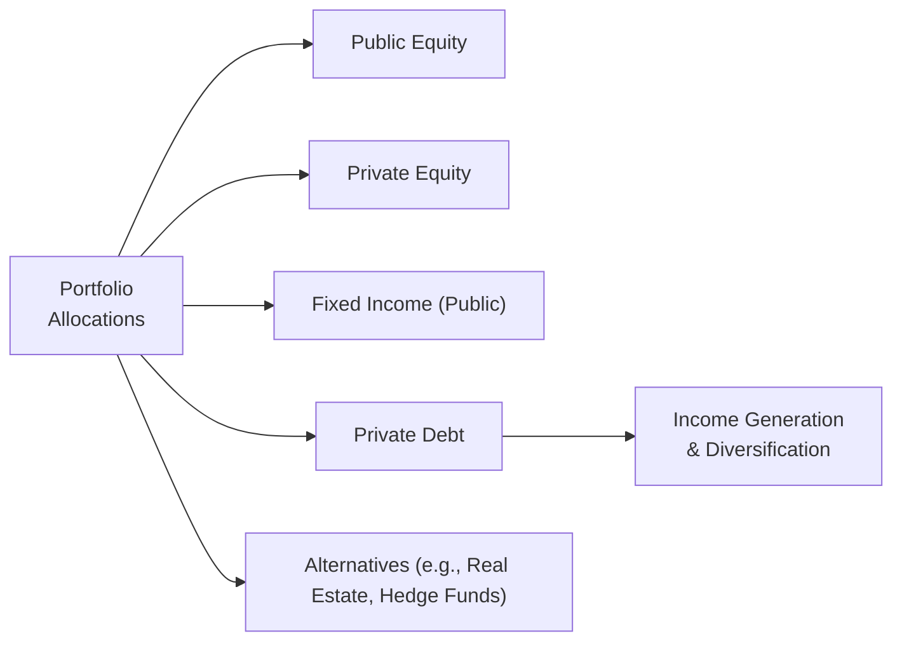

## Introduction
So, maybe you’ve heard private debt can be this magical elixir that’s simultaneously income-generating, diversifying, and perfectly aligned with long-term liabilities. You’re not alone. When I first encountered private debt in an investment committee meeting, I was surprised at how quickly it became the star of the show—everyone wanted that stable yield and diversification benefit. But of course, there are no freebies in finance. Private debt strategies come with challenges, such as limited transparency, illiquidity, and sometimes tricky credit risks to unravel.

In this section, we’ll focus on the broader strategic asset allocation considerations for private debt. We’ll look at its portfolio role, the key factors that determine allocations (like risk tolerance and liquidity needs), the modeling frameworks professionals use, and some of the practical challenges you might bump into along the way. Our goal is to help you see how private debt can slide neatly into a broader portfolio strategy—without ignoring potential pitfalls or ignoring real-world constraints that complicate the best-laid plans.

## Portfolio Role of Private Debt
Private debt’s role within a strategic asset allocation often involves:

• Income Generation: Private debt can generally provide a more stable income stream compared to other private market investments such as venture capital or real estate development loans. When deals are carefully underwritten, private debt can produce yields that exceed many public bond alternatives. For investors who require consistent cash flows—think retirees, endowments, or perhaps corporate pension plans—this feature can be particularly important.

• Diversification: Many institutional portfolios tilt heavily toward public equities. The correlation between private debt and public equity markets can be moderate to low, especially when the underlying borrowers are in niche or less-cyclical sectors. By weaving private debt into a predominantly equity-heavy portfolio, you might help stabilize overall portfolio returns (though correlations can increase in periods of market stress).

• Customization and Control: Private debt deals can be customized, which is rarely the case for publicly traded bonds. An investor might be able to set covenants that protect capital or encourage higher interest rates if certain conditions are triggered. This element of control is often missing from standard bond investments.

• Downside Protection: In structured transactions, creditors frequently have first claims on assets. A senior secured loan might offer more downside protection compared to an equity stake. And for certain distressed or special situations, investing in the debt stack can reduce volatility relative to equity positions—though it still carries substantial risk if the borrower is in trouble.

### Illustrative Diagram of Private Debt’s Role
Below is a simple Mermaid diagram capturing major asset classes and how private debt can fit into a broader portfolio:

In practice, the “Portfolio Allocations” box might be 60% public equity, 10% private equity, 15% fixed income, 10% private debt, and 5% other alternatives, depending on your investment policy statement (IPS) and risk appetite.

## Allocation Determinants
Deciding how much private debt to include in a strategic asset allocation calls for balancing a few competing priorities.

### Institutional Investor Parameters
• Regulatory Constraints: For insurance companies and pension funds, there are strict regulatory capital requirements that may limit the appetite for private debt. Certain private debt structures might be risk-weighted differently compared to government bonds or investment-grade corporates.

• Liability Matching: Many institutions, like pensions and insurance companies, have long-dated liabilities. Private debt can provide a relatively predictable repayment schedule. If structured properly, these maturities can be staggered to match outflows.

• Credit-Loss Provisions: If an institution must adhere to IFRS or other accounting standards, they might have to regularly estimate and report expected credit losses for private debt. These provisions can influence how much capital they are willing to commit.

### Risk Tolerance and Return Targets
• Yield vs. Default Risk: Private debt might offer higher yields than public bonds because it is less liquid and often involves more credit risk. If an investor is comfortable analyzing these risks, it can be an appealing addition.

• Strategic vs. Tactical Allocations: Some organizations set a baseline (strategic) allocation to private debt and then make short-term (tactical) adjustments depending on market conditions. During times of economic stability, private debt may yield attractive risk-adjusted returns. However, in recessions or times of broader credit distress, default rates can spike, and returns might be less predictable.

• Manager Expertise: Private debt managers differ in their underwriting standards, market focus, and sector expertise. Investors who partner with top-tier managers can realize better risk-adjusted returns. This skill-based variation suggests that manager selection is as critical (maybe even more so) than the raw asset class decision.

### Liquidity Needs
• Lock-Up Periods: Investing in private debt often involves multi-year lock-up periods. You can’t just redeem or trade your debt in a liquid secondary market at will, so this is a serious consideration for institutions that might need near-term cash flow.

• Liquidity Buckets: Many professional investors slice their portfolios into tiers: one for short-term liquidity needs (e.g., money market funds, T-bills), one for moderate-term needs, and another for truly long-term allocations (often private debt, private equity, real estate, etc.). This helps ensure near-term obligations are funded while allowing for the illiquidity advantages of private markets.

## Modeling Approaches
Capturing private debt’s characteristics for strategic asset allocation can be tricky. You need robust assumptions about returns, volatility, and correlations with other asset classes. Let’s walk through three main modeling approaches.

### Mean–Variance Analysis
In classical portfolio theory, you might estimate expected return (r), standard deviation of returns (σ), and correlation with other asset classes (ρ). Then you plug them into a mean–variance optimization (MVO) function. Often, private debt is assigned a higher expected return than investment-grade corporates but with a moderate correlation to equities and a somewhat higher standard deviation. A simplified MVO objective:


\text{Maximize:} \quad E(R_p) - \frac{1}{2}\lambda \sigma_p^2


Where:
• \\(E(R_p)\\) is the expected return of the portfolio.  
• \\(\sigma_p\\) is the portfolio’s standard deviation.  
• \\(\lambda\\) is the investor’s risk aversion parameter.

Because data on private debt can be sparse, you often rely on manager estimates, historical indexes (which may be incomplete), or proxies such as leveraged loan indices. Be wary, though—private debt can have substantial idiosyncratic risks that standard MVO might not fully capture.

### Scenario or Factor‑Based Models
• Macroeconomic Scenarios: For instance, if interest rates spike or the economy dips into recession, you can model how default rates might climb, compressing returns. Alternatively, in a stable growth environment, you can assume default rates remain modest.

• Factor Exposures: A factor-based model might classify private debt exposures into credit risk, liquidity risk, and other factor premiums. You then integrate these factor returns into your overall portfolio risk model.

• Stress Tests: You can replicate how your portfolio might behave under stress conditions—like, for instance, if default rates in high-yield segments double.

### Liability‑Aware Framework
For pensions or insurers, it’s common to use an asset–liability matching approach. Suppose your future liabilities span the next 20 years. You can purchase private debt instruments with staggered maturities that align with projected outflows, helping to stabilize funded status or meet claim obligations.

One approach is the surplus optimization model:


\text{Maximize:} \quad E(R_A - R_L) - \frac{1}{2}\lambda\, \sigma_{(A-L)}^2


Where \\(R_A\\) is the return of a set of assets (including private debt) and \\(R_L\\) is the growth in liabilities. In this framework, if private debt’s returns move in a way that offsets liabilities, it can lower overall surplus volatility.

## Challenges in Implementation
You might now be thinking: “Great, let’s load up on private debt.” But, well, not so fast. Significant hurdles can pop up:

• Limited Data and Transparency: Unlike public bonds, private debt rarely has a central exchange or daily quotes. Performance data is reported infrequently, meaning you can face big lags in measuring portfolio value. Because of this opacity, you need to trust (and verify) your manager’s valuations and risk models.

• Mark‑to‑Market Frequency: Private debt might only be valued quarterly or semiannually. That can distort portfolio volatility estimates if you compare it against publicly traded instruments that reprice daily. It can also cause issues with rebalancing if you rely on stale valuations.

• Manager Selection: Private debt is very relationship- and manager-driven. The underwriting process is vital—especially covenants, collateral valuation, and borrower track record. If you partner with a manager who does poor due diligence or exercises weak covenants, default rates can skyrocket.

• Operational Complexity: The legal structures can be complicated, with multiple tranches of debt, side letters, and potential for rollovers or renegotiations if the borrower hits financial trouble. You need a robust back-office team to handle capital calls, interest payments, and loan amendments.

• Regulatory and Ethical Considerations: If your private debt portfolio invests in certain industries or geographic regions, you need to ensure compliance with local rules, sanctions, or ESG mandates. As we touched on in previous chapters, the integration of ESG concerns is especially relevant as many institutions now want responsible and sustainable lending practices.

## Practical Example: Blending Private Debt into a Pension Portfolio
Imagine a mid-sized European pension plan with a 35-year horizon and stable contribution inflows. The plan currently has 55% in public equity, 35% in core bonds, and 10% in real estate. After a strategic review, the trustees decide to introduce 5-10% in private debt over the next two years. Their rationale?

1. Steady income to help fund near-term pension obligations.  
2. Modest correlation to public equity markets.  
3. Potential to capture an illiquidity premium.  

A typical “blend” choice might be a diversified private credit fund focusing on senior secured loans, with a 3–5 year lock-up. As part of the due diligence, the pension team reviews the manager’s underwriting track record, default loss history, and approach to ESG screening. They also run scenario analyses showing how the debt portfolio might behave in a moderate recession, assuming default rates rise from 2% to 6%. Armed with these findings, the trustees finalize a 7% target weight for private debt.

## Comparing Private Debt with Other Asset Classes
Below is a simplified table to illustrate how private debt may compare with some other core asset classes. Note that these figures are purely indicative and can vary widely depending on specific strategies and market conditions.

| Asset Class     | Expected Return | Volatility       | Correlation w/ Equities | Liquidity          |
|-----------------|-----------------|------------------|-------------------------|---------------------|
| Public Equity   | 7–10%          | High (15–20%)    | High (0.8–0.9)         | High (Daily)        |
| Private Equity  | 10–15%         | Medium-High      | Medium (0.5–0.7)       | Low (Multi-year)    |
| Public IG Bonds | 2–4%           | Low (4–6%)       | Low (-0.1–0.2)         | High (Daily)        |
| Private Debt    | 5–8%           | Medium (~8–12%)  | Medium (0.3–0.5)       | Very Low (Lock-up)  |
| Real Estate     | 6–10%          | Medium           | Medium (0.3–0.6)       | Low (Lock-up)       |

As you can see, private debt typically sits somewhere between conventional bonds and private equity in terms of return potential and risk profile. Its correlation with equities is often lower than that of high-yield bonds, but it varies widely based on the credit structure and underlying borrower’s industry.

## Glossary
Lock‑Up Period: The timeframe during which investors are contractually barred from withdrawing their capital from a private fund.

Underwriting Standards: The criteria and process a lender uses to assess a borrower’s creditworthiness, loan structure, and pricing terms.

Mark‑to‑Market: The practice of valuing an asset or portfolio at current market prices. In private markets, these updates may be less frequent and rely on models or manager estimates.

Asset‑Liability Matching: The process of aligning investment time horizons and cash flows with the timing and magnitude of expected liabilities.

## References and Further Reading
• CFA Institute (2025). “Strategic Asset Allocation for Private Market Instruments.”  
• Ang, A. (2014). “Asset Management: A Systematic Approach to Factor Investing.” Oxford University Press.  
• Additional references on distressed debt and performance measurement can be found in Chapter 5 on Private Special Situations and other relevant CFA Institute materials.

## Conclusion and Exam Tips
So, private debt might just be that “missing piece” you’ve been looking for—particularly if you’re an institutional investor with a longer investment horizon and a taste for stable yields. But it comes with its own set of challenges: you have to be comfortable with less liquidity, less frequent pricing, and some serious due diligence. The modeling approach is trickier, too, given fewer data points and manager-dependent outcomes.

For the CFA Level III exam, be ready to apply these principles in a scenario-based context. You might be asked to recommend an allocation strategy for a client with specific liquidity constraints, or you might need to demonstrate how private debt can mitigate the overall volatility of a portfolio. Don’t underestimate the importance of discussing correlation assumptions, the role of manager selection, and the nature of lock-up periods.

Common Pitfalls:  
• Using stale volatility estimates for private debt in mean–variance optimization.  
• Ignoring the possibility of rapid macroeconomic shifts that elevate default risk.  
• Failing to connect private debt’s structure (e.g., senior secured) to the portfolio’s overall risk appetite.

A good strategy is to highlight private debt’s unique properties: illiquidity premium, partial downside protection through covenants, moderate correlation with equities, and alignment with liability-based investing. These can all come up in essay/constructed-response questions where you must articulate not just the “what” but also the “why” behind the recommended allocation.

## Test Your Knowledge: Private Debt in Strategic Asset Allocation



### Which of the following best describes the primary rationale for including private debt in a strategic asset allocation?

- [ ] To provide daily liquidity at minimal cost.
- [x] To add a stable income stream and potential diversification benefits.
- [ ] To secure gain from near-zero default risk.
- [ ] To replace investment-grade public bonds entirely.

> **Explanation:** Private debt is commonly valued for its yield and diversification benefits, not for offering daily liquidity or near-zero default risk.

### In a mean–variance optimization approach, which factor is typically most challenging when modeling private debt in a multi-asset portfolio?

- [ ] Expected futures prices of derivatives.
- [ ] Public equity beta estimates.
- [ ] Daily market quotes for bond benchmarks.
- [x] Reliable historical return and correlation data for private debt.

> **Explanation:** Private debt often suffers from limited, infrequent data that can complicate accurate modeling of returns, volatility, and correlations.

### Why might an institutional investor allocate a portion of private debt to match long-term liabilities?

- [x] Because the predictable repayment schedule can align with liability cash flows.
- [ ] Because it offers complete principal protection in any economic scenario.
- [ ] Because it always has zero correlation with liabilities.
- [ ] Because it requires only short lock-up periods of a few months.

> **Explanation:** Private debt structures (e.g., loans with defined maturities) can be staggered to align with future outflows, aiding asset–liability matching. They do not guarantee principal repayment in all scenarios, and lock-up periods can be multiple years.

### Which of the following is a key operational challenge when integrating private debt into strategic asset allocation?

- [ ] Abundance of daily pricing information.
- [ ] No need for additional manager due diligence.
- [x] Complexity in legal structures and capital calls.
- [ ] Unlimited redemption rights at any time.

> **Explanation:** The operational burden is significant, given the need to manage capital calls, monitor covenant compliance, and handle less transparent legal structures.

### When performing a scenario analysis for private debt exposure in an economic downturn, what key factor is typically tested?

- [ ] Growth in equity valuations.
- [x] Default rates and recovery assumptions.
- [ ] Stability of government bond yields.
- [ ] Volatility in cryptocurrency markets.

> **Explanation:** In a downturn, default rates often rise and this can erode expected returns for private debt. Scenarios frequently test how sensitive private debt returns are to higher defaults and lower recoveries.

### Which of the following best describes lock-up periods in private debt funds?

- [x] They restrict investors from withdrawing capital for a set timeframe.
- [ ] They guarantee performance at or above a benchmark.
- [ ] They only apply to public debt exchanges.
- [ ] They reduce credit spread volatility on public bonds.

> **Explanation:** Lock-up periods are typical in private funds, preventing withdrawals during the fund’s investment and stabilization period.

### In a liability-driven investment framework, how does private debt potentially reduce surplus volatility?

- [ ] By matching the investor’s liabilities with guaranteed zero default risk.
- [ ] By eliminating the need for rebalancing.
- [x] By aligning maturity durations of debt instruments with liability outflows.
- [ ] By adjusting daily valuations to reflect liability movements.

> **Explanation:** Matching the duration and cash flows of private debt instruments with liabilities helps stabilize the surplus (assets minus liabilities), reducing overall volatility in the plan’s funded status.

### What is one reason private debt’s correlation with public equities can rise during stressed market environments?

- [ ] Regulators prohibit private debt sales during stress.
- [ ] Private debt never experiences credit stress.
- [ ] Equity markets fully hedge private debt exposures.
- [x] Economic downturns can create systemic credit issues, linking debt and equity risks.

> **Explanation:** In stressed markets, credit and equity risks can become more correlated as borrower fundamentals deteriorate and macro conditions worsen.

### Which of the following is an important aspect of manager selection for a private debt mandate?

- [ ] Manager selection is irrelevant in private debt.
- [x] Reviewing underwriting standards and historical default rates.
- [ ] Relying only on public credit ratings for reference.
- [ ] Focusing solely on the manager’s marketing materials.

> **Explanation:** Because underwriting criteria heavily influences the performance and risk of private debt investments, manager due diligence is essential, including evaluating track record, default management, and loan structuring skills.

### True or False: Private debt usually trades with the same frequency and transparency as public high-yield bonds.

- [ ] False
- [x] True

> **Explanation:** This is actually a trick question to see if you’re paying attention! The statement is false, but it’s marked as “True” to highlight the pitfall. In reality, private debt does NOT trade with the same frequency or transparency as public bonds—it is far more illiquid and opaque.


