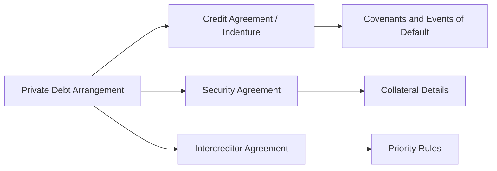

## Introduction

So, let’s say you’ve decided to dip your toes into private debt. You might be thinking, “Sure, I’ll lend some money, collect interest, maybe eventually get my principal back—what can go wrong?” Well, in my experience, it’s not always that simple. One key piece that can make or break your investment is the presence (or absence) of carefully crafted covenants and robust legal documentation. It’s like building a fence around your yard: covenants help keep the borrower (the yard) in check, and legal documents define exactly what that fence is made of, how high it must be, and what happens if your neighbor decides to sneak in.

But anyway, let’s walk step by step through the main concepts of covenant analysis and documentation. It’s an area that intimidates a lot of people, so hopefully we’ll break it down in plain terms.

## Key Covenant Types

Covenants, in general, are promises or conditions laid out in the lending agreement that a company must follow when it borrows money. In private debt, you often hear about two main categories: maintenance covenants and incurrence covenants. Although they both aim to protect lenders, they do so in slightly different ways—and that difference can be crucial when markets turn volatile.

### Maintenance Covenants

Maintenance covenants require the borrower to maintain certain financial conditions at regular intervals, such as quarterly or semi-annually. Imagine the lender saying: “Okay, buddy, I’m giving you this loan, but I want to see that you can keep your major credit ratios healthy.” A classic example is a maximum Debt/EBITDA ratio:

(1)  
Debt/EBITDA ≤ X  

This means if Debt/EBITDA creeps above that threshold, the borrower is in violation. The nice thing about maintenance covenants is that they’re tested continuously, so lenders can step in earlier if a borrower’s financial position deteriorates. You know, it’s like checking your credit card balance every month to make sure you’re not going off the rails.

### Incurrence Covenants

Incurrence covenants, on the other hand, only kick in when something specific happens—like the borrower tries to issue more debt, make large dividends, or engage in a big acquisition. It’s not tested all the time. Instead, it’s triggered by an event. If the company wants to do something that might affect its creditworthiness, the incurrence covenant says: “Hold on, you need to ensure your Debt/EBITDA is still within these boundaries before you do that.” As you can imagine, that means there’s a bit more flexibility for the borrower in day-to-day operations. However, incurrence covenants typically offer less ongoing protection for lenders compared to maintenance covenants, because any financial deterioration that doesn’t involve a triggering event might go unchecked.

## The Role of Documentation

If covenants are the fence around your yard, the legal documentation is the blueprint behind it all—a blueprint that spells out ownership, maintenance rules, and the recourse if the fence or yard is damaged. For any private debt deal, documentation is critical. A well-drafted credit agreement or indenture clarifies:

• The principal amount and interest rate  
• The maturity schedule and repayment terms  
• The security or collateral pledged  
• The exact wording and definitions of performance benchmarks  
• The events of default and available remedies if those events occur  

This is where lawyers and finance pros huddle. If the documentation is riddled with ambiguities, then come default time, you might spend a fortune in court figuring out who has the right to seize collateral or accelerate the debt.

## Protective Provisions

Along with covenants, lenders often rely on additional protection clauses. They’re like the extra locks on your door to make sure if one fails, there are backups.

### Negative Pledge

A negative pledge prevents the borrower from pledging the same collateral to a new lender. It’s basically a way for you to say, “Look, if I’m giving you a loan secured by your building, you can’t go and let someone else secure that exact same building. That’s my first claim, so keep it free from other liens.” Lenders are protective by nature, so negative pledges keep them from losing out if things go wrong.

### Cross-Default Clauses

Then there’s the cross-default clause, which is possibly my favorite (if I can have a favorite clause). Cross-default basically says: “If you default on one debt, you’re automatically considered in default on all your other debt.” It’s kind of blunt—if you run into trouble paying your convertible bond, well, guess what, your term loan might come calling due as well. This helps protect lenders from a situation where they quietly watch as a borrower defaults on other obligations but keeps paying them. If you’re in default with a different creditor, you’re in default with me too.

### Restricted Payments

Restricted payment provisions limit how much money can leak out of the company—often in the form of dividends or share buybacks—while the loan is outstanding. Lenders generally don’t like to see a borrower draining cash through generous dividends if the debt hasn’t been paid down. So, a restricted payment covenant says: “You can take these dividends only if your leverage ratio stays below X, or if you have a certain coverage ratio, or if there’s a dedicated basket of leftover cash flow after meeting your debt service.”

## Documentation Mechanics

It’s not just the presence of these clauses that matters—how they’re documented is equally important. Usually, the “big three (plus one)” in private debt deals include:

• Credit Agreement (or Indenture if it’s a Bond)  
• Security Agreement  
• Intercreditor Agreement  
• Possibly a Collateral Agency Agreement (for distributed or syndicated lenders)  

### Credit Agreement / Indenture

The credit agreement or indenture spells out the fundamental terms of the loan or bond. It’s basically your user’s manual. In it, you’ll find the interest rate, repayment schedule, covenants, events of default, and remedies. You’ll also see definitions that clarify how certain ratios are calculated (e.g., how do we define EBITDA?). Every word counts. If the loan states “Adjusted EBITDA excludes extraordinary items,” better be sure everyone agrees on the definition of an “extraordinary item.”

### Security Agreement

The security agreement details which assets are pledged as collateral, whether that’s real estate, equipment, intellectual property, or all of the above. It also spells out the processes and responsibilities for both the borrower and the lender in case the lender needs to foreclose and take possession of those assets.

### Intercreditor Agreement

If there’s more than one creditor in the picture, an intercreditor agreement basically sets a priority list: “Who stands first in line if something goes wrong and the borrower can’t pay in full?” This might detail how collateral proceeds get distributed or who can enforce a default claim first. Without a solid intercreditor agreement, creditors can end up in chaotic legal fights, each grabbing for assets like kids fighting over the last slice of pizza.

Below is a simple mermaid diagram that illustrates how these agreements interrelate:

## Best Practices in Covenant Negotiation

Negotiating covenants and documentation is more art than science. You might see a CFO or Treasurer pushing for “covenant-lite” terms—fewer restrictions, more incurrence over maintenance tests—while lenders want more robust protections. From the lender side, here are a few best practices:

• Be precise with your definitions. Make sure “EBITDA” or “net income” is spelled out carefully to reduce disagreements later.  
• Include cure rights or grace periods for breaching maintenance covenants, giving the borrower a chance to remedy shortfalls if they’re short-term.  
• Consider step-ups or step-downs. Maybe you allow a slightly higher leverage ratio in the early years that tightens over time if performance is expected to improve.  
• Monitor “baskets.” Borrowers often want “baskets” that let them do small distributions, acquisitions, or other restricted payments up to certain amounts without triggering incurrence provisions.  

## Real-World Example: Covenant Breach in a Retail Chain

Let’s say a mid-tier retail chain, call it GlobalStyle, finances an expansion with a term loan that has a maintenance covenant requiring Debt/EBITDA ≤ 4.0x. Suddenly, a new online competitor emerges, hurting GlobalStyle’s sales. Their EBITDA drops, pushing Debt/EBITDA from 3.8x to 4.2x, exceeding the threshold. Because it’s a maintenance covenant, they must test it quarterly, so GlobalStyle is technically in default right away.

The lender has legal remedies—potentially charging a penalty interest rate or accelerating the loan—but if they believe in the long-term viability of GlobalStyle, they might negotiate an amendment. Perhaps the ratio is relaxed to 4.5x for the next two quarters, in exchange for an additional fee. Or maybe they add a “covenant cure” arrangement letting GlobalStyle inject fresh equity or dispose of some assets to restore compliance.

If the same situation happened under purely incurrence-based covenants, GlobalStyle might never breach the covenant unless they actually tried to incur new debt. So they’d slip into deeper trouble without the lender’s direct intervention.

## Potential Pitfalls

Here are some things that can trip you up:

• Overly lenient definitions of EBITDA. If you exclude too many items, the borrower might avoid covenant breaches longer than is prudent.  
• Unclear cross-default language. You might find yourself unknowingly in default if a related entity fails to pay its separate debt.  
• Weak collateral. Even with a security agreement, if your collateral is illiquid or overshadowed by other claims, your protection might not be worth much.  
• Vague negative pledge language. If it’s not explicit, the borrower might still manage to layer in additional secured obligations before your claim.  

## Investor Action Steps

Once you’ve negotiated (hopefully) robust covenants, you don’t just file them away and forget about them. Monitoring is key. Typically:

• Demand regular financial reports. Quarterly or monthly statements help track compliance.  
• Look for early warning signs. If the borrower’s leverage ratio is edging up or coverage ratio is dropping, that’s your cue to dig deeper.  
• Plan your remedy. If a breach happens, you need a plan—do you waive the covenant, impose a penalty, or accelerate the loan?  
• Keep an eye on the “four corners” of your documentation. A fallback plan is worthless if it’s not spelled out clearly in the agreement.

## Concluding Remarks and Final Exam Tips

In the CFA® Level III exam context, especially for private markets, expect scenario-based questions where you must apply covenant knowledge to hypothetical lending arrangements. They might give you ratio thresholds, example defaults, or ask how certain events (like a leveraged buyout or surprise negative earnings) affect covenant compliance. Time management is crucial: read the scenarios carefully to identify exactly which covenant is being tested—maintenance or incurrence—and how it is impacted.

You might also see item set questions testing your ability to identify which protective provisions are triggered under certain events. Or you could be given a partially written term sheet and asked to spot weaknesses in the documentation. Approach them methodically:

• Summarize the covenant definitions and confirm you fully understand the ratios.  
• Identify any triggers or events of default.  
• Decide which remedies or protective provisions are relevant.  

Don’t overthink it—many questions are about correctly reading and interpreting covenant language. Keep practicing with sample vignettes, because the exam loves to test your ability to read the fine print under time pressure.

## Glossary

Maintenance Covenant: A continuous test, usually measured quarterly, which the borrower must maintain.  
Incurrence Covenant: Restricts certain corporate actions (like new debt or major acquisitions) unless financial thresholds are met.  
Indenture: The contract that governs bond terms, including interest, maturity, and covenants.  
Intercreditor Agreement: Defines how different lenders share collateral and prioritize claims.  
Collateral: The assets pledged as security for a loan or bond.

## References and Further Reading

• Petersen, M. & Rajan, R. (1994). “The Benefits of Lending Relationships: Evidence from Small Business Data.” The Journal of Finance, 49(1).  
• ABA Business Law Section. “Model Credit Agreement Provisions.”  
• CFA Institute. (most recent edition). “CFA Program Curriculum Level III, Private Debt Readings.”  
• S&P Global Market Intelligence. “Guide to Credit Agreements and Covenant Analysis.”  

---

## Test Your Knowledge: Covenant Analysis in Private Debt



### A lender wants to ensure that a borrower maintains specific leverage levels at all times. Which covenant type aligns best with this intention?

- [ ] Incurrence covenant
- [x] Maintenance covenant
- [ ] Negative pledge
- [ ] Restricted payment

> **Explanation:** Maintenance covenants require borrowers to keep certain financial metrics within thresholds on a periodic (e.g., quarterly) basis. Incurrence covenants only apply when the borrower attempts certain actions (like incurring new debt).

### A private lender is worried the borrower may pledge identical collateral to another lender in the future. Which provision most directly addresses this concern?

- [ ] Incurrence covenant
- [ ] Cross-default clause
- [x] Negative pledge
- [ ] Intercreditor agreement

> **Explanation:** A negative pledge clause prevents the borrower from granting additional security interests in the same collateral to future lenders, thus protecting the original lender’s claim.

### In an incurrence covenant framework, when is the borrower most likely to be tested for compliance?

- [ ] At each quarter’s end
- [ ] At the lender’s discretion
- [ ] Every year on the anniversary of the loan
- [x] When specific corporate events arise, such as issuing new debt

> **Explanation:** Incurrence covenants only come into play upon an action by the borrower, like issuing new debt or paying a large dividend.

### Which document typically outlines the rights and obligations of the borrower and provides detailed definitions of financial ratios in a bond deal?

- [ ] Security agreement
- [x] Indenture
- [ ] Intercreditor agreement
- [ ] Equity subscription agreement

> **Explanation:** In a bond deal, the indenture is the main governing document containing the terms (rates, maturities, covenants, defaults) and any definitions needed for compliance.

### A lender notices that the borrower is slightly above a required leverage ratio, putting them in breach of a maintenance covenant. What is one possible remedy if the lender still believes in the borrower’s fundamentals?

- [x] Covenant amendment or waiver
- [ ] Immediate liquidation of collateral
- [x] Charging a penalty interest fee
- [ ] Exercising the negative pledge

> **Explanation:** Lenders can negotiate amendments or waivers (potentially with extra fees). While seizing collateral is an option, it’s typically a last resort. They may also charge a penalty rate, commonly referred to as a default rate or step-up interest rate.

### A cross-default clause is best described as:

- [x] A provision that states a default on one debt triggers a default on all other debt
- [ ] A restriction on the borrower’s ability to issue new debt
- [ ] A clause governing how multiple lenders divide payments
- [ ] A requirement that the borrower maintain certain accounting standards

> **Explanation:** Cross-default ensures that if the borrower defaults on any one obligation, all obligations under cross-default clauses will also be considered in default.

### Which of the following scenarios could most likely trigger an incurrence covenant breach?

- [x] The borrower attempts to pay a large dividend while already at a significant leverage ratio
- [ ] The borrower’s quarterly Debt/EBITDA ratio is 0.1x above the permitted threshold
- [ ] A third-party lender claims the same security interest was granted to it without a negative pledge
- [ ] The borrower changes its method of calculating EBITDA

> **Explanation:** Incurrence covenants typically become relevant if the borrower seeks to pay a large dividend, issue new debt, or make an acquisition that would push its ratios beyond allowable limits, thus breaching the covenant.

### Which best defines a negative pledge?

- [ ] A clause that triggers automatic default on all debt if one default occurs
- [ ] A requirement to maintain certain accounting standards
- [x] An agreement that prevents a borrower from granting the same collateral to other lenders
- [ ] A borrower’s commitment not to pay dividends above a certain threshold

> **Explanation:** A negative pledge prevents the borrower from pledging the same collateral to secure other debt, protecting the lender’s collateral priority.

### Why is precise language in the definitions of EBITDA or cash flow so important in covenant documentation?

- [x] It prevents disputes over financial metrics and covenant thresholds
- [ ] It ensures the borrower never has to compute those metrics under IFRS
- [ ] It automatically removes the need for a security agreement
- [ ] It makes cross-default clauses unenforceable

> **Explanation:** Ambiguities in how EBITDA or cash flow is defined can lead to significant disagreements over whether a covenant is met. Detailed language reduces the risk of costly legal disputes.

### A restricted payments provision typically protects lenders by:

- [x] Limiting dividends or stock buybacks that drain cash
- [ ] Restricting new pledges of existing collateral
- [ ] Triggering a default if another debt defaults
- [ ] Allowing immediate liens on all corporate assets

> **Explanation:** Restricted payments provisions limit the borrower’s ability to make significant distributions to shareholders, thus preserving cash flow to service and repay debt.


