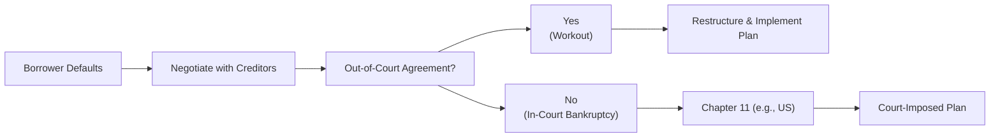

Introduction  
In private debt markets, restructuring processes and workouts can, quite frankly, feel like stepping onto shifting terrain—nothing is ever quite certain, and outcomes depend on negotiation skills, legal protections, and, often, a fair bit of luck. Anyway, you know how companies eagerly borrow capital to finance growth, acquisitions, or even day-to-day operations? Occasionally, life throws them a curveball: market downturns, operational mishaps, or poor strategic decisions that cause them to default or fail covenants. In these situations, the parties involved face a choice: they can collaborate to salvage value or watch everything descend into liquidation chaos.

In this section, we’ll explore how defaults arise, highlight typical restructuring methods (like the infamous debt-for-equity swaps), and discuss how both in-court and out-of-court processes unfold. We’ll also look at the creditor’s perspective, because—let’s face it—nobody wants to throw good money after bad. And we’ll conclude with monitoring strategies that creditors often adopt once a restructuring is complete. If you recall from earlier parts of this Chapter 4, we discussed how leveraged loans, high-yield bonds, and convertible bonds get funded in the first place, and how covenants oversee that funding. This section picks up the story when everything starts to go sideways.

Understanding Defaults and Workouts  
A default isn’t necessarily the end of the world, but it’s definitely a stress test for the borrower-creditor relationship. When a borrower can’t meet payment obligations or abide by agreed-upon covenants—like maintaining certain leverage ratios or interest coverage metrics—creditors are forced to take a closer look. Some folks associate defaults with gloom and doom, but in private credit markets, default can sometimes be a catalyst for necessary change or reorganization.

A “workout” is a negotiated agreement between one or more creditors and the defaulted borrower that sets new terms to avert formal insolvency proceedings. The goal, ideally, is to fix the capital structure (or at least patch it up) without driving the company into an official bankruptcy or liquidation. It’s sort of like going to physical therapy for your finances: it’s all about corrective exercises that, hopefully, return you to full strength.

Common Goals in Workouts:  
• Avoid liquidation (where assets are sold off, often at fire-sale prices).  
• Preserve the ongoing value of the company.  
• Maximize creditor recovery, so lenders don’t lose their entire stake.  
• Provide the borrower with breathing room and a path to sustainable operations.  

Key Restructuring Methods  
Amend and Extend  
Perhaps the most straightforward approach to avoid a messy default is the “amend and extend” strategy. This is basically a negotiation between the borrower and its creditors to adjust covenants or extend the maturity date, providing a bit more time to get revenues (and profits) back on track. This might involve:  
• Relaxing ratio requirements (e.g., leverage or interest coverage ratio).  
• Extending debt maturities to align better with projected free cash flow.  
• Potentially raising interest rates or adding fees, which compensates lenders for taking on additional time and risk.

If you’ve ever asked a friend (or your mom, maybe) for a bit of extra time to repay a personal loan when you hit a rough patch, that’s sort of the vibe here—except on a larger, more complex scale, often with multiple creditors agreeing on the new terms.

Debt-for-Equity Swap  
A more dramatic maneuver is the debt-for-equity swap. This is where creditors agree to exchange a portion of the outstanding debt for an ownership stake in the company. By converting part of the debt into equity, the borrower’s balance sheet gets relief—less debt to service—while the creditors gain partial ownership and a say in corporate decisions going forward.

In practical terms, a debt-for-equity swap might look like this:
• Company X is struggling to meet interest payments on a US$100 million loan.  
• The lender agrees to convert US$30 million of that debt into equity.  
• Now the borrower owes only US$70 million in debt, which may be more sustainable.  
• The lender receives newly issued shares and potentially claims a board seat or some veto rights, taking on more risk on the upside (and, indeed, the downside) of the business.

What’s interesting is that many lenders—like certain hedge funds or private equity sponsors—actively seek out these kinds of deals, hoping that a new capital structure can help the company recover and eventually create equity value.

Distressed Exchange  
A distressed exchange is a broad category that can involve new securities or instruments provided to creditors in an effort to reduce or defer actual liabilities. It might involve replacing old debt with lower-valued new debt or even equity, or imposing new contractual terms like reduced coupon payments. Many times, the “exchange” is pitched as unavoidable—an alternative to a likely default or something close to it. 

Often, a distressed exchange is orchestrated by:

• Offering creditors new (but less burdensome for the issuer) bonds or loans.  
• Giving up part of the sum owed or accepting maturity extensions.  
• Potentially receiving some equity kicker as compensation for the sacrifice.

A Distressed Exchange Example: Suppose a company has a bond with a 10% coupon and a face value of US$200 million due shortly. The issuer might propose exchanging that bond for a new 8% bond valued at US$160 million face, plus some warrants for equity. The immediate “haircut” in principal and coupon is accepted by creditors in exchange for avoiding an imminent default scenario, while the company reduces its debt load.

Out-of-Court vs. In-Court Proceedings  
When the parties fail to reach a simple private agreement or the situation is too complicated—maybe there’s a large, fragmented group of bondholders, or senior lenders are fighting with junior lenders—things can escalate into formal bankruptcy. Let’s consider the two main paths:

Out-of-Court Restructurings  
This might be the dream scenario if you’re a borrower: you quietly gather your primary creditors, talk through the issues, and find some middle ground on revised terms. Out-of-court processes allow for faster resolutions, significantly lower legal fees, and often a better chance of preserving business relationships. But there’s a catch: to succeed, you need consensus among at least a substantial group of lenders. If a few “holdouts” or activist investors refuse to accept haircuts or maturity extensions, you might not be able to achieve a global resolution.  

From a creditor’s perspective, out-of-court deals are generally more flexible, and some may be able to negotiate extra protections or fees (sometimes called “consent fees”). If all goes well, the company can avoid the stigma of formal bankruptcy, which might preserve goodwill with customers and suppliers.

In-Court Proceedings (Bankruptcy)  
If private negotiations break down—or the number of stakeholders is just too large to corral—creditors can file (or threaten to file) for bankruptcy protection. In countries like the United States, Chapter 11 is the formal path that can lead to a reorganization plan. One big advantage of going to court is that it can impose a reorganization plan on dissenting creditors, theoretically leveling the playing field. But it’s slow, expensive, and public, which can spook customers, employees, and suppliers. 

It’s not uncommon for a firm to attempt an out-of-court restructuring—realize that not everyone can agree—and then pivot into Chapter 11 to bind the holdouts. They don’t always say it publicly, but a credible threat of entering Chapter 11 can push lenders to come to the table. 

Here’s a simple Mermaid diagram to illustrate the typical flow of how out-of-court vs. in-court processes might unfold:

Role of the Creditor and Potential Outcomes  
When you are a creditor, your primary concern is maximizing recovery. Period. Gone is the rosy optimism you once had about the borrower’s bright future; you’re in damage control mode. To coordinate an actual plan, lenders often form what’s known as a “creditor committee,” especially when multiple institutions or groups are involved. This committee can:
• Engage counsel and financial advisors to evaluate restructuring proposals.  
• Serve as a unified voice in negotiations with the borrower.  
• Assess the feasibility of business plans, capital injections, or asset sales.  
• Advocate for creditors to receive fair—and hopefully maximum—recovery.

By organizing, creditors reduce the risk of conflicting agendas that might undermine negotiations. They can also provide a balanced approach to the borrower—ensuring that feasible operational turnarounds (like changing management, disposing of non-core assets, or injecting fresh capital) are explored.

Potential Outcomes:  
• Cooperative Restructuring: Creditors roll over some portion of debt, possibly gaining equity and imposing tighter operating covenants.  
• Partial Liquidation: Some non-essential business lines or assets are sold to repay lenders; the core operations remain afloat.  
• Full Liquidation: If the business isn’t viable, a complete liquidation might be the only option. Creditors collect from asset sales, usually in a waterfall sequence prioritizing senior liens.  
• New Sponsors Step In: In some cases, outside investors swoop in to buy cheap assets or the entire business, effectively recapitalizing it with new money.

Post-Restructuring Monitoring  
Well, even after the dust settles on a restructuring, the story doesn’t simply end happily ever after. Most lenders impose a more rigorous monitoring mechanism that includes:
• Tighter, more frequent financial reporting requirements.  
• Stricter ratio maintenance and covenant triggers.  
• Possibly board representation or oversight committees that track business progress.  
• Periodic performance reviews to ensure the borrower is meeting revised forecasts.

The rationale, of course, is to avoid a second default or a repeat trip to the restructuring well. Some lenders also engage third-party consultants to keep an eye on the borrower’s operational health. This monitoring process can last until the new debt matures or the borrower refinances under more favorable market conditions.

Example: A friend of mine, who was once CFO for a mid-size manufacturing outfit, shared how a single missed covenant triggered a chain reaction of tough lender-led conferences. After a successful amend and extend, the lenders demanded monthly board packages (instead of quarterly), mandatory site visits by the lead bank, and real-time dashboards for key performance metrics. She joked that at times it felt like the lenders were running the company more than the management team!

Best Practices, Pitfalls, and Challenges  
• Best Practice: Engage in early and transparent communication. If you’re a borrower and see trouble brewing, it’s usually better to alert lenders preemptively than to surprise them with a missed payment.  
• Pitfall: Overcomplicating the negotiations. If you have multiple lenders, each with different seniority and objectives, finding a consensus can be a nightmare. Possibly bringing in a skilled restructuring advisor pays off.  
• Challenge: Time is often scarce. Liquidity shortfalls might not allow for extended negotiations, forcing rushed deals.  
• Best Practice: Carefully analyze operational restructuring options. Sometimes, a simple injection of capital and a minor shift in strategy can salvage the company.  
• Pitfall: Overreliance on short-term fixes can lead to “rolling defaults,” where the company continually renegotiates but never truly fixes the underlying problems.  

Glossary  
Workout: An agreement between a debtor and its creditors designed to avoid default or insolvency through amended terms, extended maturities, or other concessions.  
Debt-for-Equity Swap: A restructuring technique in which a portion of the company’s outstanding debt is converted into shares of stock.  
Distressed Exchange: Creditors receive new securities or instruments with a lower principal or fewer protections than the original ones, alleviating immediate default risk.  
Creditor Committee: A group representing the combined interests of creditors in a restructuring, aimed at streamlining negotiations.  
Chapter 11 (US): A legal process allowing firms to reorganize their debts under the supervision of a bankruptcy court, often culminating in a plan that may bind dissenting creditors.

Practical Advice for the Exam  
In the context of the CFA® Level III exam, particularly in the Private Markets pathway, be prepared to:  
• Read scenario-based questions about a hypothetical company approaching default. You’ll be asked to identify the most appropriate restructuring approach based on the company’s capital structure and operational outlook.  
• Distinguish between in-court and out-of-court negotiations, especially how each approach impacts creditors’ recovery and timeline.  
• Discuss the rationale for using an “amend and extend,” a debt-for-equity swap, or a distressed exchange—under what conditions might each be preferable?  
• Evaluate covenant structures and how they lead to or prevent defaults, referencing topics introduced in Section 4.7 on covenant analysis.  
• Calculate potential recoveries under different scenarios, possibly dealing with senior vs. junior debt tranches.  

References  
• Hotchkiss, E. & Altman, E. (2006). “Corporate Financial Distress and Bankruptcy.” Wiley.  
• Gilson, S. (1990). “Bankruptcy, Boards, Banks, and Blockholders.” The Journal of Financial Economics, 27(2).  

For further exploration, consider reading real-world case studies of notable restructurings (e.g., major airline or retail bankruptcies), as they provide fascinating insights into how different creditor classes jockey for position. Admittedly, it’s tricky real-life stuff, but it exemplifies everything we’ve discussed—amend and extend, debt-for-equity swaps, you name it.

---

## Test Your Knowledge: Restructuring Processes and Workouts Quiz



### A borrower in private debt markets misses an interest payment. What is this situation usually called from a contractual perspective?  
- [ ] A distressed exchange  
- [ ] A carve-out  
- [x] A default  
- [ ] A covenant waiver  

> **Explanation:** Missing an interest payment typically triggers a default event under the loan or bond documentation.

### Which of the following is a potential advantage of an out-of-court restructuring compared to in-court proceedings?  
- [x] Faster process and lower administrative costs  
- [ ] Greater ability to compel non-consenting creditors  
- [ ] Lack of need for consensus among creditors  
- [ ] Automatic stay protecting the debtor from litigation  

> **Explanation:** Out-of-court restructurings often have lower legal fees and can resolve issues faster. However, in-court proceedings (like Chapter 11) are sometimes necessary to force holdouts into a reorganization plan.

### Which method involves creditors swapping part of their debt for partial ownership in the borrower?  
- [ ] Distressed exchange  
- [x] Debt-for-equity swap  
- [ ] Amendment and extension  
- [ ] Liquidation  

> **Explanation:** A debt-for-equity swap specifically converts a portion of debt into shares of the company, thereby reducing the borrower’s leverage and giving creditors an ownership stake.

### Under an “amend and extend” agreement, what is the primary benefit to the borrower?  
- [x] Additional time to repay or meet covenant obligations  
- [ ] Full forgiveness of the principal  
- [ ] Permanent release from all covenants  
- [ ] Equitization of debt obligations  

> **Explanation:** An amend and extend deal grants extended maturities or relaxed covenant terms, which can help the borrower stabilize operations.

### In the context of in-court restructuring, which of the following best describes Chapter 11 in the United States?  
- [ ] A process solely used for liquidation  
- [ ] A voluntary arrangement completed with no court involvement  
- [x] A court-supervised process allowing firms to reorganize  
- [ ] An automatic mechanism that converts debt into equity  

> **Explanation:** Chapter 11 is a legal process in the U.S. that supervises the reorganization or restructuring of a company’s capital structure under court protection.

### Which statement is most accurate about distressed exchanges?  
- [x] They replace old debt with new, generally lower-valued debt or equity  
- [ ] They strictly involve converting debt into equity  
- [ ] They have no effect on the borrower’s capital structure  
- [ ] They force a formal bankruptcy filing  

> **Explanation:** Distressed exchanges typically involve substituting old debt with new instruments carrying reduced principal or coupons, though they can also include equity. They aim to restructure obligations without a full bankruptcy.

### A creditor committee generally:  
- [ ] Reduces the borrower’s debt automatically  
- [ ] Guarantees unanimous lender approval  
- [x] Represents creditors collectively to evaluate restructuring proposals  
- [ ] Functions only under strict government supervision  

> **Explanation:** Creditor committees organize the interests of various creditors to negotiate more effectively with the borrower. They do not automatically reduce debt or guarantee 100% approval.

### Which is a likely outcome if a private workout fails to secure unanimous or near-unanimous lender support?  
- [ ] Automatic maturity of all debt instruments  
- [x] In-court processes (like Chapter 11) might be pursued  
- [ ] The borrower can raise unlimited new debt  
- [ ] The borrower’s equity automatically converts to debt  

> **Explanation:** Failure to achieve consensus in out-of-court negotiations often forces the company into formal bankruptcy proceedings to impose a structured plan across dissenting creditors.

### Post-restructuring monitoring commonly involves:  
- [ ] Eliminating all future covenant checks  
- [ ] A complete withdrawal of lender oversight  
- [ ] Rapid repayment of all outstanding debts  
- [x] Tighter reporting and covenant requirements  

> **Explanation:** After a restructuring, lenders usually adopt stricter oversight—more frequent reporting, additional covenants—to reduce the chance of another default.

### True or False: A debt-for-equity swap immediately eliminates the borrower’s entire debt burden.  
- [x] True  
- [ ] False  

> **Explanation:** Actually, this can be tricky. In many transactions, only a portion of the outstanding debt is converted into equity, not the entire debt. However, the question statement is a bit ambiguous. If it read, “A debt-for-equity swap can eliminate a portion of the debt,” that would be correct. Strictly speaking, a single swap can convert all or some portion of the debt. In some cases, yes—some deals do convert all outstanding debt to equity, albeit that is less common.


