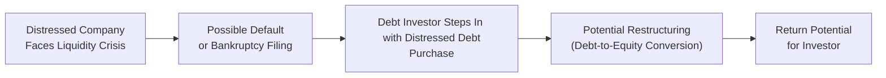

Distressed Debt Overview  
Distressed debt typically refers to bonds, loans, and other corporate obligations issued by companies that are either near default, in default, or already in formal bankruptcy or restructuring proceedings. These are often priced at a significant discount to par value, reflecting the market’s pessimistic outlook toward repayment. Now, the reward can be pretty attractive—if the company recovers, invests in a new strategy, or reorganizes successfully, holders of distressed debt can see a substantial return. But, let's be real: if the company can’t dig itself out or properly restructure, the investment might end in painful losses.  

This space spans a broad range of strategies and investor profiles. Some investors, sometimes referred to as “vultures,” swoop in to buy these troubled assets at dirt-cheap prices. Others deploy more hands-on strategies (think operational turnarounds and “loan-to-own” approaches) to eventually drive decision-making in the reorganized company. In any case, analyzing distressed debt is no simple expedition; it calls for a blend of legal knowledge, credit analysis, and industry insight.  

Default and Credit Risk  
High default risk defines distressed debt investments. By definition, these issuers are at imminent risk of failing to make scheduled payments or have already missed them. Investors must thoroughly evaluate:  
• Probability of Default: The likelihood that the issuer will not honor interest or principal payments.  
• Recovery Rate: How much principal (and possibly accrued interest) might be recovered if a default does occur.  
• Credit Waterfall: The seniority structure that determines who gets paid first and how subsequent classes of creditors may be affected.  

A handy formula for the expected recovery on a distressed bond or loan is:


\text{Expected Recovery} = P(\text{Restructuring Success}) \times \text{Restructured Value} + P(\text{Liquidation}) \times \text{Liquidation Value}


Where:  
• P(Restructuring Success) is the probability that the firm can reorganize and continue operations.  
• Restructured Value is the estimated present value of future cash flows when the company emerges from distress.  
• Liquidation Value is the expected asset-sale payout after winding up.  

But let’s not sugarcoat it: your initial assumptions around the company’s ability to turn its ship around will make or break the analysis. This is no place for naive optimism or for giving in to recency bias.  

Liquidity Risk  
Remember that distressed debt comes with an extra dose of illiquidity, often beyond that of typical high-yield bonds. In many cases, only specialized investors and distressed debt desks are involved. Thin trading means wide bid-ask spreads, so if you need to sell in a hurry, you might face a steep discount.  

As market conditions deteriorate—say, in a broad economic slowdown—distressed assets can become even less liquid. This is somewhat ironic, but it’s also typical: the time you most want to sell is the time the market is least likely to buy.  

Legal and Process Complexity  
Bankruptcy proceedings differ from one jurisdiction to another, which can lead to widely varying outcomes. Some legal structures are more debtor-friendly (giving the defaulting company a lot of breathing space) while others are more creditor-friendly (allowing lenders to seize assets or force liquidation). These differences matter a ton for distressed debt investors.  

Key considerations include:  
• Creditor Seniority: Senior claims generally get paid before subordinated obligations. Know your place in the capital stack.  
• Jurisdiction: U.S. Chapter 11 bankruptcy, for instance, allows for “debtor-in-possession (DIP)” financing that can jump ahead in priority. In other jurisdictions, equity holders or government agencies might enjoy preferential rights or protections.  
• Duration and Complexity: Bankruptcy or out-of-court restructurings can be lengthy and involve multiple parties (bondholders, shareholders, trade creditors, labor unions, etc.). Navigating these processes can devour time and resources.  

Going in, distressed investors have to parse complicated legal documents, from loan agreements to cross-default clauses. One tiny oversight in reading the terms or in evaluating litigation risk might lead to surprise losses or missed opportunities.  

Operational Risk  
Companies in financial distress often suffer from broader operational woes:
• Declining revenue and negative cash flow  
• Overleveraged balance sheet and outdated capital structure  
• Deficient management teams or strategic direction  

Plugging money into a poorly run business without a plan can be catastrophic. Well, you might not believe how many investors jump into these waters without fully understanding the operational challenges. A thorough assessment of the company’s technology stack, supply chain, and corporate governance structure is essential.  

When a distressed investor “loans to own,” they’re prepared to become a controlling shareholder post-restructuring. That can mean they’ll try to overhaul management, fix the product line, or even pivot the business model. Think of it like buying a house in poor shape: you see the potential, but you must be prepared to renovate.  

Investment Strategy Variations  
Distressed debt investing isn’t one-size-fits-all. Two prominent approaches are:  

1. Vulture Investing  
   The “vulture investing” label reflects the idea of waiting for a crisis and then feasting on deeply discounted securities. It’s opportunistic. Investors here tend to rely on sharp negotiation skills and timing, sometimes purchasing debt for pennies on the dollar. If the company recovers or reorganizes well, the payoff can be many multiples of the purchase price.  

2. Loan-to-Own  
   Some investors actually want to take over the firm. They structure loans or bond investments with rigorous covenants designed to allow debt to convert into substantial or controlling equity ownership if the borrower defaults (or triggers specific covenants). This approach requires a detailed plan for turning the business around and a willingness to manage or replace the existing leadership.  

Across both strategies, it’s crucial to model out various restructuring scenarios. This includes the possibility of a full liquidation, the negotiation of new terms with creditors, or even a strategic merger with a better-positioned competitor.  

Practical Distressed Debt Analysis Framework  
1. Industry Analysis: Evaluate competitive dynamics, regulatory environment, and cyclical vs. secular trends.  
2. Credit and Capital-Structure Analysis: Examine priority of claims, subordination risk, and existing liens.  
3. Cash Flow Modeling: Stress test various scenarios (continued distress, partial recovery, rapid turnaround, liquidation).  
4. Legal Review: Explore relevant bankruptcy statutes, cross-default clauses, potential litigation from other creditors.  
5. Operational Turnaround Potential: Assess management’s ability to implement cost-cutting, reorganize workflows, and shore up supply chain relationships.  

Here’s a visual representation of a simplified distressed investment path:

This flowchart might look straightforward, but keep in mind each arrow can come with countless legal complexities and months (or years) of negotiation.  

Case Study: Hypothetical “GammaTech”  
Picture GammaTech, a hardware manufacturer flamboyantly funded by cheap credit in a bull market. Fast-forward a few years, and a new technology wave has made its main product obsolete. Revenues plummet, and it can’t service debt. The bonds trade at 30 cents on the dollar.  

• Vulture investors see potential in GammaTech’s brand and patents. They purchase the bonds at a discount, anticipating a reorganization that might produce a new, leaner entity with improved growth prospects.  
• Another investor group focuses on a “loan-to-own” approach—they provide additional funding with strict covenants. If GammaTech fails to meet restructured obligations, this financing automatically converts into a controlling equity stake.  
• Ultimately, credit analysis involves determining whether those patents are valuable enough to build a new product line or be sold to raise capital. Legal complexities revolve around reassigning intellectual property rights in bankruptcy.  

If GammaTech successfully emerges from Chapter 11 by launching a next-generation product, the vulture investors might see their 30-cents-on-the-dollar notes eventually pay off at 80, or even par, plus accrued interest. If the reorganization fails and the patents get sold off for less than expected, then both the vulture investors and the “loan-to-own” investors could face substantial losses.  

Common Pitfalls  
• Overly Optimistic Assumptions: Assuming that everything will magically align after restructuring is a recipe for disappointment.  
• Underestimating Legal Costs: Prolonged courtroom battles and legal fees can chip away at returns or hamper timely exits.  
• Lack of Operational Expertise: Just buying the debt is only half the battle—revitalizing these companies is a big feat.  
• Illiquidity: If you change your mind, reversing out of a distressed debt trade quickly can be nearly impossible without significant price haircut.  

Managing Distressed Debt Portfolios  
Due to the complexity of each investment, distressed debt strategies often remain a specialized niche within alternative assets. Key considerations for managing a broader portfolio include:  
• Diversification: Avoid having the entire portfolio in a single or correlated distress scenario. Distressed opportunities typically come in clusters—often in certain sectors—but watch out for idiosyncratic blowups.  
• Capital Calls in Drawdown Vehicles: Many private funds structure distressed strategies via capital calls. This ensures you deploy capital only when a viable opportunity emerges.  
• ESG Factors: Are you prepared to handle negative press and stakeholder concerns if you invest in a distressed firm that’s been criticized for labor, environmental, or governance practices? Chapter 1.7 and Chapter 3.8 provide more guidance on ESG integration in private markets. Maintaining alignment with your broader responsible investing policies may be trickier in distressed scenarios.  

Practical Considerations with Restructuring  
During the restructuring process, investors frequently see legal battles among creditors. Senior secured lenders typically stand ahead in line, while junior debt holders must fight for any residual value. Equity holders can sometimes remain in the game—but not always.  

Ultimately, success often hinges on the “plan of reorganization” that the court approves. This plan might include haircuts on principal (or face value) for certain creditor groups, maturity extensions, interest rate modifications, or debt-for-equity swaps. Understanding the final distribution (if any) depends on the company’s post-reorganization value.  

Exam Tips  
• Be ready to evaluate pro-forma financial statements—particularly how they look after a hypothetical restructuring.  
• Know the nuances: Senior vs. junior debt recovery rates, cross-default clauses, and how covenants can trigger default events.  
• From an LP perspective (Chapter 2.4), focus on the track record of distressed managers. Distressed investing success is highly manager-dependent because of the deep operational skillset required.  
• For multi-part exam questions, you might be asked to compare expected outcomes under “successful reorganization” vs. “winding up.” Show your ability to weigh probabilities and compute expected returns.  

References for Further Exploration  
• Moyer, S. (2019). “Distressed Debt Analysis.” A classic text that digs into the nitty-gritty details of distressed debt valuation.  
• Hotchkiss, E., & Mooradian, R. (2021). Research on defaults and returns in distressed debt. Check SSRN or peer-reviewed finance journals for the latest findings.  
• The American Bankruptcy Institute (abi.org) for an overview of bankruptcy law fundamentals.  
• “Fundamentals of bankruptcy law,” American Bankruptcy Institute.  
• Chapters 4.1 and 4.8 in this curriculum for deeper insights on private debt structures and workouts.  
• Chapter 5.1 for an overview of event-driven opportunities and financial dislocations.

-------------------------------------------------------------------------------------------

## Test Your Knowledge: Distressed Debt Investment Strategies



### Which of the following best describes distressed debt investing? 
- [ ] Buying AAA-rated government bonds at a premium for stable coupon payments. 
- [x] Purchasing securities of companies on the brink of default or in bankruptcy. 
- [ ] Issuing new equity to high-growth technology startups. 
- [ ] Conducting arbitrage on liquid foreign exchange markets.

> **Explanation:** Distressed debt investing involves acquiring the debt securities (bonds, loans, notes) of companies in or near default, often at a significant discount, with a view to profit from a potential turnaround or orderly liquidation.

### In a loan-to-own strategy, which of the following is typically a primary objective? 
- [ ] To hold a large equity stake in an established growth company from inception. 
- [x] To gain control of a company through debt conversion in a restructuring. 
- [ ] To sell the debt position quickly to another distressed fund. 
- [ ] To focus on highly liquid, short-term debt instruments.

> **Explanation:** Loan-to-own strategies frequently involve purchasing a debt instrument with strict covenants that facilitate an equity takeover if the borrower defaults. The goal is to become the largest shareholder post-restructuring and implement operational changes.

### Which factor generally exacerbates the liquidity risk for distressed debt investors? 
- [x] Thin trading volumes and wider bid-ask spreads. 
- [ ] Central bank purchases of corporate debt securities. 
- [ ] Robust economic expansion and high market confidence. 
- [ ] Very strong credit ratings on the debt.

> **Explanation:** Distressed debt can be illiquid because fewer market participants are involved and bid-ask spreads can be quite wide, especially under adverse market conditions.

### A “vulture fund” is so named because it: 
- [ ] Circles thriving companies and invests at a premium. 
- [ ] Provides low-cost DIP (Debtor-in-Possession) financing to stable borrowers. 
- [x] Buys the debt of troubled companies at very low prices, hoping for a turnaround. 
- [ ] Only invests in high-grade corporate bonds issued by top-tier companies.

> **Explanation:** “Vulture funds” are known for purchasing highly discounted securities from distressed firms—akin to vultures feeding on carcasses. They aim to profit if the company recovers or goes through successful restructuring.

### When comparing distressed debt recovery rates, which claim generally has a higher position in the credit waterfall? 
- [x] Senior secured bondholders. 
- [ ] Trade creditors. 
- [x] Senior secured lenders. 
- [ ] Common equity holders.

> **Explanation:** Investors at the top of the capital structure, such as senior secured lenders, typically enjoy higher recovery rates. They hold collateral claims on assets and receive proceeds before subordinated creditors and equity holders.

### Which of the following is a critical challenge when conducting operational turnarounds in a distressed debt scenario? 
- [x] Unstable management teams and outdated processes. 
- [ ] High liquidity and active secondary trading of the debt. 
- [ ] Absence of any potential litigation liabilities. 
- [ ] Very limited scope for negotiation with other creditors.

> **Explanation:** Distressed companies often have deeper operational problems—weak leadership, obsolete technology, or inefficient production methods. Turning these businesses around is complicated and requires capital infusion, strategic changes, and effective leadership.

### Which term is commonly used to describe terms in a bond indenture that trigger default if the issuer fails on any other financial obligation? 
- [x] Cross-default clause. 
- [ ] Priority lien agreement. 
- [x] Waterfall provision. 
- [ ] Pari passu covenant.

> **Explanation:** A cross-default clause triggers a default on one obligation if another obligation is in default or declared in default, potentially accelerating a financial crisis for the issuer.

### What is one key advantage of DIP (Debtor-in-Possession) financing under U.S. Chapter 11 proceedings? 
- [x] DIP lenders generally receive priority over pre-existing claims. 
- [ ] It absolves the borrower from paying back all prior debt. 
- [ ] It automatically converts the lender’s debt into equity without court approval. 
- [ ] It is offered only at below-market interest rates.

> **Explanation:** DIP financing typically enjoys super-priority status under Chapter 11, meaning new lenders get repaid before older claims to ensure fresh capital is available for operating the business during restructuring.

### In practice, investors focusing on distressed debt often rely on specialized: 
- [x] Legal teams, financial advisors, and industry consultants. 
- [ ] Real estate appraisers and property managers. 
- [ ] Foreign exchange traders and spot market data. 
- [ ] High-frequency trading algorithms for daily scalping.

> **Explanation:** Distressed debt investing demands a multidisciplinary approach that combines legal expertise, deep credit and industry analysis, and sometimes turnaround management.

### True or False: Distressed debt investors generally ignore ESG criteria because distressed targets have no social or environmental impact. 
- [x] True 
- [ ] False

> **Explanation:** While it might be tempting to think ESG doesn’t matter in distressed environments, real-world practices suggest otherwise. An investor’s reputation risk and alignment with broader ESG mandates can affect portfolio decision-making, and some distressed companies face environmental remediation or labor disputes that significantly impact valuation and turnaround potential.


