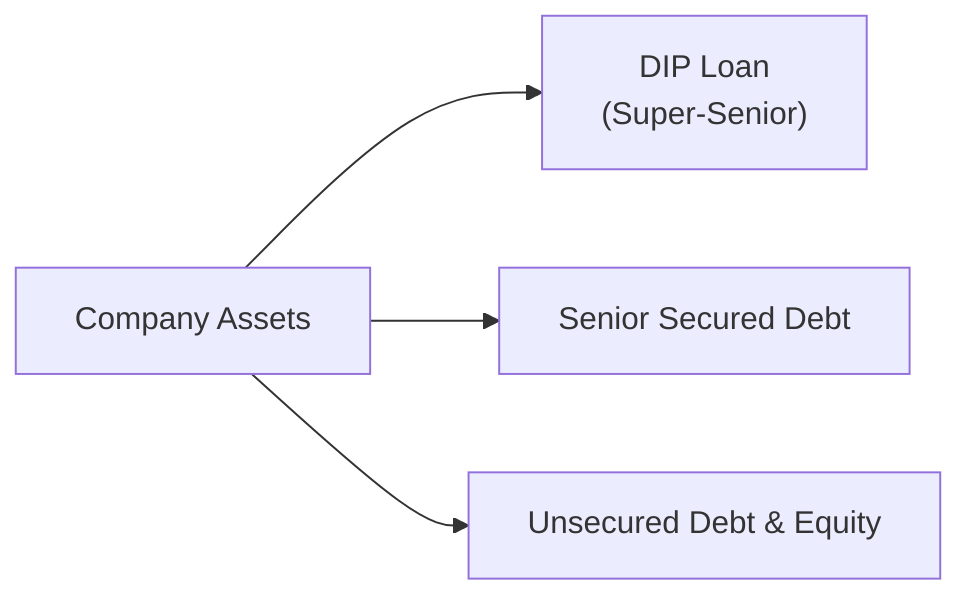
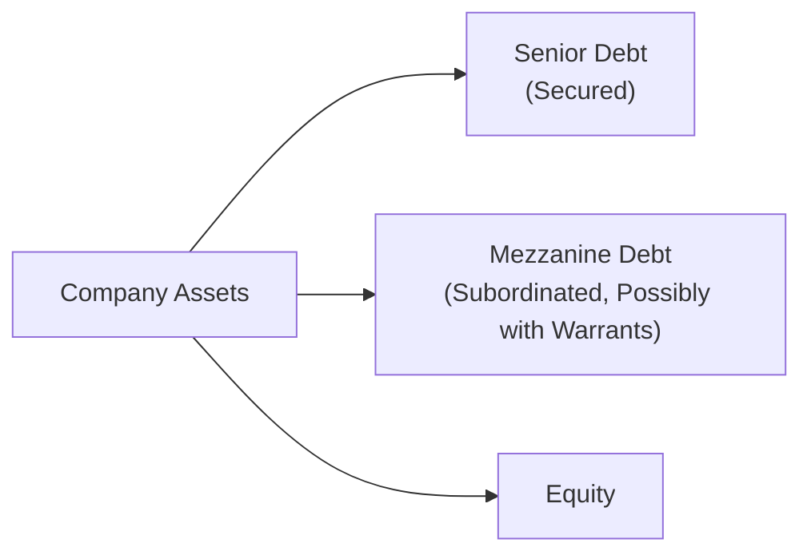

## Introduction and Context

When companies encounter serious financial trouble, they often face the pressing question: “How do we keep the lights on while we figure out a path forward?” Well, that’s where specialized financing solutions for distressed issuers come in, and let me tell you, it’s not just a simple bank loan. Lenders offering funds in these situations often want priority status, higher interest rates, or even equity shares—especially when the usual risk metrics are, um, less than rosy. 

There can be a bit of drama involved, with frantic negotiations, last-minute deals, and undisclosed behind-the-scenes pressure from different creditor classes. Anyway, let’s go through some of the most common financing structures for issuers in financial distress, how they work, and the risks involved. We’ll also cover best practices, highlight some real-life examples (names changed, of course), and share a few exam tips.

## DIP Financing

Debtor‑In‑Possession (DIP) financing is a specialized form of credit designed for companies going through bankruptcy (in the U.S., typically Chapter 11). In many jurisdictions, DIP financings are granted “super‑senior status,” meaning these DIP lenders sit atop the repayment ladder.

• Priority: DIP investors get first claim on the company’s assets and future revenues. That’s the big attraction—if you’re offering money to a troubled business, you want to be sure your funds are secured as much as possible.  
• Control: DIP lenders often have significant oversight (sometimes daily) over the borrower’s operations. They might specify how cash can be used, require the appointment of a chief restructuring officer, or even call the shots on asset sales.  
• Legal Protections: In Chapter 11, a court must approve all DIP financing terms, which means existing creditors can’t simply veto or subordinate the DIP unless the court agrees. Investors need good counsel to navigate these proceedings.

One story that comes to mind is a small manufacturing firm I worked with years ago—they desperately needed money to pay suppliers who threatened to walk away. A DIP loan not only funded them through the reorganization but also provided confidence to those very suppliers that the firm would have consistent working capital. The DIP lender, in exchange, got fees, high interest, and a senior position in the capital stack.

### Diagram: DIP Financing Priority

Below is a simplified Mermaid diagram that shows how DIP financing ranks above other obligations:

DIP lenders are shown here in a top-tier position, followed by senior secured debt, and then any unsecured debt and equity are last.

## Rescue Financing

Rescue financing is an urgent, short-term infusion of funds to prevent imminent default (or expedite an out-of-court restructuring). Think of it like a financial “tourniquet”—stopping the bleeding until a longer-term solution can be found.

• Funding Sources: Existing creditors, new lenders, or private equity firms sometimes step in to provide rescue financing. They see an opportunity, but they also want protective terms (like priority liens or high coupons).  
• Liquidity Boost: Typically used to cover immediate operational expenses, payroll, or critical vendor payments.  
• Restructuring Engagement: Rescue financings often come with an expectation that full restructuring negotiations or formal Chapter 11 planning will follow soon.

Be mindful of redemption or call features in these short-term deals. Lenders often keep an escape route if the situation deteriorates. The company, for its part, might try to renegotiate if they quickly improve cash flow. It can be a dance—often performed on a tightrope.

## Bridge or Mezzanine Financing

When an issuer’s senior debt capacity is maxed out and equity injections aren’t exactly falling from the sky, they might turn to mezzanine or bridge financing. 

• Mezzanine Financing: This is typically subordinated debt with an equity kicker (like attached warrants). It carries higher interest rates but can fill the gap between senior debt and typical equity capital.  
• Bridge Financing: As the name implies, a short-term “bridge” to a more permanent financing solution (like a full debt package or equity offering). Investors providing bridge loans can demand big fees, especially when the outcome is uncertain.  
• Example: Suppose a distressed retail chain is waiting on an upcoming holiday season to generate a surge in cash flow. Before that busy period, they might take on bridge financing to, well, “bridge” the liquidity gap. The lender is counting on the brand’s recognition and holiday sales to recoup principal plus interest.

With mezzanine debt, the lender often includes “conversion” rights or warrants to participate in the upside if the company recovers—i.e., if it’s a big success, the mezz lender reaps some equity returns.

### Diagram: Position of Mezzanine Financing

Mezzanine is below senior debt but above pure equity; hence, the higher risk premium.

## Convertible Bonds in Distress

Convertible bonds can feel like a blessing or a curse for distressed issuers. If bondholders convert to equity, the issuer’s debt load decreases (yay!), but existing shareholders may be diluted (ouch!).

• Lower Initial Coupon: Convertibles often have a lower coupon than standard bonds—handy when cash flow is tight.  
• Equity Upside for Investors: If the company recovers and stock price goes up, convertible holders can convert and enjoy the equity appreciation.  
• Restructuring Scenario: In a restructuring, converting debt to equity can instantly improve a company’s balance sheet and leverage ratio. Then again, it could also change the ownership dynamics (lenders-turned-shareholders might push for new management).

I remember a cybersecurity firm that struggled with a product flop. They had convertible notes. Post-distress, those notes converted, effectively making the bondholders the majority owners. The firm’s original shareholders got heavily diluted, yet ironically, that conversion saved the company from total liquidation.

## Negotiation Dynamics

In distressed deals, negotiations can be tense and, honestly, a little theatrical. Lenders are wary, rating agencies might have flagged default risk, and existing shareholders want to preserve some stake in the firm. Here are some common negotiation points:

• Interest Rates & Fees: Lenders want risk compensation. Distressed interest rates can get sky-high. Expect arrangement fees, exit fees, or even “make-whole” provisions.  
• Seniority & Collateral: Finance providers aim for top priority wherever possible. They often demand mortgages on real estate, security interests in receivables, or cross-collateralization with other assets.  
• Covenants & Control: In distressed situations, lenders set strict covenants (like limitations on capital expenditures or mandatory free cash flow sweeps) to ensure they’re not left holding the bag.  
• Board Seats & Governance: Some rescue financiers or DIP lenders also want board representation or observer rights. After all, they’re injecting life support cash.  

Negotiations often hinge on balancing the immediate needs of the issuer (cash, time, and flexibility) with the lender’s demand for robust protection. 

## Legal and Jurisdictional Nuances

One reason distressed investing is such a specialized field is all the legal stuff. Jurisdictions vary in how they treat creditor classes, which can alter the entire deal:

• Bankruptcy Frameworks: In the U.S., Chapter 11 provides some debtor-friendly perks, like the automatic stay on litigation. In other places, laws might favor creditors.  
• Enforcement Rights: Depending on the legal system, you might be able to foreclose quickly on collateral or you might get stuck in multi-year proceedings.  
• Administrative Expenses: DIP financing is often a priority claim, ensuring lenders get repaid before other administrative expenses. But some jurisdictions can challenge that if local labor or tax authorities have priority.  

It’s nearly impossible to do stressed or distressed deals without seasoned legal experts who understand local statutes and precedents. And let’s be honest, it’s never fun to discover you can’t enforce your security in the final hours before a crucial hearing.

## Best Practices and Common Pitfalls

• Due Diligence: Conduct thorough analysis—especially reading any senior loan documents or bond indentures to see if there’s room for additional debt.  
• Cross-Default and Cross-Collateralization: Make sure the new financing doesn’t inadvertently trigger existing debt defaults or conflict with other creditors’ collateral rights.  
• Contingency Planning: Understand the worst‑case scenario if the borrower misses even these new payments. Some lenders incorporate “emergency exit” clauses or have an appetite (and operational plan) to take over the business.  
• Communication: Distressed transactions can involve multiple layers of stakeholders—banks, bondholders, employee unions, vendors, you name it. Clear communications can prevent meltdown negotiations, rumors, and panic.  

## Practical Example: A Hypothetical Alloy Manufacturer

Let’s try to tie these together in a short case. Suppose “AlloyMaster” is a mid-sized metals processor facing a decline in orders due to an economic downturn. They have a leveraged loan (outlined in Chapter 4), but they’re running out of liquidity. Here’s how they might approach financing:

• They file for Chapter 11. To keep the furnaces lit, they negotiate a DIP package from an existing lender group, who offer a $50 million DIP loan at an 8% coupon with a super‑senior lien on inventory and receivables.  
• Meanwhile, they also secure rescue financing from a PE fund that invests $20 million in mezzanine debt with warrants. The PE fund believes AlloyMaster’s advanced aluminum alloys are due for a big rebound.  
• The convertible notes that AlloyMaster issued last year “land” in the middle of all this. Some bondholders convert to equity, reducing the total interest burden and helping simplify the capital structure.  
• A settlement is reached with the unsecured creditors—accepting partial write-down of unsecured claims in exchange for a small equity stake in the reorganized company.  

At the end of the day, AlloyMaster emerges from Chapter 11 with new capital, a workable structure, and a shot at regaining profitability—though original equity holders are heavily diluted. DIP lenders exit with a decent return, the mezz investors hold full claims plus equity rights, and the convertible holders have new shares.

## Exam Relevance and Tips

From a CFA Level III perspective, you want to be able to:

• Identify how distressed financing can affect overall capital structure and enterprise value.  
• Evaluate how DIP financing influences other creditor classes and claim priorities.  
• Recognize negotiation priorities in a case scenario: if the question states a firm is heading for default, you should discuss rescue financing vs. DIP financing vs. convertible solutions.  
• Integrate these solutions into a broader portfolio context (e.g., alternative investments, liquidity risk management, or opportunistic private debt strategies as discussed in Chapter 4 and Chapter 5).  

Keep an eye out for “trick” exam questions that test your understanding of capital structure layering or the interplay between legal frameworks and creditor negotiations. Time management can be challenging. If you see a big scenario about a distressed firm, break it down systematically: present capital structure, potential financing solutions, their pros/cons, and finally rank them in terms of priority or feasibility.

## References and Further Exploration

• CFA Program Curriculum (www.cfainstitute.org), particularly “High Yield Bonds, Leveraged Loans, and Distress.”  
• Bankruptcy and Distressed Restructurings by Stuart C. Gilson and Edith S. Hotchkiss.  
• American Bankruptcy Institute (abi.org) for real-world case law, updates, and insights.  
• Cross-reference Chapter 2 and Chapter 4 of this text for private market fund structures and private debt considerations.  

## Test Your Knowledge: Financing Options for Distressed Issuers



### Which of the following best describes DIP financing?

- [ ] Subordinated debt provided to companies post-restructuring
- [x] Super-senior financing extended to a company while in bankruptcy proceedings
- [ ] Equity financing provided by private investors after a firm emerges from Chapter 7
- [ ] Debt financing without any priority claims

> **Explanation:** DIP financing, or Debtor‑In‑Possession financing, is a specialized super-senior facility provided during bankruptcy (often Chapter 11 in the U.S.) that places lenders at the top of the repayment hierarchy.

### Rescue financing is generally intended to:

- [x] Provide short-term liquidity to avoid immediate default
- [ ] Replace mezzanine financing in the capital structure
- [ ] Dilute existing shareholders by converting debt to equity
- [ ] Permanently restructure the entire company

> **Explanation:** Rescue financing is typically a short-term or stopgap measure to provide enough liquidity so the company can either avoid default or fund the restructuring process.

### In mezzanine financing:

- [x] Debt is typically subordinated, with possible equity kickers
- [ ] Investors receive a low risk, investment-grade yield
- [ ] There is no possibility of equity dilution for existing shareholders
- [ ] The financing ranks pari passu with senior secured debt

> **Explanation:** Mezzanine is junior to senior debt, often has higher yields, and may include warrants or convertible features, thus potentially diluting existing shareholders.

### Why might convertible bonds be attractive for a distressed issuer?

- [ ] They have extremely high coupon rates that reduce financial flexibility
- [ ] They cannot be converted to equity under any circumstances
- [ ] They prioritize existing creditors while restricting new lenders
- [x] They offer potential equity conversion, lowering debt if the issuer’s situation improves

> **Explanation:** Convertibles can attract investors because of the upside from conversion, and they can reduce the issuer’s debt if converted to equity, which can improve the issuer’s balance sheet in a distress scenario.

### Which of the following is most characteristic of a DIP lender’s position?

- [x] Being granted super-senior status ahead of all other existing creditors
- [ ] Sharing a pari passu ranking with senior secured creditors
- [x] Imposing strict controls on the debtor’s operations
- [ ] Having no voting rights during the reorganization process

> **Explanation:** DIP lenders typically have a priority claim (super-senior) and exercise operational oversight to ensure appropriate use of the provided funds.

### In a distressed negotiation, lenders commonly seek:

- [x] High interest rates and tight covenants
- [ ] Zero-coupon rates with no collateral
- [ ] Equity-only compensation with no security
- [ ] Complete subordination to existing unsecured debt

> **Explanation:** Distressed lenders want maximum protection and compensation (high yields, stringent covenants, controlling security interests).

### Which statement about rescue financing is correct?

- [x] It’s often used to bridge working capital needs during imminent distress
- [ ] It replaces DIP financing in Chapter 11 cases
- [x] It might come from existing creditors or external investors
- [ ] It always involves equity-for-debt swaps

> **Explanation:** Rescue financing provides immediate liquidity. It can come from a variety of lenders and is commonly used around the time of distress, but does not always include equity swaps or replace DIP financing.

### A common objective of distressed borrowers in negotiating convertible bonds is to:

- [x] Lower interest obligations in the near term
- [ ] Minimize the likelihood of conversion
- [ ] Accelerate interest obligations for tax purposes
- [ ] Increase secured debt capacity

> **Explanation:** Convertible bonds often feature lower coupons, which can help the borrower manage near-term cash outlays. The trade-off is a potential dilution if conversion takes place.

### Which of the following challenges might appear when providing DIP financing?

- [x] Legal and jurisdictional uncertainties around enforceability
- [ ] Complete immunity from bankruptcy court oversight
- [ ] Guaranteed zero-risk return for DIP lenders
- [ ] Prohibition on debtor’s use of collateral

> **Explanation:** DIP lenders face legal complexities, especially if they operate in jurisdictions with different bankruptcy laws and rules, which can affect enforceability and repayment priority.

### True or False: DIP lenders generally receive the same priority as unsecured bondholders.

- [ ] True
- [x] False

> **Explanation:** DIP loans generally receive super-senior priority. Unsecured bondholders rank lower in the capital stack, so DIP financing sits above them in repayment order.


