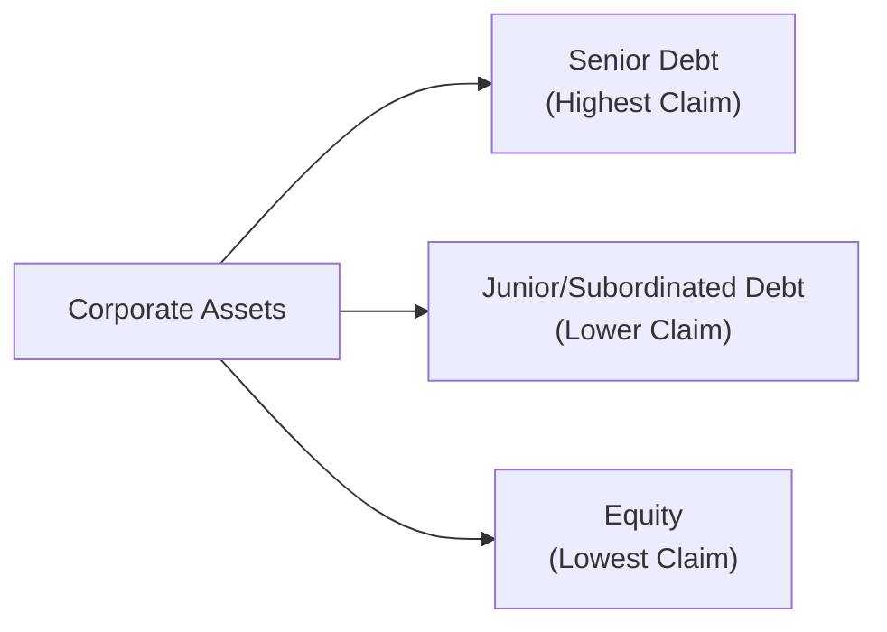

## Introduction and Context

So here we go—capital structure arbitrage and convertible arbitrage. I remember once chatting with a colleague who said, “Wait, you’re telling me you can sometimes profit by juggling different layers of the same company’s financing at the same time?” And, in a nutshell, that’s what these strategies aim to do: exploit mispricings within an issuer’s debt and equity (or convertible) instruments. 

Private market investors might first scratch their heads and wonder how these seemingly hedge-fund-type strategies fit into a private special situations context. The key is that turbulent or dislocated markets, as well as indebted firms seeking flexible financing, often create sweet opportunities for arbitrage-based trades—trades that might exist outside the more typical buyout or venture capital realm.

Capital structure arbitrage typically explores the relationship between different tranches of a firm’s debt (senior vs. subordinated debt, or in some cases between debt and equity derivative instruments). Meanwhile, convertible arbitrage zooms in on convertible bonds—those hybrid instruments that combine a plain vanilla bond with an embedded stock option. If something in that hybrid is mispriced, an investor can enter a complex hedged trade to lock in potential gains. 

Anyway, let’s examine the nuts and bolts of each approach, see where the risks lie, and figure out how to navigate them in practice.

## Understanding Capital Structure Arbitrage

Capital structure arbitrage is about taking offsetting positions in separate layers of the same issuer’s capital structure. The typical approach might involve going long a cheaper layer (say, the senior debt) and shorting a more expensive layer (subordinated debt or even equity-based instruments). The logic is: if the market has mispriced the relative risk of these layers, that mispricing might correct over time, giving you gains on one side of the trade.

### Core Rationale
Imagine a company has both senior bonds and junior bonds outstanding. If the spread between the two bonds doesn’t reflect their relative risks, an arbitrageur sees a pathway. By buying the underpriced bond (often the senior note if it’s trading too cheaply in yield terms) and shorting the overpriced bond (the subordinated note trading at too narrow a spread to the senior), the investor stands to profit if spreads widen (for the short position) or narrow (for the long position) toward a more “correct” relationship. It’s not about betting on the entire direction of the firm’s credit risk but rather on the difference between two instruments.

### Practical Steps in Capital Structure Arbitrage
• Identify Mispricing: First, an investor needs robust credit analytics to determine when one bond is “cheap” relative to another.  
• Assess Credit Metrics: Subordinated debt typically yields more, reflecting higher default risk and lower claim priority. If the yield gap is too low (or too high), that’s a potential signal.  
• Construct the Positions: The investor goes long the security deemed undervalued and shorts the security deemed overvalued in terms of spread or price.  
• Ongoing Monitoring: Being an active strategy, you keep tabs on credit events—like rating reviews, changes in capital structure, or new issuances.  

### Capital Structure Arbitrage in Private Markets
Historically, capital structure arbitrage has been associated more with hedge funds. However, in private markets, distressed debt funds or special situations managers can use similar setups. They might buy a firm’s senior secured loan in the secondary market and short an unsecured syndicated bond, for instance. In more illiquid private markets, you also see arbitrage trades among different tranches of a private credit arrangement. 

## Convertible Arbitrage

Convertible arbitrage is another angle that mixes corporate debt and equity rigging. A convertible bond (CB) is basically a bond that can turn into stock at a specified conversion ratio. If you buy the convertible bond and hedge away most of the equity risk (by shorting a certain number of shares), you can theoretically isolate the mispricing in the embedded option or the coupon income from the bond. Over time, you dynamically adjust the equity hedge to maintain a targeted exposure to volatility, credit risk, or both.

### How It Works
Let’s say we have a convertible bond priced at $1,000 face value, paying a coupon, and convertible into 50 shares of the issuer’s equity. If the current share price is $18, the “conversion value” is 50 × $18 = $900. So the bond’s conversion premium is the difference between the bond’s price ($1,000) and that $900. Of course, the convertible also has a time premium—like an option—depending on volatility and maturity. A convertible arbitrageur might buy that bond and short a certain number of shares, aiming to capture the option’s mispricing or the coupon while the short equity position hedges out a chunk of the stock’s directional risk.

### Dynamic Hedging
One of the trickiest parts of convertible arbitrage is that the hedge strategy is not static. If the share price moves significantly, you need to rebalance your short position to maintain an optimal hedge ratio. This is the dynamic hedging aspect. It can get complicated (and sometimes costly) in turbulent markets where the share price rapidly changes. 

But that’s the entire point: arbitrage traders hope that the implied volatility in the convertible bond is undervalued or overvalued relative to what the market should price. If you do it correctly, you get to collect the coupon, plus a “positive gamma” from rebalancing if the stock bounces around. 

## Risk Factors to Watch Out For

### Volatility Risk
Both capital structure and convertible arbitrage can hinge on volatility assumptions—particularly convertible arbitrage, because the bond’s embedded option is heavily influenced by implied volatility. If realized volatility ends up being lower than anticipated, or if implied volatility collapses, the trade can suffer.

### Credit Spread Risk
No big surprise: changes in credit spreads, especially for companies with borderline or distressed credit, can quickly alter the potential value of these arbitrage positions. If the credit profile improves drastically, it might benefit one leg of the trade more than the other, or vice versa.

### Liquidity Risk
Capital structure arbitrage in private debt can be especially tight on liquidity. Some tranches might not trade frequently. If you need to get out in a hurry, you may face wide bid-ask spreads or simply no buyers at all. 

### Event Risk
Sudden announcements—mergers, acquisitions, unexpected fundraising, or brand-new share issuances—can upend carefully crafted hedges. If the company’s management does something that drastically changes future capital needs or capital structure, the arbitrage trade might unravel.

## Market Conditions and Opportunities

In calmer markets, the yields or volatility spreads might not be large enough to justify these trades. Everything’s priced “okay,” so there’s not much of a gap to exploit. During market turbulence, on the other hand, blowouts in credit spreads or abrupt changes in implied volatility can create wide, exploitable mispricings.

For instance, in a distressed environment, maybe the subordinated bond sells off dramatically while the senior bond’s price remains stable—yet the difference might be out of sync with typical default probabilities. Or in convertible land, the market might have overlooked the actual volatility scenario for a particular stock, leading the convertible bond to be priced as if the stock is never going to bounce around—then, of course, it does.

## Example: Capital Structure Arbitrage in Action

Let’s consider a simplified scenario. Suppose a company, XYZ, has both senior secured bonds (Senior A) and unsecured bonds (Sub B). Currently:  
• Senior A’s yield spread above risk-free bonds is 400 bps.  
• Sub B’s yield spread is 500 bps.  

Historically, the typical difference (or spread gap) between these instruments is about 200 bps (e.g., Senior A at 300 bps, Sub B at 500 bps). Right now, the gap is only 100 bps (400 - 500 = -100). That suggests the Sub B might be cheap (or maybe Senior A is expensive). You suspect that gap will revert to a more normal 200 bps. So you go:  
• Long Sub B (the relatively cheaper bond).  
• Short Senior A (the relatively pricier bond).  

If the difference reverts to 200 bps, you expect the Sub B to rally or the Senior A to weaken, or some combination of both. Provided you manage carry costs, the trade might yield a net profit. 

## Example: Convertible Arbitrage Basics

Take a convertible bond from Company ABC with a $1,000 face value, 4% coupon, and a conversion ratio of 25 shares per bond. Suppose each bond is trading at $980 (below par, interestingly) while the current stock price is $30. The conversion value is 25 × $30 = $750, so the bond trades well above its immediate conversion value because it's not in “deep conversion territory,” but it also includes some time premium and the coupon.  

An arbitrageur might do the following:  
• Buy the convertible bond at $980.  
• Short an appropriate number of shares. Let’s assume the hedge ratio is 50% of the delta of the embedded option, so the trader might short 12 or 13 shares per bond.  

If the stock price rises significantly, the arbitrageur might adjust (short more shares). If the stock price falls, they might buy back some shares. The dynamic hedge approach aims to isolate the convertible’s option value, capturing gains from volatility and any mispricing in the bond.

## Diagram: Relationship Between Capital Structure Tranches

Below is a simplified Mermaid diagram illustrating a corporate capital structure, from senior debt to equity, highlighting how capital structure arbitrage positions might be placed:

Capital structure arbitrage often involves going long one layer (like B) and short another (like C or D) depending on mispricing.

## Key Considerations for Private Investors

• Due Diligence: As we covered in the earlier parts of Private Special Situations, deep-dive due diligence is essential. That includes fundamental credit analysis, financial statements, management interviews, and maybe on-site visits.  
• Legal Documentation: Complexities around bond indentures, covenants, or side agreements can trip you up if you’re unaware.  
• Timeline: In private markets, you might not be able to flip positions as quickly, so you must ensure the trade horizon aligns with your liquidity.  
• Regulatory Environment: Some debt or convertible instruments might come with restrictions on shorting or certain lockup periods.  

## Best Practices and Pitfalls

• Overconfidence in “Normal Spreads”: Normal can shift, and historical references might not hold if the firm’s credit outlook or capital structure changes drastically.  
• Overleverage: Using leverage to magnify returns can be a real risk if markets move against you. Make sure margin calls or potential forced liquidations don’t drive you out too soon.  
• Poor Rebalancing: Convertible arbitrage is not set-and-forget. Failing to rebalance can blow up the strategy if the underlying stock soars or tanks.  
• Underestimating Event Risk: Mergers, spin-offs, or large share buybacks can affect both the debt and equity in unpredictable ways.  

## Integrating into a Broader Portfolio

Some managers treat these arbitrage strategies as diversifiers, hoping the returns are uncorrelated with traditional equity or even typical private equity strategies (like buyouts). Depending on how your broader strategic asset allocation is structured (as described in earlier chapters on risk-return in private markets), you might consider a small allocation to arbitrage-focused funds, especially during times when you see a lot of mispricing in credit or volatility markets.

## Concluding Thoughts and Exam Tips

Capital structure arbitrage and convertible arbitrage are advanced approaches. They’re definitely not for the faint of heart or for those who dislike complexity. That said, in special situations—particularly in distressed or volatile markets—they can offer unique alpha opportunities.

From an exam standpoint, you might see a question asking you to evaluate the relative pricing of two tranches of debt or to lay out how you’d hedge a convertible bond. They might even expect you to compute or interpret the conversion premium, the hedge ratio, or the profit and loss from rebalancing. Common pitfalls on the exam include forgetting to incorporate credit spread changes or failing to properly account for transaction costs in your arbitrage scenario.

Another tip: if you’re faced with a question about capital structure arbitrage, remember the words “relative mispricing.” That’s the heart and soul of it. For convertible arbitrage, be prepared to address the interplay of coupon income, implied volatility, equity hedging, and dynamic rebalancing.

Good luck with your studies, and remember: these strategies, though complex, share a core principle—profiting from small mispricings that you believe will correct over time.

## References and Further Exploration

• Natenberg, S. (1994). “Option Volatility & Pricing.” Excellent resource for understanding implied volatility concepts, crucial in convertible arbitrage.  
• CFA Institute publications on advanced credit strategies (https://www.cfainstitute.org).  
• Academic research on capital structure arbitrage, including SSRN or leading finance journals, for empirical data on spread dynamics.  
• Chapters 2 and 3 in this text, where we discuss due diligence and the importance of credit analysis, can also inform your approach.

--------------------------------------------------------------------------------

## Test Your Knowledge: Capital Structure and Convertible Arbitrage Quiz



### Which of the following statements best describes capital structure arbitrage?

- [x] Taking offsetting positions in different layers of an issuer’s capital structure to profit from relative mispricing
- [ ] Acquiring convertible bonds to benefit from their embedded call options
- [ ] Buying equity in multiple firms to diversify overall market risk
- [ ] Replicating the payoff of an option using dynamic hedging methods

> **Explanation:** Capital structure arbitrage is specifically about exploiting misprices between different tranches (e.g., senior vs. subordinated debt) within the same firm’s capital structure.

### In capital structure arbitrage, a typical trade might involve:

- [ ] Buying stock and shorting exchange-traded funds
- [x] Going long a senior bond and shorting a junior bond
- [ ] Shorting both senior and junior bonds
- [ ] Only purchasing convertible bonds for coupon income

> **Explanation:** A classic capital structure arbitrage strategy involves a long position in one bond (often senior) and a short position in another bond (often subordinated or less secure) of the same issuer to profit from relative mispricing.

### One key ownership benefit of convertible bonds is:

- [x] The embedded option to convert bonds into shares at a specified ratio
- [ ] Guaranteed immunity from principal loss
- [ ] Guaranteed immediate conversion to equity with no premium
- [ ] Parity with senior secured lenders in a bankruptcy

> **Explanation:** Convertible bonds include an embedded call option, allowing holders to convert into shares at a set conversion ratio. However, they are still part of the issuer’s debt structure and do not share the same priority as senior secured lenders.

### What is the primary driver behind convertible arbitrage strategies?

- [ ] Arbitraging foreign exchange rates
- [ ] Maximizing bank loan yields
- [x] Exploiting mispricing in the embedded option and/or volatility assumptions
- [ ] Employing risk-free bond laddering techniques

> **Explanation:** Convertible arbitrage generally aims to benefit from potential mispricing of the embedded option in a convertible bond, often coupled with dynamic hedging of the underlying equity.

### Which of the following best defines dynamic hedging in convertible arbitrage?

- [ ] Avoiding hedges on the underlying equity to maximize upside potential
- [ ] Purchasing additional convertibles whenever the share price rises
- [x] Continuously adjusting the short equity position to maintain a desired hedge ratio
- [ ] Holding a fixed short position regardless of price movements

> **Explanation:** Dynamic hedging means rebalancing a position—commonly the short equity leg—to reflect changing stock prices, volatility, and the evolving option sensitivity of the convertible bond.

### Which market condition typically yields the greatest arbitrage opportunities for both capital structure and convertible arbitrage?

- [ ] Extremely calm and stable markets with minimal volatility
- [ ] Markets where all securities trade at face value
- [x] Turbulent markets with significant spread dislocations or volatility spikes
- [ ] Markets characterized by flat yield curves and uniform volatility

> **Explanation:** In turbulent markets, spreads can widen and mispricings often emerge, providing ripe opportunities for arbitrageurs to exploit the discrepancies.

### A significant event risk in capital structure arbitrage might include:

- [x] An unforeseen merger or new share issuance
- [ ] Steady coupon payments on existing bonds
- [ ] A predictable yield curve shift
- [ ] A minor fluctuation in foreign currency markets

> **Explanation:** Sudden corporate events like mergers, share buybacks, or unexpected issuances can rewrite the firm’s capital needs, dramatically altering the values of different securities in the capital structure.

### In a simplified convertible arbitrage setup, an investor buys a convertible bond and hedges by:

- [ ] Shorting a futures contract on a different company’s equity index
- [x] Shorting the issuer’s stock to reduce directional equity exposure
- [ ] Going long the issuer’s stock to maximize equity upside
- [ ] Buying additional options on the same stock to increase convexity

> **Explanation:** Classic convertible arbitrage often involves shorting the underlying stock in proportion to the bond’s equity exposure, which is measured through the bond’s delta.

### When the yield gap between senior debt and subordinate debt is narrower than historical norms, a capital structure arbitrageur might:

- [x] Buy the subordinate debt and short the senior debt
- [ ] Buy the subordinate debt and simultaneously buy the senior debt
- [ ] Short the subordinate debt and short the senior debt
- [ ] Exit the market entirely to avoid exposure

> **Explanation:** If the gap is narrower than typical, the subordinate debt might be “cheap” relative to senior debt. The arbitrageur would go long the cheaper claim and short the relatively expensive claim.

### For CFA® Level III exam preparation, capital structure arbitrage and convertible arbitrage commonly require candidates to:

- [x] Demonstrate an understanding of relative mispricing, hedge ratios, and event risk
- [ ] Memorize only the historical data of convertible yields
- [ ] Ignore any reference to volatility or credit spreads
- [ ] Focus solely on public equity valuations

> **Explanation:** Exam questions typically revolve around analyzing and explaining the mechanics of these arbitrage strategies, focusing on the interplay of credit spreads, volatility, hedge ratios, and event risk.


