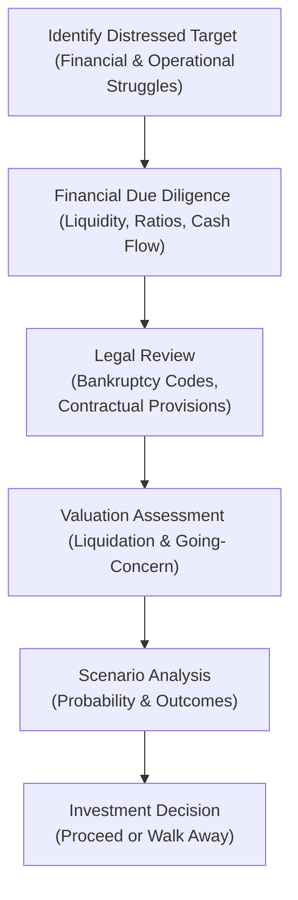

## Overview

In special situations investing—particularly distressed debt and turnaround scenarios—understanding the due diligence process and pinpointing how to value these challenging companies can, frankly, feel like navigating a maze. Many market participants, including general partners (GPs) and limited partners (LPs), find it both intimidating and exhilarating. Perhaps you’ve heard from a friend eyeing a distressed retail chain that has a respectable brand but bleak financials—he was excited about the “cheap price,” but as he dug deeper, he realized there were so many legal angles, multiple creditor claims, and uncertain future cash flows that it became, well, pretty complex.

This complexity underscores why astute investors need a systematic approach to evaluating special situations. In earlier chapters, we discussed broad valuation frameworks in Private Equity and Private Debt (see Chapter 3 and Chapter 4), as well as event-driven strategies (Chapter 5). Here, we’ll dive into the nuts and bolts of performing rigorous due diligence and valuation specifically within a distressed or “special situation” context. We’ll also share best practices, cautionary tales, and real-world examples that can guide you through the twists and turns of these unique opportunities.

## Fundamental Analysis in Distressed Investing

When we talk about “distressed investing,” we refer to investments in companies experiencing significant financial or operational challenges—often teetering on (or in) default. Honestly, the margin for error here can be razor-thin, so it’s crucial to dissect a target firm’s fundamentals more thoroughly than you might for a typical healthy company. 

• Scrutinize Financial Statements: Start with an in-depth look at the balance sheet, income statement, and statement of cash flows. Identify whether losses are cyclical or structural. Determine if the firm can realistically stabilize or generate enough cash to meet immediate obligations. Pay special attention to liquidity ratios such as the current ratio and quick ratio. They can hint at near-term solvency challenges.

• Forecasting and Stress Testing: For distressed or dislocated firms, consider building multiple forecast scenarios (like “best case,” “base case,” and “worst case”). In the worst-case scenario, assume limited financing options, significant cost of capital, or even a partial liquidation.

• Capital Structure Review: You may recall from Chapter 4 (Private Debt) how intricate capital structures can get—especially in leveraged or high-yield investments. In distressed scenarios, capital structure intricacies are magnified. Identify which layers of debt get priority. Review the firm’s covenants—particularly those that could trigger defaults or renegotiation.

• Business Model Viability: All the financial analysis in the world won’t save a fundamentally flawed business. Step back and ask, “Is the underlying model sustainable?” If demand for the company’s products is evaporating or if it’s in a technologically obsolete industry, it might not recover. The big question is: Is the company fixable?

Focusing on these points will give you a baseline sense of whether the company’s problems are short-term, fixable operational issues or deeper, structural impediments that might steer it toward liquidation.  

## Legal Review

Distressed investing is, in many ways, a legal game. Honestly, more than a few deals hinge on how well the investor understands bankruptcy codes, contractual provisions, and the nuances of creditor rights. A robust legal review is essential.

• Bankruptcy Code Awareness: Different jurisdictions have diverse laws on insolvency, reorganization, and creditor rights. Under U.S. law, Chapter 11 bankruptcies allow for reorganization, whereas Chapter 7 typically leads to liquidation. If you’re outside the U.S., you may see similar or entirely different frameworks. Each type of proceeding influences the potential for a successful turnaround.

• Contractual Provisions and Covenants: Debt documents often include cross-default clauses, liens, and specific covenants (both financial and operational). Understand who holds the senior vs. subordinated claims. If the senior lenders have the right to seize assets quickly, the margin for a distressed investor to maneuver might shrink.

• Order of Claims in Default: When push comes to shove, the order in which various creditors (and equity holders) stand to recover is crucial. Secured creditors typically get first dibs on collateral, while unsecured debt holders may get scraps. Equity—the riskiest class—faces the highest potential loss but also stands to gain significantly if a restructuring is successful.

In a sense, analyzing a distressed entity is part legal puzzle: your “payout” depends not just on the company’s financial health but also on where your claim sits in the stack of existing liabilities, how the courts or regulators interpret the situation, and whether the investment horizon allows time for a restructuring plan.

## Valuation Techniques

Valuing a distressed asset is more art than science. Let’s talk about a few key methods.

### Liquidation Valuation

Liquidation valuation estimates net proceeds if the company’s assets were sold under forced-sale conditions. The steps:

1. Appraisal of Tangible Assets: This can include real estate, machinery, inventory, and cash or marketable securities. Expect forced-sale discounts, which can be substantial.  
2. Assessment of Intangible Assets: Brands and patents might still have value, but in a distress scenario they can depreciate quickly if the business is no longer going to operate.  
3. Deduction of Liquidation Costs: Including fees for appraisers, lawyers, accountants, and any trustee overseeing the liquidation.  
4. Payment Priorities: Pay down secured claims first, then other creditors, and finally distribute whatever is left to equity holders (if there’s anything left at all).

This method is typically conservative—sort of like a break-up scenario for the business—and is often used as a worst-case outcome reference.

### Reorganization Value (Going Concern)

In contrast, going-concern valuation asks: “What if this business can be rescued and continue to operate?” This approach is generally higher than liquidation value, as it incorporates intangible assets (like brand equity, customer relationships, and ongoing operations) that would vanish or be heavily discounted in a forced sale.

Techniques to assess going-concern value include:  
• Discounted Cash Flow (DCF): Project free cash flows post-restructuring and discount them at an appropriate cost of capital.  
• Comparable Company Analysis (Comps): Compare to similar firms that are healthy. Apply sector-specific valuation multiples (like EV/EBITDA).  
• Precedent Transactions: Look at completed acquisitions of similarly distressed or restructured companies.

These approaches, used in combination, shed light on how the reorganized firm’s equity might be worth something—particularly valuable for existing equity holders or new money that invests in post-restructuring equity.

### Credit Risk Models

Credit risk models help quantify the likelihood of default (and potential recovery). Two broad categories:

• Structural Models (e.g., Merton Model): These treat equity as a call option on the firm’s assets. If assets exceed debt at maturity, equity retains value; otherwise, it’s worthless. This approach can get pretty technical, but the gist is analyzing asset volatility, the drift of asset value over time, and the liability structure.  
• Reduced-Form Models: Focus more on default probabilities inferred from market data (e.g., bond spreads or credit default swaps) and historical default rates. They can dynamically adjust as market conditions change.

For distressed deals, the broad takeaway is that systematic application of these models can reveal how likely the company might default, and if it does, how severe the loss might be.

### Scenario Analysis

Scenario analysis in distressed investing is a must. Suppose you identify three or four plausible outcomes:  
• Highly successful operational turnaround.  
• Partial restructuring with significant haircuts to current creditors.  
• A hurried liquidation.  
• Something in between (e.g., the equity is heavily diluted, but the business continues operating under new ownership).

Assign probabilities to these outcomes and estimate the expected value. This approach—while never perfect—helps you gauge risk/reward. It also clarifies pivot points: what’s needed for the best scenario vs. the worst scenario.  

Below is a simplified flowchart of how distressed investors might approach due diligence and valuation:

## Operational and Management Due Diligence

Distressed or special situations often involve companies that need more than just new capital. They might require new leadership, organizational lean-downs, or even wholesale strategic pivoting. A thorough operational and management due diligence effort includes:

• Management Assessment: Are key executives capable of steering a business through crisis? If not, is there a feasible plan to replace them, or to bring in specialists/consultants?  
• Operational Efficiency: Identify cost-saving measures—maybe plant closures, workforce reductions, or overhead consolidation.  
• Turnaround Potential: Evaluate if the company can rapidly re-enter the market with a refined product or pivot to a more profitable line of business.  
• Cultural/Stakeholder Issues: Distressed firms often struggle with employee morale, supplier reluctance, and customer attrition. Is management aware and prepared?

Addressing these questions helps you gauge whether the reorganization is feasible or a money pit. Honestly, I’ve seen a friend dive into a distressed asset purely because it was “cheap,” only to discover the internal culture was so toxic that no external capital injection could fix the underlying problems.

## External Advisors and Experts

If you’ve never done a scratched-record deep dive of a distressed business, you’ll quickly realize that specialized external advisors can be a godsend. Examples include:

• Turnaround Specialists or CROs (Chief Restructuring Officers): These experts come in, analyze the entire operation, and develop a plan to stabilize finances, renegotiate debt, or restructure the company.  
• Legal Counsel and Bankruptcy Attorneys: They clarify your position in the capital structure, help you interpret debt documents, and guide you through court proceedings or out-of-court restructurings.  
• Forensic Accountants: Sometimes, distressed firms are marred by irregularities or even fraud. Forensic accountants unearth hidden liabilities or suspicious transactions that normal audits might miss.  
• Industry Experts: Sector-specific consultants who can identify intangible value or show you how a once-popular brand can be revitalized.

Engaging these professionals can be expensive, but it’s often critical to your ultimate success (or to avoiding a catastrophic misstep).

## Key Insights in Distressed Investments

While every special situation is unique, certain universal truths often apply:

• Timing Is King: Distressed investing thrives on acting quickly when prices are dislocated—yet sound due diligence can’t be rushed. There’s a balance between being agile and thorough.  
• “Fulcrum” Security: Identify which layer of the capital structure might become the “new equity” post-restructuring. This is often the investment sweet spot.  
• Plan for the Worst: The “downside case” is real in distressed deals. If your forecast for a partial or total liquidation yields a potential large loss, factor that into your position sizing.  
• Stakeholder Negotiations: Restructuring is a team sport. There are bondholders, banks, employees, suppliers, etc. Aligning everyone’s interests can get complicated.  
• Regulatory and ESG: In some cases, environmental, social, or governance concerns might become crucial. For instance, a distressed factory with significant environmental liabilities can face additional costs that hamper a turnaround.

## Additional Diagram: Capital Structure Priority

Below is a conceptual diagram illustrating how claims might be prioritized in a liquidation or restructuring scenario. This prioritization influences recovery rates.

If a firm liquidates, Senior Secured Debt (A) is paid first from the proceeds of the collateral. By the time we get to Common Equity (E), there's often little to distribute in a distress scenario.

## Exam Tips

• Interdisciplinary Approach: For the CFA exam, don’t be surprised if a question blends aspects of legal structure, operational insights, and scenario-based valuations. Demonstrate both your quantitative and qualitative analysis skills.  
• Use Prior Chapter Frameworks: Incorporate key concepts from earlier modules (like performance metrics from Chapter 1, or buyout equity from Chapter 3, or covenant analysis in Chapter 4).  
• Show Workings & Justifications: Constructed-response items may require you to detail your assumptions about discount rates, recovery rates, or default probabilities. Clarity and succinct rationale are crucial.  
• Address Ethical Implications: Distressed deals can involve conflicts of interest or inside information issues. Always consider how the CFA Institute Code of Ethics might apply.  
• Time Management: If an item set question gives you multiple restructuring scenarios, outline your approach systematically: legal standing, liquidation vs. going concern, and the probable best outcome.

## Glossary

• Liquidation Valuation: Valuation technique in which a firm’s assets are individually sold off under forced-sale conditions, with proceeds distributed strictly according to claim priorities.  
• Going-Concern Value: The inherent value of a business assuming continuous operation, reflecting intangible benefits like brand equity, customer relationships, and synergy among assets.  
• Bankruptcy Code: The body of laws and regulations that govern the restructuring or liquidation of insolvent entities, varying by jurisdiction.  
• Forensic Accounting: A specialized branch of accounting that investigates financial records for fraud, inconsistencies, or other irregularities.  
• Covenant: Contractual provision that restricts certain borrower actions or mandates specific performance levels to protect creditors.

## References for Further Exploration

• Holthausen, R. W., & Zmijewski, M. E. (Corporate Valuation: Theory, Evidence, and Practice). Award-winning text that explores the building blocks of valuation for corporations, including distressed scenarios.  
• Turnaround Management Association (turnaround.org). Provides real-world case studies, articles, and resources on restructuring and distressed investing.  
• Merton, R.C. (1974). “On the Pricing of Corporate Debt: The Risk Structure of Interest Rates.” The Journal of Finance. Foundational academic paper on structural credit risk models.  
• CFA Institute, Level III Curriculum. Contains broader context on private markets, event-driven strategies, and best practices for portfolio construction and ethics.

--------------------------------------------------------------------------------------

## Test Your Knowledge: Due Diligence and Valuation in Distressed Investments



### Which of the following best describes liquidation valuation in a distressed scenario?

- [ ] It estimates the firm’s value assuming it can operate continuously.
- [ ] It uses only discounted cash flow analysis under optimistic forecasts.
- [x] It estimates the proceeds from selling a company’s assets individually under forced-sale conditions.
- [ ] It excludes any consideration of liabilities.

> **Explanation:** Liquidation valuation focuses on a forced-sale scenario where assets are sold individually to satisfy creditors. It’s often a conservative baseline for distressed valuations.

### Which of the following is most associated with the Merton Model in credit risk assessment?

- [x] Treating equity as a call option on the firm’s assets.
- [ ] Using macroeconomic indicators to estimate default rates.
- [ ] Employing constant transition matrices for credit rating changes.
- [ ] Estimating recovery rates solely based on historical loss data.

> **Explanation:** The Merton Model is a structural approach that treats equity like a call option on the value of a firm’s assets, providing insight into default probabilities when liabilities exceed asset values.

### In distressed investing, what is the greatest benefit of conducting scenario analysis?

- [x] Understanding multiple potential outcomes for recovery or liquidation.
- [ ] Calculating a single discount rate for all debts.
- [ ] Eliminating the need for detailed financial modeling.
- [ ] Validating that default risk is zero.

> **Explanation:** Scenario analysis helps investors consider different paths—such as a successful turnaround or complete liquidation—and assign probabilities to each, leading to a more comprehensive risk assessment.

### Which of the following is a key consideration when evaluating the legal aspects of a distressed firm?

- [x] Priority of claims and covenant breaches.
- [ ] Only equity holders’ voting rights.
- [ ] Existence of intangible assets, such as brand goodwill.
- [ ] Liquidation value being identical to going-concern value.

> **Explanation:** Legal reviews focus on priority of claims, potential covenant defaults, and other contractual aspects that determine how proceeds are distributed or how reorganizations can proceed.

### What is the primary difference between liquidation value and going-concern value in distress valuations?

- [x] Liquidation value assumes the business ceases operation; going-concern value assumes continued operation.
- [ ] Liquidation value is always higher than going-concern value.
- [x] Liquidation value applies to intangible assets only, while going-concern focuses on tangible assets.
- [ ] No difference exists; both value methods rely on identical assumptions.

> **Explanation:** Liquidation value centers on a forced sale of assets, often at discounted prices, while going-concern value captures the additional intangible and synergy value under continued operation.

### What is the main role of turnaround specialists or CROs (Chief Restructuring Officers) in distressed investments?

- [x] They analyze and stabilize a distressed company’s operations and finances.
- [ ] They provide only legal defense in bankruptcy proceedings.
- [ ] They set global insolvency laws and regulations.
- [ ] They audit financial statements for undisclosed liabilities.

> **Explanation:** Turnaround specialists or CROs focus on reworking a firm’s strategy, cutting costs, and guiding the organization to solvency, often in conjunction with other advisors.

### Which best describes forensic accounting in the context of distressed due diligence?

- [x] Investigating financial records for fraud, hidden liabilities, or other irregularities.
- [ ] Merely preparing routine quarterly reports for the SEC.
- [x] Assessing brand value in liquidation scenarios.
- [ ] Only verifying that account balances are accurate under GAAP.

> **Explanation:** Distressed deals frequently involve concerns about potential fraud or undervalued/hidden liabilities. Forensic accountants dig into the records to identify red flags that normal audits might overlook.

### Which statement about scenario analysis in distressed investing is TRUE?

- [x] It helps investors weigh probabilities of multiple restructuring or liquidation outcomes.
- [ ] It is irrelevant if the firm’s covenants are not close to being breached.
- [ ] It ensures the distressed firm will never enter bankruptcy.
- [ ] It replaces the need for external advisors.

> **Explanation:** Scenario analysis remains a critical part of distressed investing, as multiple future states—including restructuring success or outright liquidation—must be seriously evaluated to understand risk.

### Which of the following is a reason to engage external legal counsel in a distressed investment?

- [x] They can interpret bankruptcies, lien priorities, and covenant documentation.
- [ ] They only help in marketing the final product to consumers.
- [ ] They are obligated to provide new capital to the distressed firm.
- [ ] They solely focus on auditing intangible assets.

> **Explanation:** Legal counsel and advisors are essential in detailing the path through bankruptcy or restructuring, analyzing how claims are prioritized, and helping interpret myriad legal documents.

### True or False: In distressed investing, a company with negative equity always goes into liquidation, as there is no possibility of a successful reorganization.

- [x] True
- [ ] False

> **Explanation:** This statement is actually false—just because a company has negative equity does not automatically doom it to liquidation. A successful turnaround or reorganization can occur, injecting new capital or restructuring debt to restore solvency.


