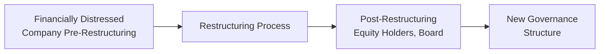
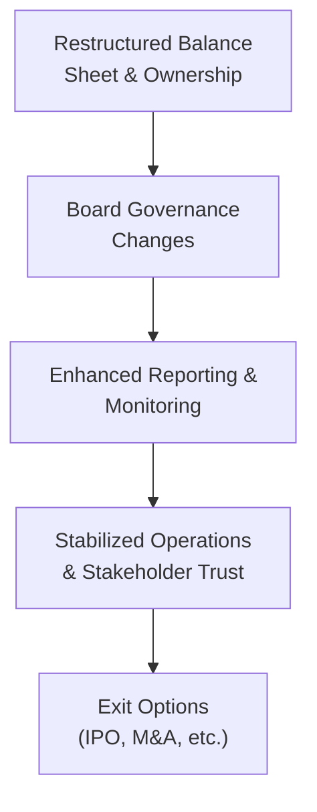

## Introduction and Context

Post‑restructuring governance and monitoring is kind of like giving a newly renovated house a solid inspection and a fresh coat of paint—except in finance, we deal with boards, stakeholder relations, and performance metrics, rather than drywall and paint rollers. So, let’s say you have a company that just made it through a major restructuring—maybe bondholders converted debt into equity, or a new private equity firm took the reins. The question is, “Now what?” This section explores exactly how organizations reorganize their governance structure, restore confidence among their stakeholders, and plan viable exit strategies once the dust of restructuring settles.

In Chapter 5 of this curriculum on Private Special Situations, specifically in Section 5.7 (Operational Turnarounds and Restructuring Strategies), we looked at how distressed companies can reorganize their operations and balance sheets. Here, in Section 5.8, we will zero in on the next step of that journey: how newly restructured entities install robust governance and ongoing oversight processes that protect stakeholder interests and encourage sustainable growth. Governance might not sound “exciting” in the way leveraged buyouts (Chapter 3) or complex derivative plays do, but trust me—it’s a huge deal. A well-structured board, meticulous reporting systems, and stakeholder alignment can all be deciding factors in whether the organization thrives and eventually achieves a successful exit for investors.

## Post‑Restructuring Board Composition

Post‑restructuring, one of the first changes you often see is a dramatic realignment of the board of directors. Gone are the majority of the old equity holders—particularly if this was a significant debt-to-equity swap. In their place you’ll find:

• New equity holders (formerly creditors).  
• Possible representatives from original lenders, especially if any portion of the debt remains.  
• Independent industry experts (selected for their insights into the company’s target market or operational niche).  

Let’s visualize, at a high level, how that shift might occur:

To be clear, each restructuring is unique. Maybe the board is relatively small, with seats specifically assigned to large credit holders who exchanged their loans for equity. Or, there could be a majority presence of private equity sponsors who just injected new capital. Ultimately, the goal is to ensure that real decision-making authority aligns with those who have the greatest vested interest in seeing the company prosper.

### Balancing Expertise and Control

In some cases, the new board structure can be quite specialized. For instance, you might bring in a turnaround specialist—someone who has previously guided distressed companies back to growth. You might also see seats reserved for technical experts if the firm is in a specialized industry like biotech, energy, or technology hardware. Depending on the size and complexity of the restructuring, these board appointments can deeply affect the company’s strategic direction. Once, I worked with a manufacturing firm that had faced near-bankruptcy—creditors insisted the new board include someone with deep supply chain expertise. The result was that the firm streamlined its inventory management (cut costs and shortened lead times), which proved instrumental in regaining profitability.

## Monitoring and Reporting

After you resurface from a restructuring, your new owners will want to keep a close eye on operations to ensure everything is on track. Think of it like a health app constantly monitoring your vitals—except here it’s about financial metrics, management performance, risk exposures, and compliance with the new capital structure. The bigger the stake you have in a newly restructured company, the more you want to ensure timely, accurate data flows about performance.

### Establishing Enhanced Transparency

Enhanced transparency often involves:

• Monthly or quarterly board meetings (sometimes more frequent in the early stages).  
• Formalized reporting packages that track revenue, expense, and operational key performance indicators (KPIs).  
• Performance “dashboards” that highlight problem areas early—especially important for companies still vulnerable to external shocks.  
• Detailed compliance checklists if the restructuring was done in a legal proceeding (e.g., Chapter 11 in the U.S.).

Lenders who remain in the picture might also require covenant monitoring. These covenant packages assess whether cash flow, leverage, and liquidity remain within allowable thresholds. You can think of covenants as a “polling station,” where the newly restructured entity must periodically re-confirm it’s abiding by certain rules of engagement.

### Reporting to Stakeholders

Beyond the board, other stakeholders also clamor for updates. Consider customers and suppliers, who may have been rattled by news of a near-death experience. Perhaps employees, who faced layoffs or pay cuts, might be concerned about job security and career paths. Forward-thinking boards often insist on more robust communication strategies:

• Town hall meetings with employees to discuss the company’s vision.  
• Regular press releases and statements to reassure customers that the business is stable.  
• Active engagement with suppliers to rebuild trust in payment schedules and contractual obligations.

## Corporate Governance Mechanisms

A newly restructured entity usually adopts or strengthens corporate governance mechanisms to prevent a relapse into distress. This can include:

• Independent Board Committees: Subsets of the board (e.g., audit committee, compensation committee) composed mainly of directors who do not have direct conflicts of interest. Their job is to ensure that day-to-day management decisions align with the best interests of the newly reorganized ownership structure.  
• Formal Risk Oversight: Implementing enterprise risk management (ERM) frameworks, such as requiring thorough reviews of operational, market, credit, and legal risks on a regular basis.  
• Performance‑Based Compensation: A common approach is to tie management bonuses to crucial milestones—like achieving revenue targets, EBITDA margins, or liquidity thresholds. This ensures management’s incentives remain closely aligned with the success of the post‑restructuring plan.  

### Example of Governance in Action

I recall seeing a manufacturing company that had just emerged from a debt-heavy capital structure. Its new owners set up a separate “operations committee” with a laser focus on cost control and efficiency. Management had to report weekly on labor utilization rates and monthly on overall cost savings. If targets were missed, substantial clawback provisions in the CEO’s compensation plan kicked in. The result? Everyone’s stars aligned around cost containment, all the way down to the factory floor.

## Exit Strategies After Restructuring

What’s next for investors who just painstakingly navigated a distress scenario and turned it around? They generally have a few exit routes:

• Sale to Strategic Buyer: Think about a big competitor buying out the newly lean, revitalized firm to gain market share or intellectual property.  
• Secondary Buyout: Another private equity firm might step in, believing it can take the turnaround to the next phase.  
• IPO or Direct Listing: If the company recovers so impressively that it’s ready for the public market, an initial public offering can be the grand exit.  
• Ongoing Stake: Sometimes, especially if stable cash flows start rolling in, the new owners choose to hold onto their stake for the long haul, enjoying dividends and capital appreciation.

### Assessing the Timing

The timing of an exit can be tricky. Exit too soon, and you might leave money on the table just as the turnaround is taking hold. Wait too long, and you might encounter new market disruptions or cyclical downturns. A typical play is to clock a “seasoning period” where the newly restructured company shows at least a few quarters of improved profitability or stable cash flow. This might be particularly important if an IPO is on the table; underwriters and public investors will expect consistent historical data post‑restructuring.

## Stakeholder Relations

A restructuring can leave behind a fair bit of emotional baggage. Employees might have felt uncertain or even resentful if layoffs and pay cuts were involved. Suppliers might require new credit terms after they lost money on old accounts receivable. Customers can become spooked, especially if the product or service they rely on seemed compromised.

### Building Trust

• Open Lines of Communication: One of the most straightforward ways to foster trust is to be transparent about the restructuring’s outcomes, new owners, and future strategy.  
• Enforce Service Level Agreements (SLAs): In B2B contexts, reaffirming prompt delivery times, consistent product quality, and robust warranties can help re-establish your credibility.  
• Invest in HR Resources: Offer training, career development, or performance bonuses to employees who stuck with the company through thick and thin.  

In one post‑restructuring scenario I studied, the new board insisted on monthly “all-hands” calls where employees could ask the CEO anything—this quickly reduced speculation and rumor-mongering. The firm ended up retaining many high-performers who appreciated feeling “in the loop.”

## Putting It All Together

Let’s illustrate the interplay of these elements in a simplified flow:

Each stage feeds into the next, creating a virtuous cycle of renewed confidence and operational momentum. If any piece breaks off—like if an independent board committee fails to catch questionable decisions, or if management refuses to adopt best practices in governance—the entire post‑restructuring strategy can unravel.

## Potential Pitfalls and Best Practices

• Insufficient Board Independence: If new owners stack the board only with their inside folks, you risk groupthink and oversight blind spots.  
• Weak KPIs for Monitoring: Too many vanity metrics (like “social media engagement”) and not enough around real financial viability.  
• Overly Complex Capital Structures: Restructuring can sometimes result in complicated multi-layered securities with differing rights—conflicts can erupt if the company goes through another downturn.  
• Communication Gaps: Failing to calm nervous suppliers or demoralized employees can hamper the turnaround, potentially leading to operational inefficiencies or lost customer relationships.  

Best practices include adopting corporate governance guidelines from recognized bodies like the International Corporate Governance Network (ICGN). Another wise move is to incorporate academic best practices from thought leaders such as Shleifer and Vishny’s research (“Corporate Governance and Control”). These resources can provide real-world insight into aligning incentives and establishing checks and balances.

## Final Exam Tips

From a CFA Level III standpoint, expect scenario-based questions that test your ability to evaluate the quality of post‑restructuring governance structures or identify critical reporting metrics that might be required by an LP (Limited Partner). Examiners may ask how you, as an analyst or a portfolio manager, would support or critique the exit timing. They could easily wrap in topics such as:

• Distressed debt valuation (tied to post‑restructuring equity).  
• Risk management, referencing board oversight committees.  
• Engagement with stakeholders, referencing business ethics and the CFA Institute Code of Ethics and Standards of Professional Conduct.

You might also see essay questions asking about how to handle conflicts among new equity holders with different objectives (e.g., a hedge fund wanting an immediate payout vs. a strategic investor wanting more conservative growth). Being prepared and knowing how post‑restructuring governance typically operates will help you manage those tasks confidently.

## References for Further Exploration

• International Corporate Governance Network (icgn.org) – Detailed guidelines on best practices in corporate governance for boards and shareholders.  
• Shleifer, A. & Vishny, R. W. “A Survey of Corporate Governance,” available on SSRN.  
• General Motors 2009 restructuring case – widely studied in business schools for insights on creditor-turned-shareholder dynamics and the role of government intervention.  
• CFA Institute Code and Standards – offers guidelines for managing conflicts of interest among stakeholders.  
• For a refresher on operational turnarounds, see Chapter 5.7 in this same curriculum.

---

## Test Your Knowledge: Post-Restructuring Governance and Monitoring



### Which of the following best describes why new equity holders often assume board seats post‑restructuring?

- [ ] They aim to increase the company’s debt burden.
- [x] They have a vested interest in overseeing strategy and protecting their newly acquired ownership stake.
- [ ] They want to avoid any involvement in day-to-day management decisions.
- [ ] They focus primarily on public market investors rather than internal governance.

> **Explanation:** Post‑restructuring equity holders (often creditors turned shareholders) want direct influence in strategic decisions and to ensure the turnaround plan is properly executed.

---

### A common motivation for having independent board committees post‑restructuring is:

- [x] To ensure unbiased oversight of management decisions.
- [ ] To reduce reporting requirements.
- [ ] To eliminate the need for performance-based compensation.
- [ ] To limit board accountability to existing equity holders alone.

> **Explanation:** Independent board committees are meant to offer objective oversight and mitigate conflicts of interest, not reduce accountability.

---

### Which of the following is a best practice for a newly restructured company to rebuild trust with stakeholders?

- [ ] Restrict all management communication to quarterly earnings calls.
- [x] Provide transparent updates through regular meetings and public statements.
- [ ] Focus exclusively on paying off debt, ignoring employee concerns.
- [ ] Delay the release of operational metrics until after a secondary buyout.

> **Explanation:** Rebuilding trust is based on transparency, aligning interests, and ensuring that stakeholders receive adequate and timely information about the firm’s condition and strategy.

---

### When might a secondary buyout be an appealing exit route?

- [x] When another private equity firm sees further value creation potential in the reorganized company.
- [ ] When the company wants a direct path to the public equity market.
- [ ] When no other buyers exist in the market.
- [ ] When the SEC mandates it.

> **Explanation:** A secondary buyout occurs when a second PE firm acquires a portfolio company from another sponsor that has turned it around sufficiently to attract interest.

---

### How do performance-based incentives align management with new owners’ goals?

- [ ] They allow management to be paid regardless of achieving key milestones.
- [x] They tie management compensation to growth in revenue, EBITDA, or other agreed-upon operational benchmarks.
- [ ] They replace all forms of cash compensation with stock options.
- [ ] They eliminate any need for board oversights.

> **Explanation:** Linking compensation to performance metrics creates alignment, motivating management to work toward the specific targets new owners prioritize.

---

### One risk of a poorly structured board post‑restructuring is:

- [x] Groupthink and limited independent perspectives.
- [ ] Breaking regulatory guidelines on anti-trust.
- [ ] Excessive operational improvements leading to market domination.
- [ ] Improved accountability across multiple facets of the business.

> **Explanation:** If the restructured board is composed solely of insiders without independent checks, the board may lack challenge and diversity of thought, leading to groupthink.

---

### Which of the following is a common corporate governance mechanism intended to strengthen oversight?

- [x] The creation of an audit committee with independent directors.
- [ ] Reducing the frequency of board meetings to reduce costs.
- [ ] Providing minimal operational data to limit information overload.
- [ ] Waiving all legal covenants post‑restructuring.

> **Explanation:** Independent committees, such as audit committees, help ensure thorough oversight of the management team and the company’s financial reporting.

---

### In deciding when to exit an equity position in a restructured company, investors often consider:

- [ ] Only whether the original lenders still hold seats on the board.
- [x] Whether the company has demonstrated consistent financial stability and a favorable market environment for sales or listings.
- [ ] If the managers are seeking employment elsewhere.
- [ ] Whether the company has an internal HR department.

> **Explanation:** Investors aim to exit when they can maximize returns, typically waiting for sufficient operational stability and favorable market conditions.

---

### Which statement best summarizes why communication with suppliers is essential post‑restructuring?

- [ ] Suppliers have no direct impact on operational stability.
- [ ] Suppliers generally demand audits of other stakeholders.
- [ ] Suppliers provide intangible benefits like brand goodwill.
- [x] Suppliers must be assured of the company’s ability to meet payment terms and maintain sustainable relationships.

> **Explanation:** Suppliers who feel uncertain about a previously distressed client may hedge their risk by demanding tighter terms. Transparent communication can reassure them and help preserve favorable terms.

---

### True or False: Performance dashboards are often implemented post‑restructuring to identify potential problems early and maintain transparency with stakeholders.

- [x] True
- [ ] False

> **Explanation:** Performance dashboards are a common tool used to give management, the board, and key stakeholders real-time or frequent insight into operational metrics, finances, and compliance measures.


