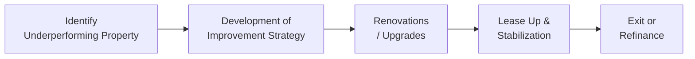

Introduction  
Have you ever strolled by a rundown apartment building in your neighborhood and thought, “Huh, if only they spruced up the place and raised the occupancy, that might be a gold mine”? That thought is basically the seed of a value-add real estate strategy. And opportunistic strategies? Well, those can start with, “Let’s build an entirely new property from scratch—or maybe buy a real estate asset that everybody else thinks is way too messy.” These two approaches—Value-Add and Opportunistic—are essential pillars of higher-risk real estate investing, particularly within private markets. 

This section is all about breaking down how investors (often referred to as Limited Partners or GPs—it depends on your vantage point) identify, quantify, and manage the enhancements and changes needed to turn an underperforming or even a physically dilapidated property into a profitable venture.

If you skimmed Chapter 1, you might recall that private real estate risk-return profiles range from “Core” (lowest risk, stable returns) to “Opportunistic” (highest risk, potential for outsized gains). “Value-add” and “Opportunistic” sit on the more adventurous side of that scale, meaning that if you get them right, you might realize significant alpha (excess return over the market), but if something goes wrong—like a construction overrun or a lingering vacancy—returns can plummet. Let’s look closer at these strategies and find out how to do them right.

Characteristics of Value-Add Strategies  
Value-add properties typically have some inherent issues: perhaps they’re 30% vacant in a market that’s typically 95% leased, or the interiors are stuck in the 1980s with old carpeting and weird paint colors. You might also have some deferred maintenance—like that rickety HVAC system that needs a complete overhaul. The big idea is to get in there, invest time and capital to fix those problems, bring the property’s operational metrics up to market standards, and then benefit from improved occupancy and higher rental rates.  

• Property Deficiencies: It could be physical (outdated design, significant repairs) or operational (poor management, suboptimal tenant mix). Value-add managers identify ways to upgrade and reposition the property so it commands higher rent or occupancy.  
• Moderate-to-High Leverage: While not always as high as in opportunistic deals, value-add strategies often rely on a decent chunk of financing. Because the property has known but fixable issues, lenders might be open to providing funds, though at somewhat stricter terms than core real estate.  
• Medium Time Horizon: Say you buy a building with 50% occupancy, hoping to push it to 90%. That won’t happen overnight—it might take a few years (two to five, typically) to stabilize occupancy, renegotiate leases, and finish renovations.  

Value-add deals often require an enhanced management approach—like actively marketing vacant units, negotiating new lease terms, or orchestrating coordinated capital expenditures to fix structural or cosmetic issues. Once stabilized, the investor can choose to either hold the property for predictable cash flows or exit by selling to a buyer who prefers stable, “core” properties.

Characteristics of Opportunistic Strategies  
Opportunistic real estate strategies are, in a sense, the wild west of property investing. These deals might involve building something brand new (ground-up development), acquiring severely distressed assets at a big discount, or pivoting a property from, say, a nearly abandoned industrial building to a modern biotech campus. In some cases, you’re taking advantage of cyclical dips in the market or significant regulatory or zoning changes.  

• Development Risk: Building from scratch introduces uncertainties in construction costs, labor availability, and local government approvals. Market conditions might shift dramatically by the time you’ve finished building.  
• Very High Leverage: Opportunistic deals often take on substantial debt, magnifying both gains and losses. Coupled with the unpredictability of a new build (or a major repositioning), high leverage can create headaches if interest rates rise or if there’s a delay in your construction timeline.  
• Potential for Outsized Returns: Because these properties can transform from nonexistent or nearly zero occupancy into brand-new, fully leased developments, the payoff—when everything goes right—can dwarf more stable real estate investments. But the risk is obviously greater.  

Investors pursuing opportunistic strategies must be prepared to handle everything from local zoning regulations to complicated capital stacks that may include mezzanine finance, private debt, or subscription credit lines (which we touched on in Chapter 2.8). The level of active involvement is intense, and success hinges on precise estimates of demand, costs, and timeline.

Identifying and Generating Alpha  
Both value-add and opportunistic investments are about generating alpha, meaning the “special sauce” that delivers above-market returns. How do you find alpha in real estate? It might be as simple as noticing a property in a prime location that’s being mismanaged, or as complex as anticipating demographic shifts (e.g., more people moving to an urban corridor) and building the right type of property to serve them.  

Alpha generation often hinges on:  

• Unique Market Insights: If you suspect that a neighborhood is on the verge of becoming the next “hot” spot, you might buy and renovate properties before the broader market catches on.  
• Skilled Management or Renovation: Some sponsors specialize in bringing new life to old assets. For instance, you might buy a neglected multifamily building with a tenant base that’s half the local average rent. By upgrading units and adding amenities, you’re able to attract higher-paying (and hopefully more stable) tenants.  
• Cost Control and Efficiency: In development projects, the difference between success and failure can rest on controlling labor costs, choosing cost-effective construction materials, and avoiding unnecessary design complexities.  

We explored performance metrics like IRR and MOIC in Chapter 1.3. Those are especially crucial in these strategies because you need to track not only how much return you generate, but also how quickly you recoup your capital. Remember: time-risk premium is higher when you’re dealing with development or extensive renovations, so hitting your pro forma IRR depends on achieving key project milestones in a timely fashion.

Market Research and Underwriting Considerations  
When you underwrite (i.e., evaluate) a value-add or opportunistic deal, you can’t just plug last year’s rent roll into the model and call it a day. You have to forecast the future potential once improvements are made:

• Construction/Renovation Costs: Factor in direct hard costs (materials, labor) plus soft costs (permits, architectural plans, marketing).  
• Vacancy Periods: Expect some loss of rental income during renovations and leasing up.  
• Market Trends and Demand: Will you really be able to charge 30% higher rents? Or are you being overly optimistic?  
• Lease Terms and Tenant Quality: In a repositioning strategy, you might replace weaker tenants with stronger, long-term ones (like a national retailer). This can increase the Net Operating Income (NOI) but might require concessions or custom build-outs.  
• Sensitivity Analysis: What if your rehab plan takes six months longer than expected? What if interest rates spike, affecting your short-term financing costs?  

Below is a formula often used to see how property improvements might drive incremental value. The logic is: if you can raise NOI (through higher rent or better occupancy), you raise the asset’s overall value, assuming the market capitalization rate (cap rate) remains constant. The simplified relationship goes like this:


\text{Value Increase} = \frac{\Delta \text{NOI}}{\text{Market Cap Rate}}


If you bump the NOI by \$100,000 and your market’s cap rate is 5%, the property’s value might increase by \$2 million:


\text{Value Increase} = \frac{\$100{,}000}{0.05} = \$2{,}000{,}000


Of course, real life is not so simplistic—cap rates can shift, and extra repairs might chew through your profits. But this fundamental principle shows how incremental NOI gains can produce outsized property value increases.

Leveraging the Right Capital Structure  
Unlike core real estate, which might comfortably exist with a single mortgage and minimal leverage, value-add and opportunistic plays often require layering multiple financing sources to bridge capital shortfalls or manage cash flow timing. For instance:

• Senior Debt: Typically a bank loan at moderate rates, but might be reluctant to go too high on the Loan-to-Value (LTV) ratio given the property’s existing condition.  
• Mezzanine Debt or Preferred Equity: Used to fill gaps between senior debt and equity. For deeper coverage, refer to Chapter 4.2 on mezzanine and uni-tranche debt.  
• Sponsor Equity and LP Contributions: The sponsor (GP) invests a portion of equity (often 1% to 10% of total equity), while LPs contribute the majority, expecting higher returns due to the elevated risk.  
• Bridge Loans or Subscription Lines: Sometimes used for short-term financing to acquire properties quickly, especially for opportunistic moves where time is of the essence.  

Higher leverage magnifies returns but raises the stakes if the project hits roadblocks. To mitigate this, sponsors often put in covenants that outline performance triggers or leverage limitations, though these can vary widely by deal. If you recall from Chapter 2.3, alignment of interests between GPs and LPs is crucial: the GP might earn carried interest only after hitting certain performance thresholds, keeping them motivated to manage the rehab or development effectively.

Timeline and Execution Risks: A Mermaid Diagram  
Below is a simple visual illustrating the value-add project life cycle—from identifying a deal to completing improvements and exiting.

• Identify Underperforming Property: Comb the market for neglected assets or underutilized locations.  
• Development of Improvement Strategy: Conduct detailed underwriting. Estimate costs, timeline, and the projected stabilized NOI.  
• Renovations/Upgrades: Execute physical improvements—like updating interiors or renovating common areas.  
• Lease Up & Stabilization: Market to prospective tenants, negotiate leases, and aim to achieve target occupancy and rental rates.  
• Exit or Refinance: Sell to a core or core-plus buyer who prefers stabilized assets, or refinance if you want to hold for cash flow.

Exit Strategies  
One of the biggest differences between these strategies and core real estate is the emphasis on an exit event. Sure, some investors hang onto the stabilized property for a while, but many prefer to take the newly improved or developed asset, sell it, and lock in their gains. Typical exit routes include:

• Selling to Core Investors: Once the property’s occupant base is stable and the capital improvements are done, core investors may pay premium prices for “turnkey” stabilized assets.  
• Portfolio Disposition: A sponsor might group a series of completed projects into a portfolio sale, capturing synergy or a better selling price.  
• Refinancing: The owners may refinance at a more favorable LTV based on the new, higher property valuation, returning some principal to investors while continuing to hold the asset.  

Leveraged deals often have to juggle prepayment penalties or loan covenant conditions upon exit, so understanding the capital structure thoroughly can make the difference between a seamless exit and a complicated unraveling.  

Common Pitfalls and Best Practices  
It’s easy to get caught up in the rosy scenario. You see a battered building, you imagine fancy new architecture, and you start counting your profits. But we all know real estate can get messy. So, here are a few hazards to watch out for:

• Overly Aggressive Underwriting: Don’t assume you can lease at top-of-market rents if the property location is secondary or if competition is fierce.  
• Construction Overruns: Even small cost or time overruns can quickly eat into your profits—cap your risk by adding contingencies.  
• Macroeconomic Shifts: The best-laid plans can go awry if a recession hits, or if interest rates rise, or if new supply floods the local market.  
• Regulatory Hurdles: Zoning changes, environmental approvals, or local community opposition can drastically slow down an opportunistic deal.  
• Lack of Reserves: Always keep a rainy-day fund to cover unexpected costs, especially in opportunistic works where so many moving parts can go sideways.  

Case Study Example: Converting an Old Office Building into Multifamily  
Picture a mid-rise office building in a downtown area that’s half vacant. The local workforce is shifting to remote or flexible offices, so the property’s landlord is pulling his hair out to fill the empty space. Meanwhile, there’s a massive shortage of downtown apartments. The canny real estate sponsor buys the building for a bargain price and invests heavily to convert each floor into residential units, complete with modern kitchens and lounge amenities.

• Step 1: They project a total renovation cost that includes building out plumbing and other mechanical systems for residential usage.  
• Step 2: They set an 18-month schedule for obtaining necessary permits, completing construction, and finishing interior design.  
• Step 3: They use a combination of senior debt plus mezzanine financing, expecting a final LTV around 75%.  
• Step 4: There’s a 20% project cost overrun because of supply chain issues—ouch. But they pivot, cut some unnecessary design features, and are just a few months behind schedule.  
• Step 5: Leasing picks up speed once the new apartments are available, and strong tenant demand nudges rents higher than originally projected (awesome!).  
• Step 6: Once stabilized, a real estate investment trust (REIT) that specializes in core multifamily offers to buy the newly repositioned building at a hefty premium, netting a strong IRR for the sponsor and LPs.  

In real life, none of this is guaranteed—maybe leasing is slower, or that cost overrun is bigger. But this example captures the structure and logic behind an opportunistic repositioning.

Practical Strategies for Investors and Managers  
• Align with Experts: If you’re an LP, you want a GP who’s done similar projects successfully. Due diligence on their track record is crucial.  
• Phase the Development: Instead of renovating an entire building at once, do it in phases so some parts remain cash-flow positive.  
• Use Realistic Pro Formas: Build multiple scenarios (pessimistic, base, optimistic). Evaluate how your returns hold up if the worst case starts unfolding.  
• Thoroughly Inspect Physical Assets: Hidden structural or environmental problems can drain time and money.  
• Engage the Community: If you’re doing massive redevelopment, local residents and civic organizations can either support or hinder your project.  

Exam Relevance and Final Thoughts  
In the context of the CFA® Level III exam—especially with the recent emphasis on Private Markets Pathway—understanding Value-Add and Opportunistic real estate strategies is essential. You should be comfortable with how to underwrite these deals, how to forecast NOI changes, how leverage impacts returns, and how to map out exit strategies. Remember to incorporate construction risk, lease-up risk, and broader market conditions into your scenario analyses. You might encounter questions requiring you to calculate IRRs under various cost or timing assumptions, or to evaluate the best financing structure for a hypothetical property.  

Don’t forget to cross-reference concepts from other chapters—like subscription credit facilities (Chapter 2.8) or mezzanine debt structures (Chapter 4.2). Real estate investing is rarely siloed; it often overlaps with the same financial tools and alignment-of-interest concerns that apply to private equity.  

References  
• CFA Institute. (2020). “Real Estate as an Investment.”  
• Urban Land Institute (ULI) Case Studies: https://casestudies.uli.org  
• Preqin. (n.d.). “Preqin Special Report: Real Estate.”

Test Your Knowledge of Value‑Add and Opportunistic Real Estate Strategies



### In value-add real estate strategies, which type of deficiencies are typically addressed to enhance property value?
- [ ] Macroeconomic rate fluctuations
- [x] Operational or physical deficiencies in the property
- [ ] Global geopolitical issues affecting overall markets
- [ ] Intellectual property rights and patents

> **Explanation:** Value-add real estate deals frequently target properties with operational or physical flaws such as deferred maintenance or low occupancy. By addressing these deficiencies, investors aim to increase rents and occupancy rates, thereby boosting NOI and the property’s overall value.

### A hallmark of an opportunistic real estate deal is:
- [ ] Minimal leverage and stable tenant occupancy
- [ ] Full development completed prior to acquisition
- [x] High leverage and substantial redevelopment or repositioning risk
- [ ] Immediate cash flow with no renovation needs

> **Explanation:** Opportunistic strategies tend to utilize higher leverage and involve high-risk undertakings such as ground-up construction or major redevelopment, aiming for significant upside potential in return.

### When underwriting a value-add property, investors typically place heavy emphasis on:
- [ ] Projecting dividend yields based on market indices
- [x] Estimating renovation costs and timeline to reach target occupancy
- [ ] Monetizing intangible assets like trademarks
- [ ] Tracking currency fluctuations for multinational tenants

> **Explanation:** Value-add deals require improvements or operational changes. Thus, renovation costs, timelines, and the resulting impact on rents and occupancy are key underwriting inputs.

### In the context of value-add or opportunistic real estate, alpha primarily refers to:
- [ ] The inherent market return available to all passive investors
- [x] Excess returns generated through active property improvements
- [ ] Arbitrage opportunities solely related to interest rate movements
- [ ] Gains achieved by investing only in stabilized, low-risk properties

> **Explanation:** Alpha denotes returns above the market average, typically achieved in real estate by active management, strategic renovations, or market insight that unlocks hidden value.

### Which of the following is a typical exit strategy for a successful value-add property?
- [x] Selling the stabilized property to a core investor
- [ ] Failing to secure leases and forfeiting the property
- [ ] Converting the property into a cryptocurrency mining facility
- [x] Refinancing to return capital to investors

> **Explanation:** Common exit strategies include selling to core buyers eager for a fully stabilized asset or refinancing once a higher valuation is attained, returning capital to investors.

### Sensitivity analysis in underwriting helps investors:
- [x] Understand the impact of changes in assumptions (e.g., construction costs, interest rates) on returns
- [ ] Obtain more lenient covenants from lenders
- [ ] Design the building’s architectural features
- [ ] Eliminate execution risk altogether

> **Explanation:** Sensitivity analysis stresses various assumptions, giving investors a way to evaluate how returns may shift if key variables—like vacancy rate or borrowing costs—fluctuate.

### A key difference between a value-add and an opportunistic real estate strategy is:
- [x] Value-add typically involves moderate improvements, while opportunistic may include ground-up development or major property repositioning
- [ ] Value-add properties never require renovations
- [ ] Opportunistic deals always involve zero debt
- [ ] Value-add strategies are often more leveraged than opportunistic strategies

> **Explanation:** Value-add strategies usually focus on moderate upgrades and operational fixes, whereas opportunistic deals may involve more significant development or repositioning, often coupled with higher leverage.

### A high cap rate in a target market typically indicates:
- [ ] Low perceived risk and premium valuations
- [x] A lower valuation multiple and potentially higher required returns
- [ ] That no financing will be available
- [ ] Full occupancy and stable cash flows

> **Explanation:** A high cap rate suggests that the market demands higher returns relative to net operating income, often reflecting increased risk or weaker market conditions.

### The formula Value Increase = (ΔNOI) / (Cap Rate) is primarily used to:
- [x] Estimate how changes in net operating income translate to changes in property value
- [ ] Calculate the interest payments on mezzanine debt
- [ ] Determine the break-even vacancy rate
- [ ] Predict macroeconomic shifts in property values

> **Explanation:** This formula shows how an improvement in net operating income can bolster a property’s valuation, holding the cap rate constant.

### True or False: One of the main rewards of opportunistic real estate strategies is the potential for higher returns due to leveraging distressed or underutilized assets, but it also carries a significantly higher risk profile.
- [x] True
- [ ] False

> **Explanation:** Opportunistic approaches intentionally take on substantial risk, such as significant redevelopment, ground-up construction, or distressed acquisitions, in pursuit of outsized returns.


