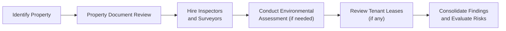

## Overview and Importance of Due Diligence

Well, let’s just say I remember my first big private real estate deal and—if I’m being completely honest—I was a little nervous about all the things I had to check before committing. The location looked terrific, the building looked solid, and the broker’s pitch sounded fantastic. But as my mentor liked to say, “Trust me—nobody wins in real estate by skipping the details.” That’s basically the spirit of due diligence: verifying every piece of information about the property, its title, its market conditions, potential environmental issues, and anything that might impact the final value or investment risk.

Due diligence is the systematic investigation or audit of a property to confirm all relevant facts, such as physical and structural conditions, legal compliance, tenant considerations, and more. Often, property investors rely on a specialized team of professionals—like appraisers, building inspectors, environmental engineers, and attorneys—to help them do a deep dive. Skipping or rushing any part of this process can lead to regrets later, so we want to dig in carefully.

In private real estate, you can think of due diligence as coming in three main flavors:

• Property‑Specific Due Diligence  
• Financial and Operational Due Diligence  
• Market or External Due Diligence  

Let’s break these down so you know exactly what you’re getting into.

## Property-Specific Due Diligence

Property-specific due diligence addresses the straightforward yet critical question: “Is the building as good as it looks?” It involves everything from top to bottom—literally. Here are some considerations:

• Physical Inspections: A property inspector (or a structural engineer for large commercial buildings) will assess the foundation, roofing, HVAC systems, electrical wiring, plumbing, and other structural components.  
• Zoning and Land Use: You might hear local officials say “This property is zoned for commercial use only.” Great, but what if you plan to develop a residential complex? You’ve got a problem if zoning restrictions don’t match your intended use.  
• Environmental Assessments: If the property is in an industrial area, you’ll want a Phase I environmental site assessment. That’s basically a thorough review to see if the soil, water, or building materials are contaminated. If Phase I suggests potential issues, proceed to Phase II (actual sampling) and possibly Phase III (remediation plan).  
• Tenant Review: If there are existing tenants, you want to review lease agreements, payment histories, rent escalations, security deposits, and any unusual contract clauses. Maybe there’s a co-owner, or maybe the tenant has the right to renew or the right of first refusal to purchase the property; it all matters.

### Visual Overview of Typical Property-Specific Due Diligence Workflow

As you can tell, multiple steps and multiple professionals are often involved. The final recommendation from each specialist helps you estimate the property’s true condition and any additional costs or repairs.

## Financial and Operational Due Diligence

Even if the building is physically sound, you need to confirm it makes financial sense. This step feels almost like dissecting a company’s financial statements—but for a specific asset. Some major considerations include:

• Historical Operating Statements: Actual or pro forma statements help you see past performance trends, identify cost anomalies, and check the reliability of rent collections.  
• Tax Records: Review property tax bills from prior years. If you see a sudden spike in assessed values, budget for potential property tax increases.  
• Insurance Coverage: Validate that the property is insurable at a reasonable rate. Flood zones, earthquake zones, and other environmental risks can cause big insurance swings.  
• Maintenance and Capital Expenditure Records: If the property has had big capital improvements or if major equipment is nearing the end of its life, that can affect near-term cash flow.  
• Lease Economics: Rent rolls, escalations, expense reimbursements (like triple net leases where tenants pay for property taxes, insurance, and maintenance), anchor tenants in commercial centers, etc.  

You might bring on a forensic accountant or a specialized real estate financial analyst if the property is large or complicated. After all, once you close on this asset, any hidden financial or operational mess becomes your responsibility.

## Market or External Due Diligence

A fantastic property can still flop if the broader market conditions are unfavorable. Market due diligence means analyzing:

• Local and Regional Real Estate Trends: Vacancy rates, absorption rates, and new constructions in the pipeline.  
• Comparable Lease and Sales Data: “Comps” help estimate realistic rental rates and sale prices. If you’re told you can get $35/sq ft in a $20/sq ft neighborhood, well, that’s a red flag.  
• Path-of-Growth Indicators: Future infrastructure projects like roads and mass transit expansions might signal growth potential. Rezoning plans or major commercial developments can also spur rising values over time.  
• Demographic Shifts: Changes in population size, median income, and local economic drivers can all directly affect occupancy and demand for real estate.  

It’s smart to pay attention to smaller intangible or less-researched indicators. For instance, if an area is rapidly gentrifying, you can see an influx of new restaurants, co-working spaces, and modern retail shops. That intangible vibe might hint at rising property values. Conversely, maybe a few key employers are leaving the area—then your demand for real estate may be heading south.

## Valuation Approaches in Private Real Estate

So let’s say the due diligence passes your tests. Next question: “How do I value the property?” Real estate valuations can be done through three classic approaches:

• Income Capitalization Approach (both Direct Cap and Discounted Cash Flow)  
• Sales Comparison Approach  
• Cost Approach  

We’ll tackle each in turn.

### Income Capitalization Approach

For income-generating properties, the big star is the income approach. Essentially, properties are worth what their income stream is worth. Let’s talk about the two variations under this approach:

#### Direct Capitalization Approach

The direct capitalization (or “direct cap”) method uses a capital rate (cap rate) to convert a single-year Net Operating Income (NOI) into an estimate of value.

Mathematically:


  \text{Property Value} = \frac{\text{NOI}}{\text{Cap Rate}}


where:  
• NOI (Net Operating Income) = Rental Income – Operating Expenses (excluding depreciation, interest, or taxes).  
• Cap Rate = Desired yield or market-derived rate of return.

If, for instance, the NOI is $1.2 million and the market cap rate is 6%, the property’s estimated value under direct cap is $1.2 million / 0.06 = $20 million.

Think of the cap rate sort of like the reciprocal of a price‑to‑earnings multiple in equity analysis. The lower the cap rate, the higher the price you pay for each dollar of NOI. But be cautious: picking the right cap rate isn’t trivial. You might derive it by looking at recent comps or your own target return. In real estate booms, we often see compressed cap rates (like 4% or 5%) that significantly elevate prices—and can be risky if interest rates rise or the local economy cools off.

#### Discounted Cash Flow (DCF) Approach

Sometimes you want to account for changing income patterns over time. That’s where the DCF approach shines. You project future cash flows (rent escalations, mortgage payments, etc.) for a specific holding period—say, 5 to 10 years—and then discount them back to present value using a discount rate that reflects the property’s risk. You also include a “reversion value” (the sale value at the end of the holding period) which is typically calculated using an assumed exit cap rate or some multiple of exit-year NOI.

Mathematically (using a simplified representation):


  \text{Value} = \sum_{t=1}^{T}\frac{\text{NOI}_t}{(1 + r)^t} + \frac{\text{Reversion Value}}{(1 + r)^T}


where “r” is the discount rate—essentially the required rate of return for this type of property risk.

DCF analysis gives you a multi-period perspective, which is perfect for properties that will see big changes in income—like if you plan to renovate and increase rents, or if current leases are below market rates.

### Sales Comparison Approach

Sometimes, the best way to gauge value is to look at what similar properties in the same area fetched. With the sales comparison approach, you gather data on “comparable” properties that have been sold recently, and you adjust for differences in location, size, age, amenities, condition, and timing. For instance, if you find a comp that sold for $2 million, but your subject property has 500 extra square feet, you might adjust the comp’s value upward. If it has an older HVAC system, adjust downward. The idea is to standardize your comp to match your subject property as closely as possible.

The sales comparison approach is heavily used for residential real estate and also in stable, homogenous markets. But it can be tough if you don’t have good, recent comps or if the property is very unique (say, a multi-purpose warehouse with special features).

### Cost Approach

In the cost approach, you start by estimating the cost to build a similar structure from scratch. Then, you account for depreciation (physical wear and tear, functional obsolescence, external or economic obsolescence) and add the land value. It’s like saying: “I can buy the land for $X and build the same building for $Y, minus the depreciation of the actual structure.” Often used for newer or special-purpose properties, the cost approach becomes challenging when the property has unique or older improvements that are hard to replicate.

## Sensitivity Analysis in Property Valuation

No one really wants to buy a property and later say, “Ah, I should have known interest rates would skyrocket.” That’s why sensitivity analysis is a big deal in private real estate. You take your set of assumptions—NOI growth, vacancy rates, exit cap rates, discount rates, etc.—and tweak them to see what happens to your property value. Some investors might call this a “stress test.” For instance, you might want to see how value changes if rent growth is only 2% a year instead of 4%, or if the exit cap rate drifts up from 6% to 7%. By experimenting with these variables, you avoid letting any single overly optimistic assumption blind you to potential downside risks.

### Quick Sensitivity Matrix Example

Let’s say you have a baseline assumption:  
• NOI = $1,000,000  
• Cap Rate = 5%

Baseline Value = $20,000,000 ($1,000,000 / 0.05).

Now if the cap rate rises to 6%, that same NOI yields a property value of $16,666,667. (Yikes, that’s a drop of $3.33 million!). If you also consider a scenario where NOI drops to $900,000 and the cap rate rises to 6.5%, your new valuation is $13.85 million—a big difference from $20 million. When you see these large shifts, it helps you appreciate how fragile some valuations can be.

## Role of Third‑Party Professionals

Throughout the entire due diligence and valuation process, investors typically engage these experts:

• Appraisers: Provide professional valuations using standardized methods, often required by lenders to confirm the property’s worth.  
• Building Inspectors and Engineers: Diagnose structural integrity and mechanical system conditions.  
• Environmental Consultants: Conduct Phase I, II, or III reviews to identify contamination or other environmental liabilities.  
• Attorneys: Review legal documents, monitor compliance with local regulations, and handle closings.  

Yes, all these services cost money, but it’s usually a fraction of what you risk losing if hidden problems surface later.

## Common Pitfalls and Best Practices

• Overlooking Minor Repairs: Little issues have a habit of growing bigger and more expensive if you don’t budget for them.  
• Blindly Trusting Seller Projections: Always verify claims about future rent growth or projected occupancy. They are only as good as the data behind them.  
• Not Considering Market Shifts: Real estate markets can turn on a dime. If you see warnings that interest rates might jump, factor that into your DCF or your recapitalization strategy.  
• Incomplete Environmental Assessments: Even slight contamination can balloon into a legal or cleanup nightmare—plus it can damage the property’s resale value.  

Anyway, after experiencing all sorts of real estate deals over the years, I can tell you: thorough diligence is far cheaper and easier than dealing with surprises post-closing.

## Integrating ESG and Sustainability

Although ESG was once mostly associated with equity investing, it’s increasingly relevant for real estate too. Maybe your building’s energy efficiency can reduce operating costs or command higher rents from environmentally conscious tenants. Or you might adopt green certifications—like LEED (Leadership in Energy and Environmental Design)—which can boost your property’s appeal and potentially its value. If local regulations or tenants expect properties to meet certain environmental standards, factoring these into your due diligence saves headaches later on.

## Exam Relevance and Final Thoughts

On the CFA Level III exam or in a real-world scenario, you might see a case study where you have to:

• Evaluate the correct valuation approach for a specific property.  
• Identify which parts of the due diligence process are missing or incorrectly performed.  
• Recommend a sensitivity analysis strategy to manage risk.  

Be prepared to demonstrate how changes in discount rates, NOI assumptions, or local market conditions could alter the value and risk/return profile of the investment. And always remember: real estate is about balancing potential return with real, tangible risks—both from the physical asset itself and from the broader market context.

Keep practicing with sample scenarios. Trust me, the more you practice applying these methods, the easier it’ll be to think on your feet during the actual exam. Good luck, and remember to keep an eye out for the “hidden issues” that can appear in the best-looking deals.

## Glossary of Key Terms

• Zoning: Regulation of land use by local authorities to control how properties can be developed or used.  
• Environmental Assessment: Investigations to identify environmental liabilities (contaminated soil, hazardous materials, etc.).  
• Discount Rate: The required rate of return used to convert future cash flows into present value in a DCF.  
• Cap Rate: Ratio of NOI to property value, often used to summarize a property’s expected return.  
• Reversion Value: The projected sale price of the property at the end of the holding period.  
• Comparable Sales (Comps): Other recently sold properties with similar attributes used to estimate a fair price.  
• Depreciation: Any loss in value from age, wear, or obsolescence.  
• Sensitivity Analysis: A risk management technique where key assumptions are changed to see how value is affected.

## References and Further Reading

• Appraisal Institute:  
  https://www.appraisalinstitute.org  
  (Extensive resources and professional standards on property valuation)  

• The Handbook of Commercial Real Estate Investing, by John McMahan  
  (Comprehensive overview of real estate due diligence concepts)  

• RICS Valuation – Global Standards (“Red Book”)  
  (Recognized standards covering the best practices of property valuation)  

• CFA Institute Curriculum  
  (Specific reading materials relevant to private markets and real estate topics)

--------------------------------------------------------------------------------

## Test Your Knowledge: Private Real Estate Due Diligence and Valuation



### Which of the following best describes "due diligence" in private real estate? 
- [ ] A quick review of historical rents followed by a tour of the property 
- [x] A thorough review of physical, financial, legal, and market factors related to the property 
- [ ] An appraisal conducted solely by an internal finance analyst 
- [ ] A tax audit performed by local authorities 

> **Explanation:** Due diligence means examining a range of factors, including physical inspections, financial records, legal and regulatory aspects, environmental issues, and market drivers.

### Which of the following would typically fall under property-specific due diligence?
- [ ] Checking local demographic trends and vacancy rates 
- [x] Reviewing existing tenant leases and evaluating structural integrity 
- [ ] Projecting future capital expenditures using comps 
- [ ] Calculating the property’s exit cap rate for the next 10 years 

> **Explanation:** Property-specific due diligence focuses on the building’s physical condition, tenants, and any immediate operational issues. Local trends and forward-looking considerations tend to fall under market analysis or broader financial diligence.

### In the income capitalization formula, Property Value = NOI / Cap Rate, how does a higher cap rate generally affect the value?
- [x] It decreases the value. 
- [ ] It increases the value. 
- [ ] It has no effect on property value. 
- [ ] It doubles the value. 

> **Explanation:** A higher cap rate, all else equal, results in a lower property valuation because you are discounting the same NOI by a larger factor.

### When is the cost approach most suitable for valuing a property?
- [ ] In well-established neighborhoods with abundant readily available comps 
- [ ] For older properties with minimal physical depreciation 
- [x] For newer or specialized properties where comparable sales data is limited 
- [ ] Only in distressed markets 

> **Explanation:** The cost approach is particularly useful when reliable comps are hard to find, as in new developments or unique properties, and when depreciation can be estimated accurately.

### Which of the following is a common outcome of sensitivity analysis in private real estate valuation?
- [ ] Values remain static regardless of changes in NOI 
- [x] Values fluctuate based on small changes in key assumptions 
- [ ] Discount rates remain unchanged in all scenarios 
- [ ] Market comparables become irrelevant 

> **Explanation:** Sensitivity analysis illustrates how variations in inputs like vacancy rates, cap rates, or projected rent growth can cause significant changes in the property’s estimated value.

### What is typically included in market (external) due diligence?
- [x] Evaluating local real estate trends, vacancy rates, and infrastructure developments 
- [ ] Inspecting the property’s roof and foundation 
- [ ] Requesting a Phase II environmental report 
- [ ] Reviewing year-end operating statements 

> **Explanation:** Market due diligence focuses on external factors such as demographic shifts, new construction, or infrastructure projects that might influence value.

### If you discover potential zoning conflicts during due diligence, which course of action is most advisable?
- [x] Consult with local authorities and legal counsel to confirm permissible land use 
- [ ] Proceed with the investment as long as the seller promises to fix it 
- [ ] Assume future zoning laws will be more favorable 
- [ ] Ignore it if the property is generating adequate cash flow 

> **Explanation:** Zoning conflicts can negatively impact future use and expansion. It’s critical to verify there’s no conflict with local regulations or to find a workable pathway to remedy.

### One benefit of the discounted cash flow (DCF) approach is that it:
- [x] Accounts for multi-year changes in rent, expense growth, and reversion value 
- [ ] Is easier to execute than a direct cap approach 
- [ ] Eliminates the need for cap rate analysis 
- [ ] Uses only current-year NOI 

> **Explanation:** The DCF approach projects future income and expenses year by year, then discounts them to present value, offering a more nuanced picture than single-year methods.

### Which of the following specialists is most likely to assess environmental contamination risks during due diligence?
- [ ] A structural engineer 
- [x] An environmental consultant 
- [ ] A tax accountant 
- [ ] A marketing coordinator 

> **Explanation:** Environmental consultants perform Phase I (and, if necessary, Phase II/III) assessments to check for soil or material contamination that can affect the property’s value and compliance.

### True or False: A thorough due diligence process in private real estate should include tenant lease reviews, legal compliance checks, and professional inspections.
- [x] True
- [ ] False

> **Explanation:** A comprehensive due diligence process necessarily covers tenant details, any possible legal or zoning issues, and structural/physical inspections to fully understand the property’s condition and risk.


