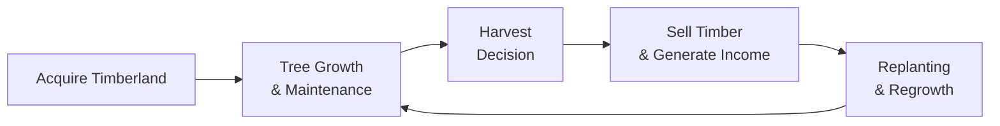

## Introduction

Timberland and farmland—you know, these two can be oddly fascinating within the realm of private real estate. When I first heard about them in an investment context, I thought: “Hang on, this is basically owning a forest or a farm, right?” And well, that’s essentially the idea, but the reality is more nuanced and can actually be quite sophisticated. So let’s dig in and see how owning land for trees or crops can open up interesting opportunities for portfolio diversification, inflation hedging, and steady, if sometimes cyclical, returns.

In private markets, timberland refers to forested land cultivated for wood and paper production, whereas farmland revolves around crops, livestock, and various agricultural activities. Both tend to be long-term, illiquid, and management-intensive, requiring specialized knowledge of crops, trees, weather patterns, and yes, even pests. But they can also function as anchors of stability in a broader portfolio—if structured properly.

## Why Timberland and Farmland Are Unique Real Estate Investments

Before we go into the value drivers or talk about the risk-return trade-off, it’s worth emphasizing why these assets are even classified under private real estate at all. After all, they are quite distinct from, say, an urban skyscraper or an industrial warehouse:

• Tangibility: Timberland and farmland are tangible, income-generating resources. You can physically walk through a forest stand or a cornfield.  
• Biological Growth Cycles: In farmland, you see recurring annual or seasonal crop cycles. In timberland, you see tree stands that take years—sometimes decades—to mature.  
• Management Intensive: Both require active upkeep—pruning trees, monitoring soil conditions, replanting seeds, controlling pests, rotating crops, etc. This in-depth management is a key driver of returns (and headaches).  
• Market Nuances: Unlike more populated real estate sectors (office, retail, multi-family), farmland and timberland have fewer buyers and sellers and can involve complicated local regulations. Liquidity is therefore even more limited and specialized.  

Yet these investments can serve as intriguing portfolio diversifiers. They often have low correlation with traditional assets like equities and corporate bonds, partly because of their unique drivers—commodity prices, climate factors, and biological growth cycles. As you’ll see in the sections below, they also carry specific risks that might make you raise an eyebrow.

## Value Drivers for Timberland

### Biological Growth and Harvest Timing

One of the first things to note about timberland is that your main “crop” is trees. Trees take time to grow, but they eventually become raw materials for wood products and paper. Unlike farmland where you usually harvest crops once or twice a year, timber harvest can be strategically flexible. You might delay harvest if wood prices are unattractive or accelerate harvest if prices are high.

Seasoned timberland managers might, for instance, measure tree diameters, track lumber futures, and analyze market forecasts to decide whether to harvest or wait. Because trees continue to increase in value (as they keep growing) if left standing—provided they’re healthy—investors have this optionality to optimize the timing of harvest. 

### Tree Species, Growth Rates, and Geographic Factors

• Species Mix: Different trees command different prices. For instance, hardwoods (oak, maple) can fetch premium prices, though they may grow more slowly. Softwoods (pine, spruce) have broader industrial applications but might be more sensitive to cyclical demand in construction.  
• Growth Rates: Warmer, wetter climates can accelerate tree growth. However, certain species thrive in cooler conditions, so the local environment matters quite a bit.  
• Geographic Location: Transportation, labor, and regulatory costs can vary widely from one jurisdiction to another. If you own timberland in a remote area, shipping logs to a mill might get quite expensive.  

### Timber Prices and Global Demand

Timber demand is influenced by construction, paper manufacturing, and even new uses in engineered wood products (e.g., cross-laminated timber, plywood). Economic expansions often stimulate more building activity, which boosts wood prices. A global demand for greener construction materials can further support timber prices.

### Example: Timing a Lumber Harvest

Imagine you own a 5,000-acre pine forest. Your local sawmill quotes you a certain price per board-foot, reflecting current supply-demand dynamics. Suddenly, lumber futures start trending up due to a forecast for increased housing starts. Your manager might say, “Let’s hold off another year. We expect better log prices soon.” Since the trees are still growing, you potentially gain from not only the rising price but also from biological growth—where each tree is physically increasing in value.

## Value Drivers for Farmland

### Crop Yield and Commodity Prices

If you’re dealing with farmland, your returns usually anchor on a combination of crop yields (tons of wheat, bushels of corn, or acres of produce) and the commodity prices prevailing when it’s time to sell. Commodity price volatility can be significant. A sudden surge in demand for soybeans (maybe due to drought in a major producing region) can push prices higher, boosting farmland profitability.

### Technology, Irrigation, and Sustainability Practices

• Advanced Irrigation: Methods like drip irrigation or pivot irrigation can drastically improve water efficiency, leading to higher yields.  
• Precision Agriculture: Drones, satellite data, and soil sensors can provide real-time insights on soil moisture, nutrient levels, and pest threats, allowing for targeted interventions.  
• Sustainable Farming: Popular with ESG-minded investors. Techniques like crop rotation, organic inputs, and minimal tillage not only maintain soil health but may increase the land’s long-term productivity.

### Land Appreciation

Farmland offers potential for capital appreciation over the long term. Agricultural land can become more valuable if it’s near urban growth corridors or if demand for certain crops surges. There’s always the possibility, of course, that farmland gets rezoned for development. That’s a separate consideration but can lead to large windfalls if it happens.

### Example: Enhancing Crop Yield with Technology

Let’s say you invest in farmland in the Midwest that predominantly grows corn. Historically, the farm has been using traditional irrigation and crop management. You—and your farmland manager—decide to switch to precision irrigation technology that measures soil moisture in real time. As a result, you reduce water usage by 30% while actually increasing your yield. Over time, that yield improvement can help your farmland investment beat the returns from a typical, less efficiently managed competitor.

## Risk and Return Profile

### Inflation Hedge Characteristics

Both timberland and farmland tend to be considered inflation hedges. Commodity prices—such as lumber or wheat—often increase with inflation, which can help mitigate the impact of rising general price levels on an investor’s portfolio. Also, farmland rental rates sometimes move in step with inflation, providing another potential buffer.

### Weather, Pests, and Diseases

It’s not all smooth sailing. Agricultural investments—whether forests or crops—are vulnerable to weather extremes (droughts, hurricanes, floods), pest infestations (think bark beetles for timber; locusts for farmland), and diseases (e.g., crop blight, fungal growth). In heavily forested areas, a pest outbreak can decimate entire regions, while farmland can suffer from commodity price crashes or policy shifts in agricultural subsidies.

### Government Regulations and Subsidies

Agricultural subsidies may support specific crops or insurance programs. Government policies can also clamp down on logging to preserve biodiversity or mitigate deforestation. Regulations can help or hurt returns depending on changes in environmental laws, water rights, and phytosanitary standards.

### Liquidity Constraints

Timberland and farmland are notoriously illiquid. You generally can’t sell an acre here or a strand of trees there with the same ease you’d sell shares in an REIT or a public equity. The transaction process might be lengthy, expensive, and require specialized agents or brokers. Consequently, these investments typically come with long holding periods.

## Role in a Multi-Asset Portfolio

From a portfolio construction perspective, farmland and timberland can offer diversification benefits due primarily to (1) low correlation with equities and bonds, and (2) unique growth cycles driven by biological factors. They can serve as a hedge against inflation, and in some cases, they deliver stable cash flows if structured as leases (e.g., farmland lease to a farming operator).

For example, if you’re constructing a strategic asset allocation from scratch, you might allocate 2–5% of the portfolio to farmland or timberland. This is a rough guess; the exact allocation depends on your risk tolerance, investment horizon, and conviction in agricultural commodity markets.

## Operational and Management Considerations

### Professional Managers and Fee Structures

Given the specialized nature of these assets, institutional investors often partner with professional timberland or farmland management firms. These firms handle planting, harvesting, replanting, pest control, soil management, marketing, and distribution of crops or wood products. You might see:

• Base management fee (like 1–2% of assets under management).  
• Performance-based fees contingent on yield or net operating income.  

### ESG and Sustainability Requirements

Land stewardship is huge. Many management companies maintain certifications (e.g., Forest Stewardship Council for timberland) or compliance with government agricultural best practices. There’s a growing trend of farmland owners adopting regenerative agriculture—practices that improve soil health and sequester carbon.

### Storage and Distribution

On farmland, access to grain elevators, storage facilities, or livestock processing plants can significantly shape profitability. For instance, if you can store crops until off-peak selling seasons, you might lock in higher market prices. Timberland can need local sawmills or pulp mills, plus the roads or rail lines to get logs out efficiently.

## Valuation Approaches and Strategy

### Discounted Cash Flow (DCF) Analysis

Much like other real estate assets, a DCF approach can be used for farmland and timberland—but with unique inputs. You might forecast:
• Crop or timber harvest volumes.  
• Commodity price assumptions.  
• Operating costs (labor, planting, pest control).  
• Reinvestment in reforestation (for timber) or annual inputs (seeds, fertilizer) for farmland.  
• Projected terminal value of the land if sold after a certain holding period.

The discount rate often reflects the risk premia for agricultural or forestry assets, including their sensitivity to weather, pests, and macroeconomic conditions.

### Comparables (If You Can Find Them)

In farmland, you might look at local farmland sales data—dollars per acre in the same region—to get a sense of fair value. Timberland can rely on comparable sales if you find land with a similar species mix, location, and timber maturity. However, these markets can be quite thin and region-specific, making the search for comparable data challenging.

### Real Option Value (Timberland Specific)

Timberland has something akin to a “real option,” owing to its harvest flexibility. Typically, appraisers or sophisticated managers incorporate this optionality in advanced valuation techniques, adjusting current net present value (NPV) to account for the fact that you can wait until prices improve.

## ESG Integration and Sustainability Considerations

Timberland and farmland often feature as prime candidates for ESG or impact investing. Let’s face it, they’re literally dealing with natural resources and ecosystems—no shortage of ways to do right (or wrong) by the environment.

• Soil Health: Over-tilling or excessive chemical use can degrade farmland. Sustainable practices help preserve yield potential over the long run.  
• Biodiversity: Maintaining habitat for local species in timberland or farmland buffer zones can preserve ecological balance.  
• Social Impact: Investing responsibly might mean fair labor policies for farm or forest workers, contributing to local communities, and ensuring transparent land ownership.  

Regulatory frameworks are increasingly strict about sustainability and carbon footprints, especially in farmland. Many investors see farmland as a route to carbon sequestration, particularly if regenerative practices are used. Timberland inherently stores carbon in the forest biomass, though logging and reforestation cycles complicate the net carbon effect.

## Practical Examples and Case Studies

### Case Study: Sustainable Timberland Investment in the Pacific Northwest

Picture a big institutional investor that acquires 100,000 acres of forest in Washington State. They focus on responsible forestry. They log a portion each year to generate consistent cash flow but replant with local species. Because their plan includes protecting older growth sections of the forest and abiding by Forest Stewardship Council standards, they gain access to “certified lumber” markets, often commanding premium prices. Over 10 years, as housing demand grows, the investor benefits from a rise in timber prices—and the land itself appreciates.

### Case Study: Transitioning Cropland to Specialty Organic Crops

An investor buys farmland traditionally producing commodity corn. Recognizing the booming demand for organic produce, they transition part of the land into high-value, organic vegetables. The shift requires capital for new irrigation systems, stronger soils, and certifying the land organic (which can take a few years). Initially, yields are lower, but as management refines organic practices, yields pick up—and they can sell produce at premium prices to local markets. Over a 7-year horizon, net operating income rises significantly, even though commodity corn was historically less volatile.

## Visualizing the Timberland Harvest Cycle

Below is a simplified illustration of how an investor moves from land acquisition to final sale of timber, and eventually the reforestation process:

The cyclic nature underscores that each phase depends on market conditions, species growth rates, and management expertise.

## Common Pitfalls and Best Practices

• Overestimating Commodity Prices: Optimistic forecasts of future log or crop prices can lead to disappointed returns.  
• Underestimating Operational Costs: It’s easy to underestimate pest control or fertilizer expenses.  
• Ignoring Environmental Due Diligence: Soil depletion, water scarcity, or protected species can hamper expansion.  
• Short-Term Mindset: Timberland and farmland are inherently long-term plays. Exiting too early can destroy value.  
• Lack of Diversification: Owning a single farm or forest might expose you to significant local risks (weather, pests).  

## Final Exam Tips

1. Master the Specific Risk Factors: Be prepared to articulate how timberland and farmland differ from other private real estate segments (such as commercial or residential).  
2. Connect Inflation Hedge Benefits: Understand how commodity price-linked revenues can mitigate inflation risk and see how that might appear in an exam question.  
3. Emphasize Valuation Nuances: On the essay portion, you could be asked to demonstrate a DCF for a farmland property or incorporate real option thinking for timberland.  
4. Incorporate ESG Examples: The CFA exam increasingly highlights ESG, so be ready to discuss the specific environmental and social considerations relevant to farmland/timberland.  
5. Link to Portfolio Theory: Show how farmland/timberland might reduce overall portfolio volatility through low correlation.  
6. Prepare for Ethical Dimensions: Ownership of large amounts of farmland can raise concerns over local communities, labor standards, or deforestation. Tying these to the CFA Institute’s Code and Standards can yield a robust exam answer.  
7. Time Management in Constructed Response: Keep your eye on the clock. Provide concise, bullet-style rationales for risk or performance questions about farmland and timberland.  

## References

• Hancock Timber Resource Group:  
  https://www.htrg.com

• TIAA-CREF Global Agriculture, farmland investing division (Nuveen):  
  https://www.nuveen.com/en-us/investment-capabilities/real-assets/agriculture

• The World Bank Agricultural Reports:  
  https://www.worldbank.org/en/topic/agriculture

• CFA Institute Level III Curriculum Readings on Real Estate and Alternatives  

----------------------------------------------------------------------------------------------------

## Test Your Knowledge: Timberland and Farmland Investments



### 1. Which of the following is a unique advantage that timberland investments have over some other private real estate assets?

- [ ] The ability to harvest and replant trees on a weekly basis  
- [x] The option to delay harvesting if timber prices are low  
- [ ] Government subsidies guaranteeing fixed returns  
- [ ] Immediate liquidity upon investor demand  

> **Explanation:** One key advantage of timberland is the flexibility to delay harvesting until market prices improve, because unharvested trees can continue to grow and accumulate value over time.

### 2. What is the primary driver of farmland value?

- [ ] Rent from logging activities  
- [ ] Office space vacancies  
- [x] Crop yields and commodity prices  
- [ ] Daily market fluctuations of REITs  

> **Explanation:** Farmland returns revolve around the productivity of the land (crop yields) and the prices for those crops (commodity prices).

### 3. Timberland and farmland are generally considered good hedges against inflation because:

- [ ] They are unaffected by macroeconomic factors  
- [ ] Their prices collapse faster than inflation increases  
- [x] Commodity-linked returns tend to rise with general price levels  
- [ ] They are both entirely subsidized by governments  

> **Explanation:** Because commodity prices (like wood, grains, livestock) typically rise with inflation, farmland and timberland often exhibit inflation-hedging properties.

### 4. Which of the following is a key risk in managing timberland?

- [x] Pest infestations that can damage tree stands  
- [ ] Government policies allowing unlimited logging  
- [ ] Perfectly predictable lumber prices  
- [ ] Guaranteed short-term liquidity  

> **Explanation:** Pests, such as beetles or invasive species, can destroy vast areas of forest and significantly reduce timber yields.

### 5. A farmland manager decides to adopt precision agriculture technologies. Which potential benefit can stem from such an investment?

- [ ] Reduced yield and increased labor costs  
- [x] Increased yield and optimized resource usage  
- [ ] Elimination of commodity price risk  
- [ ] Exemption from environmental regulations  

> **Explanation:** Precision agriculture techniques—such as soil monitoring and targeted irrigation—can lead to higher efficiency, better crop yields, and lower operating costs.

### 6. Which factor prominently influences the market value of timberland?

- [ ] Total acreage alone, ignoring species mix  
- [x] Species mix and age class distribution of trees  
- [ ] Existence of immediate farmland conversion options  
- [ ] Full immunization from economic cycles  

> **Explanation:** Timber species and tree maturity play critical roles in how valuable the property is, as they define the quality and quantity of harvestable wood.

### 7. In a discounted cash flow (DCF) valuation for farmland, which would be the most appropriate discount rate to use?

- [ ] A risk-free rate multiplied by total asset value  
- [ ] A discount rate that is exactly the same as corporate bonds  
- [ ] Zero, because farmland produces guaranteed returns  
- [x] A rate reflecting agricultural risk, weather volatility, and commodity price risks  

> **Explanation:** Farmland and timberland have unique risk profiles (weather, pest, yield volatility) that should be encapsulated in a higher discount rate than risk-free assets.

### 8. One primary drawback of farmland and timberland investments is:

- [ ] Their correlation with equity is typically high  
- [ ] They are fully liquid and can be sold overnight  
- [ ] They have no ESG considerations  
- [x] Their markets can be highly illiquid and require specialized brokers  

> **Explanation:** Transaction times can be lengthy, and buyers need specialized knowledge, making farmland and timberland relatively illiquid.

### 9. In terms of ESG, why might farmland garner significant interest from impact investors?

- [ ] Farmland is generally free of environmental issues  
- [x] Sustainable and regenerative farming practices can promote biodiversity and reduce carbon emissions  
- [ ] Farmland is always located in environmentally protected areas  
- [ ] Crop production never uses fertilizer or chemicals  

> **Explanation:** Impact-driven investors often focus on farmland because it can be managed with sustainable practices, improving soil health, water use, and biodiversity while capturing carbon.

### 10. True or False: Timberland investments have no correlation with global economic growth.

- [ ] True  
- [x] False  

> **Explanation:** Timberland is related to global economic cycles because lumber demand is influenced by construction, paper usage, and broader macroeconomic activity.


