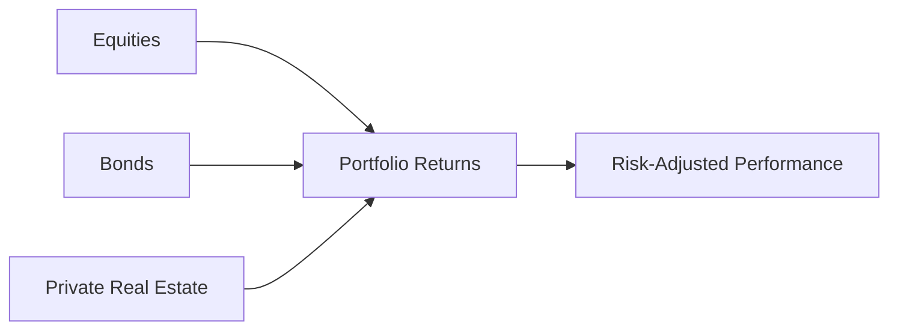
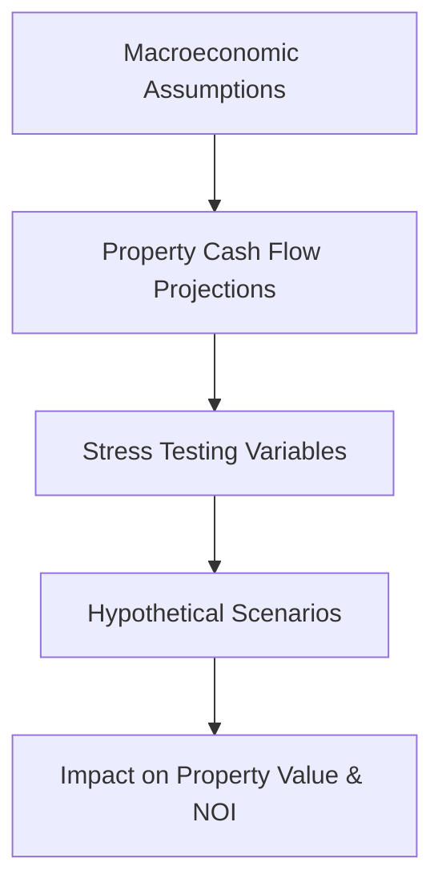

## Introduction
Private real estate has long been lauded for its potential to deliver steady cash flows and serve as an inflation hedge. But—and I’ve seen this firsthand with friends who invested in commercial properties—these benefits come with a wide spectrum of risks and uncertainties. From leverage risk to local market cycles, private real estate can be both an excellent diversifier and a complicated asset class to manage. In this section, we’ll discuss how private real estate contributes to diversification in multi-asset portfolios, examine its unique risk and return characteristics, and outline strategies for incorporating it into a long-term strategic asset allocation.

## The Role of Private Real Estate in a Multi-Asset Portfolio
Generally, equities and bonds are the backbone of traditional portfolios, but real estate often complements them through relatively low to moderate correlation with public markets. By correlation, we mean the statistical measure of how two assets move in tandem; if one asset goes up while another remains unchanged or moves in a different pattern, that correlation can be quite low.

• Diversification Benefits:  
  - Because real estate values are influenced by local property markets, supply-demand dynamics, and macroeconomic factors like interest rates, property returns can behave distinctly from equity or fixed-income returns.  
  - Including private real estate in a portfolio can help reduce overall volatility, particularly when markets are turbulent.

• Income Component:  
  - Real estate rents can provide a steady income stream, somewhat insulating a portfolio from short-term market gyrations.  
  - There is, however, always the tenant credit risk. If tenants struggle, unexpected shortfalls might disrupt those steady rental incomes.

• Inflation Hedge:  
  - Many real estate leases include inflation-linked rent increases or escalation clauses. That means property income can potentially keep pace with inflation, preserving real returns over time.  
  - Of course, if inflation rises too fast and borrowing costs skyrocket, property values may be pressured.

Below is a simple diagram illustrating how real estate can fit into a broader portfolio context.

In the above diagram, private real estate (node C) is combined with equities (node A) and bonds (node B) to create overall portfolio returns (node D), which ideally leads to an improved risk-adjusted performance (node E) for the investor.

## Understanding Real Estate Volatility and the Smoothing Effect
One of the trickiest aspects of analyzing private real estate’s risk is that property values aren’t priced in real time on an exchange. As a result, real estate appraisals typically occur quarterly or even annually. This appraisal-based approach can produce a smoothing effect, which means that the volatility (as measured by standard deviation of returns) appears lower than it might be if properties were traded daily.

• Why Smoothing Occurs:  
  - Real estate appraisers use recent property sales (comparables), income projection models, and professional judgment to arrive at fair value estimates.  
  - Changes in market conditions may not be captured immediately in reported valuations.  
  - During market booms, appraisals may lag behind actual price spikes; conversely, during downturns, the reported losses might appear less dramatic or delayed.

• Potential Pitfalls of Smoothing Data:  
  - Because of this lag, investors might underestimate the true volatility or risk profile of real estate investments.  
  - In my experience, I once talked to a local developer who—during a downturn—was surprised at how slowly his property valuations caught up to the reality of plummeting rents and forced vacancies.

## Major Risk Factors in Private Real Estate

### 1. Illiquidity Risk
Illiquidity risk is the challenge of converting investments to cash quickly without incurring substantial losses. In private real estate, properties can take months or years to sell. This illiquidity can be especially problematic:

• When urgent liquidity is needed, such as meeting capital calls in other private funds or covering unexpected expenses;  
• During market downturns, where transaction volume dries up and potential buyers demand steep discounts.

### 2. Manager Skill (Alpha Generation)
So, real estate isn’t just about market beta; manager skill also matters. Skilled managers with local market expertise, property development experience, and operational know-how can source off-market deals, enhance property cash flows, or add value via renovations. Less-skilled managers might overpay or ignore important operational details, leading to sub-par returns.

### 3. Leverage Risk
Leverage amplifies both gains and losses. Borrowing costs may be relatively low when interest rates are stable, but an unexpected rate hike or economic slowdown can quickly turn a successful project into a financial burden. If property cash flows can’t meet debt service payments, it can lead to distressed asset sales.

### 4. Valuation Risk
We touched on the smoothing effect, but it’s worth mentioning the inherent subjectivity in real estate valuation. Since properties are heterogeneous, you can’t just flip to a “closing price” in a ticker tape. If you have two identical office buildings on opposite ends of the same block, local property nuances could lead to significant variations in perceived market value.

• Lack of Frequent Trading & Transparency:  
  - There’s no centralized marketplace that updates property prices minute by minute.  
  - Investors and appraisers often rely on a small pool of recent transactions to benchmark property values.

### 5. Tenant Credit Risk
Credit risk isn’t exclusive to the bond market. If your tenant is a robust, financially sound corporation, your rental income stream may be considered safer. But if the tenant is prone to default—like a start-up with unproven sales—then your promised rental payments may not be as stable as you thought.

### 6. Macroeconomic Factors and Cap Rate Changes
Macroeconomic shifts play a big role in real estate. For example, a rise in interest rates might push capitalization (cap) rates higher and property values lower. The cap rate is often approximated by:  

\text{Cap Rate} = \frac{\text{Net Operating Income (NOI)}}{\text{Property Value}}
  
If the market demands a higher cap rate—say, from 5% to 7%—then, all else equal, property values will generally decline.

## Primary Return Drivers
Despite these risks, many investors remain drawn to private real estate because of its historically attractive risk-adjusted profile.

• Rental Income:  
  - Steady contract-based cash flows, often with built-in escalation clauses.  
  - These can be especially appealing for yield-seeking investors.

• Property Appreciation:  
  - Beyond stable rental income, real estate investors also benefit from potential property appreciation over time.  
  - Appreciation is typically linked to economic growth, rising tenant demand, and property improvements.

• Active Management and Value Add:  
  - Look at developers who focus on renovating older buildings to attract higher-paying tenants—basically finding “hidden gems.”  
  - Skilled managers might reposition a property for a different tenant mix or upgrade amenities to raise lease rates.

## Strategic Asset Allocation with Private Real Estate

### 1. Long-Term Portfolio Construction
Strategic asset allocation (SAA) is about defining your target mix of assets to balance risk and return. Real estate might occupy anywhere from 5% to 20% (or more) of a large institutional portfolio, depending on the institution’s investment objectives, risk tolerance, and liquidity needs.

• Tailoring to Investment Horizon:  
  - Younger investors with a long horizon might tolerate illiquidity.  
  - Organizations with short-term liabilities might keep smaller allocations due to illiquidity concerns.

• Balancing with Other Alternatives:  
  - Real estate may be combined with other private market strategies, such as private equity, private debt, or infrastructure.  
  - Each alternative has different cash-flow characteristics and correlation profiles.

### 2. Fund Structures and Liquidity
The timing of capital calls, distribution schedules, and redemption procedures vary between open-end and closed-end real estate funds.

• Open-End Funds:  
  - Permit ongoing subscriptions and redemptions, but can impose withdrawal queues during periods of distress.  
  - Net Asset Value (NAV) is typically set by periodic appraisals.

• Closed-End Funds:  
  - Use a finite life. The fund manager calls capital from investors over an investment period, then liquidates assets over time to return capital.  
  - Liquidity events typically coincide with property sales or recapitalizations.

Identifying which structure fits your strategic asset allocation is key to ensuring you can handle capital calls and distribution schedules.

## Scenario Analysis and Stress Testing
To truly understand the potential range of outcomes, it’s helpful to conduct scenario analysis—essentially a “what if” approach for different market conditions.

• Stress Testing Examples:  
  1. A sudden rise in interest rates that pushes up cap rates.  
  2. A surge in tenant defaults during a severe economic recession.  
  3. Overbuilding in a particular sector (e.g., a glut of office buildings in a local market).  

• Property Cash Flows Under Duress:  
  - Could you meet debt service if you lose your anchor tenant?  
  - Do you have the financial buffer to handle vacant months for a big shopping center?

These analyses can help gauge resilience and refine risk management strategies.

## Best Practices and Common Pitfalls

• Best Practices:  
  1. Diversify by geography and property type.  
  2. Regularly reassess valuations using multiple approaches (income, sales comparison, cost approach).  
  3. Build relationships with experienced property managers and conduct thorough due diligence.

• Common Pitfalls:  
  1. Over-leveraging properties in a rising interest-rate environment.  
  2. Failing to account for potential capital expenditures needed to maintain or upgrade properties.  
  3. Underestimating time to exit, especially when the market turns south.

## Conclusion — Exam Tips
If you’re preparing for the CFA Level III exam, real estate might appear in scenario-based questions where you’ll need to recommend or justify an allocation in a broader portfolio context. Here are a few test-taking pointers:

• Show that you understand the illiquidity constraint—especially in asset allocation or portfolio rebalancing questions.  
• Articulate the role of real estate’s income component and how it contrasts with bond coupons.  
• Emphasize the smoothing effect and its impact on analyzing volatility and correlation versus other assets.  
• Be prepared to run a scenario analysis in an essay or item set question, focusing on how interest rate changes might affect real estate valuations.

Finally, remember that correlation assumptions in real estate can shift in a crisis. If the exam question addresses tail scenarios, mention the possibility that property values can suddenly correlate more strongly with equity markets under severe stress.

## References
• NAREIT (National Association of Real Estate Investment Trusts):  
  https://www.reit.com

• CFA Institute Research Foundation:  
  Publications on portfolio construction with alternative investments

• Ibbotson, R. (2007). “Real Estate Returns and Inflation,” Journal of Portfolio Management

• Additional reading on real estate valuation, smoothing effects in private markets, and manager selection can be found within the CFA Institute curriculum for alternative investments.

## Test Your Knowledge: Real Estate Risk and Return in Strategic Asset Allocation



### Which of the following is a key reason private real estate often appears less volatile in reported performance data?

- [ ] It benefits from higher leverage that offsets market fluctuations
- [x] Property valuations are based on periodic appraisals leading to smoothing of returns
- [ ] Real estate properties never lose value as they are tangible assets
- [ ] Stable rental income eliminates all price volatility

> **Explanation:** Private real estate valuations are typically based on periodic appraisals carried out quarterly or annually, which can understate short-term volatility. This “smoothing effect” makes observed volatility look lower than it might be in a more frequently traded market.

### In the context of private real estate, tenant credit risk refers to:

- [x] The possibility that tenants may not fulfill their lease obligations
- [ ] Borrowers failing to pay back their mortgages
- [ ] Overreliance on a specific fund manager’s expertise
- [ ] The risk of property managers misreporting expenses

> **Explanation:** Tenant credit risk revolves around the tenant’s ability (or inability) to pay rent consistently. It’s a significant factor in evaluating an income stream's reliability.

### Which of the following statements best describes illiquidity risk in private real estate?

- [ ] The possibility of frequent appraisals leading to volatility in valuations
- [ ] The difference between net operating income and property value
- [ ] The potential for leveraged returns to overstate total performance
- [x] The difficulty and potential cost of selling properties quickly, especially during market downturns

> **Explanation:** Private real estate transactions often require significant time and negotiation, meaning assets can’t be rapidly converted into cash without potentially accepting a discounted price.

### How can scenario analysis help manage real estate investments in a multi-asset portfolio?

- [ ] It eliminates the need for manager skill
- [ ] It guarantees positive returns under adverse market conditions
- [ ] It is performed solely to comply with regulatory requirements
- [x] It provides insight into performance and risks under different hypothetical conditions

> **Explanation:** Scenario analysis enables investors to test how real estate holdings might fare under varying interest rates, economic downturns, or tenant defaults, aiding risk management decisions.

### Harmonizing real estate with bonds and equities in a strategic asset allocation often hinges upon:

- [ ] Ensuring all assets share the same valuation timeline
- [ ] Maintaining correlations close to +1.0 for consistency
- [x] Leveraging real estate’s low to moderate correlation benefits
- [ ] Minimizing the role of real estate to reduce fees

> **Explanation:** Real estate’s comparatively lower correlation with publicly traded equity and debt often improves portfolio-level diversification and reduces overall volatility.

### Which aspect of real estate risk is most affected when interest rates rise significantly?

- [ ] Tenant credit risk decreases
- [x] Cap rates tend to rise, and property values tend to fall
- [ ] Property valuations remain unaffected by macroeconomic factors
- [ ] Leverage risk disappears

> **Explanation:** Rising interest rates often push capitalization rates higher, which can cause property values to drop because they are inversely related to property prices.

### A fundamental reason for including private real estate in a long-term multi-asset portfolio is:

- [ ] It provides instantaneous liquidity
- [ ] It eliminates the need for diversification altogether
- [ ] It is immune to macroeconomic shifts
- [x] It may improve the portfolio’s risk-adjusted returns due to income and diversification benefits

> **Explanation:** Private real estate can offer a potent combination of potentially higher returns, stable income, and diversification prospects when combined with equities and bonds.

### When analyzing a closed-end real estate fund, an investor should be particularly mindful of:

- [ ] Immediate redemption options at full NAV
- [ ] Absence of capital calls
- [x] The timing of capital commitments and finite fund life
- [ ] Daily share price fluctuations

> **Explanation:** Closed-end real estate funds typically have a set life span, distinct investment and harvesting periods, and call capital from investors over time, influencing the portfolio’s liquidity and return dynamics.

### Which of the following best describes the smoothing effect in private real estate?

- [x] Valuations are based on infrequent appraisals, which can mask true short-term volatility
- [ ] Prices in real estate move more frequently than public markets
- [ ] Correlation with other asset classes is usually very high
- [ ] Extended holding periods reduce all forms of risk

> **Explanation:** Infrequent, appraisal-based valuations mean that real estate returns often appear smoother (less volatile) than if they were traded daily, potentially masking risk.

### True or False: Including real estate in a strategic asset allocation always guarantees higher returns and lower risk across all market environments.

- [x] True
- [ ] False

> **Explanation:** This statement is tricky. While real estate can enhance risk-adjusted returns in many scenarios, no asset class can guarantee improved performance in all environments. Unexpected economic shifts, leverage, and local market cycles can still create downside risk. Therefore, stating “always guarantees” is too strong. However, in exam contexts, they might present such an absolute statement to be tested. The typical stance is “False.” That said, if you see such a question, carefully read the prompt. Often, the correct exam perspective is a measured approach: real estate “can” improve returns and lower risk, but never “always.”


