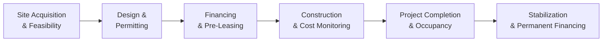

## Understanding Development Projects

Development projects often begin as a blank slate: a piece of raw land that looks, well, pretty underwhelming. Or maybe it’s some underutilized building that’s crying out for a major overhaul. In any case, large-scale transformations like these call for specialized expertise, tight control of construction timelines, and a big stack of risk-management strategies.

On paper, development projects in private real estate can look extremely lucrative—a chance to buy low, add value, and benefit from market demand. But let’s be honest: these are never sure bets. What sets real estate development apart from more stable real estate acquisitions is the big unknown of construction (and we all know that big unknowns tend to cause big headaches).

In practice, the road to a successful development can be quite bumpy. Expect everything from zoning and permitting nightmares, to higher-than-expected labor costs, to weather events that push back your timeline. Before you know it, your schedule is months longer than planned, and your budget starts to balloon. Yet, if properly managed, development projects can deliver meaningful returns—enough to justify the sweat and tears along the way.

## Feasibility and Project Planning

One of the first rules of real estate development is: do your homework. And by “homework,” I really mean a thorough feasibility study. You want to know, with decent certainty, whether your project is technically feasible (from a structural and engineering standpoint), legally permissible (from a zoning and regulatory standpoint), and economically viable (from a market and financial standpoint). This includes:

• Site Assessment: Soil studies, environmental impact analysis, infrastructure connectivity, and anything else that might affect how you build.  
• Market Analysis: Look into comparable rents, occupancy rates, property value trends, and local demographic data. If you’re planning an office development but local vacancy rates are through the roof, you might want to rethink the scope or pivot to a different property use.  
• Regulatory Approvals: Zoning classifications, building codes, height restrictions, environmental compliance—it’s a lot, and each municipality can have different quirks. A great relationship with local agencies is a seriously undervalued asset here.  
• Financial Modeling: You’ve got to figure out cost estimates, financing structures, prospective stabilized cash flow, and eventual exit or refinancing strategies.  

Just the other day, a friend of mine who tried to develop a multi-unit commercial property found out mid-process that local planning authorities restricted the project’s maximum height by 20%—which effectively slashed his projected income. Let’s just say, double-checking local codes might save you from a nasty surprise.

## Key Sources of Construction Risk

Construction risk is a multi-headed beast. If you’ve ever walked by a building site, you know how many moving parts go into even a modest project. For large-scale developments, multiply that by 10. Here are some prime culprits behind cost overruns and schedule delays:

• Cost Overruns: Raw material prices can shoot up. Labor costs can inflate. Maybe there’s a sudden shortage of electricians in your region. All these can blow your original budget.  
• Administrative and Permitting Delays: Enthusiasm is fantastic until you realize that the local planning commission only meets quarterly or your permitting process drags out. Time truly is money in development projects.  
• Supply Chain Bottlenecks: Construction materials sometimes crisscross the globe. Geopolitical tensions, shipping disruptions, or even local strikes can hold up crucial deliveries.  
• Weather Interruptions: Heavy rainfall or an unexpected freeze can grind site work to a halt.  
• Regulatory/Political Changes: New building regulations or local government restrictions can impose new compliance costs on your project.  

I recall one project that was near a protected wetland. The developer had everything lined up. Then, halfway through, regulators introduced additional environmental protections that forced a redesign of the drainage systems. The project eventually succeeded, but the costs soared, and the timeline extended by almost a year.

## Constructing a Rigorous Development Plan

All these risk factors sound formidable, I know. But there’s good news: a detailed (and realistically conservative) development plan can go a long way toward managing and mitigating them. Here are some practical tips:

### Feasibility Study and Cost Estimation

Think of a feasibility study as your crash test for the project. You want to simulate the best- and worst-case scenarios in terms of costs, timelines, and possible structural or regulatory hurdles. This also includes:

• Hard Costs vs. Soft Costs: Hard costs entail the physical building materials and labor, whereas soft costs might involve legal fees, design, permitting, and other intangible expenses. Make sure you separately account for both and include adequate contingencies.  
• Market Study: Forecast your lease rates or sale prices based on realistic local market data. Factor in elasticity—if your original plan is to lease office space at a premium, how confident are you that local demand supports those rates?

### Buffering Time and Budget

A seasoned developer almost never sets a schedule that has zero wiggle room. Construction is a messy business. Contingency allowances (some folks keep 10%–15% extra in the budget as a cushion) help offset smaller hiccups. Larger or more complex projects might need even bigger contingency percentages.

### Pre-Leasing Strategies

Securing a major or “anchor” tenant before a building is finished can go a long way toward de-risking a project. Pre-leasing not only shows lenders that there’s demand but also can lock in revenue once the building is operational. Pre-leasing has the added benefit of reassuring other potential tenants that the development will be a viable commercial destination.

## Financing and Capital Structure

Development projects often rely on short-term, higher-interest loans to cover construction costs. Later, once a project’s stable and generating predictable cash flow, sponsors can obtain longer-term, lower-interest loans known as permanent financing. This transition process, while straightforward in textbooks, can be tricky if the project faces leasing delays or fails to meet lender conditions.

Below is a general capital structure approach for a development:

• Initial Equity: Sponsors usually invest a chunk of equity (alongside possibly some limited partners) to buy the land and cover preliminary expenses.  
• Construction Loan: Banks or specialized lenders provide financing for the bulk of construction costs. This loan typically has higher rates, smaller principal draws, and a short maturity.  
• Mezzanine Debt (Optional): Sometimes used if the sponsor wants to reduce their initial equity requirement and is willing to pay a higher interest rate for subordinate debt.  
• Permanent Take-Out Financing: After completion and lease-up, the sponsor refinances the construction loan into a long-term mortgage with more favorable interest rates and longer amortization.  

A simplified formula that many developers use to estimate how leveraged the project might be is the Loan-to-Cost (LTC) ratio:


\text{LTC Ratio} = \frac{\text{Construction Loan Amount}}{\text{Total Project Cost}}


A higher LTC ratio can boost potential equity returns but can expose a project to more risk if construction costs balloon beyond the financed amount.

## Progress Monitoring and Draw Schedules

Even if you have robust financing in place, you don’t simply get a massive lump sum from your lender on day one. Construction loans typically revolve around a draw schedule, which ties the release of funds to specific progress milestones (e.g., foundation completion, roofing installed, framing done). This approach aligns the outflow of cash with actual construction progress, reducing the chance of capital being misallocated.

Periodic site inspections and cost-tracking are the lifeblood of responsible project management. The developer, lending institutions, and external inspectors often coordinate to confirm each project milestone before releasing the next chunk of funds.

### Sample Draw Schedule (Conceptual)

Below is a very simplified example of a draw schedule for a commercial office development:

• Draw 1 – Completion of Foundation: 20% of loan  
• Draw 2 – Completion of Framing & Roof: 25% of loan  
• Draw 3 – Exterior Walls and MEP (Mechanical, Electrical, Plumbing) Rough-Ins: 25% of loan  
• Draw 4 – Interior Finishes: 20% of loan  
• Draw 5 – Final Inspection & Occupancy Permit: Remaining 10% of loan  

This schedule will vary significantly based on market norms, property type, and lender requirements. But the logic remains: funds flow step-by-step, in parallel with each construction stage.

## Stakeholder Engagement and Regulatory Approvals

Community sentiment can make or break a development project. Engaging proactively with local stakeholders—neighbors, local government officials, environmental groups—is a wise move. If you don’t show up to the planning board with thorough documentation and at least some buy-in from local residents, you might be in for a tough time.

### Navigating the Approval Maze

Sometimes, local ordinances or design review boards require public hearings. If community members are up in arms about increased traffic or a changed skyline, expect demands for design alterations (like building height caps), environmental offsets (like additional green spaces), or contributions to local infrastructure (like traffic lights or pedestrian walkways). These can all add to your budget and timeline requirements.

## Managing Construction Delays and Cost Inflation

Despite the best planning, you might still face unexpected challenges—like a mid-project shift in regulatory requirements, adverse weather, or supply chain disruptions. Real estate development is often an endurance test. So how do you keep it all from spiraling out of control?

• Regular Cost Reviews: Monitoring actual expenditures against your budget is essential. If you see costs creeping up in one area, you may need to reallocate funds from another, or approach the lender for an adjustment if you have a good justification.  
• Close Communication with Contractors: Keep an open line with general contractors and subcontractors. Early detection of potential issues—maybe the electrician is short on staff or your steel beams are on back order—can help you pivot in time.  
• Re-Bidding or Substitution: If a particular supplier is too expensive or delayed, you might seek alternative solutions. This could mean switching to different materials or negotiating more favorable terms.  
• Keep an Eye on Legal and Regulatory Shifts: Real estate law can move quickly, especially regarding environmental compliance or safety standards. Subscribing to local real estate and construction bulletins helps keep you in the loop.

## Real-World Case Illustration

Imagine a developer who identifies an older warehouse near a growing urban center. The plan is to transform it into mixed-use apartments with ground-floor retail. Preliminary research suggests strong demand for housing, as many professionals are looking for nearby residences with easy access to downtown offices.

• Development Plan:  
  – Budget: $30 million  
  – Construction Timeline: 18 months  
  – Pre-Leasing: A local coffee chain agrees to lease the ground floor retail space, offering initial stability.  

• Financing:  
  – Equity of $8 million (from sponsor + private investors)  
  – Construction loan of $22 million, with an LTC of 73%  
  – Target permanent loan of $20 million once occupancy rates hit 80%  

• Challenges:  
  – The city’s heritage commission imposes a façade preservation requirement, raising costs by $1 million.  
  – Labor shortage in the region delays the framing stage by 2 months.  
  – Rising commodity prices add another $250,000 to the steel expense.  

• Responses:  
  – Developer taps contingency reserves and negotiates a small extension on the loan from 18 to 20 months.  
  – Partners engage local community groups to get buy-in on design tweaks.  

• Outcome:  
  – Final total cost: $31.25 million (within the original 10% contingency buffer).  
  – Leasing demand remains strong—residential units fill up quickly.  
  – Permanent loan is secured at $20 million with a competitive interest rate.  

Although the project took two extra months and about $1.25 million more than planned, the higher-than-expected demand for units (and slightly higher rents) kept the project profitable.

## Visualizing the Development Timeline

Below is a basic Mermaid.js diagram showing a typical timeline for a real estate development project, starting from site acquisition to the eventual transition into stabilized operations:

Each stage feeds into the next, with some overlap in real-world scenarios (for example, you might start some site prep while finalizing financing).

## Best Practices and Common Pitfalls

Real estate development can be rewarding, but it’s also riddled with potential pitfalls:

• Over-Optimistic Scheduling: It’s tempting to believe your project will breeze through. Reality suggests you plan for delays.  
• Lack of Contingency: Undercapitalizing your project for unforeseen costs can turn into a nightmare.  
• Underestimating Regulatory Complexity: Don’t assume the permit process will be quick and painless.  
• Inadequate Market Demand: If you’re building speculatively without validated tenant demand, you might be left with vacant units and unsold lots.  
• Poor Contractor Coordination: Disputes or miscommunication among subcontractors can quickly erode productivity.  

On the other hand, here are a few strategies to improve your odds:

• Detailed Feasibility Analysis: Early detection of design or site issues can limit scope creep and cost overruns.  
• Competitive Bidding Processes: Finding the right contractors and suppliers at a fair price is paramount.  
• Transparent Communication with Stakeholders: Regular updates and community outreach can reduce political friction.  
• Robust Cost Tracking: Real-time budget monitoring helps you pivot as soon as problems arise.  
• Diversification: If you run multiple development projects or have a diversified real estate portfolio, the success of one project can offset a shortfall in another.

## Role in Strategic Asset Allocation

Within a broader portfolio, a successful development project might offer higher returns compared to more stabilized real estate assets. This “value-add” approach can significantly outperform in bullish markets or in rapidly growing geographic areas. However, development risk is higher, and the correlation to broader economic conditions can be much stronger than in fully leased properties.

Institutional investors might allocate a small portion of their total real estate allocation to development projects to capture potential upside. But because these are more illiquid and uncertain, they typically remain a smaller slice of the overall portfolio.

## Exam Relevance and Final Tips

In the CFA® Level III exam context—particularly for those following the private markets pathway—development project questions might appear as case scenarios that test your ability to:

• Identify and evaluate construction-related risks.  
• Propose financing structures and estimate LTC ratios.  
• Develop contingency plans for cost overruns, regulatory hurdles, and market shifts.  
• Weigh the pros and cons of pre-leasing strategies on the risk-return profile.  
• Show how you’d incorporate a new development in a strategic asset allocation framework.

Remember to apply consistent risk-management frameworks in your response, and always explain the rationale behind your assumptions and cost contingencies. Consider time constraints on the exam: you’ll likely need to discuss risk trade-offs and potential mitigation strategies in a concise, organized way.

## References and Further Reading

• Real Estate Development: Principles and Process, by Mike E. Miles, Laurence M. Netherton, and Adrienne Schmitz.  
• The Urban Land Institute (ULI) Development Magazine: <https://urbanland.uli.org>  
• McKinsey & Company Articles on construction productivity and cost management: <https://www.mckinsey.com>  

---

## Test Your Knowledge: Development Projects and Construction Risk



### Which of the following best describes the primary purpose of a feasibility study in a development project?

- [ ] It helps reduce the interest rate on the construction loan.  
- [ ] It identifies potential anchor tenants for the project.  
- [x] It determines the technical, legal, and economic viability of the project.  
- [ ] It increases the loan-to-cost ratio for financing.  

> **Explanation:** A feasibility study evaluates the site, market demand, regulatory hurdles, and economic sustainability of the project to determine whether it’s viable.

### Which factor is most likely to cause cost overruns in a development project?

- [ ] Securing a lower construction loan interest rate.  
- [x] Unexpected increases in raw material prices.  
- [ ] Having a strong anchor tenant.  
- [ ] A low vacancy rate in the local market.  

> **Explanation:** Cost overruns typically result from unforeseen increases in construction material costs, labor rates, or supply chain disruptions.

### One key benefit of pre-leasing agreements is that they:

- [ ] Eliminate the need for financing altogether.  
- [x] Secure a portion of future cash flow and reassure lenders about future income.  
- [ ] Guarantee that no cost overruns will occur.  
- [ ] Shorten the permitting timeline significantly.  

> **Explanation:** Pre-leasing helps commit future tenants early, thus stabilizing the project’s income expectations and making lenders more comfortable.

### A major risk of obtaining short-term construction financing is that:

- [x] Sponsors may need to refinance into a permanent loan upon stabilization, which adds another layer of risk.  
- [ ] Borrowers can easily convert it into immediate permanent financing.  
- [ ] It has lower interest rates than a permanent mortgage.  
- [ ] It eliminates the need for a feasibility study.  

> **Explanation:** Construction loans typically require refinancing once the project is complete, and if the market or project conditions aren’t favorable, this transition presents additional refinancing risk.

### How does a draw schedule help mitigate construction risk?

- [x] It ties the release of loan proceeds to completion milestones, reducing the chance of funds being misused.  
- [ ] It guarantees final occupancy of all units.  
- [ ] It fixes material prices in advance of project start.  
- [ ] It allows developers to skip planning and permitting phases.  

> **Explanation:** By releasing funds only as construction progresses, lenders ensure that money goes where it’s needed and only after verification that work is completed.

### One advantage of maintaining a higher contingency budget for a development project is that it:

- [x] Provides a buffer against unexpected cost overruns and delays.  
- [ ] Always reduces the overall project cost.  
- [ ] Guarantees higher returns to equity providers.  
- [ ] Serves as a replacement for insurance.  

> **Explanation:** Contingency budgets help cover unforeseen expenses, thereby shielding the project from immediate financial strain.

### Why is local community engagement important in real estate development?

- [ ] It reduces labor costs by hiring local residents.  
- [ ] It guarantees automatic project approval.  
- [x] It can smooth the approval process and mitigate resistance or future legal challenges.  
- [ ] It allows the developer to bypass safety regulations.  

> **Explanation:** Proactive engagement with local stakeholders fosters goodwill and cooperation, which can be pivotal when seeking permits or addressing concerns that may otherwise derail or delay progress.

### A higher loan-to-cost (LTC) ratio in a construction project typically means:

- [x] The lender is financing a greater percentage of total project costs, increasing leverage and potential risk.  
- [ ] The lender is financing a smaller percentage of total project costs.  
- [ ] The developer’s equity requirement is increased.  
- [ ] The contingency budget is automatically lowered.  

> **Explanation:** A higher LTC ratio means the bank covers more of the total cost, which can amplify returns but also heighten risk if costs exceed original projections.

### An example of a “hard cost” in development is:

- [x] Structural framing steel.  
- [ ] Legal fees.  
- [ ] Permit application costs.  
- [ ] Architectural design fees.  

> **Explanation:** “Hard costs” are typically direct physical construction expenses such as materials and labor.

### True or False: Development projects tend to carry the same level of risk as stabilized real estate investments.

- [x] True  
- [ ] False  

> **Explanation:** Development projects involve significantly more uncertainty and risk factors (e.g., construction costs and timelines, regulatory approvals, lease-up risk) compared to stabilized properties with existing cash flows.


