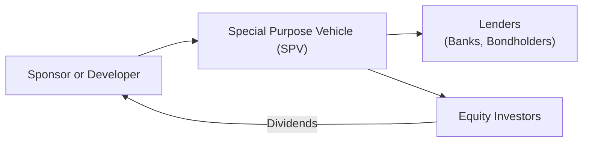
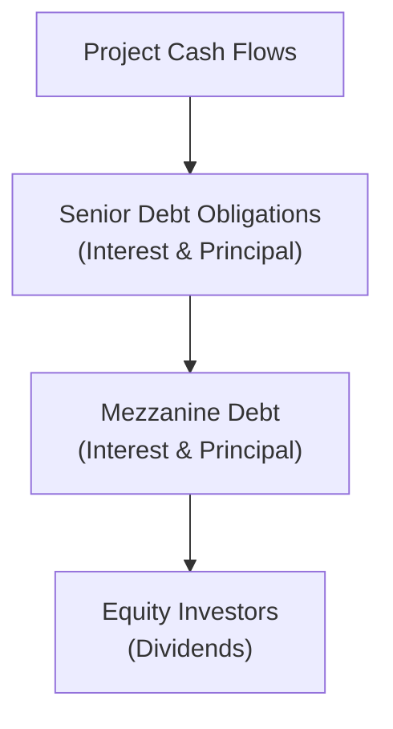

## Introduction

Infrastructure assets often feel like the invisible backbone of our daily lives—think highways, power plants, and bridges. You flip on a light switch, drive across a well-lit bridge, or hop on public transit, usually without a second thought. Yet behind the scenes, these physical structures and networks give rise to unique investment opportunities that can offer stable cash flows, inflation protection, and a distinctive risk-return profile relative to other asset classes.  

One morning, I was stuck in traffic on a privately managed toll road and got a bit grumpy about paying that toll (and not moving very fast!). But then it dawned on me—this road was supporting thousands of vehicles daily, collecting systematic fees, and (theoretically) generating consistent revenue streams for investors. It’s exactly that nature of “essential service provision” that often makes infrastructure so interesting from an investment standpoint.  

Below, we’ll walk through the key features that differentiate infrastructure projects from other private market deals. We’ll explore how these projects are financed, how they are structured, and why it all matters for your portfolio design (and your next CFA exam).  

## Distinguishing Characteristics of Infrastructure Assets

Infrastructure assets stand out for several reasons:

• Long Operational Lifespans: Most infrastructure projects are designed to last decades. Roads, power plants, and water systems can function for 20, 30, or even 50 years before needing significant upgrades. This extended time horizon means predictability of cash flows can be relatively high once an asset is up and running.  

• Essential Services: Because these projects deliver vital functions—think electricity distribution, water supply, or transportation—they frequently benefit from stable demand. Regardless of economic cycles, households generally keep the lights on, flush toilets, and commute to work, which can help protect revenues.  

• Lower Correlation with Equities: Infrastructure returns can have a lower correlation to traditional public equity markets. Prices may move more in response to regulatory and project-specific events than broad market sentiment, though correlation can rise in times of systemic stress.  

• Revenue Structures and Regulation: Many infrastructure projects derive revenue from concession agreements or regulated tariffs. For instance, a water utility might earn a regulated rate of return, while a toll road operator charges a user fee in line with a concession contract. This dynamic can create a reliable (though not risk-free) cash flow stream.  

In the context of your CFA Level III exam, these characteristics might pop up in multi-asset portfolio allocation scenarios or performance evaluation questions. You’ll likely see them in item sets asking how different asset classes behave under certain market conditions.

## Brownfield vs. Greenfield Projects

One key distinction in infrastructure investing is whether a project is considered “Brownfield” or “Greenfield.”

• Brownfield Projects: These involve existing, operational assets that already have a performance history—like a highway that’s been in use for years or an established power generation plant. Because the asset is operational, revenues and risks can be assessed based on actual track records. Construction risk is minimal, and in many cases, the operator has proven performance data to share. Brownfield projects can thus have lower risk and relatively lower return potential compared to Greenfield.  

• Greenfield Projects: These are newly planned or under-construction assets, such as a brand-new toll road or an upcoming desalination plant. Greenfield investments carry higher development risk, including construction delays, cost overruns, and the possibility that user demand might not materialize as expected. But if you’re an investor who can handle that extra uncertainty, the payoff might be higher.  

When you see a question in the exam about differentiating these types of projects, keep an eye out for references to established cash flows (Brownfield) versus uncertain or projected future cash flows (Greenfield). There might also be a discussion of construction loans or bridging finance in Greenfield projects.

## Infrastructure as an Inflation Hedge

Ever notice how tolls, utility tariffs, or municipality fees tend to rise over time? Many infrastructure assets are permitted (or even required) to adjust their charges in line with inflation or other cost indices. For example, a concession agreement for a toll road might tie toll rates to the Consumer Price Index (CPI).  

In an environment of rising inflation, these inflation-linked revenue streams could support real returns, making infrastructure an attractive addition to a diversified portfolio. But don’t assume all infrastructure assets automatically have this inflation pass-through. A detailed reading of any relevant contract or regulatory framework is critical.  

## Key Financing Methods

Because infrastructure projects usually require massive up-front capital and face unique operational risks, there are a few specialized financing routes. The most common methods include public grants, corporate debt, project finance, or a hybrid of these.

### Public Grants and Government Funding

Particularly in socially beneficial, large-scale infrastructure (e.g., highways, public transportation, green energy), governments might directly finance or subsidize part of the project. One reason is the positive externalities—everyone benefits from reliable infrastructure, which might not be built if private capital is deterred by insufficient returns or enormous construction risk.  

But government funding alone often isn’t enough, so private investors step in, especially under public-private partnership (PPP) frameworks. Under a PPP, the public sector might grant concessions or partial funding, with private entities taking on some operational or financial risk in exchange for future revenues.

### Corporate (Sponsor) Debt

Corporate debt, or “on-balance sheet” financing, relies on the company’s overall credit standing. Suppose a large utility company is building a new power plant. If the utility has a high credit rating, it might issue bonds or take out loans based on its corporate balance sheet. This method often offers relatively simpler documentation than project finance and can be cheaper if the sponsor has strong credit.  

However, it also ties the entire company’s credit to the success of the new project. And from an investor’s perspective, you don’t get direct exposure to just that single infrastructure project; you’re effectively lending to the corporate sponsor as a whole.

### Project Finance

Project finance is often the go-to structure for large-scale assets like toll roads or power generation facilities because it isolates the project’s risks and rewards. Lenders rely primarily on the project’s own cash flows and assets for repayment, not on the creditworthiness of the sponsoring firm.  

Practically, project finance involves creating a Special Purpose Vehicle (SPV). This SPV holds the project’s contracts (e.g., equipment purchase agreements, supply agreements, offtake contracts, concession rights). Lenders lend money to the SPV and maintain rights to (and sometimes security over) the project’s revenues and assets. If the project fails, lenders can seize those project assets—but they typically do not have a claim on the sponsor’s other businesses.  

Here’s a simple diagram to illustrate how a project finance structure looks:

• Sponsor or Developer sets up an SPV.  
• SPV issues debt to Lenders and receives equity from equity investors.  
• The project is the sole source of collateral for that debt.  

This structure is widely used in large infrastructure projects because it allocates risk carefully and shields the sponsor’s broader balance sheet.

### Hybrid Financing Structures

In many cases, projects might be financed with a blend of the above methods. For example, a toll road initiative might secure partial funding from government grants (reducing political risk), add a layer of corporate guarantees during construction, and eventually transition to a pure project finance structure once the asset is operational. This approach tries to get the best of all worlds: attract investors with guaranteed completion, limit the sponsor’s corporate credit exposure, and lower the overall cost of capital once the project is up and running.

## Capital Structure in Infrastructure Projects

Once you’ve chosen a financing method, the next consideration is the capital structure. If you think about your typical corporate capital structure, you might see senior debt, then subordinated or mezzanine debt, and finally equity. Infrastructure deals often look similar—but with a twist, given the nature of the underlying asset.  

• Senior Debt: Usually the most secure form of capital in a project’s financing. Senior lenders have a first claim on the project’s cash flows. They’re often banks or bondholders looking for steady, lower-risk returns.  

• Mezzanine Debt: This layer sits between senior debt and equity. It offers a higher yield than senior debt but carries more risk, especially if project performance stalls. Sometimes mezz debt includes equity kickers or warrants to enhance returns.  

• Equity: As the residual claim on the project’s cash flows, equity holders have the highest risk but also the highest potential for capital gain if the project outperforms. Equity is typically held by the project’s sponsors, infrastructure funds, or institutional investors with a long-term horizon.  

Below is a simplified diagram to show how cash might flow to various capital structure layers:

Senior debt gets priority on project cash flow. Then mezzanine debt is serviced. Finally, anything left can be paid out to equity.

The capital structure influences the project’s Weighted Average Cost of Capital (WACC) and the distribution of risk. If the project uses a significant amount of high-yield debt, the overall cost of financing might rise, but less equity is required—potentially boosting returns for the equity slice if everything goes smoothly.

## Syndication Among Multiple Investors

Large-scale infrastructure projects usually require enormous capital outlays—far beyond the appetite or capacity of a single investor. A common solution is syndication, where multiple lenders or equity investors pool resources and share risk.  

For instance, a project finance loan might comprise a group of banks each providing a portion of the total lending. Or an infrastructure fund could co-invest alongside other private equity or pension funds. Syndication not only diversifies risk for each participant but also provides the project with a broader base of backers, which can be helpful if the project needs additional rounds of funding later.  

If you come across exam questions on syndication, they might reference how risk is divided or how loan syndicates handle a borrower’s default.

## Infrastructure Financing Across the Project Life Cycle

Infrastructure financing is seldom static. In early development phases (especially for Greenfield projects), the risk is highest: construction might get delayed, cost overruns might occur, or regulatory approvals might be withdrawn. That’s why early-stage financing frequently relies on equity or subordinated forms of debt, which can handle these uncertainties without triggering a default at the first sign of trouble.  

Once the project is completed and starts generating stable revenues, sponsors can re-optimize the capital structure. They might replace riskier and more expensive equity or mezzanine debt with cheaper senior bonds or loans. Many times, you’ll see a “refinancing” event after a project has an operational track record of, say, 6 to 12 months.  

This evolution can drastically improve the project’s internal rate of return for equity sponsors, who can cash out partially or reduce their cost of capital. From a risk perspective, lenders might find it safer to step in once the project is fully built and generating revenue.

## Current Trends and Innovations

Lately, there’s been a surge in sustainable infrastructure, fueled by green initiatives and commitments to carbon neutrality. This shift has led to interesting evolutions in how projects get financed:

• Green Bonds: These debt instruments are earmarked for climate-friendly or environmental projects, such as renewable energy plants or water conservation systems. The market for green bonds has grown significantly, driven by investor demand for ESG-compliant opportunities.  

• Sustainability-Linked Loans: Borrowers get more favorable loan terms if certain sustainability targets—like reducing carbon emissions or increasing energy efficiency—are met.  

• Blended Finance: Developmental banks or philanthropic organizations “blend” their capital with private investments, effectively derisking projects in emerging markets. A developmental bank might assume the first-loss piece, attracting private funds that otherwise might shy away from volatile regions.  

All these trends emphasize the growing intersection between infrastructure investing and ESG considerations—an area the CFA Institute has placed under the spotlight in the updated curriculum.  

## Best Practices and Common Pitfalls

In real life, we see recurring mistakes. For instance, projects might run into messy stakeholder issues, inadequate environmental impact assessments, or contract disputes with local governments. Understanding these pitfalls can strengthen due diligence processes:

• Overoptimistic Revenue Projections: If toll road usage is projected to be too high, it might lead to unanticipated shortfalls in cash flow and potential defaults.  

• Political and Regulatory Risks: You might find a well-located port that’s a goldmine—until the local government changes regulatory frameworks or decides to take the asset back under state control.  

• Underestimating Maintenance Costs: Infrastructure ages like anything else; ignoring major rehabilitation expenses can derail future cash flow.  

• Poor Contractual Protections: Infrastructure projects live and breathe on contracts—like concession agreements, supply deals, or offtake contracts. If one party can exit too easily, the project investors could be left holding the bag.  

Focus on robust feasibility studies, thorough contractual arrangements, sensitivity analyses for demand and operating costs, and a stable legal environment. These are baseline requirements for success.

## Conclusion and Exam Relevance

Infrastructure investing can offer stable, inflation-protected returns, diversification benefits, and a chance to make a tangible impact (nobody can deny the real-world relevance of new roads or clean energy plants). But these deals aren’t bulletproof; they carry unique risks—particularly in the early development phase and when dependent on shifting regulatory frameworks.  

On the exam, you might see scenario-based questions about an investment committee deciding between a Brownfield or Greenfield project, or a case highlighting a project finance structure with complex capital layering. Make sure you’re comfortable with the differences between corporate debt and project finance, how to assess the capital structure, and the role that syndication plays. If a question references inflation hedging or stable return streams, you’ll likely need to draw on these infrastructure concepts.

## Final Exam Tips

• Practice With Project Finance Scenarios: Get comfortable identifying different layers of the capital structure. A question might require you to distinguish senior and mezzanine claims.  
• Know the Regulatory and Concession Agreements: Learn to identify key variables that drive stable cash flow—like locked-in offtake prices, regulated tariffs, or inflation-indexed tolls.  
• Study Real Cases: While hypothetical, exam items often mirror real deals. Try practicing with infrastructure case studies for an intuitive grasp of risk management.  
• Time Management: Infrastructure financing exam questions can be detailed, especially if it’s a constructed-response format. Outline your answers quickly to stay on track.  
• Keep Definitions at Hand: Terms like “Brownfield,” “Greenfield,” “concession,” and “syndication” might all appear in the same question. Knowing them cold saves time.  

## References, Further Reading, and Resources

• Weber, B., & Alfen, H. W. (2016). “Infrastructure as an Asset Class: Investment Strategy, Project Finance and PPP.” Wiley.  
• World Bank Group’s “Private Participation in Infrastructure (PPI)” Database and Resources: https://ppi.worldbank.org  
• Moody’s and S&P Reports on Project Finance and Infrastructure Credit Risks.  
• Preqin’s “Global Infrastructure Report” for comprehensive data and market trends.  

## Test Your Knowledge: Infrastructure Investment and Financing Methods



### Which of the following best describes a Brownfield infrastructure project?

- [ ] A newly planned rail network in an emerging economy.
- [x] An existing power plant with an established operational record.
- [ ] A toll road still in construction that has no revenue history.
- [ ] A wind farm under development that has not received regulatory approval.

> **Explanation:** Brownfield projects refer to existing, operational infrastructure with a performance track record. By contrast, Greenfield projects are still in the planning or construction phase.

### Which statement most accurately distinguishes corporate debt financing from project finance in infrastructure?

- [x] Corporate debt relies on the sponsor’s overall balance sheet, while project finance looks mainly to the asset’s own cash flows and collateral.
- [ ] Corporate debt is only issued in the bond markets, whereas project finance takes place exclusively through bank loans.
- [ ] Project finance typically carries a lower interest rate than corporate debt for the same project.
- [ ] Corporate debt has no risk due to full government backing, while project finance is risk-free thanks to concession agreements.

> **Explanation:** Project finance is an asset-based structure in which lenders rely on the project’s revenues, while corporate debt depends on the sponsor’s broader creditworthiness.

### What is the primary reason infrastructure investments are often described as inflation hedges?

- [ ] Their value never decreases, regardless of economic conditions.
- [x] Many infrastructure services are regulated or concession-based, with revenues linked to inflation.
- [ ] Governments always subsidize infrastructure projects.
- [ ] Infrastructure equity is unaffected by interest rate changes.

> **Explanation:** Toll roads and utilities frequently adjust fees with inflation, providing an embedded inflation hedge in their revenue models.

### In a typical project finance structure, which entity is most likely responsible for paying back the project debt?

- [ ] The corporate sponsor’s parent company.
- [ ] A government agency guaranteeing the project.
- [ ] A syndicate of banks underwriting the project bond.
- [x] The Special Purpose Vehicle (SPV) established for the project.

> **Explanation:** Under project finance, the SPV that holds the project’s cash flows is directly responsible for repaying the debt.  

### Which layer of capital in an infrastructure project typically bears the highest risk but has the greatest potential return?

- [ ] Senior debt
- [ ] Mezzanine debt
- [x] Equity
- [ ] Refinancing tranche

> **Explanation:** Equity sits below all the other layers, getting paid last. While it has the greatest risk, it could hold the highest potential upside.

### A Greenfield infrastructure project may need greater reliance on equity in its early stages primarily because:

- [x] Construction risk is higher, and lenders typically require an equity cushion.
- [ ] The government restricts the use of debt for new development.
- [ ] All large infrastructure projects must be 100% equity financed.
- [ ] Sponsors dislike lower-cost debt financing.

> **Explanation:** Lenders are more hesitant to provide debt to projects with high uncertainty, so equity helps absorb potential construction or operational risks initially.

### Which of the following financing strategies best characterizes a “hybrid” infrastructure financing approach?

- [ ] Issuing only high-yield bonds to cover construction costs.
- [x] Combining public subsidies, corporate guarantees during construction, and eventual project finance upon completion.
- [ ] Depending solely on philanthropic grants for an entire toll road project.
- [ ] Mixing syndicated loans with equity from the same single investor.

> **Explanation:** Hybrid financing often involves multiple sources and structures—such as using government grants and corporate guarantees early on, then shifting to stand-alone project finance after completion.

### When an infrastructure loan is “syndicated,” what is the primary benefit for participating lenders?

- [ ] They become the equity owners of the project.
- [ ] They are exempt from all regulatory requirements.
- [x] They share both the risk and the funding burden with other lenders.
- [ ] They set a single, unified interest rate below the market average.

> **Explanation:** Syndication allows multiple lenders to share risk, making high-financing needs more manageable.

### What is the main goal of sustainability-linked loans (SLLs) in infrastructure financing?

- [ ] To completely replace traditional project finance structures.
- [ ] To eliminate the need for equity in large-scale projects.
- [x] To incentivize borrowers to meet specific ESG targets in exchange for favorable terms.
- [ ] To finance only projects that have no environmental impact.

> **Explanation:** SLLs reduce lending costs if the project meets certain sustainability milestones, aligning financial and ESG objectives.

### True or False: Brownfield infrastructure projects carry significantly higher construction risk compared to Greenfield projects.

- [x] True
- [ ] False

> **Explanation:** Actually, the statement is incorrect as written, but let’s clarify: Brownfield projects typically have lower construction risk because they are already operational. The question claims Brownfield has “significantly higher construction risk,” which contradicts the usual understanding. So the best choice here—given the statement as is—would be to mark it as false. However, the quiz format requires a check for the correct statement. The correct is “False” because Brownfield has lower construction risk.  


