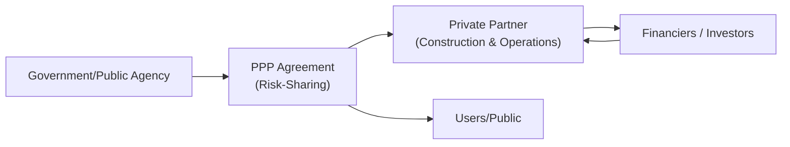
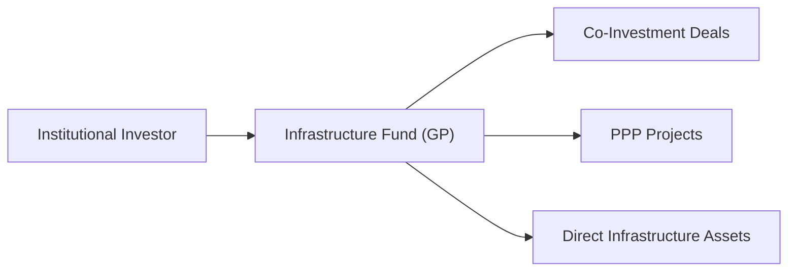

## Infrastructure Investment Vehicles

When you think about investing in infrastructure, it’s easy to picture roads, power lines, and airports quietly chugging along in the background, providing essential services we rely on every day. Well, it turns out there are multiple ways to gain exposure to these robust, cash-generating assets. Some of them require rolling up your sleeves and digging deep—both financially and operationally—while others provide a more “hands-off,” diversified approach. Let’s walk through them together.

### Direct Investments in Infrastructure

Direct investment essentially means buying a piece (or all) of an infrastructure asset outright. Imagine a pension plan owning 40% of a major toll road or a large institutional investor picking up a renewable-energy installation project. That’s direct.

• Benefits:  
  – Control is the big one. Because you hold a direct stake, you can influence key decisions, from setting toll rates to choosing an operator or maintenance partner.  
  – Potential for stable, long-term cash flows that often have an inflation linkage.  
  – Opportunity to apply your insight and management strategies to enhance operational efficiencies and returns.

• Drawbacks:  
  – Capital intensity is significant. Infrastructure assets can easily cost hundreds of millions or more, so the barriers to entry are not trivial.  
  – Operational complexity: If you directly own an asset, you can’t just kick back and expect the highway to maintain itself. Operating staff, maintenance schedules, and sometimes government or community relations demand specialized expertise.  
  – Concentration risks: Owning one or two large assets can leave you exposed to local regulatory changes or unexpected economic shocks that might hit that region’s entire infrastructure network.

So, if you have the capital and the know-how, direct investments offer a compelling route to shape the destiny of an asset. But if the thought of managing everything—cost overruns, regulatory approvals, community feedback—makes you sweat, you might look to other vehicles.

### Private Infrastructure Funds

For investors who prefer more diversification, or simply lack the capacity to manage assets directly, private infrastructure funds can be a good alternative. These typically come in two main flavors—closed-end and open-end (often known as “evergreen”)—plus variations on those themes.

#### Closed-End Funds

Closed-end funds are often set up with a finite life span, say 10 to 15 years. The fund will raise capital once (commonly through capital commitments from limited partners, or LPs), deploy that capital in infrastructure projects during its “investment period,” manage and hopefully improve the assets, and eventually exit. When the fund is wound up, proceeds flow back to the investors.

• Benefits:  
  – Defined timeline for returning investor capital.  
  – Potential for a “vintage” effect, where you can measure performance relative to other funds launched at the same time.  
  – Access to a specialized manager’s expertise.  

• Drawbacks:  
  – Typically charge higher fees, and more elaborate structures might also include carried interest for the general partner (GP).  
  – Likely to have capital calls at various points, which means you have to plan liquidity carefully.  
  – The fund eventually exits assets, so if you want very long-term holdings, you might not get that.

One friend of mine invested in a closed-end fund that targeted emerging-market roads and hyper local utilities. It sounded appealing, but each new capital call arrived at really awkward times, forcing them to juggle their liquidity. That’s just part of the game when you deal with closed-end structures.

#### Open-End Funds

Open-end infrastructure funds operate a bit differently. They typically accept new contributions and permit redemptions on an ongoing basis, subject to certain restrictions. Because infrastructure assets often have long useful lives, these kinds of funds treat them as perpetual holdings—no forced “sell-by date,” effectively.

• Benefits:  
  – Long-term exposure aligns nicely with the multi-decade life cycle of many infrastructure projects.  
  – Reduced pressure to exit an asset prematurely just to close the fund.  
  – Potentially smoother returns, as the fund is regularly valued.

• Drawbacks:  
  – Sometimes can be less transparent on performance.  
  – Redemption terms might be strict, and in times of stress, you might face gating or delayed payouts.  
  – Ongoing management fees can add up over time.

### Listed Infrastructure Vehicles

For folks looking to trade in and out more easily, or who may not have the minimum commitments for private funds, listed infrastructure vehicles can fill that gap. These can be publicly traded stocks of companies that own or operate infrastructure (think utilities, pipelines, or toll road operators), or even ETFs dedicated to the sector.

• Benefits:  
  – Liquidity: You can buy or sell shares any time the market is open.  
  – Low barriers to entry, as you can invest with even modest amounts of capital.  
  – Transparency, with publicly available financial statements, analyst coverage, etc.

• Drawbacks:  
  – Market volatility: Listed infrastructure tends to move with broader equity markets, sometimes overshadowing the stable, long-term nature you might be expecting from infrastructure.  
  – Tends to have a higher correlation to general stock market performance, which reduces diversification benefits.

It’s a similar situation to owning a real estate investment trust (REIT) versus directly owning property. Listed vehicles are easier to liquidate but can experience more dramatic share price fluctuations.

### Co-Investment Opportunities

Sometimes, you can co-invest alongside a GP in a particular infrastructure project. This arrangement allows limited partners to participate directly in a specific deal, typically with lower or no additional fees beyond the fund’s structure.

• Benefits:  
  – Better fee deals: Co-investments are often done at reduced or zero incremental management fees or carried interest.  
  – Targeted exposure: You can pick and choose specific assets you find appealing.  

• Drawbacks:  
  – Limited availability: You typically need to be a large institutional LP with a good relationship to the GP.  
  – Additional complexity: The investor must still conduct due diligence, keep tabs on the project, and figure out how it fits with the rest of their portfolio.

Co-investments can be a sweet spot for large pensions or sovereign wealth funds that have some in-house infrastructure capability but still want the GP’s deal flow.

### Public‑Private Partnerships (PPP or P3)

Now we arrive at one of the most significant vehicles in the infrastructure space—Public‑Private Partnerships (PPPs or simply P3s). They’re often in the headlines when governments make big announcements of new highways, schools, or hospitals “in partnership with the private sector.” But what exactly goes on in these deals?

Simply put, a PPP is a contractual agreement where a public entity (for example, a government department, municipality, or transit authority) partners with private investors and operators. The private partner typically takes on the responsibility to finance, build, and/or operate a project, and in return they receive compensation through user fees, availability payments, or a combination of both.

• Structure and Risk Allocation:  
  – The aim is to shift certain risks (construction, operational, technological) from the public sector to the private sector, which presumably can handle them more efficiently.  
  – In exchange, the private entity obtains a steady revenue stream—perhaps from tolls or from a “shadow” payment arrangement if it meets performance criteria (like maintaining a road at a certain standard).

• Why PPPs?  
  – Funding Gaps: Governments worldwide have budget constraints, so PPPs let them tap private capital to grow critical infrastructure.  
  – Technological Expertise: Private companies might have specialized construction techniques or operational know-how.  
  – Efficiency Gains: The private partner is incentivized to keep costs in check and meet agreed performance benchmarks.

• Real-World Variation:  
  – PPP structures can be very different depending on local laws. Some jurisdictions let private partners own the asset for a set period, while others just lease it out, or only handle operations.  
  – In certain deals, the private partner takes on demand risk (e.g., how many cars use a toll road) while in others, the government commits to a minimum revenue guarantee.

• Governance Challenges:  
  – Stakeholder alignment is crucial. The public’s interest must be protected—nobody wants to see essential roadways or water services become prohibitively expensive.  
  – Maintenance obligations sometimes get overlooked if the contract is poorly structured. If you’ve ever driven on a toll road riddled with potholes, you might suspect a PPP that lacked strict oversight.  
  – Public accountability: PPP deals, especially if they go sour, can spark controversy around government processes, private profits, and the public good.

#### Example of PPP Flow

Let’s visualize a basic PPP arrangement:

• The public agency enters into a contract with a private partner.  
• The private partner secures financing from banks or equity investors.  
• Users pay tolls or fees (or the government pays an availability payment), and these revenues go back to the investors/operators.  
• Risk is allocated among all parties depending on the specifics of the contract.

### Jurisdictional Differences in PPPs

PPPs take all shapes and sizes. Some countries have well-established frameworks that standardize PPP contract terms. Others operate on a case-by-case basis, meaning each deal might look entirely unique. As an investor, it’s crucial to understand the legal and political context:  
– Length of contracts (say, 20 to 40 years).  
– Potential for renegotiation (common if the project’s conditions change significantly).  
– Dispute resolution mechanisms, ideally spelled out in contracts to avoid costly litigation.

### Governance, Maintenance, and Other Considerations

Well-structured PPPs attempt to integrate maintenance obligations right from the start. The private partner commits to maintaining the asset at prescribed quality standards. This push for long-term accountability is often touted as a core advantage of PPPs over traditional design-bid-build procurement, where once a contractor hands the project over, the government is responsible for everything.

But oh boy, if the contract is murky or the oversight is weak, you can find yourself with a poorly maintained asset—leading to increased user dissatisfaction and possibly additional government expenditures down the road. PPP governance gets tricky precisely because it brings multiple stakeholders (government agencies, private sponsors, lenders, and the general public) under one roof.

### Best Practices and Pitfalls

• Best practices:  
  – Align incentives so the private partner benefits from meeting or exceeding service standards.  
  – Conduct robust due diligence: Don’t skip steps in evaluating the project’s viability and your partner’s track record.  
  – Plan an eventual exit strategy or handover: Many PPP agreements specify what happens at the end of the contract term.  
  – Engage with the community early to minimize political or local opposition.

• Common pitfalls:  
  – Underestimating demand risk (e.g., building a toll road that ends up underutilized).  
  – Overly optimistic cost assumptions, leading to cost overruns.  
  – Misaligned stakeholder interests.  
  – Weak regulatory environment that fails to hold partners accountable.

### Infrastructure Vehicles in Broader Portfolio Context

Investing in infrastructure, whether through direct ownership, private funds, co-investments, or PPPs, can be a useful way to capture stable cash flows with inflation-hedging characteristics. But you’ll want to remember how the investment’s correlations, liquidity, and risk profile fit into your broader portfolio. For instance, a direct investment in a toll road might be very illiquid—making it a permanent or long-range fixture in your asset allocation. Meanwhile, a listed fund has daily liquidity but can result in price swings that resemble broader equities, reducing its overall portfolio diversification advantage.

Here’s a simplified flow of how an investor’s capital might move into an infrastructure fund, which in turn invests in multiple projects including PPPs, co-investments, and direct ownership stakes:

All roads lead, in one way or another, to real infrastructural economic activity, from airports to water treatment facilities to data centers (yes, digital infrastructure also counts these days!).

### Conclusion and Exam Tips

Infrastructure investments can add reliable, inflation-protected returns to a diversified portfolio, but the route you choose—direct, via funds, listed, or through PPPs—significantly affects your costs, required expertise, liquidity, and governance responsibilities.  
• For the CFA exam, be ready to discuss how these different vehicles relate to strategic asset allocation and risk management.  
• Understand the trade-offs in terms of fees, transparency, and control.  
• Familiarize yourself with how PPP structures shift risk between the public sector and private sector.  
• Common pitfalls in exam questions often revolve around incorrectly stating which party bears certain risks in a PPP or mischaracterizing the liquidity and correlation differences between private funds versus listed vehicles.  
• Timewise, in a scenario-based prompt, look for explicit mention of the investor’s horizon, liquidity needs, and governance capacity—these clues generally guide you toward the right vehicle.

Keep in mind that infrastructure rarely behaves like a “market roller coaster”—it’s more about steady, methodical returns, overshadowed occasionally by big regulatory or economic disruptions. On your exam day, you might see a question about how a particular infrastructure project fits into a pension fund’s liability-driven investment strategy. Or maybe they’ll ask about risk transfer in a PPP deal. Either way, grounding your answers in these practical distinctions will serve you well.

## References, Further Reading, and Resources

• World Bank’s “Public-Private Partnership Legal Resource Center”:  
  https://ppp.worldbank.org/public-private-partnership/  

• OECD’s “Governance of Infrastructure” publications.  

• Hoffmann, W. (2020). “Infrastructure Investing: Managing Risks & Rewards for Pension Funds.” OECD Working Papers.  

• Macquarie Infrastructure and Real Assets (MIRA) research and publications.

## Mastering Infrastructure Investment Vehicles: Practice Questions



### In which scenario does an investor typically have the most operational control over the infrastructure asset?

- [ ] Investing indirectly through a listed infrastructure ETF
- [x] Making a direct investment in the actual asset
- [ ] Participating in a co-investment via a fund
- [ ] Placing capital in an open-end infrastructure fund

> **Explanation:** Direct ownership grants investors maximum operational control, including decision-making about operations, maintenance, and strategic initiatives. Funds typically centralize these decisions under the GP.

### Which statement best describes a characteristic of closed-end infrastructure funds?

- [ ] They have an indefinite investment horizon.
- [x] They have a finite life span and often return capital to investors at the end.
- [ ] They require daily investor liquidity.
- [ ] They cannot call capital from limited partners.

> **Explanation:** Closed-end infrastructure funds typically have a set term (e.g., 10–15 years), after which the fund sells assets and returns proceeds to investors.

### Which is most likely NOT a direct benefit of investing via listed infrastructure vehicles?

- [ ] Access to analyst coverage and public filings.
- [x] Immunity to broad market volatility.
- [ ] Lower capital commitments relative to direct ownership.
- [ ] Liquidity for buying or selling shares more readily.

> **Explanation:** Listed infrastructure vehicles can still experience price fluctuations tied to the broader stock market, so they are not immune to broad equity market volatility.

### How do co-investments typically benefit limited partners?

- [x] Co-investments often offer reduced or no additional management fees.
- [ ] Co-investments include mandatory daily liquidity.
- [ ] Co-investments are available to all retail investors.
- [ ] Co-investments eliminate large capital requirements.

> **Explanation:** Co-investments usually involve lower or no additional fees, making them cost-effective. However, they are generally only accessible to larger or more sophisticated investors and do not guarantee any particular liquidity profile.

### In a typical Public‑Private Partnership (PPP), which party most commonly bears the construction risk?

- [ ] The general public
- [x] The private partner or consortium
- [ ] Regulatory authorities
- [ ] Underwriters

> **Explanation:** Under most PPP arrangements, construction risk is shifted to the private sector, which is responsible for completing the asset on time and on budget.

### Which of the following is a major potential advantage of an open-end infrastructure fund compared to a closed-end fund?

- [ ] Defined exit date ensures timely return of capital.
- [x] Ongoing capital contributions and redemptions better align with long-term assets.
- [ ] No possibility of redemption if the market becomes illiquid.
- [ ] Typically lower valuation transparency.

> **Explanation:** Open-end structures allow investors to enter or exit the fund more flexibly, aligning nicely with infrastructure’s long operational lifespan.

### How might a government entity compensate a private partner in a PPP without exposing the partner to demand risk?

- [x] Using availability payments based on meeting service standards.
- [ ] Tying compensation purely to user volume.
- [x] Combining a floor on revenue with a usage-based toll system.
- [ ] Allowing the private partner to keep all toll revenues with no minimum guarantee.

> **Explanation:** Availability payments or guaranteed minimum payments reduce demand risk by paying the private operator as long as performance metrics are met, regardless of actual usage levels. A combination of a revenue floor and toll-based income is another way to mitigate demand risk.

### Which factor often leads listed infrastructure vehicles to have higher correlation with equity markets compared to private ownership?

- [x] They are traded on public stock exchanges.
- [ ] They pay no dividends to investors.
- [ ] Their fees align more closely with private funds.
- [ ] They usually have very long lockup periods.

> **Explanation:** Being listed on public markets subjects these vehicles to daily share price volatility and broader market sentiment, leading to greater correlation with equity markets.

### Which is a key governance challenge in Public‑Private Partnerships?

- [x] Aligning private ROI goals with the public interest.
- [ ] Requiring no maintenance standards during the concession period.
- [ ] Eliminating the private sector’s involvement in risk management.
- [ ] Completely distributing all capital calls on Day 1.

> **Explanation:** PPPs must balance private investors’ desire for returns with public accountability and service-quality metrics. This is a uniquely delicate governance issue.

### True or False: One typical advantage of PPPs is that they can leverage private sector expertise and risk management, enabling the public sector to conserve capital for other priorities.

- [x] True
- [ ] False

> **Explanation:** PPPs allow governments to harness private capabilities in financing, project management, and innovation, potentially preserving public funds for other uses.


