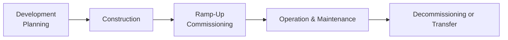

## Overview of the Infrastructure Project Life Cycle

When we talk about infrastructure—roads, bridges, tunnels, airports, solar farms, you name it—we’re talking about projects that often span decades. Sometimes, it feels like this massive timeline can swallow up the unprepared investor or sponsor. So understanding that timeline and the different financing structures used at each phase isn’t just academic filler—it can make or break the success of a project. Let’s break down those phases and see how the type of financing (and its availability) shifts with the inherent risks at each step.

Below is a simple graphic illustrating the common project stages in the infrastructure world:

Notice how the project tends to move left to right. Each stage demands a different approach to capital structure. In the early days, you’ve got real uncertainty about permitting, design, budget, or whether the project will actually get built in a timely manner. As you progress into the operating phase, risk subsides (usually) and that changes the picture for who’s willing to lend money—and at what terms.

## Development and Planning

In the Development and Planning phase, the initiative is still more of a vision. The project team is busy securing land rights, environmental clearances, regulatory approvals, feasibility studies, and cost estimates. This stage can be very expensive and can take a long time. Frankly, it can be nerve-wracking because early investors must believe in an unbuilt project.

• Risk Profile: Extremely high. There is no tangible asset yet—just a plan and maybe some feasibility studies.  
• Access to Financing: Typically reliant on equity or sponsor capital. Banks aren’t exactly jumping over themselves to provide large-scale, long-term debt if the project might not get off the ground.  
• Equity-Focused Capital Structure: At this point, you might not even see formal long-term financial instruments. Promoters, developers, or specialized funds often use their own capital or short-term bridge financing with high interest rates.  

It’s a bit like if you were building your dream house on a piece of land you haven’t fully purchased. Lenders want visible collateral and proven stability before they commit. So the project sponsors—or maybe a specialized private equity–style infrastructure fund—are usually the ones putting up the first chunk of cash. I recall a sponsor telling me once how their biggest worry wasn’t actually raising money in the operational phase; it was surviving the turbulence of these early days.

## Construction Phase

Once the project is more certain (for example, key permits are in place), the next big step is Construction. This is often the most capital-intensive phase, as you need land preparation, materials, and contractors to bring this vision to life.

• Risk Profile: Fairly high. You can face cost overruns, delays, labor disputes, natural disasters, or supply chain issues.  
• Equity vs. Debt: Still heavily reliant on equity or subordinated debt (with higher interest rates) because of construction risk. However, some forms of senior debt become possible if sponsors provide guarantees or completion support.  
• Mitigating Techniques: Sponsor guarantees (promises to cover cost overruns) or performance bonds from contractors can help lenders feel more comfortable. Insurance policies might also protect against construction risk.

Picture a massive toll bridge going up. If it’s 60% complete and you suddenly discover soil issues or structural design flaws, you might need another injection of capital—fast. Debt providers will only want to stick around if they’re comfortable that equity sponsors can plug these holes. That’s why banks typically demand robust completion support, including contingency accounts, so they can reduce the chance of default.

## Ramp-Up and Commissioning

Once construction nears completion, the project transitions into Ramp-Up or Commissioning. This is the final stretch before it’s fully operational—when systems are tested, workforce is trained, and pilots or partial operations commence. It’s a time of excitement but also potential hiccups.

• Risk Profile: Medium. Most large-scale cost uncertainty is behind you, but operational glitches or performance shortfalls can pop up.  
• Financing Changes: More lenders are willing to come on board at this point because the project is almost functional. Debt providers might refinance short-term or construction loans into longer-term facilities with more favorable terms.  
• Typical Arrangements: If revenue streams (e.g., tolls, usage fees, power purchase agreements) are set to begin, the project may secure better interest rates by demonstrating guaranteed or forecastable cash flows.  

A practical example is a new solar farm hooking up to the grid for the first time. It might have a 20-year power purchase agreement (PPA) with a utility. During the ramp-up, the sponsor can show lenders: “Look, we have a contract that ensures revenue for the next 20 years.” That’s music to a lender’s ears, opening the door for a more ideal debt structure.

## Operation and Maintenance

Now we get to the Operation & Maintenance (O&M) phase—some might say the “calmer” part of the project’s life cycle, though it always depends. Revenues (ideally) are coming in steadily, and the main tasks revolve around routine maintenance, meeting regulatory standards, and ensuring that toll booths, turbines, or pipelines function well.

• Risk Profile: Lower. The biggest unknowns (e.g., cost overruns) are in the rearview mirror. But operational risk and market demand risk remain.  
• Debt vs. Equity Mix: With stable cash flows, debt becomes a highly attractive component. Lenders will typically offer more favorable interest rates. Projects might adopt a higher leverage ratio, letting sponsors refinance equity or realize gains by selling part of their stake to new investors.  
• Sculpted Debt Repayment: This is also prime time for introducing or refining a technique known as sculpted debt repayment, which matches the project’s expected cash flow to its loan amortization schedule.

Sculpted repayment is a popular strategy in project finance because it reduces default risk by lining up the required principal payments with the times when the project is flush with cash. Think of it like adjusting your personal loan payments so they’re smaller during lower-income months and larger when you get a bonus.

## Decommissioning or Transfer

Finally, we have Decommissioning or Transfer. This is relevant when a project has a predefined concession period (like a 30-year toll road concession) or a finite life (like a wind farm that might become obsolete).

• Risk Profile: Varies. Sometimes, the risk is not about generating revenue anymore, but about disposing of assets or handing them over.  
• Financing Transitions: By now, most or all project debt should be repaid. If not, lenders will need to ensure the project’s residual life is enough to pay off any remaining balances.  
• Equity Considerations: Sponsors might prefer to exit well before this stage, selling to “core” infrastructure funds that focus on stable, late-stage assets.  

In many contracts, you’ll hear about “hand-back” requirements, ensuring the asset is in suitable condition when returning it to the government or new owner. The financing around this is mostly about ensuring no final balloon payments remain that could jeopardize a smooth exit.

## Debt vs. Equity Over the Life Cycle

The interplay between debt and equity in infrastructure is dynamic. Early in the project, equity takes the brunt of risk. After all, no sponsor wants to load up on large debt obligations when the project’s feasibility is still uncertain. But once you see steady cash flows, employing more debt can help sponsors optimize their return on equity (ROE).

A simplified version of the capital structure shift might look like this:

• Development and Construction Stages: Higher equity or sponsor funding, possibly some mezzanine or subordinated debt. The cost of capital is higher because nobody is sure the project will pan out.  
• Operation Stage: Higher proportion of senior debt thanks to stable, transparent revenue streams. Some sponsors might even restructure or replace early-phase debt at this point, lowering overall financing costs and possibly freeing up equity.

## Sculpted Debt Repayment

A favorite term in project finance is “sculpted debt repayment.” This basically means that instead of a standard, equal principal repayment schedule (like paying the same monthly mortgage bill on your house), the project schedules debt repayment to match the anticipated cash flow. When the project’s revenue is lower in the early years, the debt service might be correspondingly lower. Then, as the project matures and presumably generates stronger cash flows, the repayment amounts increase. 

Here’s a simple conceptual diagram to illustrate (Figure is hypothetical, representing how Project Cash Flow lines up with Debt Service):

• Years 1–3: Modest revenue → smaller debt service.  
• Years 4–10: Growing revenue → rising debt service.  
• Years 11–15: Peak revenue → largest debt service.  

That technique helps reduce default risk early on and usually secures more stable coverage ratios from the lender’s viewpoint over the entire life of the loan.

## Rate Structures and Hedging

Infrastructure loans can be fixed-rate or floating-rate. Fixed-rate debt offers predictability (no big swings if rates rise), but might carry a higher initial interest cost. Floating-rate debt can be cheaper initially—especially in a low-interest environment—but comes with the risk that future rates might jump. 

Projects might hedge by using interest rate swaps or caps, so you might see sponsors say, “We’ll take floating-rate debt but lock in a maximum rate we’ll pay.” The decision depends a lot on the market environment, the sponsor’s risk appetite, and the nature of the project’s cash flows. For example, if the project collects user fees that are somewhat inflation-linked, a floating rate might not be a big deal. But if there’s a fixed tariff, a spiking LIBOR or SOFR (depending on the region) could ruin the project’s economics.

## Weighted Average Cost of Capital (WACC)

A project’s WACC is simply the weighted sum of the returns demanded by each source of capital (equity, debt, etc.). In formula form:

$$
WACC = \left(\frac{E}{V}\right) R_e + \left(\frac{D}{V}\right) R_d (1 - T)
$$

where:  
• \\( E \\) is the market value of equity,  
• \\( D \\) is the market value of debt,  
• \\( V = E + D \\),  
• \\( R_e \\) is the required rate of return on equity,  
• \\( R_d \\) is the required rate of return on debt, and  
• \\( T \\) is the corporate tax rate.  

When a project is in its early high-risk phase, \\( R_e \\) is higher. Hence, WACC is higher. But as the project transitions into operation with stable visibility, the share of cheaper debt can increase, bringing WACC down. A lower WACC supports a higher project valuation (all else being equal) because the expected future cash flows are discounted at a lower discount rate. That’s often the sweet spot for sponsors looking to sell or refinance.

## Sponsor Guarantees, Insurance, and Completion Support

During construction and early-stage phases, lenders often demand additional support. This might include:  
• Sponsor Guarantees: If the project’s costs exceed original estimates, the sponsor must inject more equity or cover the overruns.  
• Insurance: Coverage against force majeure, property damage, or contractor default.  
• Completion Support: A promise that the sponsor will get the project up and running to an agreed standard, on time, or face penalties.  

These instruments have direct implications for financing terms. A robust completion support package can open the door to lower debt spreads because lenders see less risk. Similarly, if major sponsors with strong balance sheets are heavily involved, banks feel more comfortable offering larger loans at better rates.

## Exit Strategies

Infrastructure projects can accommodate a variety of exit or partial-exit strategies:  
• Sale to a Long-Term Investor: Often infrastructure funds or pension funds that want steady cash flows with moderate returns.  
• Recapitalization: The sponsor refinances the project’s debt or sells a portion of equity once operational, locking in gains while remaining part-owner.  
• Public Listing: In rare cases, a stable project may become part of an infrastructure IPO or a publicly traded vehicle.  
• Transfer: Hand the asset back to the government or a new operator if operating under a Build-Operate-Transfer (BOT) or similar contract.

I once witnessed a toll road project that was sold to a pension fund mere months after reaching steady state—and at a massive premium to cost, because the new buyer just wanted a predictable, inflation-linked cash flow for 30 years. 

## Practical Advice for the Exam

• Calculate WACC carefully, especially in scenario-based questions where the project’s capital structure changes post-construction.  
• Don’t forget about sculpted debt repayment in questions related to project finance cash flows—be ready to show how this reduces default risk and matches the project’s revenue pattern.  
• Pay close attention to how sponsor guarantees and completion support can shift the risk for lenders and thus impact required returns.  
• Remember that different phases have different risk-return profiles; exam questions may focus on which type of capital is more appropriate in each phase.  
• Watch out for interest rate risk hedging strategies and know how to discuss a project’s rationale for choosing fixed vs. floating-rate debt.  

Avoid pitfalls such as ignoring sponsor credit strength, mixing up operational risk with construction risk, or forgetting that some infrastructure is regulated differently in different jurisdictions (though for exam purposes, analyses tend to be fairly general). Time management is key on exam day: practice walking through a typical project finance timeline and be ready to apply these concepts in a multi-part question.

## References and Further Reading

• Ehlers, T. (2014). “Understanding the Challenges for Infrastructure Finance.” Bank for International Settlements.  
• CFA Institute: “Project Finance and Infrastructure Investment” continuing education materials.  
• Esty, B. (2020). “Modern Project Finance: A Casebook.” Harvard Business Publishing.  

## Test Your Knowledge: Project Life Cycle Financing and Risk Management



### If a sponsor is seeking funds during the Development/Planning stage, which form of capital is typically most accessible?

- [ ] Senior long-term debt
- [x] Equity or sponsor capital
- [ ] Fixed-rate bond issuance
- [ ] Fully collateralized bank loans

> **Explanation:** The Development/Planning stage is high risk, so equity or sponsor capital is usually the primary source of financing.

### Which risk typically decreases the most after a project moves from Construction to the Ramp-Up/Commissioning phase?

- [ ] Regulatory risk
- [ ] Sponsor risk
- [x] Cost overrun risk
- [ ] Macroeconomic risk

> **Explanation:** Most cost overruns occur during construction. Once construction is complete, the risk of escalated material or labor costs is lower.

### A sculpted debt repayment schedule is primarily designed to:

- [ ] Match anticipated future cash flows
- [ ] Repay interest before principal
- [ ] Repay principal before interest
- [x] Reduce the Weighted Average Cost of Capital

> **Explanation:** Actually, it’s designed to match anticipated future cash flows AND reduce default risk. However, by smoothing payments, it can indirectly help manage financing costs and thus lower the overall cost of capital.

### Which of the following typically suggests using more debt financing in the Operation & Maintenance phase?

- [ ] Absence of a sponsor guarantee
- [ ] Volatile project cash flows
- [x] Predictable revenue streams
- [ ] High remaining construction risk

> **Explanation:** Once the project stabilizes with dependable revenues, lenders are more comfortable extending debt at better terms.

### In many project finance structures, sponsor guarantees during construction aim to mitigate:

- [ ] Changes in interest rates
- [x] Cost overruns and delays
- [ ] Fluctuations in commodity prices
- [ ] Currency exchange rate fluctuations

> **Explanation:** Sponsor guarantees often specifically cover budget and timing shortfalls during construction, which helps secure lender confidence.

### Which statement about the Weighted Average Cost of Capital (WACC) in infrastructure projects is correct?

- [x] WACC generally decreases once operating cash flows become stable
- [ ] WACC remains constant throughout the project lifecycle
- [ ] WACC is independent of changes in capital structure
- [ ] WACC is irrelevant once the project is fully operational

> **Explanation:** Projects become safer and can tap more senior debt, usually lowering the WACC.

### A project company has a floating-rate loan. Which strategy is commonly used to address interest rate exposure?

- [x] Interest rate swap or cap
- [ ] Sponsor guarantees
- [x] Equity infusion
- [ ] Full prepayment in early years

> **Explanation:** An interest rate swap or cap is a typical hedging strategy. (Note: “Equity infusion” is not inherently an interest rate risk hedge, but can reduce leverage.)

### What is one reason lenders might prefer a sculpted debt service schedule?

- [ ] It maximizes total interest paid
- [x] It aligns debt service with actual cash flow
- [ ] It eliminates the need for sponsor guarantees
- [ ] It provides a fixed monthly payment

> **Explanation:** Sculpting ensures debt service obligations reflect the timing of cash inflows, reducing the likelihood of payment default.

### Which of the following is a common exit strategy for an infrastructure project once it reaches steady operation?

- [ ] Re-entering the construction phase
- [ ] Suspending the project until market conditions improve
- [ ] Converting all debt into new equity
- [x] Selling the project to a long-term institutional investor

> **Explanation:** Many sponsors or early investors exit by selling the operational project to a long-term investor that values stable cash flows.

### True or False? Once a project reaches commercial operation, it’s generally possible for sponsors to refinance or restructure for more favorable debt terms.

- [x] True
- [ ] False

> **Explanation:** Yes. When a project demonstrates reliable cash flows, better debt terms become available through refinancing or new debt structures.




