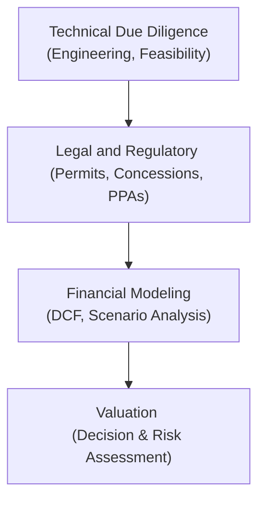
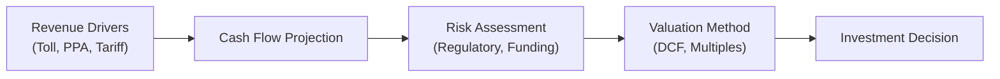

## Introduction

Infrastructure investments—spanning roads, bridges, energy pipelines, wind farms, and more—offer a unique blend of relatively stable returns, tangible assets, and long-term fiscal commitments. But they’re also famously tricky to get right. The first time I tried to parse a toll road feasibility study, I vividly remember that creeping doubt of “Have I considered everything?” That mixture of excitement and anxiety is normal because infrastructure is both a real-asset and a financial-asset category with some major complexities, such as regulatory oversight, big capital expenditures, and unpredictable market forces. Anyway, if you’re eyeing an infrastructure deal, you need a robust due diligence strategy and careful valuation to steer through potential pitfalls.

If you recall from our earlier discussions in Chapter 1 on private investments, we introduced the notion that private markets can be less liquid than public markets but often offer higher potential returns. Infrastructure fits beautifully under that umbrella, except it comes packaged with a whole range of specialized considerations—like environmental permissions, usage forecasts, public-private partnerships, and so on. Let’s explore the nuts and bolts of due diligence and valuation for infrastructure investments in detail, while also weaving in some real-life anecdotes and best practices that can help keep your analysis grounded.

## Key Steps in Due Diligence

Due diligence for infrastructure is usually more demanding than for other private investments because you’re dealing with a physical asset that is extensively regulated, has direct community impact, and often involves a multi-decade time horizon. Below is a high-level flowchart illustrating the typical progression of due diligence:

### Technical Review

• Engineering Feasibility: This is where independent feasibility studies or third-party engineering reports come into play. You might have an engineering consultant say something like, “Sure, building a desalination plant is doable, but you’ll need specialized membranes that degrade three times faster if pollution is above X level.” You can see how a small technical detail can cascade into unanticipated costs and operating constraints.  
• Capacity & Site Conditions: Be sure to review structural integrity, location advantages, usage capacity, and any external factors like soil conditions, supply chain accessibility, and climate patterns.  

### Legal and Regulatory Review

• Permitting & Licensing: Infrastructure projects are often governed by concessions from public authorities, such as a Power Purchase Agreement (PPA) for solar or wind farms. Analyze these evolving concessions carefully—if the contract states you get a guaranteed tariff for 20 years, that’s fantastic, but is it subject to political changes?  
• Environmental Compliance: Many governments impose environmental impact assessments (EIAs). Failing to meet them might cause project delays or even cancellations, so a thorough check of those requirements is critical.  
• Public-Private Partnerships (PPPs): If the project is structured around a PPP, check the alignment of interests. Scope out who’s responsible for cost overruns or timeline slippage.  

### Environmental Assessment

• Pollution & Resource Depletion: If you’re building an oil pipeline, for instance, is there a contingency plan for potential leaks?  
• ESG Constraints: In today’s world, no entity wants to be associated with ignoring environmental or social factors. So, you want to ensure the project integrates sustainability requirements and adheres to local regulatory standards or global frameworks.  

### Financial Review

• Debt Structure: Infrastructure projects are often heavily debt-funded. Lenders want robust coverage ratios and step-in rights if things go south.  
• Capital Expenditure (CapEx) Forecast: Underestimating CapEx is a common pitfall—especially if you’re dealing with greenfield projects (projects built from scratch). Double-check the modeling assumptions on inflation escalation, contract labor costs, and interest rates.  

There’s also the intangible “gut check” that I like to mention: Does the operational plan seem realistic and consistent with the broader market environment? If everyone is telling you that traffic volumes will skyrocket in a region with a shrinking population, be suspicious.

## Analyzing Projected Cash Flows

The heartbeat of any infrastructure investment is the projected cash flows. This might include toll collections in the case of a highway, or utility payments in the case of a regulated electricity grid. Usually, these are fairly predictable—assuming the usage or demand forecasts hold up. But always proceed with caution:

• Revenue Drivers: For power projects, you might have a PPA that fixes power tariffs. For a toll road, you might rely on traffic studies. If your concession agreement states that usage-based revenue will be priced at a certain inflation-linked rate, verify whether that indexing is unconditional or if it has a payment collar (a maximum or minimum).  
• Cost Structures: Operating costs (OpEx) and maintenance costs can escalate due to labor inflation, rising material costs, or changing regulations. Infrastructure deals often incorporate “lumpy” costs when major maintenance is required every few years, so smooth cost curves can be misleading.  

Regardless of your theoretical approach, always validate assumptions against real data when possible. If a neighboring toll road built five years ago saw usage 30% below forecasts, you should be extra careful about your usage assumptions.

## Valuation Approaches

When it comes to assigning a present value to these future cash flows, we typically rely on three main methods.

### Discounted Cash Flow (DCF)

This is the gold standard for infrastructure. Essentially, you forecast future free cash flows (FCF) and discount them back to the present using a Weighted Average Cost of Capital (WACC) that reflects the project’s unique risk profile:


\text{WACC} = \frac{E}{E+D} R_E + \frac{D}{E+D} R_D (1 - T)


where:
• \\( E \\) is the market value of equity,  
• \\( D \\) is the market value of debt,  
• \\( R_E \\) is the required return on equity,  
• \\( R_D \\) is the cost of debt, and  
• \\( T \\) is the corporate tax rate.

And the project’s value is:


\text{Project Value} = \sum_{t=1}^{n} \frac{FCF_t}{(1 + \text{WACC})^t}


For infrastructure, the keystones of the DCF approach are:  
• A stable forecast horizon: Many projects have 15 to 30+ year horizons.  
• Terminal Value: Sometimes, you’ll have residual asset value after the concession expires. Other times, the asset might revert to government ownership, so you can’t rely on a large terminal value.  
• Risk Premiums: If you sense heightened political risk (like a new toll might get legislated away), factor that into an upward risk premium.  

### Comparable Transactions or Multiples

Sometimes we rely on multiples such as EV/EBITDA or EV/EBIT. But infrastructure deals can vary drastically from one to another—there’s a big difference between a geothermal power plant in Southeast Asia and a regulated water utility in the UK. Multiples can offer a ballpark range or confirm if your DCF assumptions are in line with the market.  

You might say, “A recent transaction for a comparable toll bridge in a similar region sold at 12x EBITDA.” In that sense, you can cross-check your own model. But watch out for the differences in contractual nuances, operational constraints, or regulatory drivers that can shift the multiple drastically.

### Residual Land Value

Certain infrastructure projects (think airports, ports, rail yards, or prime real estate in city centers) might carry substantial standalone land value. In such cases, an additional approach might be:


\text{Value of Asset} = \text{DCF Value of Operations} + \text{Net Present Value of Underlying Land}


However, in large-scale projects with extensive regulations, sometimes you can’t just re-purpose that land easily. So consider how feasible it is to develop an alternative use for the property.

## Impact of Inflation Indexing, Escalation Clauses, and Regulated Tariffs

Infrastructure projects often rely on inflation pass-through. For instance, a utility might have a regulated tariff that’s adjusted annually for inflation. This can make the revenue stream more predictable. But be sure to parse the fine print:

• Some agreements have a time lag: If inflation picks up quickly, the tariff might adjust only a year later, affecting near-term cash flows.  
• Maximum or minimum caps: If inflation or input costs surge too high, is there a mechanism to recoup expenses, or do you bear the difference?  
• Regulatory Commissions: Keep an eye on whether a commission can unilaterally change the terms if inflation spikes beyond historical ranges.  

You’d be surprised at how even a short mismatch in inflation adjustments can eat into margins, especially when interest rates are climbing or if the local currency faces depreciation.

## Scenario Analysis and Sensitivity Testing

Scenario analysis involves painting multiple possible futures. Maybe, in your base case, you assume 3% GDP growth in the region, stable regulations, and moderate interest rates. But what if interest rates surge, depressing overall economic growth?

• Downside Scenario: A slump in economic activity might reduce traffic, cause cost of capital to spike, or push O&M costs higher.  
• Upside Scenario: Surging demand for your service could inflate usage rates. Just be careful to keep it realistic—wildly optimistic scenarios can cloud your judgment.  

Sensitivity testing is like scenario analysis but more surgical. You pick one variable (like inflation) and nudge it up or down by, say, 1%. See how that reverberates through the model. Then repeat for other drivers like exchange rates, labor costs, or regulatory changes. This helps identify your biggest risk exposures.

## Brownfield vs. Greenfield Considerations

### Brownfield Projects

Brownfield projects refer to existing infrastructure assets that are already operational—like purchasing a 20-year-old toll road. Typically, you have some track record of usage, maintenance costs, and reliability. However:

• Asset Condition: The older the infrastructure, the higher the maintenance cost.  
• Historical Data: On the plus side, you can see actual usage for the last several years, which can anchor your forecasts in reality.  

### Greenfield Projects

Greenfield investments are brand-new or still in the planning phase. They come with significantly greater uncertainty:

• Construction Risk: Are you building in difficult terrain? How about supply chain volatility?  
• Demand and Political Uncertainty: You might be counting on local population growth or industrial demand that fails to materialize.  
• Return Potential: Because of these higher risks, investors generally expect bigger returns. Still, many factors can blow up your timelines or budgets—like my friend once joked, “Who expects to find Rare Desert Tortoises in a brand-new highway site? Now we get to wait an extra 12 months for environmental clearance.”

Greenfield valuations also tend to rely heavily on third-party consulting opinions since your operational track record is essentially zero.

## Role of Independent Feasibility Studies

Imagine you’re looking at a hydroelectric dam that’s expected to produce 500 GWh of electricity per year. How sure can you be that rainfall patterns won’t vary drastically or that the reservoir can operate as projected? This is where properly done feasibility studies and engineering reports become invaluable. They provide specialized knowledge you likely don’t have, while also offering an independent assessment. Plus, if lenders are going to be part of the equation, they typically require such studies to even consider your financing request.

## Common Pitfalls and Best Practices

### Overestimating Traffic or Demand

Overly optimistic usage assumptions plague many infrastructure projections. Everyone wants to believe that a new toll road will acquire a lion’s share of traffic. Reality can be more conservative, especially when there are alternative routes or uncertain economic trends.

### Underestimating Operational Expenditures

Similarly, we often forget that roads, bridges, and power plants degrade over time. Maintenance costs can balloon, especially in harsh climates or if there’s a spike in commodity prices.

### Changes in Policy or Regulatory Environment

Political risk is huge for infrastructure. In some cases, local authorities might freeze your concession or reduce your regulated tariff if public opinion turns sour. Or a competing project receives a government subsidy that you lose out on.

### Lack of Contingency Planning

Build in contingencies in both your CapEx budget and your timeline. If your official plan doesn’t allow for unexpected delays (like additional engineering approvals, community protests, even archaeological findings—we’ve heard it all!), you’re setting yourself up for tough surprises.

## Putting It All Together in a Valuation Model

Imagine you have a 25-year toll road concession. You forecast traffic volumes that grow at 2% annually, collect an inflation-linked toll, and pay standard operating costs plus major maintenance every 5 years. You run a DCF with base, upside, and downside scenarios. You cross-check with an EV/EBITDA multiple from a recently traded toll road in the same region. Then, you review an independent engineering study that states your biggest risk is actually the uncertain geology, requiring a higher contingency reserve. Finally, you incorporate that revised cost into your DCF. If the updated IRR still meets your hurdle rate—which you’ve carefully set to match the project’s unique risk profile—then you might have a deal. The version of you that invests without that thorough process is playing with fire.

## Practical Example

Let’s walk briefly through a simplified example:

• You plan to invest in a toll bridge with a 20-year concession.  
• Estimated initial CapEx: $200 million, financed with 50% equity and 50% debt.  
• Forecast annual revenue: $40 million in Year 1, growing at 2% annually—assuming stable usage patterns.  
• Operating costs: $10 million in Year 1, also growing at 2%.  
• Major maintenance of $15 million every 5 years.  
• Weighted Average Cost of Capital (WACC): 8%.  
• Residual value: Assume zero after 20 years (the government reacquires the bridge).

We can set up the DCF calculation and discount the free cash flows for each of the 20 years, then sum them. This high-level approach would show if your net present value (NPV) is positive or negative. Of course, in practice, you’d refine these assumptions with deep scenario analysis and sensitivity checks—plus incorporate inflation pass-through if your toll rates are indexed.

## Diagram: Overview of Infrastructure Valuation Drivers

## Exam Relevance and Final Thoughts

In the CFA Level III context, you’re often going to see scenario-based or constructed-response questions that test whether you can properly identify inputs for an infrastructure DCF model, interpret key variables affecting a concession agreement, or adjust discount rates for political and macroeconomic risks. They test whether you can apply these concepts in a multi-asset portfolio context, as well. Infrastructure can serve as a diversifier or as an inflation hedge, depending on its regulated tariff structure.

So be prepared to demonstrate how you might incorporate scenario analysis, justify your discount rate, or highlight potential pitfalls. If you encounter an exam question about a toll road with questionable traffic forecasts, you’ll know how to question the underlying assumptions. Always be thorough, skeptical, and mindful of risk layering—not just the financial portions.

## References, Further Reading, and Resources

• Gatti, S. (2018). “Project Finance in Theory and Practice.” Academic Press.  
• Deloitte, KPMG, and PwC white papers on infrastructure due diligence best practices.  
• InfraDeals and InfraNews databases for comparable transaction data.  
• CFA Institute research on private investment valuation, including special considerations for illiquid assets.

Anyway, that’s about it. Do your due diligence, check your valuations, and keep your sense of realism handy! Infrastructure is a powerful addition to a private market portfolio, but it demands expertise and caution. Good luck, and may your tollway always be traffic-free (except for paying customers, of course).

## Test Your Knowledge: Infrastructure Due Diligence and Valuation Quiz



### Which of the following is the primary objective of the technical due diligence phase for an infrastructure project?

- [ ] To set the project’s concession period based on market demand.  
- [x] To verify engineering feasibility and validate assumptions about construction and operations.  
- [ ] To establish a project’s EBITDA multiple range for valuation.  
- [ ] To estimate the political risk premium for discount rate adjustments.  

> **Explanation:** Technical due diligence focuses on evaluating the feasibility, construction requirements, and operational parameters of the physical asset, ensuring that engineering, design, and operational assumptions are accurate.

### Which of the following best characterizes a regulatory tariff in an infrastructure investment?

- [ ] A market-based tariff determined entirely by consumer demand fluctuations.  
- [x] A pricing structure overseen by a governmental or regulatory body that can stabilize certain revenues.  
- [ ] A short-term contract for power purchase agreements typically renegotiated monthly.  
- [ ] A penalty imposed by a regulator to discourage private infrastructure participation.  

> **Explanation:** Regulated tariffs are often fixed or adjusted by regulatory authorities to ensure stability and fairness, making them a cornerstone in many infrastructure projects.

### In applying a DCF valuation to a 20-year infrastructure project with a guaranteed concession, which factor is most likely to reduce the present value of forecasted cash flows?

- [ ] Lower discount rates.  
- [ ] Escalation clauses that track inflation.  
- [ ] Shorter concession durations.  
- [x] Higher discount rates.  

> **Explanation:** A higher discount rate decreases the present value of future cash flows because they are discounted more steeply.

### Which of the following is a common challenge when using comparable transactions or multiples for infrastructure valuation?

- [x] Significant differences in contract terms, asset quality, and geographic/regulatory environments.  
- [ ] The methodology offers no guidance on actual market pricing.  
- [ ] Regulators prohibit using multiples in infrastructure transactions.  
- [ ] Infrastructure multiples are constant across asset types.  

> **Explanation:** Infrastructure assets vary greatly in their contractual frameworks, geographic risks, and other factors, making direct comparisons less reliable.

### What is the principal difference between brownfield and greenfield infrastructure projects?

- [ ] Brownfield projects cannot obtain debt financing, while greenfield projects can.  
- [x] Brownfield assets are already operational, whereas greenfield projects are built from scratch.  
- [ ] Brownfield assets have lower political risk than greenfield ones under all circumstances.  
- [ ] Greenfield projects always have higher EBITDA multiples than brownfield assets.  

> **Explanation:** Brownfield assets have an operational track record (thus often lower operational risk), while greenfield projects must be built from scratch and typically have higher uncertainty.

### Sensitivity testing in infrastructure valuation is primarily used to:

- [x] Adjust one variable at a time (e.g., interest rates, demand growth) to see the effect on project outcomes.  
- [ ] Combine multiple variables in a single scenario to predict a best or worst case.  
- [ ] Establish a guaranteed rate of return for project stakeholders.  
- [ ] Determine the project’s official environmental impact rating.  

> **Explanation:** Sensitivity testing focuses on changing individual variables one by one and noting the effect on the final valuation or IRR.

### In a scenario analysis for an infrastructure investment, which statement is correct?

- [ ] You must only create two scenarios: best case and worst case, to simplify the analysis.  
- [ ] Scenario analysis does not accommodate changes in macroeconomic drivers.  
- [ ] Scenario analysis only applies to toll road projects.  
- [x] Multiple scenarios (base, upside, downside) can be developed by altering key assumptions, such as GDP growth or regulatory changes.  

> **Explanation:** Scenario analysis involves creating several hypothetical outcomes by adjusting multiple factors—like traffic volume, interest rates, inflation—to assess the project’s resilience to changes.

### Which factor typically leads to a lower cost of capital for an infrastructure asset?

- [ ] Heightened uncertainty around usage demands.  
- [ ] The asset being in the earlier stage with no operating history.  
- [ ] Elevated political and regulatory risks.  
- [x] Stable, predictable cash flows governed by a regulated tariff or long-term contract.  

> **Explanation:** Stable and predictable revenue streams generally reduce the perceived risk for lenders and equity holders, thereby lowering the cost of capital.

### Which best describes a risk in inflation indexing for infrastructure?

- [ ] Lenders often prohibit indexing.  
- [x] Mismatched timing or caps on indexing can under-compensate the asset if inflation rises rapidly.  
- [ ] Inflation indexing has no effect on revenue streams.  
- [ ] Inflation indexing forces the investor to pay more taxes without revenue offsets.  

> **Explanation:** Although inflation indexing can provide a buffer, time lags and caps can lead to partial revenue shortfalls under rapid inflation environments.

### A project feasibility study should be performed by:

- [x] Independent engineering and consulting firms.  
- [ ] The project’s main sponsor only.  
- [ ] The lead lender to minimize conflicts.  
- [ ] Government agencies that have no direct stake.  

> **Explanation:** Independent consultants usually provide unbiased technical and operational insights, ensuring credibility and accuracy of the feasibility findings.


